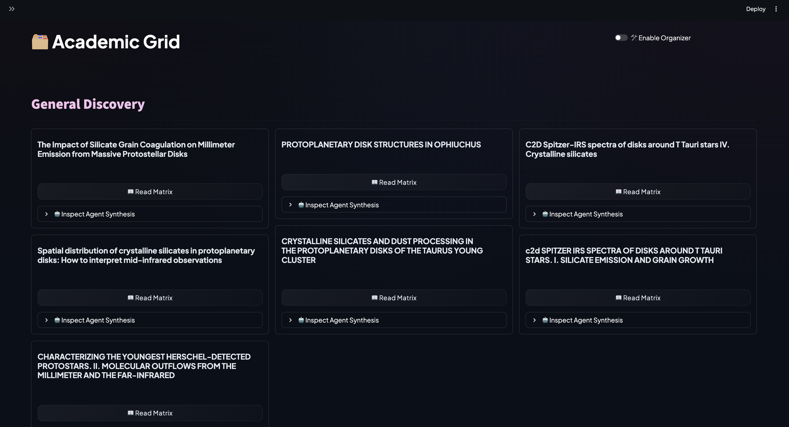
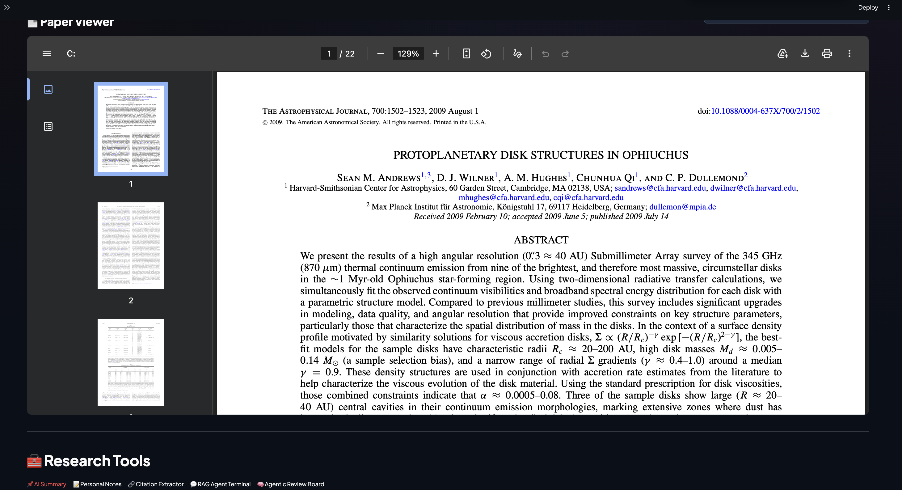
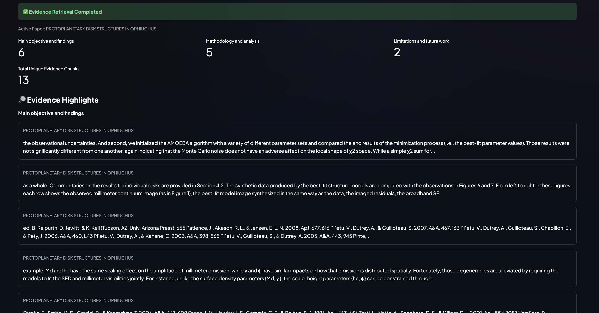
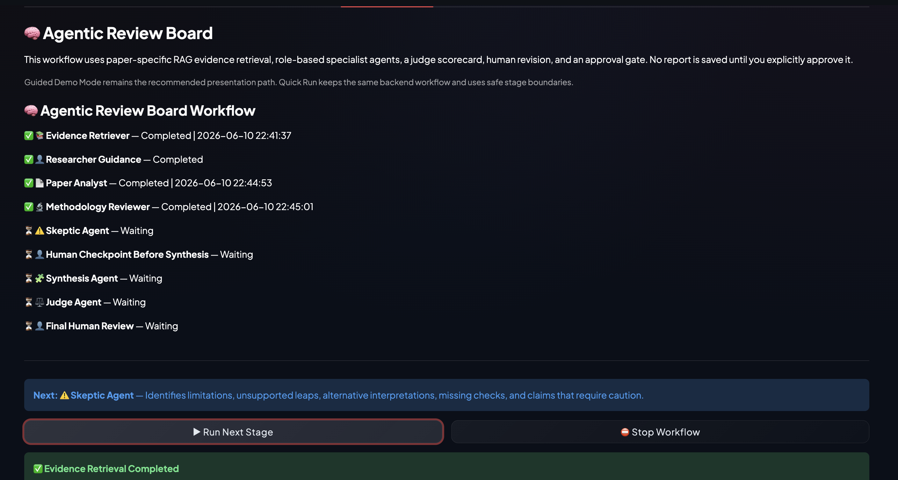
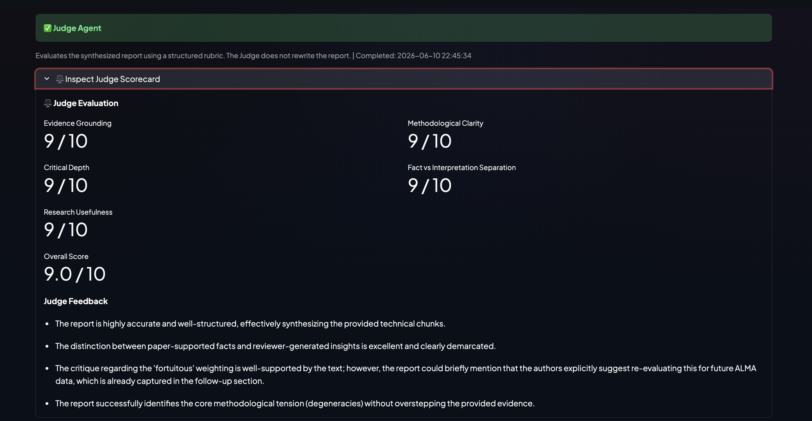
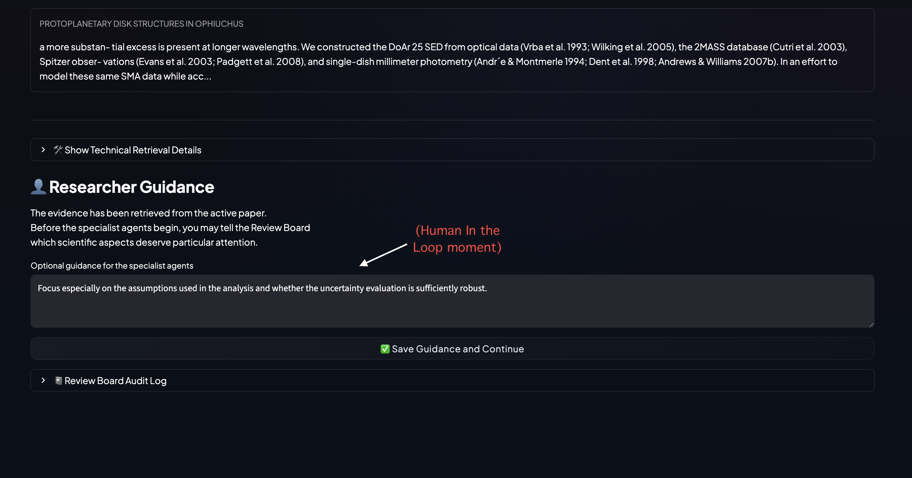
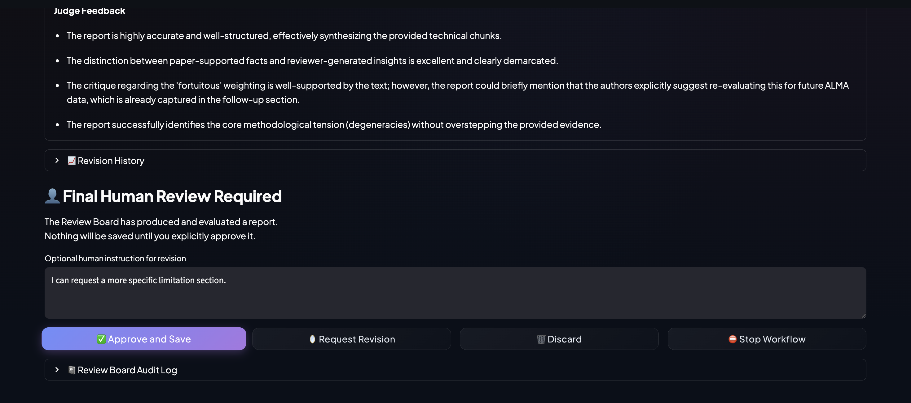
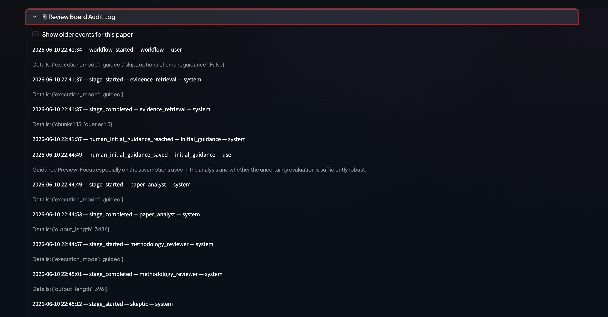

⭐ **[2026-1 Final-term Project - INDEX](../2026-1_Final-term_Project.md)**

# The Director's Report: Managing PaperAgent as a Digital Research Workforce

**Student Number:** 02512065  
**Name:** Rupam Kundu  
**Project:** PaperAgent  

---

## 1. What I Built

PaperAgent began as a practical tool for a problem I face regularly as a researcher: papers accumulate quickly, but the useful information inside them does not automatically become easier to manage. A PDF folder can store documents, yet it cannot help me remember why a paper mattered, compare its methods with another study, identify the assumptions behind its conclusions, or return to a specific discussion months later. For the midterm project, I built a local Streamlit application that could ingest PDF papers, extract text and metadata, enrich the records with arXiv information when available, generate summaries, organize papers by topic, save personal notes, extract citations, and answer paper-specific questions through retrieval-augmented generation (RAG).

For the final project, I did not want to add another isolated feature simply to make the application larger. I wanted to change the way PaperAgent *reasons about a paper*. The result is the **Agentic Review Board**: a visible, staged review workflow in which several role-based agents examine the same paper from different angles, a human researcher can intervene at meaningful checkpoints, a separate Judge Agent scores the resulting report, and nothing is permanently saved without explicit human approval.

The aim is not to automate the scientific reading process completely. It is to support it. PaperAgent is designed as a research assistant that can organize evidence, propose a structured review, and expose its own workflow clearly enough that the researcher can question, redirect, revise, or reject the result.



*Figure 1. The local Academic Grid. Papers remain organized in a simple library before any agentic analysis begins.*

---

## 2. Architecture and Design Decisions

### 2.1 From a paper reader to a managed workflow

The midterm version of PaperAgent already had a useful foundation. It could store papers locally, present them in a library, open an embedded PDF, maintain notes, and support a paper-specific chat interface. The final upgrade was built on top of that existing structure rather than replacing it.

The final opened-paper page now has a deliberately simple layout:

```text
Opened Paper Reading View
├── Full-width PDF viewer
├── Fullscreen PDF launcher
└── Research Tools tabs
    ├── AI Summary
    ├── Personal Notes
    ├── Citation Extractor
    ├── RAG Agent Terminal
    └── Agentic Review Board
```

The full-width PDF viewer remains at the top because the paper itself should remain the primary object. The AI tools appear below it rather than beside it. This may sound like a minor interface decision, but it reflects an important principle: the agentic system should assist the reading process without pushing the source material out of view.



*Figure 2. The final reading interface. The paper remains the dominant element, while the research tools are placed below it in tabs.*

I also retired an earlier **Interactive Text Mode** that allowed highlighting and text-level actions in a separate raw-text interface. It was technically interesting, but it distracted from the central purpose of the final project. Removing it made the application easier to explain, easier to maintain, and more focused on the workflow that mattered most.

### 2.2 RAG as the evidence layer

The first design choice was to keep the agents grounded in the active paper. A language model can write a fluent review even when it has not been given enough evidence. That is useful for brainstorming, but risky for research. PaperAgent therefore begins with **retrieval-augmented generation**, usually shortened to **RAG**.

In plain language, RAG means that the model is not asked to answer from its general memory alone. The application first searches the paper for relevant excerpts, then passes those excerpts into the model as context.

The flow is:

```text
Uploaded PDF
→ extracted text
→ overlapping text chunks
→ numerical embeddings
→ ChromaDB vector storage
→ similarity search for relevant chunks
→ selected evidence passed to the agents
```

The Review Board retrieves evidence under three broad categories:

- **Main objective and findings**
- **Methodology and analysis**
- **Limitations and future work**

This separation is useful because a paper's abstract alone is not enough for a serious review. The agents need evidence from the method, results, and discussion sections as well.



*Figure 3. Evidence retrieval is shown as a readable overview with grouped counts and highlights. Raw metadata remains available separately for technical inspection.*

The retrieval interface also changed during development. Initially, it displayed raw chunk identifiers, metadata dictionaries, and long unformatted excerpts. That was transparent in a technical sense, but it was not useful for a researcher trying to understand the result quickly. I therefore separated the evidence interface into two layers:

1. a clean, readable summary for normal use;
2. a technical-details expander for debugging and deeper inspection.

This distinction became important later in the project: transparency does not mean forcing the user to read debugging information at all times. Good transparency gives the user the *right level* of detail for the task.

### 2.3 Why I used multiple agents

The final Review Board uses a **pipeline orchestration** pattern. Each agent has a defined role and receives the output of earlier stages when necessary. The agents are not merely different personalities debating the same question. They perform different jobs.

```text
Evidence Retriever
→ Researcher Guidance
→ Paper Analyst
→ Methodology Reviewer
→ Skeptic Agent
→ Human Checkpoint Before Synthesis
→ Synthesis Agent
→ Judge Agent
→ Final Human Review
```

The roles are:

| Agent | Main responsibility | Why it is separate |
|---|---|---|
| **Evidence Retriever** | Finds relevant paper chunks for the review | Keeps the later analysis tied to the source paper |
| **Paper Analyst** | Identifies the research objective, central method, main findings, and evidence-backed claims | Establishes a clear first-pass understanding before criticism begins |
| **Methodology Reviewer** | Examines assumptions, validation, controls, and methodological weaknesses | Keeps methodological judgment distinct from general summary |
| **Skeptic Agent** | Looks for limitations, missing tests, alternative interpretations, and claims requiring caution | Adds deliberate critical pressure and reduces overly agreeable outputs |
| **Synthesis Agent** | Combines the specialist outputs into one coherent report | Produces a readable final artifact without erasing disagreements |
| **Judge Agent** | Scores the report using a rubric and provides feedback | Separates report generation from report evaluation |
| **Revision Agent** | Revises the report after a human request and Judge feedback | Supports iterative improvement while preserving human control |

The Review Board also uses **information asymmetry** intentionally. Every agent does not receive exactly the same prompt and responsibility. The Methodology Reviewer sees the earlier analysis but is asked to focus on method. The Skeptic Agent sees the earlier outputs but is asked to challenge them carefully. The Synthesis Agent receives the specialist outputs and any human guidance before producing a report. This makes the system more like a small research team and less like the same model repeating itself several times.



*Figure 4. The workflow tracker makes the orchestration visible. Completed stages, pending stages, and the next action are shown explicitly.*

### 2.4 Why I added a Judge Agent

The Synthesis Agent creates a polished report, but a polished report is not automatically a good report. Fluency can hide weak grounding, vague criticism, or a blurred line between evidence and interpretation. To address this, I added a separate **LLM-as-a-Judge** stage.

The Judge Agent scores the report using five criteria:

- **Evidence Grounding**
- **Methodological Clarity**
- **Critical Depth**
- **Fact vs Interpretation Separation**
- **Research Usefulness**

Each criterion receives a score out of ten, along with written feedback. The Judge does not rewrite the report. It evaluates it. This separation matters because the model that writes an answer may naturally favor its own structure or style. A separate evaluation step creates a clearer boundary between production and review.



*Figure 5. The Judge Agent produces a rubric-based scorecard and written feedback rather than a vague statement that the report is "good."*

### 2.5 Memory and traceability

PaperAgent has more than one kind of memory:

- ChromaDB stores embedded chunks from the uploaded papers for retrieval.
- `metadata.json` stores paper records, notes, and approved Review Board reports.
- `hitl_audit.jsonl` stores workflow events and human interventions.

This distinction is useful. Semantic memory answers the question, “Which paper excerpts are relevant?” Persistent workflow memory answers the question, “What happened during this review run, and what did the human approve?”

The audit trail is especially important for an agentic system. If a report is questionable, I should not have to guess how it appeared. I should be able to inspect the sequence of events that produced it.

---

## 3. Where the Humans Are in the Loop

The most important design question was not simply how many agents to add. It was **where human judgment should enter the workflow**.

If the human is asked to approve every small action, the application becomes slow and frustrating. If the human sees only the final output, the system becomes a black box. I therefore placed human checkpoints at boundaries where the meaning of the analysis can still change.

### 3.1 What remains automatic

The following tasks are automated:

- extracting the paper text;
- creating and storing embeddings;
- retrieving likely relevant evidence;
- running the specialist agents in sequence;
- synthesizing a draft report;
- scoring that report with the Judge Agent;
- writing compact workflow events to the audit log.

These are tasks where automation saves time without requiring the system to make the final scientific decision on behalf of the researcher.

### 3.2 Checkpoint 1: researcher guidance after retrieval

After the evidence has been retrieved, the workflow pauses. At this point, the researcher can inspect what the system found and tell the specialist agents what deserves particular attention.

For example:

```text
Focus especially on the assumptions used in the analysis and whether
the uncertainty evaluation is sufficiently robust.
```

This guidance is then passed into the Paper Analyst, Methodology Reviewer, and Skeptic Agent. The human is not rewriting the paper review manually, but is setting the direction of the analysis before the specialist agents begin.



*Figure 6. The first human checkpoint appears after evidence retrieval and before the specialist agents begin.*

This placement is deliberate. It allows the researcher to apply **epistemic taste**: the ability to decide which questions are worth asking. A generic system may treat every caveat as equally important. A human researcher knows that some uncertainties are central to the interpretation while others are minor technical details. This is the first implementation of a human-in-the-loop moment.

### 3.3 Checkpoint 2: human guidance before synthesis

After the Paper Analyst, Methodology Reviewer, and Skeptic Agent complete their work, the workflow pauses again before the Synthesis Agent merges the outputs.

This is another meaningful boundary. Once the specialist reports are combined into a polished narrative, weak emphasis can become harder to notice. The checkpoint lets the researcher inspect the separate analyses and provide guidance such as:

```text
Clearly separate the authors' conclusions from the Review Board's
interpretation, and emphasize the main methodological limitations.
```

The Synthesis Agent then receives that instruction along with the specialist outputs. This reduces the chance that a polished summary quietly smooths over an important disagreement.

### 3.4 Checkpoint 3: final human review

After the Judge Agent scores the report, PaperAgent still does not save anything automatically. The user sees a final review gate with four options:

- **Approve and Save**
- **Request Revision**
- **Discard**
- **Stop Workflow**



*Figure 7. The final approval gate. The report remains temporary until the researcher explicitly decides to keep it.*

If the user requests revision, the Revision Agent receives both the Judge feedback and a human-written instruction. The revised report is scored again, while earlier versions remain visible in the revision history.

This is a **Reflexion-style loop**, but it is not fully autonomous:

```text
Draft report
→ Judge feedback
→ human revision instruction
→ Revision Agent
→ Judge rescoring
→ human decision
```

I chose this structure because scientific responsibility should not be delegated entirely to an automated loop. The AI can propose improvements, but the researcher remains accountable for deciding whether the final report is useful and trustworthy.

### 3.5 Safe stopping rather than pretending to cancel everything

The workflow also supports safe stop and resume behavior. Since the application uses synchronous model calls, it does not pretend to cancel a model midway through generation. Instead, stop requests are applied at safe stage boundaries. Completed outputs are preserved, and the workflow can resume in the same session.

This is less dramatic than a real-time kill switch, but it is more honest and technically reliable. A good control mechanism should match what the system can genuinely guarantee.

---

## 4. The Failures I Saw — and the Lessons They Taught Me

The final application looks orderly, but it did not begin that way. The most useful part of the development process was seeing where a seemingly reasonable design became difficult to use or difficult to trust.

### 4.1 The first Review Board was still a black box

My initial instinct was to build the multi-agent pipeline and show the final report. Technically, several agents were working. From the user's perspective, however, the experience was still:

```text
Click one button
→ wait
→ receive a long report
```

That did not communicate the difference between a single prompt and an orchestrated workflow. It also made it harder for the user to question intermediate reasoning.

**Lesson:** In an agentic system, visibility is part of the architecture, not a cosmetic extra.

**Change made:** I added Guided Demo Mode, a visible stage tracker, inspectable agent outputs, a readable evidence view, a Judge scorecard, revision history, and an audit log viewer.

### 4.2 Retrieved evidence was technically correct but visually poor

The early evidence panel displayed raw chunk IDs, metadata dictionaries, and long excerpts. Some chunks were useful. Others included bibliography-like text. One of the screenshots from the final version still shows why this remains a real limitation: heuristic retrieval can occasionally surface a reference-heavy chunk among otherwise useful excerpts.

**Lesson:** Retrieval quality is not binary. A vector database can return semantically related text that is still unhelpful for the task.

**Change made:** I grouped evidence by purpose, displayed readable highlights, hid raw metadata inside a technical expander, and added lightweight filtering to deprioritize bibliography-like chunks when better evidence is available.

**Remaining limitation:** The filtering is heuristic. A future version should store page and section metadata during ingestion and use stronger reranking.

### 4.3 Human involvement originally happened too late

At one stage of development, the user could approve or reject the final report, but could not meaningfully steer the analysis earlier. That technically counted as human approval, but it did not feel like genuine human-in-the-loop management.

**Lesson:** Checkpoint placement matters more than the mere presence of a button labeled “Approve.”

**Change made:** I added researcher guidance immediately after retrieval and another checkpoint before synthesis. This allows the human to influence both the specialist analysis and the final consolidation.

### 4.4 The side-by-side interface became too cramped

The original opened-paper layout placed the PDF and analysis tools beside each other. As the Review Board grew, the analysis panel became long and narrow. The workflow was difficult to read and poor for presentation.

**Lesson:** A growing agentic workflow needs space. Interface layout affects whether users can understand the system they are managing.

**Change made:** I moved the PDF to a full-width top section and placed the research tools below it in tabs.

### 4.5 The first fullscreen patch broke the PDF viewer

I wanted a fullscreen PDF option, but the first approach replaced the stable embedded renderer with a more fragile wrapper. The paper disappeared from the main page.

**Lesson:** A convenience feature should not become responsible for the core reading path.

**Change made:** I restored the original embedded viewer and added a safer fullscreen launcher that opens the PDF separately in the browser-native viewer.

### 4.6 Workflow state needed deliberate design

As the workflow grew, it accumulated several states: waiting, running, completed, paused, awaiting human input, approved, discarded, and error. Earlier versions mixed ad hoc status strings with an unused enum, and the tracker referenced a running flag that was never updated.

**Lesson:** Managing agents is partly a state-management problem. A workflow cannot be trustworthy if it cannot explain where it is.

**Change made:** I separated overall workflow states from per-stage statuses and tied the visible tracker directly to those explicit values.

### 4.7 The audit log made the invisible work inspectable

The audit trail records both automated stages and human decisions. A shortened excerpt from one run looks like this:

```text
2026-06-10 22:41:34 — workflow_started — workflow — user
2026-06-10 22:41:37 — stage_started — evidence_retrieval — system
2026-06-10 22:41:37 — stage_completed — evidence_retrieval — system
2026-06-10 22:41:37 — human_initial_guidance_reached — initial_guidance — system
2026-06-10 22:44:49 — human_initial_guidance_saved — initial_guidance — user
2026-06-10 22:44:49 — stage_started — paper_analyst — system
2026-06-10 22:44:53 — stage_completed — paper_analyst — system
2026-06-10 22:44:57 — stage_started — methodology_reviewer — system
2026-06-10 22:45:01 — stage_completed — methodology_reviewer — system
```



*Figure 8. The audit log records the workflow sequence and human interventions. Compact previews are stored rather than the full paper context.*

The log is not only for debugging. It changes the relationship between the user and the AI system. Instead of accepting a result on trust, the user can inspect the path that produced it.

---

## 5. Critical Reflection on Management

### 5.1 Leading an AI workflow is different from writing a normal program

A traditional program is comparatively direct:

```text
input
→ predefined logic
→ output
```

An agentic workflow behaves differently:

```text
input
→ retrieved evidence
→ model interpretation
→ specialist handoff
→ evaluation
→ possible human correction
→ revision
→ approval
```

The model outputs are probabilistic. A good prompt reduces uncertainty, but it does not eliminate it. This changed my role from simply writing functions to managing a digital workforce. I had to decide:

- which roles should exist;
- which agent should see which information;
- where an output should be challenged;
- where a human should intervene;
- which state transitions are safe;
- what must be logged;
- and what should *not* be automated.

The coding remained important, but the more difficult task was designing the relationships between the components.

### 5.2 The risk of alignment drift

One risk in a multi-stage workflow is **alignment drift**. A report can become smoother and more confident as it moves through the pipeline while gradually moving away from the actual evidence.

PaperAgent counters that risk in several ways:

- RAG grounds the workflow in retrieved excerpts from the current paper.
- The Methodology Reviewer focuses on assumptions and validation.
- The Skeptic Agent is instructed to identify unsupported leaps and alternative interpretations.
- The Synthesis Agent is asked to distinguish evidence from interpretation.
- The Judge Agent explicitly scores fact-versus-interpretation separation.
- Human checkpoints allow the researcher to redirect the workflow.
- The audit log preserves the path taken.

None of these controls guarantees a perfect report. Together, however, they make unsupported confidence easier to notice.

### 5.3 More agents are not automatically better

At first, adding agents can feel like an obvious improvement: one more role seems to promise one more layer of intelligence. In practice, every additional agent also increases latency, API usage, duplication, and the number of handoffs that can introduce drift.

I think the current set is a reasonable balance for a single-paper review. The Paper Analyst, Methodology Reviewer, and Skeptic Agent each have a clearly distinct purpose. The Synthesis Agent and Judge Agent serve separate coordination and evaluation functions. The Revision Agent appears only when the human requests it.

In hindsight, I would resist adding another agent unless it had a narrow, defensible responsibility. A future **Citation Verifier Agent** could be worthwhile if it checked page-level evidence references. A generic “extra reviewer” would probably add repetition rather than value.

Under stricter latency limits, I might combine the Paper Analyst and Methodology Reviewer into one stage. I would keep the Skeptic Agent separate because deliberate criticism is valuable, and I would keep the Judge Agent separate because generation and evaluation should remain distinct.

### 5.4 The irreplaceable human skill: epistemic taste

The most valuable human contribution is not clicking an approval button. It is **epistemic taste**.

A researcher can recognize that two caveats are not equally important. One may be a minor implementation detail; the other may weaken the central interpretation of the paper. A model can list both fluently, but the human must decide where attention belongs.

The human also carries responsibility. If a report is saved, cited, or used to guide a research decision, someone must be accountable for that choice. In PaperAgent, the AI can retrieve, summarize, criticize, synthesize, score, and revise. It cannot decide what the researcher should ultimately trust.

---

## 6. What I Would Do Differently — and What I Would Build Next

### 6.1 Design the checkpoints before building the agents

I initially focused on getting the pipeline to work. Only later did I ask whether the human could meaningfully intervene. If I started again, I would design the checkpoint map first:

```text
Where can the system act automatically?
Where can a wrong interpretation still be corrected?
Where must a human decision be recorded?
```

That would have prevented the early black-box version of the Review Board.

### 6.2 Define the state model and audit schema earlier

The workflow-state cleanup was necessary because the application grew incrementally. A better approach would be to define the workflow states, stage statuses, and audit event schema before adding the user interface.

This is especially important for agentic applications, where “what happens next?” is often more complex than the model prompt itself.

### 6.3 Improve provenance during ingestion

The current retrieval layer can still surface imperfect chunks. A stronger version should attach page numbers and section labels during PDF ingestion. The evidence panel could then display:

```text
Methods, page 4
Discussion, page 12
Appendix B, page 18
```

I would also add a reranking stage that prioritizes scientific content over references and boilerplate text more reliably.

### 6.4 Add cross-paper analysis carefully

The current Review Board focuses on one active paper. A useful next step would be cross-paper RAG, allowing questions such as:

```text
How do these papers differ in their assumptions about disk structure?
Which limitations recur across this group of studies?
```

This should be added carefully because cross-paper retrieval increases the risk of mixing evidence from different sources. Clear provenance would become even more important.

### 6.5 Consider MCP later, not automatically

The course introduced the Model Context Protocol (MCP), but I chose not to implement it in this project. That was deliberate. MCP could make tools reusable across compatible clients, but it would not directly solve the central research-management problem I wanted to address.

A future MCP server could expose retrieval, metadata lookup, citation extraction, or saved-review access as reusable tools. For this version, I preferred to make the Review Board understandable and reliable rather than adding a protocol layer for breadth alone.

### 6.6 Persist unfinished workflows only if the added complexity is justified

Approved reviews persist permanently, but unfinished Review Board runs remain session-scoped. A future version could recover interrupted runs after a restart. That would be useful for long reviews, but it would also require more careful persistence, migration, and cleanup logic.

For the current project, preserving approved outcomes while keeping unfinished runs temporary was a reasonable trade-off.

---

## 7. Conclusion

PaperAgent changed significantly during the final project. It began as a local paper-management and RAG application. It became a visible, human-guided review workflow with specialized roles, staged evidence retrieval, rubric-based evaluation, revision, approval gating, and audit logging.

The main lesson was not that more automation is always better. The more useful lesson was that an AI workflow needs management. It needs clear responsibilities, evidence boundaries, checkpoints, traceability, and an honest account of what the system cannot guarantee.

The final Review Board does not replace scientific judgment. It organizes work around that judgment. The AI agents help retrieve evidence, identify patterns, raise questions, and draft a review. The researcher remains responsible for deciding which questions matter and which conclusions deserve to be kept.
