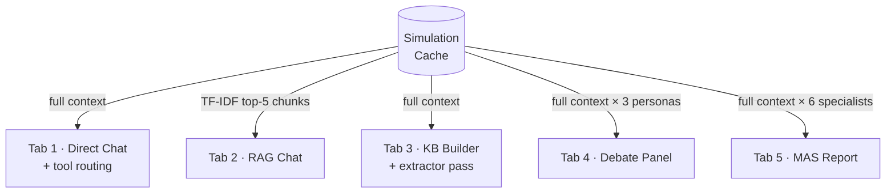
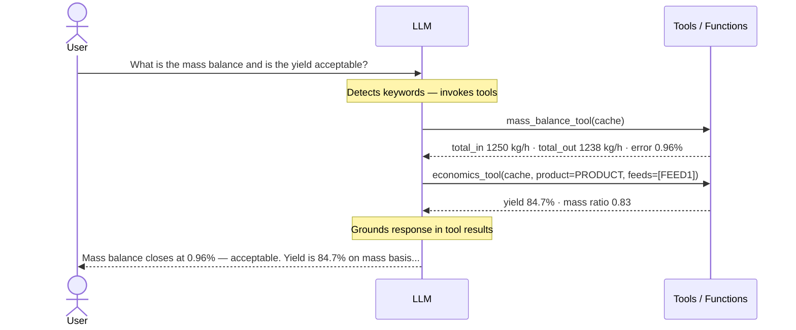
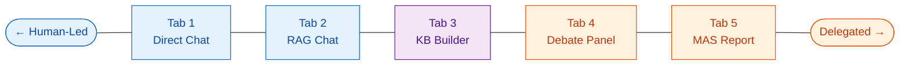
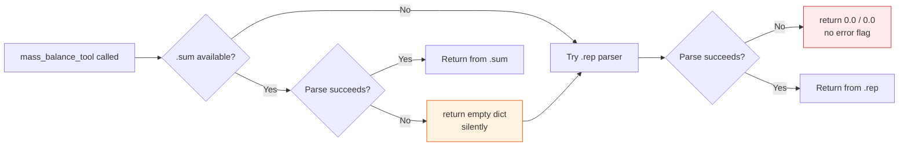

⭐ **[2026-1 Final-term Project - INDEX](../2026-1_Final-term_Project.md)**

# AspenChat - Director's Report

*Critical analysis of managing an agentic AI system for chemical process simulation*

---

## What I Built

AspenChat converts an Aspen Plus simulation file into a conversational workspace with six agent modes. The idea was to map how engineering review actually works: one person retrieves facts, another builds institutional notes, a third stress-tests assumptions, a fourth writes the formal report. Each of those roles became a tab. The system takes a `.bkp` file, preprocesses it into a compressed knowledge cache, and gives engineers six ways to interact with their simulation depending on what the task requires, from a quick factual query to a full automated audit.

---

## Architecture and Design Decisions

Five patterns from the course were applied to see and test their appropriateness for assisting in process simulation analysis workflow. The table below maps each tab to its architecture, and the diagram shows how the simulation context flows into each.

| Tab | Pattern | Context strategy | Agent structure | Output |
|---|---|---|---|---|
| 1 · Direct Chat | Single agent + tools | Full context in prompt | 1 LLM, 5 callable tools | Conversational answer |
| 2 · RAG Chat | RAG | Top-5 chunks via TF-IDF | 1 LLM | Scoped answer |
| 3 · KB Builder | Memory + self-reflection | Full context in prompt | 1 LLM + secondary extractor | Answer + KB entry |
| 4 · Debate Panel | Multi-agent, evaluation | Full context, shared across 3 | 3 personas sequentially | Structured verdict |
| 5 · MAS Report | Multi-agent pipeline | Full context per specialist | 6 specialists + Report Writer | Formatted summary |

### Tab 1 · Tool Use and the ReAct Loop

Tab 1 is where the system transitions from a plain text chatbot into an actionable agent. The LLM does not just respond to the query — it can invoke tools mid-reasoning, receive numerical results, and ground its answer in actual simulation data before replying.

The sequence below shows the function calling loop in action. The three lifelines are the user, the LLM, and the local tool functions. Read top to bottom, it is a single query that triggers two tool calls before a final answer is produced.

This is the core pattern that makes Tab 1 more than a retrieval interface. The five available tools (mass balance, economics, flowsheet graph, stream comparison, calculator) are invoked automatically based on keyword detection in the query, not through explicit API calls by the user.

### RAG - Tab 2

A full simulation context can run to more than 50,000 tokens for a single flowsheet. Loading all of it into every query is expensive and noisy. Tab 2 chunks the cache by section headers, builds a TF-IDF index, and retrieves the top five relevant chunks per query. TF-IDF was chosen over a vector embedding store deliberately. This is a closed-domain corpus with predictable engineering vocabulary, and TF-IDF is interpretable and fast without a separate embedding service.

### Multi-Agent - Tabs 4 and 5

Two distinct multi-agent strategies were used, each for a different purpose.

**Tab 4 (Debate Panel)** uses a three-persona deliberation pattern. A Process Engineer argues validity, a Skeptic identifies weaknesses, and an Arbitrator renders a verdict. The goal is adversarial coverage, forcing a critical perspective rather than letting the model agree with its own initial framing.

**Tab 5 (MAS Report)** uses a pipeline specialist pattern. Six agents each cover one domain (topology, thermodynamics, mass balance, unit operations, performance, economics), then a seventh Report Writer synthesizes their findings into a formal document. In practice this functions as an automated summary pass: the agents ask the questions a human engineer would ask, just without the human present. The output is a well-formatted readable summary of the simulation, not a true multi-agent analysis where agents learn from each other.

### Memory - Tabs 3 and Sessions

Two forms of memory were implemented. The Knowledge Base started as a planned connected graph representation of the flowsheet, something closer to a knowledge graph with linked nodes for streams, units, and assumptions. In practice it ended up as a conversation-driven report compiler: every response triggers a fact extraction step that appends to one of eight structured sections. It turned out to be useful in its own right. The engineer asking questions is, without knowing it, authoring a report. Their investigation becomes the document. Session files capture the full conversation state, KB content, and agent outputs as timestamped JSON, enabling restore across sessions.

### HITL and Evaluation

Checkpoint placement and the evaluation layer are where the design is most interesting, and where it is most imperfect. Both are addressed in the next two sections.

---

## Where the Humans Are in the Loop

Each tab was designed as a different experiment in human-agent collaboration. The question behind all six is the same: where in the process of understanding a simulation does human judgment add the most value, and where does it add friction without benefit? The tabs sit along a single spectrum from fully human-led to fully delegated. A quadrant would imply four distinct zones; in practice the distribution is a line.

### Tab 1 - Direct Chat: Fine-Grained Context Control

The engineer drives the conversation with the full simulation context available on every turn. The practical advantage is control: you can decide which documents or context to include in each query rather than relying on automatic retrieval. This makes it well-suited to someone who already knows the structure of the files they are feeding and wants to target specific parts of the simulation deliberately.

The agent is transparent throughout. Every response is one question away from correction, and the tool results are visible when invoked. The weakness is that it requires the engineer to have that existing familiarity. For someone encountering an unfamiliar flowsheet, this tab alone is slow to build a picture.

### Tab 2 - RAG Chat: Context Management at the Cost of Retrieval Reliability

The retrieval mechanism (TF-IDF indexing over chunked sections) selects the context, not the agent. The agent sees only what the retrieval returns. This is a meaningful distinction: transparency here is handled by surfacing which chunks were retrieved rather than by giving the engineer direct control.

The advantage is context management at scale. The disadvantage is that the retrieval needs to be well-configured for the domain, and for process simulation this is hard. A flowsheet is a connected graph. Every stream table relates to the units upstream and downstream of it. Vanilla chunk-based indexing breaks that connectivity — retrieving a stream section in isolation loses the surrounding process context. The result is that RAG works for isolated factual lookups but struggles with any question that requires understanding how parts of the simulation relate to each other. The current TF-IDF strategy is underdeveloped for this use case and should be considered a starting point rather than a solution.

### Tab 3 - KB Builder: The Most Useful Architecture

Of the five tabs, this one works best in practice. The engineer has appropriate control (they ask the questions, they can edit the KB), while the assistant handles retrieval, calculation, and note-taking automatically. It feels like having a capable assistant in the room who documents what you discover as you discover it.

The KB started as a planned knowledge graph with connected nodes for streams, units, and assumptions. In practice it became a conversation-driven report compiler, and that turned out to be more useful. The engineer's investigation path becomes the document's structure. For the core task of progressively building understanding of a simulation, this is the right architecture: human-led with delegation to the agent for the mechanical work.

### Tab 4 - Debate Panel: Useful for Initial Framing, Not Reliable for Conclusions

In testing, the Debate Panel reached wrong conclusions roughly half the time, which makes it worse than the MAS Report for structured analysis. The MAS Report is more grounded because each specialist has a defined scope and a preprogrammed prompt; the Debate Panel, by contrast, can spiral as the Skeptic generates critique and the deliberation drifts from the actual simulation data.

That said, it has a specific use. For quick initialization of an unfamiliar simulation, the debate surfaces questions the engineer might not have thought to ask. The adversarial framing prompts deeper thinking even when the conclusions are wrong. It is more useful as a prompt generator than as a verification tool, and should be read that way.

### Tab 5 - MAS Report: Decent Automated Summary, Not True Multi-Agent Analysis

The MAS Report is more grounded than the Debate Panel because the agentic flow is structured: each of the six specialists has a defined role and scope enforced by the prompt system. The output is a well-formatted, human-readable summary of the simulation.

The honest characterization is that it functions like the KB Builder but without the human asking the questions — the agents ask on their behalf, driven by preprogrammed prompts. For a quick structured overview of an unfamiliar simulation it is useful. It does not involve true inter-agent collaboration; agents do not learn from or correct each other, and the Report Writer synthesizes without flagging contradictions.

### What the Spectrum Reveals

The most autonomous tabs (4 and 5) produced the most polished outputs. They were also the hardest to audit. The tab that proved most useful in practice (Tab 3) sits in the middle of the spectrum, where the human remains engaged but delegates the mechanical work. That is the point on the spectrum that felt right for this task. The fully delegated end produces output that looks authoritative and is the least checked; the fully human-led end gives the most control but is slow without the scaffolding the other tabs provide.

---

## The Failures I Saw - And the Lessons

### 1. Domain Knowledge Limitation and the Loss of Structured Context

The models used in this project are Gemini 2.0 Flash and Flash Lite for cloud inference, and local Llama-based models via Ollama. From actual testing it is clear that neither family is deeply familiar with Aspen Plus simulation documents, and the problem goes beyond format recognition. Chemical process engineering is a domain where almost every question requires understanding the entirety of the flowsheet. Stream compositions depend on upstream unit operations. Energy balances tie to downstream equipment. A mass balance question is not answerable from the stream table alone — it requires understanding what the process is doing and why. Picking sections out of context and expecting reliable answers is hard to implement well, and this is exactly what makes the RAG approach problematic for this use case.

The direct chat tab works better than RAG in practice because it gives the model the full context and lets it reason over the whole simulation. Current Gemini models do carry some chemical engineering knowledge, which helps. But the context window still runs out on large flowsheets, and when the model gets something wrong, the user must be familiar enough with the simulation to notice. That is a significant burden to place on a tool that is supposed to help engineers understand a simulation they may not yet know well. The MAS Report has the same problem from a different angle: for the user to catch agent mistakes in the report, they need to have already studied the flowsheet themselves. At that point the report provides less value.

The Debate Panel makes this most visible. When running with Gemini 2.0 Flash Lite, it reached wrong conclusions roughly half the time. In one concrete case, the agents flagged a discrepancy between two values for the same variable and concluded the simulation had inconsistencies. What they were actually seeing was the difference between a specified input value and a calculated converged value, which is exactly how Aspen Plus stores results — every converged simulation will have these read/write differences. An engineer recognizes this immediately. The agents did not. This is not a retrieval or architecture failure; it is a domain knowledge gap that no amount of context chunking or persona differentiation resolves without better grounding.

### 2. LLM Compression Abandoned

Early in development, a second LLM pass was added to compress the rule-stripped simulation report before caching, with the goal of fitting the context into local models. The assumption was that if tokens were reduced enough, smaller open-source models running on local hardware could be used instead of the Gemini API, which matters for confidential simulation data.

This did not work out, and the reason is not primarily the context window. Local models simply do not have adequate chemical engineering domain knowledge. Reducing the token count does not fix an underlying capability gap. On top of that, LLM compression introduces transparency problems: the compressed cache is a lossy summary, and there is no reliable way to verify that critical values were preserved. The instruction to "compress without losing data" is aspirational. A model deciding what counts as data will make different choices than an engineer would.

The pipeline was rolled back to code-based stripping only: removing headers, blank lines, continuation banners, and structural boilerplate using rules, without any LLM interpretation step. Less aggressive, but the contents of the cache are predictable and auditable.

### 3. Tool Brittleness from Structural Variance

Aspen Plus simulation and report structure varies between different cases, configurations, and versions. The parsing tools were built around specific file formats and regex patterns for the simulations tested during development. When the structure changes — different column widths, different section headers, different naming conventions — the parsers fail silently.

The most dangerous instance is the mass balance tool. It tries the `.sum` file first, then falls back to the `.rep` parser. If `.sum` parsing fails it returns an empty dict without surfacing the error. If `.rep` parsing also fails, the tool returns `total_in: 0.0, total_out: 0.0`. That looks like a perfect mass balance, not a parse failure.

The fallback chain exists to handle the reality that not all simulation exports produce all file types. It is the right instinct. The problem is that failing gracefully and failing silently are different things. A tool that cannot parse the file should say so. "0% error" is a misleading answer.

### 4. Knowledge Base Drift Over Extended Sessions

KB fact extraction asks the LLM to identify "one new engineering fact not already in the KB." But the KB content passed to the extractor is truncated at 2,000 characters. As the KB grows beyond that, older entries become invisible to the duplicate check, and contradictions or near-duplicates accumulate without any flag.

The KB starts as a reliable record and degrades over long sessions into a collection of individually plausible statements that may not be mutually consistent. Every entry carries a timestamp comment (`<!-- 2026-06-11 14:32 -->`), so the chronological record is readable, but there is no conflict detection and no diff. Reconstructing which conversation turn produced a given entry requires reading back through the session manually.

---

## Critical Reflection on Management

### Clarity Should Come from the Human

Managing an AI workflow means specifying intent, then continuously auditing whether the agents are interpreting that intent correctly. The gap between what you asked for and what you got is the management problem.

Adding a middle layer to translate vague instructions into clearer agent prompts does not remove ambiguity — it shifts it into another problem that may be equally complex. Clarity should originate from the human. The agent can sometimes infer intent well enough, which is useful for efficiency, but relying on that inference for a technical domain like process simulation is risky. This project reflects that view: the tabs that perform best are the ones where the engineer explicitly controls what context is fed and what question is asked. The tabs that fail most visibly are the ones where the system tries to infer what analysis is needed.

There is a real tradeoff here. More ambiguity allows greater flexibility and makes better use of the model's capabilities, but increases uncertainty, especially on things the model is not familiar with. More clarity requires more human effort and can reduce the system to something closer to conventional programming. In practice, for this domain, leaning toward clarity was the right call. Chemical process simulation is too specialized and too interconnected for vague delegation to work reliably.

### On AI Consensus vs. Expert Judgment

The Debate Panel raises a useful question: is a verdict from three AI personas more persuasive than the judgment of one domain expert? In terms of appearance, yes. Three agents producing a structured verdict with a named Arbitrator looks authoritative. In terms of reliability, no. The three personas share the same underlying model and the same context window. They reinforce the same patterns rather than provide genuinely independent perspectives. The consensus is stylistic, not epistemic.

AI systems can appear more persuasive than they are because they are accessible and interactive. A user can keep asking follow-up questions, get elaborated responses, and build a sense of engagement that feels like understanding. That interactivity makes them easy to rely on, even when the underlying reasoning is not sound. The MAS Report has the same risk: a ten-section formal report with numbered tables looks like something an expert produced. A simulation engineer is more likely to trust it than verify it, precisely because of how it is formatted.

The lesson for this project is that the persuasiveness of the output format should not be taken as a signal of correctness. Human expert judgment is still necessary to verify results and connect them to real-world context. That is not a limitation to engineer around — it is the correct scope for HITL.

### Where I Would Place More or Fewer Agents

**More agents:** The Debate Panel needs a fourth role, a Domain Verifier that checks specific numerical claims against raw tool output rather than against the simulation narrative. "The Process Engineer claims 87.3% yield. The mass balance tool returns 82.1%. Flag this discrepancy." Without that, the debate stays literary rather than quantitative.

**Fewer agents:** The six MAS specialists are probably four too many. Topology and Unit Operations cover largely the same ground. Thermodynamics and Mass Balance overlap heavily. Two agents (one for process validity, one for economic viability), each with access to all tools and each other's findings, would produce more coherent output than six sequential single-domain passes.

More agents does not mean more coverage. It means more surface area for hallucination, more synthesis steps where errors compound, and more apparent authority for a report that may have been collectively wrong in a distributed way.

### The Irreplaceable Human Skill

AspenChat can retrieve mass balance closure, recycle ratios, and energy penalty. It cannot tell you whether the simulation's design basis is appropriate for the actual process. Whether the thermodynamic package fits the chemistry, whether the assumed feed composition reflects plant reality, whether the economic assumptions are current: those judgments require domain knowledge and contextual awareness that does not exist inside the simulation file.

That is the right scope for HITL — not approving every response, but being present at the boundary between what the model knows and what the process engineer knows. Agents handle retrieval and synthesis. Engineers handle interpretation and decision.

---

## What I Would Do Differently / Next

**Add structured logging first.** Every LLM call, tool invocation, cache operation, and KB write should produce a log entry, not for debugging but for accountability. If an engineer makes a design decision based on AspenChat output and it is wrong, there is currently no way to reconstruct what the system said and why. That is not an acceptable condition for a tool used in engineering contexts.

**Implement checksums on cache content.** Before LLM compression, extract all significant numeric values (stream flows, temperatures, yields). After compression, verify they are still present. Missing values should reject the cache and alert the user. That single change closes the most dangerous silent failure mode in the system.

**Give the Debate Panel a domain-grounded rubric before any persona speaks.** The architectural fix of independent data slices matters, but the more urgent problem is that the agents do not understand Aspen Plus output conventions. A pre-debate context block that explains what read/write value differences mean, what a converged simulation looks like numerically, and what would genuinely indicate an inconsistency would prevent the class of wrong conclusions seen in testing. The rubric should be structured debate topics, not free-form adversarial prompting, at least until the model can reliably distinguish simulation artifacts from real problems.

**Add a contradiction layer to the MAS pipeline.** Between specialist agents and the Report Writer, a Contradiction Detector should read all six findings and flag numerical or logical inconsistencies before synthesis. The Report Writer should receive a flagged input.

**Give the KB a coherence budget.** Set a maximum size. When reached, run a consolidation pass that de-duplicates and surfaces contradictions before allowing new entries. The current unbounded append model will degrade any long-running session.

**Rethink the cache as a validation contract.** The cache is currently a performance optimization: load once, reuse forever. It should also be a trust checkpoint. The first load should hash critical simulation values. Every subsequent load should verify the hash. If the simulation file changed since the cache was built, the user should be told.

The core lesson: the real management challenge in an agentic system is not orchestration but observability. Orchestration (who runs, when, with what input) is an engineering problem. Observability (what actually happened, why it produced this output, what to trust) is the management problem. I built the orchestration. The observability is almost entirely absent. That is the debt I would pay first.

Beyond the current scope, this work could be extended from understanding a simulation to interacting with one. MCP tools connected directly to Aspen Plus would let the engineer manipulate and adjust the simulation through natural language — changing feed conditions, running sensitivity analyses, updating specifications — rather than only reading and interpreting the output. That closes the loop between analysis and action in a way the current system cannot. It is outside the scope of this version, but it is the natural next step.

---

*AspenChat - an honest account of a digital workforce that needed better oversight than it got.*
