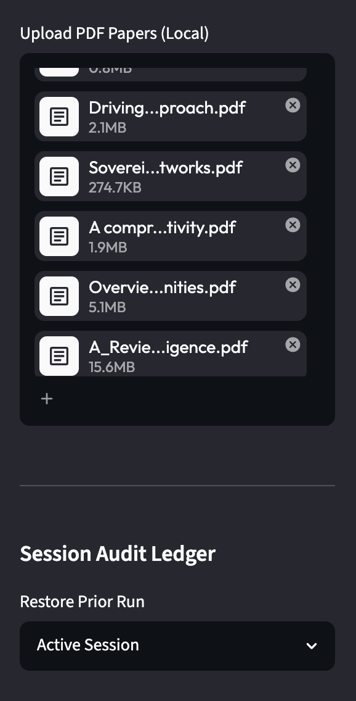
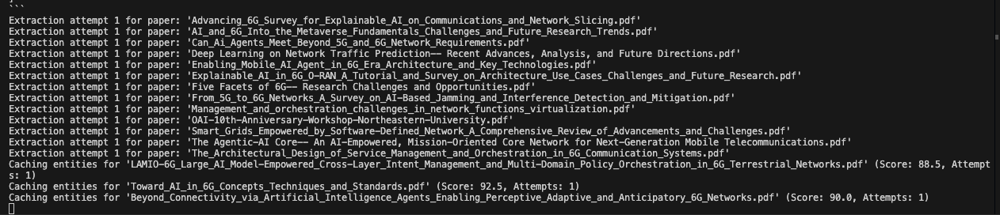
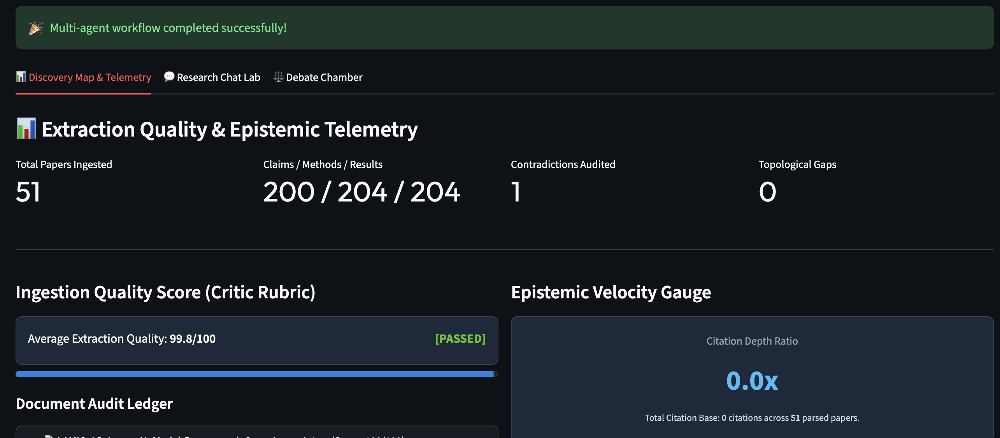
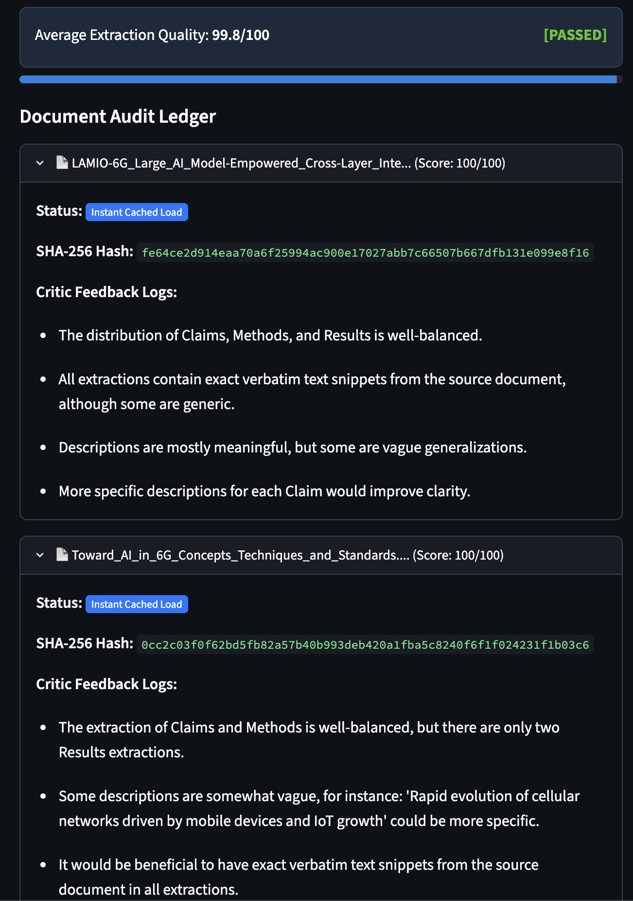
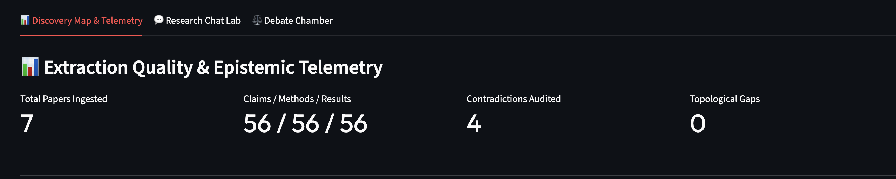
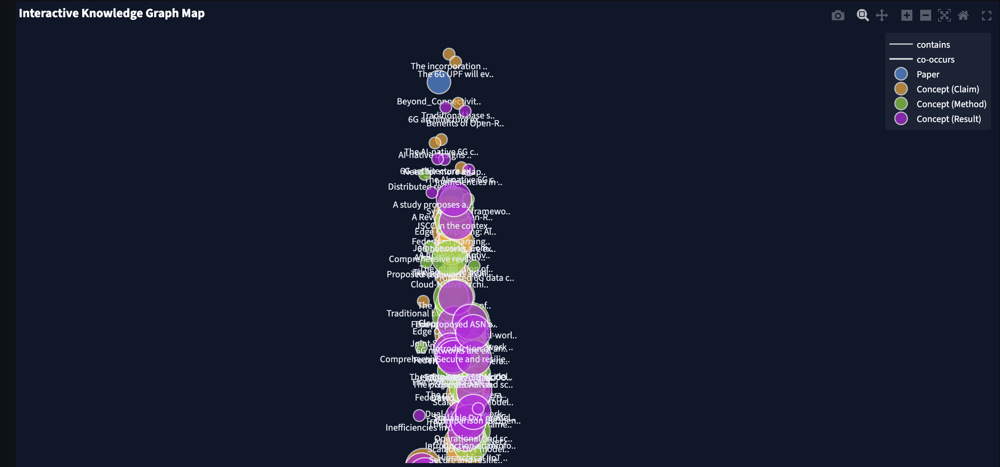
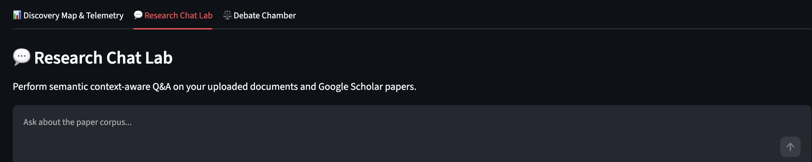
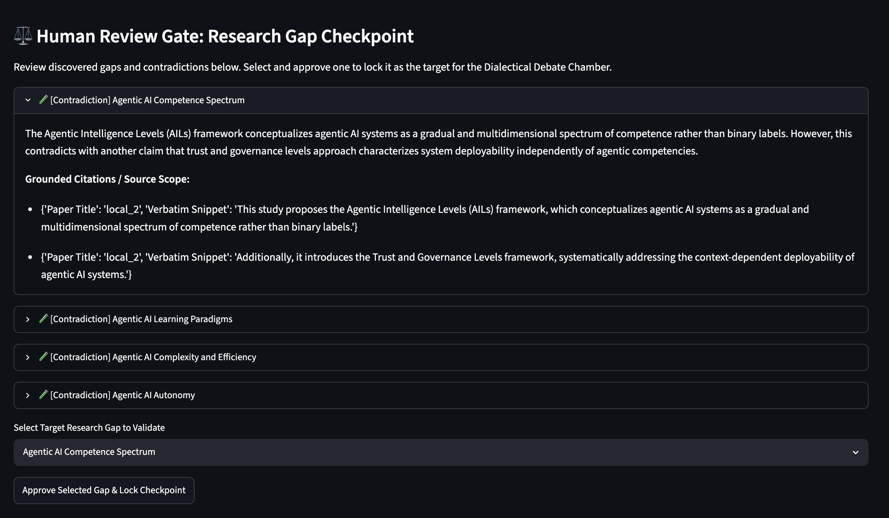

⭐ **[2026-1 Final-term Project - INDEX](../2026-1_Final-term_Project.md)**

# EpistemicScout: Agentic Research Gap Discovery System

EpistemicScout is an agentic, Streamlit-based web application designed to help academic researchers and graduate students discover novel research gaps from local literature (PDFs) and live Google Scholar results. It uses a multi-agent orchestrated workflow constructed using LangGraph to extract data, synthesize knowledge, and logically debate research gaps.

## App Architecture

The codebase is organized into several key modules across four layers: **UI**, **Agents**, **Utilities**, and **External Integrations**.

```
final/
├── app.py                    # Main entry point & controller
├── requirements.txt          # Python dependencies
├── ui/
│   ├── sidebar.py            # Control Tower (model config, ingestion hub)
│   ├── graph_view.py         # Interactive Plotly knowledge graph
│   ├── gap_dashboard.py      # Gap ranking & telemetry dashboard
│   ├── chat_tab.py           # RAG-backed conversational Q&A
│   └── debate_chamber.py     # Triadic Debate Chamber (3-column view)
├── agents/
│   ├── orchestrator.py       # LangGraph StateGraph compiler
│   ├── extractor.py          # NER-based Claims/Methods/Results extractor
│   ├── synthesizer.py        # Knowledge Graph builder (NetworkX)
│   ├── critic.py             # Contradiction & rubric audit agent
│   ├── debater.py            # Dialectical debate agent (Conceptualist/Empiricist)
│   └── state.py              # Shared GraphState TypedDict
└── utils/
    ├── vector_store.py       # ChromaDB embedding persistence
    ├── pdf_parser.py         # PDF text extraction & SHA-256 fingerprinting
    ├── llm_client.py         # Unified Gemini / Ollama backend wrapper
    ├── mcp_client.py         # Google Scholar MCP integration
    └── audit_ledger.py       # HITL audit trail (JSONL logging)
```

### 1. `app.py`
The main entry point for the Streamlit application. It acts as the core controller, rendering the UI layout, handling document uploads/scholar ingestion, and invoking the LangGraph multi-agent orchestrator state graph.

### 2. `ui/`
This directory encapsulates the visual components of the Streamlit application.
- **`sidebar.py`**: A Control Tower for user configuration — model toggles (Ollama ↔ Gemini), document drag-and-drop, Google Scholar seed query, and the Session Audit Log Ledger.
- **`graph_view.py`**: Renders the generated knowledge field as a force-directed interactive Plotly graph connecting research papers and extracted concepts (Claims, Methods, Results).
- **`gap_dashboard.py`**: Presents ranked research opportunities (gaps), telemetry metric cards, data quality scores, rubric progress bars, and the Visual Gap Hierarchy tree.
- **`chat_tab.py`**: Defines the interface for user conversational Q&A, backed by ChromaDB vector storage and conversational window memory.
- **`debate_chamber.py`**: Features a three-pane UI (Conceptualist 🏛️ | Moderator ⚖️ | Empiricist 🧪) visualizing the live Dialectical Debate with Human-In-The-Loop steering controls.

### 3. `agents/`
This directory contains the LangGraph nodes governing the system's core business logic.
- **`orchestrator.py`**: Compiles the `StateGraph` workflow — sequentially routing through Extraction → Synthesis → Criticism, with a conditional self-reflection loop for rubric failures.
- **`extractor.py`**: Reaches into source texts to scrape "Claims", "Methods", and "Results" via LLM-driven Named Entity Recognition. Checks SHA-256 cache via ChromaDB before re-processing.
- **`synthesizer.py`**: Takes structured extractions and constructs an ontological relationship graph (Knowledge Graph) using NetworkX. Runs Gap Topology Analysis to find structural holes (isolated islands, bridge concepts with high betweenness centrality).
- **`critic.py`**: Audits the resulting graph for missing links or contradictions between sources. Scores each paper's extraction against a data-integrity rubric (threshold: 85/100). Triggers re-extraction self-reflection loop on failure.
- **`debater.py`**: Runs the Dialectical Debate between the Conceptualist and Empiricist personas over a selected research gap.
- **`state.py`**: Defines the shared `GraphState` TypedDict that passes state data between all LangGraph nodes.

### 4. `utils/`
Standard tooling providing background services.
- **`vector_store.py`**: Establishes local persistence of extracted embeddings via ChromaDB for semantic caching and RAG retrieval.
- **`pdf_parser.py`**: Helper functions for filesystem interaction, PDF text extraction (PyMuPDF), SHA-256 fingerprinting, and open-access PDF downloading.
- **`llm_client.py`**: Unified wrapper services to interact with the selected generative AI backend (Gemini Pro API or local Ollama).
- **`mcp_client.py`**: MCP integration layer to live-query Google Scholar for citation metrics and open-access papers.
- **`audit_ledger.py`**: Appends structured HITL audit events to `audit_logs.jsonl` for full traceability.

## Multi-Agent Workflow (LangGraph)

```
[Human Ingestion Checkpoint]
         │
         ▼
[Google Scholar MCP Search] ──► [SHA-256 Cache Check]
                                        │
                    ┌───────────────────┤
                    │ Cache Miss        │ Cache Hit
                    ▼                   ▼
           [Extraction Agent]    [Load from ChromaDB]
                    │
                    ▼
       [Rubric & Self-Reflection Loop]
          Score ≥ 85? → Continue
          Score < 85? → Re-extract
                    │
                    ▼
       [Knowledge Graph Synthesis]
       (NetworkX + Gap Topology)
                    │
                    ▼
       [Critic Agent — Contradiction Audit]
                    │
                    ▼
       [Human Review Checkpoint]
                    │
                    ▼
       [Dialectical Debate Chamber]
       (Conceptualist ↔ Empiricist)
                    │
                    ▼
       [Multi-Artifact Export]
       (Research Proposal / Draft / Report)
```

## Execution Flow

1. **Configure**: Set the model backend (Gemini or Ollama) and ingestion source (local PDFs or Google Scholar seed query) in the sidebar.
2. **Ingest**: Upload PDFs or provide a Scholar query. The system fingerprints each document via SHA-256 and checks the ChromaDB cache to skip re-processing.
3. **Extract & Synthesize**: Click "🚀 Start Extraction & Synthesis" to launch the LangGraph pipeline — extraction, rubric self-reflection, knowledge graph construction, and contradiction auditing run automatically.
4. **Explore**:
   - **Tab 1 — 📊 Discovery Map & Telemetry**: Browse the interactive force-directed knowledge graph alongside extraction quality metrics and ranked research gaps.
   - **Tab 2 — 💬 Research Chat Lab**: Ask context-aware questions over the full ingested paper corpus via RAG.
   - **Tab 3 — ⚖️ Debate Chamber**: Select a gap and watch the Conceptualist vs. Empiricist debate unfold. Use the Moderator panel to steer or resolve deadlocks.
5. **Export**: Generate a citation-backed Research Proposal, Content Draft, or Formal Report in Markdown.

## Screenshots

### 1. Main Dashboard — Knowledge Ingestion Console
The landing view after launch. The glassmorphic card explains the workflow, and the 🚀 button triggers the full LangGraph pipeline. The green banner confirms successful ingestion of 51 documents.


---

### 2. Sidebar Control Tower — Model Engine Config
The left-panel Control Tower showing the Model Engine Config (Ollama selected with `llama3.1:8b`), the Google Scholar MCP live status indicator (🟢 Online), and the Seed Research Question input.


---

### 3. Sidebar Control Tower — Document Ingestion Hub & Audit Ledger
The lower section of the sidebar showing the drag-and-drop PDF upload area with multiple papers loaded, and the Session Audit Ledger dropdown for restoring prior runs.



---

### 4. LangGraph Extraction Pipeline — Terminal Trace
The live terminal trace showing the LangGraph orchestrator running extraction attempt 1 across all documents, followed by caching confirmations (Score: 88.5, 92.5, 90.0) as papers pass the Critic rubric.



---

### 5. Tab 1 — Extraction Quality & Epistemic Telemetry Dashboard
The main results tab showing real telemetry: **51 papers ingested**, **200 / 204 / 204 Claims / Methods / Results**, **1 Contradiction Audited**, and the Ingestion Quality Score bar at **99.8/100 [PASSED]** alongside the Epistemic Velocity Gauge.



---

### 6. Document Audit Ledger — Per-Paper Critic Feedback
The expandable Document Audit Ledger showing per-paper breakdown: SHA-256 hash, cache status badge (**Instant Cached Load**), and the Critic agent's feedback bullets for each extracted document.




---

### 7. Tab 1 — Epistemic Telemetry Metric Cards (7-paper run)
A second run with 7 papers showing the telemetry metric cards: **7 papers**, **56 / 56 / 56 Claims / Methods / Results** (perfect balance), and **4 Contradictions Audited** — demonstrating the system scales proportionally across different corpus sizes.



---

### 8. Interactive Knowledge Graph Map
The force-directed Plotly knowledge graph rendering all extracted concept nodes — blue 🔵 Paper nodes, orange 🟠 Claim concepts, green 🟢 Method concepts, and purple 🟣 Result concepts — with `contains` and `co-occurs` edge types shown in the legend. Users can zoom, pan, and hover for tooltips.



---

### 9. Tab 2 — Research Chat Lab
The RAG-backed conversational Q&A interface (Tab 2). Users type questions into the "Ask about the paper corpus..." input and receive grounded, citation-backed answers drawn from the ChromaDB vector store — no hallucinated references.



---

### 10. Tab 3 — Human Review Gate: Research Gap Checkpoint
The critical HITL checkpoint inside the Debate Chamber tab. The system surfaces all discovered contradictions (e.g., *Agentic AI Competence Spectrum*, *Learning Paradigms*, *Complexity and Efficiency*, *Autonomy*) with expandable details and grounded citations. The human selects one gap from the dropdown and clicks **"Approve Selected Gap & Lock Checkpoint"** before the debate begins.




| Library | Role |
|---------|------|
| `streamlit` | Web UI framework |
| `langgraph` | Multi-agent stateful workflow orchestration |
| `networkx` | Knowledge graph construction & topology analysis |
| `scipy` | Required by networkx for betweenness centrality (sparse matrix ops) |
| `chromadb` | Vector embedding store & semantic cache |
| `PyMuPDF` | High-accuracy PDF text extraction |
| `plotly` | Interactive force-directed graph visualization |
| `google-generativeai` | Gemini Pro API backend |
| `ollama` | Local LLM backend (llama3.1:8b or any available) |
| `scholarly` | Google Scholar paper metadata via MCP |
