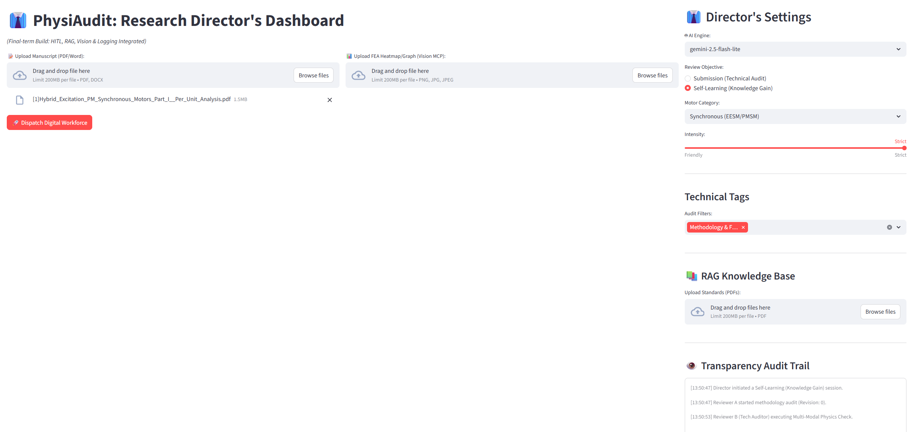
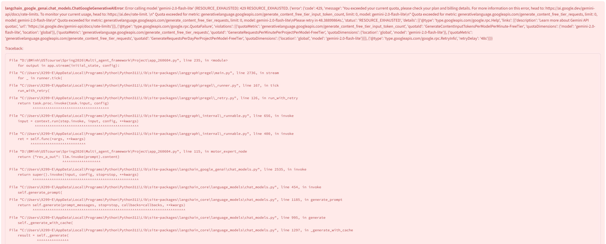

⭐ **[2026-1 Final-term Project - INDEX](../2026-1_Final-term_Project.md)**

# The Director's Report: Managing the PhysiAudit Workforce
**Director:** Nguyen Khac Bao Minh (02523035)

## 1. What I Built
I engineered **PhysiAudit Pro**, a Multi-Agent Cognitive Architecture designed to rigorously audit research manuscripts in the domain of electric motor design (e.g., EESM/PMSM). Instead of functioning as a simple text-generator, this digital workforce operates as a peer-review committee. It cross-examines textual claims against physics principles (Maxwell's Equations, Thermodynamics) and visual data (FEA Heatmaps), ensuring academic rigor before human review.

## 2. Architecture & Design Decisions
To transition from a linear script to an autonomous workforce, I implemented the following key architectural paradigms from the course:
* **Multi-Agent Orchestration (LangGraph):** Tasks are strictly compartmentalized. *Reviewer A* (Motor Expert) handles methodology and standards via RAG, while *Reviewer B* (Tech Auditor) focuses purely on mathematics and physics.
* **Multi-Modal Vision (MCP):** Reviewer B is equipped with Vision capabilities to read FEA heatmaps, cross-referencing visual data with textual claims to detect hallucinations.
* **Transparency Audit Trail & Memory:** A real-time logging system tracks every state transition, preventing the "black box" effect and mitigating **alignment drift**. LangGraph's `MemorySaver` was crucial to maintain context during UI refreshes.

## 3. Where the Humans Are in the Loop (HITL)
The AI is explicitly denied the authority to finalize decisions. I defend my **checkpoint placement** by setting a strict `interrupt_before` node immediately *after* the dual-review phase but *before* the Editor compiles the final report. 
* **Automatic Actions:** The heavy lifting of reading manuscripts, extracting IEEE standards, and scanning heatmaps is fully automated.
* **Actions Requiring Approval:** The system halts at the "Director's Command Center." Here, I review the draft critiques. If an agent hallucinates or misses a thermal anomaly, I inject direct semantic feedback and manually trigger a `Reject & Revise` state loop. This exercises true epistemic control.

## 4. The Failures I Saw - And the Lessons
Managing this digital workforce revealed significant operational vulnerabilities:

**Failure 1: Silent UI Freezes (Amnesia)**
Initially, the Streamlit UI's refresh cycle conflicted with LangGraph, wiping the state mid-execution. As seen in my logs (e.g., `[13:50:53] Reviewer B executing Multi-Modal Physics Check.`), the agent would start the task but fail to return an output to the UI, causing a silent freeze. 
*Lesson:* State persistence is vital. Anchoring the `MemorySaver` into the session state resolved this.

*Figure 1: The UI freezing indefinitely at Reviewer B without generating outputs.*

**Failure 2: Token Quotas and Resource Exhaustion**
Processing large PDF manuscripts coupled with base64 encoded heatmaps consumed massive tokens, throwing a `429 Too Many Requests` error. 
*Lesson:* I had to wrap the Vision MCP in a `try-except` block to gracefully degrade to text-only mode when the API was throttled, teaching me that AI pipelines must be failure-tolerant.

*Figure 2: Audit log displaying the fatal 429 Too Many Requests error.*

## 5. Critical Reflection on Management
* **Leading AI vs. Writing a Program:** Software engineering is deterministic; managing AI is probabilistic. I learned that my primary role wasn't to write perfect code, but to design resilient workflows that can handle AI uncertainty and gracefully recover from API failures.
* **Agent Sizing (More/Fewer Agents):** In hindsight, I would place **fewer** agents in the deep-reasoning parallel phase. Running multiple complex LLM nodes simultaneously caused the 429 errors. Instead, I would place **more** agents upstream—specifically adding a lightweight "Summarizer/Router Agent" to pre-process documents and only send highly complex equations to the heavy mathematical auditors.
* **The Irreplaceable Human Skill:** **Epistemic taste**. AI can flag a mathematical mismatch, but only the human director possesses the context to decide if it's a critical methodological flaw or a negligible rounding artifact acceptable for submission.

## 6. What I Would Do Differently / Next
If I were to scale this workforce, my honest reflection is that I ignored operational costs. I would implement strict **Token Budget Management**. Currently, the system blindly feeds 8,000+ words to every agent. Next, I would build a context-pruning mechanism to optimize API calls, focusing the AI's "attention" strictly on the bounding boxes of heatmaps or specific mathematical sections, rather than the entire document.