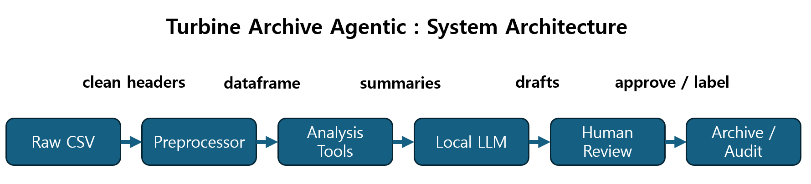
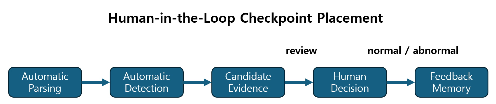

⭐ **[2026-1 Final-term Project - INDEX](../2026-1_Final-term_Project.md)**

# Director's Report: Turbine Archive Agentic

**Student:** Jaewhoon Cho  
**Student Number:** 02523070  
**Project:** Turbine Archive Agentic  
**Course framing:** Agentic AI as a managed digital workforce for research



## What I Built

I built **Turbine Archive Agentic**, a Streamlit-based research assistant for micro gas turbine and hybrid power-system experiment data. The agent is intended for a researcher who repeatedly receives CSV files from turbine-generator tests and must clean the data, visualize time-series signals, inspect abnormal behavior, archive experiments, and prepare a short report. The intent was not to create a general chatbot. The intent was to create a managed research workflow where Python tools perform verifiable analysis, a local LLM helps with interpretation and language, and the human researcher remains responsible for final judgment.

## Architecture & Design Decisions

The central design decision was to separate **deterministic computation** from **LLM-based assistance**. Python handles CSV parsing, metadata extraction, column-name translation, time-series plotting, correlation analysis, anomaly detection, Excel export, report drafting, archive search, and audit logging. The LLM, running through local Ollama, is used for natural-language interaction and polishing reports, not for inventing numerical conclusions.

This follows the course pattern of **tool use / function calling**. The LLM is not treated as the calculator. It is treated as a coordinator or secretary that should call or summarize the result of Python tools.

The system also includes a lightweight form of **memory**. Archived experiments, feedback decisions, and audit logs are stored locally. This is not a full vector-database RAG system yet, but it follows the same motivation: the agent should not start from a blank state each time. It should remember previous experiments, previous labels, and previous human decisions.

Another design decision was to add **domain knowledge**. The project started as a CSV plotting tool, but that was too shallow. The turbine system has physical structure: the micro gas turbine drives a power turbine, gearbox, output shaft, and generator; the generator output is rectified into the DC bus; the DC bus connects to the battery, loadbank, and ESC/EDF loads. Therefore, the agent groups signals by role: command inputs, engine responses, generator signals, rectifier signals, battery signals, ESC/EDF signals, and temperatures. This allows anomaly detection to be based not only on numerical outliers but also on physical inconsistency.



## Where the Humans Are in the Loop

Some actions are automatic:

- reading the CSV file,
- extracting operator and recording time,
- removing non-data header rows,
- translating Korean column names into English,
- generating plots,
- calculating statistics,
- detecting suspicious anomaly candidates,
- drafting a deterministic report.

However, the critical checkpoints are placed where interpretation or responsibility begins.

The first checkpoint is **data upload and archiving**. The program can parse the file automatically, but the user still confirms the experiment title, test type, system name, tags, and notes before saving it.

The second checkpoint is **anomaly interpretation**. The detector intentionally catches many suspicious candidates: data errors, stuck signals, rapid changes, oscillations, drift, and physical inconsistency. These are not final fault diagnoses. They are candidates. The researcher must mark them as normal or abnormal.

The third checkpoint is **report approval**. The system can create a deterministic draft and ask the LLM to polish it, but the final report is saved only after the human reviews and approves it. This reflects the Week 14 HITL idea: the checkpoint should be placed at the point where an automated output could affect research conclusions.

The fourth checkpoint is **auditability**. Tool calls, report actions, and feedback decisions are logged. This makes the agent easier to supervise and debug.

## The Failures I Saw — And the Lessons

The development process exposed several failure modes.

First, the raw CSV format was not a clean table. The first two rows contained metadata, and the actual header started on the third row. At first, the parser failed because pandas expected a different number of fields. The lesson was that real experimental data often violates the assumptions of general-purpose tools. I had to build a preprocessor that extracts metadata first and then cleans the table.

Second, Korean column names caused visualization issues in matplotlib. The graph legend was unreadable because of font handling. Instead of treating this as a display-only issue, I converted Korean headers into stable English variable names. This improved visualization, downstream analysis, and agent communication.

Third, the Ollama integration failed when the server was not running or when the model returned an empty response. This was a management failure as much as a coding failure: I had assumed the digital worker was available without checking its status. I added Ollama diagnostics and auto-start behavior so the app could detect or start the local service.

Fourth, the early Agent Chat was too brittle. It behaved like a keyword router. If the user asked about “oscillation,” “hunting,” or “abnormal behavior” in an unexpected phrase, the agent could fail to map the request to a tool. This showed a risk of **alignment drift** between the user’s research intent and the agent’s actual tool-routing behavior. I responded by moving toward broader diagnosis tools instead of adding one keyword at a time.

An example audit-style record looks like this:

```json
{"event": "tool:auto_detect_anomalies", "experiment_id": "exp_8c9fd9f2", "status": "success"}
{"event": "hitl:feedback", "anomaly_type": "oscillation", "signal": "RPM_Prop", "label": "normal"}
{"event": "ui:report_approved", "experiment_id": "exp_8c9fd9f2"}
```

These logs are simple, but they show what the agent did and where the human intervened.

## Critical Reflection on Management

The main lesson was that leading an AI workflow is different from writing a program. When writing a normal program, I define fixed inputs and outputs. When managing an agentic system, I have to define roles, permissions, checkpoints, memory, and failure boundaries.

My role became closer to a **Research Director**. I had to decide which tasks could be delegated to deterministic tools, which tasks could be delegated to the LLM, and which tasks must remain human decisions. I also had to exercise **epistemic taste**: not every anomaly candidate is scientifically meaningful, and not every polished LLM paragraph is trustworthy.

In hindsight, I would not add many independent agents yet. A multi-agent design sounds attractive, but for this project the more urgent need was reliable tool use and good checkpoint placement. If I added agents later, I would separate them by role: a data-cleaning agent, a diagnosis agent, a report-writing agent, and a skeptical reviewer agent. But each would need clear authority limits.

The irreplaceable human skill in this project is physical interpretation. The system can detect that a signal oscillated or that a voltage dropped. It cannot fully know whether that event is acceptable in a specific engine test without engineering context. The human researcher must decide whether the event is normal transient behavior, measurement error, or a real system problem.

## What I Would Do Differently / Next

The next step is to make the anomaly feedback more useful. Right now, the system can store whether a candidate was marked normal or abnormal. In the future, it should learn thresholds from repeated feedback, for example learning that a certain level of RPM ripple during a known operating phase is normal.

I would also add experiment phase labeling. Startup, idle, power generation, load transition, and shutdown should be treated differently. The same rapid change may be normal during startup but suspicious during steady operation.

Finally, I would improve the Agent Chat planner. The current version is better than a pure keyword router, but the long-term goal is for the LLM to convert user questions into structured analysis plans, then let Python execute those plans. That would reduce the need to manually update the code for every new phrasing.

Overall, this project taught me that a useful research agent is not just an LLM attached to a UI. It is a managed workflow: deterministic tools, domain knowledge, human checkpoints, memory, and auditability working together.
