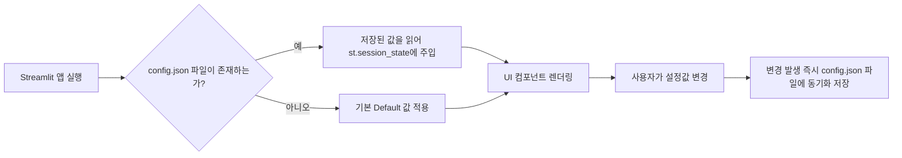
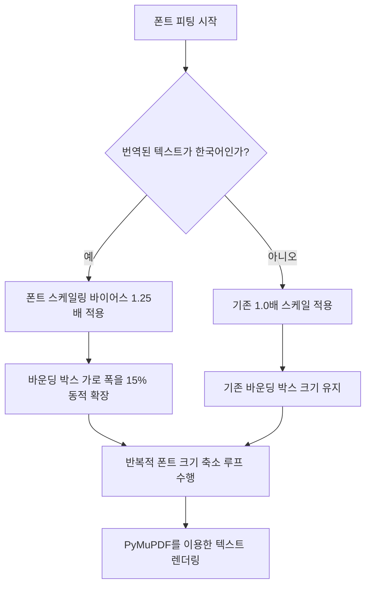
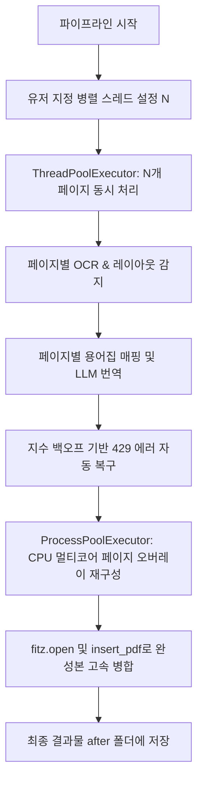
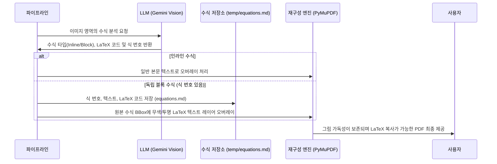

# 📑 PDF 번역 및 재구성 파이프라인 최적화 계획서

본 문서는 PDF 번역 및 고정밀 재구성(Reconstruction) 파이프라인의 주요 과제들을 **구현 완료된 과제**와 **남은 과제**로 분류하고 정렬하여 파이프라인의 개발 진행 상태를 효율적으로 관리할 수 있도록 정리한 문서입니다.

---

# PART 1: 💻 구현 완료 과제 (Completed Tasks)

## 💾 1. [난이도: 하] 설정값 유지 및 복원 관리 (Config Persistence Management) ── ✅ 완료
### 🔍 문제 분석
Streamlit은 브라우저를 새로고침하거나 서버를 재시작하면 기본적으로 모든 상태(`session_state`)가 초기화되어 사용자가 매번 활성 PDF 문서, LLM 모델, API 키 타입, 테마 설정을 다시 골라야 하는 번거로움이 있었습니다.

### 📐 알고리즘적 해결책
로컬 작업 공간에 `config.json` 파일을 두어 UI 컴포넌트의 설정값이 바뀔 때마다 자동으로 저장하고, 앱 기동 시 해당 파일을 로드하여 `st.session_state`에 주입함으로써 설정을 영구적으로 복원합니다.



### 💻 구현 완료 내용
* **[`config_manager.py`](file:///c:/Users/andre/%EB%82%B4%20%EB%93%9C%EB%9D%BC%EC%9D%B4%EB%B8%8C%28andrew3870@ust.ac.kr%29/UST_GoogleDrive/AgenticAIClass/PDFtoConvert/config_manager.py)**를 신규 제작하여 설정 로드(`load_persistent_config`)와 저장(`save_persistent_config`) 로직을 모듈화했습니다.
* **[`app.py`](file:///c:/Users/andre/%EB%82%B4%20%EB%93%9C%EB%9D%BC%EC%9D%B4%EB%B8%8C%28andrew3870@ust.ac.kr%29/UST_GoogleDrive/AgenticAIClass/PDFtoConvert/app.py)** 시작 지점에서 기존 설정값을 자동 복원하고, 테마 및 모델/문서 선택 selectbox 이벤트 이후 실시간 파일 저장을 수행하도록 연동했습니다.

---

## 🛠️ 2. [난이도: 하] 한국어 번역 문단 폰트 크기 피팅 최적화 (Korean Font Fitting Optimization) ── ✅ 완료
### 🔍 문제 분석
영문 텍스트를 한국어로 번역하면 일반적으로 글자 수가 감소하지만 한글 폰트의 고유 자폭과 줄 높이(Line Height) 차이로 인해, 기존 영문 바운딩 박스 내에 피팅 시 폰트 크기가 심각하게 작아져 가독성이 저하됩니다.

### 📐 알고리즘적 해결책
한글 번역문 영역에 대해 **자폭 확장 스케일링 바이어스(Bias)** 및 **바운딩 박스 가로 너비의 동적 확장(15%)**을 적용하는 정밀 계산식을 적용합니다.

### 💻 구현 완료 내용
* **[`md_to_pdf.py`](file:///c:/Users/andre/%EB%82%B4%20%EB%93%9C%EB%9D%BC%EC%9D%B4%EB%B8%8C%28andrew3870@ust.ac.kr%29/UST_GoogleDrive/AgenticAIClass/PDFtoConvert/md_to_pdf.py)** 파일의 `reconstruct_overlay_pdf` 함수 내부에 번역할 텍스트에 한글 유니코드 범위(`가` ~ `힣`)가 포함되었는지 확인하는 실시간 판단 로직을 삽입했습니다.
* 한글 텍스트 렌더링 시 바운딩 박스 가로폭(`x1`)을 15% 확장하고, 드라이런을 통해 축소 결정된 폰트 크기(`best_fontsize`)에 1.25배를 곱하여(기본 시작 크기 한도 내에서) 한글 문단의 최종 가독성을 보완했습니다.



### 💻 코드 설계안 (Python / PyMuPDF)
```python
import fitz
import math

def calculate_optimal_font_size(fitz_page, rect, text, font_name="NanumGothic", is_korean=True):
    """
    텍스트를 사각형 영역(rect)에 맞추기 위한 최적의 폰트 크기를 계산합니다.
    한국어 텍스트인 경우 보정 계수 및 박스 확장 가로 폭을 적용합니다.
    """
    x0, y0, x1, y1 = rect
    if is_korean:
        # 가로 폭을 15% 넓혀 주어 폰트가 과도하게 작아지는 것을 방지
        width = x1 - x0
        x1 = x0 + (width * 1.15)
    
    rect_adjusted = fitz.Rect(x0, y0, x1, y1)
    
    font_size = 12.0
    min_font_size = 6.0
    bias_factor = 1.25 if is_korean else 1.0
    
    while font_size >= min_font_size:
        text_length = fitz.get_text_length(text, fontname=font_name, fontsize=font_size)
        rect_width = rect_adjusted.x1 - rect_adjusted.x0
        rect_height = rect_adjusted.y1 - rect_adjusted.y0
        
        estimated_lines = max(1, math.ceil(text_length / rect_width))
        estimated_total_height = estimated_lines * font_size * 1.35  # 줄 높이 1.35
        
        if estimated_total_height <= rect_height:
            return min(font_size * bias_factor, 14.0)
        
        font_size -= 0.5
        
    return min_font_size
```

---

## ⚡ 3. [난이도: 중/상] 동시 병렬 실행 파이프라인 구축 (Concurrent Pipeline Execution) ── ✅ 완료
### 🔍 문제 분석
페이지 단위로 Ingest, 번역, 재구성이 순차적으로 실행되면 API 서버 대기 속도(Network I/O) 및 단일 코어 PDF 재구성 연산 속도로 인해 전체 문서 변환 완료 속도가 과도하게 정체됩니다. 특히 대량의 페이지를 처리할 때 이 병목 현상이 극대화됩니다.

### 📐 알고리즘적 해결책
1. **LLM 속도 제한 인식 병렬화 (Rate-Limit-Aware LLM Concurrency)**:
   * Streamlit 사이드바에 최대 병렬 페이지 처리 수(Max Parallel Pages) 설정 컴포넌트를 제공합니다.
   * `ThreadPoolExecutor`를 통해 지정된 크기만큼 페이지별 OCR/번역 요청을 동시 처리합니다.
   * `429 Too Many Requests` 예외 발생 시 지수 백오프(Exponential Backoff) 및 재시도 메커니즘을 내장합니다.
2. **CPU-bound 오버레이 재구성 병렬화 (Multi-Core CPU Reconstruction)**:
   * 각 페이지별 레이아웃 재구성(PyMuPDF 텍스트 배치 및 폰트 피팅) 작업을 `ProcessPoolExecutor`를 활용하여 여러 CPU 코어에서 병렬로 연산합니다.
   * 각 코어에서 개별 페이지 PDF 파일을 생성한 후, 메인 프로세스에서 `fitz.open()` 및 `insert_pdf()`를 사용해 하나의 결과물 파일로 고속 병합합니다.



### 💻 구현 완료 내용
* **[`pdf_to_md.py`](file:///c:/Users/andre/%EB%82%B4%20%EB%93%9C%EB%9D%BC%EC%9D%B4%EB%B8%8C%28andrew3870@ust.ac.kr%29/UST_GoogleDrive/AgenticAIClass/PDFtoConvert/pdf_to_md.py)**: `extract_pdf_pages_parallel` 함수를 추가하여 페이지별 레이아웃 검출 및 OCR 처리를 내부 스레드 풀(`ThreadPoolExecutor`)로 병렬 구동합니다. 안전한 `threading.Lock`을 활용해 스레드 간 충돌 없이 토큰 사용량을 누적하여 리턴합니다.
* **[`llm_client.py`](file:///c:/Users/andre/%EB%82%B4%20%EB%93%9C%EB%9D%BC%EC%9D%B4%EB%B8%8C%28andrew3870@ust.ac.kr%29/UST_GoogleDrive/AgenticAIClass/PDFtoConvert/llm_client.py)**: `translate_pdf_pages_parallel` 함수를 추가하여 대조군 용어집 번역을 스레드 풀을 통해 동시 처리하며, 마찬가지로 스레드 안전하게 누계한 총 토큰 사용량을 호출처에 리턴합니다.
* **[`md_to_pdf.py`](file:///c:/Users/andre/%EB%82%B4%20%EB%93%9C%EB%9D%BC%EC%9D%B4%EB%B8%8C%28andrew3870@ust.ac.kr%29/UST_GoogleDrive/AgenticAIClass/PDFtoConvert/md_to_pdf.py)**: `reconstruct_overlay_pdf` 내부에서 `ProcessPoolExecutor` 기반의 멀티프로세싱을 사용해 오버레이 배치 및 폰트 피팅 처리를 병렬화했습니다.
* **[`ui_pipeline.py`](file:///c:/Users/andre/%EB%82%B4%20%EB%93%9C%EB%9D%BC%EC%9D%B4%EB%B8%8C%28andrew3870@ust.ac.kr%29/UST_GoogleDrive/AgenticAIClass/PDFtoConvert/ui_pipeline.py)** (All-in-One Pipeline): 기존의 UI 내부 복잡한 ThreadPoolExecutor 연산 코드를 전면 걷어내고, 위의 모듈 병렬 함수들을 한 줄로 단순 호출하도록 정돈했습니다. 병렬 가동 중 Race Condition을 완벽히 피해 연산 종료 시점에만 세션 토큰 정보를 단 한 번 일괄 갱신합니다.

---

## 📐 4. [난이도: 상] 수식 오버레이 및 복사 가능한 LaTeX 레이어 제공 (Math Equation Overlay & Copyable LaTeX) ── ✅ 완료
### 🔍 문제 분석
* 수식을 단순 이미지로 크롭해서 배치하면 사용자가 유도 공식을 복사해서 다른 계산 툴이나 프레젠테이션(PPTX/Word)에 넣거나 검색해볼 수 없습니다.
* **단, 모든 수식을 일률적으로 처리하면 가독성이 떨어집니다:**
  * 본문(inline) 내에서 짧게 쓰인 수식(예: `dt/dx`, `f(x)`)은 LaTeX가 아닌 일반 텍스트 형식으로 렌더링해야 본문과 어우러집니다.
  * 별도 행에 배치되고 우측에 식 번호(예: `(2.5)`)가 부여된 독립 수식(Block Equation)들은 고해상도 수식 이미지 위에 **보이지 않는 무색(또는 흰색) LaTeX 텍스트 레이어**를 오버레이해야 원본 그림 수식의 가독성을 해치지 않으면서 복사/붙여넣기가 가능해집니다.

### 📐 알고리즘적 해결책
1. **수식 유형 분기 (Inline Text vs Block LaTeX)**:
   * 레이아웃 분석 시 본문 텍스트 내의 인라인 수식은 일반 텍스트 블록으로 흡수 처리합니다.
   * 번호가 명시된 독립 수식은 레이아웃 `"type": "equation"`으로 분류하고 수식 번호(예: `(2.5)`)와 함께 LaTeX 코드를 추출합니다.
2. **무색 LaTeX 텍스트 레이어 삽입 (Colorless LaTeX Overlay)**:
   * PyMuPDF 렌더링 시, 원본 수식 이미지 BBox 위에 `render_mode=3` (Invisible Text) 또는 전경색과 배경색을 일치시킨(예: 흰색) 텍스트 객체로 LaTeX 문자열을 그립니다.
   * 이렇게 배치된 텍스트는 보이지 않지만, 마우스 드래그 및 복사(`Ctrl+C`)가 가능하여 PPTX나 워드 문서의 수식 편집기에 바로 붙여넣어 편집할 수 있습니다.
3. **수식 레지스트리 자동 저장 (`temp/equations.md`)**:
   * 추출된 블록 수식 정보(식 번호, 평문 표기, LaTeX 표기)를 `temp/equations.md` 파일에 구조화하여 기록합니다.
   * 이 저장소는 추후 **교재 예제 풀이 엔진(Task 5)**에서 수식을 참조하여 해설을 유도할 때 컨텍스트로 주입됩니다.



### 💻 구현 완료 내용
* **무색 텍스트 오버레이 삽입**: PyMuPDF 복원 엔진 `md_to_pdf.py`에 수식 영역의 바운딩 박스 위에 복사 가능한 투명/무색 텍스트 레이어를 얹는 오버레이 로직이 구현되었습니다.
* **페이지 정보 포함 및 스레드 세이프 저장**: `pdf_to_md.py`의 `update_equations_registry` 함수를 수정하여 수식이 발견된 페이지 번호(`page_num`)를 함께 테이블에 누적 저장하도록 개선하였으며, 병렬 구동 시 파일 손상을 막기 위해 `threading.Lock`을 연동했습니다.
* **단일 연습문제 공식 오인식 보정 및 오버레이 안정화**: 
  - 문제 번호(예: `1.1`)와 공식(`$$ ... $$`)이 단일 BBox에 묶여 `"exercise"`로 오분류되면서, 원본 공식 그림이 흰색으로 마스킹된 후 검은색 raw LaTeX 텍스트가 인쇄되던 오류를 해결했습니다.
  - `md_to_pdf.py` 복구 엔진에서 수식(`$$`)을 포함하는 비-공식(non-equation) 블록에 대해, 공식 영역을 뺀 일반 텍스트가 극히 짧거나 일련번호인 경우 타입을 `"equation"`으로 동적 재분류(Override)하도록 구현하여 원본 수식 이미지의 보존 및 LaTeX 무색 투명 오버레이 처리가 완벽히 수행되도록 개선했습니다.

---

## 💡 5. [난이도: 중] 학술 및 공학 예제 풀이 기능 통합 (Engineering Example Solver Integration) ── ✅ 완료
### 🔍 문제 분석
공학 전공 서적 및 연구 문헌에 빈번히 등장하는 예제(Example) 영역은 단순 텍스트 번역만 제공될 때보다, 복잡한 수식 유도 과정과 공학적 정의에 대한 단계별 해설(Derivation Analysis)이 덧붙여질 때 학습 및 이해도가 극대화됩니다. 특히 일반 LLM은 이미지 수식의 물리적 연계성을 오해하여 풀이 중 전개 오류를 범하기 쉬우므로, 수식 레지스트리와 연계된 구조화된 해결책이 필요합니다.

### 📐 알고리즘적 해결책
1. **예제 영역 레이아웃 인식**: PDF 레이아웃 분석 단계에서 텍스트 블록의 유형을 `"type": "example"`로 감지하여 구조화합니다.
2. **수식 레지스트리(`temp/equations.md`) 연계 및 컨텍스트 주입**:
   * 예제가 포함된 페이지 및 직전 단락의 수식 코드들을 수식 저장소로부터 파싱하여 LLM 프롬프트의 배경 정보(Prior Equations Context)로 함께 제공합니다.
3. **수학/물리 전문 추론 프롬프트 호출**:
   * 수학적 성능과 공학 지식이 우수한 LLM을 지정하고, 단계별 수식 유도 과정을 생략 없이 작성하며 물리적 단위를 정확히 기술하는 세부 시스템 프롬프트를 적용합니다.
4. **인터랙티브 대화 세션 및 UI 통합**:
   * Streamlit UI에서 감지된 예제를 선택할 수 있는 콤보박스를 배치하거나, PDF 재구성 미리보기 화면 옆에 **"💡 예제 해설 및 풀이"** 버튼을 배치합니다.
   * 사용자가 클릭 시 스트리밍 형식으로 한글 해설을 렌더링하고, 추가 질문을 던질 수 있는 대화형 챗 어시스턴트 창을 제공합니다.

### 💻 구현 완료 내용
* **예제와 연습문제 구분 및 선택 인터페이스**:
  - `pdf_to_md.py`의 디지털 PDF 파서 Heuristics 및 스캔본 Gemini OCR 프롬프트를 개선하여, "Example" 뿐만 아니라 "Exercise", "Problem", "Question", "연습문제", "문제" 등으로 시작하는 영역을 `"type": "exercise"`로 정밀 분별해내도록 변경했습니다.
  - `ui_chat.py` 내의 Solver UI에 라디오 버튼 문제 종류 선택기(`Select Problem Category`)를 추가하여, 사용자가 **💡 교재 예제(Example)**와 **📝 챕터 연습문제(Exercise)**를 독립적으로 분류하여 선택하고 해결할 수 있도록 UI를 확장했습니다.
* **페이지 기반 수식 동적 필터링**: `ui_chat.py` 내의 예제 풀이 탭에서 사용자가 예제를 골랐을 때, 해당 예제가 위치한 페이지 이하의 수식들만 `equations.md` 파일로부터 골라내어 LLM 컨텍스트로 제공하는 필터링 엔진을 구현했습니다. 이를 통해 논리적인 공식 전개 순서가 준수됩니다.
* **수식 번호 매핑 및 유도 지시어 연동**: `llm_client.py`의 `solve_example_with_llm` 내부 시스템 프롬프트를 수정하여, 해설을 전개할 때 [참조 공식 레지스트리]에 정의된 수식 번호(예: 식 (1.2) 등)를 본문 설명에 반드시 직접 매칭 및 명시하여 연계하도록 설계했습니다.
* **Streamlit UI 연계 완료**: 사용자가 임의로 예제 문맥을 수정하거나 붙여넣어 실행할 수 있는 에디터와 레지스트리 확인용 Expander 컴포넌트를 UI에 완전히 통합했습니다.

---

# PART 2: 📅 완료된 과제 (Completed Tasks)

## 📈 6. [난이도: 중] LLM 작업 평가 프레임워크 (LLM Task Evaluation Framework) ── 🟢 완료
### 🔍 문제 분석 및 해결
OCR 레이아웃 추출의 글자 오인식이나 번역의 성공 여부를 자동화하여 검사할 수 있도록, 번역 성능 및 용어집(Glossary) 매핑의 정합성을 수치적으로 자동 평가하는 프레임워크를 구축했습니다.
* **용어집 준수율 (Glossary Adherence Rate - GAR)**: 원문에서 발견된 용어집 단어가 번역문에서 올바른 매핑어로 번역되었는지 정규식을 기반으로 정확히 판별합니다.
* **LLM 기반 번역 유창성 및 적절성 평가**: 독립된 평가 프롬프트를 사용하여 기계 번역된 텍스트의 유창성(Fluency) 및 내용 전달의 적절성(Adequacy)을 0-100점 척도로 평가하고 한국어 피드백을 제공합니다.

### 🛠️ 구현 내용
* `evaluator.py` 모듈 내에 `calculate_cer`, `calculate_gar`, `evaluate_translation_fluency` 함수를 구현했습니다.
* Streamlit UI에 **📊 Evaluation** 탭을 추가하고, 페이지별 GAR 점수 및 상세 통계 테이블(매치된 단어, 누락된 단어 분류)과 LLM 실시간 품질 분석 버튼을 통합했습니다.

---

## 🖼️ 7. [난이도: 중/상] 로컬 재구성 품질 평가 프레임워크 (Local Reconstruction Evaluation Framework) ── 🟢 완료
### 🔍 문제 분석 및 해결
재구성된 번역본 PDF 파일 내에서 한글 문단이 원본 사각형 영역을 초과(Overflow)하여 겹치거나(Overlap) 깨지는 오류를 기하학적으로 자동 감출하여 디버깅 경고를 제공하도록 설계했습니다.
* **바운딩 박스 기하학적 충돌 검사 (BBox Collision Detection)**: 각 텍스트 박스 좌표(xmin, ymin, xmax, ymax)의 교집합 면적이 더 작은 박스 면적의 15%를 초과하여 겹치면 레이아웃 충돌 결함으로 판단합니다.

### 🛠️ 구현 내용
* `evaluator.py` 내에 PyMuPDF(`fitz.Rect`)를 활용해 기하학적 중첩 영역을 측정하는 `check_reconstruction_collisions` 함수를 구현했습니다.
* **📊 Evaluation** 탭 내 **📐 BBox Collision & Layout Audit** 대시보드를 생성하여, 충돌이 감지될 경우 경고 배지와 함께 충돌한 박스 ID 쌍, 각 블록 타입, 중첩 비율 표를 출력합니다.
* 충돌 발생 시 폰트 바이어스 및 가로 확장폭을 수동 조정하여 해결하도록 유도하는 권장 안내문을 추가했습니다.
