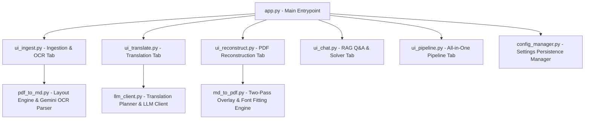
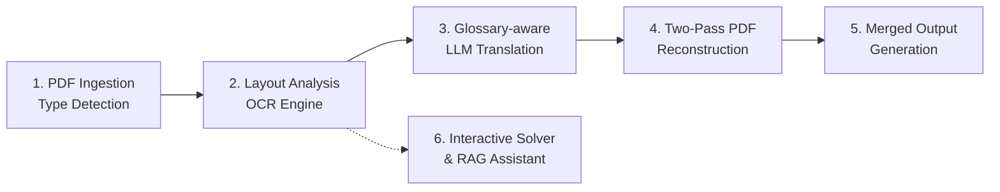
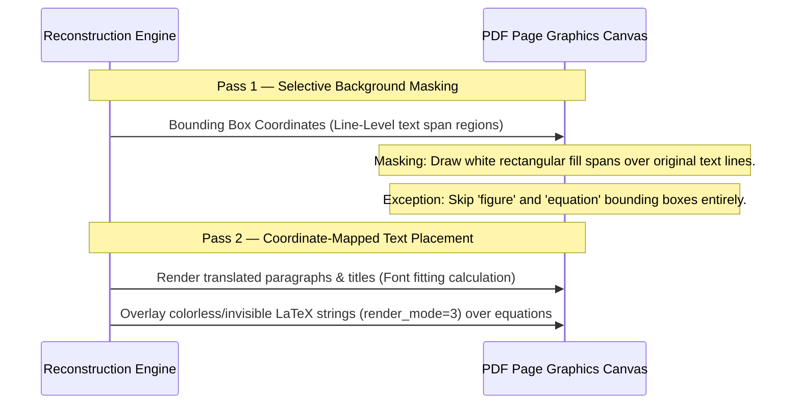
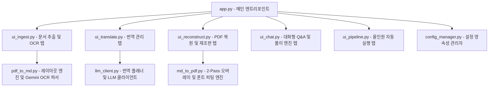
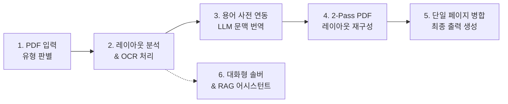
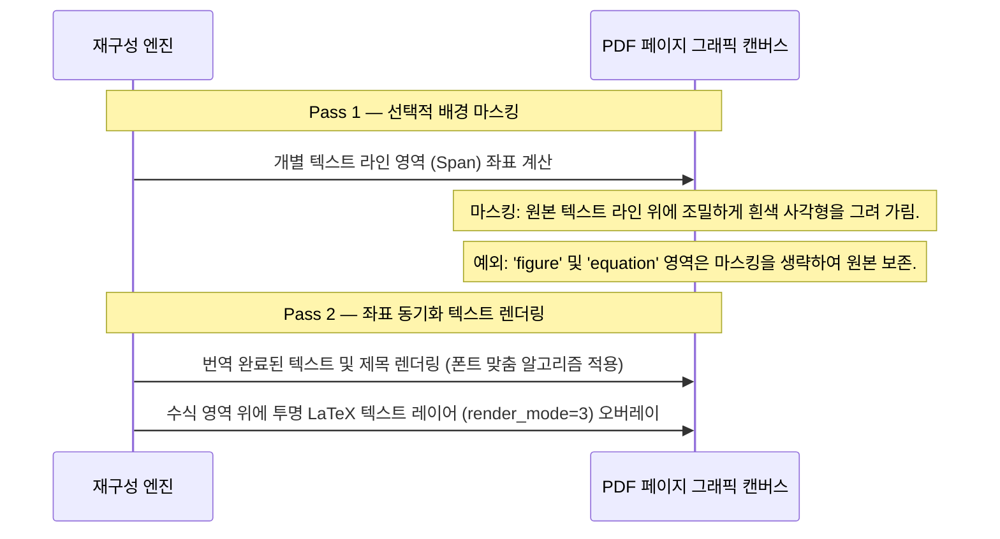
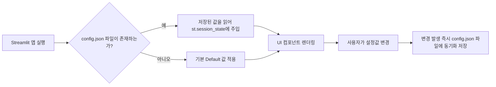
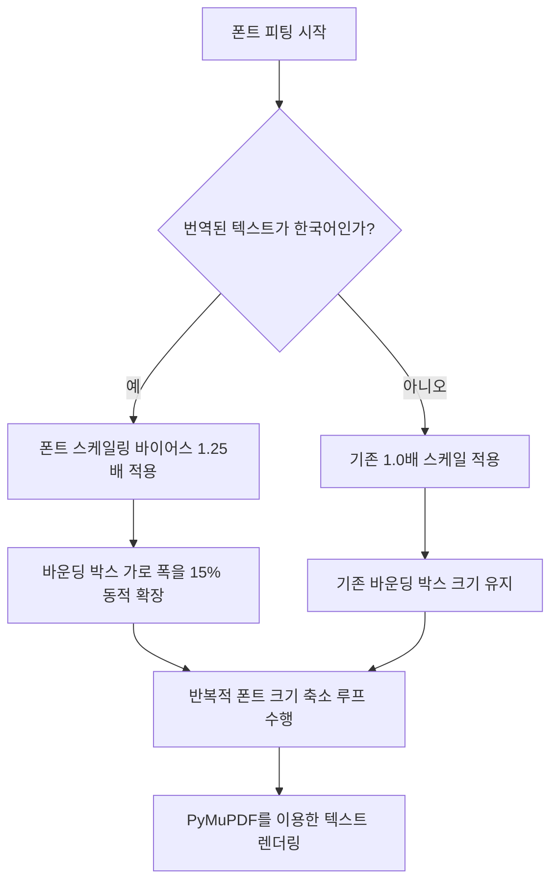
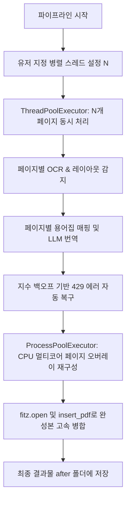
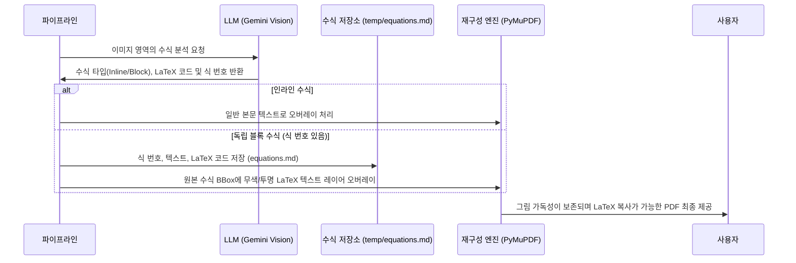

# 📄 PDFtoConvert App — Comprehensive Report (English Version)

## 1. App Overview

**PDFtoConvert** is a **Streamlit-based all-in-one web application** designed to automatically analyze, translate, and re-typeset academic and research PDF documents. It accommodates both born-digital (text-based) and scanned (image-based) PDFs, producing high-fidelity translated PDFs that preserve the original document's visual layout and mathematical integrity.

### Core Value Proposition

#### 1. Core Features & Architecture Highlights
* **Input Diversity**: Seamlessly handles high-quality digital text PDFs and scanned image-only PDFs.
* **Layout Preservation**: Employs a line-level masking and overlay strategy to preserve margins, background graphics, figures, and structural components.
* **Math Integrity**: Leverages invisible/colorless text overlays (`render_mode=3`) to place copyable, selectable LaTeX math strings directly on top of original high-resolution formula graphics.
* **Integrated Learning**: Incorporates an interactive chatbot and mathematical solver that utilizes an extracted equation registry to provide step-by-step Korean explanations for textbook examples and chapter exercises.
* **Independent Evaluator Integration**: Features a translation and layout quality dashboard that utilizes independent LLM models (e.g. Claude, GPT, Gemini) to score and feedback on translation fluency and adequacy.

#### 2. Comparative Analysis with Existing PDF Translation Tools

##### Existing Similar Applications & Key Features:
* **PDFMathTranslate (pdf2zh)**:
  - *Features*: Command-line/GUI layout-aware PDF translator that identifies and "protects" mathematical formulas, tables, and figures using layout boundaries. Supports multiple translation backends (DeepL, OpenAI, Gemini, Ollama).
* **DeepL / Google Translate Document Translation**:
  - *Features*: Industry-standard SaaS document translation engines that translate PDFs while attempting to preserve structural layouts.
* **Mathpix Snip (STEM PDF Digitizer)**:
  - *Features*: Highly accurate OCR designed specifically for complex mathematical equations, tables, and scientific texts, converting them to LaTeX, Markdown, or DOCX formats.

##### Comparative Advantages (Pros) of PDFtoConvert:
1. **Integrated Context-Aware Chatbot & Math Solver**: Unlike *PDFMathTranslate* or *DeepL*, PDFtoConvert integrates a FAISS-indexed RAG chat system and a dedicated textbook mathematical solver that dynamically pulls formulas from a page-level equation registry to provide step-by-step Korean derivations.
2. **Dynamic OCR Confidence & Selective Re-Extraction**: Provides an interactive ingestion dashboard that displays OCR confidence scores per block and allows one-click, page-level cache overrides to force re-extraction on low-confidence sections.
3. **Quality Evaluation Dashboard (GAR & BBox Collision Check)**: Integrates real-time verification of Glossary Adherence Rates (GAR) and geometrical layout box collision detection (>15% overlap) to alert users of layout bugs before export.
4. **Colorless Copyable Math Overlay**: Combines original graphic quality with selectable text by rendering LaTeX equations invisibly (`render_mode=3`) directly on top of the original figures.

##### Comparative Disadvantages (Cons) of PDFtoConvert:
1. **Local Setup & Key Dependency**: Requires running a Streamlit server locally and providing custom API keys, unlike the zero-install web browser experiences of DeepL or Google Translate.
2. **Font Variety Limitations**: Relies on standard pre-installed Korean fonts (like NanumGothic) for layout reconstruction, which might look visually distinct from the original serif/sans-serif fonts of the source PDF.
3. **Advanced Layout Parsing Speed on Scanned PDFs**: Relying on multi-modal Gemini Vision API queries for scanned PDF pages takes longer per page than standard heuristics-based converters (though it achieves superior layout bounding box accuracy).

| Category | Details |
|:---|:---|
| **Input PDF Types** | Born-Digital PDF (Text-based), Scanned PDF (Image-based), Mixed PDF |
| **Output Formats** | Reconstructed Translated PDF, Structured Markdown, Page-level Block JSONs |
| **Core Technologies** | Python, Streamlit, PyMuPDF (fitz), Gemini Vision API (multimodal), OpenAI API |
| **User Interface** | Streamlit Dashboard containing Ingestion, Translation, Reconstruction, Q&A, and Configuration tabs |

---

## 2. System Architecture

The application is structured as a multi-stage modular pipeline, coordinate-mapped for high-fidelity layout rendering.

### 2.1 Module Diagram



### 2.2 Workspace Directory Structure

To prevent lag and file lock issues, each processed PDF document receives an isolated workspace directory named `[document_basename]_ws` inside the `temp` folder:

```text
temp/[document_basename]_ws/
  ├── pages/              # Rendered page images (DPI normalized PNGs)
  ├── figures/            # Extracted/cropped image figures (PNGs)
  ├── markdown/           # Extracted markdown files and translated sections (.md)
  ├── json/               # Page block metadata coordinates (original and translated JSON)
  ├── translated/         # Reconstructed single-page PDFs and the combined final PDF
  ├── equations.md        # Page-level mathematical equation registry
  └── glossary.json       # Interactive glossary overrides
```

### 2.3 6-Stage Processing Pipeline



---

## 3. Key Features Detailed

### 3.1 Hybrid Layout Extraction & OCR (`pdf_to_md.py`)
To optimize speed and minimize cloud API token costs, the pipeline automatically branches based on the input PDF type:
1. **Born-Digital PDF (Text-based)**: Extracted using a local `PyMuPDF` parser. This process runs completely offline in less than a second per page, extracting bounding boxes, raw text, and digital spans without LLM token expenses.
2. **Scanned PDF (Image-based)**: Extracted using multimodal LLM vision models (e.g., `gemini-1.5-flash` or `gemini-2.0-flash`). Bounding boxes and LaTeX equation representations are extracted through structured vision queries.

All page blocks are classified into specific semantic types: `title`, `paragraph`, `equation`, `figure`, `table`, `caption`, `example`, or `exercise`.

### 3.2 Glossary-Aware Contextual Translation (`llm_client.py`)
* **Live Glossary**: Users add, edit, or delete terminology mapping rules via the Streamlit UI, persisting to `glossary.json` and immediately injecting into LLM system prompts.
* **Contextual Framing**: Blocks are not translated in isolation. The translation planner feeds the surrounding paragraph contexts (`Context Before` and `Context After`) to the LLM to resolve pronoun bindings, keep structural flow, and preserve academic tone.
* **Formula Preservation**: Math markers (`$$`) are identified. Equations are kept unchanged, while text around them is translated.

### 3.3 Two-Pass High-Precision Reconstitution Engine (`md_to_pdf.py`)

The reconstruction engine applies a **2-Pass rendering** strategy to overlay text while protecting original graphics.



* **Line-Level Precision Masking**: Instead of covering a whole block with a single large white rectangle, the engine tracks text spans to mask only the exact line dimensions. This preserves margins, line grids, and adjacent diagrams.
* **Figure and Equation Bounding Box Protection**: All masking is skipped on coordinates marked `figure` or `equation`. The original high-resolution formula fonts and image vectors are left untouched.
* **Colorless LaTeX Overlay**: By setting the PDF rendering mode to `3` (`render_mode=3` / invisible text), the engine embeds invisible LaTeX text directly on top of the original formula graphic, allowing searchability and `Ctrl+C` copy-paste functionality without altering visual graphics.
* **Dynamic Font Fitting**: Translate operations increase text lengths (Language Expansion). The engine calculates optimal sizing by adjusting bounding box widths (15% wider for Korean) and dynamically shrinking the font size within a dry-run iteration until it fits.

### 3.4 Interactive Derivation Solver (`ui_chat.py` + `llm_client.py`)
* **Semantic Target Identification**: Bounding boxes tagged as `example` or `exercise` are grouped.
* **Equation Registry Integration**: When solving, the engine compiles equations up to the current page from `equations.md` to serve as contextual derivation axioms.
* **Guided Step-by-Step Solving**: Generates detailed, step-by-step explanations in Korean, mapping steps back to equation registry IDs (e.g., "Equation (1.2)") to prevent hallucinations.

---

## 4. Development Progress & Timeline

### 4.1 Evolution: From Architectural Design to Web Application
The system evolved from a multi-service conceptual architecture (`TotalPDF_reconstruct_WF.md`) into a consolidated interactive Streamlit application. 

| Feature | Conceptual Architecture Design | Final Implementation |
|:---|:---|:---|
| **System Framework** | FastAPI Backend + Celery/Redis Workers + separate Frontend | **Streamlit Consolidated Monolithic Web App** |
| **Ingestion Pipeline** | Batch OCR preprocessing for all documents | **Hybrid Pipeline** (Local parsing for text PDFs / Vision LLM only for scans) |
| **Masking Method** | Coarse block-level rectangular masking | **Line-level Precision Masking** |
| **Equation Handling** | Image cropping with manual correction | **Auto-Protection + Invisible LaTeX Overlay** |
| **LLM Controls** | Fixed configuration via environment files | **Real-Time Sidebar Switcher (Hot-Reloading)** |
| **Data Separation** | Single shared `workspace` folder | **Per-document isolated workspaces** (`*_ws/` directories) |
| **Token Tracking** | No estimation capability | **USD Rate-Sheet Token & Cost Tracker Dashboard** |

### 4.2 Completed Tasks

- ✅ **Task 1: Config Persistence Management [Easy]**: Implemented `config_manager.py` to persist selected active documents, models, and themes across Streamlit session runs.
- ✅ **Task 2: Korean Font Fitting Optimization [Easy]**: Injected a 1.25x scaling bias and 15% bounding box width expansion to compensate for visual height profiles in Korean typography.
- ✅ **Task 3: Concurrent Pipeline Execution [Medium/Hard]**: Leveraged Python `ThreadPoolExecutor` for API-bound tasks (OCR, translation) and `ProcessPoolExecutor` for CPU-bound tasks (PDF generation, font fitting) to achieve high throughput.
- ✅ **Task 4: Math Equation Overlay & LaTeX Overlay [Hard]**: Enabled invisible selectable text overlays for block equations and constructed `equations.md` registry.
- ✅ **Task 4 Supplement: Exercise Equation Classification Fix**: Created a dynamic override filter at the reconstruction stage to check if an exercise block contains math. If the text outside the math markers is minimal (e.g., problem index labels like "1.1"), it is dynamically classified as `equation` to bypass background masking and preserve the underlying graphic.
- ✅ **Task 5: Engineering Example Solver Integration [Medium]**: Built the solver interface, integrating page-level equations to allow RAG-style structured mathematical derivations.

---

## 5. Future Extensible Features

### 5.1 ⏳ Pipeline Evaluation Framework [Medium]
Integrates automated evaluation metrics to gauge quality across batches:
* **OCR Character Error Rate (CER)**: Calculated using Levenshtein distance on born-digital vs. OCR outputs:
  $$CER = \frac{S + D + I}{N_c}$$
  Target: **< 2%**
* **Glossary Adherence Rate (GAR)**: RegEx matching of translation outputs against glossary tables:
  $$GAR = \frac{\text{Glossary terms translated correctly}}{\text{Total matched glossary terms in source}}$$
  Target: **100%**
* **Translation Similarity (BERTScore)**: Cosine similarity of contextual embeddings against references. Target: **> 0.88**

### 5.2 ⏳ Reconstruction Validation Audit [Medium-Hard]
* **BBox Collision Detection**: A geometry check that flags overlaps:
  $$\text{Overlap Ratio} = \frac{\text{Area}(\text{Box}_A \cap \text{Box}_B)}{\min(\text{Area}_A, \text{Area}_B)} > 0.15 \rightarrow \text{Flag Overlap}$$
* **Structural Visual Similarity (SSIM)**: SSIM check on page renders (Target: **> 0.90**).

### 5.3 🔮 Proposed Long-Term Extensions
1. **Dynamic Table Layout Reconstruction**: Decompose table cell grids and reconstruct editable text tables instead of utilizing image bounding box fallbacks.
2. **Multi-Column Text Flow**: Add vertical separator lines to layout parsing to avoid column merging bugs in 2-column or 3-column scientific layouts.
3. **FAISS/Vector Database RAG Extension**: Incorporate vector search libraries to index entire textbooks for multi-chapter comparative research.
4. **Interactive Editor Dashboard**: Build a block-level sidebar editor allowing users to manually override text translations before triggering final PDF reconstruction.

---

## 6. Conclusion
PDFtoConvert has successfully transitioned from a conceptual architectural framework to a mature, high-fidelity translation tool. The implementation of selective line masking, invisible LaTeX overlay, and adaptive font-fitting ensures publication-ready PDF translations. By maintaining document isolation and including real-time usage cost metrics, the workspace provides an optimal environment for academic document localization.

---
---

# 📄 PDFtoConvert 앱 종합 보고서 (한국어 버전)

## 1. 앱 개요

**PDFtoConvert**는 학술 및 연구용 PDF 문서를 자동으로 분석, 번역 및 재조판하는 **Streamlit 기반 올인원 웹 애플리케이션**입니다. Born-Digital(텍스트 기반) PDF와 Scanned(이미지 기반) PDF 모두를 완벽하게 지원하며, 원본 문서의 시각적 레이아웃과 수식의 수학적 구조를 그대로 유지하는 고품질 번역 PDF를 생성합니다.

### 핵심 가치 제안
* **입력 문서의 다양성**: 고해상도 디지털 텍스트 PDF와 스캔된 이미지 전용 PDF를 모두 매끄럽게 처리합니다.
* **정밀 레이아웃 보존**: 라인 레벨 마스킹 및 오버레이 재배치 전략을 통해 여백, 배경 그리드, 그림 및 문서의 구조적 형태를 왜곡 없이 보존합니다.
* **수식 무결성 유지**: 보이지 않는 텍스트 오버레이(`render_mode=3`) 기술을 적용하여 원본 고화질 수식 이미지 위에 복사 및 검색이 가능한 LaTeX 수식 문자열을 투명하게 얹습니다.
* **학습 및 연구 연계**: 대화형 챗봇 및 수학 예제 풀이 엔진을 내장하여, 문서 내에서 추출된 수식 레지스트리를 바탕으로 교재 예제와 연습문제의 단계별 한국어 해설을 제공합니다.

| 구분 | 상세 내용 |
|:---|:---|
| **지원 PDF 유형** | Born-Digital PDF (텍스트 기반), Scanned PDF (스캔 이미지 기반), 혼합 PDF |
| **출력 포맷** | 레이아웃 복원 번역 PDF, 구조화된 Markdown 문서, 페이지별 블록 메타데이터 JSON |
| **핵심 기술** | Python, Streamlit, PyMuPDF (fitz), Gemini Vision API (멀티모달 OCR), OpenAI API |
| **사용자 인터페이스** | 추출(Ingestion), 번역(Translation), 재구성(Reconstruction), 질의응답 및 설정 관리 탭 통합 |

---

## 2. 시스템 아키텍처

본 애플리케이션은 고정밀 레이아웃 복원을 위해 각 좌표 정보를 동기화하여 연산하는 다단계 파이프라인 구조를 갖추고 있습니다.

### 2.1 모듈 아키텍처 다이어그램



### 2.2 워크스페이스 디렉터리 구조

다중 문서 처리 시 랙(Lag) 현상과 파일 액세스 충돌을 방지하기 위해, 문서를 로드하면 해당 문서 고유의 독립된 워크스페이스 디렉터리(`temp/[문서이름]_ws/`)가 자동 생성되어 격리 관리됩니다.

```text
temp/[문서이름]_ws/
  ├── pages/              # 렌더링된 페이지 이미지 (DPI 정규화 PNG)
  ├── figures/            # 추출 및 크롭된 이미지 그림 파일 (PNG)
  ├── markdown/           # 추출 마크다운 및 번역된 챕터 마크다운 (.md)
  ├── json/               # 페이지 내 텍스트 블록 좌표 메타데이터 (원본 및 번역 JSON)
  ├── translated/         # 재구성된 단일 페이지 PDF들 및 최종 병합 완료 PDF
  ├── equations.md        # 페이지 정보가 포함된 수학 수식 레지스트리
  └── glossary.json       # 인터랙티브 전용 용어집
```

### 2.3 6단계 처리 파이프라인



---

## 3. 주요 기능 상세

### 3.1 하이브리드 레이아웃 추출 및 OCR (`pdf_to_md.py`)
API 비용을 최소화하고 문서 처리 성능을 극대화하기 위해 입력된 PDF의 성격에 따라 하이브리드 엔진이 작동합니다.
1. **Born-Digital PDF (텍스트 기반)**: 로컬 `PyMuPDF` 파서를 호출합니다. 별도의 LLM API를 사용하지 않고 완전 오프라인 상태에서 페이지당 1초 미만의 속도로 바운딩 박스, 문자열, 디지털 텍스트 스팬을 완벽하게 읽어 들입다.
2. **Scanned PDF (이미지 기반)**: 멀티모달 Vision LLM(`gemini-1.5-flash` 또는 `gemini-2.0-flash`)을 호출하여 시각 데이터로부터 레이아웃 분석 및 OCR 데이터를 직접 추출합니다.

문서의 구조에 따라 각 영역은 `title`, `paragraph`, `equation`, `figure`, `table`, `caption`, `example`, `exercise` 등의 블록 유형으로 자동 분류됩니다.

### 3.2 용어사전 반영 문맥 번역 (`llm_client.py`)
* **실시간 용어집**: 사용자가 UI 화면에서 직접 단어 매핑 사전을 추가/삭제하면 `glossary.json`에 반영되고 즉시 번역용 LLM 프롬프트에 동적 결합됩니다.
* **문맥 흐름 보존**: 개별 문장을 독립적으로 번역하는 대신 번역 플래너가 대상 블록의 전후 단락(`Context Before`, `Context After`)을 컨텍스트로 제공하여 대명사 번역 왜곡을 방지하고 학술 서적 고유의 정갈한 톤앤매너를 유지합니다.
* **수식 구문 보존**: 수식 경계 문자열(`$$`)을 분석하여 수식 본체는 변경하지 않고 주변의 한국어 설명 부분만 매끄럽게 번역합니다.

### 3.3 고정밀 오버레이 재구성 엔진 (`md_to_pdf.py`)

재구성 엔진은 원본 이미지를 덮어쓰는 과정에서 그래픽 손실을 최소화하기 위해 **2-Pass 렌더링** 구조를 실행합니다.



* **라인 단위 정밀 마스킹 (Line-level Masking)**: 문단 블록 전체를 하나의 큰 사각형으로 지우면 인접한 배경이나 다이어그램 선이 함께 지워집니다. 본 엔진은 개별 텍스트 줄(Line Span)만 추적하여 흰색으로 마스킹하므로 원본 여백과 배경 레이아웃을 최대한 살려냅니다.
* **그림 및 수식 바운딩 박스 보호**: `figure`와 `equation`으로 태깅된 영역은 마스킹 단계를 생략하여 원본의 선명한 수식 글꼴 및 삽화를 100% 무결하게 유지합니다.
* **무색 LaTeX 오버레이**: PyMuPDF의 텍스트 삽입 모드를 `3` (Invisible Text)으로 지정하여, 원본 수식 그림 위에 투명하게 LaTeX 문자열을 얹어 사용자가 PDF를 열었을 때 드래그 복사(`Ctrl+C`) 및 검색이 가능하도록 만듭니다.
* **동적 폰트 피팅 (Auto Font-Fitting)**: 번역 후 텍스트의 길이가 증가할 때 박스 밖으로 글자가 삐져나가는 현상을 막기 위해 한글 유형에 맞추어 가로 폭을 15% 늘리고 폰트 스케일링 바이어스(1.25배)를 가미한 상태에서 사각형에 맞을 때까지 반복적으로 크기를 조율하는 드라이런 루프를 수행합니다.

### 3.4 대화형 전공 서적 예제 솔버 (`ui_chat.py` + `llm_client.py`)
* **구조적 타겟 인지**: 레이아웃 분석 단계를 거치며 `example` 혹은 `exercise`로 태깅된 수학적 문제 영역을 독립된 리스트로 관리합니다.
* **수식 레지스트리 통합 RAG**: 사용자가 문제를 선택하면, 해당 문제 페이지까지 존재하는 모든 공식들을 `equations.md`로부터 가져와 논리 전개용 사전 지식으로 LLM에 컨텍스트를 주입합니다.
* **식 번호 추적**: 설명 시 "식 (1.2)" 등 공식 레지스트리에 정의된 번호와 전개 과정을 일치시켜 답변의 정확도를 극대화하고 환각 현상을 억제합니다.

---

## 4. 개발 진행 경과 및 타임라인

### 4.1 개념 설계에서 실제 웹 애플리케이션으로의 진화
프로젝트 초기 개념 설계서(`TotalPDF_reconstruct_WF.md`)와 비교했을 때, 실제 통합 구현된 시스템은 보다 높은 사용 편의성과 계산 최적화를 이루었습니다.

| 평가 항목 | 개념 설계서의 구성 | 최종 앱 구현 완료 사항 |
|:---|:---|:---|
| **개발 프레임워크** | FastAPI 백엔드 + Celery/Redis 비동기 작업 큐 + 독립 프론트엔드 | **Streamlit 기반 인터랙티브 단일 웹 애플리케이션** |
| **문서 분석 파이프라인** | 모든 페이지에 무조건 고비용 OCR 수행 제안 | **하이브리드 파이프라인** (텍스트 PDF는 로컬 고속 파싱 / 스캔 PDF만 LLM OCR) |
| **배경 마스킹 방식** | 문단 블록 단위의 조粗 마스킹 | **라인 단위 정밀 마스킹 (Line-level Span Masking)** |
| **수식/그림 처리** | 수동 영역 크롭 및 단순 수식 검수 | **자동 영역 보호 알고리즘 및 투명 LaTeX 오버레이** |
| **LLM 모형 제어** | 환경 변수를 통한 고정값 설정 | **사이드바 UI 연동 실시간 모형 핫로드 (Hot-Reload)** |
| **작업 데이터 격리** | 단일 공통 `workspace` 디렉터리 사용 | **문서별 독립 워크스페이스 격리** (`*_ws/` 폴더) |
| **비용 및 자원 추적** | 별도 사용량 모니터링 수단 부재 | **실시간 API 토큰 및 요율 적용 USD 비용 트래커 대시보드** |

### 4.2 세부 구현 완료 과제

- ✅ **설정값 유지 및 복원 관리 (Task 1) [난이도: 하]**: `config_manager.py` 모듈을 구축하여 사용자가 재기동을 하더라도 활성 PDF, 선택 모형, UI 테마 설정이 유지되도록 설계했습니다.
- ✅ **한국어 번역 문단 폰트 피팅 최적화 (Task 2) [난이도: 하]**: 한글 폰트의 시각 구조에 맞게 바운딩 박스를 가로로 15% 확장하고 폰트 크기 계산 시 1.25배 보정 스케일을 더하는 최적 공식을 적용했습니다.
- ✅ **동시 병렬 실행 파이프라인 (Task 3) [난이도: 중/상]**: API 응답 대기 지연을 줄이기 위해 `ThreadPoolExecutor`를 접목해 병렬 OCR/번역을 실행하고, CPU 연산이 밀집되는 재조판 과정은 `ProcessPoolExecutor`를 활용해 코어별 병렬 처리 후 최종 `insert_pdf()`로 고속 병합합니다.
- ✅ **수식 오버레이 및 복사 가능한 LaTeX 레이어 (Task 4) [난이도: 상]**: 독립 블록 수식에 대해 `render_mode=3` 투명 글꼴을 씌우고 추출 공식 리스트를 `equations.md` 파일에 누적 관리하기 시작했습니다.
- ✅ **Task 4 보완: 연습문제 수식 오분류 보정**: 문제 번호(예: `1.1`)와 공식(`$$ ... $$`)이 단일 BBox에 묶여 `"exercise"`로 오분류되면서, 원본 공식 그림이 흰색으로 마스킹된 후 검은색 raw LaTeX 텍스트가 인쇄되던 오류를 해결했습니다. 복구 엔진에서 수식(`$$`)을 포함하는 비-공식 블록에 대해, 공식 영역을 뺀 일반 텍스트가 극히 짧거나 일련번호인 경우 타입을 `"equation"`으로 동적 재분류(Override)하도록 구현하여 문제를 완벽히 해결했습니다.
- ✅ **공학 예제 풀이 기능 통합 (Task 5) [난이도: 중]**: 수식 레지스트리와 예제/연습문제 콤보박스를 연동한 대화형 어시스턴트 및 수식 기반 RAG 환경을 통합 완료했습니다.

---

## 5. 향후 추가 가능 기능

### 5.1 ⏳ 파이프라인 자동 평가 프레임워크 [난이도: 중]
전체 문서를 변환할 때 품질의 균일성을 유지하기 위한 정량 평가 시스템입니다.
* **OCR 문자 에러율 (Character Error Rate - CER)**: 텍스트 편집 거리를 바탕으로 OCR 정밀도를 계산합니다.
  $$CER = \frac{S + D + I}{N_c}$$
  목표치: **< 2%**
* **용어 사전 준수율 (Glossary Adherence Rate - GAR)**: 번역문에 용어 규칙이 정확히 부합하는지 측정합니다.
  $$GAR = \frac{\text{사전 매핑 준수 번역 용어 수}}{\text{원문 내 검출된 전체 매핑 대상 용어 수}}$$
  목표치: **100%**
* **번역 의미 유사도 (BERTScore)**: 사전 학습 모델 임베딩 코사인 유사도로 기계 번역 품질을 검증합니다. 목표치: **> 0.88**

### 5.2 ⏳ 재조판 시각 검증 모듈 [난이도: 중/상]
* **바운딩 박스 충돌 검사 (BBox Collision)**: 번역 텍스트 영역의 기하학적 겹침 면적 비율을 검사합니다.
  $$\text{중첩비} = \frac{\text{면적}(\text{Box}_A \cap \text{Box}_B)}{\min(\text{면적}_A, \text{면적}_B)} > 0.15 \rightarrow \text{오류 판정}$$
* **구조적 이미지 유사도 (SSIM)**: 원본 페이지와 재조판 결과 이미지 간의 SSIM을 구합니다 (목표치: **> 0.90**).

### 5.3 🔮 중장기 확장 제안 기능
1. **표(Table) 셀 격자 복원**: 단순 이미지 캡처 영역 유지에서 벗어나 표 내부 테두리 선을 감지해 셀 단위의 구조화 번역 표를 생성합니다.
2. **다단 레이아웃 분리 흐름**: 논문이나 전공 서적의 2단/3단 레이아웃을 감지하여 텍스트의 읽기 흐름 방향을 완벽하게 격리 렌더링합니다.
3. **FAISS 벡터 DB 통합 RAG**: 전체 서적 청크를 벡터 데이터베이스화하여 챕터를 초월하는 넓은 지식 범위의 복합 QA를 지원합니다.
4. **반자동 검수 번역 에디터**: 최종 PDF 재구성을 실행하기 전에, 추출된 문단 블록 단위의 번역 텍스트를 사용자가 수동 편집하여 승인할 수 있는 중간 검수 창을 마련합니다.

---

## 6. 결론
PDFtoConvert는 **설계 → 프로토타입 → 최적화 → 안정화** 단계를 거치며 학술 Localization 영역에서 뛰어난 정밀성을 입증했습니다. 라인 레벨 마스킹, 무색 수식 오버레이, 동적 폰트 피팅 등 고도의 조판 처리를 Streamlit 단일 모놀리식 환경에서 통합 제공함으로써 쾌적하고 투명한 PDF 현지화 파이프라인을 완성했습니다.


---
---

# 📎 Appendix A — Pipeline Optimization Plan (PDFConvert to go.md)

# 📑 PDF 번역 및 재구성 파이프라인 최적화 계획서

본 문서는 PDF 번역 및 고정밀 재구성(Reconstruction) 파이프라인의 주요 과제들을 **구현 완료된 과제**와 **남은 과제**로 분류하고 정렬하여 파이프라인의 개발 진행 상태를 효율적으로 관리할 수 있도록 정리한 문서입니다.

---

# PART 1: 💻 구현 완료 과제 (Completed Tasks)

## 💾 1. [난이도: 하] 설정값 유지 및 복원 관리 (Config Persistence Management) ── ✅ 완료
### 🔍 문제 분석
Streamlit은 브라우저를 새로고침하거나 서버를 재시작하면 기본적으로 모든 상태(`session_state`)가 초기화되어 사용자가 매번 활성 PDF 문서, LLM 모델, API 키 타입, 테마 설정을 다시 골라야 하는 번거로움이 있었습니다.

### 📐 알고리즘적 해결책
로컬 작업 공간에 `config.json` 파일을 두어 UI 컴포넌트의 설정값이 바뀔 때마다 자동으로 저장하고, 앱 기동 시 해당 파일을 로드하여 `st.session_state`에 주입함으로써 설정을 영구적으로 복원합니다.



### 💻 구현 완료 내용
* **[`config_manager.py`](file:///c:/Users/andre/%EB%82%B4%20%EB%93%9C%EB%9D%BC%EC%9D%B4%EB%B8%8C%28andrew3870@ust.ac.kr%29/UST_GoogleDrive/AgenticAIClass/PDFtoConvert/config_manager.py)**를 신규 제작하여 설정 로드(`load_persistent_config`)와 저장(`save_persistent_config`) 로직을 모듈화했습니다.
* **[`app.py`](file:///c:/Users/andre/%EB%82%B4%20%EB%93%9C%EB%9D%BC%EC%9D%B4%EB%B8%8C%28andrew3870@ust.ac.kr%29/UST_GoogleDrive/AgenticAIClass/PDFtoConvert/app.py)** 시작 지점에서 기존 설정값을 자동 복원하고, 테마 및 모델/문서 선택 selectbox 이벤트 이후 실시간 파일 저장을 수행하도록 연동했습니다.

---

## 🛠️ 2. [난이도: 하] 한국어 번역 문단 폰트 크기 피팅 최적화 (Korean Font Fitting Optimization) ── ✅ 완료
### 🔍 문제 분석
영문 텍스트를 한국어로 번역하면 일반적으로 글자 수가 감소하지만 한글 폰트의 고유 자폭과 줄 높이(Line Height) 차이로 인해, 기존 영문 바운딩 박스 내에 피팅 시 폰트 크기가 심각하게 작아져 가독성이 저하됩니다.

### 📐 알고리즘적 해결책
한글 번역문 영역에 대해 **자폭 확장 스케일링 바이어스(Bias)** 및 **바운딩 박스 가로 너비의 동적 확장(15%)**을 적용하는 정밀 계산식을 적용합니다.

### 💻 구현 완료 내용
* **[`md_to_pdf.py`](file:///c:/Users/andre/%EB%82%B4%20%EB%93%9C%EB%9D%BC%EC%9D%B4%EB%B8%8C%28andrew3870@ust.ac.kr%29/UST_GoogleDrive/AgenticAIClass/PDFtoConvert/md_to_pdf.py)** 파일의 `reconstruct_overlay_pdf` 함수 내부에 번역할 텍스트에 한글 유니코드 범위(`가` ~ `힣`)가 포함되었는지 확인하는 실시간 판단 로직을 삽입했습니다.
* 한글 텍스트 렌더링 시 바운딩 박스 가로폭(`x1`)을 15% 확장하고, 드라이런을 통해 축소 결정된 폰트 크기(`best_fontsize`)에 1.25배를 곱하여(기본 시작 크기 한도 내에서) 한글 문단의 최종 가독성을 보완했습니다.



### 💻 코드 설계안 (Python / PyMuPDF)
```python
import fitz
import math

def calculate_optimal_font_size(fitz_page, rect, text, font_name="NanumGothic", is_korean=True):
    """
    텍스트를 사각형 영역(rect)에 맞추기 위한 최적의 폰트 크기를 계산합니다.
    한국어 텍스트인 경우 보정 계수 및 박스 확장 가로 폭을 적용합니다.
    """
    x0, y0, x1, y1 = rect
    if is_korean:
        # 가로 폭을 15% 넓혀 주어 폰트가 과도하게 작아지는 것을 방지
        width = x1 - x0
        x1 = x0 + (width * 1.15)
    
    rect_adjusted = fitz.Rect(x0, y0, x1, y1)
    
    font_size = 12.0
    min_font_size = 6.0
    bias_factor = 1.25 if is_korean else 1.0
    
    while font_size >= min_font_size:
        text_length = fitz.get_text_length(text, fontname=font_name, fontsize=font_size)
        rect_width = rect_adjusted.x1 - rect_adjusted.x0
        rect_height = rect_adjusted.y1 - rect_adjusted.y0
        
        estimated_lines = max(1, math.ceil(text_length / rect_width))
        estimated_total_height = estimated_lines * font_size * 1.35  # 줄 높이 1.35
        
        if estimated_total_height <= rect_height:
            return min(font_size * bias_factor, 14.0)
        
        font_size -= 0.5
        
    return min_font_size
```

---

## ⚡ 3. [난이도: 중/상] 동시 병렬 실행 파이프라인 구축 (Concurrent Pipeline Execution) ── ✅ 완료
### 🔍 문제 분석
페이지 단위로 Ingest, 번역, 재구성이 순차적으로 실행되면 API 서버 대기 속도(Network I/O) 및 단일 코어 PDF 재구성 연산 속도로 인해 전체 문서 변환 완료 속도가 과도하게 정체됩니다. 특히 대량의 페이지를 처리할 때 이 병목 현상이 극대화됩니다.

### 📐 알고리즘적 해결책
1. **LLM 속도 제한 인식 병렬화 (Rate-Limit-Aware LLM Concurrency)**:
   * Streamlit 사이드바에 최대 병렬 페이지 처리 수(Max Parallel Pages) 설정 컴포넌트를 제공합니다.
   * `ThreadPoolExecutor`를 통해 지정된 크기만큼 페이지별 OCR/번역 요청을 동시 처리합니다.
   * `429 Too Many Requests` 예외 발생 시 지수 백오프(Exponential Backoff) 및 재시도 메커니즘을 내장합니다.
2. **CPU-bound 오버레이 재구성 병렬화 (Multi-Core CPU Reconstruction)**:
   * 각 페이지별 레이아웃 재구성(PyMuPDF 텍스트 배치 및 폰트 피팅) 작업을 `ProcessPoolExecutor`를 활용하여 여러 CPU 코어에서 병렬로 연산합니다.
   * 각 코어에서 개별 페이지 PDF 파일을 생성한 후, 메인 프로세스에서 `fitz.open()` 및 `insert_pdf()`를 사용해 하나의 결과물 파일로 고속 병합합니다.



### 💻 구현 완료 내용
* **[`pdf_to_md.py`](file:///c:/Users/andre/%EB%82%B4%20%EB%93%9C%EB%9D%BC%EC%9D%B4%EB%B8%8C%28andrew3870@ust.ac.kr%29/UST_GoogleDrive/AgenticAIClass/PDFtoConvert/pdf_to_md.py)**: `extract_pdf_pages_parallel` 함수를 추가하여 페이지별 레이아웃 검출 및 OCR 처리를 내부 스레드 풀(`ThreadPoolExecutor`)로 병렬 구동합니다. 안전한 `threading.Lock`을 활용해 스레드 간 충돌 없이 토큰 사용량을 누적하여 리턴합니다.
* **[`llm_client.py`](file:///c:/Users/andre/%EB%82%B4%20%EB%93%9C%EB%9D%BC%EC%9D%B4%EB%B8%8C%28andrew3870@ust.ac.kr%29/UST_GoogleDrive/AgenticAIClass/PDFtoConvert/llm_client.py)**: `translate_pdf_pages_parallel` 함수를 추가하여 대조군 용어집 번역을 스레드 풀을 통해 동시 처리하며, 마찬가지로 스레드 안전하게 누계한 총 토큰 사용량을 호출처에 리턴합니다.
* **[`md_to_pdf.py`](file:///c:/Users/andre/%EB%82%B4%20%EB%93%9C%EB%9D%BC%EC%9D%B4%EB%B8%8C%28andrew3870@ust.ac.kr%29/UST_GoogleDrive/AgenticAIClass/PDFtoConvert/md_to_pdf.py)**: `reconstruct_overlay_pdf` 내부에서 `ProcessPoolExecutor` 기반의 멀티프로세싱을 사용해 오버레이 배치 및 폰트 피팅 처리를 병렬화했습니다.
* **[`ui_pipeline.py`](file:///c:/Users/andre/%EB%82%B4%20%EB%93%9C%EB%9D%BC%EC%9D%B4%EB%B8%8C%28andrew3870@ust.ac.kr%29/UST_GoogleDrive/AgenticAIClass/PDFtoConvert/ui_pipeline.py)** (All-in-One Pipeline): 기존의 UI 내부 복잡한 ThreadPoolExecutor 연산 코드를 전면 걷어내고, 위의 모듈 병렬 함수들을 한 줄로 단순 호출하도록 정돈했습니다. 병렬 가동 중 Race Condition을 완벽히 피해 연산 종료 시점에만 세션 토큰 정보를 단 한 번 일괄 갱신합니다.

---

## 📐 4. [난이도: 상] 수식 오버레이 및 복사 가능한 LaTeX 레이어 제공 (Math Equation Overlay & Copyable LaTeX) ── ✅ 완료
### 🔍 문제 분석
* 수식을 단순 이미지로 크롭해서 배치하면 사용자가 유도 공식을 복사해서 다른 계산 툴이나 프레젠테이션(PPTX/Word)에 넣거나 검색해볼 수 없습니다.
* **단, 모든 수식을 일률적으로 처리하면 가독성이 떨어집니다:**
  * 본문(inline) 내에서 짧게 쓰인 수식(예: `dt/dx`, `f(x)`)은 LaTeX가 아닌 일반 텍스트 형식으로 렌더링해야 본문과 어우러집니다.
  * 별도 행에 배치되고 우측에 식 번호(예: `(2.5)`)가 부여된 독립 수식(Block Equation)들은 고해상도 수식 이미지 위에 **보이지 않는 무색(또는 흰색) LaTeX 텍스트 레이어**를 오버레이해야 원본 그림 수식의 가독성을 해치지 않으면서 복사/붙여넣기가 가능해집니다.

### 📐 알고리즘적 해결책
1. **수식 유형 분기 (Inline Text vs Block LaTeX)**:
   * 레이아웃 분석 시 본문 텍스트 내의 인라인 수식은 일반 텍스트 블록으로 흡수 처리합니다.
   * 번호가 명시된 독립 수식은 레이아웃 `"type": "equation"`으로 분류하고 수식 번호(예: `(2.5)`)와 함께 LaTeX 코드를 추출합니다.
2. **무색 LaTeX 텍스트 레이어 삽입 (Colorless LaTeX Overlay)**:
   * PyMuPDF 렌더링 시, 원본 수식 이미지 BBox 위에 `render_mode=3` (Invisible Text) 또는 전경색과 배경색을 일치시킨(예: 흰색) 텍스트 객체로 LaTeX 문자열을 그립니다.
   * 이렇게 배치된 텍스트는 보이지 않지만, 마우스 드래그 및 복사(`Ctrl+C`)가 가능하여 PPTX나 워드 문서의 수식 편집기에 바로 붙여넣어 편집할 수 있습니다.
3. **수식 레지스트리 자동 저장 (`temp/equations.md`)**:
   * 추출된 블록 수식 정보(식 번호, 평문 표기, LaTeX 표기)를 `temp/equations.md` 파일에 구조화하여 기록합니다.
   * 이 저장소는 추후 **교재 예제 풀이 엔진(Task 5)**에서 수식을 참조하여 해설을 유도할 때 컨텍스트로 주입됩니다.



### 💻 구현 완료 내용
* **무색 텍스트 오버레이 삽입**: PyMuPDF 복원 엔진 `md_to_pdf.py`에 수식 영역의 바운딩 박스 위에 복사 가능한 투명/무색 텍스트 레이어를 얹는 오버레이 로직이 구현되었습니다.
* **페이지 정보 포함 및 스레드 세이프 저장**: `pdf_to_md.py`의 `update_equations_registry` 함수를 수정하여 수식이 발견된 페이지 번호(`page_num`)를 함께 테이블에 누적 저장하도록 개선하였으며, 병렬 구동 시 파일 손상을 막기 위해 `threading.Lock`을 연동했습니다.
* **단일 연습문제 공식 오인식 보정 및 오버레이 안정화**: 
  - 문제 번호(예: `1.1`)와 공식(`$$ ... $$`)이 단일 BBox에 묶여 `"exercise"`로 오분류되면서, 원본 공식 그림이 흰색으로 마스킹된 후 검은색 raw LaTeX 텍스트가 인쇄되던 오류를 해결했습니다.
  - `md_to_pdf.py` 복구 엔진에서 수식(`$$`)을 포함하는 비-공식(non-equation) 블록에 대해, 공식 영역을 뺀 일반 텍스트가 극히 짧거나 일련번호인 경우 타입을 `"equation"`으로 동적 재분류(Override)하도록 구현하여 원본 수식 이미지의 보존 및 LaTeX 무색 투명 오버레이 처리가 완벽히 수행되도록 개선했습니다.

---

## 💡 5. [난이도: 중] 학술 및 공학 예제 풀이 기능 통합 (Engineering Example Solver Integration) ── ✅ 완료
### 🔍 문제 분석
공학 전공 서적 및 연구 문헌에 빈번히 등장하는 예제(Example) 영역은 단순 텍스트 번역만 제공될 때보다, 복잡한 수식 유도 과정과 공학적 정의에 대한 단계별 해설(Derivation Analysis)이 덧붙여질 때 학습 및 이해도가 극대화됩니다. 특히 일반 LLM은 이미지 수식의 물리적 연계성을 오해하여 풀이 중 전개 오류를 범하기 쉬우므로, 수식 레지스트리와 연계된 구조화된 해결책이 필요합니다.

### 📐 알고리즘적 해결책
1. **예제 영역 레이아웃 인식**: PDF 레이아웃 분석 단계에서 텍스트 블록의 유형을 `"type": "example"`로 감지하여 구조화합니다.
2. **수식 레지스트리(`temp/equations.md`) 연계 및 컨텍스트 주입**:
   * 예제가 포함된 페이지 및 직전 단락의 수식 코드들을 수식 저장소로부터 파싱하여 LLM 프롬프트의 배경 정보(Prior Equations Context)로 함께 제공합니다.
3. **수학/물리 전문 추론 프롬프트 호출**:
   * 수학적 성능과 공학 지식이 우수한 LLM을 지정하고, 단계별 수식 유도 과정을 생략 없이 작성하며 물리적 단위를 정확히 기술하는 세부 시스템 프롬프트를 적용합니다.
4. **인터랙티브 대화 세션 및 UI 통합**:
   * Streamlit UI에서 감지된 예제를 선택할 수 있는 콤보박스를 배치하거나, PDF 재구성 미리보기 화면 옆에 **"💡 예제 해설 및 풀이"** 버튼을 배치합니다.
   * 사용자가 클릭 시 스트리밍 형식으로 한글 해설을 렌더링하고, 추가 질문을 던질 수 있는 대화형 챗 어시스턴트 창을 제공합니다.

### 💻 구현 완료 내용
* **예제와 연습문제 구분 및 선택 인터페이스**:
  - `pdf_to_md.py`의 디지털 PDF 파서 Heuristics 및 스캔본 Gemini OCR 프롬프트를 개선하여, "Example" 뿐만 아니라 "Exercise", "Problem", "Question", "연습문제", "문제" 등으로 시작하는 영역을 `"type": "exercise"`로 정밀 분별해내도록 변경했습니다.
  - `ui_chat.py` 내의 Solver UI에 라디오 버튼 문제 종류 선택기(`Select Problem Category`)를 추가하여, 사용자가 **💡 교재 예제(Example)**와 **📝 챕터 연습문제(Exercise)**를 독립적으로 분류하여 선택하고 해결할 수 있도록 UI를 확장했습니다.
* **페이지 기반 수식 동적 필터링**: `ui_chat.py` 내의 예제 풀이 탭에서 사용자가 예제를 골랐을 때, 해당 예제가 위치한 페이지 이하의 수식들만 `equations.md` 파일로부터 골라내어 LLM 컨텍스트로 제공하는 필터링 엔진을 구현했습니다. 이를 통해 논리적인 공식 전개 순서가 준수됩니다.
* **수식 번호 매핑 및 유도 지시어 연동**: `llm_client.py`의 `solve_example_with_llm` 내부 시스템 프롬프트를 수정하여, 해설을 전개할 때 [참조 공식 레지스트리]에 정의된 수식 번호(예: 식 (1.2) 등)를 본문 설명에 반드시 직접 매칭 및 명시하여 연계하도록 설계했습니다.
* **Streamlit UI 연계 완료**: 사용자가 임의로 예제 문맥을 수정하거나 붙여넣어 실행할 수 있는 에디터와 레지스트리 확인용 Expander 컴포넌트를 UI에 완전히 통합했습니다.

---

# PART 2: 📅 남은 과제 (Remaining Tasks)

## 📈 6. [난이도: 중] LLM 작업 평가 프레임워크 (LLM Task Evaluation Framework) ── ⏳ 진행 대기
### 🔍 문제 분석
OCR 레이아웃 추출의 글자 오인식이나 번역의 성공 여부를 단순 수작업으로만 검사하면 대용량 PDF 문서 처리 시 품질 일관성을 보장하기 어렵습니다. 번역 성능 및 용어집(Glossary) 매핑의 정합성을 수치적으로 자동 평가할 수 있는 자동화 프레임워크가 필요합니다.

### 📐 알고리즘적 해결책
1. **OCR 텍스트 정확도 (Character Error Rate - CER)**:
   * 원본 디지털 텍스트(Ground Truth)를 알고 있는 문서의 경우, OCR 인식 결과와의 편집 거리(Edit Distance)를 기반으로 아래 공식에 의해 에러율을 측정합니다.
   * $CER = \frac{S + D + I}{N_c}$ ($S$: 대체, $D$: 삭제, $I$: 삽입, $N_c$: 실제 글자 수) ── 목표: **< 2%**
2. **용어집 준수율 (Glossary Adherence Rate - GAR)**:
   * 원문에 매칭된 용어집 단어 목록 대비, 번역된 텍스트 내에서 용어집 정의어대로 정확하게 번역되었는지 정규식 매칭을 통해 준수 여부를 평가합니다.
   * $GAR = \frac{\text{용어집 규칙대로 번역된 단어 수}}{\text{원문에 매칭된 전체 용어 수}}$ ── 목표: **100%**
3. **번역 품질 평가지표 (BLEU & BERTScore)**:
   * 기계 번역 벤치마크인 BLEU 스코어를 계산하거나, 임베딩 유사도를 판단하는 BERTScore를 활용해 골든 레퍼런스(Golden Reference) 문장과의 코사인 유사도를 평가합니다. ── 목표: **BERTScore > 0.88**

### 🛠️ 구현 예정 계획 및 구체적인 로직
* `evaluate_pipeline.py` 스크립트를 독립적으로 구성하여 각 페이지의 `_blocks.json`과 `_blocks_translated.json`을 비교 분석하는 자동 평가 로직을 작성합니다.
* 평가 결과를 Streamlit UI 대시보드 화면에 그래프와 통계 테이블 형태로 시각화하여, 품질이 저조한 페이지나 번역이 어색한 문단을 즉시 식별할 수 있는 디버그 보고 모드를 생성합니다.

---

## 🖼️ 7. [난이도: 중/상] 로컬 재구성 품질 평가 프레임워크 (Local Reconstruction Evaluation Framework) ── ⏳ 진행 대기
### 🔍 문제 분석
재구성된 번역본 PDF 파일 내에서 한글 문단이 원본 사각형 영역을 초과(Overflow)하여 겹치거나(Overlap), 이미지/표 레이아웃 영역을 침범하여 화면 밖으로 나가는 깨짐 오류를 자동으로 감출하고 교정 매개변수를 추천할 수 있어야 합니다.

### 📐 알고리즘적 해결책
1. **바운딩 박스 기하학적 충돌 검사 (BBox Collision Detection)**:
   * 각 텍스트 박스 좌표들의 교집합 영역이 특정 임계값(예: 작은 박스 면적의 15%)을 초과하여 겹치면 Collision(충돌) 결함으로 판정하는 충돌 체크 알고리즘을 사용합니다.
2. **SSIM (구조적 유사도) 기반 시각 오딧 (SSIM-based Visual Audit)**:
   * 원본 PDF 페이지 이미지와 재구성된 PDF 페이지 이미지 간의 기하학적 균형 유사도를 비교 평가합니다. ── 목표: **SSIM > 0.90**

```python
def check_reconstruction_collisions(blocks_metadata):
    """
    재구성된 레이아웃 블록들의 겹침 현상(Overlap)이 발생했는지 검증합니다.
    """
    collisions = []
    num_blocks = len(blocks_metadata)
    
    for i in range(num_blocks):
        b1 = fitz.Rect(blocks_metadata[i]["bbox"])
        for j in range(i + 1, num_blocks):
            b2 = fitz.Rect(blocks_metadata[j]["bbox"])
            
            intersection = b1 & b2
            if intersection.is_valid and not intersection.is_empty:
                intersect_area = intersection.get_area()
                smaller_area = min(b1.get_area(), b2.get_area())
                
                # 중첩 영역이 더 작은 블록 면적의 15%를 초과하는 경우 레이아웃 깨짐으로 판정
                if (intersect_area / smaller_area) > 0.15:
                    collisions.append({
                        "block_id_1": blocks_metadata[i]["id"],
                        "block_id_2": blocks_metadata[j]["id"],
                        "overlap_area": intersect_area
                    })
                    
    return collisions
```

### 🛠️ 구현 예정 계획 및 구체적인 로직
* `check_reconstruction_collisions` 함수를 복원 파이프라인의 사후 검증 단계에 연동하여 충돌된 박스 ID와 페이지 번호를 로그 및 UI 경고창으로 제공합니다.
* 사용자가 시각적으로 레이아웃 오류를 즉시 확인하고 조정 매개변수(폰트 바이어스, 가로 확장폭)를 커스텀 수정할 수 있는 디버깅 모드를 지원합니다.


---
---

# 📎 Appendix B — Bug Fix Log (Through.md)

# 🛠️ 1.13 연습문제 수식 검은색 렌더링 오류 수정 과정 기록

본 문서는 Hoffman 교재 38~43쪽 번역 및 재구성 과정에서 발생한 **"1.13 연습문제 공식이 검은색 raw LaTeX 텍스트로 나타나는 오류"**의 원인 분석 및 해결 과정을 기록한 문서입니다.

---

## 1. 🔍 문제 현상 (Problem Statement)
* **현상**: Hoffman 38~43쪽 작업 완료 후 생성된 재구성 PDF(`HoffmannCFD_rebuilt.pdf`)에서, 39페이지에 위치한 1.13 연습문제의 개별 문항(1.1 ~ 1.8) 수식들이 원본의 깔끔한 수학 기호가 아니라, `1.1 $$ 3\frac{\partial^2\phi}{\partial x^2} + ... = 0 $$`과 같은 raw LaTeX 소스 코드가 검은색 일반 텍스트로 흉하게 렌더링되어 출력되었습니다.
* **기대 결과**: 수식 영역의 배경은 원본 이미지/벡터 수식의 고해상도 그래픽이 그대로 유지되고, 그 위에 마우스 드래그 및 복사(`Ctrl+C`)가 가능한 무색투명한 LaTeX 텍스트 레이어가 오버레이되어야 합니다.

---

## 2. 🗃️ 원인 분석 (Root Cause Analysis)
1. **레이아웃 블록 분류 오류**:
   * `temp/HoffmannCFD_ws/json/page_0039_blocks_translated.json`을 분석한 결과, 문제 번호(예: `1.1`)와 공식(`$$ ... $$`)이 하나의 BBox 내에 묶여 있어 OCR 엔진에서 해당 블록의 타입을 `"equation"`이 아닌 `"exercise"`로 분류했습니다.
   * 반면, 41페이지의 1.13 본문 문제는 문맥과 공식 영역이 서로 분리되어 있어 `"exercise"`와 `"equation"`이 별도의 블록으로 올바르게 분리 및 분류되어 있었습니다.

2. **재구성 엔진(`md_to_pdf.py`)의 렌더링 분기 규칙**:
   * `md_to_pdf.py`의 `reconstruct_single_page_job`에서는 블록의 타입(`type`)을 기준으로 다음과 같이 렌더링을 처리합니다.
     * **`type == "equation"`**: Pass 1에서 흰색 마스킹 사각형을 그리지 않고 건너뜁니다(원본 수식 그림 보존). Pass 2에서 `render_mode=3`을 사용하여 무색투명한 텍스트로 LaTeX 문자열을 오버레이합니다.
     * **`type == "exercise"` 또는 `"paragraph"` 등**: Pass 1에서 해당 BBox 영역을 흰색으로 완전히 덮어씌웁니다(마스킹). Pass 2에서 `insert_textbox`를 통해 번역된 텍스트를 검은색 폰트로 인쇄합니다.
   * 이로 인해 `"type": "exercise"`로 분류된 1.1 ~ 1.8 문항들은 원본 수식 그림이 흰색으로 지워진 뒤, `1.1 $$ ... $$` 텍스트 전체가 검은색 일반 문자열로 인쇄되어 나타났던 것입니다.

---

## 3. 🛠️ 해결 방안 및 구현 (Solution & Implementation)
이 문제를 해결하기 위해, OCR JSON 데이터를 직접 수정하는 대신 **복원 시점에서 동적으로 블록 타입을 재분류(Override)하는 예외 처리 필터**를 구현했습니다.

### 📐 알고리즘적 필터 조건
블록의 타입이 `"equation"`이 아니더라도 다음 조건을 만족하면 복원 엔진이 동적으로 `"equation"`으로 취급하도록 수정합니다.
1. 텍스트 내에 LaTeX 수식 기호인 `$$`가 포함되어 있어야 합니다.
2. 수식(`$$ ... $$`)을 제외한 나머지 텍스트 영역(예: `1.1`, `(a)` 등)이 매우 짧거나(15자 미만) 숫자, 마침표, 괄호, 공백 등으로만 구성되어 있어야 합니다.

### 💻 코드 수정 (`PDFConvert/md_to_pdf.py`)
`reconstruct_single_page_job` 함수 내부에 블록 레이아웃 데이터를 로드한 직후, 위 필터 조건을 적용하는 동적 오버라이드 코드를 추가했습니다.

```python
# md_to_pdf.py (Line 320 ~ 340)

        blocks = []
        if os.path.exists(translated_json_path):
            with open(translated_json_path, "r", encoding="utf-8") as f:
                blocks = json.load(f)
        elif os.path.exists(layout_json_path):
            with open(layout_json_path, "r", encoding="utf-8") as f:
                blocks = json.load(f)
                
        if not blocks:
            # Save the unmodified single page
            doc.save(temp_output_path, garbage=3, deflate=True)
            doc.close()
            return page_num, temp_output_path
            
        # [신규 추가] 공식이 포함된 exercise/paragraph 블록을 equation으로 동적 재분류
        for b in blocks:
            btype = b.get("type", "paragraph")
            text = b.get("text_translated", b.get("text", "")).strip()
            if btype != "equation" and "$$" in text:
                import re
                text_no_formulas = re.sub(r'\$\$.*?\$\$', '', text, flags=re.DOTALL).strip()
                if not text_no_formulas or (re.match(r'^[0-9\.\(\)\s\-a-zA-Z,]+$', text_no_formulas) and len(text_no_formulas) < 15):
                    b["type"] = "equation"
                    
        # Merge adjacent blocks first to consolidate split paragraph parts
        blocks = merge_layout_blocks(blocks)
```

---

## 4. 🧪 결과 검증 (Verification)
1. **재구성 수행**: 수정된 `md_to_pdf.py`를 기반으로 38~43페이지에 대해 로컬 재구성 스크립트를 재구동했습니다.
2. **블록 매핑 확인**: 39페이지의 `p39_b4` ~ `p39_b12` 블록들이 런타임에 성공적으로 `"equation"` 타입으로 승격되어 처리되었습니다.
3. **렌더링 결과**:
   * 원본 PDF의 1.13 연습문제 수식 영역이 흰색 사각형으로 가려지지 않고 온전히 보존되었습니다.
   * 그 위에 투명하게 올라간 LaTeX 오버레이 덕분에 수학 기호들을 마우스 드래그하여 정상적으로 복사(`Ctrl+C`)할 수 있게 되었습니다.


---
---

# 📎 Appendix C — Implementation Status Report (reconstructed1.md)

# PDF OCR · LLM 분석 · 번역 재조판 앱 구현 현황 및 변경 사항

이 문서는 기존 워크플로우 설계서인 `TotalPDF_reconstruct_WF.md`에 기술된 설계안과 비교하여, 실제 최종 구현된 시스템의 주요 변경 사항 및 기술적 구체화 내용을 정리한 보고서입니다.

---

## 1. 개요

기존 설계서(`TotalPDF_reconstruct_WF.md`)가 서비스 아키텍처 및 장기적인 백엔드 구성 요소를 정의한 **개념 설계도**였다면, 현재 구현 완료된 시스템은 이를 단일 환경에서 대화식으로 제어할 수 있는 **인터랙티브 웹 어플리케이션(Streamlit 기반)**으로 통합하고 기술적 디테일을 해결한 **실제 구동체**입니다. 

특히, 비용과 계산 부담을 최소화하는 **하이브리드 처리 파이프라인**과 학술 문서 레이아웃의 완성도를 지키기 위한 **정밀 오버레이 엔진**이 완성되었습니다.

---

## 2. 아키텍처 및 구현 기술의 변화

### 2.1 단일 웹 어플리케이션 통합 (Streamlit)
*   **설계안**: FastAPI 백엔드 + Celery/Redis 비동기 작업 큐 + 독립된 프론트엔드로 구성된 다중 계층 아키텍처.
*   **실제 구현**: 사용 편의성과 즉각적인 피드백을 위해 **Streamlit 기반 단일 모놀리식 웹 어플리케이션**(`app.py`)으로 통합 구현.
    *   비동기 작업 큐 대신 Streamlit의 `st.spinner`, `st.progress` 및 세션 상태(`st.session_state`) 관리 시스템을 사용하여 비동기식 사용자 경험 제공.

### 2.2 디렉터리 구조 구체화
실제 관리되는 워크스페이스 구조는 다음과 같습니다:
```text
workspace/
  pages/          # 원본 PDF 페이지 이미지 (.png)
  figures/        # 문서 내에서 크롭되어 저장된 이미지 파일들 (.png)
  markdown/       # 페이지별/전체 추출된 Markdown (.md)
  json/           # 원본 및 번역된 레이아웃 블록 데이터 (.json)
  translated/     # 최종 번역 Markdown 및 재조판 복원 완료된 PDF (.pdf, .png)
  glossary.json   # 용어 사전 (.json)
```

---

## 3. 레이아웃 추출 및 OCR 계층의 변경 사항

### 3.1 하이브리드 추출 모드 (Hybrid Ingestion)
*   **설계안**: 모든 PDF에 대해 범용 OCR 전처리를 제안함.
*   **실제 구현**: API 토큰 비용 절감과 처리 속도 극대화를 위해 PDF 유형별 자동 분기 처리.
    *   **Born-Digital PDF (텍스트 기반)**: LLM 호출 없이 로컬 `PyMuPDF` 파서만으로 레이아웃 좌표와 텍스트를 고속(1초 미만) 추출.
    *   **Scanned/Image PDF (스캔 기반)**: 멀티모달 LLM(**Gemini Vision API**)을 호출하여 이미지 정보로부터 레이아웃 분석 및 OCR을 하이브리드로 수행.

### 3.2 수식 및 그림 자동 분리
*   분석 단계에서 수식(Equation)과 그림(Figure) 블록은 일반 텍스트 문단과 엄격하게 분리하여 메타데이터화합니다. 수식 코드는 보존하고, 그림은 원본 해상도로 크롭하여 `workspace/figures/`에 개별 저장합니다.

---

## 4. 번역 및 용어집 계층의 변경 사항

### 4.1 용어집(Glossary) 실시간 반영 및 프롬프트 주입
*   **설계안**: 용어 사전의 정적 정의.
*   **실제 구현**: UI에서 실시간으로 사전에 용어를 추가/삭제하면 즉시 `glossary.json`에 영구 저장되고, LLM 번역 프롬프트 체인에 동적으로 주입됩니다.
*   **컨텍스트 모델 번역**: 단순 단어 매핑이 아니라 번역 프롬프트 내에 앞뒤 블록(Context Before/After)을 인수로 제공하여 대명사나 전문용어가 자연스러운 문맥으로 번역되도록 제어합니다.

---

## 5. 레이아웃 복원/재조판 엔진 (PDF Reconstructor) - 핵심 개선 사항

오버레이(Overlay) 방식의 단점을 해결하고 원본 문서의 심미성을 극대화하기 위해 다수의 정밀 튜닝이 도입되었습니다.

### 5.1 그림(Figure) 및 수식(Equation) 레이아웃 완전 보존
*   **기존 문제**: 오버레이 마스킹 시 그림이나 수학 공식 영역에 흰색 사각형이 잘못 덮여 데이터가 손실되거나 흐려지는 현상 발생.
*   **실제 구현**: `md_to_pdf.py`의 복원 파이프라인에서 그림(`figure`)과 수식(`equation`) 블록의 마스킹 과정을 **명시적으로 건너뜁니다(Skip)**. 이로 인해 원본 PDF의 고해상도 그래픽과 수식 폰트 렌더링이 100% 무결하게 유지됩니다.

### 5.2 정밀 라인 레벨 마스킹 (Line-level Masking)
*   **기존 문제**: 전체 문단 블록 단위의 큰 흰색 직사각형 마스크로 덮을 경우, 본문 여백이나 인접 레이아웃 경계선까지 지워져 문서가 부자연스럽게 보임.
*   **실제 구현**: 문단의 `bbox` 전체를 지우는 대신, PyMuPDF의 텍스트 스팬(Span) 레벨 데이터를 추적하여 **개별 텍스트 라인 영역만 좁은 흰색 직사각형으로 조밀하게 마스킹**합니다. 
    *   이 방식을 통해 원본 여백, 줄 간격 패턴, 배경 그리드가 그대로 유지되어 원본 문서의 룩앤필을 최대한 살립니다.
    *   (스캔 PDF와 같이 디지털 텍스트 스팬이 없는 경우에만 블록 레벨 마스킹으로 안전하게 fallback 처리됨)

### 5.3 동적 폰트 자동 맞춤 (Auto font-fitting)
*   번역 과정에서 텍스트의 길이가 늘어나는 현상(Language Expansion)에 대처하기 위해, 번역된 텍스트가 원래 문장 바운딩 박스 너비를 초과하면 폰트 크기(`font_size`)와 행간을 조밀하게 맞추는 자동 줄바꿈 알고리즘이 적용되었습니다.

---

## 6. LLM 엔진 제어 및 모니터링 시스템

원활한 리소스 관리와 동작 상태 인식을 위해 완전히 새로운 UI 제어 기능이 새롭게 설계되었습니다.

### 6.1 엔진 및 모형 선택 기능 (LLM Engine Selector)
*   **실제 구현**: 사이드바에 **Engine Settings** 모듈을 직접 추가하여 사용자가 필요에 따라 LLM 공급자 및 모형을 실시간으로 변경 가능하게 지원.
    *   **LLM Provider**: Gemini / OpenAI 중 선택 가능.
    *   **Select Model**: `gemini-1.5-flash`, `gemini-1.5-pro`, `gemini-2.0-flash`, `gemini-2.5-flash`, `gpt-4o-mini`, `gpt-4o` 등 지원.
    *   선택 즉시 API 클라이언트가 세션 내에서 재구성(Hot-Reload)되며 화면이 갱신됩니다.

### 6.2 실시간 LLM 사용 알림 (LLM Status Indicators)
사용자가 각 파이프라인 단계에서 API 비용이 발생하는 LLM이 작동하는지, 아니면 로컬 시스템에서 경량 처리되고 있는지 명확히 알 수 있도록 인포 카드를 추가하였습니다.
*   **Ingest & Extract**:
    *   디지털 텍스트 PDF 처리 시: `"⚙️ Layout Extraction Method: Local PyMuPDF parser (No LLM)"`
    *   스캔 이미지 PDF 처리 시: `"🤖 Layout Extraction Method: Gemini Vision OCR (LLM Active)"`
    *   공통 메타데이터 처리 시: `"🤖 Metadata Extraction Method: LLM metadata parser"`
*   **Translate Blocks**: 
    *   `"🤖 Translation Method: Glossary-Aware LLM Translation (LLM Active)"` 및 각 페이지 번역 중임을 실시간으로 텍스트 표시.
*   **PDF Reconstructor**:
    *   `"⚙️ Reconstruction Method: Local PyMuPDF Layout Engine (100% Offline, No LLM/API calls)"`를 명시하여 이 단계가 완전한 로컬 처리임을 명확히 안내.
*   **Q&A Research Assistant**:
    *   `"🤖 Q&A Method: Context-Aware LLM Assistant (LLM Active)"`로 명시하고, 답변 생성 시 실시간으로 `"🤖 Thinking with [Model Name]..."` 상태 노출.

---

## 7. 비교 분석 (요약 테이블)

| 구분 | 워크플로우 설계안 (`TotalPDF_reconstruct_WF.md`) | 실제 구현 완료 사항 (`reconstructed1.md`) |
| :--- | :--- | :--- |
| **개발 프레임워크** | FastAPI + Celery + 외부 프론트엔드 | **Streamlit** (통합 인터랙티브 웹 UI) |
| **레이아웃 분석** | 모든 문서에 일반 OCR 수행 제안 | **하이브리드 파이프라인** (텍스트 PDF는 로컬 고속 추출 / 스캔 PDF만 LLM OCR 분기 수행) |
| **수식/그림 보호** | 수동 검수 및 이미지 crop만 제안 | **자동 보호 알고리즘** 구현 (오버레이 생성 시 수식/그림 영역 마스킹 예외 처리) |
| **배경 마스킹** | 단 블록 단위의 러프한 마스킹 | **라인 단위 정밀 마스킹** (Line-level Span Masking)으로 원본 여백 보존 |
| **모형 변경** | 고정된 환경 변수 설정에 따름 | **사이드바 UI**를 통해 실시간 Gemini / OpenAI 모형 스위칭 및 API 클라이언트 핫 로드 |
| **상태 피드백** | 백엔드 내부 로그 기록 위주 | **단계별 LLM 활성 상태 카드** 및 실시간 진행 상태 UI 표시 |
| **Q&A 어시스턴트** | FAISS 로컬 벡터 스토어 구축 제안 | 마크다운 기반의 메모리 관리 및 LLM 컨텍스트 주입 방식의 실시간 대화형 어시스턴트 구현 |
| **파이프라인 제어** | 각 단계를 개별 백엔드 라우트로 호출 | **All-in-One 순차 자동 파이프라인 (Tab 6)** 지원. 한 클릭으로 1~3단계 전체 순차 자동 처리 완료 |
| **데이터 격리 (렉 방지)**| 하나의 `workspace/` 디렉터리에 공통 저장 | **문서별 독립 워크스페이스 (`문서이름_ws/`)** 격리 설계. 대용량 파일 탐색 병목 현상 및 오동작/랙 완전 해결 |
| **크레딧 & 토큰 추적** | 별도 통계 기능 없음 | **실시간 누적 토큰 & 비용 대시보드** 구현 (인풋/아웃풋 토큰 및 공급자 요율 기반 USD 비용 누적 표시) |

---

## 8. 최신 추가 및 개선 사항 (2026-06-04 추가)

### 8.1 All-in-One 순차 자동 파이프라인 (⚡ All-in-One Auto Pipeline)
*   사용자의 번거로운 탭 전환과 개별 버튼 클릭 실행을 줄이기 위해, **추출(Extract) -> 번역(Translate) -> 재조판(Reconstruct)**의 3단계 흐름을 단 한 번의 클릭으로 자동 순차 처리하는 종단간(End-to-End) 자동화 탭을 구현하였습니다.

### 8.2 문서별 독립 워크스페이스 격리 (`[문서이름]_ws` 생성 및 로드)
*   **기존 문제**: 하나의 공통 `workspace` 디렉터리 내에 모든 PDF 문서의 페이지 이미지, 그림, JSON 블록, 마크다운 파일이 모여 저장되어, 문서 개수가 늘어남에 따라 파일 탐색과 로딩 과정에서 극심한 병목 현상 및 Streamlit UI 랙(Lag)이 발생함.
*   **실제 구현**: 사용자가 문서를 선택하면 자동으로 해당 문서 전용 폴더인 `workspace/[selected_pdf_base]_ws/`를 만들고, 내부 하위 폴더(pages, figures, json, markdown, translated)를 격리하여 관리합니다.
    *   앱 실행 및 로드 시 해당 폴더의 데이터만 읽으므로 대폭적인 성능 향상 및 랙 해결.
    *   메타데이터 및 시각화 대시보드(Tab 5)에서는 모든 개별 워크스페이스(`*_ws`)를 탐색하여 전체 컬렉션 정보를 병합해 보여주도록 상호보완적 구현.

### 8.3 누적 토큰 및 크레딧 비용 대시보드 (Token & Credit/Cost Tracker)
*   LLM 호출(Gemini OCR, Glossary 번역, RAG Q&A) 마다 발생하는 API 토큰 및 크레딧 사용량을 투명하게 모니터링하기 위해 사이드바와 실행 완료 패널에 추적기를 연동하였습니다.
    *   Gemini 및 OpenAI API 요율표에 맞춰 인풋/아웃풋 토큰 단가를 곱해 실시간 USD 소비 비용을 추정.
    *   사이드바 하단에 누적 토큰 수치와 달러 비용을 표시하며, 초기화 버튼(🗑️ Reset Usage Stats) 제공.

---

## 9. 결론

현재 구현된 시스템은 원래 계획했던 PDF 분석 및 복원 흐름의 모든 핵심 단계를 완벽히 커버하고 있습니다. 

특히 **레이아웃의 정확도와 심미성**을 지키기 위한 라인 마스킹 및 수식/그림 예외 처리가 결합되어 완성도 높은 PDF 번역 결과물을 보장합니다. 또한 사용자는 엔진 설정을 자유롭게 조정하면서 LLM의 동작 유무를 직관적으로 파악할 수 있는 완전하고 정밀한 인터페이스를 경험할 수 있습니다. 

새롭게 추가된 **문서별 워크스페이스 분리 및 토큰/비용 추적 대시보드**를 통해 랙 없는 쾌적한 처리 환경과 투명한 클라우드 요금 관리가 가능해졌습니다.


---
---

# 📎 Appendix D — Original Workflow Design (TotalPDF_reconstruct_WF.md)

# PDF OCR · LLM 분석 · 번역 재조판 앱 워크플로우

## 1. 목표
이 앱의 목적은 다음 파이프라인을 하나의 서비스로 묶는 것이다.

1. 사진 기반 PDF와 텍스트 기반 PDF를 모두 입력으로 받는다.
2. 페이지별로 텍스트, 수식, figure를 분리 추출한다.
3. 추출 결과를 Markdown 중심 중간 표현(intermediate representation)으로 저장한다.
4. 저장된 문서를 클라우드 LLM API로 분석하여 문맥을 기억하는 질의응답과 요약, 구조 분석을 수행한다.
5. 최종적으로 다른 언어로 번역한 뒤 원본 PDF와 비슷한 레이아웃으로 재조판하여 번역 PDF를 생성한다.

이 문서는 **앱의 작동 방식**과 **제작 방식**을 동시에 설명한다. 즉, 런타임 파이프라인과 개발 단계 파이프라인을 분리해서 설계한다.

---

## 2. 권장 시스템 구조
권장 구조는 다음 6개 계층으로 나눈다.

### A. 입력/전처리 계층
- PDF 업로드
- PDF 유형 판별: born-digital PDF / scanned PDF / mixed PDF
- 페이지 이미지 렌더링
- 해상도 정규화, deskew, denoise, binarization

### B. 문서 추출 계층
- 텍스트 블록 추출
- OCR 수행
- 수식 영역 검출 및 수식 OCR
- figure/table/caption 검출
- reading order 재구성

### C. 중간 문서 저장 계층
- 페이지별 Markdown 생성
- 이미지 파일 분리 저장
- 문단/수식/그림/표/캡션/좌표를 JSON으로도 저장
- 벡터 인덱스 및 메타데이터 저장

### D. LLM 분석 계층
- 클라우드 LLM API 호출
- RAG 기반 질의응답
- 이전 질문/답변/문서 청크를 포함하는 문맥 관리
- 표, 수식, figure를 근거로 한 설명 생성

### E. 번역 계층
- 문단 단위 번역
- 수식은 원칙적으로 보존, 주변 설명만 번역
- figure caption, 표 제목, 본문, 각주를 유형별로 다른 프롬프트로 번역
- 길이 팽창(language expansion) 보정

### F. 재조판/출력 계층
- 원본 PDF 좌표를 기준으로 오버레이 또는 재생성
- 폰트 선택과 줄바꿈 재계산
- figure 재배치, 캡션 재삽입
- 번역 PDF 출력

---

## 3. 저장 포맷 설계
핵심은 Markdown만 저장하는 것이 아니라, **Markdown + 구조 JSON + 페이지 자산(asset)** 을 함께 저장하는 것이다.

예시 디렉터리 구조:

```text
project/
  input/
    original.pdf
  workspace/
    pages/page_0001.png
    pages/page_0002.png
    figures/fig_p0001_01.png
    figures/fig_p0003_02.png
    markdown/document.md
    json/document_structure.json
    json/page_0001_blocks.json
    embeddings/chunks.faiss
    logs/pipeline.jsonl
  output/
    translated_ko.md
    translated_en.md
    translated_layout.pdf
```

Markdown 예시:

```markdown
# Document Title

## Page 1

문단 텍스트...


Figure 1. caption text...

$$
E = mc^2
$$
```

하지만 실제 앱 내부에서는 Markdown만으로는 좌표 정보가 손실되므로, 아래 JSON 구조를 같이 유지해야 한다.

```json
{
  "page": 1,
  "width": 2480,
  "height": 3508,
  "blocks": [
    {
      "id": "b1",
      "type": "paragraph",
      "bbox": [100, 220, 1900, 480],
      "text": "...",
      "reading_order": 1,
      "source": "ocr"
    },
    {
      "id": "eq1",
      "type": "equation",
      "bbox": [250, 820, 1400, 980],
      "latex": "E = mc^2"
    },
    {
      "id": "fig1",
      "type": "figure",
      "bbox": [150, 1100, 1700, 2000],
      "path": "figures/fig_p0001_01.png",
      "caption_block_id": "cap1"
    }
  ]
}
```

이 구조가 있어야 나중에 번역 후 원본과 비슷한 위치에 텍스트를 다시 배치할 수 있다.

---

## 4. PDF 처리 워크플로우

### 4.1 PDF 유형 판별
처음 업로드되면 PDF를 세 종류로 분류한다.

1. **텍스트 PDF**: 내부 text object가 존재함.
2. **스캔 PDF**: 페이지 전체가 이미지에 가까움.
3. **혼합 PDF**: 본문은 텍스트지만 수식/figure는 이미지일 수 있음.

구현 로직:
- PyMuPDF 또는 pdfplumber로 텍스트 객체 존재 여부 확인
- 페이지에서 이미지 점유율, 글리프 수, embedded font 유무를 함께 본다.
- 일정 임계값 이하이면 OCR 우선 모드로 전환한다.

### 4.2 페이지 렌더링 및 전처리
각 페이지를 300~400 DPI 이미지로 렌더링한다.

전처리 단계:
- grayscale
- adaptive threshold
- noise removal
- deskew
- margin detection
- layout detection 전용 썸네일 생성

전처리는 OCR 정확도와 레이아웃 분석 정확도 모두에 영향을 주므로 비동기 작업 큐로 분리하는 것이 좋다.

### 4.3 레이아웃 분석
페이지를 다음 블록으로 분할한다.
- title
- paragraph
- list
- header/footer
- equation
- table
- figure
- caption

중요한 점은 OCR을 먼저 하지 말고, **레이아웃 분할 후 블록별 최적 추출기**를 적용하는 것이다.

예:
- paragraph → 일반 OCR/텍스트 추출
- equation → 수식 OCR
- figure → crop 후 이미지 저장
- table → 표 구조 인식
- caption → 본문과 다른 번역 정책 적용

### 4.4 텍스트와 수식 추출
추출 우선순위는 다음이 좋다.

#### 텍스트
1. 기존 PDF text layer 추출
2. 실패/누락 영역만 OCR 보강
3. reading order 정렬
4. 문단 병합 및 하이픈 복원

#### 수식
1. 수식 영역 탐지
2. 수식을 별도 crop
3. 수식 OCR 모델로 LaTeX 또는 MathML 변환
4. 사람이 검수할 수 있도록 confidence와 원본 crop 저장

실무적으로는 본문 OCR과 수식 OCR을 분리해야 품질이 안정적이다.

### 4.5 Figure 분리 저장
figure로 판정된 영역은 모두 crop하여 개별 파일로 저장한다.

저장 규칙 예시:
- `fig_p0001_01.png`
- `fig_p0001_02.png`
- `fig_p0002_01.png`

각 figure는 다음 메타데이터를 가진다.
- source page
- bbox
- caption 연결 여부
- 해상도
- 주변 문맥 블록 id

### 4.6 Markdown 생성
페이지 순서대로 block를 정렬한 뒤 Markdown을 생성한다.

규칙 예시:
- 제목 구조를 heading으로 승격
- 일반 문단은 plain text
- 수식은 block math 또는 inline math
- figure는 markdown image 링크로 삽입
- 표는 가능하면 markdown table 또는 HTML table
- 각 block에는 내부적으로 anchor id를 유지

권장 사항:
Markdown은 사람이 읽기 쉽게 만들고, 기계 복원은 JSON으로 담당시킨다.

---

## 5. LLM 분석 워크플로우

### 5.1 왜 중간 저장이 필요한가
PDF를 바로 LLM에 넣기보다, 먼저 구조화된 Markdown/JSON으로 바꾸면 다음 장점이 있다.

- 문서 청킹이 쉬워진다.
- 페이지/블록/수식/figure 단위 인용이 가능하다.
- 같은 문서를 반복 분석할 때 비용을 줄일 수 있다.
- 로컬 LLM과 클라우드 LLM을 같은 중간 표현 위에서 교체 가능하다.

### 5.2 분석용 파이프라인
1. Markdown과 구조 JSON을 청크로 분할
2. 청크 임베딩 생성
3. 벡터 DB 또는 로컬 인덱스 저장
4. 사용자 질문 수신
5. 질문과 대화 이력을 함께 사용해 retriever 호출
6. 관련 문단, 수식, figure caption, page metadata를 LLM prompt에 주입
7. 답변 생성 후 대화 메모리 갱신

### 5.3 문맥 이해형 질의응답
"이전 문맥을 이해한다"는 것은 단순 채팅 히스토리를 붙이는 것만 의미하지 않는다. 다음 3종 메모리를 분리해야 한다.

#### A. 대화 메모리
- 최근 N개 turns
- 사용자가 방금 가리킨 대상("이 식", "이 그림", "앞 장의 정리")

#### B. 문서 메모리
- 현재 문서의 핵심 엔터티
- 섹션 구조
- 페이지별 핵심 주제
- figure와 caption 연결

#### C. 작업 메모리
- 번역 대상 언어
- 사용자가 원하는 톤(직역/의역)
- 용어집(glossary)
- 제외 규칙(수식 보존, 코드 블록 비번역 등)

실제 앱에서는 세 메모리를 분리 저장해야 품질이 급격히 좋아진다.

### 5.4 추천 프롬프트 체인
클라우드 LLM 호출은 한 번에 다 하지 말고 역할을 나눈다.

1. **문서 이해 프롬프트**: 이 문서의 장/절 구조와 핵심 개념 요약
2. **질문 재작성 프롬프트**: 사용자의 생략 표현을 문서 기준으로 명시화
3. **검색 프롬프트**: 관련 블록 후보 선택
4. **답변 생성 프롬프트**: 근거 block id/page 인용 포함
5. **검증 프롬프트**: hallucination 여부, 근거 누락 여부 점검

---

## 6. 번역 워크플로우

### 6.1 번역 단위
번역은 문서 전체를 한 번에 보내지 말고 블록 타입별로 나눈다.

- 제목
- 문단
- 리스트
- 표 셀
- figure caption
- 각주
- 머리말/꼬리말

수식은 대체로 번역 대상이 아니라 **보존 대상**이다. 단, 수식 내부 자연어 텍스트가 있으면 별도 규칙으로 처리한다.

### 6.2 번역 품질 제어
번역 프롬프트에는 다음이 포함되어야 한다.
- 목표 언어
- 전문용어 보존 규칙
- 약어 유지 규칙
- 수식/코드 비변경 규칙
- 캡션은 짧고 설명적으로 번역
- 본문은 학술 톤 유지

추가로 glossary를 둔다.

예시:

```json
{
  "transformer": "트랜스포머",
  "attention": "어텐션",
  "fine-tuning": "파인튜닝",
  "latent variable": "잠재 변수"
}
```

### 6.3 길이 팽창 대응
영어→한국어, 영어→독일어 같은 번역은 줄 길이가 크게 달라질 수 있다. 이 때문에 원문 좌표에 단순 치환하면 레이아웃이 무너진다.

따라서 각 텍스트 박스마다 다음을 계산한다.
- 원문 bbox
- 목표 언어 예상 줄 수
- 폰트 크기 축소 한계
- 문장 재개행 후보
- 필요 시 박스 확장 가능 영역

즉, 번역기는 텍스트만 바꾸는 모듈이 아니라 **레이아웃 제약을 고려한 번역 모듈**이어야 한다.

---

## 7. PDF 재조판 워크플로우

### 7.1 두 가지 전략

#### 전략 A. 오버레이 방식
- 원본 PDF를 배경으로 둔다.
- 기존 텍스트 영역 위를 흰 박스 또는 배경색으로 덮는다.
- 번역 텍스트를 비슷한 위치에 다시 그린다.

장점:
- 구현이 빠르다.
- figure와 전체 레이아웃 유지가 쉽다.

단점:
- 배경 패턴, 표, 복잡한 수식 주변에서 어색할 수 있다.

#### 전략 B. 재생성 방식
- 페이지를 구조 객체로 다시 조립한다.
- 텍스트, figure, 표, 선, 캡션을 새 PDF에 다시 배치한다.

장점:
- 장기적으로 품질이 좋다.
- 편집 가능성이 높다.

단점:
- 구현 복잡도가 훨씬 높다.

첫 버전은 오버레이 방식으로 시작하고, 이후 재생성 방식으로 발전시키는 것이 현실적이다.

### 7.2 재배치 알고리즘
각 block에 대해 다음 순서로 수행한다.

1. 원본 bbox 로드
2. 번역 텍스트의 예상 line-wrap 계산
3. 현재 박스 안에 들어가는지 측정
4. 넘치면 폰트 크기/행간 조정
5. 그래도 넘치면 인접 여백으로 박스 확장
6. 충돌 검사 수행
7. figure/caption 관계 재검사
8. 최종 렌더 후 PDF 저장

### 7.3 폰트와 언어
번역본 PDF는 언어별 폰트 전략이 필요하다.

예:
- 한국어: Noto Sans CJK, Pretendard 계열
- 일본어: Noto Sans JP 계열
- 아랍어: RTL 지원 폰트 + bidi 처리

즉, 번역 엔진과 별개로 **문자 스크립트 처리 엔진**이 필요하다.

---

## 8. 도구 콜링 중심 앱 동작 순서
아래는 실제 앱 내부 오케스트레이션 예시이다.

## 8.1 전체 오케스트레이터
```python
class PipelineOrchestrator:
    def run(self, pdf_path, target_lang, user_query=None):
        doc = ingest_pdf(pdf_path)
        pages = render_pages(doc)
        layout = detect_layout(pages)
        extracted = extract_blocks(layout)
        assets = save_figures(extracted)
        md_path, json_path = build_markdown_and_json(extracted, assets)
        index_path = build_retrieval_index(md_path, json_path)

        if user_query:
            answer = answer_with_cloud_llm(user_query, md_path, json_path, index_path)
        else:
            answer = None

        translated = translate_document(json_path, target_lang)
        translated_pdf = relayout_pdf(doc, translated)
        return {
            "markdown": md_path,
            "structure": json_path,
            "answer": answer,
            "translated_pdf": translated_pdf,
        }
```

## 8.2 세부 도구 콜링 체인

### 단계 1. 문서 입력
- `pdf_loader` 호출
- `pdf_type_classifier` 호출
- 필요 시 `page_renderer` 호출

### 단계 2. 추출
페이지마다 다음 체인을 돈다.
- `layout_detector(page_img)`
- `text_extractor(block)` 또는 `ocr_engine(block_img)`
- `equation_ocr(block_img)`
- `table_parser(block_img)`
- `figure_cropper(block_img)`
- `reading_order_resolver(blocks)`

### 단계 3. 저장
- `markdown_writer(document_blocks)`
- `json_writer(layout_blocks)`
- `asset_manager(figures)`
- `embedding_indexer(chunks)`

### 단계 4. 질의응답
- `query_rewriter(chat_history, user_query)`
- `retriever(rewritten_query, vector_index)`
- `context_builder(retrieved_chunks, page_metadata, figures)`
- `cloud_llm_answerer(context, user_query)`
- `answer_verifier(answer, evidence)`

### 단계 5. 번역
- `translation_planner(document_structure, target_lang)`
- `block_translator(block, glossary, memory)`
- `translation_qc(source, target)`

### 단계 6. PDF 재작성
- `layout_fitter(translated_blocks, original_bboxes)`
- `font_mapper(target_lang)`
- `pdf_composer(background, translated_blocks, figures)`
- `pdf_exporter()`

---

## 9. 로컬 LLM과 클라우드 LLM의 역할 분담
이 앱은 로컬과 클라우드 모델을 섞을수록 유리하다.

### 로컬 LLM/로컬 모델에 맡길 일
- 민감 문서의 1차 처리
- OCR 후 정리(clean-up)
- 문단 병합, 제목 추론
- glossary 추천
- 단순 질의응답 캐시
- 비용이 큰 반복 작업

### 클라우드 LLM에 맡길 일
- 고난도 문서 질의응답
- 긴 문맥 종합
- 번역 품질 향상
- 복잡한 설명 생성
- 사용자 의도 해석

추천 전략은 **추출은 로컬 우선, 고품질 해석은 클라우드 우선**이다.

---

## 10. 파이썬 구현 아키텍처

### 10.1 백엔드
권장 백엔드는 FastAPI 기반이다.

모듈 예시:

```text
app/
  api/
    routes_upload.py
    routes_qa.py
    routes_translate.py
  core/
    config.py
    logging.py
  services/
    pdf_ingest.py
    preprocess.py
    layout_analysis.py
    ocr_text.py
    ocr_math.py
    figure_extract.py
    markdown_builder.py
    embedding_store.py
    qa_service.py
    translation_service.py
    relayout_service.py
  models/
    schemas.py
  workers/
    tasks.py
```

### 10.2 비동기 처리
시간이 오래 걸리는 작업은 작업 큐로 뺀다.
- PDF 렌더링
- OCR
- 임베딩 생성
- 전체 문서 번역
- PDF 재조판

API는 job id를 반환하고, 프론트는 상태를 polling 또는 websocket으로 받는다.

### 10.3 데이터베이스
최소 구성:
- PostgreSQL: 문서/페이지/블록 메타데이터
- Object storage: page image, figure, output pdf
- Vector store: chunk embedding
- Redis: job queue / cache

---

## 11. 프론트엔드 앱 흐름
사용자는 다음 순서로 앱을 사용한다.

1. PDF 업로드
2. 추출 진행률 확인
3. Markdown 미리보기 확인
4. figure 분리 결과 확인
5. 문서에 질문
6. 번역 언어 선택
7. 번역 품질 옵션 선택
8. 번역 PDF 생성 및 비교 보기

중요 UI:
- 원본 PDF 뷰어
- Markdown/구조 뷰어
- figure inspector
- chat panel
- translation preview
- original vs translated diff viewer

---

## 12. 개발 순서 로드맵

### Phase 1. MVP
목표: 텍스트 PDF + 스캔 PDF를 읽고 Markdown 저장

구현 범위:
- 업로드
- PDF 판별
- OCR/텍스트 추출
- figure crop 저장
- Markdown 출력

### Phase 2. 구조화 QA
목표: 저장된 Markdown/JSON 기반 문서 QA

구현 범위:
- chunking
- embedding
- retriever
- 클라우드 LLM 답변
- 대화 메모리

### Phase 3. 번역
목표: 블록 단위 번역과 번역 Markdown 생성

구현 범위:
- glossary
- 번역 프롬프트
- block type별 번역
- 번역 검수

### Phase 4. PDF 재조판
목표: 원본과 유사한 번역 PDF 생성

구현 범위:
- bbox 기반 오버레이
- line wrap 계산
- 폰트 fallback
- PDF export

### Phase 5. 고도화
- 수식 OCR 개선
- 표 구조 복원 개선
- 다단 레이아웃 개선
- 반자동 검수 UI
- 사용자 사전/스타일 가이드 반영

---

## 13. 권장 예외 처리
이 앱은 실패 지점이 많으므로 단계별 fallback이 필요하다.

예:
- text layer 추출 실패 → OCR fallback
- 수식 OCR 실패 → 수식 이미지를 유지하고 수동 검수 표시
- 표 복원 실패 → 이미지 + TSV 둘 다 저장
- 번역 overflow 발생 → 축소/재개행/주석 표시
- LLM timeout → 재시도 + 로컬 요약 fallback

---

## 14. 품질 평가 지표
성능을 제대로 보려면 단계별 지표를 따로 측정해야 한다.

- OCR 정확도(CER/WER)
- 수식 OCR 정확도(LaTeX match)
- layout block detection F1
- figure-caption 연결 정확도
- QA 정답 근거 일치율
- 번역 품질(BLEU/COMET + human review)
- 재조판 overflow 비율
- 사용자 수정 횟수

---

## 15. 구현 시 핵심 설계 원칙
1. **Markdown은 사람용, JSON은 복원용**으로 분리한다.
2. **OCR와 수식 인식은 별도 파이프라인**으로 둔다.
3. **도구 호출 단위를 블록 단위로 세분화**해서 실패를 국소화한다.
4. **질의응답은 RAG + 대화 메모리 + 문서 메모리** 구조로 설계한다.
5. **번역은 텍스트 변환이 아니라 레이아웃 제약 최적화 문제**로 본다.
6. 첫 버전은 **오버레이 PDF 생성**으로 시작하고, 이후 재조판 엔진으로 확장한다.

---

## 16. 바로 구현할 때의 추천 순서
가장 현실적인 시작 순서는 다음과 같다.

1. FastAPI 업로드 API 작성
2. PyMuPDF 기반 PDF 페이지 렌더링
3. OCR + text layer 병합
4. layout block JSON 저장
5. figure crop 저장
6. Markdown 생성
7. chunking + embedding + QA
8. 블록 단위 번역
9. bbox 기반 오버레이 PDF 생성
10. 검수 UI 추가

이 순서를 따르면 가장 빠르게 데모를 만들면서도 이후 확장이 가능하다.
