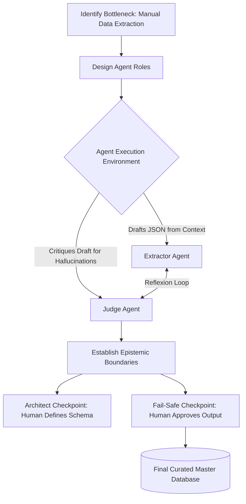

⭐ **[2026-1 Final-term Project - INDEX](../2026-1_Final-term_Project.md)**

# Director Yadanar's Report
**Project:** Clinical Trial Meta-Analyzer

### What I Built
I built the Clinical Trial Meta-Analyzer, an agentic extraction system designed to autonomously read clinical trial PDFs and pull specific quantitative data (e.g., patient counts, median ages, and primary adverse events) into a structured dataset. Rather than treating an LLM as a single-shot oracle, I architected a digital workforce consisting of an Extractor agent and a Judge agent. These agents collaborate in a constrained environment to process medical literature, critiquing and revising each other's work before presenting the final synthesis to a human researcher for approval.

### Architecture & Design Decisions
To manage this digital workforce effectively, I relied heavily on three core patterns:
- **Retrieval-Augmented Generation (RAG):** Medical PDFs are dense. Rather than overwhelming the agents' context windows, I built a chunking and embedding pipeline (`gemini-embedding-2`) to vectorize the documents. The Extractor only operates on the top 5 most relevant semantic chunks, sharply reducing the search space and minimizing hallucinations.
- **Multi-Agent Reflexion Loop:** I deployed two distinct models (`gemini-2.5-flash` for both, to maintain speed and efficiency). The Extractor drafts the initial JSON schema, but the Judge immediately critiques it against the same retrieved context. This adversarial dynamic acts as an automated QA layer, forcing the Extractor to try again (up to 3 times) if the Judge detects missing fields or fabricated numbers.
- **Human-in-the-Loop (HITL) & Master Database:** The agents' final output is not committed directly to the database. It is staged in an interactive editor where the human researcher acts as the final gatekeeper, ensuring high epistemic standards.

### Where the Humans Are in the Loop
The system relies on human checkpoints at the very beginning and the very end of the workflow:
- **Architect Checkpoint (Start):** The human selects the PDF and defines the exact data schema (the prompt) they want extracted. The system does not decide *what* is important; the human sets the target.
- **Fail-safe Checkpoint (End):** The agents autonomously retrieve, extract, and critique the data, but their final output requires explicit human approval. The researcher reviews the JSON in an editable panel, makes necessary corrections, and clicks "Approve & Save." Only then is the data injected with its source filename and committed to the Master Database.
This checkpoint placement is deliberate: it completely automates the tedious middle (skimming, extracting, formatting) while preserving human epistemic taste and accountability at the boundaries.

### The Failures I Saw — And the Lessons
The development process revealed several critical friction points when delegating work to agents:
- **The "Library Versioning" Collapse:** Early on, the pipeline broke completely because the PDF parser (`pdf-parse`) failed silently inside the Next.js environment due to a versioning mismatch (`2.4.5` vs `1.1.1`). The lesson here was about **alignment drift in dependencies**—when the environment shifts, agents working on top of it fail in unpredictable ways. I had to step in and surgically bypass the buggy entry point to restore the pipeline.
- **The Quota Wall:** I initially assigned `gemini-2.5-pro` as the Extractor to maximize reasoning capabilities, but this immediately hit the free-tier API limit (`[429 Too Many Requests] limit: 0`). I learned that managing a digital workforce requires resource allocation just like managing a human team. I downgraded the Extractor to `gemini-2.5-flash`, which proved more than capable for the task when properly constrained by the Judge.

### Critical Reflection on Management

#### Management Workflow & Thinking Process

**Leading an AI workflow vs. writing a program:** Writing a program is deterministic; you write logic, and it executes. Leading an AI workflow feels much more like middle management. I am no longer writing the "how" (the data parsing logic); I am writing the "who" (the Extractor and the Judge) and the "rules of engagement" (the Reflexion loop). I had to accept that the agents will sometimes produce messy outputs, and my job is to build guardrails (the Judge and the HITL gate) to catch those errors gracefully. 
This realization highlighted **the illusion of autonomy**: agents are not truly autonomous. They are highly dependent on the strictness of the environment provided to them (the RAG chunk size, the prompt engineering, the judge's criteria). Without these strict parameters, "autonomy" rapidly degrades into hallucinations.

**Trust as a Gradient:** Another critical insight is that trust in AI is not a binary switch—it's a gradient. Instead of simply "trusting" or "not trusting" the AI, I designed the system to build trust incrementally through the Reflexion loop and solidify it via the Human-in-the-Loop gate. The system shifts the human cognitive load from *data gathering* to *data verification*, lowering exhaustion but maintaining the high standard of responsibility.

**Agent Placement:** In hindsight, I would place *more* agents at the ingestion stage. A dedicated "Classifier Agent" that pre-reads the PDF and categorizes the type of study (e.g., Randomized Control Trial vs. Retrospective Cohort) would help the Extractor use more tailored strategies.

**The Irreplaceable Human Skill:** The irreplaceable skill is **epistemic taste**—the ability to look at an extracted data point (like "Adverse Events: 5%") and instinctively know if it makes clinical sense in the context of the study. The agents can find the number faster than I can, but only the human researcher can validate its scientific integrity before adding it to the Master Database.

### What I Would Do Differently / Next
If I were to rebuild this, I would abandon the naive chunking strategy (splitting by character count) in favor of semantic chunking aware of document structure. Medical PDFs have complex tables and double-column layouts that break basic chunkers, causing the Extractor to miss critical data buried in misaligned tables. 

Additionally, I would implement a more robust audit trail. While tagging the `Source File` in the Master Database is a good start, the ideal system would log the exact chunk and page number the Extractor used for each specific data point, allowing the human reviewer to instantly jump to the source text during the fail-safe checkpoint.
