⭐ **[2026-1 Final-term Project - INDEX](../2026-1_Final-term_Project.md)**

# FinAI Study Buddy: Comprehensive System & Management Report

**Student Number / Name:** 20622037 — Seher Kanwal  
**Course:** Advanced AI Agent Systems  
**Submission Date:** June 2026  

---

*This document is a comprehensive compilation of the system's documentation, encompassing both the **Product & Functional Documentation** and the **Research Director's Management Report**.*

---

## Table of Contents

<!-- toc -->

- [PART I: Product Vision & Functional Modules](#part-i-product-vision--functional-modules)
- [FinMentor – AI-Powered Financial Learning Assistant](#finmentor-%E2%80%93-ai-powered-financial-learning-assistant)
- [PART II: AI Engineering, Architecture & Management](#part-ii-ai-engineering-architecture--management)

<!-- tocstop -->

---

# PART I: Product Vision & Functional Modules

## 1. Product Vision

# FinMentor – AI-Powered Financial Learning Assistant

FinanceMentor AI is designed around a single core idea: **financial literacy through active participation**. Rather than presenting static educational content, the platform places users inside real market scenarios, guides them with a persistent AI mentor, and builds their knowledge through doing — trading, roleplaying, quizzing, and reasoning.

## Motivation
Financial markets are increasingly accessible through mobile apps and online platforms. However, accessibility does not guarantee understanding.

- Beginners often lack financial literacy
- Investment decisions are influenced by hype and misinformation
- Lack of guidance leads to poor outcomes and financial loss

**Objective:**  
To create a system that makes financial learning:
- Simple
- Interactive
- Practical
- Decision-oriented

---

## Problem Statement

Current financial ecosystems have major gaps:

- Users invest without understanding market dynamics
- Platforms focus on raw data instead of explanations
- Learning resources are separate from real-world trading tools

### Core Problem:
> Users have access to data, but lack understanding and guidance.

---

## 2. Proposed Solution: FinMentor

FinMentor is an AI-powered financial assistant designed to bridge this gap.

### Key Capabilities:
- Real-time data + AI explanations
- Integrated learning + decision support
- Scenario-based practice
- Personalized insights

---
### Design Principles

| Principle | How it's expressed |
|---|---|
| **Learning by doing** | Every module has an interactive AI component, not just text |
| **Context-aware guidance** | The AI Mentor knows which page the user is on and adapts accordingly |
| **Emotional intelligence** | Multiple modules specifically target emotional biases (FOMO, panic, overconfidence) |
| **Progressive complexity** | Beginner and Advanced modes change the depth of every module simultaneously |
| **Persistent identity** | User profile, risk tolerance, behavior history, and progress all persist across sessions |

---

## 3. System Design Overview

To keep things simple, the platform is divided into three core pieces that work together:

- **🖥️ User Interface:** The screens, buttons, and dashboards you interact with.
- **🧠 AI Mentor Engine:** The "brain" of the app that answers questions and guides you.
- **💾 Data Storage:** Where your portfolio, progress, and real-time market prices are kept.

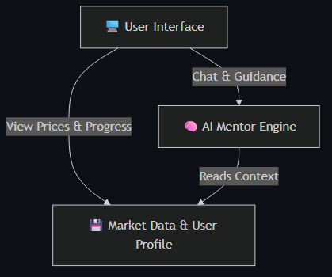

---

## 4. Application Modules

---

### Module 1 — Global AI Mentor

**Location:** Sidebar — visible on every page of the application  
**Role:** The connective tissue of the entire experience. The AI Mentor is not a separate feature — it is a persistent presence that follows the user across all modules.

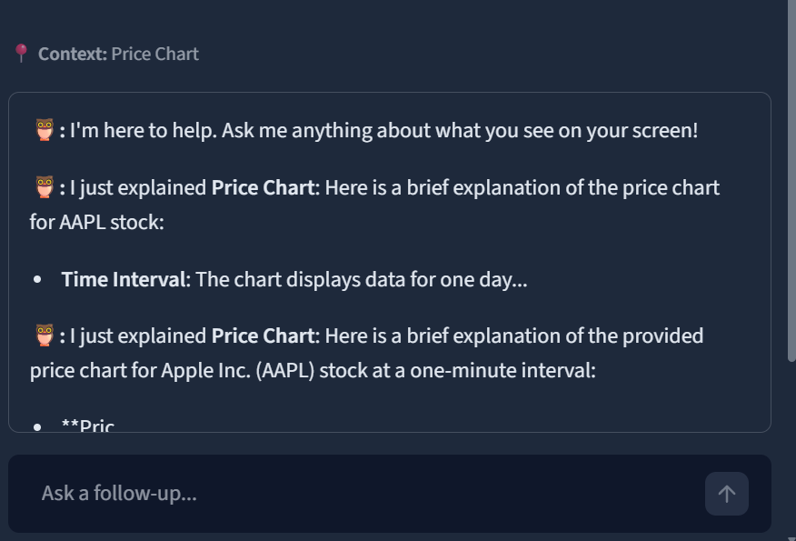
#### Capabilities

- **Contextual Awareness** — The mentor automatically knows which page the user is on and what they are looking at (e.g., a specific stock chart, a quiz question, their portfolio performance). Every AI response is grounded in that context.
- **Persistent Chat Window** — A mini chat interface in the sidebar allows users to ask follow-up questions at any moment without leaving the page they are on.
- **Inline Explanation Popovers** — On key pages, "Explain" buttons trigger an AI-generated breakdown of whatever data is on screen, rendered as an info box with a popover chat window for further questions.
- **Behavior Memory** — Every significant action (viewing a chart, completing a quiz, finishing a roleplay, generating a report) is logged with a timestamp. This log builds a behavioral profile that the mentor uses to personalize guidance.
- **Mode Toggle** — A Beginner / Advanced toggle in the sidebar changes the depth and complexity of AI explanations and chart types across the entire app simultaneously.

#### Design Flow

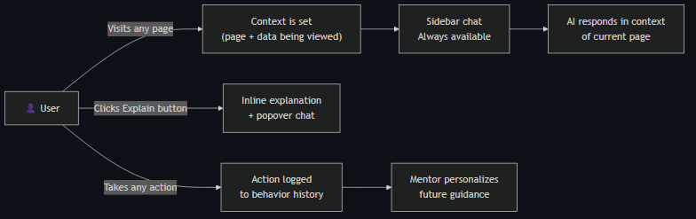

---

### Module 2 — Dashboard

**Location:** Overview → Dashboard (default landing page)  
**Role:** The mission control hub of the application. It surfaces the most critical information from across the platform in one unified view.

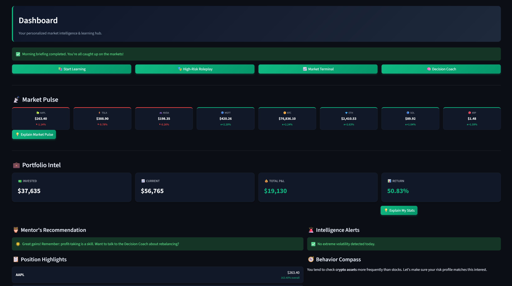

#### Capabilities

- **Daily AI Market Briefing** — The first time the user opens the app on any given day, the AI generates a personalized market overview. The briefing is only shown once per day and is replaced by a completion message on subsequent visits.
- **Quick Navigation** — Four prominent shortcut buttons that take the user directly to the four most-used modules: Learning Paths, Finance Roleplay, Live Market Terminal, and Decision Coach.
- **Live Market Pulse** — A row of eight live price cards tracking a curated watchlist of major stocks and cryptocurrencies. Each card displays the current price and daily percentage change, color-coded green (positive) or red (negative). Data refreshes automatically every 90 seconds.
- **Portfolio Intelligence Panel** — Reads the user's saved portfolio and displays four summary metrics: total invested, current value, total profit/loss, and overall return percentage. Below this, the top three positions are shown as individual performance cards.
- **Intelligence Alerts** — Any asset in the portfolio that moves more than 3% in a day is automatically flagged with a color-coded alert and a one-click link to the News Intelligence module for that asset.
- **Mentor Recommendation** — A dynamic recommendation block at the bottom that changes based on the user's current portfolio performance: it suggests specific modules or scenarios to engage with based on whether the portfolio is up, down, or neutral.
- **Behavior Compass** — After the user has interacted with the app enough to build a behavioral profile, this section surfaces personalized insights (e.g., "You check crypto more than stocks — let's make sure your risk profile reflects this").

#### Layout Design

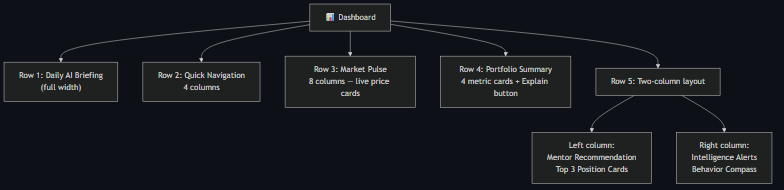

---

### Module 3 — Learning Paths

**Location:** Mentor & Learning → Learning Paths  
**Role:** The structured educational backbone of the platform. Organizes financial knowledge into curated paths with trackable completion and interactive AI assessment.

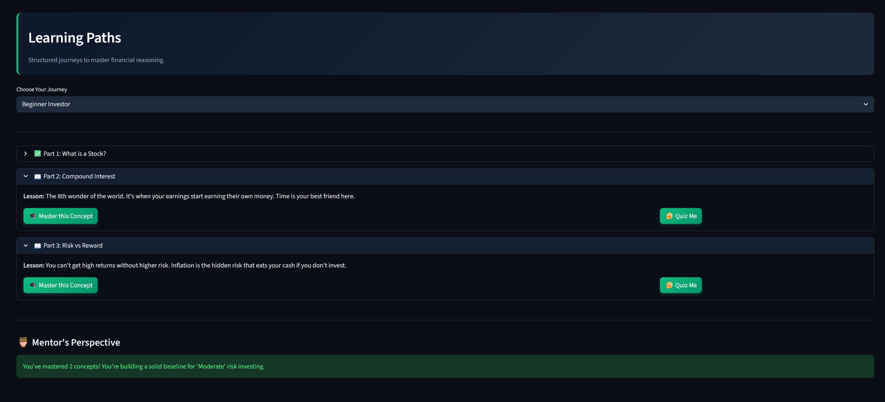

#### Capabilities

- **Three Curriculum Paths** — The module offers three distinct learning journeys, each containing three lessons:
  - *Beginner Investor* — foundational stock market concepts
  - *Crypto Basics* — blockchain, volatility, and self-custody principles
  - *Portfolio Building* — diversification, time horizons, and rebalancing

- **Lesson Cards** — Each lesson is presented as a collapsible panel. Completed lessons are marked with a checkmark. The lesson content is concise — designed to be absorbed in under 2 minutes.

- **Concept Mastery Tracking** — Each lesson has a "Master this Concept" action. When triggered, the lesson is permanently marked complete, the user's learning progress score is updated, and the action is logged in their behavioral profile.

- **AI Quiz Generation** — Each lesson has a "Quiz Me" action. On demand, the AI generates a unique multiple-choice question based on the lesson's content — the question, answer options, correct answer, and explanation are all produced by the AI on the fly. The quiz renders inline within the lesson panel.

- **Quiz Feedback Loop** — After the user submits their answer, the AI provides an explanation regardless of whether they were correct, and opens an inline popover chat so the user can ask follow-up questions about that specific concept.

- **Adaptive Mentor Guidance** — At the bottom of the page, the mentor provides a message that adapts based on how many concepts the user has completed — ranging from encouragement for beginners to unlocking an Advanced Roleplay recommendation once sufficient mastery is demonstrated.

#### Learning Flow

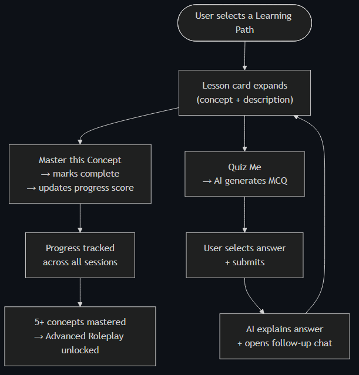

---

### Module 4 — Finance Roleplay Engine

**Location:** Mentor & Learning → Finance Roleplay  
**Role:** The emotional training center of the platform. Places the user inside high-stakes financial scenarios and uses AI to challenge their decision-making in real time.

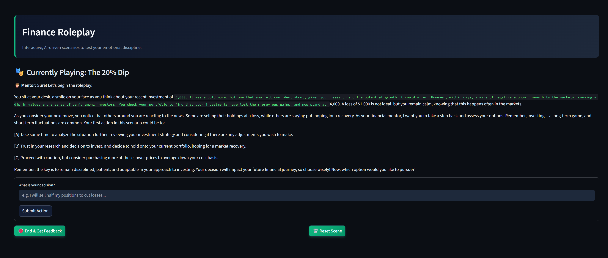

#### Capabilities

- **Scenario Library** — Seven pre-built financial crisis scenarios covering common investor emotional traps: panic selling, FOMO investing, overconfidence, speculative hedging, windfall mismanagement, emergency fund gaps, and retirement anxiety.

- **Custom Scenario** — Users can write any financial dilemma they are personally facing. The AI adapts the roleplay to their custom situation.

- **Immersive Scene Setting** — When a scenario starts, the AI sets the scene with vivid, narrative-style prose designed to create emotional engagement rather than clinical detachment.

- **Turn-Based Decision Loop** — The user types their decision at each turn. The AI reacts dynamically, narrates the likely consequences, and challenges the user's reasoning using the Socratic method — asking follow-up questions rather than simply judging the answer.

- **Persistent Conversation History** — The full exchange is maintained and displayed chronologically, with clear visual distinction between mentor responses and user decisions.

- **End Session Feedback Report** — When the user ends the session, the AI analyzes the entire conversation and produces a structured behavioral report covering strengths, identified risk-blindness patterns, and an Emotional Discipline score out of 10.

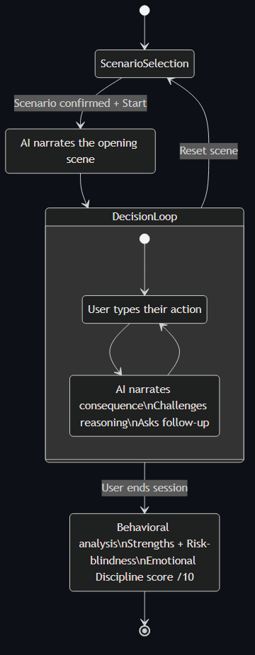

---

### Module 5 — Personal Tutor

**Location:** Mentor & Learning → Personal Tutor  
**Role:** A free-form, always-available AI tutor for answering any financial question the user has, using conversational memory across the session.

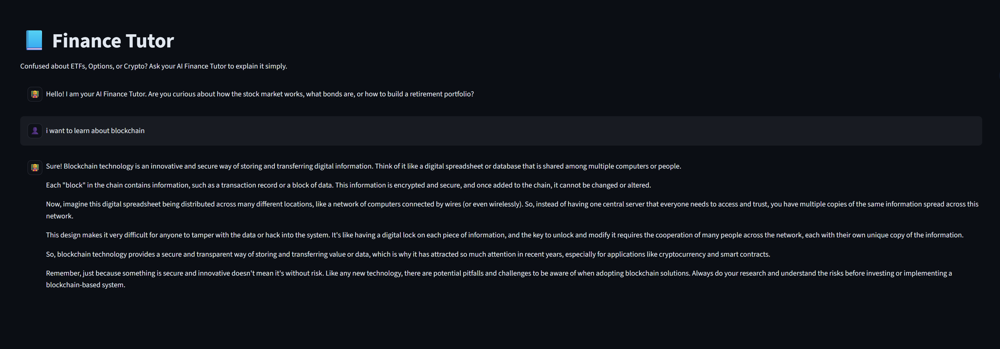

#### Capabilities

- **Open-ended Q&A** — The user can ask any finance-related question in natural language. There are no categories or menus — just a chat interface.
- **Conversational Memory** — The tutor maintains the full conversation history within the session, enabling multi-turn dialogue where later questions can build on earlier answers.
- **Persona Constraints** — The tutor is designed to use everyday analogies to explain complex concepts, always flag risks when discussing speculative assets, and never give specific investment advice.
- **Persistent Chat UI** — Standard chat bubble layout with distinct visual treatments for user messages and tutor responses.

---

### Module 6 — Live Market Terminal

**Location:** Live Markets → Live Terminals  
**Role:** The real-time market visualization hub. Provides price charts for stocks and crypto, and a dedicated live view of the user's actual portfolio holdings.

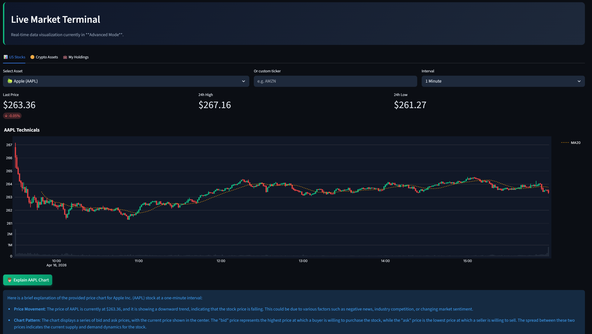

#### Capabilities

- **Three-Tab Structure:**
  - *US Stocks* — Seven pre-configured major stocks plus a custom ticker entry field
  - *Crypto Assets* — Seven pre-configured major cryptocurrencies plus a custom ticker entry field
  - *My Holdings* — Automatically loads the user's saved portfolio and renders charts for any held asset

- **Interval Selection** — Eight time intervals available from 1-minute intraday up to 1-week historical (1m, 5m, 15m, 30m, 1h, 4h, 1d, 1w). Each interval maps to the appropriate historical period for context.

- **Adaptive Chart Mode:**
  - *Beginner Mode* — Filled green line chart showing price trend over time, accompanied by a mentor tip banner explaining what the chart represents
  - *Advanced Mode* — Professional candlestick chart with OHLC bars, 20-day Moving Average overlay, and trading volume bars

- **Live Price Metrics** — Three metric cards above each chart: Last Price (with percentage change delta), 24-hour High, 24-hour Low.

- **Holdings-Specific Features (My Holdings tab):**
  - Full P&L Summary Card showing Live Price, Average Buy Price, Current Value, and Total P&L side by side
  - Average buy price rendered as a dashed horizontal reference line directly on the chart, so the user can visually see whether they are in profit or loss at any moment

- **AI Chart Explanation** — An Explain button on every chart triggers an AI analysis of the current price action, contextualized by the interval and trend direction, with a follow-up chat popover.

#### Tab Design

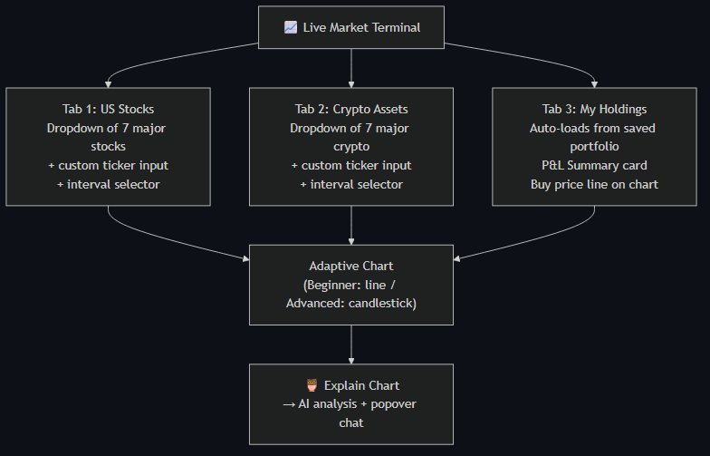

---

### Module 7 — News Intelligence

**Location:** Live Markets → News Analyzer  
**Role:** Connects world events to the user's financial portfolio through AI-summarized news and actionable response buttons.

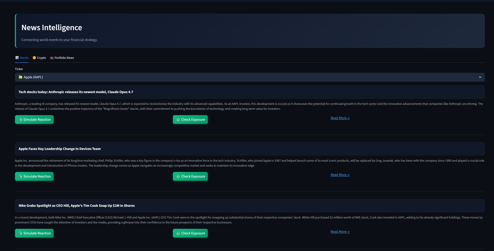

#### Capabilities

- **Three-Tab Structure:**
  - *Stocks* — News feed for any selected stock
  - *Crypto* — News feed for any selected cryptocurrency
  - *Portfolio News* — Sentiment monitoring for all assets in the user's portfolio

- **AI-Summarized Articles** — Each news article is automatically summarized by the AI into 2-3 investor-focused sentences. Summaries are asset-specific and framed from the perspective of someone holding that asset.

- **Actionable Article Cards** — Every news card contains three action buttons:
  - *Simulate Reaction* — pre-loads the news headline as a roleplay scenario and navigates to the Roleplay Engine
  - *Check Exposure* — navigates to the Portfolio Tracker with the user's relevant holdings in view
  - *Read More* — external link to the full article

#### News Card Flow

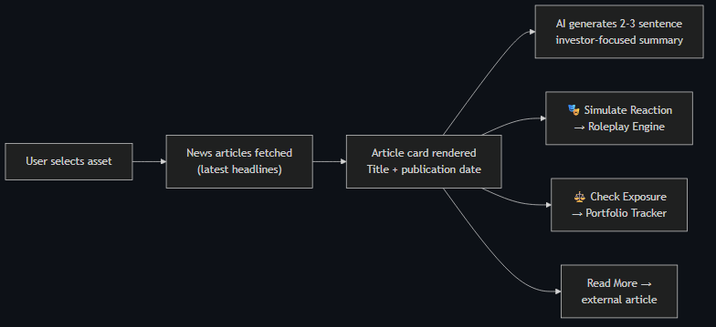

---

### Module 8 — Paper Trading

**Location:** Simulations → Paper Trading  
**Role:** A consequence-free virtual trading environment using live real-world prices, giving users a realistic sense of how trades feel without any financial risk.

#### Capabilities

- **Virtual Cash Balance** — Each session starts with a $10,000 virtual balance. The balance updates in real time as trades are executed.

- **Live-Price Trade Execution** — When a trade is submitted, the system fetches the current real market price for that asset and uses it for the transaction. This ensures the simulation reflects real conditions.

- **Buy Orders** — The system validates that the user has sufficient virtual cash before allowing a purchase. The cost is deducted from the balance and the asset is added to the holdings.

- **Sell Orders** — The system validates that the user holds sufficient units before allowing a sale. Proceeds are credited to the balance.

- **Holdings Dashboard** — All current positions are displayed with live price, today's percentage change (green/red), units held, and current market value.

- **Total Portfolio Value** — A running total of virtual cash plus all open positions gives the user a complete picture of their simulated net worth.

> **Design Note:** Balance and holdings are session-scoped by design. This allows users to always start with a clean slate and practice freely without accumulating simulated history.

---

### Module 9 — Decision Coach

**Location:** Simulations → Decision Coach  
**Role:** A structured reasoning wizard that guides users through a disciplined pre-investment thought process before committing to any financial decision.

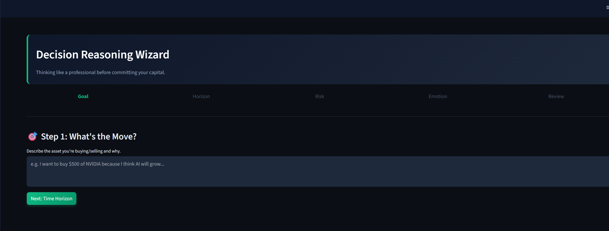

#### Capabilities

- **5-Step Linear Wizard** — The module is designed as a sequential form where each step must be completed before the next is revealed. A visual step indicator at the top shows progress.

- **Step Structure:**

| Step | Name | Input Type | Purpose |
|------|------|------------|---------|
| 1 | Goal | Free text | Describe the trade idea and the reasoning behind it |
| 2 | Time Horizon | Multiple choice | Short / Intermediate / Long / Legacy |
| 3 | Risk Tolerance | Slider (5%–50%) | Maximum loss % before panic selling |
| 4 | Emotional State | Dropdown | FOMO / Fear / Logic |
| 5 | AI Review | Generated output | Structured critique of the user's reasoning |

- **AI Reasoning Review** — The fifth step sends all four preceding inputs to the AI, which responds with a structured five-part critique: reasoning summary, logical strengths, critical risks, overlooked factors, and recommended next research steps.

- **Educational Framing** — The entire module is framed as educational support, not financial advice. The AI plays the role of a critical thinking evaluator, not an advisor.

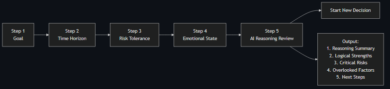

---

### Module 10 — Crisis Simulator

**Location:** Simulations → Crisis Simulator  
**Role:** A rapid-fire decision training tool that presents high-pressure market events as multiple-choice scenarios, evaluated by the AI against optimal responses.

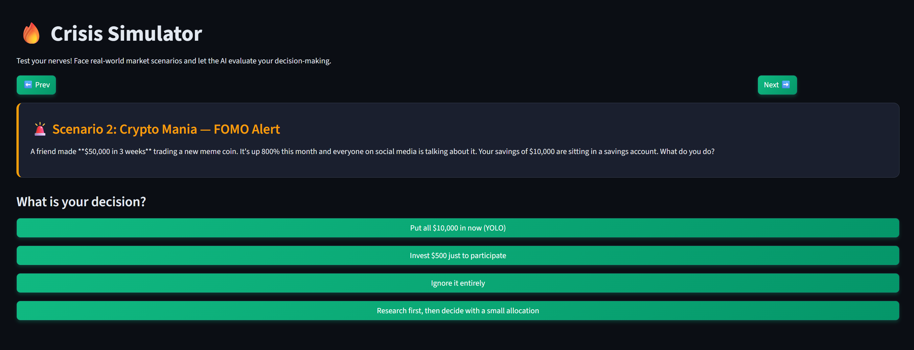

#### Capabilities

- **Scenario Presentation** — Each scenario is rendered as a prominent styled alert card with the event title and a detailed description of the situation (market data, dollar amounts, emotional triggers included for realism).

- **Four-Option Selection** — Each scenario has exactly four response options. The user selects one by clicking it — there is no "submit" button; the click itself triggers evaluation.

- **Instant AI Evaluation** — The moment an option is selected, the AI evaluates the choice against the optimal answer and generates a 3-4 sentence analysis explaining the financial principle at play.

- **Result Presentation** — Correct answers are highlighted with a success indicator. Incorrect answers display the optimal response alongside the analysis. Both outcomes educate the user on why the recommended approach is more sound.

- **Sequential Navigation** — Users can navigate forward and backward through the scenario library at any time. Moving to a new scenario resets the state cleanly.

#### Scenario Library

| Scenario | Market Event | Core Principle |
|---|---|---|
| Flash Crash | S&P 500 drops 22% in a single day | Loss aversion / panic selling |
| Crypto Mania | A meme coin rises 800% in a month | FOMO / speculation risk |
| Interest Rate Shock | Fed raises rates unexpectedly | Asset allocation stability |
| Earnings Miss | A major holding drops 18% after-hours on a small miss | Patience / fundamental analysis |

---

### Module 11 — My Mastery Profile

**Location:** Profile → My Mastery  
**Role:** The user's personal command center — combining identity configuration, portfolio management, educational progress tracking, and a personalized portfolio news briefing.

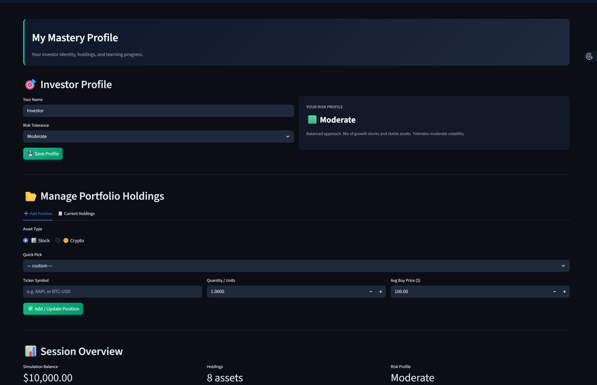

#### Capabilities

- **Investor Profile Settings** — Users can set their display name and choose a risk tolerance level (Conservative, Moderate, Aggressive, or Speculative). Each level has a description. The selected risk profile influences AI recommendations and mentor tone across the entire app.

- **Portfolio Management Interface** — A full add/edit/delete interface for the user's investment portfolio:
  - *Quick Pick dropdowns* for major stocks (AAPL, TSLA, NVDA, MSFT, AMZN, GOOGL, META) and crypto (BTC, ETH, SOL, XRP, BNB, ADA)
  - Custom ticker entry for any asset
  - Fields for quantity and average buy price
  - Existing positions are updated rather than duplicated
  - A holdings view tab shows all positions with per-row delete controls

- **Default Portfolio Seeding** — On first launch, the portfolio is automatically populated with five popular stocks and three major cryptocurrencies so all market-connected modules display meaningful data immediately.

- **Financial Concepts Checklist** — A list of twelve core financial concepts displayed as checkboxes. Users manually track which concepts they have studied. A progress bar shows overall financial literacy percentage.

- **Portfolio News Feed** — The app automatically fetches the three latest news headlines for each asset the user holds and displays them as styled cards with publication dates and external links.

- **AI Portfolio News Summary** — A single-click AI briefing that synthesizes all portfolio headlines into four sections: overall sentiment, per-asset highlights, action points tailored to the user's risk profile, and an emotional discipline reminder.

#### Module Layout

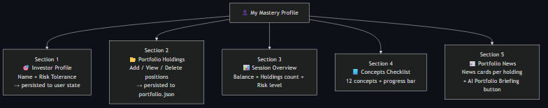

---

### Module 12 — Portfolio Tracker

**Location:** Live Markets → Portfolio Tracker  
**Role:** A deep-dive analytical view of the user's portfolio, combining real-time valuation, visual risk analysis, rule-based risk alerts, and AI-generated intelligence reports.

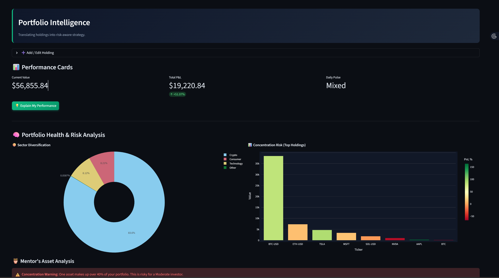

#### Capabilities

- **Add / Edit Holdings** — An expandable form allows users to add new positions (ticker, units, average buy price) or update existing ones. Changes are persisted immediately.

- **Performance Summary Cards** — Three metric cards showing current total value, total P&L (absolute and percentage), and the daily portfolio pulse (mixed, or a specific percentage if only one holding).

- **Risk Intelligence Charts** — Two side-by-side visualizations:
  - *Sector Diversification* — A donut chart that groups all holdings by sector (Technology, Consumer, Finance, Crypto, Other) and shows the percentage allocation of each
  - *Concentration Risk* — A bar chart sorted by position value, color-coded along a red-to-green gradient by P&L percentage, highlighting which positions dominate the portfolio

- **Rule-Based Automatic Risk Alerts:**
  - **Concentration Warning** — Triggers if any single asset exceeds 40% of total portfolio value
  - **Sector Overexposure Warning** — Triggers if Technology-sector holdings exceed 60% of total portfolio value

- **AI Smart Report** — On demand, generates a comprehensive portfolio risk assessment covering diversification gaps, sector exposure analysis, mismatch between holdings and stated risk profile, and emotional discipline recommendations.

- **Position Management Table** — A detailed table of all positions with full P&L data. Individual positions can be removed via a dropdown-and-delete interaction.

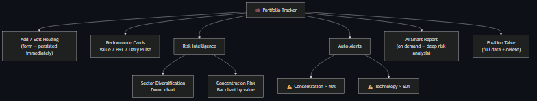

---

## 5. Navigation Structure

The application uses a hierarchical sidebar navigation with five top-level groups, each containing logically related modules.

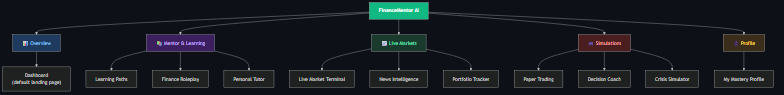

---

## 6. Data Architecture

The platform uses a tiered data model: some state lives only for the duration of a browser session, while other state is persisted to disk and survives across sessions.

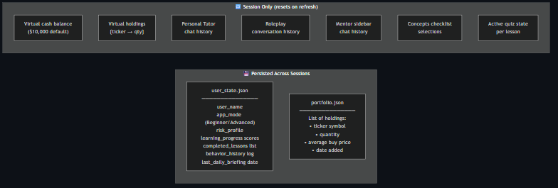

---

## 7. AI Integration Design

All AI capabilities in the platform flow through a single integration layer that manages communication with the local Ollama LLM instance.

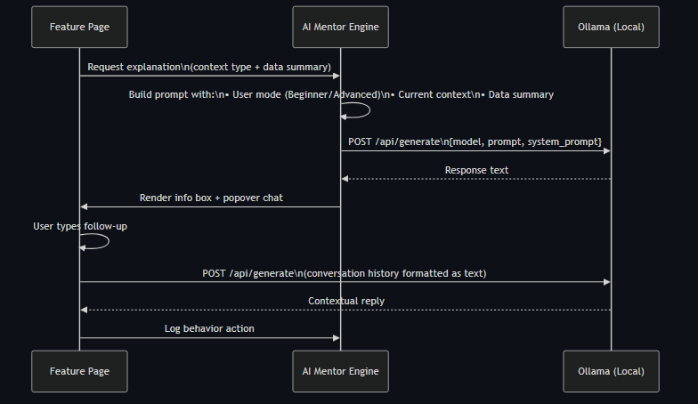

### AI Prompt Design Principles

| Principle | Implementation |
|---|---|
| **Mode-awareness** | Every prompt includes the user's current mode (Beginner/Advanced) |
| **Context-anchoring** | The current page and data being viewed is always included |
| **Persona consistency** | A financial mentor system prompt is applied to all requests |
| **Safety guardrails** | The AI is always instructed never to give specific buy/sell advice |
| **Graceful degradation** | If the LLM is unavailable, a clear warning is shown — no crash |

### Use Cases by Module

| Module | AI Use Case | Conversation Type |
|---|---|---|
| Global Mentor | Sidebar chat & inline explanations | Multi-turn |
| Dashboard | Daily briefing, chart explanation | Single-turn |
| Learning Paths | Quiz generation, answer explanation | Single-turn |
| Finance Roleplay | Scene narration, reaction, feedback | Multi-turn |
| Personal Tutor | Free-form Q&A | Multi-turn |
| Live Market Terminal | Chart pattern explanation | Single-turn |
| News Intelligence | Article summarization | Single-turn (cached) |
| Decision Coach | Reasoning review | Single-turn |
| Crisis Simulator | Decision evaluation | Single-turn |
| Portfolio Tracker | Smart risk report | Single-turn |
| My Mastery Profile | Portfolio news briefing | Single-turn |

---

## 8. User Experience Design

### Visual Design System

| Element | Design Choice | Rationale |
|---|---|---|
| Background | `#0B0E14` (near-black) | Reduces eye strain for extended sessions; professional trading terminal aesthetic |
| Primary accent | `#10B981` (emerald green) | Universal market "up" color; conveys growth and positivity |
| Negative accent | `#EF4444` (red) | Universal market "down" color; immediately recognizable |
| Warning accent | `#F59E0B` (amber) | Mid-tier signal for alerts and indicators |
| Card background | `#111827` | Slightly lighter than page background for clear depth hierarchy |
| Border color | `#1F2937` | Subtle separation without harsh lines |
| Typography | Inter (sans-serif) | Modern, highly legible at small sizes; used in financial dashboards |

### Interaction Patterns

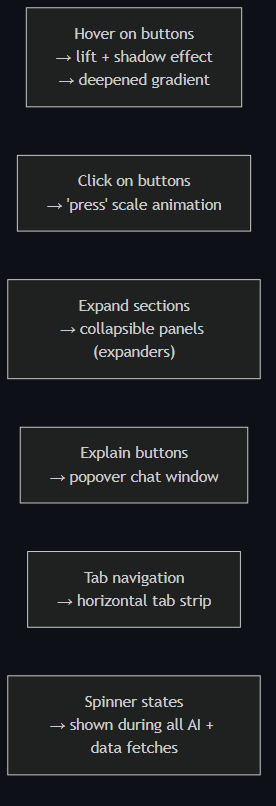

### Adaptive Complexity (Beginner vs. Advanced Mode)

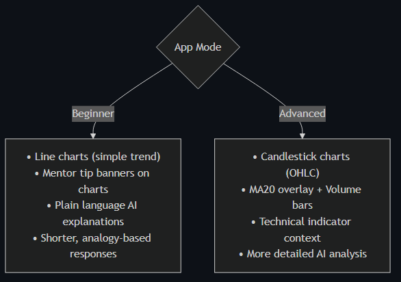

---

## 9. Adaptive Mode System

The Beginner / Advanced mode switch is designed to be a **single control** that changes the behavior of multiple modules simultaneously — no need to configure each feature separately.

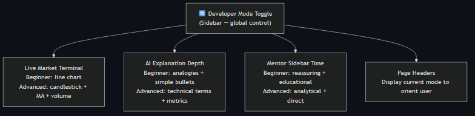

The mode selection is persisted to the user profile so it survives across sessions. Switching modes triggers an immediate full page reload so all components update at once.

---

## 10. Implementation

FinMentor is implemented as an interactive, AI-powered web application that integrates real-time financial data, visualization tools, and large language models to provide intelligent insights and learning support.

### 10.1 System Design

The system follows a modular architecture, where each component is responsible for a specific functionality:

- **User Interface (UI)**  
  Built using Streamlit, the UI provides a multi-page dashboard where users can:
  - View market data  
  - Analyze news  
  - Track portfolios  
  - Interact with AI through a chat interface  

- **Data Layer**  
  Real-time financial data is retrieved using the **yfinance API**, which provides:
  - Stock prices  
  - Cryptocurrency data  
  - Historical trends  

- **Visualization Layer**  
  Financial data is visualized using **Plotly**, enabling:
  - Interactive charts  
  - Dynamic updates  
  - Easy interpretation of trends  

- **AI Engine**  
  The system uses a local Large Language Model via **Ollama (Qwen)**, which:
  - Generates explanations for market trends  
  - Summarizes financial news  
  - Provides portfolio risk insights  
  - Supports conversational interaction  

---

### 10.2 Functional Modules

FinMentor is divided into four main modules:

#### 9.2.1 Market Module
- Fetches real-time financial data  
- Displays charts and indicators  
- Uses AI to explain trends in simple language  

#### 9.2.2 News Module
- Collects financial news  
- Summarizes key points  
- Performs sentiment analysis (positive/negative impact)  

#### 9.2.3 Portfolio Module
- Tracks user investments  
- Analyzes risk factors (e.g., sector concentration)  
- Links relevant news to portfolio assets  

#### 9.2.4 Learning Module
- Provides chat-based learning  
- Generates quizzes to test understanding  
- Includes roleplay scenarios for decision-making practice  

---

### 10.3 System Workflow

1. The user interacts with the system through the dashboard or chat interface  
2. The system retrieves real-time financial data from APIs  
3. The AI model processes the data along with user queries  
4. The system generates:
   - Explanations  
   - Insights  
   - Simulations  
5. Results are displayed through an interactive interface  

---

### 10.4 Key Advantages of Implementation

- Combines real-time data with AI-driven reasoning  
- Provides an interactive and user-friendly experience  
- Supports both learning and practical decision-making  
- Uses a local LLM for efficient and privacy-aware processing  

---

## 11. Conclusion

FinMentor presents a novel approach to financial learning by integrating data, intelligence, and interaction into a single platform.

### 11.1 Summary

- Transforms financial tools into an interactive learning system  
- Bridges the gap between data visualization and user understanding  
- Combines market analysis, news insights, portfolio tracking, and learning support  

---

### 11.2 Impact

The system enables users to:

- Understand complex financial concepts more easily  
- Make informed and confident investment decisions  
- Practice decision-making in realistic scenarios  
- Reduce reliance on speculation and guesswork  

---

### 11.3 Future Work

Future improvements may include:

- Integration of advanced financial indicators  
- Expansion to global market data sources  
- Enhanced personalization based on user behavior  
- More complex roleplay and simulation scenarios  

---

### Final Statement

FinMentor demonstrates how AI can be used to empower users with knowledge, making financial markets more accessible, understandable, and actionable.

---

# PART II: AI Engineering, Architecture & Management

## 1. What I Built

FinAI Study Buddy is an intelligent, agentic finance mentoring platform built with Streamlit and powered by a locally-running large language model (LLM) via Ollama. The intent was not simply to build a chatbot, but to engineer a **digital workforce** — a system of coordinated AI agents that guides users from financial ignorance toward genuine financial literacy. The platform combines real-time market data, a Retrieval-Augmented Generation (RAG) knowledge engine, an autonomous critique-and-refinement pipeline, and a Human-in-the-Loop (HITL) governance layer, all wrapped in a polished, production-grade web interface. The goal was for every user interaction — whether asking the AI a question, exploring live markets, running a portfolio simulation, or completing a roleplay scenario — to be anchored by educational intent, not speculative excitement.

---

## 2. Architecture & Design Decisions

The system was architected around six core patterns directly taught in this course. Each was implemented deliberately with a clear engineering rationale, not added superficially. The sections below describe each pattern with full implementation depth.

---

### 2.1 Conversational Memory — Context That Persists Across Sessions

**The Problem Being Solved**

A standard chatbot forgets everything the moment the page refreshes. For a finance mentor, this is unacceptable: a user who told the AI their risk tolerance last week should not have to repeat themselves today. The system needed both short-term conversational context (to follow a multi-turn dialogue) and long-term behavioural memory (to personalise guidance over time).

**Implementation: Two-Layer Memory Architecture**

The memory system is implemented across the core backend and operates in two distinct layers:

**Layer 1 — Conversational (Short-Term) Memory**

Every message exchanged in the AI mentor sidebar chat is persisted to the `chat_messages` table in the local SQLite database via `db_save_chat_message()`. When the app loads, `db_get_chat("sidebar")` restores the full prior conversation into `st.session_state.mentor_chat`. This means the AI's context window always includes recent history — the last 6 messages are included in every prompt sent to the LLM:

The number 6 was chosen deliberately: it captures enough conversational context for coherent multi-turn dialogue while staying within the local model's practical context length limit without causing slowdowns.

**Layer 2 — Behavioural (Long-Term) Memory**

The `track_behavior(action, detail)` function in the backend modules is called at every semantically meaningful user action throughout the application:

Each call writes a timestamped record to the `user_behaviors` table in the database **and** appends to `state["behavior_history"]` in the user's persistent state. The behavior history is capped at 100 entries to prevent unbounded growth. This log is then read by dashboard widgets to produce personalised guidance — for example, the Behavior Compass on the dashboard detects patterns:

**Layer 3 — User State (Profile Memory)**

The user's name, risk profile (`Conservative` / `Moderate` / `Aggressive` / `Speculative`), app mode (`Beginner` / `Advanced`), learning progress percentages, and list of completed lessons are all persisted to the `user_state` table in SQLite via `db_save_user_state()` and `db_get_user_state()`. This state is loaded into `st.session_state.mentor_state` at application start and flows through the system prompt of every AI call:

The effect is that the AI's tone, vocabulary level, and assumed prior knowledge all adjust based on what the system knows about this specific user from prior sessions.

**Memory Architecture Diagram**

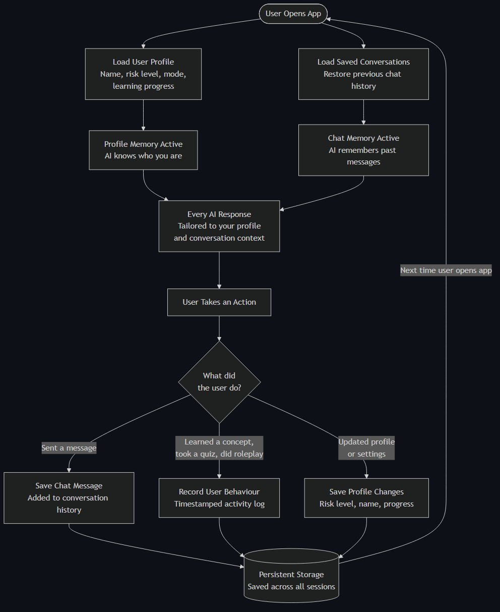

---

### 2.2 AI Verification Module — The Critique-and-Refine Loop

**The Problem Being Solved**

A locally-running LLM producing financial guidance is an inherently risky proposition. Without any verification, the model might state that a specific stock "will definitely rise", recommend a specific trade, or produce factually misleading information. A naive solution would be to add a long system prompt saying "don't give bad advice" — but this is fragile and untestable. A more robust solution is a **second AI that checks the first AI's work**.

**Implementation: Three-Stage Sequential Pipeline**

The verification module is implemented in the backend system and runs as a three-stage pipeline for every question asked in the AI mentor chat:

**Stage 1 — Initial Draft Generation**

The base model (`aya`) receives the user's question, enriched with any live market context from the MCP layer (described below). It generates an unconstrained first-pass response:

**Stage 2 — Structured Compliance Critique**

A second model (`llama3`, or the base model as fallback if `llama3` is not installed) acts as a compliance editor. It receives:
- The original user question
- The base model's draft response
- The full list of active risk criteria, loaded live from the database

The critic's system prompt instructs it to respond **only in valid JSON** with a specific schema:

The structured critique result includes the overall risk level, a list of every specific criterion that was triggered (with the exact quote from the draft that triggered it), and a human-readable summary. This is far richer than a simple pass/fail — it provides actionable diagnostic information.

**Stage 3 — Streaming Refinement**

If issues were found, the base model is called a second time with the critique embedded in a new prompt, instructing it to correct its response while maintaining its educational tone. This final response is **streamed token by token** to the user via `yield`, creating a live-typing effect:

The user never sees the draft — they only see the refined, verified output. The entire verification flow is invisible to the user, appearing only as a slightly longer response time.

**What Happens When Verification Fails**

If the critique returns `risk_level` of `RISKY` or `ALARMING`, the system automatically:
1. Saves the full record to the `risk_alerts` database table
2. Makes it available for admin review in the Risk Monitor dashboard
3. Still serves the refined response to the user (so experience is not disrupted)
4. Marks the alert as pending human review

**AI Verification Pipeline Diagram**

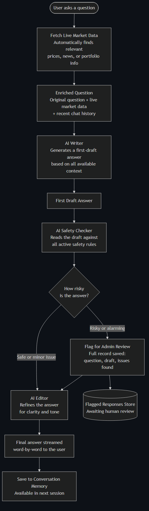

---

### 2.3 Risk Analysis Layer — Dynamic, Updatable Safety Rules

**The Problem Being Solved**

Hardcoding what counts as "risky" financial advice is brittle. What is acceptable to tell a speculative investor is unacceptable to tell a conservative beginner. What was an appropriate heuristic in 2023 may need updating after regulatory changes. The system needed a governance layer where the definition of risk is **not baked into code** but is instead maintained as data — readable, editable, and effective immediately without redeployment.

**Implementation: The Criteria-as-Data Pattern**

The risk analysis system has two interacting components:

**Component A — The Risk Criteria Database**

Risk criteria are stored in the `risk_criteria` table in SQLite. Each criterion has:
- `label`: a short human-readable name (e.g., "Direct Buy/Sell Advice")
- `description`: a detailed explanation of what the AI should flag (e.g., "Response contains a direct instruction to buy or sell a specific asset without appropriate educational caveats")
- `severity`: one of `WARNING`, `RISKY`, or `ALARMING`
- `active`: a boolean toggle that enables or disables the criterion without deleting it

The criteria are **loaded live at query time** — not cached at startup:

This is the key architectural decision: because criteria are injected into the critic's system prompt at runtime, an admin changing a criterion at 3pm will affect the very next user query at 3pm — with no code changes, no restart, and no redeployment.

**Component B — The Admin Risk Monitor (the backend modules)**

The Risk Monitor is a dedicated admin interface with two tabs:

*Tab 1 — Risk Alerts:* Displays all flagged AI responses with full provenance:
- The exact user question that triggered the flag
- The base model's unmodified draft (the "before" state)
- The structured critique with each triggered criterion highlighted by severity colour
- The final refined response shown to the user (the "after" state)
- An admin notes field for the human reviewer to document their judgment
- A "Mark as Reviewed" button that sets `admin_reviewed = True` in the database

*Tab 2 — Criteria Manager:* Allows the admin to edit any criterion in place, change its severity level, activate or deactivate it, and add entirely new criteria:

When "Save All Criteria Changes" is clicked, the model cache for criteria is explicitly flushed:

This ensures the next critic call picks up the updated definitions, not a stale in-memory copy.

**The Risk Escalation Logic**

Risk levels follow a strict escalation hierarchy. The overall risk level of any response is the **maximum severity** across all triggered criteria:

| Risk Level | Meaning | Automatic Action |
|---|---|---|
| ✅ SAFE | No criteria triggered | Response shown normally |
| ⚠️ WARNING | Minor issues only | Response refined; not logged |
| 🔴 RISKY | At least one RISKY criterion triggered | Logged to `risk_alerts`; refined response shown |
| 🚨 ALARMING | At least one ALARMING criterion triggered | Logged; admin notified; refined response shown with warning |

**Risk Analysis Layer Diagram**

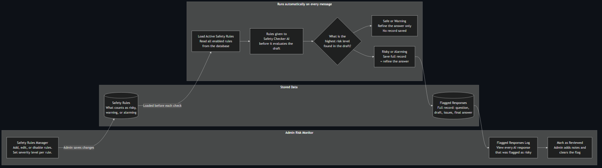

---

### 2.4 Retrieval-Augmented Generation (RAG) — Grounding the AI in User Knowledge

**The Problem Being Solved**

A local LLM's parametric knowledge has a training cutoff and is generalised, not personalised. A finance mentor should be able to answer questions grounded in *specific educational materials* — for example, course notes, financial textbooks, or a company's annual report that the user uploads. The system needed to let users bring their own knowledge base and have the AI reason over it.

**Implementation: Full RAG Pipeline from Scratch**

The RAG system is implemented in the backend system and consists of four stages:

**Stage 1 — Document Ingestion**

The system accepts PDF, TXT, and Markdown files. Text extraction is handled per file type:

**Stage 2 — Intelligent Chunking**

Raw text is split into 800-character chunks with 150-character overlap. Critically, the chunker respects sentence boundaries — it looks back up to 100 characters from the target split point to find a sentence-ending punctuation mark, preventing chunks from cutting mid-sentence:

The 150-character overlap ensures that a concept spanning a chunk boundary is represented in both adjacent chunks, reducing the chance of a relevant passage being missed during retrieval.

**Stage 3 — Vector Embedding**

Each chunk is converted to a dense vector representation using the Ollama embedding API. The system tries two endpoints to handle different Ollama versions:

All chunk embeddings are stored as serialised lists in the SQLite database alongside the chunk text, document ID, and chunk index.

**Stage 4 — Semantic Retrieval at Query Time**

When a user asks a question, the query is embedded using the same model. Cosine similarity is computed between the query embedding and every stored chunk embedding. The top 4 chunks by similarity are assembled into a context block prepended to the LLM prompt:

The assembled context block includes the source filename and section number, giving the AI (and potentially the user) full traceability back to the original document.

**RAG Pipeline Diagram**

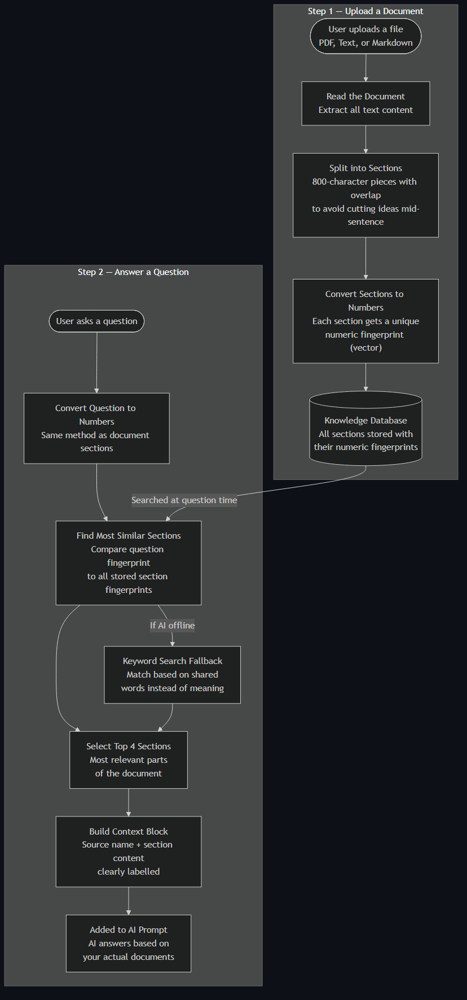

---

### 2.5 Third-Party Live Service APIs — Real-Time Financial Data

**The Problem Being Solved**

A finance mentor that discusses markets using stale or hypothetical prices is educationally misleading. If a user asks "Is NVDA doing well today?", the answer must be based on today's actual price, not a training-time approximation. The system needed a reliable, real-time data feed from a trusted third-party service.

**Implementation: yfinance as the Live Data Layer**

The application uses `yfinance`, a Python wrapper for Yahoo Finance's public data API, as its primary market data source. This library is called in three distinct contexts across the application:

**Context 1 — Dashboard Market Pulse (pages/1_dashboard.py)**

Eight assets (AAPL, TSLA, NVDA, MSFT, BTC-USD, ETH-USD, SOL-USD, XRP-USD) are fetched using a 90-second TTL cache to balance freshness against API rate limits:

The 5-day history window (rather than a single-day fetch) is used because single-day data is unreliable during pre-market hours and on weekends when some assets trade and others do not.

**Context 2 — MCP Tools (utils/mcp_tools.py)**

The five MCP tools each call yfinance directly to serve live data to the AI prompt enrichment layer:

- `get_stock_quote()` fetches price, change %, volume, market cap, P/E ratio, and 52-week range
- `get_market_overview()` fetches S&P 500 (SPY), Nasdaq (QQQ), Dow Jones (DIA), Bitcoin, and Gold
- `get_financial_news()` fetches recent headlines from Yahoo Finance's news feed for any ticker
- `get_stock_comparison()` fetches the above metrics for up to 4 tickers simultaneously

**Context 3 — Portfolio News Intelligence (pages/8_profile_progress.py)**

The user's actual holdings are cross-referenced with Yahoo Finance's news API to produce a personalised news feed. An AI summary is then generated over all headlines:

**Robustness Patterns Applied**

Because Yahoo Finance is a public, unofficial API, its reliability is not guaranteed. The codebase applies several defensive patterns:
- All yfinance calls are wrapped in `try/except` blocks returning safe defaults (price=0.0, change=0.0)
- MultiIndex column headers are flattened before access (a common yfinance quirk)
- NaN values are explicitly detected and replaced with 0.0 before arithmetic
- `fast_info` is used instead of `info` wherever possible to avoid slow full-metadata fetches

---

### 2.6 Model Context Protocol (MCP) — Giving the AI Access to Tools

**The Problem Being Solved**

An LLM's base knowledge is static. When a user asks "What is TSLA trading at right now?", the model cannot answer from parametric memory alone — the answer changes every second. The solution is to equip the AI with **callable tools** that fetch live data at the moment of inference, and inject that data into the prompt before the model generates its response. This is precisely what the Model Context Protocol (MCP) framework provides.

**Implementation: FastMCP + Intent-Driven Auto-Dispatch**

The MCP implementation has two files working together:

**File 1 — the backend modules: Tool Definitions**

Five tools are defined and registered with `FastMCP("FinAI-Study-Buddy")`. Each tool is a standard Python function decorated with `@mcp.tool()` and has a typed signature that MCP uses to generate its tool schema:

The tools are designed to be independently callable — they work both when invoked by the internal MCP client and when the module is served as a standalone MCP server (usable by Claude Desktop, Cursor, or any external MCP-compatible client).

**File 2 — the backend modules: Autonomous Intent Detection and Dispatch**

The MCP client acts as the intelligence layer that decides *which tools to call* based on the user's question — without requiring the user to specify this explicitly. It uses three detection mechanisms:

1. **Ticker Extraction**: A regex finds all 2–5 character ALL_CAPS sequences in the question. These are filtered against a blocklist of common non-ticker abbreviations (`AI`, `GDP`, `CPI`, `ETF`, etc.) and against a known-ticker whitelist of ~80 tickers. Common company names are also mapped: `"apple"` → `AAPL`, `"tesla"` → `TSLA`.

2. **Portfolio Intent Detection**: A keyword set (`"my portfolio"`, `"should i sell"`, `"what do i hold"`, etc.) identifies questions about the user's own holdings, triggering `get_portfolio_summary()`.

3. **Market Overview Intent**: Another keyword set (`"how is the market"`, `"nasdaq"`, `"stock market today"`, etc.) triggers `get_market_overview()`.

The orchestration logic in `enrich_prompt_with_context()`:

The assembled context block is prepended to the Ollama prompt **before** the base model generates its draft and **before** the critic model evaluates the response. This means every agent in the pipeline — both generation and verification — operates on live, factually grounded data.

**The `tools_used` Audit Record**

Every tool invocation is logged to a `tools_used` list that records the tool name, arguments, result summary, and success status. This is stored in `st.session_state.mentor_critique_flow` after every chat interaction, providing a complete audit trail of exactly which external data sources informed each AI response.

**MCP Tool Dispatch Diagram**

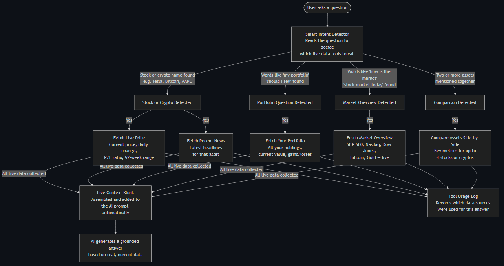

---

### 2.7 Overall System Integration

The six patterns above are not independent modules — they interlock into a single coherent pipeline. The following diagram shows exactly how a user's question flows through the full system from input to final response.

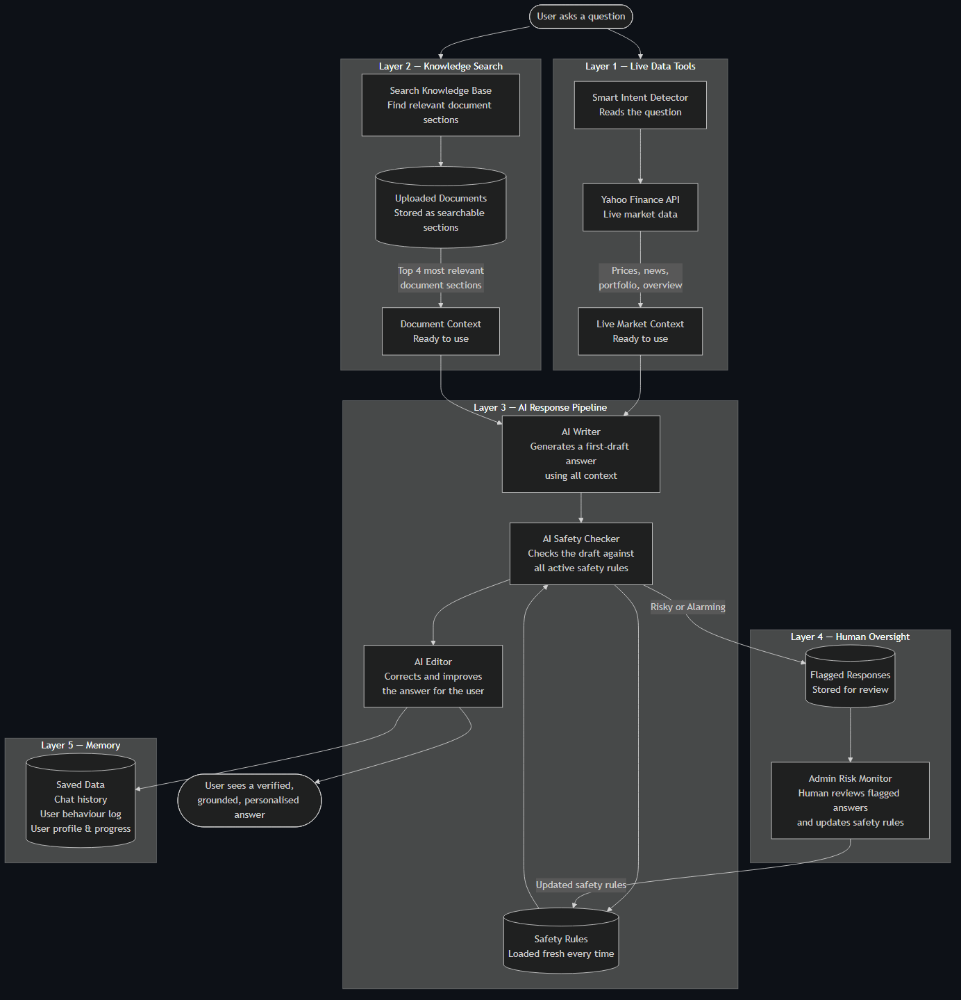

Every component that touches persistent state writes to SQLite — a single local database that serves as the system's shared memory, audit log, and configuration store simultaneously.

---

## 3. Where the Humans Are in the Loop

This is arguably the most important design dimension in the system. The following table maps every major action to its automation level and the rationale for each checkpoint placement.

### 3.1 Automation Level Map

| Action | Automatic? | Requires Human? | Rationale |
|---|---|---|---|
| Live market data fetch (MCP tools) | ✅ Fully automatic | No | Market data is objective fact; no judgment needed |
| RAG retrieval from documents | ✅ Fully automatic | No | Retrieval is deterministic similarity search |
| Initial LLM draft generation | ✅ Fully automatic | No | First pass; will be checked by critic |
| Compliance critique | ✅ Fully automatic | No | Critic provides structured signal, not final gating |
| Response refinement | ✅ Fully automatic | No | Improves output quality before user sees it |
| Risk alert creation (RISKY/ALARMING) | ✅ Fully automatic | No | Detection is automated; action on it is human |
| **Admin alert review** | ❌ Manual | **Yes — Admin** | Human must judge if the flagged response was a true positive or false positive, and whether criteria need updating |
| **Risk criteria management** | ❌ Manual | **Yes — Admin** | The rules governing what the critic checks are human-defined, human-editable, and take effect live |
| **Risk profile selection** | ❌ Manual | **Yes — User** | The system cannot infer risk tolerance; it must be declared |
| **Portfolio entry (buy price, qty)** | ❌ Manual | **Yes — User** | Financial data is private and personal; the AI cannot know this |
| **Learning progress marking** | ❌ Manual | **Yes — User** | User clicks "Master this Concept" — deliberate confirmation of understanding |
| **Roleplay decision-making** | ❌ Manual | **Yes — User** | The entire pedagogical value of roleplay depends on genuine human choices |
| **AI news summary generation** | Semi-manual | User-triggered | Button prevents unsolicited AI commentary on live news |

### 3.2 Checkpoint Placement Rationale (Week 14 Concepts)

The key insight from course Week 14 is that **checkpoints should be placed where the cost of an error exceeds the cost of the delay**. I applied this principle as follows:

- **Why no checkpoint before showing AI chat responses?** The critique loop already acts as an automated pre-screen. Adding a human checkpoint before every message would destroy the conversational experience without meaningful safety gain, since the critic model already flags and refines risky content.

- **Why a human checkpoint for admin alert review?** Because the critic model can produce false positives. A human admin must judge whether a flagged response was genuinely harmful or merely unusual phrasing. Automated deletion or suppression of flagged responses would risk over-censorship.

- **Why a human checkpoint for criteria management?** The compliance criteria are the governance lever of the entire system. Automating their modification — for example, having the AI self-update criteria based on false positive patterns — would create an **alignment drift** risk: the AI could progressively weaken its own safety constraints. Human ownership of this layer is non-negotiable.

- **Why require the user to mark lessons complete?** Automated tracking based on page view time would be superficial and gameable. The deliberate button press creates a micro-commitment, increasing the probability that the concept was genuinely processed.

---

## 4. The Failures I Saw — And the Lessons

### 4.1 Embedding Failures and the Keyword Fallback

**What broke:** During initial RAG testing, the Ollama embedding API returned inconsistent results depending on the loaded model. When using the `aya` model for embeddings, the vector dimensionality changed between queries, causing cosine similarity to return 0.0 for all chunks and silently falling back to the worst possible retrieval.

**What I learned:** Never assume the embedding model is stable across requests. The fix was a two-endpoint fallback (`/api/embeddings` → `/api/embed`), followed by a keyword-matching fallback (`keyword_match_score()`) when vectors were unavailable or mismatched. The lesson generalises: **all AI subsystems need graceful degradation paths**. A system that silently fails is more dangerous than one that fails loudly.

### 4.2 The Critique Model Returning Unstructured Text

**What broke:** The `llama3` critic model occasionally returned its JSON assessment wrapped in markdown code fences or with explanatory text before the JSON object, causing `json.loads()` to throw and the entire critique to be discarded — defaulting to `risk_level: SAFE`.

**What I learned:** LLMs do not reliably respect output format constraints, even with explicit system prompts. The fix was a regex-based extraction layer that strips markdown fences and finds the first `{...}` block in the output. The broader lesson: **structured LLM output requires defensive parsing, not optimistic parsing**. Assuming the model will comply is an alignment assumption that will be violated.

### 4.3 The Ticker Blocklist Gap

**What broke:** The MCP intent detector initially extracted words like "AI", "GDP", "CPI", and "ETF" as valid ticker symbols, causing spurious `get_stock_quote` calls that returned API errors and polluted the context block with noise.

**What I learned:** NLP-based intent extraction over financial text requires a domain-specific blocklist. Generic English words that are all-caps in a financial context are especially treacherous. The fix was the `TICKER_BLOCKLIST` set in the backend modules. The broader lesson: **tool invocation errors are not just technical failures — they degrade the AI's epistemic grounding**, because a noisy context block reduces the signal quality available to the generation model.

### 4.4 What the Audit Trail Looks Like

Every critique-loop interaction that reaches RISKY or ALARMING level generates a database record with:
- `user_question`: the exact text the user typed
- `draft_response`: the base model's initial output
- `critique_text`: the full critic model assessment
- `risk_reasons`: structured list of triggered criteria with severity and quoted excerpts
- `final_response`: the refined output shown to the user
- `admin_reviewed`: boolean, toggled by human admin on the Risk Monitor page
- `admin_notes`: free-text annotation added by the reviewer

This record constitutes a **full chain of custody** for every AI response that exceeded the safety threshold — a minimal but real audit trail.

---

## 5. Critical Reflection on Management

### 5.1 Leading an AI Workflow vs. Writing a Program

Writing a program is primarily about correctness — does the code produce the expected output for every input? Managing an AI workflow is fundamentally different: it is about **probability and trust calibration**. The base model will sometimes produce excellent responses and sometimes produce responses that are subtly wrong or gently misleading. The question is not "is this correct?" but "how do I detect when it is not, and what do I do when it is not?"

This shift forced me to think in terms of **epistemic taste** — the ability to judge, on a case-by-case basis, whether an AI output meets a standard I would be comfortable standing behind. The critique loop externalises part of this judgment into a second model, but the criteria that second model uses are still human-authored. The chain of judgment never escapes human authorship; it only distributes and delays it.

### 5.2 Where I Would Place More or Fewer Agents

**More agents:** I would add a dedicated **user intent classifier** as a pre-step before the MCP enrichment phase. Currently, intent is detected via keyword matching, which is brittle. A lightweight classification model could more reliably distinguish between "I want to learn about this concept", "I want live price data", and "I want to discuss my portfolio" — and route accordingly.

**Fewer agents:** In hindsight, the three-stage pipeline (draft → critique → refine) adds significant latency for simple educational questions. A smarter **routing layer** could bypass the critique loop for low-stakes queries (e.g., "What is compound interest?") and only invoke the full pipeline for queries that involve personal financial data, specific asset recommendations, or market predictions. This would meaningfully improve the user experience without materially reducing safety.

### 5.3 The Irreplaceable Human Skill in This Project

**Epistemic curation.** The compliance criteria in the Risk Monitor are not generated by the AI — they are authored by a human who has thought carefully about what kinds of financial statements are dangerous in an educational context versus a professional advisory context. The AI cannot determine its own evaluation criteria without circular reasoning. Someone had to decide: "direct buy/sell advice is ALARMING; jargon-heavy language is WARNING; educational analogies are SAFE." That taxonomy of harm is a human artefact that no amount of model capability can replace.

Similarly, the **curriculum design** in the backend modules — the sequencing of concepts from "What is a Stock?" to "Portfolio Rebalancing" — reflects pedagogical judgment that is not derivable from market data alone. Knowing what a learner needs to understand before they can understand something else is a fundamentally human skill.

---

## 6. What I Would Do Differently / Next

### 6.1 Honest Retrospective

**The local Ollama dependency is a deployment liability.** The entire pipeline assumes a locally running Ollama server with specific models installed. This is fine for a research prototype, but it would be catastrophic in a real deployment where the server is not running. I would replace this with a cloud API (Gemini, OpenAI, or Claude) with proper key management and fallback handling, or at minimum add a comprehensive health-check UI that makes the server status visible before any user interaction.

**The RAG knowledge base has no quality control.** Any document can be ingested, chunked, and used as a grounding source. There is no validation of document credibility, recency, or relevance. In a real system, the knowledge base would need editorial review — the same kind of human checkpoint that applies to the critique criteria.

**The behavioral memory is shallow.** The behavior history records *what* users do, but the "Behavior Compass" feature that interprets it is manually coded with hard-coded strings ("You tend to check crypto assets more frequently"). In hindsight, I would feed the behavior log to the LLM as part of the system prompt and ask it to surface patterns — a more genuine use of the memory rather than a scripted heuristic.

**No multi-user architecture.** The current system is single-user: all state is stored in one database with no user identity layer. Adding even basic session isolation would be necessary before sharing this with real learners.

**The roleplay engine needs outcome tracking.** The roleplay scenarios are compelling, but the final "Emotional Discipline" score is generated by the LLM and immediately discarded. I would persist this score to the user's profile and surface it in the Mastery page as a longitudinal metric — did the user's emotional discipline improve across roleplay sessions over time?

### 6.2 What I Would Add Next

1. **Longitudinal progress analytics**: A time-series view of learning progress, quiz scores, and roleplay performance — not just the current snapshot.
2. **Spaced repetition for concepts**: Surface concepts the user has not revisited in more than N days, triggered by the behavioral memory engine.
3. **Adversarial testing of the critique model**: Deliberately craft prompts designed to bypass the compliance criteria and observe which ones the critic misses. This is the AI equivalent of penetration testing, and it is conspicuously absent from this version.
4. **Explanation tracing**: Show the user which MCP tools were invoked for their question, and which RAG chunks were used — making the agent's reasoning transparent and auditable by the user, not just the admin.

---

## 7. Summary

FinAI Study Buddy was built as a genuine attempt to engineer responsible agentic AI — not to demonstrate that AI can answer financial questions, but to demonstrate that AI answering financial questions can be governed, traced, and corrected. The multi-agent critique loop, the live MCP tool integration, the human-curated compliance criteria, and the admin audit dashboard together constitute a system where AI handles the high-throughput work and humans retain ownership of the high-stakes judgments.

The failures documented here — embedding instability, JSON parsing fragility, DOM injection conflicts, ticker detection noise — are not embarrassments. They are the evidence that the system was actually exercised under real conditions, and that each failure was met with a structural fix rather than a workaround. That is, ultimately, what responsible AI management looks like: not the absence of failure, but the presence of a governance loop that converts failures into learning.

---

*Report prepared as part of the final term project for the AI Agent Systems course.*
