# FinanceMentor AI — System Architecture

> A collection of architecture diagrams covering the full system design of the FinanceMentor AI platform.

---

## Table of Contents

1. [High-Level System Overview](#1-high-level-system-overview)
2. [Component Architecture](#2-component-architecture)
3. [Module Dependency Map](#3-module-dependency-map)
4. [AI Inference Pipeline](#4-ai-inference-pipeline)
5. [Data Flow — User Request Lifecycle](#5-data-flow--user-request-lifecycle)
6. [Data Storage Architecture](#6-data-storage-architecture)
7. [User Session State Model](#7-user-session-state-model)
8. [Market Data Pipeline](#8-market-data-pipeline)
9. [Portfolio Intelligence Flow](#9-portfolio-intelligence-flow)
10. [Adaptive Mode Architecture](#10-adaptive-mode-architecture)
11. [Cross-Module Navigation Graph](#11-cross-module-navigation-graph)
12. [Deployment Architecture](#12-deployment-architecture)

---

## 1. High-Level System Overview

The platform is organized into three distinct layers. The **Presentation Layer** handles all user-facing pages and the persistent sidebar. The **Intelligence Layer** manages AI reasoning, user profiling, and contextual explanation generation. The **Data Layer** handles both live external market feeds and local file persistence.

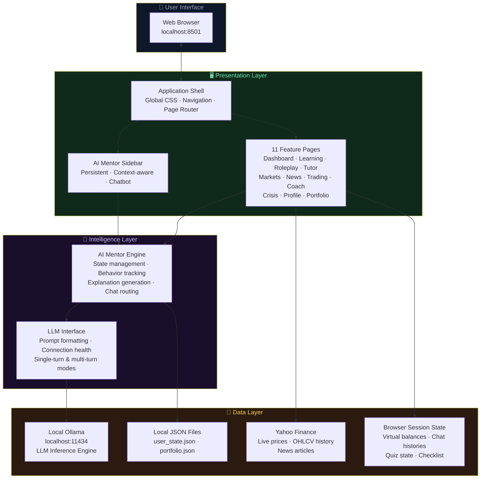

---

## 2. Component Architecture

A detailed breakdown of every component in the system, grouped by layer, and showing how they relate to one another.

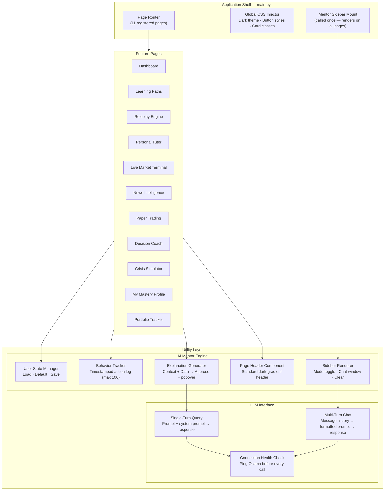

---

## 3. Module Dependency Map

Shows which shared resources and services each feature module depends on.

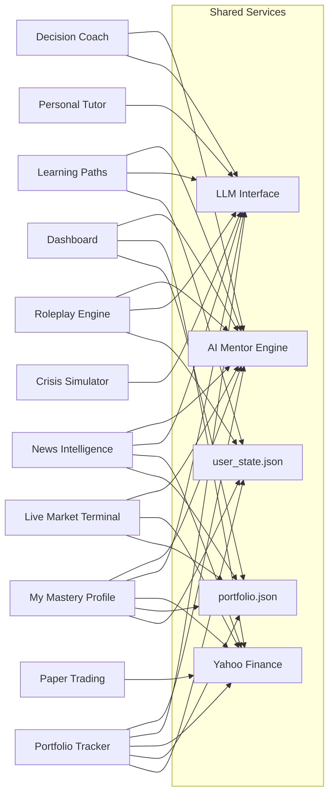

---

## 4. AI Inference Pipeline

Detailed view of how a prompt travels from a user action to an AI response and back to the UI.

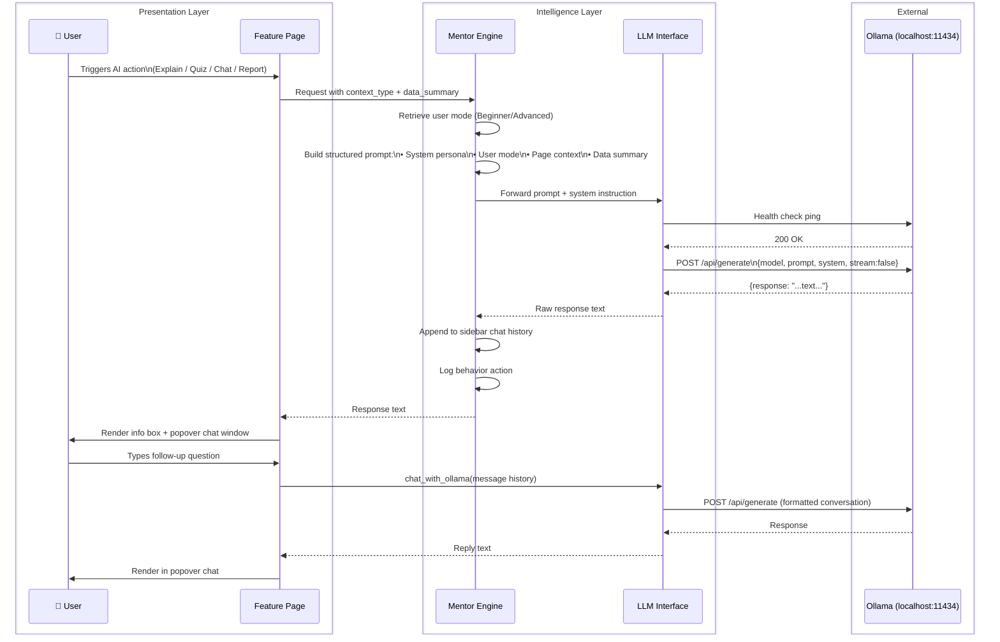

---

## 5. Data Flow — User Request Lifecycle

End-to-end flow from opening the app to a fully rendered, AI-enriched page.

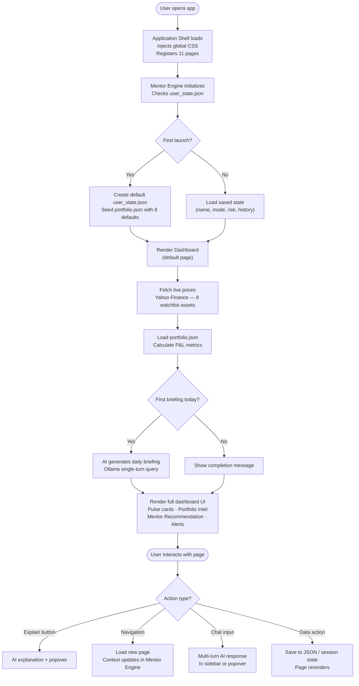

---

## 6. Data Storage Architecture

The system uses a two-tier storage model: persistent file-based storage (survives browser refresh) and session state (in-memory, resets on refresh).

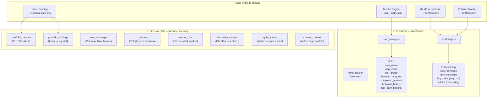

---

## 7. User Session State Model

How user identity and progress is initialized, updated, and persisted throughout the application lifecycle.

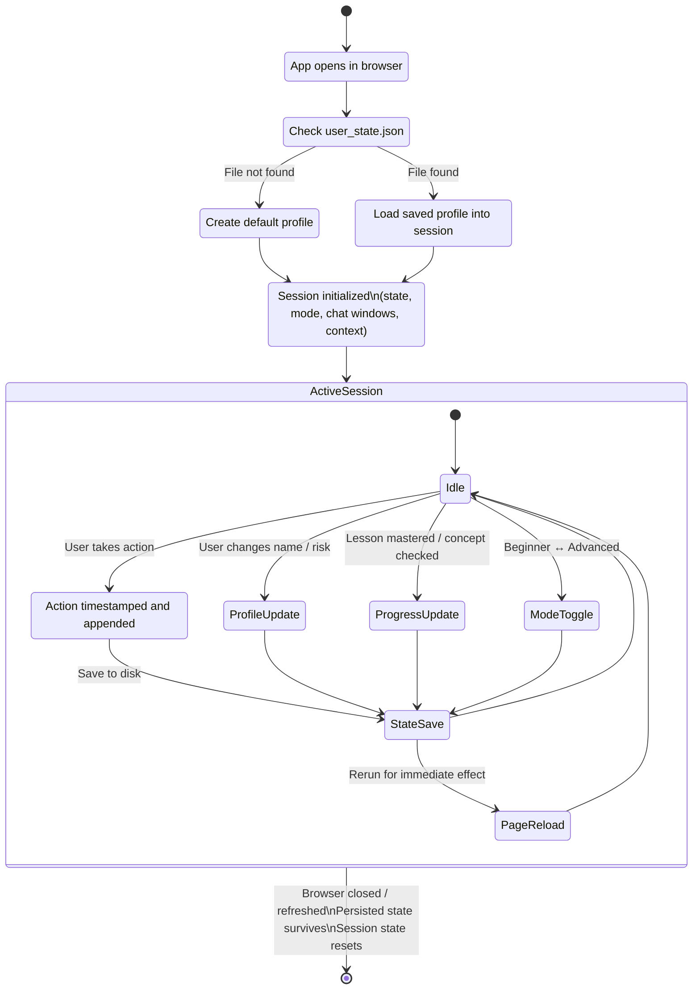

---

## 8. Market Data Pipeline

How real-time market data moves from Yahoo Finance into the application UI and AI context.

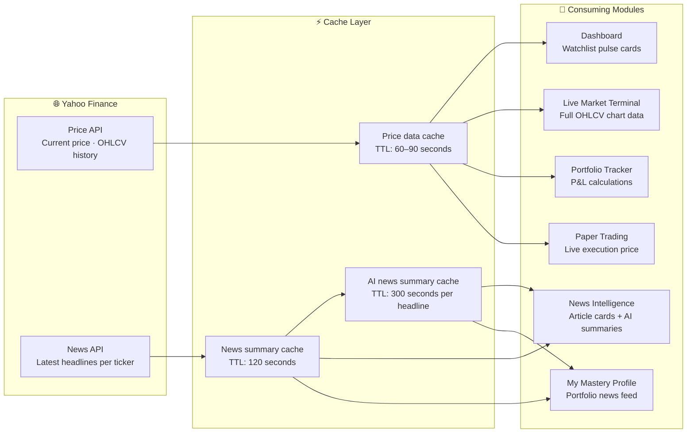

---

## 9. Portfolio Intelligence Flow

How a user's portfolio holdings connect to live data, risk analysis, AI insights, and cross-module features.

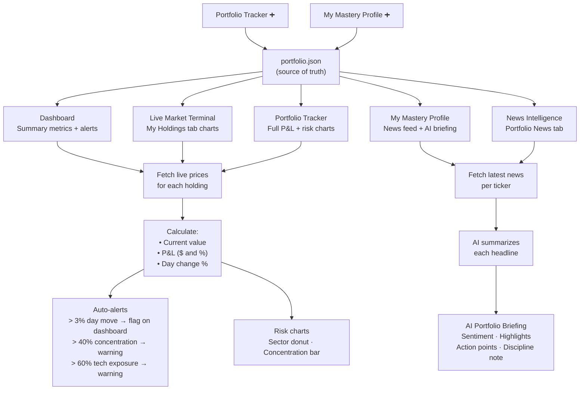

---

## 10. Adaptive Mode Architecture

How the single Beginner / Advanced mode toggle propagates changes across the entire application simultaneously.

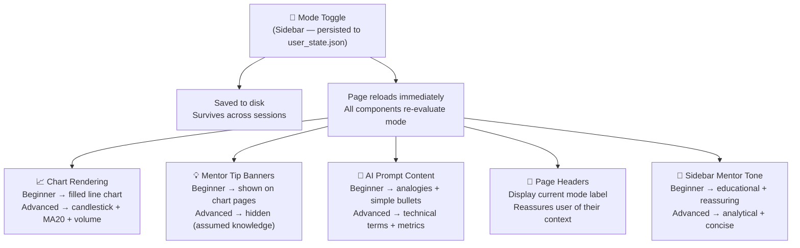

---

## 11. Cross-Module Navigation Graph

Shows how each module connects to other modules through navigation shortcuts and action buttons.

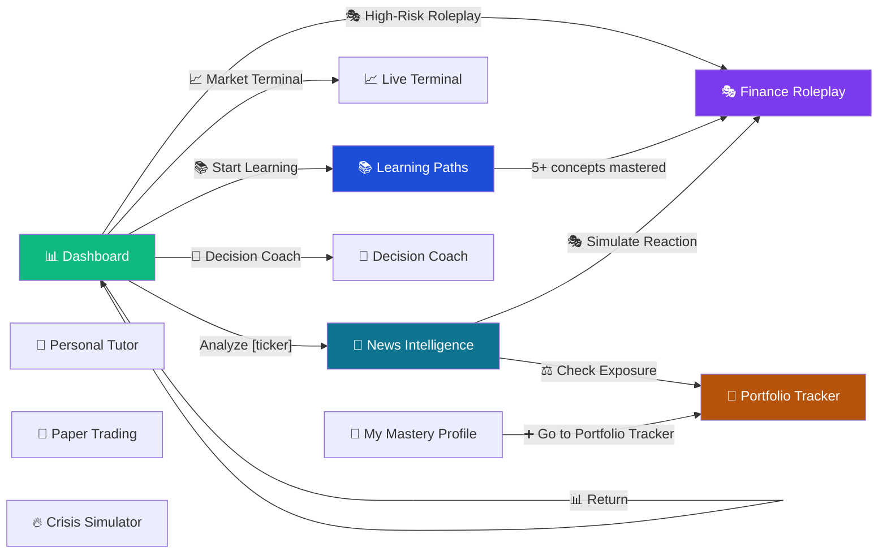

---

## 12. Deployment Architecture

How the application runs locally and what services must be active for full functionality.

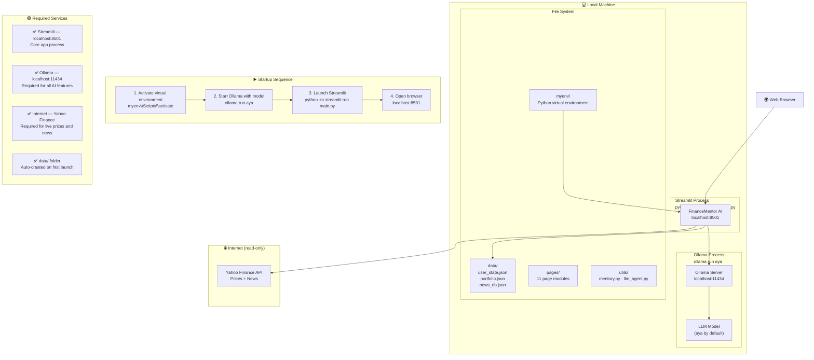

---

*FinanceMentor AI — Architecture Document — Version 1.0 — April 2026*
