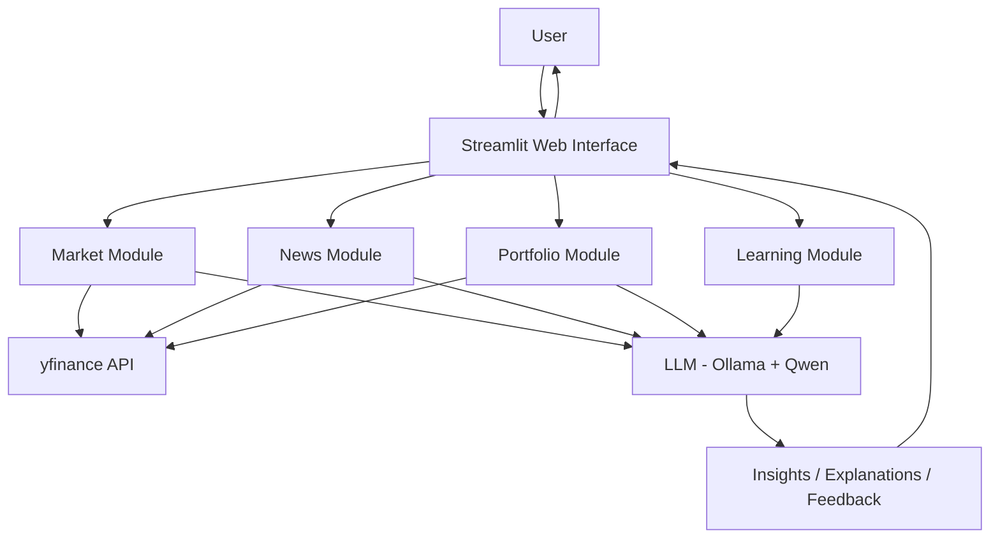
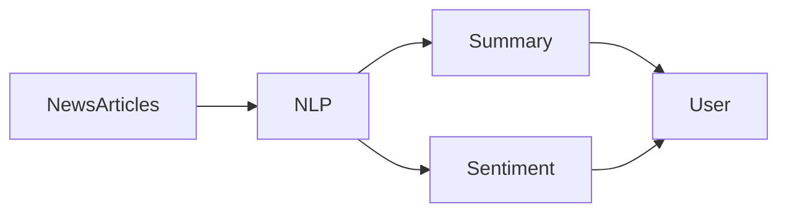
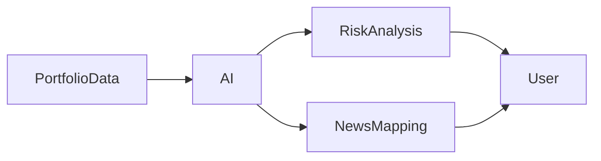
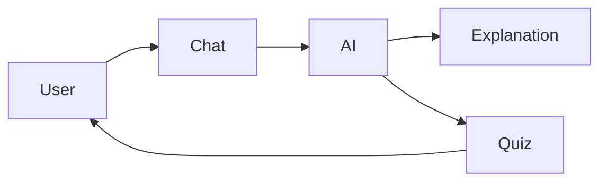
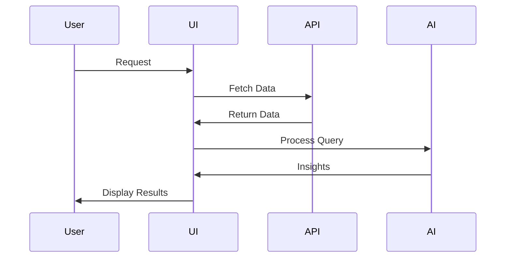

# FinMentor – AI-Powered Financial Learning Assistant

## 1. Motivation
Financial markets are increasingly accessible through mobile apps and online platforms. However, accessibility does not guarantee understanding.

- Beginners often lack financial literacy
- Investment decisions are influenced by hype and misinformation
- Lack of guidance leads to poor outcomes and financial loss

**Objective:**  
To create a system that makes financial learning:
- Simple
- Interactive
- Practical
- Decision-oriented

---

## 2. Problem Statement

Current financial ecosystems have major gaps:

- Users invest without understanding market dynamics
- Platforms focus on raw data instead of explanations
- Learning resources are separate from real-world trading tools

### Core Problem:
> Users have access to data, but lack understanding and guidance.

---

## 3. Proposed Solution: FinMentor

FinMentor is an AI-powered financial assistant designed to bridge this gap.

### Key Capabilities:
- Real-time data + AI explanations
- Integrated learning + decision support
- Scenario-based practice
- Personalized insights

---

## 4. System Architecture

---

## 5. Core Features

### 5.1 Market Analysis
- Real-time stock & crypto tracking
- AI explains trends
- Simplifies complex charts

---

### 5.2 News Analysis
- Summarizes financial news
- Detects sentiment
- Links news to market impact

---

### 5.3 Portfolio Analysis
- Tracks investments
- Identifies risks
- Links relevant news

---

### 5.4 Interactive Learning
- Chat-based learning
- Step-by-step explanations
- Quiz generation

---

### 5.5 Roleplay & Scenario-Based Learning
- Simulates real-world situations
- Trains decision-making

---

## 6. Implementation

- Streamlit (Frontend)
- yfinance API (Data)
- Plotly (Visualization)
- Ollama + Qwen (AI)

---

## 7. Conclusion

FinMentor integrates:
- Data
- Learning
- Decision-making

into a single intelligent platform.
