# 📈 FinanceMentor AI — Complete Documentation

> An AI-powered, Streamlit-based financial education and simulation platform backed by a local Ollama LLM and real-time Yahoo Finance market data.

---

## Table of Contents

1. [Project Overview](#1-project-overview)
2. [System Architecture](#2-system-architecture)
3. [Navigation Map](#3-navigation-map)
4. [Data Flow](#4-data-flow)
5. [AI Mentor Engine](#5-ai-mentor-engine)
6. [Feature Details](#6-feature-details)
   - [Dashboard](#61-dashboard)
   - [Learning Paths](#62-learning-paths)
   - [Finance Roleplay](#63-finance-roleplay)
   - [Personal Tutor](#64-personal-tutor)
   - [Live Market Terminal](#65-live-market-terminal)
   - [News Intelligence](#66-news-intelligence)
   - [Paper Trading](#67-paper-trading)
   - [Decision Coach](#68-decision-coach)
   - [Crisis Simulator](#69-crisis-simulator)
   - [My Mastery Profile](#610-my-mastery-profile)
   - [Portfolio Tracker](#611-portfolio-tracker)
7. [State & Persistence Model](#7-state--persistence-model)
8. [Tech Stack](#8-tech-stack)
9. [Running the App](#9-running-the-app)

---

## 1. Project Overview

FinanceMentor AI is a multi-page Streamlit application designed to help users learn, practice, and master financial decision-making. It combines:

- **Real-time market data** (Yahoo Finance via `yfinance`)
- **Local AI inference** (Ollama LLM — default model: `aya`)
- **Persistent user state** (JSON files in `data/`)
- **Adaptive UI** (Beginner / Advanced mode toggle)

The core philosophy is **learning by doing**: users don't just read about markets — they simulate trades, practice emotional discipline through roleplay, get quizzed on concepts, and have an AI mentor that explains everything in context.

---

## 2. System Architecture

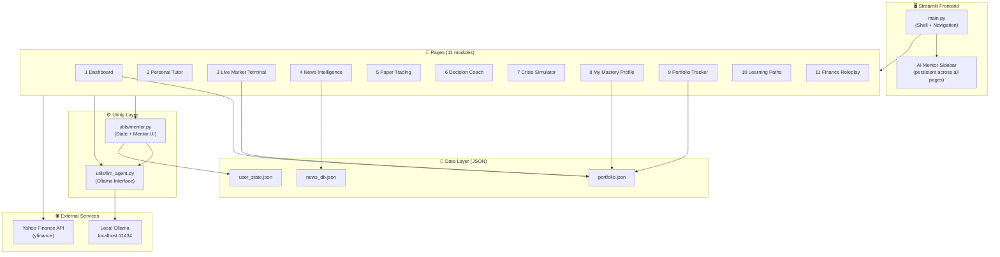
```mermaid
graph TB
    subgraph Frontend["🖥️ Streamlit Frontend"]
        MAIN["main.py\n(Shell + Navigation)"]
        SIDEBAR["AI Mentor Sidebar\n(persistent across all pages)"]
    end

    subgraph Pages["📄 Pages (11 modules)"]
        P1["1 Dashboard"]
        P2["2 Personal Tutor"]
        P3["3 Live Market Terminal"]
        P4["4 News Intelligence"]
        P5["5 Paper Trading"]
        P6["6 Decision Coach"]
        P7["7 Crisis Simulator"]
        P8["8 My Mastery Profile"]
        P9["9 Portfolio Tracker"]
        P10["10 Learning Paths"]
        P11["11 Finance Roleplay"]
    end

    subgraph Utils["⚙️ Utility Layer"]
        MENTOR["utils/mentor.py\n(State + Mentor UI)"]
        LLM["utils/llm_agent.py\n(Ollama Interface)"]
    end

    subgraph External["🌐 External Services"]
        OLLAMA["Local Ollama\nlocalhost:11434"]
        YFINANCE["Yahoo Finance API\n(yfinance)"]
    end

    subgraph Data["💾 Data Layer (JSON)"]
        US["user_state.json"]
        PF["portfolio.json"]
        ND["news_db.json"]
    end

    MAIN --> SIDEBAR
    MAIN --> Pages
    Pages --> MENTOR
    Pages --> LLM
    MENTOR --> LLM
    MENTOR --> US
    LLM --> OLLAMA
    Pages --> YFINANCE
    P9 --> PF
    P8 --> PF
    P3 --> PF
    P1 --> PF
    P4 --> ND
```

---

## 3. Navigation Map

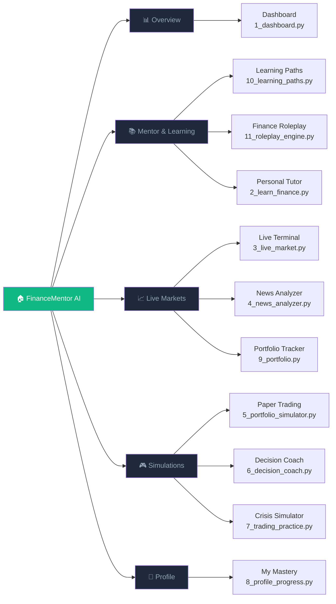
```mermaid
graph LR
    APP["🏠 FinanceMentor AI"]

    APP --> OV["📊 Overview"]
    APP --> ML["📚 Mentor & Learning"]
    APP --> LM["📈 Live Markets"]
    APP --> SIM["🎮 Simulations"]
    APP --> PROF["👤 Profile"]

    OV --> D["Dashboard\n1_dashboard.py"]

    ML --> LP["Learning Paths\n10_learning_paths.py"]
    ML --> RP["Finance Roleplay\n11_roleplay_engine.py"]
    ML --> TUT["Personal Tutor\n2_learn_finance.py"]

    LM --> MKT["Live Terminal\n3_live_market.py"]
    LM --> NEWS["News Analyzer\n4_news_analyzer.py"]
    LM --> PORT["Portfolio Tracker\n9_portfolio.py"]

    SIM --> PT["Paper Trading\n5_portfolio_simulator.py"]
    SIM --> DC["Decision Coach\n6_decision_coach.py"]
    SIM --> CS["Crisis Simulator\n7_trading_practice.py"]

    PROF --> MP["My Mastery\n8_profile_progress.py"]

    style APP fill:#10b981,color:#fff
    style OV fill:#1e293b,color:#94a3b8
    style ML fill:#1e293b,color:#94a3b8
    style LM fill:#1e293b,color:#94a3b8
    style SIM fill:#1e293b,color:#94a3b8
    style PROF fill:#1e293b,color:#94a3b8
```

---

## 4. Data Flow

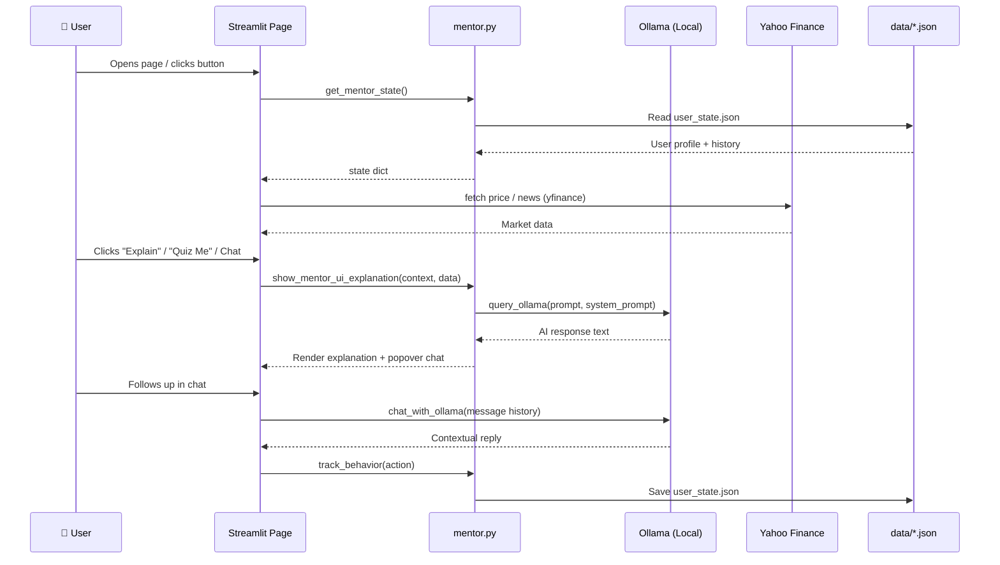
```mermaid
sequenceDiagram
    participant U as 👤 User
    participant ST as Streamlit Page
    participant M as mentor.py
    participant LLM as Ollama (Local)
    participant YF as Yahoo Finance
    participant FS as data/*.json

    U->>ST: Opens page / clicks button
    ST->>M: get_mentor_state()
    M->>FS: Read user_state.json
    FS-->>M: User profile + history
    M-->>ST: state dict

    ST->>YF: fetch price / news (yfinance)
    YF-->>ST: Market data

    U->>ST: Clicks "Explain" / "Quiz Me" / Chat
    ST->>M: show_mentor_ui_explanation(context, data)
    M->>LLM: query_ollama(prompt, system_prompt)
    LLM-->>M: AI response text
    M-->>ST: Render explanation + popover chat

    U->>ST: Follows up in chat
    ST->>LLM: chat_with_ollama(message history)
    LLM-->>ST: Contextual reply

    ST->>M: track_behavior(action)
    M->>FS: Save user_state.json
```

---

## 5. AI Mentor Engine

The mentor engine (`utils/mentor.py` + `utils/llm_agent.py`) is the backbone of the app's intelligence layer.

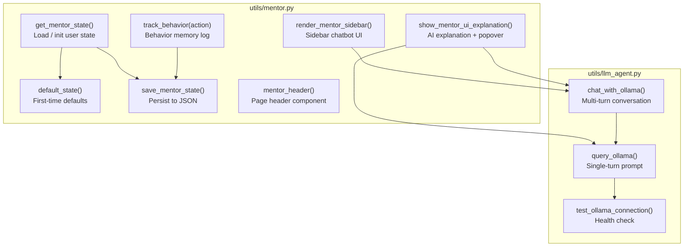
```mermaid
graph TD
    subgraph mentor_py["utils/mentor.py"]
        GMS["get_mentor_state()\nLoad / init user state"]
        DS["default_state()\nFirst-time defaults"]
        SMS["save_mentor_state()\nPersist to JSON"]
        TB["track_behavior(action)\nBehavior memory log"]
        RMS["render_mentor_sidebar()\nSidebar chatbot UI"]
        SMUE["show_mentor_ui_explanation()\nAI explanation + popover"]
        MH["mentor_header()\nPage header component"]
    end

    subgraph llm_py["utils/llm_agent.py"]
        TOC["test_ollama_connection()\nHealth check"]
        QO["query_ollama()\nSingle-turn prompt"]
        CWO["chat_with_ollama()\nMulti-turn conversation"]
    end

    GMS --> DS
    GMS --> SMS
    RMS --> CWO
    SMUE --> QO
    SMUE --> CWO
    TB --> SMS
    QO --> TOC
    CWO --> QO
```

### Mentor State Schema

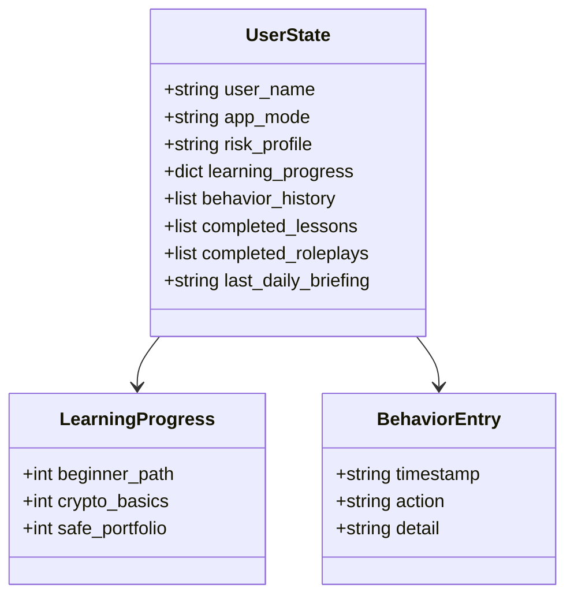
```mermaid
classDiagram
    class UserState {
        +string user_name
        +string app_mode
        +string risk_profile
        +dict learning_progress
        +list behavior_history
        +list completed_lessons
        +list completed_roleplays
        +string last_daily_briefing
    }

    class LearningProgress {
        +int beginner_path
        +int crypto_basics
        +int safe_portfolio
    }

    class BehaviorEntry {
        +string timestamp
        +string action
        +string detail
    }

    UserState --> LearningProgress
    UserState --> BehaviorEntry
```

---

## 6. Feature Details

### 6.1 Dashboard

**File:** `pages/1_dashboard.py`  
**Route:** Overview → Dashboard (default landing page)

The command center of the app. Shows the user everything they need at a glance.

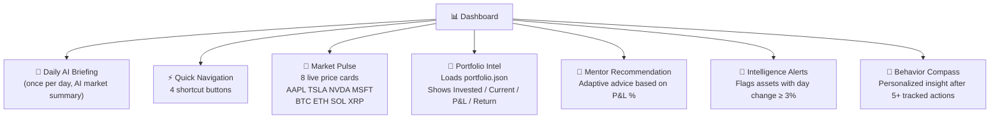
```mermaid
graph TD
    D["📊 Dashboard"]
    D --> B["🦉 Daily AI Briefing\n(once per day, AI market summary)"]
    D --> QN["⚡ Quick Navigation\n4 shortcut buttons"]
    D --> MP["📡 Market Pulse\n8 live price cards\nAAPL TSLA NVDA MSFT\nBTC ETH SOL XRP"]
    D --> PI["💼 Portfolio Intel\nLoads portfolio.json\nShows Invested / Current / P&L / Return"]
    D --> MR["🦉 Mentor Recommendation\nAdaptive advice based on P&L %"]
    D --> IA["🚨 Intelligence Alerts\nFlags assets with day change ≥ 3%"]
    D --> BC["🧭 Behavior Compass\nPersonalized insight after 5+ tracked actions"]
```

| UI Element | Trigger | Data Source |
|---|---|---|
| Daily Briefing | First visit per day | Ollama (generated) |
| Market Pulse | Page load | yfinance (TTL 90s) |
| Portfolio Cards | Page load | `data/portfolio.json` |
| 💡 Explain buttons | User click | Ollama + popover chat |
| Intelligence Alerts | day change ≥ 3% | yfinance |

---

### 6.2 Learning Paths

**File:** `pages/10_learning_paths.py`  
**Route:** Mentor & Learning → Learning Paths

Structured curriculum with AI-generated interactive quizzes.

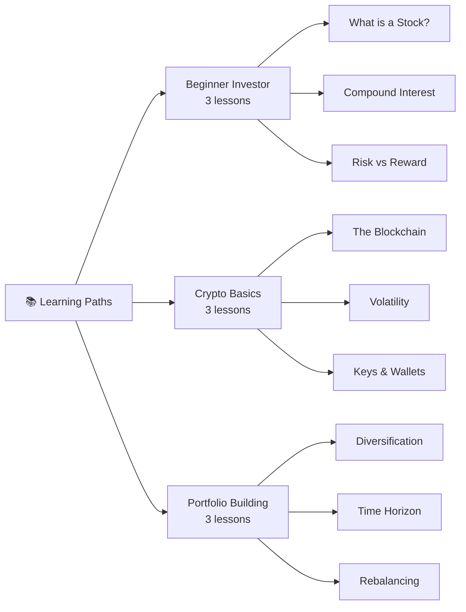
```mermaid
graph LR
    LP["📚 Learning Paths"]
    LP --> BI["Beginner Investor\n3 lessons"]
    LP --> CB["Crypto Basics\n3 lessons"]
    LP --> PB["Portfolio Building\n3 lessons"]

    BI --> L1["What is a Stock?"]
    BI --> L2["Compound Interest"]
    BI --> L3["Risk vs Reward"]

    CB --> L4["The Blockchain"]
    CB --> L5["Volatility"]
    CB --> L6["Keys & Wallets"]

    PB --> L7["Diversification"]
    PB --> L8["Time Horizon"]
    PB --> L9["Rebalancing"]
```

**Quiz Flow:**

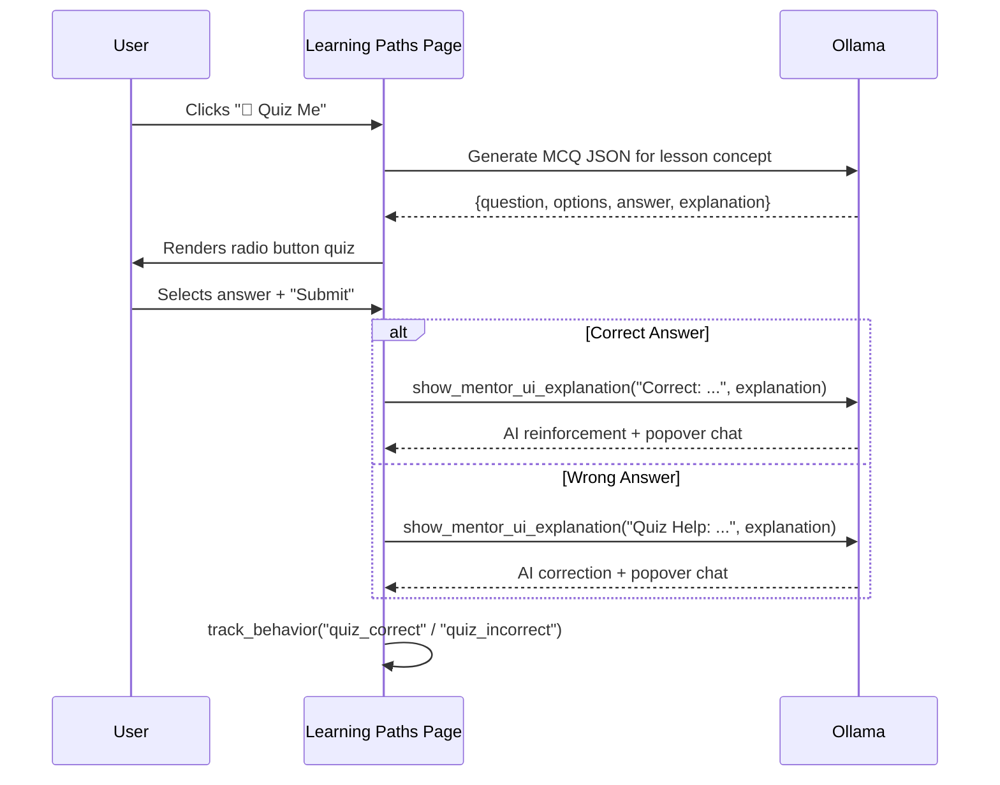
```mermaid
sequenceDiagram
    participant U as User
    participant P as Learning Paths Page
    participant O as Ollama

    U->>P: Clicks "🤔 Quiz Me"
    P->>O: Generate MCQ JSON for lesson concept
    O-->>P: {question, options, answer, explanation}
    P->>U: Renders radio button quiz

    U->>P: Selects answer + "Submit"
    alt Correct Answer
        P->>O: show_mentor_ui_explanation("Correct: ...", explanation)
        O-->>P: AI reinforcement + popover chat
    else Wrong Answer
        P->>O: show_mentor_ui_explanation("Quiz Help: ...", explanation)
        O-->>P: AI correction + popover chat
    end
    P->>P: track_behavior("quiz_correct" / "quiz_incorrect")
```

---

### 6.3 Finance Roleplay

**File:** `pages/11_roleplay_engine.py`  
**Route:** Mentor & Learning → Finance Roleplay

Immersive AI-driven scenario roleplay to build emotional discipline.

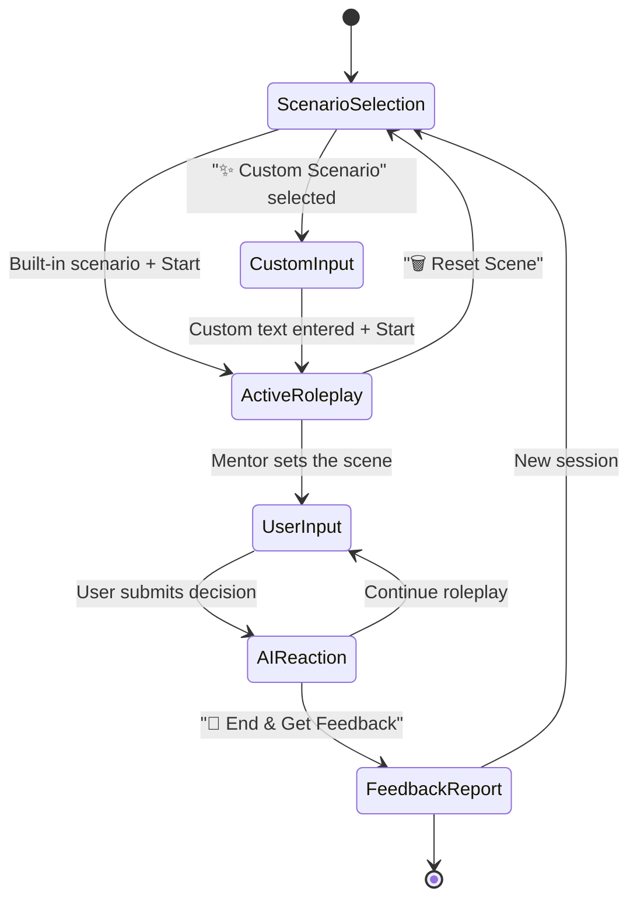
```mermaid
stateDiagram-v2
    [*] --> ScenarioSelection
    ScenarioSelection --> CustomInput: "✨ Custom Scenario" selected
    ScenarioSelection --> ActiveRoleplay: Built-in scenario + Start
    CustomInput --> ActiveRoleplay: Custom text entered + Start

    ActiveRoleplay --> UserInput: Mentor sets the scene
    UserInput --> AIReaction: User submits decision
    AIReaction --> UserInput: Continue roleplay
    AIReaction --> FeedbackReport: "🛑 End & Get Feedback"
    ActiveRoleplay --> ScenarioSelection: "🗑️ Reset Scene"

    FeedbackReport --> ScenarioSelection: New session
    FeedbackReport --> [*]
```

**Built-in Scenarios:**

| Scenario | Core Skill Tested |
|---|---|
| The 20% Dip | Panic selling resistance |
| Crypto Moonshot | FOMO management |
| First Bull Market | Overconfidence / leverage discipline |
| Inflation Spike | Speculative hedge temptation |
| Inheritance Windfall | Strategic planning vs YOLO |
| Job Loss Crisis | Emergency fund preparedness |
| Retirement Trap | Bear market patience |
| ✨ Custom | User-defined dilemma |

---

### 6.4 Personal Tutor

**File:** `pages/2_learn_finance.py`  
**Route:** Mentor & Learning → Personal Tutor

Free-form multi-turn AI chat for any finance question.

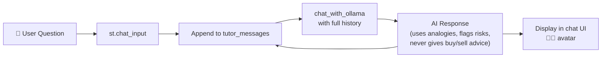
```mermaid
graph LR
    U["👤 User Question"] --> CHAT["st.chat_input"]
    CHAT --> MSG["Append to tutor_messages"]
    MSG --> LLM["chat_with_ollama\nwith full history"]
    LLM --> RESP["AI Response\n(uses analogies, flags risks,\nnever gives buy/sell advice)"]
    RESP --> MSG
    RESP --> UI["Display in chat UI\n👩‍🏫 avatar"]
```

**System Persona Rules:**
- Explains using simple, everyday analogies
- Always flags risk for speculative assets
- Never gives specific buy/sell advice
- Maintains conversational context across the full session

---

### 6.5 Live Market Terminal

**File:** `pages/3_live_market.py`  
**Route:** Live Markets → Live Terminals

Real-time interactive price charts — **3 tabs**.

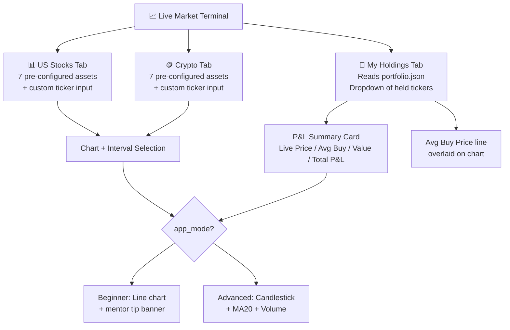
```mermaid
graph TD
    LMT["📈 Live Market Terminal"]
    LMT --> T1["📊 US Stocks Tab\n7 pre-configured assets\n+ custom ticker input"]
    LMT --> T2["🪙 Crypto Tab\n7 pre-configured assets\n+ custom ticker input"]
    LMT --> T3["💼 My Holdings Tab\nReads portfolio.json\nDropdown of held tickers"]

    T1 --> CI["Chart + Interval Selection"]
    T2 --> CI
    T3 --> PL["P&L Summary Card\nLive Price / Avg Buy / Value / Total P&L"]
    T3 --> HL["Avg Buy Price line\noverlaid on chart"]

    CI --> BA{"app_mode?"}
    BA --> BG["Beginner: Line chart\n+ mentor tip banner"]
    BA --> ADV["Advanced: Candlestick\n+ MA20 + Volume"]

    PL --> BA
```

**Interval Options:**

| Label | yfinance Interval | Period |
|---|---|---|
| 1 Minute | 1m | 1d |
| 5 Minutes | 5m | 1d |
| 15 Minutes | 15m | 1d |
| 30 Minutes | 30m | 1d |
| 1 Hour | 1h | 1d |
| 4 Hours | 1h | 1wk |
| 1 Day | 1d | 1mo |
| 1 Week | 1wk | 1y |

---

### 6.6 News Intelligence

**File:** `pages/4_news_analyzer.py`  
**Route:** Live Markets → News Analyzer

AI-summarized financial news with direct portfolio action buttons.

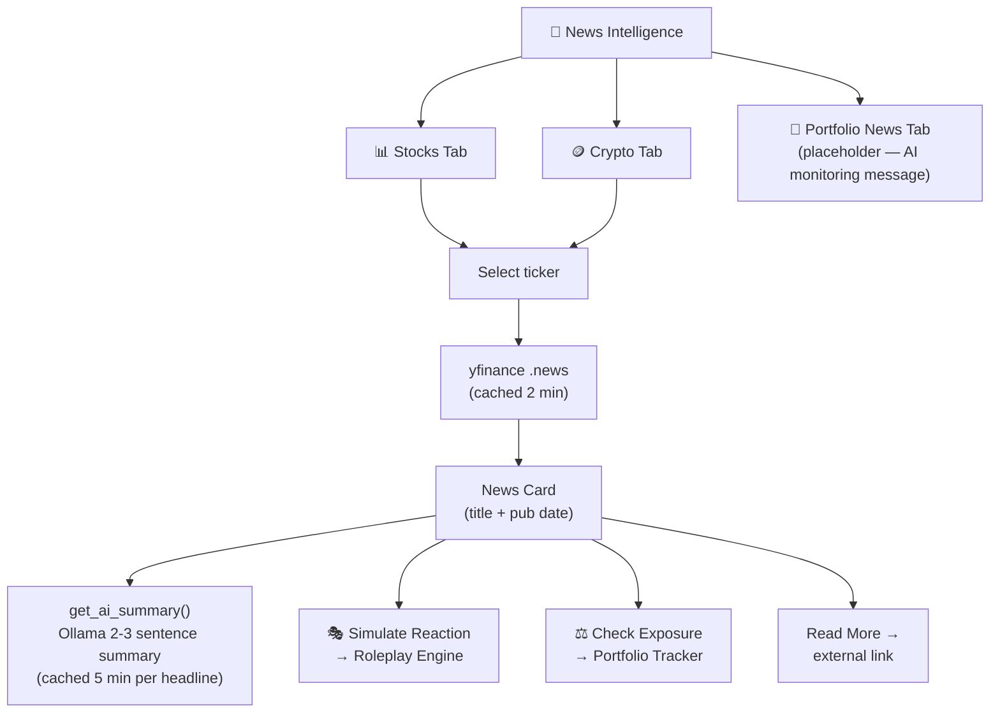
```mermaid
graph TD
    NA["📰 News Intelligence"]
    NA --> T1["📊 Stocks Tab"]
    NA --> T2["🪙 Crypto Tab"]
    NA --> T3["💼 Portfolio News Tab\n(placeholder — AI monitoring message)"]

    T1 --> SEL["Select ticker"]
    T2 --> SEL
    SEL --> FETCH["yfinance .news\n(cached 2 min)"]
    FETCH --> CARD["News Card\n(title + pub date)"]
    CARD --> AI_SUM["get_ai_summary()\nOllama 2-3 sentence summary\n(cached 5 min per headline)"]
    CARD --> BTN1["🎭 Simulate Reaction\n→ Roleplay Engine"]
    CARD --> BTN2["⚖️ Check Exposure\n→ Portfolio Tracker"]
    CARD --> BTN3["Read More →\nexternal link"]
```

---

### 6.7 Paper Trading

**File:** `pages/5_portfolio_simulator.py`  
**Route:** Simulations → Paper Trading

Risk-free virtual trading with real live prices.

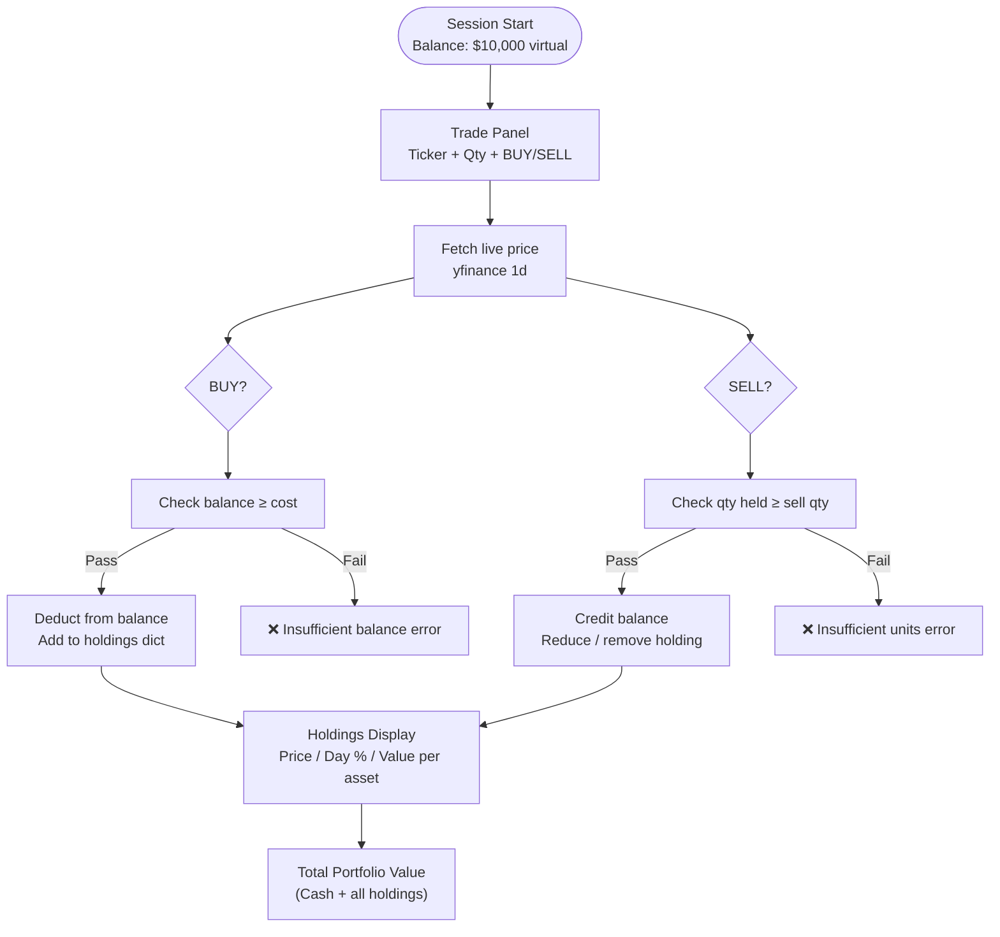
```mermaid
flowchart TD
    START(["Session Start\nBalance: $10,000 virtual"])
    START --> TRADE["Trade Panel\nTicker + Qty + BUY/SELL"]

    TRADE --> PRICE["Fetch live price\nyfinance 1d"]

    PRICE --> BUY{"BUY?"}
    BUY --> CHK["Check balance ≥ cost"]
    CHK -->|Pass| DEDUCT["Deduct from balance\nAdd to holdings dict"]
    CHK -->|Fail| ERR["❌ Insufficient balance error"]

    PRICE --> SELL{"SELL?"}
    SELL --> CHKQ["Check qty held ≥ sell qty"]
    CHKQ -->|Pass| CREDIT["Credit balance\nReduce / remove holding"]
    CHKQ -->|Fail| ERR2["❌ Insufficient units error"]

    DEDUCT --> HOLD["Holdings Display\nPrice / Day % / Value per asset"]
    CREDIT --> HOLD
    HOLD --> TOTAL["Total Portfolio Value\n(Cash + all holdings)"]
```

> **Note:** Balance and holdings reset on browser refresh (session-only, not persisted).

---

### 6.8 Decision Coach

**File:** `pages/6_decision_coach.py`  
**Route:** Simulations → Decision Coach

A 5-step guided wizard that structures investment thinking.

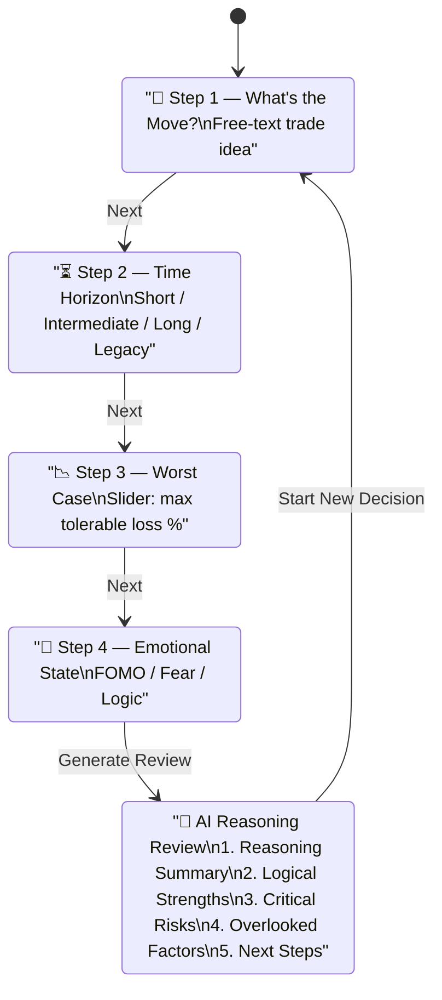
```mermaid
stateDiagram-v2
    [*] --> Step1_Goal
    Step1_Goal: "🎯 Step 1 — What's the Move?\nFree-text trade idea"
    Step1_Goal --> Step2_Horizon: Next

    Step2_Horizon: "⏳ Step 2 — Time Horizon\nShort / Intermediate / Long / Legacy"
    Step2_Horizon --> Step3_Risk: Next

    Step3_Risk: "📉 Step 3 — Worst Case\nSlider: max tolerable loss %"
    Step3_Risk --> Step4_Emotion: Next

    Step4_Emotion: "🧘 Step 4 — Emotional State\nFOMO / Fear / Logic"
    Step4_Emotion --> Step5_Review: Generate Review

    Step5_Review: "🧠 AI Reasoning Review\n1. Reasoning Summary\n2. Logical Strengths\n3. Critical Risks\n4. Overlooked Factors\n5. Next Steps"
    Step5_Review --> Step1_Goal: Start New Decision
```

---

### 6.9 Crisis Simulator

**File:** `pages/7_trading_practice.py`  
**Route:** Simulations → Crisis Simulator

MCQ-based decision-making test under high-pressure market events.

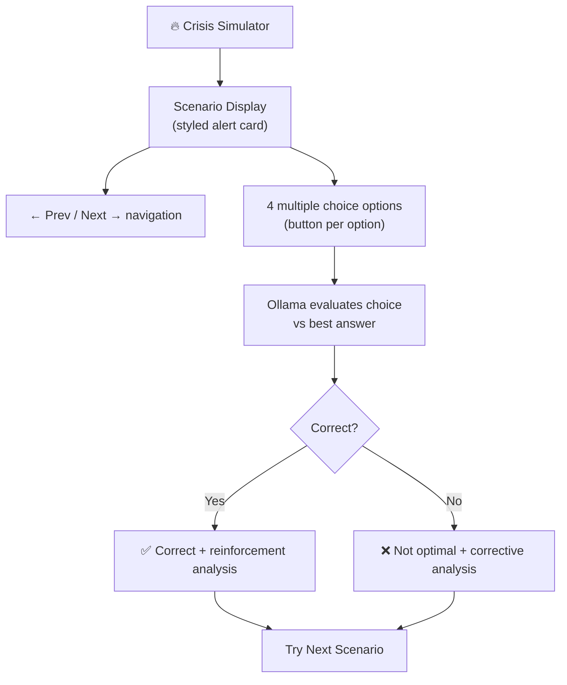
```mermaid
graph TD
    CS["🔥 Crisis Simulator"]
    CS --> SN["Scenario Display\n(styled alert card)"]
    SN --> NAV["← Prev / Next → navigation"]
    SN --> OPT["4 multiple choice options\n(button per option)"]
    OPT --> EVAL["Ollama evaluates choice\nvs best answer"]
    EVAL --> RES{"Correct?"}
    RES -->|Yes| SUCC["✅ Correct + reinforcement analysis"]
    RES -->|No| FAIL["❌ Not optimal + corrective analysis"]
    SUCC --> NEXT["Try Next Scenario"]
    FAIL --> NEXT
```

**Scenarios:**

| # | Event | Financial Principle |
|---|---|---|
| 1 | Flash Crash −22% | Loss aversion / panic selling |
| 2 | Crypto Mania +800% | FOMO / speculation risk |
| 3 | Fed Rate +0.75% | Asset allocation stability |
| 4 | Earnings Miss −18% | Patience / fundamental analysis |

---

### 6.10 My Mastery Profile

**File:** `pages/8_profile_progress.py`  
**Route:** Profile → My Mastery

User profile, portfolio management, news feed, and AI news summary.

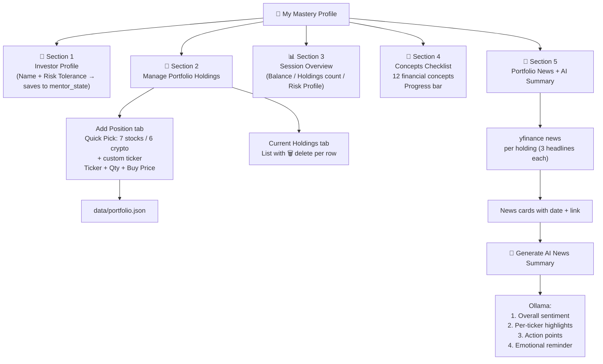
```mermaid
graph TD
    MP["👤 My Mastery Profile"]

    MP --> S1["🎯 Section 1\nInvestor Profile\n(Name + Risk Tolerance → saves to mentor_state)"]

    MP --> S2["📂 Section 2\nManage Portfolio Holdings"]
    S2 --> ADD["Add Position tab\nQuick Pick: 7 stocks / 6 crypto\n+ custom ticker\nTicker + Qty + Buy Price"]
    S2 --> VIEW["Current Holdings tab\nList with 🗑️ delete per row"]
    ADD --> PF["data/portfolio.json"]

    MP --> S3["📊 Section 3\nSession Overview\n(Balance / Holdings count / Risk Profile)"]

    MP --> S4["📘 Section 4\nConcepts Checklist\n12 financial concepts\nProgress bar"]

    MP --> S5["📰 Section 5\nPortfolio News + AI Summary"]
    S5 --> NFETCH["yfinance news\nper holding (3 headlines each)"]
    NFETCH --> NCARDS["News cards with date + link"]
    NCARDS --> AIBTN["🤖 Generate AI News Summary"]
    AIBTN --> OLLAMA["Ollama:\n1. Overall sentiment\n2. Per-ticker highlights\n3. Action points\n4. Emotional reminder"]
```

**Default Portfolio (seeded on first launch):**

| Asset | Ticker | Qty | Avg Buy |
|---|---|---|---|
| Apple | AAPL | 10 | $178.50 |
| NVIDIA | NVDA | 5 | $495.00 |
| Microsoft | MSFT | 8 | $390.00 |
| Tesla | TSLA | 7 | $210.00 |
| Amazon | AMZN | 6 | $175.00 |
| Bitcoin | BTC-USD | 0.05 | $52,000 |
| Ethereum | ETH-USD | 0.8 | $2,800 |
| Solana | SOL-USD | 5 | $95.00 |

---

### 6.11 Portfolio Tracker

**File:** `pages/9_portfolio.py`  
**Route:** Live Markets → Portfolio Tracker

Real portfolio management with AI-powered risk analysis.

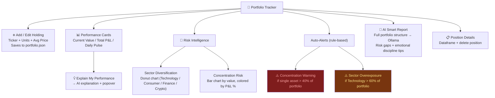
```mermaid
graph TD
    PT["💼 Portfolio Tracker"]

    PT --> FORM["➕ Add / Edit Holding\nTicker + Units + Avg Price\nSaves to portfolio.json"]

    PT --> PERF["📊 Performance Cards\nCurrent Value / Total P&L / Daily Pulse"]
    PERF --> EXPL["💡 Explain My Performance\n→ AI explanation + popover"]

    PT --> RISK["🧠 Risk Intelligence"]
    RISK --> PIE["Sector Diversification\nDonut chart (Technology / Consumer / Finance / Crypto)"]
    RISK --> BAR["Concentration Risk\nBar chart by value, colored by P&L %"]

    PT --> ALERTS["Auto-Alerts (rule-based)"]
    ALERTS --> C1["⚠️ Concentration Warning\nif single asset > 40% of portfolio"]
    ALERTS --> C2["⚠️ Sector Overexposure\nif Technology > 60% of portfolio"]

    PT --> REPORT["📡 AI Smart Report\nFull portfolio structure → Ollama\nRisk gaps + emotional discipline tips"]

    PT --> TABLE["📋 Position Details\nDataframe + delete position"]

    style C1 fill:#7f1d1d,color:#fca5a5
    style C2 fill:#78350f,color:#fde68a
```

---

## 7. State & Persistence Model

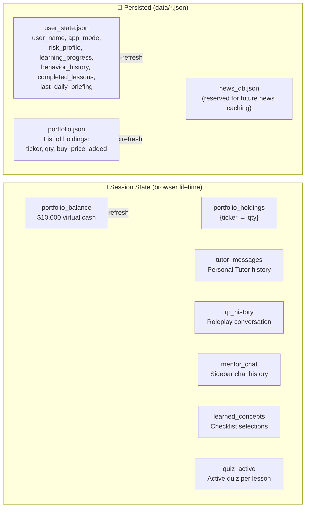
```mermaid
graph LR
    subgraph Session["🔁 Session State (browser lifetime)"]
        BAL["portfolio_balance\n$10,000 virtual cash"]
        HOLD["portfolio_holdings\n{ticker → qty}"]
        CHAT["tutor_messages\nPersonal Tutor history"]
        RP["rp_history\nRoleplay conversation"]
        MC["mentor_chat\nSidebar chat history"]
        LC["learned_concepts\nChecklist selections"]
        QA["quiz_active\nActive quiz per lesson"]
    end

    subgraph Persisted["💾 Persisted (data/*.json)"]
        US["user_state.json\nuser_name, app_mode,\nrisk_profile, learning_progress,\nbehavior_history, completed_lessons,\nlast_daily_briefing"]
        PF["portfolio.json\nList of holdings:\nticker, qty, buy_price, added"]
        ND["news_db.json\n(reserved for future news caching)"]
    end

    BAL -->|lost on refresh| Session
    US -->|survives refresh| Persisted
    PF -->|survives refresh| Persisted
```

---

## 8. Tech Stack

| Layer | Technology | Purpose |
|---|---|---|
| **Web Framework** | Streamlit | Multi-page app, UI components, session state |
| **Market Data** | yfinance | Real-time prices, historical OHLCV, news |
| **Charting** | Plotly | Interactive line, candlestick, pie, bar charts |
| **Data Processing** | pandas | DataFrame manipulation for price history |
| **AI Inference** | Ollama (local) | LLM inference — default model: `aya` |
| **HTTP Client** | requests | REST calls to Ollama API |
| **Persistence** | JSON files | User state and portfolio storage |
| **Environment** | Python venv (`myenv`) | Dependency isolation |

### Ollama Integration

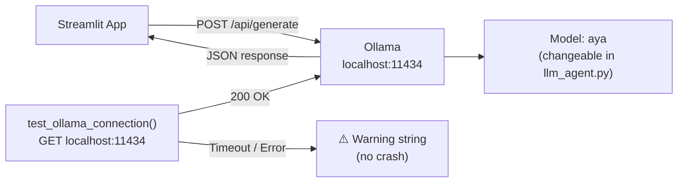
```mermaid
graph LR
    APP["Streamlit App"] -->|POST /api/generate| OL["Ollama\nlocalhost:11434"]
    OL -->|JSON response| APP
    OL --> MOD["Model: aya\n(changeable in llm_agent.py)"]
    CHK["test_ollama_connection()\nGET localhost:11434"] -->|200 OK| OL
    CHK -->|Timeout / Error| WARN["⚠️ Warning string\n(no crash)"]
```

---

## 9. Running the App

```bash
# 1. Navigate to project directory
cd "e:\Presentation\Phd_course_work\AI Agent\K_Study_buddy"

# 2. Activate virtual environment
myenv\Scripts\activate

# 3. Ensure Ollama is running with the configured model
ollama run aya

# 4. Launch the app
python -m streamlit run main.py
```

The app will be available at **http://localhost:8501**

### First-Launch Behaviour

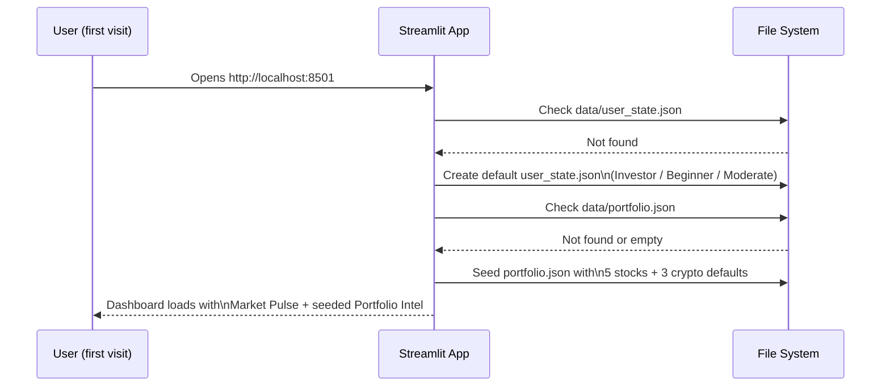
```mermaid
sequenceDiagram
    participant U as User (first visit)
    participant APP as Streamlit App
    participant FS as File System

    U->>APP: Opens http://localhost:8501
    APP->>FS: Check data/user_state.json
    FS-->>APP: Not found
    APP->>FS: Create default user_state.json\n(Investor / Beginner / Moderate)

    APP->>FS: Check data/portfolio.json
    FS-->>APP: Not found or empty
    APP->>FS: Seed portfolio.json with\n5 stocks + 3 crypto defaults

    APP-->>U: Dashboard loads with\nMarket Pulse + seeded Portfolio Intel
```

### Switching AI Models

To change the Ollama model, edit line 7 in `utils/llm_agent.py`:

```python
# Change "aya" to any model you have pulled in Ollama
OLLAMA_MODEL = "aya"      # current default
# OLLAMA_MODEL = "llama3"
# OLLAMA_MODEL = "mistral"
# OLLAMA_MODEL = "phi3"
```

Then restart the Streamlit app.

---

*Documentation generated for FinanceMentor AI — April 2026*
