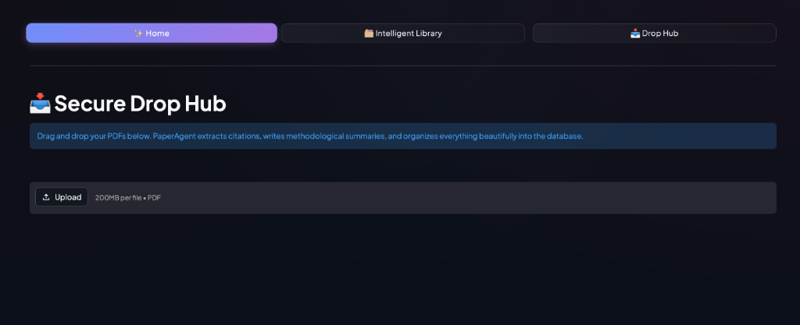
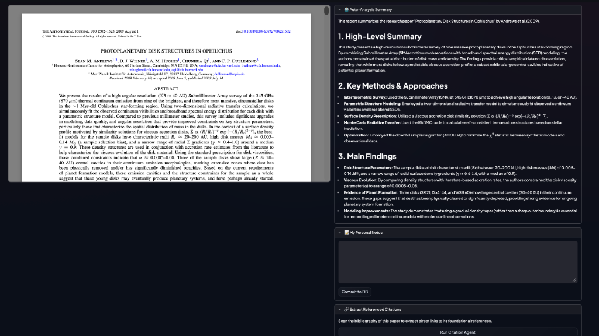
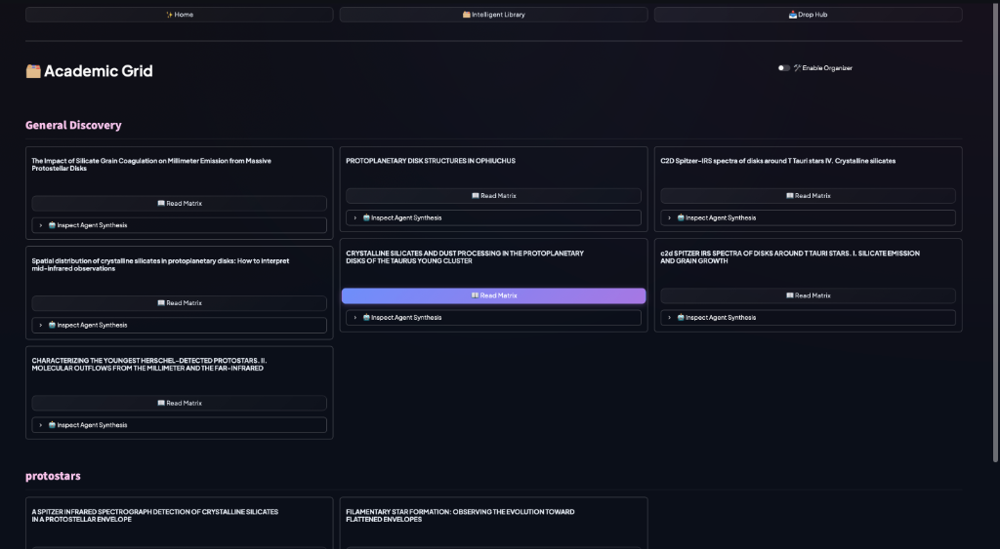
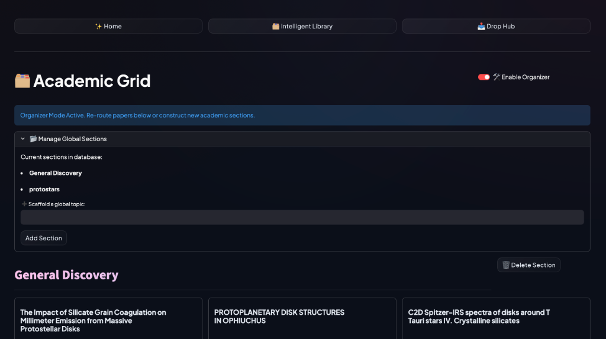
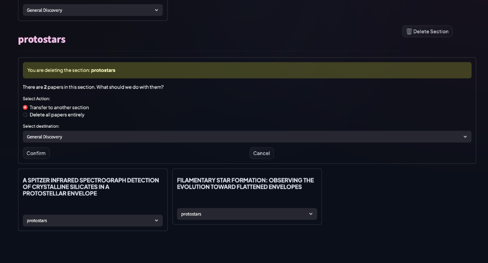

⭐ **[2026-1 Mid-term Project - INDEX](../2026-1_Mid-term_Project.md)**

# App Name: PaperAgent – A Local Agentic Research Assistant

## 1. Problem Statement
What problem does this solve? Why does it matter?
Researchers struggle to manage and recall information from a large number of scientific papers stored as disconnected PDFs, leading to inefficient literature review and fragmented understanding.

Who currently suffers from this problem, and how?
Graduate students and researchers suffer from this by losing track of important insights, taking scattered notes, and lacking tools for interactive understanding of complex papers.

## 2. Target Users
Who will use this? What is their skill level?
Graduate students and academic researchers with intermediate to advanced experience in reading research papers.

What is their context (research field, tools they already use)?
Fields like astrophysics, physics, and data science; currently using PDF readers, Zotero/Mendeley, local storage, and Python-based workflows.

## 3. Core Features
| Feature | Description | Priority |
|---------|-------------|----------|
| Paper Library (Local) | Store and organize research papers locally with extracted metadata | Must-have |
| AI Auto-Summary | Automatically generate summaries, key concepts, and methods when a paper is added | Must-have |
| Dual Notes System | Separate sections for AI-generated notes and user-written notes | Must-have |
| Agentic Chat Assistant | Context-aware AI assistant for interacting with the paper content | Must-have |
| Related Paper Recommendation | Suggest similar papers based on topic, authors, and semantic similarity | Must-have |
| Organizer Mode & Paper Routing | Safely scaffold sections globally, transfer papers natively across topics, and manage bulk section deletion without losing text fragments | Must-have |
| Interactive Logic Binding | Highlight specific paragraphs inside papers to selectively query against via local terminal RAG | Must-have |
| Agentic Citation Extractor | Automatically parse nested bibliographies and scrape out direct links to academic references using generative NLP | Must-have |
| LLM Traffic Resiliency | Tenacity-backed dynamic retry logic and exponential backoff to handle native 503 traffic spikes from providers | Must-have |
| Smart Sorting | Sort papers by title, author, or AI-based topic clustering | Nice-to-have |

---

### 3.1 Drop Hub – Secure PDF Upload

The **Drop Hub** tab provides a clean, drag-and-drop interface for uploading research PDFs. Once a file is submitted, PaperAgent automatically extracts citations, writes a methodological summary, and organizes the paper into the database. Each file upload is limited to 200 MB and must be in PDF format.

> *Drop Hub UI: Users drag-and-drop PDFs. PaperAgent extracts citations, writes methodological summaries, and organizes everything into the database automatically.*

---

### 3.2 Paper Detail View – AI Analysis, Notes & Citation Extraction

When a paper is opened from the library, the detail view presents a **split-panel layout**: the raw PDF is rendered on the left, while the right panel surfaces three key AI-powered features:

- **Auto-Analysis Summary** – A structured report with High-Level Summary, Key Methods & Approaches, and Main Findings generated by the LLM.
- **My Personal Notes** – A free-text area where users can write and commit their own annotations to the database.
- **Extract Referenced Citations** – A one-click "Run Citation Agent" button that scans the bibliography and scrapes direct links to foundational references.

> *Paper Detail view: Left panel renders the PDF; Right panel shows the AI-generated structured summary, a personal notes editor, and the agentic citation extractor.*

---

### 3.3 Academic Grid – Library View

The **Intelligent Library** tab displays all papers in an **Academic Grid** organized by user-defined sections (e.g., *General Discovery*, *protostars*). Each paper card exposes two actions:

- **Read Matrix** – Opens the paper detail view.
- **Inspect Agent Synthesis** – Expands an inline AI synthesis panel for quick review without leaving the grid.

> *Academic Grid (Organizer Mode OFF): Papers are grouped by section. Each card has "Read Matrix" and "Inspect Agent Synthesis" actions.*

---

### 3.4 Organizer Mode – Section Management & Paper Routing

Toggling **Enable Organizer** activates Organizer Mode, which overlays a **Manage Global Sections** panel at the top of the Academic Grid. From here users can:

- View all existing sections in the database.
- Scaffold new global topic sections via a text input + **Add Section** button.
- Delete sections with safe paper-routing (see §3.5 below).

> *Academic Grid (Organizer Mode ON): The "Manage Global Sections" panel lists current sections, allows adding new ones, and each section header gains a "Delete Section" control.*

---

### 3.5 Safe Section Deletion & Paper Routing

When a user deletes a section that still contains papers, PaperAgent surfaces a **confirmation dialog** before any destructive action occurs. The dialog shows:

- The name of the section being deleted and how many papers it contains.
- A choice to **Transfer to another section** (with a destination dropdown) or **Delete all papers entirely**.
- **Confirm** and **Cancel** buttons to finalize or abort.

This prevents accidental data loss and ensures papers are never silently dropped.

> *Delete Section dialog: Triggered when deleting a non-empty section. Users choose to transfer papers to another section or permanently delete them, then confirm.*

---

## 4. Human-AI Interaction Flow
[Diagram or step-by-step description]
Step 1: User uploads a paper via **Drop Hub** → Step 2: AI extracts metadata and generates summary → Step 3: User reviews AI summary and adds personal notes in the **Paper Detail view** → Step 4: User reads paper with AI assistant → Step 5: User interacts with AI for explanations via Terminal RAG or interactive highlighting → Step 6: AI suggests related papers / extracts foundational citations via **Run Citation Agent** → Step 7: User manually organizes and transfers papers dynamically via **Organizer Mode** in the **Academic Grid**

## 5. Technical Approach
LLM: Ollama (local LLM) / Gemini (via google-genai) / OpenAI (optional)
Framework: Streamlit
Key libraries: PyMuPDF, LangChain or LlamaIndex, ChromaDB, SentenceTransformers, Tenacity (for exponential API backoff)
Data: Local PDF files, extracted text and metadata, generated summaries, embeddings, and user notes

## 6. Success Criteria
How do you know the app works? What does "good" look like?
The app works well if users can quickly understand papers, retrieve key insights, interact effectively with the AI assistant, seamlessly route files via Organizer Mode, handle API spikes gracefully, and receive relevant recommendations that improve their research workflow.