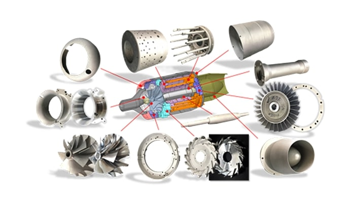
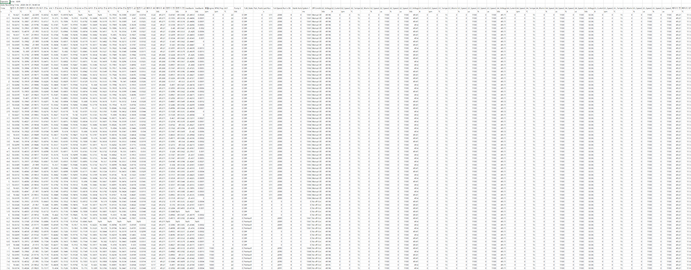
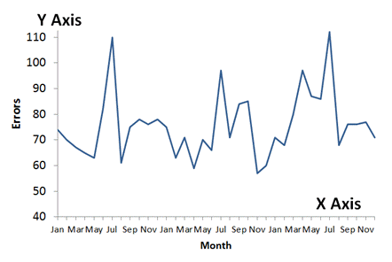
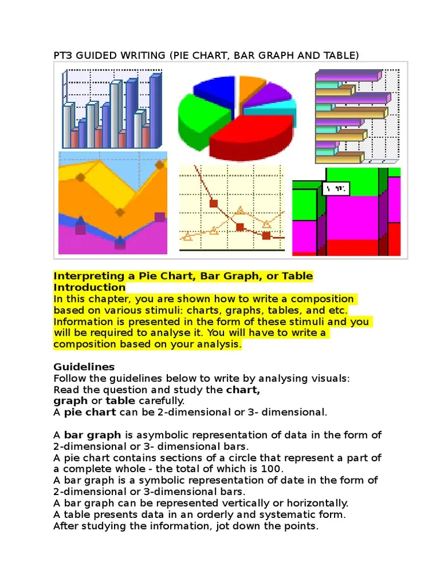
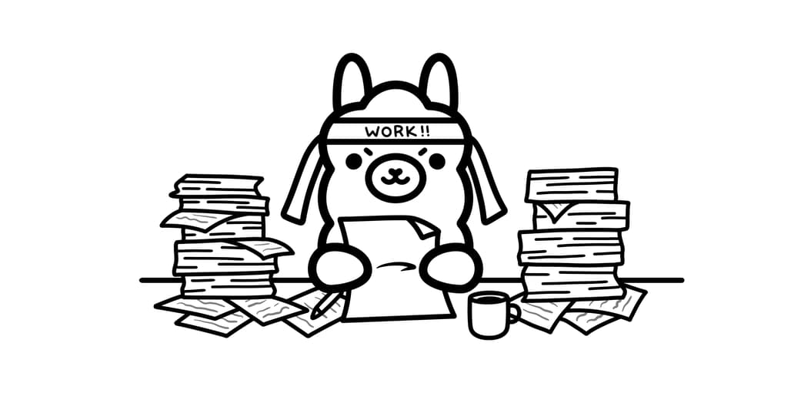

⭐ **[2026-1 Mid-term Project - INDEX](../2026-1_Mid-term_Project.md)**

# App Name: Turbine Archive

## 1. Problem Statement
This project is for reducing the time consumed in analyzing the experimental data.
I am doing my masters degree at Aeropropulsion lab in KARI (Korea Aerospace Research Institute). We do a lot of researches about gas turbine, which are based on strongly mission-driven development projects.

Due to this nature, it is important for us to do a lot of experiments about how the systems would work or figuring out the reasons why the systems does not work properly, rather than reading a lot of papers and digging a new research topics.
The most time-consuming job in my work is analyzing the data. We collect a lot of data from various components and they are about 30 to 50 cases. We have to see all the correlations with those cases with various kind of graphs and compare with past cases. It is pretty repeatable but very time consuming job that I have to pay several hours on it each time.

That is the reason why I started this project. The final product would work as below:
Human 
- Put a raw data with csv format
AI
- convert it into excel format
- draw all the timeline graphs and correlation graphs with data
- make a short report about the experiment
- make a list of experiments that I can easily reference former data

## 2. Target Users
The main target users are me and my colleagues in my laboratory. All of us are major in gas turbine and incorporated in same projects, so we do the similar works each time. We use Excel the most, and sometimes use Origin to draw graphs.

## 3. Core Features
1) Time grapher
- Draw all the graphs with time on x-axis and all the other data on y-axis
- Must-have
- 
2) Correlation grapher
- Draw all the graphs with each other on x-axis and y-axis
- Must-have
- 
3) Secretary
- Make a short report about the experiment, showing some important numbers like maximum rotation speed, maximum currents, etc.
- Nice-to-have
- 
4) Format Converter
- Convert the raw data with csv format into Excel format
- Must-have
- 
5) Librarian
- Make a list of experiments that I can easily reference former data.
- Nice-to-have
- 

## 4. Human-AI Interaction Flow
Step 1 : Human put raw data (csv format)
Step 2 : AI (Time grapher) draws all the graphs with time on x-axis and all the other data
Step 3 : AI (Correlation grapher) draws all the graphs with each other on x-axis and y-axis
Step 4 : Human reviews the graphs and ask comparisons of data or generating short report
Step 5 : AI (Secretary) makes a short report about the experiment, showing some important numbers like maximum rotation speed, maximum currents
Step 6 : Human order to save it in the list
Step 7 : AI (Format Converter) converts it into Excel format
Step 8 : AI (Librarian) makes a list of experiments that I can easily reference

## 5. Technical Approach
- LLM: ChatGPT(development), Ollama(operation)
- Framework: Streamlit
- Key libraries: Streamlit, Pandas, Matplotlib, Openpyxl
- Data: csv file as input format

## 6. Success Criteria
Reducing the current graph-drawing work from 30 minutes to less than 5 minutes.