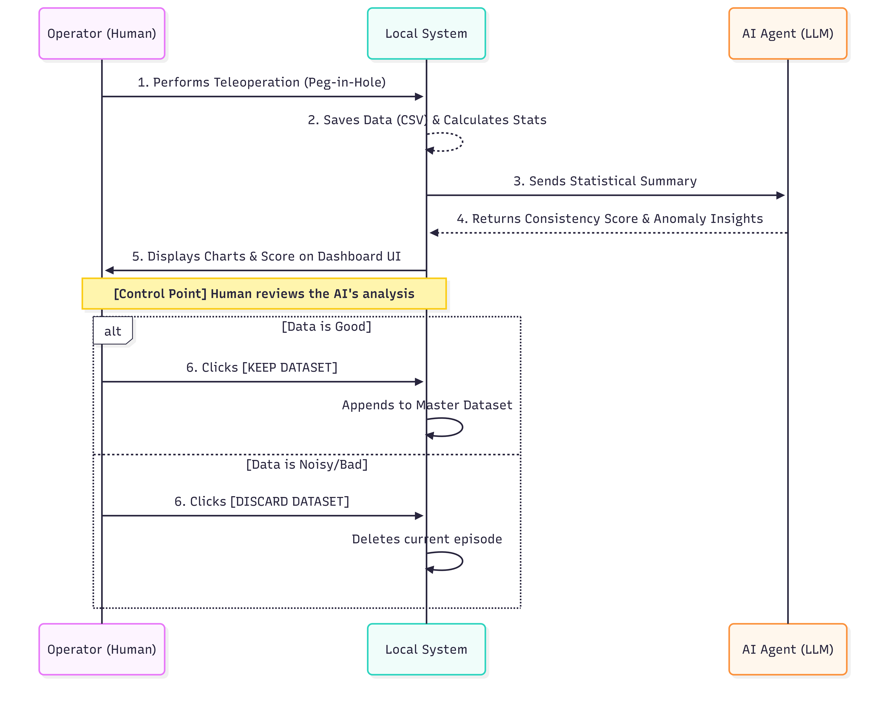
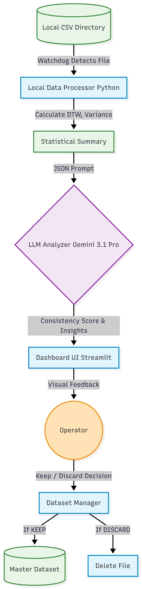

⭐ **[2026-1 Mid-term Project - INDEX](../2026-1_Mid-term_Project.md)**

# Quality-Control AI Agent for Robot Manipulator Imitation Learning

## 1. Problem

**Research Context:** We are conducting experiments to improve the performance of Imitation Learning models for robotic manipulators performing a Peg-in-Hole task. The task requires inserting a peg into a hole with a 0.1mm tolerance. Teleoperation data is collected by a team of 5 lab mates acting as data collectors.

**The Pain Point:** Because 5 different individuals are performing the teleoperation, the resulting imitation learning dataset suffers from inconsistency. Operators have different insertion times, generate unnecessary trajectory movements, and induce sudden force spikes. Training an imitation learning model on this contaminated data drastically reduces the task success rate. 
Previous studies have attempted to solve this by setting a 6:4 ratio of data collectors to data supervisors to ensure dataset uniformity. However, hiring additional supervisors or having a researcher manually review 100-200 experimental episodes per person is an unsustainable bottleneck that consumes excessive time.

## 2. Users

**Primary Users:**
* 1 Lead Researcher (Imitation Learning model developer)
* 5 Lab Mates (Teleoperation data collectors)

**Target Audience Characteristics:** The users aim to achieve a high task success rate by training the model on a uniform, high-quality dataset. They are highly fatigued by the repetitive nature of data collection and the tedious manual review process.

## 3. Features & Interaction Flow

**Step 1: Upload & Parse (Automated)**
* After an operator completes a single teleoperation episode, the trajectory and sensor data are automatically saved as a CSV file.
* The AI Agent has directory access permissions and automatically detects and parses the new CSV file in real-time.

**Step 2: Analyze & Detect (AI Processing)**
* The AI Agent analyzes the time-series CSV data and calculates the deviation of the current dataset against the mean of the historical, high-quality dataset.
* It assigns a consistency score indicating how well the current episode matches the established baseline.
* The system generates comparative graphs categorizing the tendencies of the 5 operators across four key metrics: Joint Angle, Joint Velocity, Force, and Torque. 
* It explicitly highlights the specific segments where the current episode deviates significantly from the norm.

**Step 3: Suggest & Approve (Human-in-Control)**
* The user reviews the generated graphs and the Consistency Score on the dashboard.
* Based on the AI's analysis, the user makes the final judgment on the quality of the dataset.
* The user clicks either [Keep] to append the data to the training set or [Discard] to delete the contaminated episode before proceeding to the next trial.

## 4. Success Criteria

* **Efficiency:** Does the system reduce the time required to preprocess and verify 100 teleoperation episodes by at least 70% compared to manual review?
* **Quality (Impact):** When performing Behavior Cloning (or other imitation learning algorithms) using the dataset refined by this AI app, does the actual robotic Task Success Rate show a statistically significant improvement compared to models trained on the unrefined baseline dataset?

---

## 5. System Architecture

The architecture follows a local-first data processing pipeline that operates independently of specific teleoperation environments and integrates an advanced LLM for analytical reasoning:

1. **Monitoring & Pre-processing Layer:**
    * **Watchdog Service:** A background Python script that continuously monitors a designated local directory for newly generated raw CSV files.
    * **Local Data Processor:** Upon detecting a new file, it parses the time-series data. It utilizes Dynamic Time Warping (DTW) to align trajectories of varying lengths and calculates deviations (variance, force/torque spikes) against the historical high-quality baseline dataset.
2. **AI Analysis Layer:**
    * **LLM Agent (Gemini 3.1 Pro):** To prevent bottlenecks and minimize API costs, raw high-frequency data is not sent directly. Instead, the Local Processor sends a structured JSON summary (e.g., timing of maximum force deviation, trajectory mismatch percentage). Gemini 3.1 Pro analyzes this summary to generate a Consistency Score and human-readable insights.
3. **User Interaction Layer:**
    * **Dashboard UI:** Displays visual feedback, including comparative graphs, highlighted anomaly zones, and the AI's analysis.
    * **Human-in-Control Point:** The user reviews the AI's insights and makes the final decision by clicking [KEEP] or [DISCARD]. The system never automatically deletes or approves data without human confirmation.
4. **Data Management Layer:**
    * **Dataset Manager:** Executes the user's decision. If approved, the CSV is moved to the Master Dataset folder. If rejected, it is permanently deleted to prevent contamination.

## 6. Technical Specification

* **Selected LLM:** Gemini 3.1 Pro API.
    * **Rationale:** Capable of robust logical reasoning over complex statistical summaries, providing highly accurate textual insights and structured outputs to drive the UI.
* **Core Technologies & Libraries:**
    * **Frontend/UI:** Python `Streamlit` or `Dash` for building interactive, real-time data dashboards without requiring complex web-development stacks.
    * **Backend & System:** Python `watchdog` library for robust, real-time file system monitoring.
    * **Data Processing:** `Pandas`, `NumPy`, and `SciPy`. `fastdtw` (Dynamic Time Warping) to accurately align and compare time-series data of varying lengths caused by different operators.
* **Cost & Latency Optimization:**
    * **Limitation Mitigation:** Sending raw, high-frequency time-series data directly to an LLM is both extremely costly and slow. 
    * **Solution:** The Python backend performs the computationally heavy statistical lifting locally. The LLM is only fed a structured, lightweight JSON summary. This hybrid approach keeps API costs negligible per episode and ensures UI updates within a few seconds.

## 7. UI Composition

**Layout Structure:**
* **Top Panel (Status & Control):** * Displays the Current Episode ID and the Operator Name.
    * A prominent "Consistency Score" calculated by Gemini 3.1 Pro (e.g., 85/100).
    * Two large, distinct actionable buttons: [KEEP DATASET] and [DISCARD DATASET].
* **Middle Panel (Episode Analysis):** * Four interactive line charts (Angle, Velocity, Force, Torque) comparing the "Current Episode Trajectory" (solid line) vs "Historical Mean Trajectory" (dotted line).
    * Red highlighted zones on the charts indicating anomalies (e.g., force spikes exceeding the 0.1mm tolerance threshold), driven by the local statistical analysis.
* **Bottom Panel (AI Insights & Operator Tendencies):** * **AI Feedback Box:** Displays the textual reasoning generated by Gemini 3.1 Pro (e.g., "Warning: 15% higher torque applied at timestamp 2.4s compared to the baseline").
    * **Tendency Radar:** A chart showing the current operator's historical tendencies compared to the other operators, helping supervisors identify systemic training issues.