⭐ **[2026-1 Mid-term Project - INDEX](../2026-1_Mid-term_Project.md)**

# FinanceMentor AI 

## Table of Contents

1. [Product Vision](#1-product-vision)
2. [System Design Overview](#2-system-design-overview)
3. [Application Modules](#3-application-modules)
   - [Module 1 — Global AI Mentor](#module-1--global-ai-mentor)
   - [Module 2 — Dashboard](#module-2--dashboard)
   - [Module 3 — Learning Paths](#module-3--learning-paths)
   - [Module 4 — Finance Roleplay Engine](#module-4--finance-roleplay-engine)
   - [Module 5 — Personal Tutor](#module-5--personal-tutor)
   - [Module 6 — Live Market Terminal](#module-6--live-market-terminal)
   - [Module 7 — News Intelligence](#module-7--news-intelligence)
   - [Module 8 — Paper Trading](#module-8--paper-trading)
   - [Module 9 — Decision Coach](#module-9--decision-coach)
   - [Module 10 — Crisis Simulator](#module-10--crisis-simulator)
   - [Module 11 — My Mastery Profile](#module-11--my-mastery-profile)
   - [Module 12 — Portfolio Tracker](#module-12--portfolio-tracker)
4. [Navigation Structure](#4-navigation-structure)
5. [Data Architecture](#5-data-architecture)
6. [AI Integration Design](#6-ai-integration-design)
7. [User Experience Design](#7-user-experience-design)
8. [Adaptive Mode System](#8-adaptive-mode-system)
9. [Implementation](#9-implementation)
   - [9.1 System Design](#91-system-design)
   - [9.2 Functional Modules](#92-functional-modules)
   - [9.3 System Workflow](#93-system-workflow)
   - [9.4 Key Advantages of Implementation](#94-key-advantages-of-implementation)

10. [Conclusion](#10-conclusion)
   - [10.1 Summary](#101-summary)
   - [10.2 Impact](#102-impact)
   - [10.3 Future Work](#103-future-work)

---

## 1. Product Vision

# FinMentor – AI-Powered Financial Learning Assistant

FinanceMentor AI is designed around a single core idea: **financial literacy through active participation**. Rather than presenting static educational content, the platform places users inside real market scenarios, guides them with a persistent AI mentor, and builds their knowledge through doing — trading, roleplaying, quizzing, and reasoning.

## Motivation
Financial markets are increasingly accessible through mobile apps and online platforms. However, accessibility does not guarantee understanding.

- Beginners often lack financial literacy
- Investment decisions are influenced by hype and misinformation
- Lack of guidance leads to poor outcomes and financial loss

**Objective:**  
To create a system that makes financial learning:
- Simple
- Interactive
- Practical
- Decision-oriented

---

## Problem Statement

Current financial ecosystems have major gaps:

- Users invest without understanding market dynamics
- Platforms focus on raw data instead of explanations
- Learning resources are separate from real-world trading tools

### Core Problem:
> Users have access to data, but lack understanding and guidance.

---

## 3. Proposed Solution: FinMentor

FinMentor is an AI-powered financial assistant designed to bridge this gap.

### Key Capabilities:
- Real-time data + AI explanations
- Integrated learning + decision support
- Scenario-based practice
- Personalized insights

---
### Design Principles

| Principle | How it's expressed |
|---|---|
| **Learning by doing** | Every module has an interactive AI component, not just text |
| **Context-aware guidance** | The AI Mentor knows which page the user is on and adapts accordingly |
| **Emotional intelligence** | Multiple modules specifically target emotional biases (FOMO, panic, overconfidence) |
| **Progressive complexity** | Beginner and Advanced modes change the depth of every module simultaneously |
| **Persistent identity** | User profile, risk tolerance, behavior history, and progress all persist across sessions |

---

## 2. System Design Overview

The application is organized into three layers: the **presentation layer** (pages and UI), the **intelligence layer** (AI mentor and LLM), and the **data layer** (persistent storage and live market feeds).

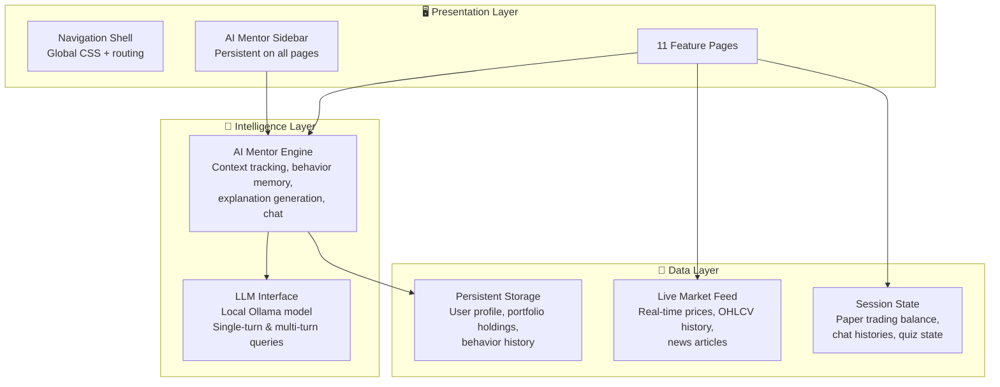
```mermaid
graph TB
    subgraph Presentation["🖥️ Presentation Layer"]
        NAV["Navigation Shell\nGlobal CSS + routing"]
        SIDEBAR["AI Mentor Sidebar\nPersistent on all pages"]
        PAGES["11 Feature Pages"]
    end

    subgraph Intelligence["🧠 Intelligence Layer"]
        MENTOR["AI Mentor Engine\nContext tracking, behavior memory,\nexplanation generation, chat"]
        LLM["LLM Interface\nLocal Ollama model\nSingle-turn & multi-turn queries"]
    end

    subgraph Data["💾 Data Layer"]
        LIVE["Live Market Feed\nReal-time prices, OHLCV history,\nnews articles"]
        PERSIST["Persistent Storage\nUser profile, portfolio holdings,\nbehavior history"]
        SESSION["Session State\nPaper trading balance,\nchat histories, quiz state"]
    end

    PAGES --> MENTOR
    SIDEBAR --> MENTOR
    MENTOR --> LLM
    PAGES --> LIVE
    MENTOR --> PERSIST
    PAGES --> SESSION
```

---

## 3. Application Modules

---

### Module 1 — Global AI Mentor

**Location:** Sidebar — visible on every page of the application  
**Role:** The connective tissue of the entire experience. The AI Mentor is not a separate feature — it is a persistent presence that follows the user across all modules.

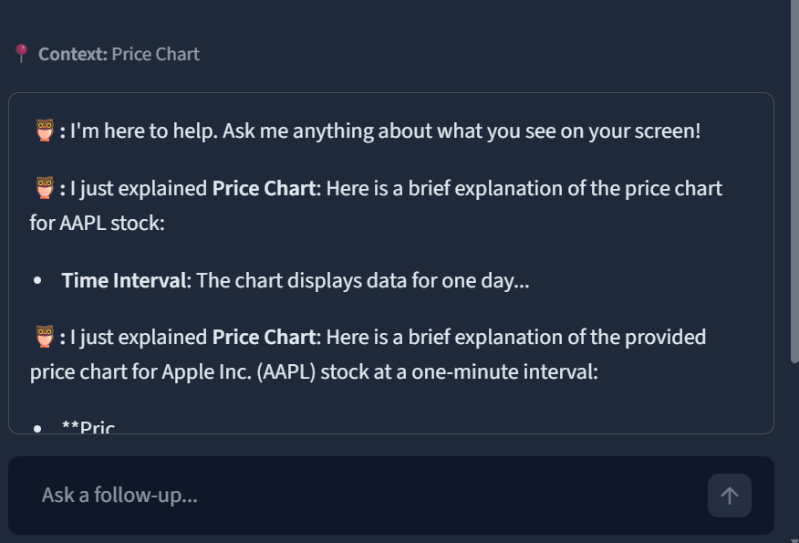
#### Capabilities

- **Contextual Awareness** — The mentor automatically knows which page the user is on and what they are looking at (e.g., a specific stock chart, a quiz question, their portfolio performance). Every AI response is grounded in that context.
- **Persistent Chat Window** — A mini chat interface in the sidebar allows users to ask follow-up questions at any moment without leaving the page they are on.
- **Inline Explanation Popovers** — On key pages, "Explain" buttons trigger an AI-generated breakdown of whatever data is on screen, rendered as an info box with a popover chat window for further questions.
- **Behavior Memory** — Every significant action (viewing a chart, completing a quiz, finishing a roleplay, generating a report) is logged with a timestamp. This log builds a behavioral profile that the mentor uses to personalize guidance.
- **Mode Toggle** — A Beginner / Advanced toggle in the sidebar changes the depth and complexity of AI explanations and chart types across the entire app simultaneously.

#### Design Flow

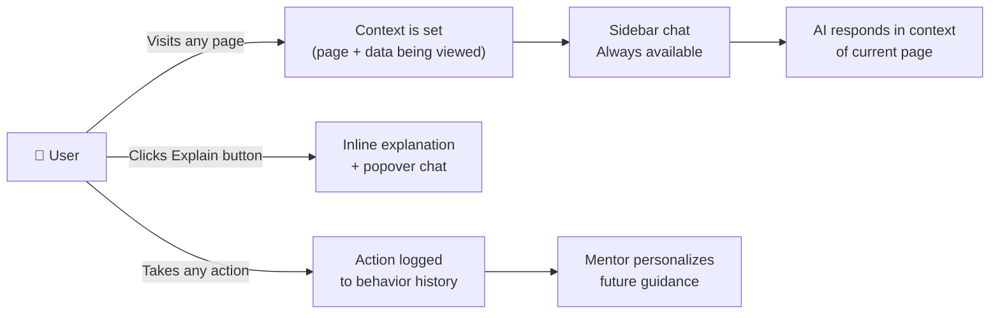
```mermaid
graph LR
    USER["👤 User"]
    USER -->|"Visits any page"| CTX["Context is set\n(page + data being viewed)"]
    CTX --> SIDEBAR_CHAT["Sidebar chat\nAlways available"]
    USER -->|"Clicks Explain button"| INLINE["Inline explanation\n+ popover chat"]
    USER -->|"Takes any action"| LOG["Action logged\nto behavior history"]
    LOG --> PERSONALIZE["Mentor personalizes\nfuture guidance"]
    SIDEBAR_CHAT --> RESPONSE["AI responds in context\nof current page"]
```

---

### Module 2 — Dashboard

**Location:** Overview → Dashboard (default landing page)  
**Role:** The mission control hub of the application. It surfaces the most critical information from across the platform in one unified view.

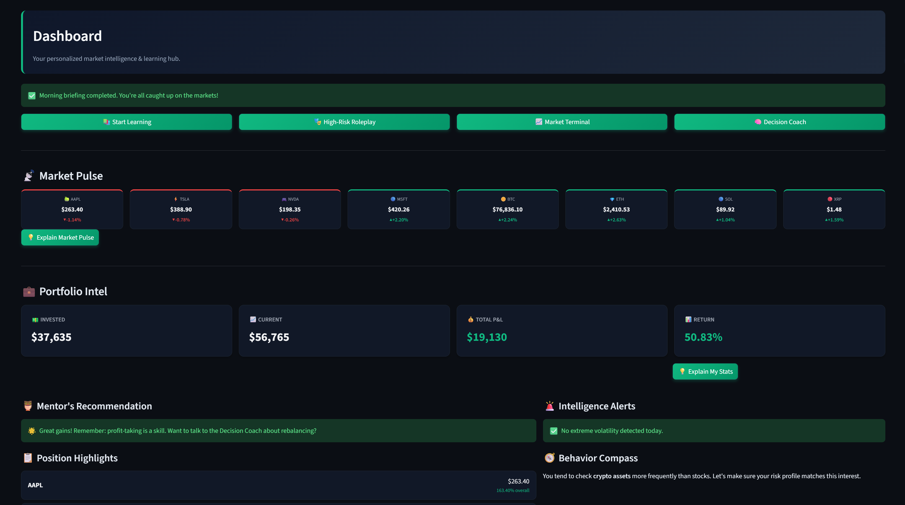

#### Capabilities

- **Daily AI Market Briefing** — The first time the user opens the app on any given day, the AI generates a personalized market overview. The briefing is only shown once per day and is replaced by a completion message on subsequent visits.
- **Quick Navigation** — Four prominent shortcut buttons that take the user directly to the four most-used modules: Learning Paths, Finance Roleplay, Live Market Terminal, and Decision Coach.
- **Live Market Pulse** — A row of eight live price cards tracking a curated watchlist of major stocks and cryptocurrencies. Each card displays the current price and daily percentage change, color-coded green (positive) or red (negative). Data refreshes automatically every 90 seconds.
- **Portfolio Intelligence Panel** — Reads the user's saved portfolio and displays four summary metrics: total invested, current value, total profit/loss, and overall return percentage. Below this, the top three positions are shown as individual performance cards.
- **Intelligence Alerts** — Any asset in the portfolio that moves more than 3% in a day is automatically flagged with a color-coded alert and a one-click link to the News Intelligence module for that asset.
- **Mentor Recommendation** — A dynamic recommendation block at the bottom that changes based on the user's current portfolio performance: it suggests specific modules or scenarios to engage with based on whether the portfolio is up, down, or neutral.
- **Behavior Compass** — After the user has interacted with the app enough to build a behavioral profile, this section surfaces personalized insights (e.g., "You check crypto more than stocks — let's make sure your risk profile reflects this").

#### Layout Design

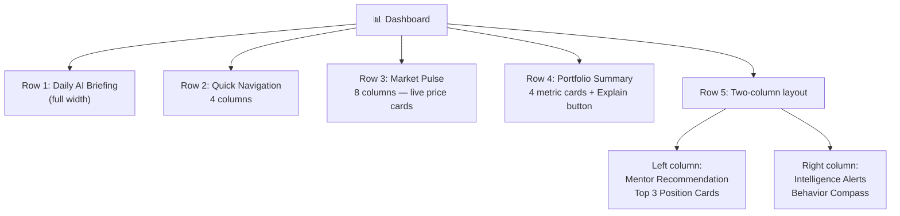
```mermaid
graph TD
    DASH["📊 Dashboard"]
    DASH --> R1["Row 1: Daily AI Briefing\n(full width)"]
    DASH --> R2["Row 2: Quick Navigation\n4 columns"]
    DASH --> R3["Row 3: Market Pulse\n8 columns — live price cards"]
    DASH --> R4["Row 4: Portfolio Summary\n4 metric cards + Explain button"]
    DASH --> R5["Row 5: Two-column layout"]
    R5 --> L["Left column:\nMentor Recommendation\nTop 3 Position Cards"]
    R5 --> R["Right column:\nIntelligence Alerts\nBehavior Compass"]
```

---

### Module 3 — Learning Paths

**Location:** Mentor & Learning → Learning Paths  
**Role:** The structured educational backbone of the platform. Organizes financial knowledge into curated paths with trackable completion and interactive AI assessment.

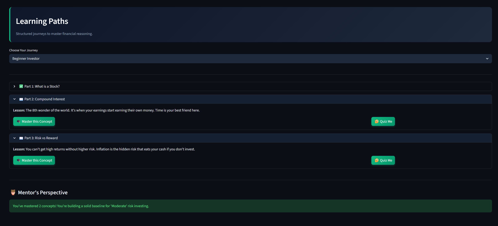

#### Capabilities

- **Three Curriculum Paths** — The module offers three distinct learning journeys, each containing three lessons:
  - *Beginner Investor* — foundational stock market concepts
  - *Crypto Basics* — blockchain, volatility, and self-custody principles
  - *Portfolio Building* — diversification, time horizons, and rebalancing

- **Lesson Cards** — Each lesson is presented as a collapsible panel. Completed lessons are marked with a checkmark. The lesson content is concise — designed to be absorbed in under 2 minutes.

- **Concept Mastery Tracking** — Each lesson has a "Master this Concept" action. When triggered, the lesson is permanently marked complete, the user's learning progress score is updated, and the action is logged in their behavioral profile.

- **AI Quiz Generation** — Each lesson has a "Quiz Me" action. On demand, the AI generates a unique multiple-choice question based on the lesson's content — the question, answer options, correct answer, and explanation are all produced by the AI on the fly. The quiz renders inline within the lesson panel.

- **Quiz Feedback Loop** — After the user submits their answer, the AI provides an explanation regardless of whether they were correct, and opens an inline popover chat so the user can ask follow-up questions about that specific concept.

- **Adaptive Mentor Guidance** — At the bottom of the page, the mentor provides a message that adapts based on how many concepts the user has completed — ranging from encouragement for beginners to unlocking an Advanced Roleplay recommendation once sufficient mastery is demonstrated.

#### Learning Flow

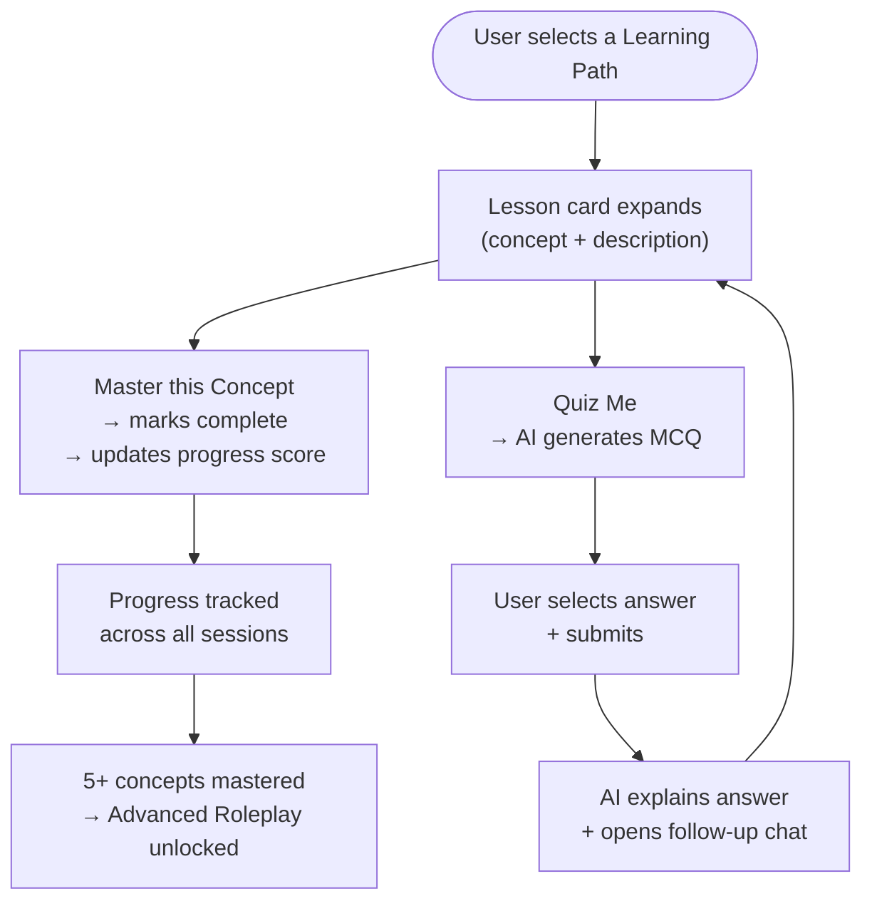
```mermaid
flowchart TD
    START(["User selects a Learning Path"])
    START --> LESSON["Lesson card expands\n(concept + description)"]
    LESSON --> MASTER["Master this Concept\n→ marks complete\n→ updates progress score"]
    LESSON --> QUIZ["Quiz Me\n→ AI generates MCQ"]
    QUIZ --> ANSWER["User selects answer\n+ submits"]
    ANSWER --> FEEDBACK["AI explains answer\n+ opens follow-up chat"]
    FEEDBACK --> LESSON
    MASTER --> PROGRESS["Progress tracked\nacross all sessions"]
    PROGRESS --> UNLOCK["5+ concepts mastered\n→ Advanced Roleplay unlocked"]
```

---

### Module 4 — Finance Roleplay Engine

**Location:** Mentor & Learning → Finance Roleplay  
**Role:** The emotional training center of the platform. Places the user inside high-stakes financial scenarios and uses AI to challenge their decision-making in real time.

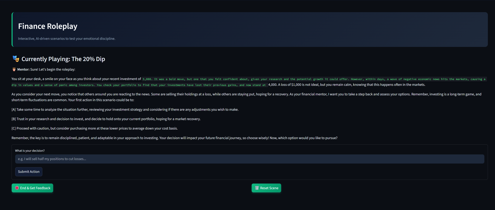

#### Capabilities

- **Scenario Library** — Seven pre-built financial crisis scenarios covering common investor emotional traps: panic selling, FOMO investing, overconfidence, speculative hedging, windfall mismanagement, emergency fund gaps, and retirement anxiety.

- **Custom Scenario** — Users can write any financial dilemma they are personally facing. The AI adapts the roleplay to their custom situation.

- **Immersive Scene Setting** — When a scenario starts, the AI sets the scene with vivid, narrative-style prose designed to create emotional engagement rather than clinical detachment.

- **Turn-Based Decision Loop** — The user types their decision at each turn. The AI reacts dynamically, narrates the likely consequences, and challenges the user's reasoning using the Socratic method — asking follow-up questions rather than simply judging the answer.

- **Persistent Conversation History** — The full exchange is maintained and displayed chronologically, with clear visual distinction between mentor responses and user decisions.

- **End Session Feedback Report** — When the user ends the session, the AI analyzes the entire conversation and produces a structured behavioral report covering strengths, identified risk-blindness patterns, and an Emotional Discipline score out of 10.

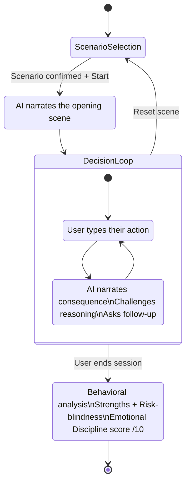
```mermaid
stateDiagram-v2
    [*] --> ScenarioSelection
    ScenarioSelection --> SceneIntro: Scenario confirmed + Start
    SceneIntro: AI narrates the opening scene
    SceneIntro --> DecisionLoop

    state DecisionLoop {
        [*] --> UserDecision
        UserDecision: User types their action
        UserDecision --> AIReaction
        AIReaction: AI narrates consequence\nChallenges reasoning\nAsks follow-up
        AIReaction --> UserDecision
    }

    DecisionLoop --> FeedbackReport: User ends session
    FeedbackReport: Behavioral analysis\nStrengths + Risk-blindness\nEmotional Discipline score /10
    FeedbackReport --> [*]
    DecisionLoop --> ScenarioSelection: Reset scene
```

---

### Module 5 — Personal Tutor

**Location:** Mentor & Learning → Personal Tutor  
**Role:** A free-form, always-available AI tutor for answering any financial question the user has, using conversational memory across the session.

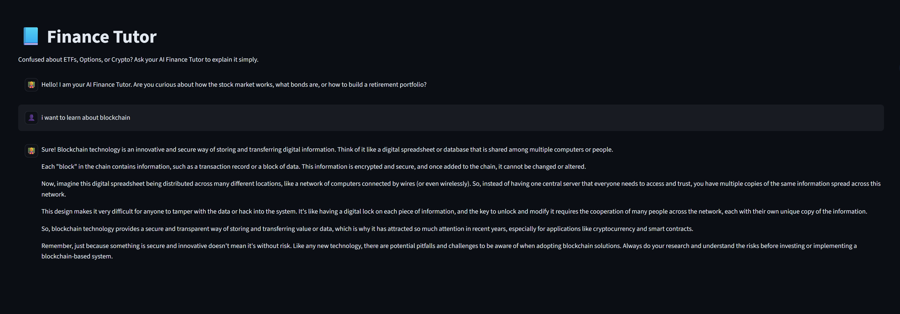

#### Capabilities

- **Open-ended Q&A** — The user can ask any finance-related question in natural language. There are no categories or menus — just a chat interface.
- **Conversational Memory** — The tutor maintains the full conversation history within the session, enabling multi-turn dialogue where later questions can build on earlier answers.
- **Persona Constraints** — The tutor is designed to use everyday analogies to explain complex concepts, always flag risks when discussing speculative assets, and never give specific investment advice.
- **Persistent Chat UI** — Standard chat bubble layout with distinct visual treatments for user messages and tutor responses.

---

### Module 6 — Live Market Terminal

**Location:** Live Markets → Live Terminals  
**Role:** The real-time market visualization hub. Provides price charts for stocks and crypto, and a dedicated live view of the user's actual portfolio holdings.

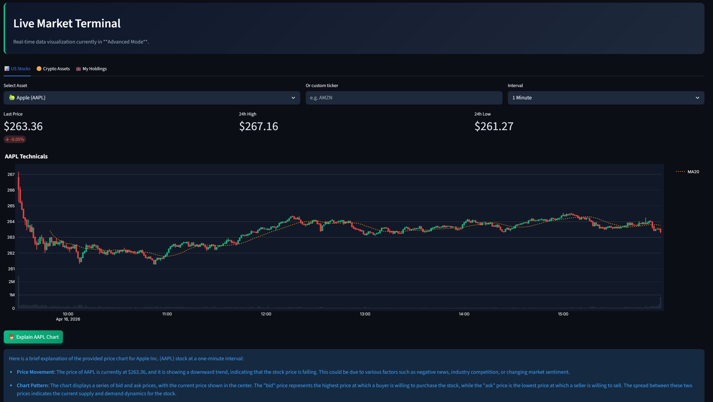

#### Capabilities

- **Three-Tab Structure:**
  - *US Stocks* — Seven pre-configured major stocks plus a custom ticker entry field
  - *Crypto Assets* — Seven pre-configured major cryptocurrencies plus a custom ticker entry field
  - *My Holdings* — Automatically loads the user's saved portfolio and renders charts for any held asset

- **Interval Selection** — Eight time intervals available from 1-minute intraday up to 1-week historical (1m, 5m, 15m, 30m, 1h, 4h, 1d, 1w). Each interval maps to the appropriate historical period for context.

- **Adaptive Chart Mode:**
  - *Beginner Mode* — Filled green line chart showing price trend over time, accompanied by a mentor tip banner explaining what the chart represents
  - *Advanced Mode* — Professional candlestick chart with OHLC bars, 20-day Moving Average overlay, and trading volume bars

- **Live Price Metrics** — Three metric cards above each chart: Last Price (with percentage change delta), 24-hour High, 24-hour Low.

- **Holdings-Specific Features (My Holdings tab):**
  - Full P&L Summary Card showing Live Price, Average Buy Price, Current Value, and Total P&L side by side
  - Average buy price rendered as a dashed horizontal reference line directly on the chart, so the user can visually see whether they are in profit or loss at any moment

- **AI Chart Explanation** — An Explain button on every chart triggers an AI analysis of the current price action, contextualized by the interval and trend direction, with a follow-up chat popover.

#### Tab Design

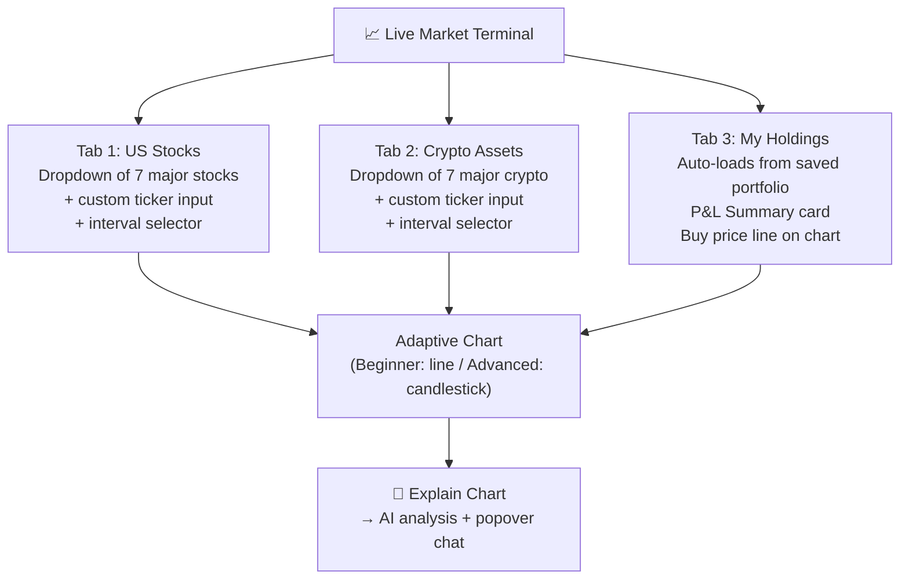
```mermaid
graph TD
    LMT["📈 Live Market Terminal"]
    LMT --> T1["Tab 1: US Stocks\nDropdown of 7 major stocks\n+ custom ticker input\n+ interval selector"]
    LMT --> T2["Tab 2: Crypto Assets\nDropdown of 7 major crypto\n+ custom ticker input\n+ interval selector"]
    LMT --> T3["Tab 3: My Holdings\nAuto-loads from saved portfolio\nP&L Summary card\nBuy price line on chart"]

    T1 --> CHART["Adaptive Chart\n(Beginner: line / Advanced: candlestick)"]
    T2 --> CHART
    T3 --> CHART
    CHART --> EXPLAIN["🦉 Explain Chart\n→ AI analysis + popover chat"]
```

---

### Module 7 — News Intelligence

**Location:** Live Markets → News Analyzer  
**Role:** Connects world events to the user's financial portfolio through AI-summarized news and actionable response buttons.

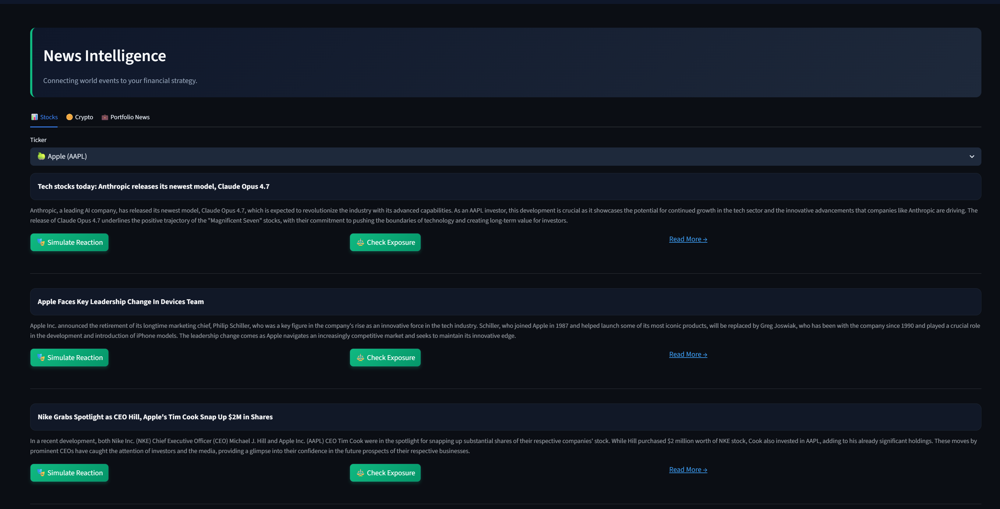

#### Capabilities

- **Three-Tab Structure:**
  - *Stocks* — News feed for any selected stock
  - *Crypto* — News feed for any selected cryptocurrency
  - *Portfolio News* — Sentiment monitoring for all assets in the user's portfolio

- **AI-Summarized Articles** — Each news article is automatically summarized by the AI into 2-3 investor-focused sentences. Summaries are asset-specific and framed from the perspective of someone holding that asset.

- **Actionable Article Cards** — Every news card contains three action buttons:
  - *Simulate Reaction* — pre-loads the news headline as a roleplay scenario and navigates to the Roleplay Engine
  - *Check Exposure* — navigates to the Portfolio Tracker with the user's relevant holdings in view
  - *Read More* — external link to the full article

#### News Card Flow

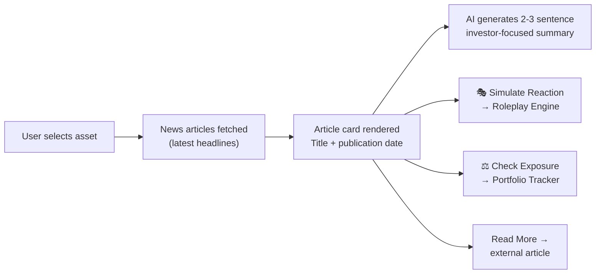
```mermaid
graph LR
    ASSET["User selects asset"] --> FEED["News articles fetched\n(latest headlines)"]
    FEED --> CARD["Article card rendered\nTitle + publication date"]
    CARD --> AISUMM["AI generates 2-3 sentence\ninvestor-focused summary"]
    CARD --> ACT1["🎭 Simulate Reaction\n→ Roleplay Engine"]
    CARD --> ACT2["⚖️ Check Exposure\n→ Portfolio Tracker"]
    CARD --> ACT3["Read More →\nexternal article"]
```

---

### Module 8 — Paper Trading

**Location:** Simulations → Paper Trading  
**Role:** A consequence-free virtual trading environment using live real-world prices, giving users a realistic sense of how trades feel without any financial risk.

#### Capabilities

- **Virtual Cash Balance** — Each session starts with a $10,000 virtual balance. The balance updates in real time as trades are executed.

- **Live-Price Trade Execution** — When a trade is submitted, the system fetches the current real market price for that asset and uses it for the transaction. This ensures the simulation reflects real conditions.

- **Buy Orders** — The system validates that the user has sufficient virtual cash before allowing a purchase. The cost is deducted from the balance and the asset is added to the holdings.

- **Sell Orders** — The system validates that the user holds sufficient units before allowing a sale. Proceeds are credited to the balance.

- **Holdings Dashboard** — All current positions are displayed with live price, today's percentage change (green/red), units held, and current market value.

- **Total Portfolio Value** — A running total of virtual cash plus all open positions gives the user a complete picture of their simulated net worth.

> **Design Note:** Balance and holdings are session-scoped by design. This allows users to always start with a clean slate and practice freely without accumulating simulated history.

---

### Module 9 — Decision Coach

**Location:** Simulations → Decision Coach  
**Role:** A structured reasoning wizard that guides users through a disciplined pre-investment thought process before committing to any financial decision.

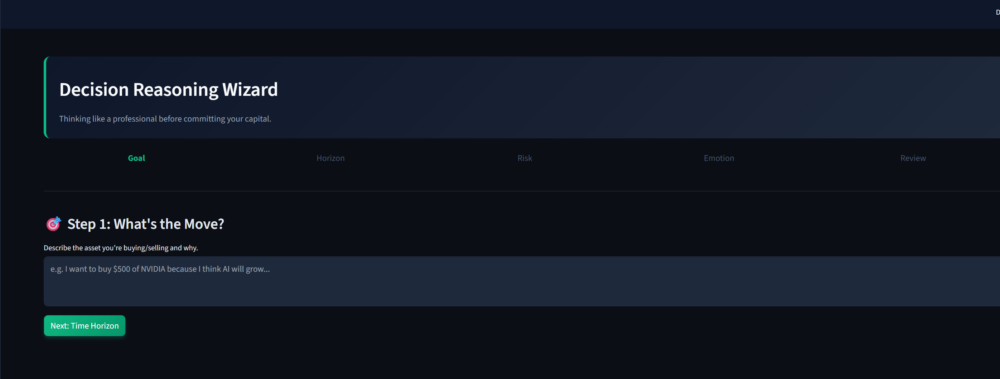

#### Capabilities

- **5-Step Linear Wizard** — The module is designed as a sequential form where each step must be completed before the next is revealed. A visual step indicator at the top shows progress.

- **Step Structure:**

| Step | Name | Input Type | Purpose |
|------|------|------------|---------|
| 1 | Goal | Free text | Describe the trade idea and the reasoning behind it |
| 2 | Time Horizon | Multiple choice | Short / Intermediate / Long / Legacy |
| 3 | Risk Tolerance | Slider (5%–50%) | Maximum loss % before panic selling |
| 4 | Emotional State | Dropdown | FOMO / Fear / Logic |
| 5 | AI Review | Generated output | Structured critique of the user's reasoning |

- **AI Reasoning Review** — The fifth step sends all four preceding inputs to the AI, which responds with a structured five-part critique: reasoning summary, logical strengths, critical risks, overlooked factors, and recommended next research steps.

- **Educational Framing** — The entire module is framed as educational support, not financial advice. The AI plays the role of a critical thinking evaluator, not an advisor.

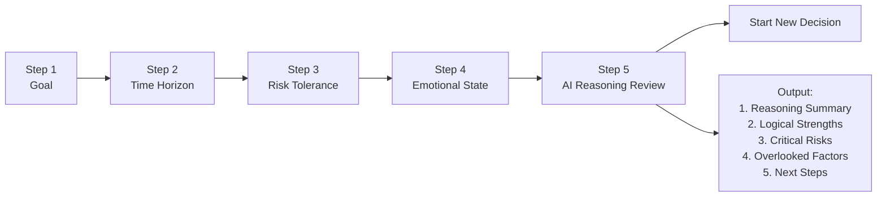
```mermaid
graph LR
    S1["Step 1\nGoal"] --> S2["Step 2\nTime Horizon"]
    S2 --> S3["Step 3\nRisk Tolerance"]
    S3 --> S4["Step 4\nEmotional State"]
    S4 --> S5["Step 5\nAI Reasoning Review"]
    S5 --> RESET["Start New Decision"]
    S5 --> OUT["Output:\n1. Reasoning Summary\n2. Logical Strengths\n3. Critical Risks\n4. Overlooked Factors\n5. Next Steps"]
```

---

### Module 10 — Crisis Simulator

**Location:** Simulations → Crisis Simulator  
**Role:** A rapid-fire decision training tool that presents high-pressure market events as multiple-choice scenarios, evaluated by the AI against optimal responses.

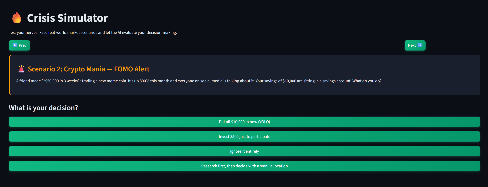

#### Capabilities

- **Scenario Presentation** — Each scenario is rendered as a prominent styled alert card with the event title and a detailed description of the situation (market data, dollar amounts, emotional triggers included for realism).

- **Four-Option Selection** — Each scenario has exactly four response options. The user selects one by clicking it — there is no "submit" button; the click itself triggers evaluation.

- **Instant AI Evaluation** — The moment an option is selected, the AI evaluates the choice against the optimal answer and generates a 3-4 sentence analysis explaining the financial principle at play.

- **Result Presentation** — Correct answers are highlighted with a success indicator. Incorrect answers display the optimal response alongside the analysis. Both outcomes educate the user on why the recommended approach is more sound.

- **Sequential Navigation** — Users can navigate forward and backward through the scenario library at any time. Moving to a new scenario resets the state cleanly.

#### Scenario Library

| Scenario | Market Event | Core Principle |
|---|---|---|
| Flash Crash | S&P 500 drops 22% in a single day | Loss aversion / panic selling |
| Crypto Mania | A meme coin rises 800% in a month | FOMO / speculation risk |
| Interest Rate Shock | Fed raises rates unexpectedly | Asset allocation stability |
| Earnings Miss | A major holding drops 18% after-hours on a small miss | Patience / fundamental analysis |

---

### Module 11 — My Mastery Profile

**Location:** Profile → My Mastery  
**Role:** The user's personal command center — combining identity configuration, portfolio management, educational progress tracking, and a personalized portfolio news briefing.

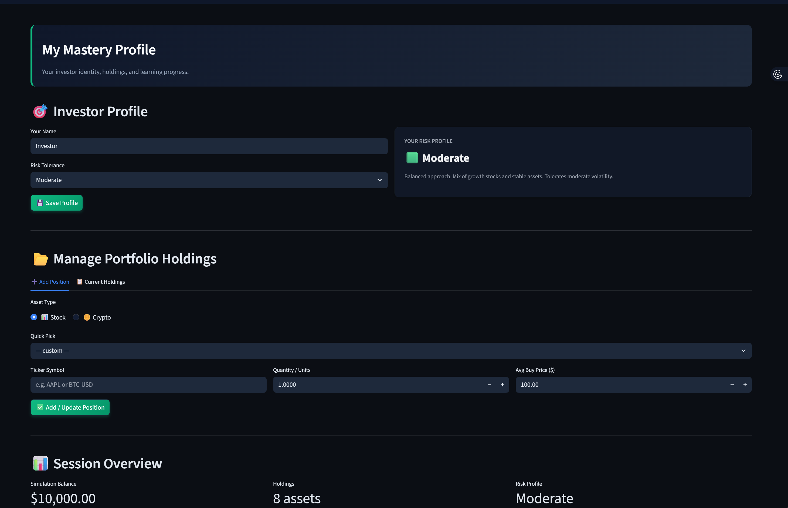

#### Capabilities

- **Investor Profile Settings** — Users can set their display name and choose a risk tolerance level (Conservative, Moderate, Aggressive, or Speculative). Each level has a description. The selected risk profile influences AI recommendations and mentor tone across the entire app.

- **Portfolio Management Interface** — A full add/edit/delete interface for the user's investment portfolio:
  - *Quick Pick dropdowns* for major stocks (AAPL, TSLA, NVDA, MSFT, AMZN, GOOGL, META) and crypto (BTC, ETH, SOL, XRP, BNB, ADA)
  - Custom ticker entry for any asset
  - Fields for quantity and average buy price
  - Existing positions are updated rather than duplicated
  - A holdings view tab shows all positions with per-row delete controls

- **Default Portfolio Seeding** — On first launch, the portfolio is automatically populated with five popular stocks and three major cryptocurrencies so all market-connected modules display meaningful data immediately.

- **Financial Concepts Checklist** — A list of twelve core financial concepts displayed as checkboxes. Users manually track which concepts they have studied. A progress bar shows overall financial literacy percentage.

- **Portfolio News Feed** — The app automatically fetches the three latest news headlines for each asset the user holds and displays them as styled cards with publication dates and external links.

- **AI Portfolio News Summary** — A single-click AI briefing that synthesizes all portfolio headlines into four sections: overall sentiment, per-asset highlights, action points tailored to the user's risk profile, and an emotional discipline reminder.

#### Module Layout

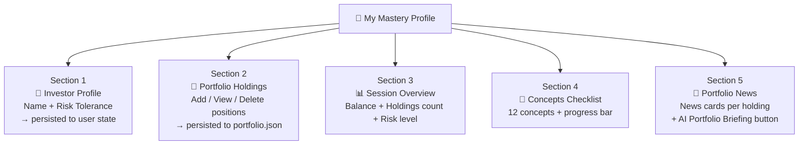
```mermaid
graph TD
    MP["👤 My Mastery Profile"]
    MP --> S1["Section 1\n🎯 Investor Profile\nName + Risk Tolerance\n→ persisted to user state"]
    MP --> S2["Section 2\n📂 Portfolio Holdings\nAdd / View / Delete positions\n→ persisted to portfolio.json"]
    MP --> S3["Section 3\n📊 Session Overview\nBalance + Holdings count + Risk level"]
    MP --> S4["Section 4\n📘 Concepts Checklist\n12 concepts + progress bar"]
    MP --> S5["Section 5\n📰 Portfolio News\nNews cards per holding\n+ AI Portfolio Briefing button"]
```

---

### Module 12 — Portfolio Tracker

**Location:** Live Markets → Portfolio Tracker  
**Role:** A deep-dive analytical view of the user's portfolio, combining real-time valuation, visual risk analysis, rule-based risk alerts, and AI-generated intelligence reports.

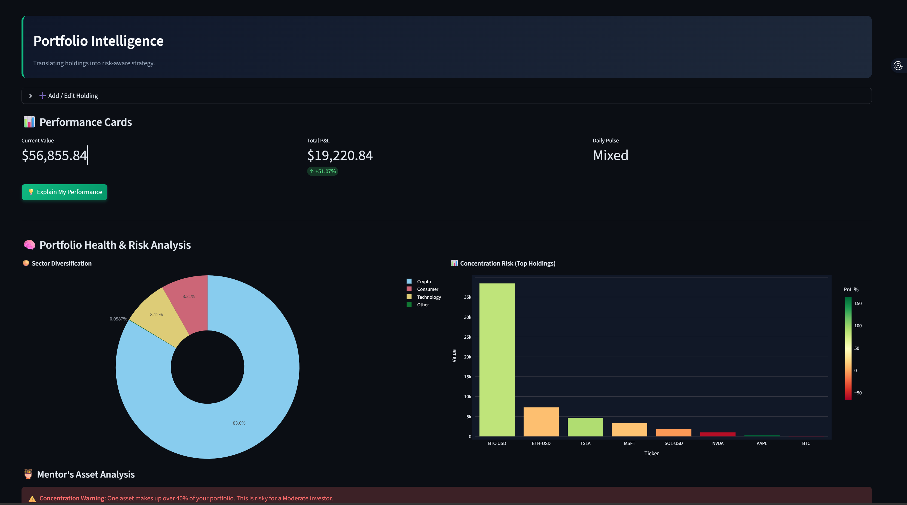

#### Capabilities

- **Add / Edit Holdings** — An expandable form allows users to add new positions (ticker, units, average buy price) or update existing ones. Changes are persisted immediately.

- **Performance Summary Cards** — Three metric cards showing current total value, total P&L (absolute and percentage), and the daily portfolio pulse (mixed, or a specific percentage if only one holding).

- **Risk Intelligence Charts** — Two side-by-side visualizations:
  - *Sector Diversification* — A donut chart that groups all holdings by sector (Technology, Consumer, Finance, Crypto, Other) and shows the percentage allocation of each
  - *Concentration Risk* — A bar chart sorted by position value, color-coded along a red-to-green gradient by P&L percentage, highlighting which positions dominate the portfolio

- **Rule-Based Automatic Risk Alerts:**
  - **Concentration Warning** — Triggers if any single asset exceeds 40% of total portfolio value
  - **Sector Overexposure Warning** — Triggers if Technology-sector holdings exceed 60% of total portfolio value

- **AI Smart Report** — On demand, generates a comprehensive portfolio risk assessment covering diversification gaps, sector exposure analysis, mismatch between holdings and stated risk profile, and emotional discipline recommendations.

- **Position Management Table** — A detailed table of all positions with full P&L data. Individual positions can be removed via a dropdown-and-delete interaction.

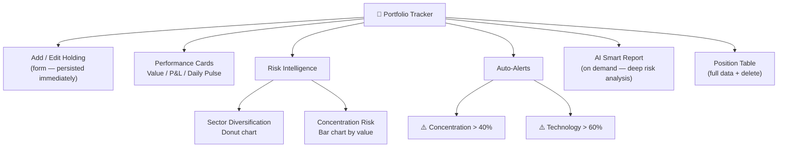
```mermaid
graph TD
    PT["💼 Portfolio Tracker"]
    PT --> ADD["Add / Edit Holding\n(form — persisted immediately)"]
    PT --> PERF["Performance Cards\nValue / P&L / Daily Pulse"]
    PT --> RI["Risk Intelligence"]
    RI --> PIE["Sector Diversification\nDonut chart"]
    RI --> BAR["Concentration Risk\nBar chart by value"]
    PT --> ALERTS["Auto-Alerts"]
    ALERTS --> A1["⚠️ Concentration > 40%"]
    ALERTS --> A2["⚠️ Technology > 60%"]
    PT --> REPORT["AI Smart Report\n(on demand — deep risk analysis)"]
    PT --> TABLE["Position Table\n(full data + delete)"]
```

---

## 4. Navigation Structure

The application uses a hierarchical sidebar navigation with five top-level groups, each containing logically related modules.

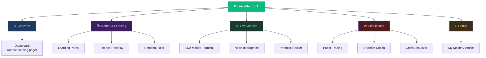
```mermaid
graph TD
    APP["FinanceMentor AI"]

    APP --> G1["📊 Overview"]
    APP --> G2["📚 Mentor & Learning"]
    APP --> G3["📈 Live Markets"]
    APP --> G4["🎮 Simulations"]
    APP --> G5["👤 Profile"]

    G1 --> M2["Dashboard\n(default landing page)"]

    G2 --> M3["Learning Paths"]
    G2 --> M4["Finance Roleplay"]
    G2 --> M5["Personal Tutor"]

    G3 --> M6["Live Market Terminal"]
    G3 --> M7["News Intelligence"]
    G3 --> M12["Portfolio Tracker"]

    G4 --> M8["Paper Trading"]
    G4 --> M9["Decision Coach"]
    G4 --> M10["Crisis Simulator"]

    G5 --> M11["My Mastery Profile"]

    style APP fill:#10b981,color:#fff,font-weight:bold
    style G1 fill:#1e3a5f,color:#93c5fd
    style G2 fill:#3b1f5e,color:#c4b5fd
    style G3 fill:#1a3a2e,color:#6ee7b7
    style G4 fill:#4a1e1e,color:#fca5a5
    style G5 fill:#3a2d1a,color:#fcd34d
```

---

## 5. Data Architecture

The platform uses a tiered data model: some state lives only for the duration of a browser session, while other state is persisted to disk and survives across sessions.

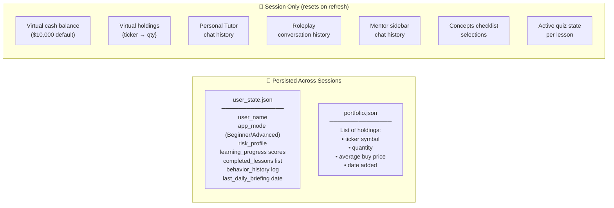
```mermaid
graph LR
    subgraph Persisted["💾 Persisted Across Sessions"]
        US["user_state.json\n───────────────\nuser_name\napp_mode (Beginner/Advanced)\nrisk_profile\nlearning_progress scores\ncompleted_lessons list\nbehavior_history log\nlast_daily_briefing date"]
        PF["portfolio.json\n───────────────\nList of holdings:\n• ticker symbol\n• quantity\n• average buy price\n• date added"]
    end

    subgraph Session["🔁 Session Only (resets on refresh)"]
        BAL["Virtual cash balance\n($10,000 default)"]
        HOLD["Virtual holdings\n{ticker → qty}"]
        TCHAT["Personal Tutor\nchat history"]
        RPHIST["Roleplay\nconversation history"]
        MCHAT["Mentor sidebar\nchat history"]
        CONCEPTS["Concepts checklist\nselections"]
        QUIZ["Active quiz state\nper lesson"]
    end
```

### Persistence Rules

| Data | Persisted | Resets On |
|---|---|---|
| User name & risk profile | ✅ Yes | Never (manual change only) |
| Completed lessons | ✅ Yes | Never |
| Behavior history | ✅ Yes | Never (capped at 100 entries) |
| Portfolio holdings | ✅ Yes | Manual delete only |
| Paper trading balance | ❌ No | Browser refresh |
| Chat histories | ❌ No | Browser refresh |
| Roleplay session | ❌ No | Browser refresh or reset |

---

## 6. AI Integration Design

All AI capabilities in the platform flow through a single integration layer that manages communication with the local Ollama LLM instance.

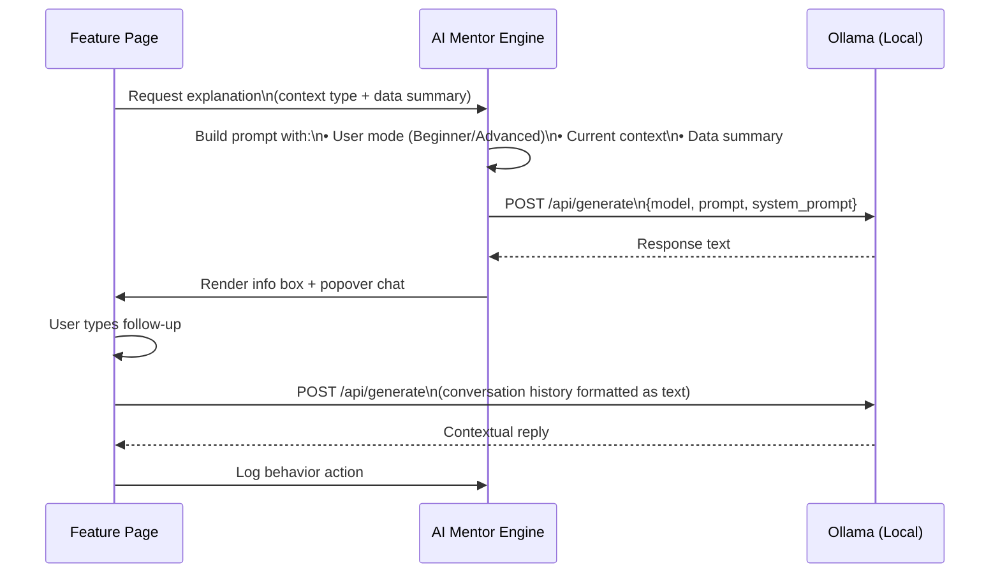
```mermaid
sequenceDiagram
    participant PAGE as Feature Page
    participant MENTOR as AI Mentor Engine
    participant LLM as Ollama (Local)

    PAGE->>MENTOR: Request explanation\n(context type + data summary)
    MENTOR->>MENTOR: Build prompt with:\n• User mode (Beginner/Advanced)\n• Current context\n• Data summary
    MENTOR->>LLM: POST /api/generate\n{model, prompt, system_prompt}
    LLM-->>MENTOR: Response text
    MENTOR->>PAGE: Render info box + popover chat
    PAGE->>PAGE: User types follow-up

    PAGE->>LLM: POST /api/generate\n(conversation history formatted as text)
    LLM-->>PAGE: Contextual reply
    PAGE->>MENTOR: Log behavior action
```

### AI Prompt Design Principles

| Principle | Implementation |
|---|---|
| **Mode-awareness** | Every prompt includes the user's current mode (Beginner/Advanced) |
| **Context-anchoring** | The current page and data being viewed is always included |
| **Persona consistency** | A financial mentor system prompt is applied to all requests |
| **Safety guardrails** | The AI is always instructed never to give specific buy/sell advice |
| **Graceful degradation** | If the LLM is unavailable, a clear warning is shown — no crash |

### Use Cases by Module

| Module | AI Use Case | Conversation Type |
|---|---|---|
| Global Mentor | Sidebar chat & inline explanations | Multi-turn |
| Dashboard | Daily briefing, chart explanation | Single-turn |
| Learning Paths | Quiz generation, answer explanation | Single-turn |
| Finance Roleplay | Scene narration, reaction, feedback | Multi-turn |
| Personal Tutor | Free-form Q&A | Multi-turn |
| Live Market Terminal | Chart pattern explanation | Single-turn |
| News Intelligence | Article summarization | Single-turn (cached) |
| Decision Coach | Reasoning review | Single-turn |
| Crisis Simulator | Decision evaluation | Single-turn |
| Portfolio Tracker | Smart risk report | Single-turn |
| My Mastery Profile | Portfolio news briefing | Single-turn |

---

## 7. User Experience Design

### Visual Design System

| Element | Design Choice | Rationale |
|---|---|---|
| Background | `#0B0E14` (near-black) | Reduces eye strain for extended sessions; professional trading terminal aesthetic |
| Primary accent | `#10B981` (emerald green) | Universal market "up" color; conveys growth and positivity |
| Negative accent | `#EF4444` (red) | Universal market "down" color; immediately recognizable |
| Warning accent | `#F59E0B` (amber) | Mid-tier signal for alerts and indicators |
| Card background | `#111827` | Slightly lighter than page background for clear depth hierarchy |
| Border color | `#1F2937` | Subtle separation without harsh lines |
| Typography | Inter (sans-serif) | Modern, highly legible at small sizes; used in financial dashboards |

### Interaction Patterns

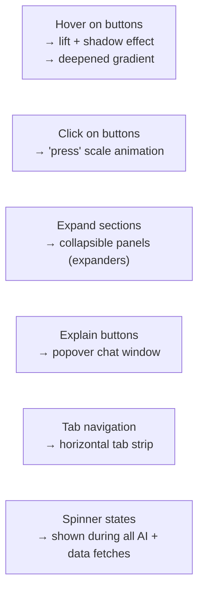
```mermaid
graph LR
    HV["Hover on buttons\n→ lift + shadow effect\n→ deepened gradient"]
    CL["Click on buttons\n→ 'press' scale animation"]
    EX["Expand sections\n→ collapsible panels (expanders)"]
    PO["Explain buttons\n→ popover chat window"]
    TB["Tab navigation\n→ horizontal tab strip"]
    SP["Spinner states\n→ shown during all AI + data fetches"]
```

### Adaptive Complexity (Beginner vs. Advanced Mode)

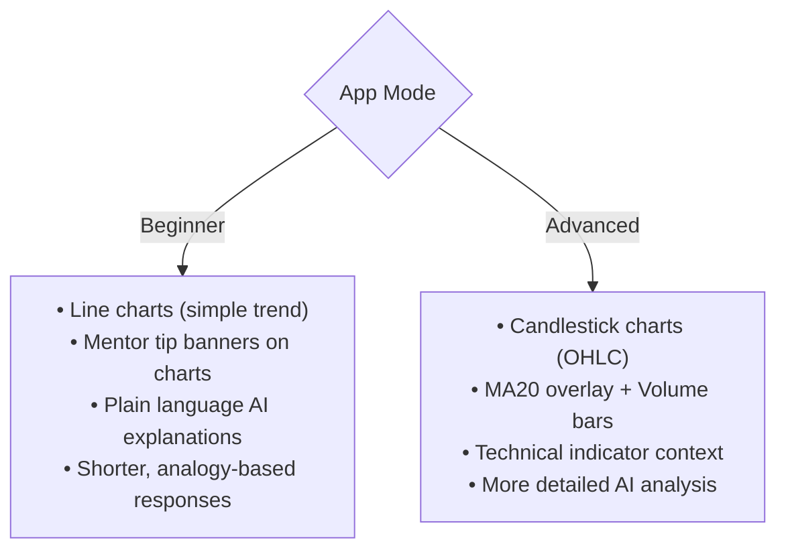
```mermaid
graph TD
    MODE{"App Mode"}
    MODE -->|Beginner| BEG["• Line charts (simple trend)
• Mentor tip banners on charts
• Plain language AI explanations
• Shorter, analogy-based responses"]
    MODE -->|Advanced| ADV["• Candlestick charts (OHLC)
• MA20 overlay + Volume bars
• Technical indicator context
• More detailed AI analysis"]
```

---

## 8. Adaptive Mode System

The Beginner / Advanced mode switch is designed to be a **single control** that changes the behavior of multiple modules simultaneously — no need to configure each feature separately.

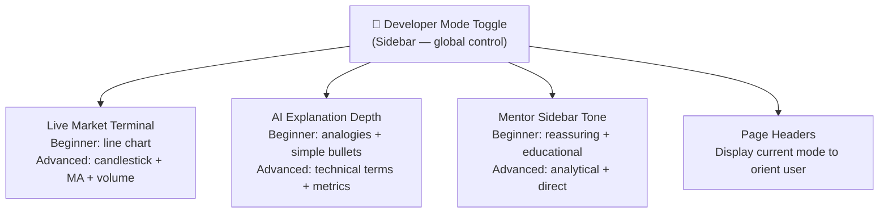
```mermaid
graph TD
    TOGGLE["🔄 Developer Mode Toggle\n(Sidebar — global control)"]

    TOGGLE --> LMT["Live Market Terminal\nBeginner: line chart\nAdvanced: candlestick + MA + volume"]
    TOGGLE --> AI_DEPTH["AI Explanation Depth\nBeginner: analogies + simple bullets\nAdvanced: technical terms + metrics"]
    TOGGLE --> MENTOR_TONE["Mentor Sidebar Tone\nBeginner: reassuring + educational\nAdvanced: analytical + direct"]
    TOGGLE --> HEADER["Page Headers\nDisplay current mode to orient user"]
```

The mode selection is persisted to the user profile so it survives across sessions. Switching modes triggers an immediate full page reload so all components update at once.

---

## 9. Implementation

FinMentor is implemented as an interactive, AI-powered web application that integrates real-time financial data, visualization tools, and large language models to provide intelligent insights and learning support.

### 9.1 System Design

The system follows a modular architecture, where each component is responsible for a specific functionality:

- **User Interface (UI)**  
  Built using Streamlit, the UI provides a multi-page dashboard where users can:
  - View market data  
  - Analyze news  
  - Track portfolios  
  - Interact with AI through a chat interface  

- **Data Layer**  
  Real-time financial data is retrieved using the **yfinance API**, which provides:
  - Stock prices  
  - Cryptocurrency data  
  - Historical trends  

- **Visualization Layer**  
  Financial data is visualized using **Plotly**, enabling:
  - Interactive charts  
  - Dynamic updates  
  - Easy interpretation of trends  

- **AI Engine**  
  The system uses a local Large Language Model via **Ollama (Qwen)**, which:
  - Generates explanations for market trends  
  - Summarizes financial news  
  - Provides portfolio risk insights  
  - Supports conversational interaction  

---

### 9.2 Functional Modules

FinMentor is divided into four main modules:

#### 9.2.1 Market Module
- Fetches real-time financial data  
- Displays charts and indicators  
- Uses AI to explain trends in simple language  

#### 9.2.2 News Module
- Collects financial news  
- Summarizes key points  
- Performs sentiment analysis (positive/negative impact)  

#### 9.2.3 Portfolio Module
- Tracks user investments  
- Analyzes risk factors (e.g., sector concentration)  
- Links relevant news to portfolio assets  

#### 9.2.4 Learning Module
- Provides chat-based learning  
- Generates quizzes to test understanding  
- Includes roleplay scenarios for decision-making practice  

---

### 9.3 System Workflow

1. The user interacts with the system through the dashboard or chat interface  
2. The system retrieves real-time financial data from APIs  
3. The AI model processes the data along with user queries  
4. The system generates:
   - Explanations  
   - Insights  
   - Simulations  
5. Results are displayed through an interactive interface  

---

### 9.4 Key Advantages of Implementation

- Combines real-time data with AI-driven reasoning  
- Provides an interactive and user-friendly experience  
- Supports both learning and practical decision-making  
- Uses a local LLM for efficient and privacy-aware processing  

---

## 10. Conclusion

FinMentor presents a novel approach to financial learning by integrating data, intelligence, and interaction into a single platform.

### 10.1 Summary

- Transforms financial tools into an interactive learning system  
- Bridges the gap between data visualization and user understanding  
- Combines market analysis, news insights, portfolio tracking, and learning support  

---

### 10.2 Impact

The system enables users to:

- Understand complex financial concepts more easily  
- Make informed and confident investment decisions  
- Practice decision-making in realistic scenarios  
- Reduce reliance on speculation and guesswork  

---

### 10.3 Future Work

Future improvements may include:

- Integration of advanced financial indicators  
- Expansion to global market data sources  
- Enhanced personalization based on user behavior  
- More complex roleplay and simulation scenarios  

---

### Final Statement

FinMentor demonstrates how AI can be used to empower users with knowledge, making financial markets more accessible, understandable, and actionable.
