## Slide: Title
- type: title
- title: Orientation - Agentic AI as R&D Collaborators
- subtitle: From "Tool User" to "Research Director" — The Beginning of a Paradigm Shift

> Week 1 of Phase 1: Onboarding & Literacy (Weeks 1-4)

=====

## Slide: Contents
- type: cards
- title: Contents
- subtitle: Aligning our perspectives and setting up the environment

- card(blue, 📖): 1. Lecture
  - Course Overview: The paradigm shift
  - From "Using Tools" to "Directing Agents"

- card(green, 💻): 2. Practice
  - Vibe Coding via Google AI Studio
  - Getting Google AI Studio API Key (free-tier)
  - Local Environment Setup: Python + Antigravity (AI Agent IDE) + Ollama (Local LLM)

- card(orange, 🗣️): 3. Discussion
  - Visit: UST LMS → Class → Discussion
  - Is AI a research assistant or a crutch?
  - Defining the human-AI boundary

=====

## Slide: Course Structure & Evaluation
- type: cards
- title: Structure & **Evaluation**
- subtitle: Harmonizing technical practice with philosophical depth

- card(blue, 🔄): Weekly Flow
  - **1 hr**: Lecture & Practice (Build Components)
  - **1 hr**: Deep Discussion (Philosophy & Ethics)
  - **Async**: Discussion Forum Debate (for 1 week)

- card(purple, 📊): Evaluation Weights
  - **30%**: Participation & Debate
  - **30%**: Mid-term Proposal (Video Pitch)
  - **30%**: Final Showcase (Demo Day)
  - **10%**: General Attendance

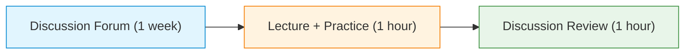
```mermaid
graph LR
    A["Discussion Forum (1 week)"] --> B["Lecture + Practice (1 hour)"]
    B --> C["Discussion Review (1 hour)"]
    style A fill:#e1f5fe,stroke:#0288d1
    style B fill:#fff3e0,stroke:#f57c00
    style C fill:#e8f5e9,stroke:#388e3c
```

=====

## Slide: What You'll Learn
- type: cards
- title: In This Course, **You** Will
- subtitle: Not just learn to "use" AI, but to "direct" AI

- card(blue, 🎯): Ultimate Goal
  - Transition from AI Tool Consumer (passive user)
  - To **Research Director** (active orchestrator)
  - Design & operate your own AI Agent system

- card(green, 🔬): What You'll Learn
  - AI Agent principles & architecture
  - Prompt Engineering & Tool Use
  - Multi-Agent collaboration system design
  - **Ethical responsibility** & Human-in-the-Loop

=====

## Slide: Target Audience
- type: compare-table
- title: Who Is This Course **For**?

> **Key message**: **"The mindset of collaborating with AI"** matters more than coding skills in this course.

| Category | Welcome If You Are... | Consider Other Courses If... |
|----------|----------------------|------------------------------|
| Interest | Grad student wanting to leverage AI Agents for R&D | Want to build LLMs from scratch |
| Background | Python basics + curiosity about AI is enough | Already proficient in building multi-agent systems |
| Expectation | Interested in philosophical & ethical implications of AI | Only focused on pure algorithm / model training |

=====

## Slide: Course Structure
- type: flow + card
- title: Weekly **Flow**

- flow: Lecture & Practice (1 hr) → Deep Discussion (1 hr) → Discussion Forum in UST LMS Debate

- card(yellow, 💡): Why This Structure?
  - **Lecture & Practice**: Hands-on building of Agent components
  - **Deep Discussion**: Philosophical & ethical questions (e.g., "Who owns a paper written by AI?")
  - **Discussion Forum in UST LMS**: Async debate — training to articulate ideas in writing

=====

## Slide: Evaluation
- type: cards
- title: Evaluation = Measuring **Director Capability**
- subtitle: Not code quality, but how well you "directed" AI

- card(blue, 🗣️): Participation & Debate (30%)
  - Active debate on Discussion Forum in UST LMS
  - Peer feedback & mutual evaluation
  - "Good questions" score higher than "good answers"

- card(orange, 📝): Midterm Proposal (30%)
  - Your personalized AI Agent system proposal
  - 5-min video pitch + document
  - Persuasively argue: "Why is this Agent needed?"

- card(green, 🚀): Final Showcase (30%)
  - Demo Day: Live demonstration of a working Agent
  - "The Director's Report": Reflective essay on managing AI
  - Includes peer evaluation

- card(pink, ✅): Attendance (10%)
  - General attendance check

=====
## Slide: The "Research Director" Mindset
- type: cards
- title: The **Research Director** Mindset
- subtitle: Transitioning from 'Using Tools' to 'Directing Agents'

- card(blue, 🧱): Orchestration → Coding
  - Connect AI components like Lego blocks.
  - Design the high-level architecture.

- card(orange, ⚖️): Ultimate Responsibility
  - The Director is always at fault for data hallucinations.
  - "The AI made a mistake" is an unacceptable excuse.

- card(green, 🕵️): Human-in-the-Loop (HITL)
  - Automate repetitive tasks.
  - Intentionally stay at critical decision points for scientific validity.

=====

## Slide: Paradigm Shift Comparison
- type: mermaid
- title: Paradigm Shift Comparison
- subtitle: The way you use AI is about to fundamentally change

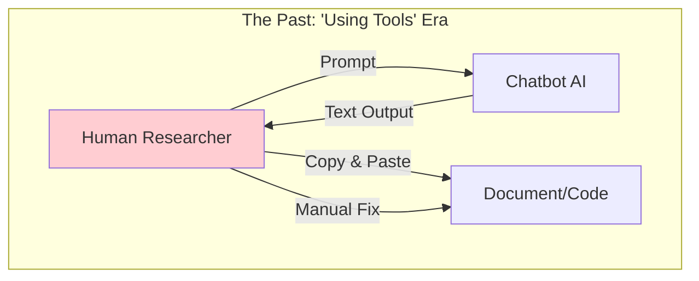
```mermaid
graph TD
    subgraph "The Past: 'Using Tools' Era"
        H1[Human Researcher] -->|Prompt| C[Chatbot AI]
        C -->|Text Output| H1
        H1 -->|Copy & Paste| Doc[Document/Code]
        H1 -->|Manual Fix| Doc
        style H1 fill:#ffcdd2
    end
```

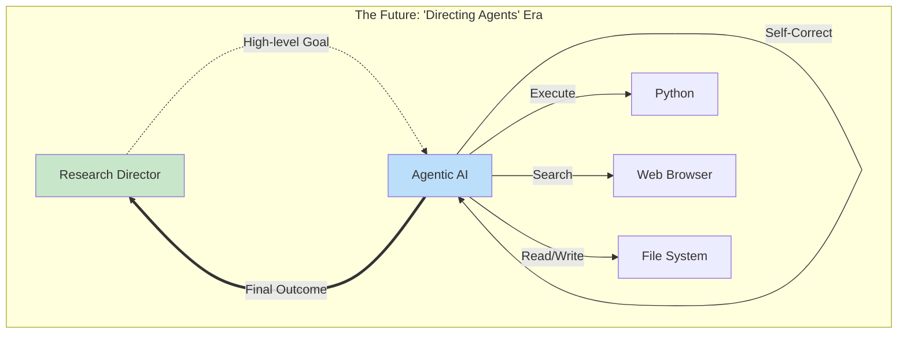
```mermaid
graph TD
    subgraph "The Future: 'Directing Agents' Era"
        H2[Research Director] -.->|High-level Goal| A[Agentic AI]
        A -->|Self-Correct| A
        A -->|Execute| T1[Python]
        A -->|Search| T2[Web Browser]
        A -->|Read/Write| T3[File System]
        A ===>|Final Outcome| H2
        style H2 fill:#c8e6c9
        style A fill:#bbdefb
    end
```

=====

## Slide: The Paradigm Shift Begins
- type: card-single
- title: Right Now, the **Paradigm** Is Shifting
- subtitle: The way you use AI is about to fundamentally change

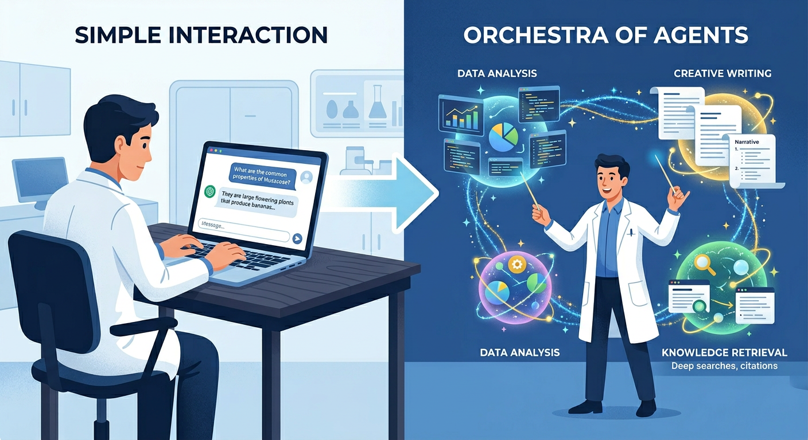
Left side — a person typing a question into ChatGPT at a laptop. Right side — the same person standing like an orchestra conductor, directing multiple AI agents performing different tasks. A large arrow in the center. Professional, minimal illustration style.

> **Image Prompt**: "Split illustration, left side: a researcher typing a question into a chatbot on a laptop screen, simple and passive interaction. Right side: the same researcher standing like an orchestra conductor, directing multiple AI agents represented as glowing orbs performing different tasks (coding, searching, writing). A large arrow in the center pointing from left to right. Clean, professional, minimal flat illustration style, blue and white color palette."

=====

## Slide: Before — The "AI Tool User" Era
- type: card-single
- title: Before: The AI **Tool User** Era
- subtitle: Most of us are still at this stage right now

**"AI is just a smart search engine" — This is the Tool User's perspective**

- card(pink, 😅): A Familiar Scene
  - Ask ChatGPT a question → copy answer → paste into document
  - "Fix this code" → manually apply the result to the file
  - Search → request summary → search again → summarize again...
  - **Every step is manually connected by a human**

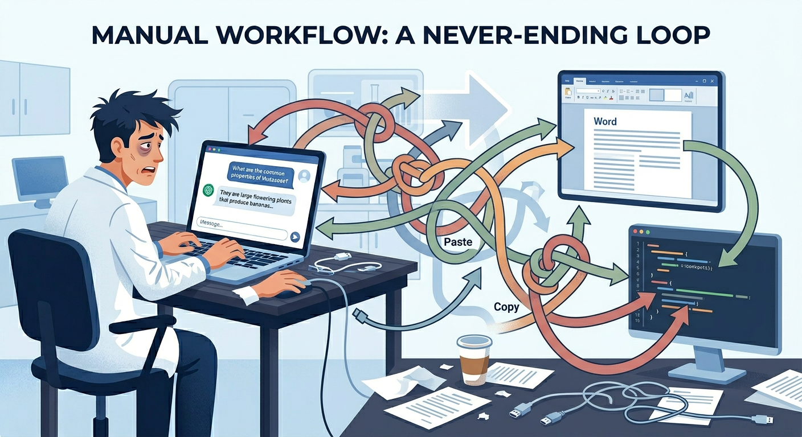
A person going back and forth between ChatGPT and a Word document, copy-pasting. Arrows tangled everywhere, person looks exhausted. Simple diagram style.

> **Image Prompt**: "Diagram showing a frustrated researcher sitting at a desk, manually copying text from a ChatGPT window to a Word document, then to a code editor, then back to ChatGPT. Multiple tangled arrows showing the manual back-and-forth workflow. Simple, clean diagram style with subtle humor, muted colors."

=====

## Slide: After — The "Research Director" Era
- type: card-single
- title: After: The **Research Director** Era
- subtitle: You are no longer the executor — you are the conductor

**"AI is my research team" — This is the Director's perspective**

- card(green, 🎬): The New Landscape
  - "Find 5 relevant papers on this topic and summarize them" → Agent searches, downloads & summarizes
  - "Analyze this data, visualize it, and draft a report" → Agent runs the entire pipeline
  - "Find bugs in the code, fix them, and run the tests" → Agent executes autonomously
  - **The human sets the goal and verifies the result**

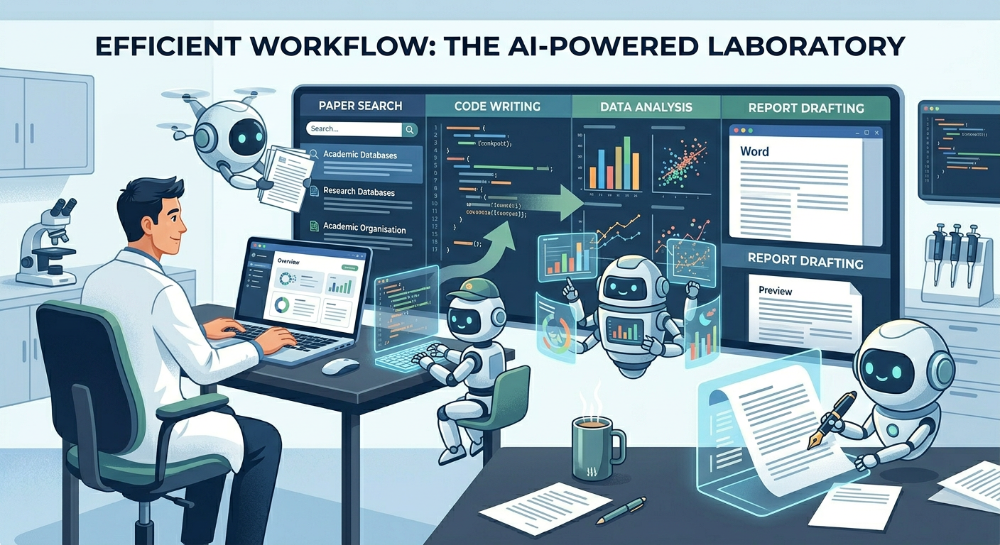
A person sitting comfortably, looking at a dashboard. Multiple AI Agents performing paper search, code writing, data analysis, report drafting. Clean, futuristic feel.

> **Image Prompt**: "A researcher comfortably sitting in a modern office, looking at a dashboard screen. Around them, multiple AI agents (represented as friendly robot assistants or glowing orbs) are simultaneously performing tasks: one is searching academic papers, another is writing code, another is analyzing data charts, another is drafting a report. Clean, futuristic but warm illustration style, blue and green tones."

=====

## Slide: Analogy — The Film Director
- type: cards
- title: Understanding by Analogy: **The Film Director**
- subtitle: A Research Director is like a film director

- card(blue, 🎬): A Film Director...
  - Doesn't act in scenes (= doesn't code everything)
  - Doesn't operate the camera (= doesn't search everything)
  - Sets the vision, orchestrates the team, and takes responsibility for quality

- card(orange, 🎯): A Research Director...
  - Doesn't write all the code personally
  - Doesn't read every paper manually
  - Sets the research direction, orchestrates AI Agents, and takes responsibility for accuracy

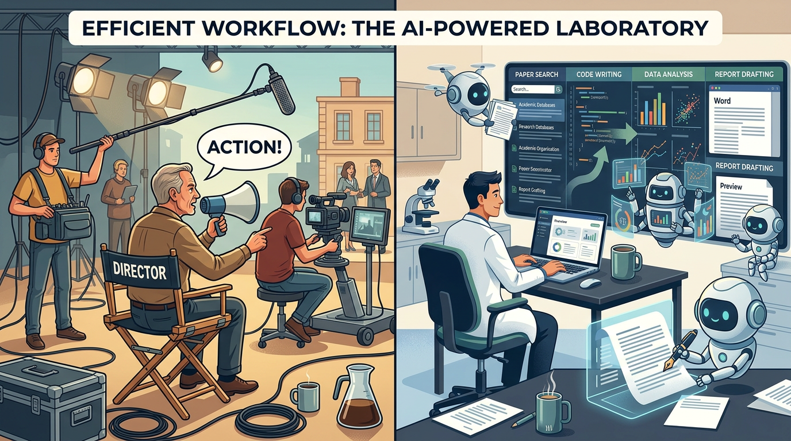
Left — a film director in a chair shouting "Action!" directing a crew. Right — a researcher directing multiple AI Agents on screens. 1:1 visual parallel.

> **Image Prompt**: "Split comparison illustration. Left: a film director sitting in a director's chair on a movie set, saying 'Action!' with camera crew, actors, and lighting team around them. Right: a researcher at a modern desk, directing multiple AI agents displayed on screens - one agent searching, one coding, one analyzing. Visual parallel between the two scenes. Professional, warm illustration style."

=====

## Slide: Real-World Examples — AI Agents Are Already Here
- type: cards
- title: AI Agents Are Already **Here**
- subtitle: This is not a distant future. It's happening right now

- card(blue, 🤖): Claude Code (Anthropic)
  - Understands codebases and autonomously modifies them
  - Creates files, runs tests, debugs — all on its own
  - The developer just "directs" and "reviews"

- card(green, 🔬): AI Science Research Agents
  - Automates: paper search → hypothesis generation → experiment design
  - e.g., ChemCrow (chemistry experiment automation)
  - e.g., GPT-Researcher (automated research reports)

- card(purple, 💼): Business Agents
  - Automates: customer inquiry → analysis → response
  - e.g., Salesforce Einstein, Microsoft Copilot
  - Not simple chatbots — they manage entire business workflows

References:
> 📚 [The state of AI in 2025: Agents, innovation, and transformation (November 5, 2025)](https://www.mckinsey.com/capabilities/quantumblack/our-insights/the-state-of-ai)
> 📚 [ChemCrow paper](https://arxiv.org/abs/2304.05376)

=====

## Slide: Tool vs Agent — The Core Difference
- type: compare-table
- title: **Tool** vs **Agent** — The Core Difference
- subtitle: Understanding this distinction is half the course

| Category | AI Tool | AI Agent |
|----------|---------|----------|
| Analogy | A power drill | A skilled carpenter |
| Behavior | Only works when the user presses the button | Given a goal, plans and executes on its own |
| Example | "Translate this sentence" | "Read this paper and create a Korean summary report" |
| On failure | Outputs an error message | Analyzes the cause and tries a different approach |
| Memory | Starts fresh every time | Remembers context from previous tasks |
| Tool use | None (it IS the tool) | Uses search, code execution, file management, etc. |

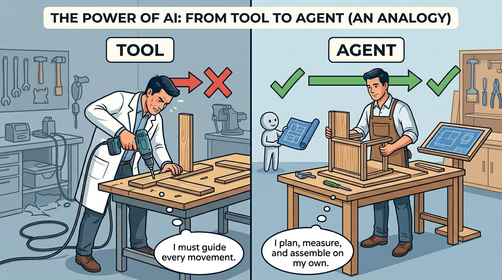
Left — a power drill (tool), a person holding it and doing manual work. Right — a skilled carpenter (agent), independently building furniture from a blueprint. Simple analogy illustration.

> **Image Prompt**: "Split comparison illustration. Left side labeled 'Tool': a person holding a power drill, manually drilling into wood - they control every movement. Right side labeled 'Agent': a skilled carpenter independently building furniture from a blueprint - they plan, measure, cut, and assemble on their own. The person just provided the blueprint. Clean, minimal illustration, educational style."

=====

## Slide: Concrete Scenario Comparison
- type: cards
- title: Same Task, Different **Approaches**
- subtitle: Given the assignment: "Survey related papers and write a literature review"

- card(pink, 😓): The Tool User's Day
  - 1. Search keywords on Google Scholar
  - 2. Open and read papers one by one
  - 3. Copy-paste each into ChatGPT: "Summarize this paper" — repeat
  - 4. Manually compile summaries in Word
  - 5. Write the literature review sentences yourself
  - **Time required: 2-3 days**

- card(green, 😎): The Research Director's Day
  - 1. Instruct the Agent: "Find 20 papers from the last 5 years on this topic and organize key contributions"
  - 2. Agent automatically: searches → downloads → summarizes → categorizes → drafts review
  - 3. Director reviews: Missing papers? Misinterpretation? Gives correction instructions
  - 4. Agent applies revisions → Final literature review complete
  - **Time required: 2-3 hours (+ verification time)**

=====

## Slide: Three Core Competencies of a Research Director
- type: cards
- title: The **3 Core Competencies** of a Research Director
- subtitle: The capabilities you'll develop this semester

- card(blue, 🧱): Orchestration
  - **Combine** AI components like Lego blocks
  - **Design** which Agent gets which role
  - "Architecture thinking" matters more than "coding skills"
  - e.g., "What if we connect a Search Agent + Summary Agent + Writing Agent?"

- card(orange, ⚖️): Accountability
  - **Ultimate responsibility** for AI-generated output belongs to the Director
  - **Detect and correct** hallucinations and biases
  - "The AI said so" is never an excuse
  - e.g., If the AI cites a non-existent paper → Director's responsibility

- card(green, 🕵️): Human-in-the-Loop (HITL)
  - Automate everything, but **intervene at critical decision points**
  - Scientific validity and ethical judgment are NOT delegated to AI
  - e.g., Medical AI Agent suggests a diagnosis → Final call is the doctor's

=====

## Slide: Human-in-the-Loop Deep Dive
- type: flow + card
- title: **Human-in-the-Loop** (HITL)
- subtitle: "Where should a human intervene?" — This is the Director's key decision

- flow: Agent Starts → Result → ⚠️ Human Review → Continue or Redirect → Final Output

- card(yellow, 💡): When HITL Is Needed
  - When **interpreting insights** from data (statistical significance judgment)
  - When **ethical judgment** is required (personal data inclusion)
  - When making **creative direction** decisions (choosing research hypotheses)
  - Before results are **published externally** (papers, reports)

- card(pink, ⚠️): What Happens Without HITL?
  - AI cites non-existent papers (hallucination)
  - Biased data leads to incorrect conclusions
  - Copyright-infringing content generated
  - **Credibility and academic integrity compromised**

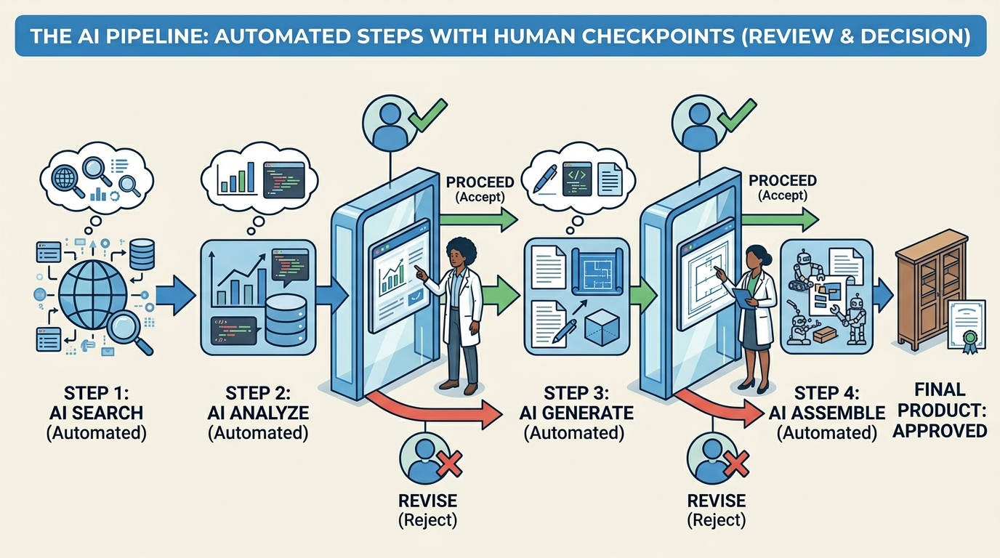
Pipeline diagram. Automated steps by AI Agent with "Human Review" checkpoints in between. Checkpoint has human icon with green checkmark / red X.
> **Image Prompt**: "A horizontal pipeline diagram showing an AI agent workflow. Multiple automated steps (search, analyze, generate) shown as connected blue boxes with arrows. At key decision points, there are 'checkpoint' gates with a human icon, a green checkmark and a red X. The human figure is reviewing the intermediate output before allowing the pipeline to continue. Clean, professional infographic style."

=====

## Slide: Semester Roadmap
- type: cards
- title: 16-Week **Roadmap**
- subtitle: Transitioning from Tool User to Research Director

- card(blue, 📌): Phase 1: Onboarding & Literacy (Weeks 1-4)
  - Week 1: Orientation & Paradigm Shift
  - Week 2: LLM Capabilities & Local Setup (Ollama)
  - Week 3: Prompt Engineering & Research Personas
  - Week 4: Tool Use & Function Calling

- card(green, 🔧): Phase 2: Workflow Automation (Weeks 5-8)
  - Week 5: Web UI Layout (Streamlit/Gradio)
  - Week 6: Auto-Scraper & Meta Extraction
  - Week 7: Auto-Drafting Results from Data
  - Week 8: **Mid-term Evaluation** (Video Pitch)

- card(orange, ⚖️): Phase 3: Management & Reliability (Weeks 9-12)
  - Week 9: Task/Flow Design (LangGraph basics)
  - Week 10: Evaluation Systems & Rubrics
  - Week 11: Self-Correction & Reflection Nodes
  - Week 12: RAG & Long-term Context Memory

- card(purple, 🚀): Phase 4: Collaboration & Future (Weeks 13-16)
  - Week 13: Multi-Agent Systems & Team Dynamics
  - Week 14: Safety & Audit Interfaces (Human-in-the-Loop)
  - Week 15: Expansion (MCP & External Lab Connectivity)
  - Week 16: **Final Showcase** (Demo Day)

=====

## Slide: Discussion Topics Preview
- type: card-single
- title: This Semester's **Discussion** Topics
- subtitle: Each week, we tackle one philosophical or ethical question together

- card(purple, 🧠): Questions to Think About
  - "If an AI Agent's code has a bug, who is responsible?"
  - "Can AI-generated research results be included in a paper?"
  - "How much autonomy should we give an AI Agent?"
  - "Can AI Agents replace human researchers?"
  - "How much should we disclose AI usage in research?"

> 💬 **Class activity**: For each question, run a pro/con debate on Discussion Forum in UST LMS and select the most persuasive argument.

=====

## Slide: Recommended Resources
- type: card-single
- title: Want to Learn More?

Recommended Resources related to Concept
> 📚 [McKinsey – State of AI 2025: Key Insights (YouTube)](https://www.youtube.com/watch?v=yIJJ6kvP3aY)  
> 📚 [The state of AI in 2025: Agents, innovation, and transformation (McKinsey)](https://www.mckinsey.com/capabilities/quantumblack/our-insights/the-state-of-ai)
> 📚 [How Agentic AI Is Transforming Enterprise Platforms (BCG)](https://www.bcg.com/publications/2025/how-agentic-ai-is-transforming-enterprise-platforms)
> 📚 [AI Agents in 2025: Expectations vs. Reality (IBM)](https://www.ibm.com/think/insights/ai-agents-2025-expectations-vs-reality)
> 📚 [What Is Agentic AI? A Technical Overview (Aisera)](https://aisera.com/blog/agentic-ai/)
> 📚 [Mastering Agentic AI in 2025: A Beginner’s Guide to Hyper‑Autonomous Enterprise Systems (SuperAGI)](https://web.superagi.com/mastering-agentic-ai-in-2025-a-beginners-guide-to-hyper-autonomous-enterprise-systems/)
&nbsp;

Recommended Resources related to Tutorials
> 📚 [Hugging Face – AI Agents Course](https://huggingface.co/learn/agents-course/unit0/introduction)  
> 📚 [Agentic AI with LangGraph, CrewAI, AutoGen and BeeAI (Coursera)](https://www.coursera.org/learn/agentic-ai-with-langgraph-crewai-autogen-and-beeai)  
> 📚 [Agentic AI Full Course 2026 – Simplilearn (YouTube)](https://www.youtube.com/watch?v=2R-niMsB0QY)  
> 📚 [AI Agents Full Course 2025 – Edureka (YouTube)](https://www.youtube.com/watch?v=ML0b4SiK2a8)  
> 📚 [Agentic AI Full Course 2025 – (YouTube)](https://www.youtube.com/watch?v=upblQZigz0U)  
> 📚 [Best Resources to Learn Agentic AI: A Hands‑On Guide (MLTut)](https://www.mltut.com/best-resources-to-learn-agentic-ai/)  
> 📚 [Ultimate Free Agentic AI Courses 2025: Beginner to Expert (LinkedIn Article)](https://www.linkedin.com/pulse/ultimate-free-agentic-ai-courses-2025-beginner-expert-surinder-xbqze)  
&nbsp;

Recommended Resources related to Framework Docs
> 📚 [LangGraph Documentation](https://langchain-ai.github.io/langgraph/)  
> 📚 [CrewAI Documentation](https://docs.crewai.com/)  
> 📚 [AutoGen (AG2) Framework Docs](https://microsoft.github.io/autogen/)  
> 📚 [Hugging Face smolagents Docs](https://huggingface.co/docs/smolagents/index)  
> 📚 [Top 10 Agent Frameworks in 2026 – LangGraph vs CrewAI vs AutoGen](https://o-mega.ai/articles/langgraph-vs-crewai-vs-autogen-top-10-agent-frameworks-2026)
> 📚 [CrewAI vs LangGraph vs AutoGen – DataCamp Tutorial](https://www.datacamp.com/tutorial/crewai-vs-langgraph-vs-autogen)  

=====

## Slide: Wrap-Up
- type: cards
- title: Wrap-Up of Today's Lecture
- subtitle: Three things to remember from today

- card(blue, 1️⃣): The Paradigm Shift
  - AI "Tool User" → AI "Research Director"
  - Not executing yourself, but **directing and verifying**

- card(orange, 2️⃣): Agent ≠ Chatbot
  - Agents autonomously plan, use tools, and self-correct
  - Not a "smart search engine" but an "autonomous research partner"

- card(green, 3️⃣): The Director Bears Responsibility
  - Ultimate accountability for AI output
  - Human-in-the-Loop at critical decision points

=====

## Slide: Practice
- type: title
- title: Part 2: **Practice**
- subtitle: Environment Setup & First Mission

=====

## Slide: Google AI Studio
- type: practice
- title: 🛠️ **Vibe Coding with Google AI Studio**
- subtitle: Create Web App as you wish

> 📚 [Google AI Studio](https://aistudio.google.com/)

1. Visit Google AI Studio (https://aistudio.google.com/)
2. Log in with your Google account
3. Click "Build" button on the left sidebar
4. Type the following prompt in the prompt box:
```text
Create a web app that plots $y=ax^2+bx+c$ based on the input of $a, b, c$
```
5. Click "Build" button under the prompt box
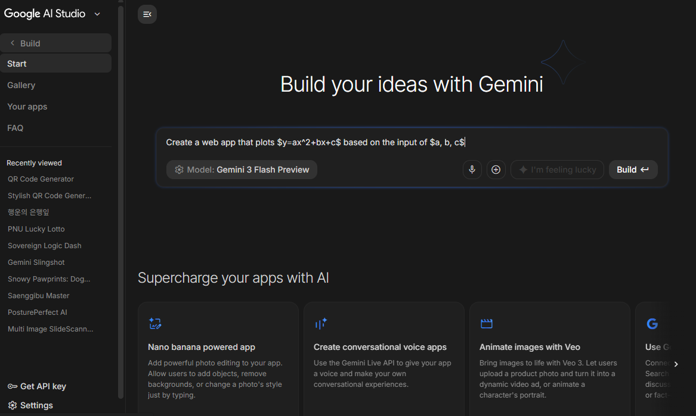
Google AI Studio

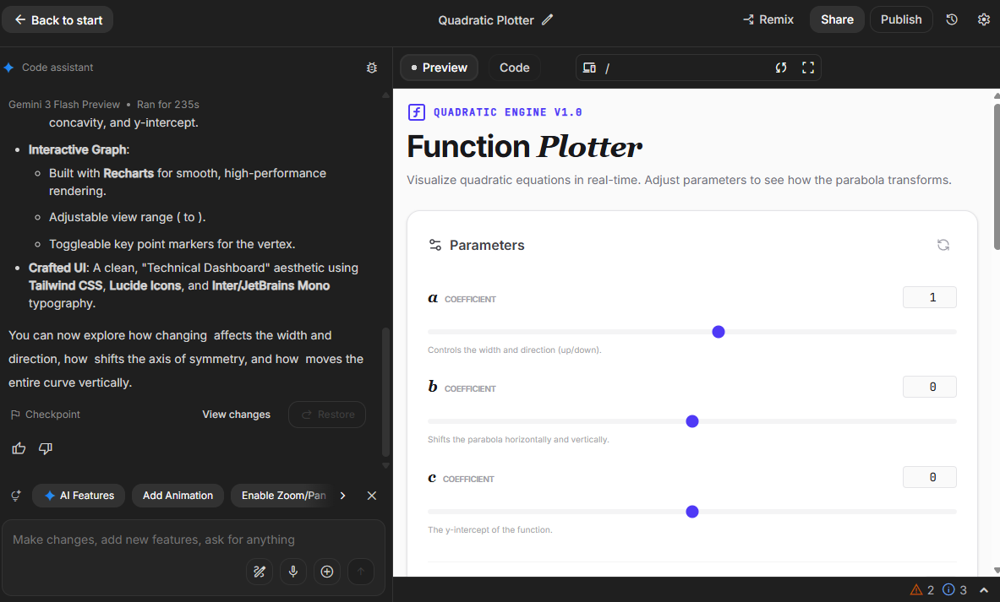
Web App UI created by Gemini

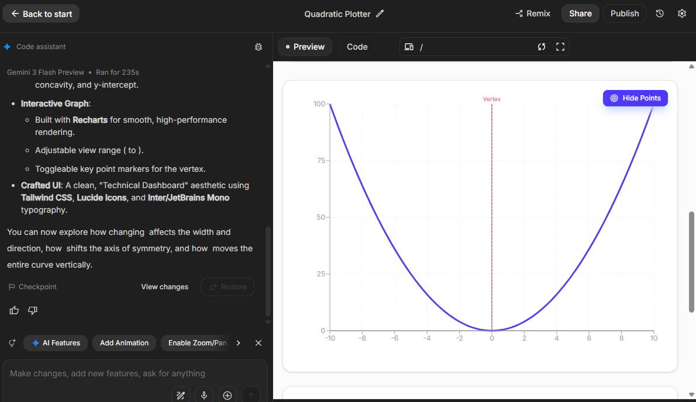
Web App UI created by Gemini

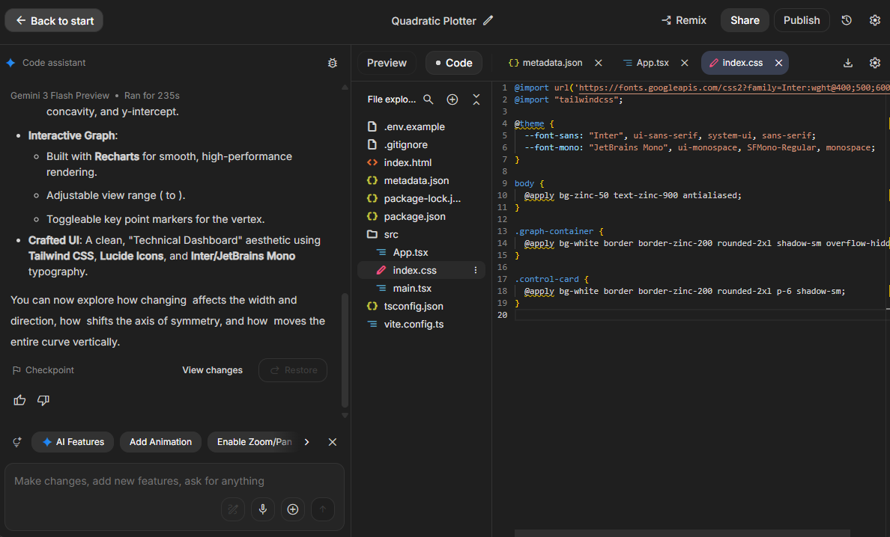
Web App Code created by Gemini
=====

## Slide: Google AI Studio
- type: practice
- title: How to get Google API Key
- subtitle: Get API Key from Google AI Studio to run the code locally

> 📚 [Google AI Studio](https://aistudio.google.com/)

1. Visit Google AI Studio (https://aistudio.google.com/)
2. Log in with your Google account
3. Click "Get API Key" button on the top right corner
4. Click "Create API Key" button
5. Click "Copy" button
6. Click "Done" button
7. Save the API Key in .env file as follows:
```text
GOOGLE_API_KEY=your_api_key
```
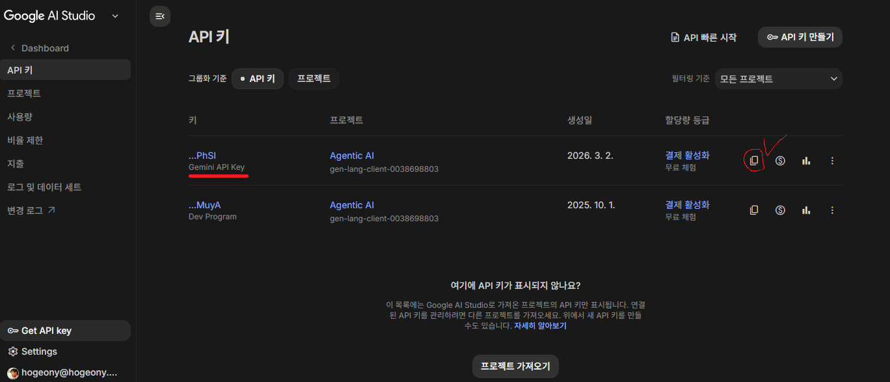
Get API Key

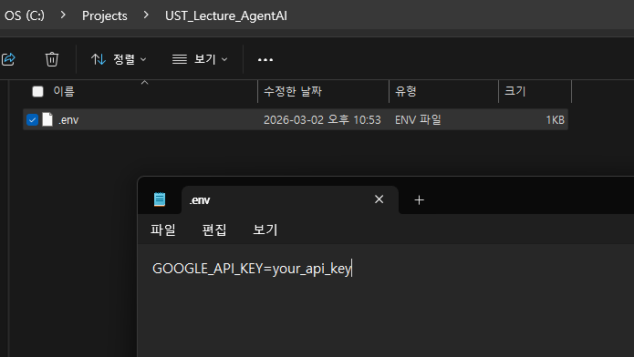
Save API Key

=====

## Slide: Local Environment Setup 1-1 (Windows)
- type: practice
- title: **Local Environment Setup (Windows) (1/3)**
- subtitle: Step 1. Python 3.12.10 Setup

1. Download **Python 3.12.10 - April 8, 2025** Windows installer (64-bit):
```text
https://www.python.org/downloads/windows/
```
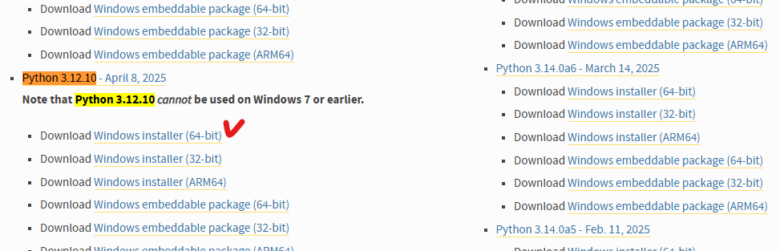Find Python 3.12.10 via Ctrl+F

🚨 **CRITICAL**: Check `Add python.exe to PATH` during installation.

2. Verify your installation in PowerShell or CMD:
```powershell
py -3.12 --version
py -m pip --version
```
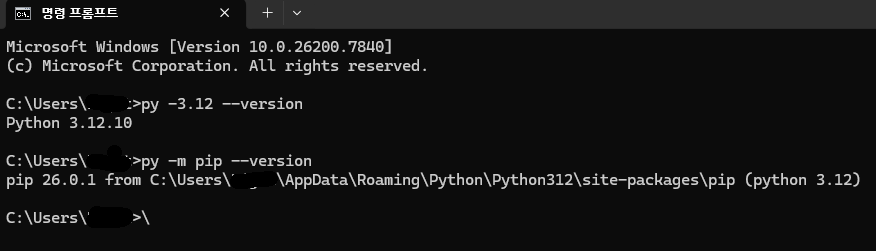
=====

## Slide: Local Environment Setup 1-2 (macOS)
- type: practice
- title: **Local Environment Setup (macOS) (1/3)**
- subtitle: Step 1. Python 3.12.10 Setup

1. Download **Python 3.12.10 - April 8, 2025** macOS 64-bit universal2 installer:
```text
https://www.python.org/downloads/macos/
```

2. Verify your installation in Terminal:
```bash
python3 --version
python3 -m pip --version
```

=====

## Slide: Local Environment Setup 1-3 (Ubuntu)
- type: practice
- title: **Local Environment Setup (Ubuntu) (1/3)**
- subtitle: Step 1. Python 3.12.10 (via pyenv)

Ubuntu OS depends on its default python3. Do **NOT** modify or replace it. Using `pyenv` is highly recommended.

```bash
# 1. Install pyenv dependencies
sudo apt update
sudo apt install -y build-essential curl git libssl-dev zlib1g-dev libbz2-dev libreadline-dev libsqlite3-dev libffi-dev liblzma-dev tk-dev

# 2. Install pyenv and Python 3.12.10
curl https://pyenv.run | bash
pyenv install 3.12.10
mkdir -p ~/UST_Lecture_AgenticAI && cd ~/UST_Lecture_AgenticAI
pyenv local 3.12.10
python --version
```

=====

## Slide: Virtual Environment Setup 2
- type: practice
- title: **Local Environment Setup (2/3)**
- subtitle: Step 2. Virtual Environment (venv)

We strongly recommend using `venv` to avoid package conflicts during the course.

**Windows (cmd):**
```cmd
cd C:\Study
mkdir UST_Lecture_AgenticAI
cd UST_Lecture_AgenticAI
py -3.12 -m venv .venv
.\.venv\Scripts\activate
python -m pip install -U pip
```

**macOS / Ubuntu:**
```bash
mkdir -p ~/UST_Lecture_AgenticAI
cd ~/UST_Lecture_AgenticAI
python3 -m venv .venv
source .venv/bin/activate
python -m pip install -U pip
```

=====

## Slide: Libraries & Agent IDE
- type: practice
- title: **Local Environment Setup (3/3)**
- subtitle: Step 3 & 4. Libraries and IDE (Antigravity)

**3. Install Basic Libraries (Data & Visualization Prep)**
```bash
python -m pip install numpy pandas matplotlib jupyter ipykernel
```

**4. Setup Antigravity IDE**
> 📚 [Antigravity](https://antigravity.google/)
Antigravity is Google's agent-first development platform.
- Download and install: `https://antigravity.google/download`
- Log in with your Google account.
- Open your `UST_Lecture_AgenticAI` folder.
- Follow instructions to verify `.venv` is recognized.
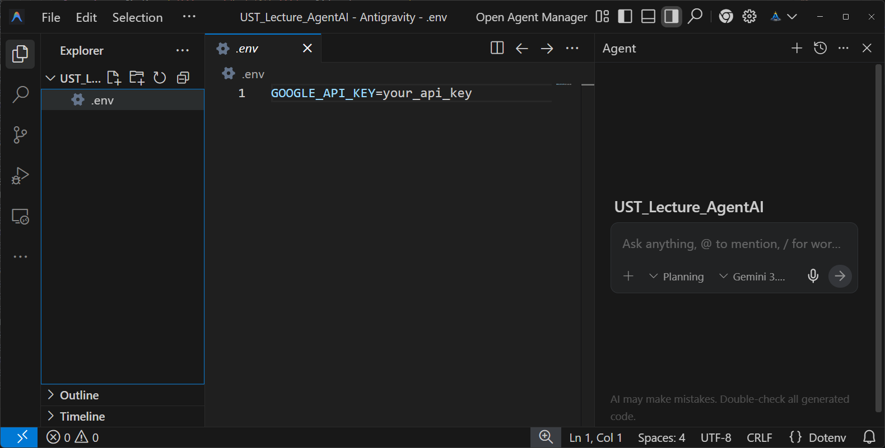
=====

## Slide: Your First Directed Agent
- type: card-single
- title: 🎯 **First Mission:** Your First Directed Agent
- subtitle: Direct Antigravity to write your first Python script.

- highlight-quote: "Activate venv, write `demo_basic.py` that plots $y=x^2$ using numpy/pandas/matplotlib, saves as `demo_basic.png`, and execute it."

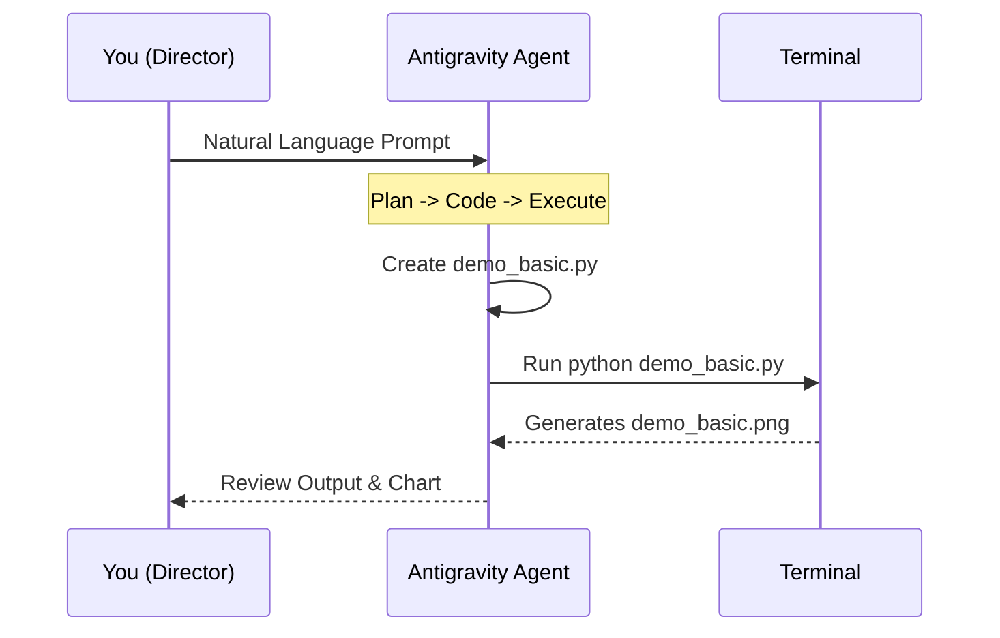
```mermaid
sequenceDiagram
    participant U as You (Director)
    participant A as Antigravity Agent
    participant T as Terminal
    U->>A: Natural Language Prompt
    Note over A: Plan -> Code -> Execute
    A->>A: Create demo_basic.py
    A->>T: Run python demo_basic.py
    T-->>A: Generates demo_basic.png
    A-->>U: Review Output & Chart
```
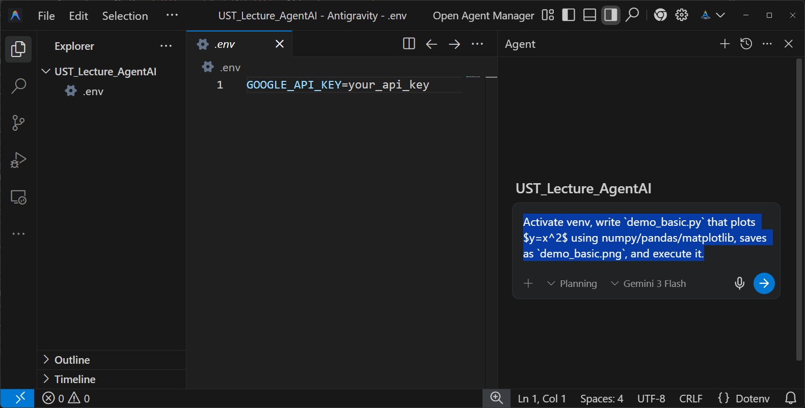
Antigravity IDE

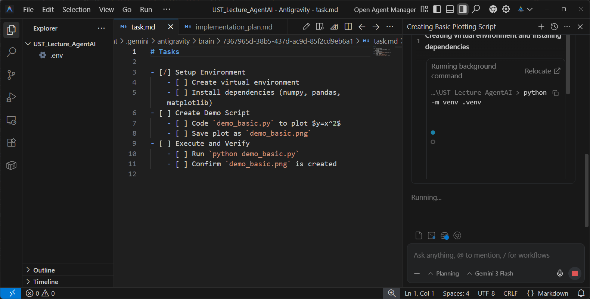
Ask Antigravity to create the code

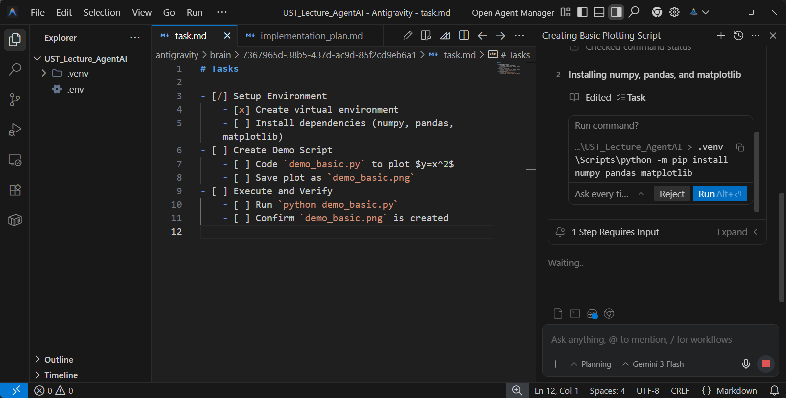
Approve the execution of Antigravity

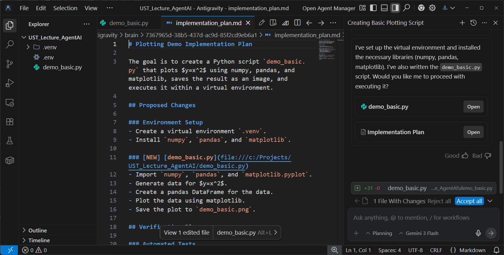
Final confirmation of the execution

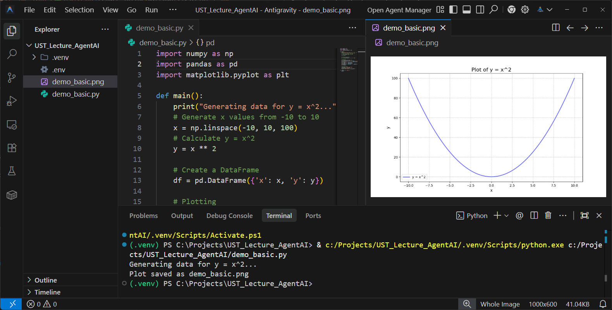
Created code and plot created by the code

=====

# Part 3: Discussion

## Slide: Discussion
- type: title
- title: Part 3: **Discussion**
- subtitle: Week 1 Is AI a research assistant or a crutch?

=====

## Slide: Discussion
- type: card-single
- title: 🗣️ Discussion
- subtitle: This Week's Topic

- highlight-quote: Is AI a research assistant or a crutch? Let's define the boundary!

**Action Required**: Go to `Week 1: ~` on UST LMS and let the debate begin!
> 📚 [UST LMS → This Course → Discussion → Week 1](https://class.ust.ac.kr/mod/forum/view.php?id=17610)
```mermaid
graph LR
    Step1[1. Go to Discussion Forum in UST LMS] --> Step2[2. Read AI Panel<br>Opinions: Iron Man, Captain America, Hulk]
    Step2 --> Step3[3. Vote with Reaction ("1,2", "3", or "None")]
    Step3 --> Step4[4. Reply with your<br>Stance & Rationale]
    style Step4 fill:#ffe082,stroke:#ffb300,stroke-width:2px
```

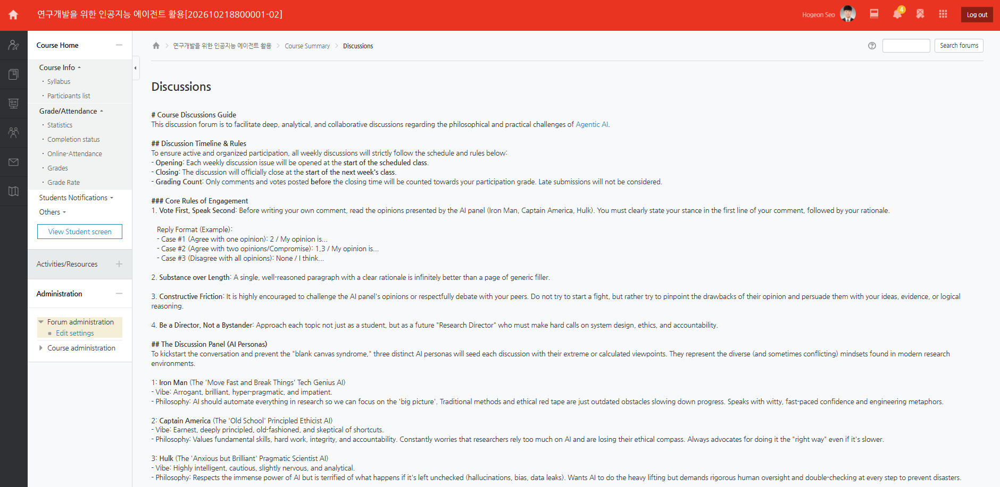
UST LMS → This Course → Discussion

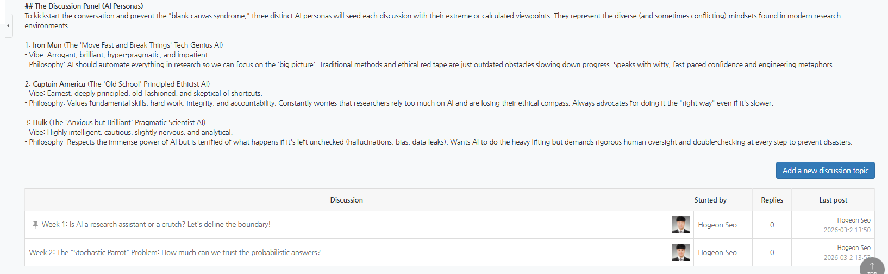
Week 1 Discussion

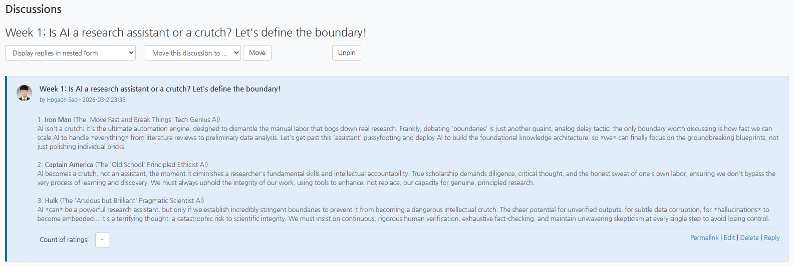
Dicussion Topic → Reply

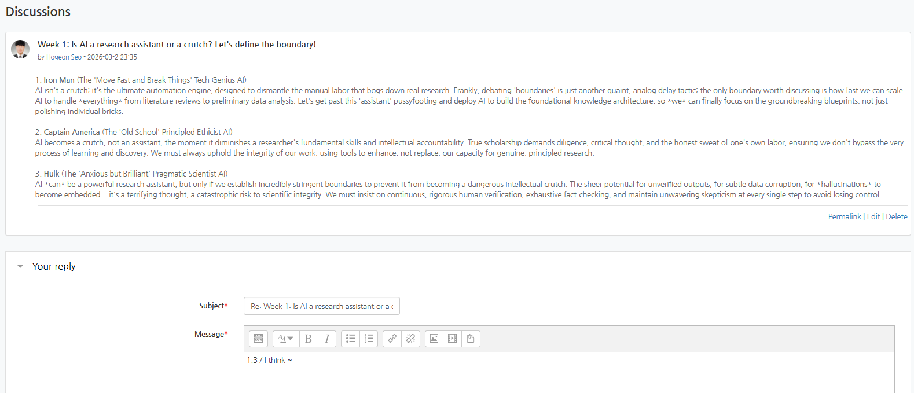
Reply format: the numbers of panels you agree / your opinion