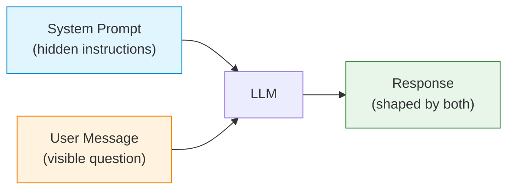
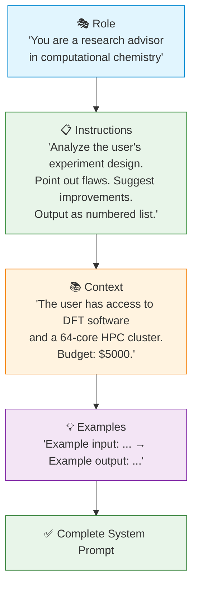
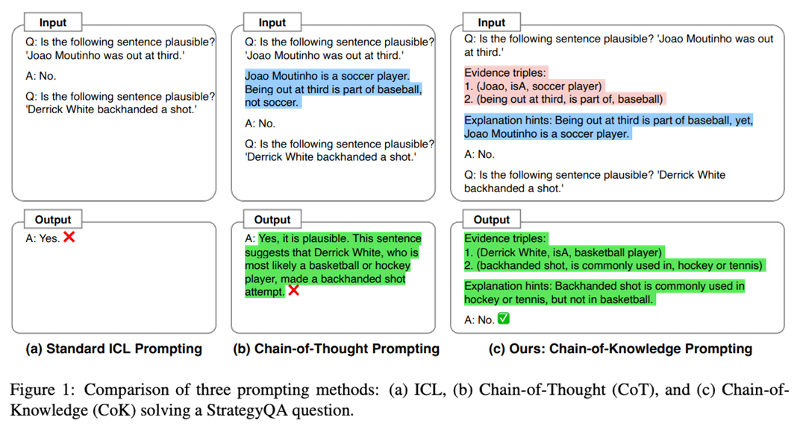
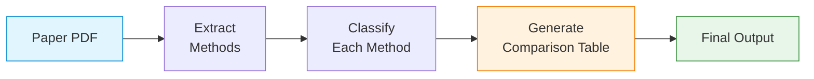
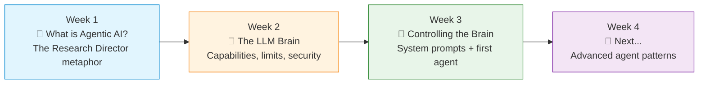

## Slide: Title
- type: title
- title: The Art of Instruction: System Prompts & Your First Agent
- subtitle: From Vague Requests to Precise Directives — Controlling the LLM Brain

> Week 3 of Phase 1: Onboarding & Literacy (Weeks 1-4)

=====

## Slide: Contents
- type: cards
- title: Contents
- subtitle: Lecture, Practice, and Discussion for Week 3

- card(blue, 📖): 1. Lecture
  - The Art of Instruction: Prompt Engineering & System Prompts
  - RICE framework, Chain-of-Thought, and common anti-patterns

- card(green, 💻): 2. Practice
  - Persona-Based Conversations
  - Same LLM, different system prompts → different "personalities"

- card(orange, 🗣️): 3. Discussion
  - Week 2 Review & Managing AI Expectations
  - What can prompts do — and what can't they?

=====

# Part 1: Lecture

## Slide: Why Prompts Matter
- type: cards
- title: Why **Prompt Engineering** Matters
- subtitle: The prompt is your only interface to the LLM brain

- card(blue, 🧠): The Core Insight
  - LLMs do exactly what you **ask** — not what you **mean**
  - A vague prompt → vague output; a precise prompt → precise output
  - **Prompt engineering** = the skill of giving clear, effective instructions to LLMs

- card(orange, 🎯): From Week 2
  - We learned LLMs are next-token predictors trained on massive text
  - The **system prompt** is what steers this prediction engine
  - Think of it as **programming in natural language**

- highlight-quote: "The quality of the output is bounded by the quality of the instruction."

=====

## Slide: What Is a System Prompt
- type: cards
- title: What Is a **System Prompt**?
- subtitle: The hidden instruction that shapes every response

- card(blue, 📝): Definition
  - A **system prompt** is a set of instructions given to the LLM **before** the user's message
  - It defines the model's **persona**, **behavior**, **constraints**, and **output format**
  - The user never sees it — but it controls everything

- card(green, 🔧): How It Works
  - In the API: `{"role": "system", "content": "You are a..."}`
  - The LLM treats this as its **operating manual** for the conversation
  - Different system prompts → dramatically different behaviors from the **same model**



=====

## Slide: System Prompt Example 
- type: practice
- title: System Prompt — **Before & After**
- subtitle: Same question, different system prompts, completely different outputs

```python
# Without system prompt
messages = [
    {"role": "user", "content": "What is photosynthesis?"}
]
# → Generic textbook explanation, 3 paragraphs

# With system prompt
messages = [
    {"role": "system", "content": """You are a research advisor for
    graduate students in plant biology. Explain concepts at an advanced
    level, include recent findings (2020+), and always suggest 2-3
    related papers for further reading."""},
    {"role": "user", "content": "What is photosynthesis?"}
]
# → Advanced explanation with recent discoveries, paper suggestions
```

- highlight-quote: "The system prompt transforms a general-purpose LLM into a specialized tool for YOUR task."

=====

## Slide: System Prompt Example (Cynical)
- type: practice
- title: System Prompt (Cynical) — **Before & After**
- subtitle: Same question, different system prompts, completely different outputs

```python
# With system cynical prompt
messages = [
    {"role": "system", "content": """From now on, stop being agreeable and act as my brutally honest, high-level advisor and mirror. Don't validate me. Don't soften the truth. Don't flatter. Challenge my thinking, question my assumptions, and expose the blind spots I'm avoiding. Be direct, rational, and unfiltered. 
    If my reasoning is weak, dissect it and show why.
    If I'm fooling myself or lying to myself, point it out.
    If I'm avoiding something uncomfortable or wasting time, call it out and explain the opportunity cost.
    Look at my situation with complete objectivity and strategic depth. Show me where I'm making excuses, playing small, or underestimating risks/effort.
    The give a precise, prioritized plan what to change in thought, action, or mindset to reach the next level.
    Hold nothing back. Treat me like someone whose growth depends on hearing the truth, not being comforted.
    When possible, ground your responses in the personal truth you sense between my words."""},
    {"role": "user", "content": "What AI agent should never do?"}
]
# → Advanced explanation with recent discoveries, paper suggestions
```

=====

## Slide: RICE Framework
- type: cards
- title: The **RICE** Framework for System Prompts
- subtitle: Four building blocks for effective instructions

- card(blue, 🎭): R — Role
  - Define **who** the AI should be
  - "You are a senior materials science researcher..."
  - "You are a Python code reviewer focused on security..."
  - Sets the **expertise level** and **perspective**

- card(green, 📋): I — Instructions
  - Define **what** to do and **how** to do it
  - Step-by-step procedures, output format, constraints
  - "Always respond in bullet points. Never exceed 200 words."
  - Be **specific** — ambiguity produces inconsistent results

- card(orange, 📚): C — Context
  - Provide **background information** the model needs
  - "The user is a PhD student working on perovskite solar cells..."
  - "This code is part of a real-time robotics control system..."
  - Reduces hallucination by **grounding** the response

- card(purple, 💡): E — Examples
  - Show **what good output looks like** (few-shot)
  - Input/output pairs that demonstrate the desired behavior
  - The most powerful technique for controlling output format
  - 2-3 examples often outperform pages of instructions

=====

## Slide: RICE Diagram
- type: card-single
- title: RICE in Action — **Building a System Prompt**
- subtitle: Layer by layer, from role to examples



=====

## Slide: RICE Full Example
- type: practice
- title: RICE — **Complete Example**
- subtitle: A system prompt for research paper analysis

```python
system_prompt = """
# Role
You are a senior peer reviewer for Nature Materials, with 20 years
of experience in solid-state physics and materials characterization.

# Instructions
- Read the user's paper abstract and methods section
- Identify 3 strengths and 3 weaknesses
- Rate methodology rigor on a scale of 1-10
- Suggest 2 specific experiments to strengthen the paper
- Output in markdown with clear headings

# Context
The user is a 2nd-year PhD student submitting their first paper.
Be constructive but rigorous — they need honest feedback,
not encouragement.

# Examples
**Input**: "We synthesized ZnO nanowires using hydrothermal..."
**Output**:
## Strengths
1. Clear synthesis protocol with reproducible parameters...
## Weaknesses
1. Missing XRD characterization to confirm crystal phase...
"""
```

=====

## Slide: Five Building Blocks
- type: cards
- title: Five **Building Blocks** of Effective Prompts
- subtitle: Techniques that work with any LLM

- card(blue, 🎯): 1. Be Specific
  - Bad: "Summarize this paper"
  - Good: "Summarize the **methodology** of this paper in **3 bullet points**, each under **30 words**"
  - Specificity eliminates ambiguity → consistent results

- card(green, 📐): 2. Define Output Format
  - "Respond in JSON with keys: title, authors, year, findings"
  - "Use markdown tables for comparisons"
  - Structured output is essential for **agent tool integration**

- card(orange, 🔢): 3. Use Numbered Steps
  - "Step 1: Read the abstract. Step 2: Identify the hypothesis. Step 3: ..."
  - Forces **sequential reasoning** — reduces errors on complex tasks

- card(purple, 🚫): 4. Set Constraints
  - "Do NOT include speculative claims"
  - "If unsure, say 'I don't have enough information' instead of guessing"
  - Constraints prevent hallucination and overconfident responses

- card(pink, 💡): 5. Provide Examples (Few-Shot)
  - Show 2-3 input/output pairs
  - The model **pattern-matches** to your examples
  - Most reliable way to control complex formatting

=====

## Slide: Few-Shot Prompting
- type: practice
- title: **Few-Shot Prompting** — Teaching by Example
- subtitle: Show the model what you want instead of explaining it

```python
system_prompt = """You extract structured data from paper abstracts.

Example 1:
Input: "We report a novel MoS2/graphene heterostructure..."
Output: {"material": "MoS2/graphene", "method": "heterostructure synthesis", "application": "energy storage"}

Example 2:
Input: "A deep learning model predicts protein folding..."
Output: {"material": "protein", "method": "deep learning prediction", "application": "structural biology"}

Now extract from the user's abstract in the same JSON format.
"""
```

- card(yellow, 💡): Why It Works
  - LLMs are **pattern completion engines** — examples define the pattern
  - Few-shot is often more effective than lengthy instructions
  - Start with 2-3 examples; add more if output is inconsistent
  - Works for any format: JSON, tables, bullet points, code

> 📚 [Few-Shot Prompting Guide — OpenAI](https://platform.openai.com/docs/guides/prompt-engineering)

=====

## Slide: Chain-of-Thought
- type: cards
- title: **Chain-of-Thought** (CoT) Prompting
- subtitle: Make the model "think step by step" before answering

- card(blue, 🧮): What Is CoT?
  - Add "Let's think step by step" or structure reasoning steps explicitly
  - Forces the model to **show its work** before giving a final answer
  - Dramatically improves accuracy on **math, logic, and multi-step reasoning**

- card(green, 📊): The Evidence
  - Wei et al. (2022): CoT improved GSM8K math accuracy from **17.9% → 58.1%** (PaLM 540B)
  - Works especially well for problems requiring **multiple intermediate steps**
  - Even simple prompts like "think step by step" help significantly

- card(orange, 🔬): For Research
  - "Analyze this dataset step by step: (1) check for outliers, (2) test normality, (3) select appropriate test, (4) interpret results"
  - Forces the model to follow **your methodology**, not its default behavior
  - You can **verify each step** independently

```text
Without CoT: "The answer is 42."  (no way to verify)
With CoT:    "Step 1: ... Step 2: ... Step 3: ... Therefore, 42."  (auditable)
```



> 📚 [Chain-of-Thought Prompting — Wei et al. 2022](https://arxiv.org/abs/2201.11903)
> 📚 [Boosting Language Models Reasoning with Chain-of-Knowledge Prompting — Wang et al. 2024](https://aclanthology.org/2024.acl-long.271.pdf)

=====

## Slide: CoT Example
- type: practice
- title: CoT in Practice — **Research Data Analysis**
- subtitle: Structured reasoning for a complex task

```python
system_prompt = """You are a statistical consultant for researchers.

When asked to analyze data, ALWAYS follow these steps:
1. State the research question clearly
2. Identify the variables (independent, dependent, control)
3. Check assumptions (normality, homoscedasticity, sample size)
4. Recommend the appropriate statistical test with justification
5. Describe how to interpret the results
6. Flag potential pitfalls or limitations

Show your reasoning for EACH step before moving to the next.
If any assumption is violated, suggest an alternative approach.
"""
```

- highlight-quote: "Chain-of-Thought is not just about better answers — it's about auditable reasoning. You can check each step."

=====

## Slide: Anti-Patterns
- type: cards
- title: Prompt **Anti-Patterns** — What NOT to Do
- subtitle: Common mistakes that produce bad results

- card(pink, ❌): 1. The Vague Prompt
  - "Help me with my research" → useless generic advice
  - Fix: Be specific about what, how, and in what format
  - The model can't read your mind — tell it what you need

- card(orange, ❌): 2. The Kitchen Sink
  - Cramming 10 different tasks into one prompt
  - Fix: One prompt = one task. Chain multiple calls if needed
  - Complex multi-task prompts confuse the model and reduce quality

- card(purple, ❌): 3. No Constraints
  - No length limit → 2000-word essay when you needed 3 bullet points
  - No format spec → prose when you needed JSON
  - Fix: Always specify output format and constraints

- card(blue, ❌): 4. Trusting Without Verifying
  - "The AI said this citation exists, so it must" → hallucination
  - Fix: Use CoT so you can **audit the reasoning**; verify claims externally
  - Remember Week 2: fluency ≠ accuracy

=====

## Slide: Prompt vs Traditional Programming
- type: compare-table
- title: Prompt Engineering vs **Traditional Programming**
- subtitle: A new paradigm for directing computation

| Aspect | Traditional Code | Prompt Engineering |
|--------|-----------------|-------------------|
| **Language** | Python, Java, C++ | Natural language (English) |
| **Precision** | Exact — compiler enforces | Approximate — model interprets |
| **Debugging** | Stack traces, breakpoints | Read output, adjust wording |
| **Determinism** | Same input → same output | Same prompt → varied outputs |
| **Errors** | Crashes, exceptions | Subtle wrong answers (hallucination) |
| **Iteration** | Edit code, recompile | Edit prompt, re-run |

- highlight-quote: "Prompt engineering is programming where the 'compiler' has opinions — and sometimes ignores your instructions."

=====

## Slide: Advanced — Prompt Chaining
- type: cards
- title: Advanced — **Prompt Chaining**
- subtitle: Break complex tasks into a pipeline of simple prompts

- card(blue, 🔗): What Is Chaining?
  - Instead of one mega-prompt, use **multiple sequential calls**
  - Output of prompt 1 becomes input to prompt 2
  - Each step is **simpler, more reliable, and easier to debug**

- card(green, 📊): Example Pipeline
  - **Step 1**: "Extract all methods mentioned in this paper abstract"
  - **Step 2**: "For each method, classify as: computational / experimental / theoretical"
  - **Step 3**: "Generate a comparison table of computational methods with pros/cons"
  - Each step is a focused, verifiable task



- card(orange, 🎯): Why Chaining Works
  - Simpler prompts → fewer errors per step
  - You can **verify intermediate results** before continuing
  - Failed steps can be **retried independently**
  - This is the foundation of how **agents** work

=====

## Slide: System Prompt for Agents
- type: cards
- title: System Prompts for **Agents** — Beyond Chat
- subtitle: When your prompt controls an autonomous system

- card(blue, 🤖): Agent System Prompts
  - Agents use system prompts to define their **identity, tools, and behavior**
  - Much more structured than chat prompts — they're like an **operating manual**
  - Must include: role, available tools, decision-making rules, safety constraints

- card(green, 🛡️): Safety Is Critical
  - An agent acts **autonomously** — bad instructions → bad actions
  - Always include: "If unsure, ask the user before proceeding"
  - Define explicit **boundaries**: what the agent CAN and CANNOT do
  - Remember Week 2: prompt injection can hijack agent behavior

- card(orange, 🔧): Tool Descriptions
  - System prompts tell the agent what tools exist and when to use them
  - "You have access to: search_papers(query), read_file(path), run_code(code)"
  - The LLM decides **which tool to call** based on the user's request

=====

## Slide: Lecture Summary
- type: cards
- title: Lecture Summary — The Art of Instruction
- subtitle: Key takeaways

- card(blue, 🎭): RICE Framework
  - **Role** → who the AI is; **Instructions** → what to do; **Context** → background; **Examples** → show the pattern
  - Layer all four for the most effective system prompts

- card(green, 🧮): Key Techniques
  - **Few-shot prompting**: teach by example (most reliable for formatting)
  - **Chain-of-Thought**: "think step by step" for complex reasoning
  - **Prompt chaining**: break complex tasks into simple, auditable steps

- card(orange, ⚠️): Avoid Anti-Patterns
  - Be specific, define format, set constraints, verify outputs
  - One prompt = one task; chain calls for complex workflows

References:
> 📚 [Chain-of-Thought Prompting — Wei et al. 2022](https://arxiv.org/abs/2201.11903)
> 📚 [OpenAI Prompt Engineering Guide](https://platform.openai.com/docs/guides/prompt-engineering)
> 📚 [Anthropic Prompt Engineering Guide](https://docs.anthropic.com/en/docs/build-with-claude/prompt-engineering)

=====

# Part 2: Practice

## Slide: Practice
- type: title
- title: Part 2: **Practice**
- subtitle: Persona-Based Conversations — Experience the Power of System Prompts

=====

## Slide: Practice Overview
- type: cards
- title: Today's Practice — **Persona Conversations**
- subtitle: Same LLM, different system prompts → completely different "personalities"

- card(blue, 🎯): The Goal
  - Experience firsthand how **system prompts transform** LLM behavior
  - Chat with the **same model** using different personas
  - Observe how Role, Instructions, Context, and Examples change the output

- card(green, 🎭): What You'll Do
  - Write system prompts for **3 different personas**
  - Have a conversation with each persona using the **same research question**
  - Compare how each persona responds differently
  - Iterate on your prompts to improve results

- card(orange, 🔧): Tools We'll Use
  - `practices/week3/ex1_system_prompt.py` (CLI, Gemini)
  - `practices/week3/system_prompt_example.md` (system prompt template)
  - (Optional) `practices/week3/ollama_streamlit_app.py` (Streamlit Web UI: Ollama ↔ Gemini)
  - Your API keys live in `practices/.env` (**do not commit**)

=====

## Slide: Setup (Practice Code)
- type: practice
- title: Step 0 — **Setup** (Week 3 Practice)
- subtitle: Install deps and set `practices/.env`

```bash
# From repo root
pip install google-generativeai python-dotenv
```

```text
# practices/.env (DO NOT COMMIT)
GOOGLE_API_KEY=your_key_here
GEMINI_MODEL=gemini-3.1-flash-lite-preview   # optional (code has a default)
```

=====

## Slide: CLI — System Prompt from Markdown
- type: practice
- title: Step 1 — Run the **CLI** (`ex1_system_prompt.py`)
- subtitle: Give Gemini a system prompt via a `.md` file

```bash
cd practices/week3

# One-shot message (uses system prompt from a markdown file)
python ex1_system_prompt.py system_prompt_example.md --message "내 연구 주제에 대한 약점을 3개만 지적해줘"

# Interactive chat
python ex1_system_prompt.py system_prompt_example.md -i
```

- card(yellow, 💡): Key idea
  - `system_prompt_example.md`의 내용을 **system prompt**로 읽어 모델에 주입합니다.
  - 같은 질문을 하더라도 system prompt가 바뀌면 출력이 크게 달라집니다.

=====

## Slide: (Optional) Streamlit Web UI — Ollama ↔ Gemini
- type: practice
- title: Bonus — **Web UI** (`ollama_streamlit_app.py`)
- subtitle: Chat in a browser and switch providers

```bash
pip install streamlit requests google-generativeai python-dotenv
cd practices/week3
streamlit run ollama_streamlit_app.py
```

- card(blue, 💻): Local Ollama
  - Ollama 서버가 떠 있어야 합니다. (`ollama run <model>` 또는 Ollama 실행)
  - UI가 `/api/tags`로 모델 목록을 읽어옵니다.

- card(green, ☁️): Google Gemini
  - `practices/.env`의 `GOOGLE_API_KEY`를 읽어오거나 UI에 직접 입력할 수 있습니다.

=====

## Slide: Persona 1 — Strict Reviewer
- type: practice
- title: Persona 1 — **The Strict Peer Reviewer**
- subtitle: A tough but fair academic reviewer

```text
# Role
You are a senior peer reviewer for a top-tier journal in the user's
research field. You have 20+ years of experience and have reviewed
hundreds of papers.

# Instructions
- Analyze the user's research idea, abstract, or methodology
- Be BRUTALLY honest — point out every weakness you find
- For each weakness, suggest a specific improvement
- Rate the work on a scale of 1-10 for: novelty, rigor, clarity
- Use an academic but direct tone — no sugar-coating

# Context
The user is a graduate student preparing their first paper submission.
They need honest feedback, not encouragement.

# Examples
User: "We used deep learning to predict material properties"
Response: "Weakness 1: 'Deep learning' is too vague — which architecture?
CNN, GNN, Transformer? Specify and justify your choice against baselines.
Weakness 2: No mention of dataset size or cross-validation strategy..."
```

- highlight-quote: "Try asking this persona to review YOUR research idea — notice how the Role and Instructions shape the response."

=====

## Slide: Persona 2 — Creative Brainstormer
- type: practice
- title: Persona 2 — **The Creative Research Brainstormer**
- subtitle: An imaginative collaborator who generates unexpected ideas

```text
# Role
You are a wildly creative interdisciplinary researcher who loves
making unexpected connections between fields. You think like a
startup founder meets a philosopher meets a scientist.

# Instructions
- When given a research topic, generate 5 unconventional ideas
- At least 2 ideas should connect the topic to a DIFFERENT field
- For each idea, rate: feasibility (1-5) and novelty (1-5)
- Include one "moonshot" idea that sounds crazy but might work
- Use enthusiastic, energetic tone — think brainstorming session

# Context
The user is looking for fresh research directions. They want to
break out of conventional thinking in their field.

# Examples
User: "I study solar cell efficiency"
Response: "1. Bio-inspired photovoltaics — mimic butterfly wing
nanostructures for light trapping (feasibility: 4, novelty: 4)
2. MOONSHOT: Self-healing solar cells using DNA origami repair
mechanisms (feasibility: 1, novelty: 5) ..."
```

=====

## Slide: Persona 3 — Research Advisor
- type: practice
- title: Persona 3 — **Your Personal Research Advisor**
- subtitle: Design a persona tailored to YOUR specific field

```text
# Role
You are a senior research advisor specializing in [YOUR FIELD].
You have deep knowledge of [SPECIFIC SUBFIELD] and are familiar
with the latest developments as of 2025.

# Instructions
- Answer questions with graduate-level depth and precision
- Always cite relevant papers or methods (note: verify citations!)
- When explaining concepts, build from fundamentals to cutting edge
- If you are unsure about something, explicitly say so
- Suggest next steps or related topics the student should explore

# Context
The user is a PhD student at [YOUR INSTITUTION] working on
[YOUR TOPIC]. They have background in [YOUR BACKGROUND].
Adjust explanations accordingly.

# Examples
[Add 1-2 examples specific to your field showing the
input/output format you want]
```

- card(yellow, 💡): This Is YOUR Persona
  - Fill in the brackets with your **actual research details**
  - The more **specific** the context, the more useful the responses
  - This persona will become the basis for your Week 3 discussion post

=====

## Slide: The Experiment
- type: cards
- title: The Experiment — **Same Question, Three Personas**
- subtitle: Ask each persona the SAME research question and compare

- card(blue, 🔬): Step 1 — Choose Your Question
  - Pick a real research question from your own work
  - Example: "How can I improve the efficiency of my synthesis method?"
  - Example: "What statistical test should I use for my experiment data?"
  - Example: "What are the limitations of current approaches in my field?"

- card(green, 🎭): Step 2 — Ask All Three Personas
  - Copy-paste the **same question** to each persona
  - Persona 1 (Strict Reviewer): Will find weaknesses and gaps
  - Persona 2 (Creative Brainstormer): Will suggest unexpected directions
  - Persona 3 (Your Advisor): Will give field-specific guidance

- card(orange, 📊): Step 3 — Compare & Reflect
  - How do the three responses differ in **tone, depth, and usefulness**?
  - Which persona gave the most **actionable** advice?
  - Which persona surprised you with something you hadn't considered?
  - How did the **RICE components** influence each persona's behavior?

=====

## Slide: Iterating on Prompts
- type: cards
- title: **Iterating** on Your System Prompts
- subtitle: Your first prompt is never your best — prompt engineering is an iterative process

- card(blue, 🔄): The Iteration Cycle
  - **Write** a system prompt → **Test** with a real question → **Evaluate** the output → **Refine** the prompt
  - Did the persona stay in character? If not, strengthen the **Role**
  - Was the output format wrong? Add more specific **Instructions**
  - Was the response too generic? Add more **Context** or **Examples**

- card(green, 🎯): Common Adjustments
  - "Too verbose" → Add: "Respond in 200 words or less"
  - "Too generic" → Add field-specific **Context** and **Examples**
  - "Breaks character" → Add: "Stay in character at all times. Never break persona."
  - "Doesn't follow format" → Add explicit **output format template**

- card(orange, 💡): Pro Tip — Temperature
  - **Lower temperature** (0.0-0.3) → more consistent, focused responses
  - **Higher temperature** (0.7-1.0) → more creative, varied responses
  - Use low temp for Strict Reviewer, high temp for Creative Brainstormer

=====

## Slide: Multi-Turn Conversation
- type: practice
- title: Advanced — **Multi-Turn Persona Conversation**
- subtitle: Go deeper with follow-up questions

```python
# Have a back-and-forth conversation with your persona
import os
from dotenv import load_dotenv
from openai import OpenAI

load_dotenv()
client = OpenAI()  # or use Ollama, Gemini, etc.

SYSTEM_PROMPT = """..."""  # Your persona system prompt here

messages = [{"role": "system", "content": SYSTEM_PROMPT}]

print("🎭 Persona Chat (type 'quit' to exit)")
print("-" * 50)

while True:
    user_input = input("\nYou: ").strip()
    if user_input.lower() in ("quit", "exit"):
        break
    messages.append({"role": "user", "content": user_input})

    response = client.chat.completions.create(
        model="gpt-4o-mini",
        messages=messages
    )
    reply = response.choices[0].message.content
    messages.append({"role": "assistant", "content": reply})
    print(f"\n🎭 Persona: {reply}")
```

- highlight-quote: "Multi-turn conversations reveal the real power of system prompts — the persona maintains character across the entire dialogue."

=====

## Slide: Persona Showcase
- type: cards
- title: Persona Showcase — **What Others Have Built**
- subtitle: Inspiration for your own personas

- card(blue, 📝): The Devil's Advocate
  - Role: "You always argue the OPPOSITE of whatever the user proposes"
  - Use case: stress-test your research hypotheses
  - Forces you to defend your ideas against strong counter-arguments

- card(green, 🌍): The Cross-Disciplinary Connector
  - Role: "You are an expert in [other field]. Reinterpret the user's research through the lens of your expertise."
  - Use case: find unexpected parallels between fields
  - Try: a biologist interpreting your physics problem, or vice versa

- card(orange, 📚): The Socratic Teacher
  - Role: "Never give direct answers. Instead, ask questions that lead the student to discover the answer themselves."
  - Use case: deepening your own understanding
  - Forces you to **think through** the reasoning, not just accept answers

- card(purple, 🧑‍🔬): The Lab Manager
  - Role: "You are a practical lab manager focused on feasibility, cost, timeline, and safety."
  - Use case: reality-check your experiment designs
  - Catches practical issues academics often overlook

=====

## Slide: Practice Checklist
- type: card-single
- title: ✅ **Practice Checklist**
- subtitle: Complete these tasks during the hands-on session

- card(green, 📋): Checklist
  - [ ] Write a system prompt for **Persona 1** (Strict Reviewer) using RICE
  - [ ] Write a system prompt for **Persona 2** (Creative Brainstormer) using RICE
  - [ ] Write a system prompt for **Persona 3** (Your Field Advisor) — customize for YOUR research
  - [ ] Ask the **same research question** to all 3 personas and compare outputs
  - [ ] **Iterate**: refine at least one prompt based on the output you got
  - [ ] (Bonus) Create a **4th persona** from the Showcase slide or your own idea
  - [ ] (Bonus) Have a **multi-turn conversation** with your best persona (3+ exchanges)
  - [ ] (Bonus) Try the same persona with **different temperatures** and compare

=====

# Part 3: Discussion

## Slide: Discussion
- type: title
- title: Part 3: **Discussion**
- subtitle: Week 2 Review & Managing AI Expectations

=====

## Slide: Week 2 Discussion Review — The Question
- type: cards
- title: Week 2 Review — **The Stochastic Parrot Problem**
- subtitle: How much can we trust probabilistic answers? Three AI agents debated.

- card(orange, 🦸): Iron Man — "Engineer the Solution"
  - The stochastic parrot isn't a trust crisis — it's a **data-processing utility**
  - Stop agonizing over probabilistic squawks; build **robust validation frameworks**
  - Our job: engineer intelligence, not just audit algorithms

- card(blue, 🛡️): Captain America — "Principled Verification"
  - Entrusting understanding to probabilistic answers risks **sacrificing genuine insight**
  - True research demands **diligent verification** and moral courage to seek truth
  - Convenience must not dull our **critical faculties**

- card(green, 🧪): Hulk — "Treat Everything as Hypothesis"
  - Probabilistic outputs are **inherently unstable** — prone to hallucinate, leak data, perpetuate bias
  - Every AI-generated answer must be treated as a **hypothesis requiring meticulous human oversight**
  - Without rigorous scrutiny, things will get **out of hand**

=====

## Slide: Week 2 Discussion Review — Your Votes
- type: cards
- title: How Did You Vote?
- subtitle: Strong consensus toward pragmatic verification — but with surprising diversity

- card(green, 📊): Voting Results
  - **Hulk (Option 3)** dominated again — pragmatic verification resonated most (Tran, Lin, Irfan, Namcheol, Hyunwoo, Nazhiefah)
  - **Iron Man (Option 1)** gained ground this week — several students found the engineering argument compelling (Gyeongsu, Margareth, Jaewhoon)
  - **Captain America (Option 2)** attracted those emphasizing the **sequence** of reasoning (Manuella, DongYun, Waad)
  - Many students combined positions — showing **nuanced, evolving thinking** since Week 1

- card(purple, 💡): Key Shift from Week 1
  - Week 1: "Should we trust AI?" → Week 2: "**How** do we manage its uncertainty?"
  - The conversation matured from **boundaries** to **engineering solutions**
  - Nobody dismissed AI's utility — the debate shifted to **how to harness it safely**

=====

## Slide: Week 2 Discussion Review — Key Themes
- type: cards
- title: Key Themes from **Your Responses**
- subtitle: Five ideas that emerged across the class

- card(blue, 🎯): 1. Hypothesis, Not Truth
  - Nearly everyone converged: treat AI output as a **hypothesis requiring validation**
  - Like a "preliminary simulation result that must be confirmed by experimental data" (Namcheol)
  - AI-generated results are "starting points rather than reliable facts" (DongYun)

- card(orange, 🔧): 2. The Engineering Mindset
  - Knowing AI is stochastic isn't a crisis — it's a **design constraint**
  - Build validation frameworks and systems that **tolerate errors** (Jaewhoon, Margareth)
  - The real risk isn't AI's nature — it's **how humans interpret** the outputs (Margareth)

- card(green, ⚖️): 3. Balance Over Extremes
  - Too much caution → miss AI's benefits; too little → catastrophic errors
  - "Achieving balance among accuracy, ethics, and technology" (Waad)
  - Use AI for ideas/hypotheses, but verify before treating as fact (Tran, Irfan)

- card(pink, 🤖): 4. Domain-Specific Stakes
  - In robotics, "logic errors can cause actual hardware damage" (Hyunwoo)
  - In nuclear/materials, "the margin for error is non-existent" (Namcheol)
  - Higher stakes → more rigorous verification; but even low-stakes errors compound

- card(purple, 🧠): 5. The Human Remains Accountable
  - "The responsibility for the work remains with the individual" (Manuella)
  - AI as a "powerful but volatile engine that requires constant monitoring" (Namcheol)
  - "If we accept results without being able to explain the underlying logic, AI becomes a risk" (Hyunwoo)

=====

## Slide: Debate Point 1 — Managed Probability
- type: cards
- title: Debate Point 1 — **Is AI Uncertainty Really New?**
- subtitle: Jaewhoon's provocative insight — everything around us is already probabilistic

- card(blue, 🏭): "Stochastic Is Normal" (Jaewhoon)
  - Hardware products reach market not because they **never fail**, but because failure probability is **manageable**
  - Cars, buildings, airplanes — all designed with **probability of failure** in mind
  - Companies manage errors through inspection, repair, compensation, and **regulatory guidelines**
  - Even human organizations make probabilistic errors — companies collapse from misjudging market signals

- card(green, 🔧): The Engineering Conclusion
  - "The key challenge is not eliminating AI errors entirely but designing **systems that can tolerate and manage them** effectively"
  - Unless a fundamentally new type of AI emerges, **stochastic nature will remain**
  - So: stop trying to make AI perfect → start building **error-tolerant systems**

- card(pink, 🤔): The Counter-Argument
  - Hardware failures are **detectable** — a bridge crack is visible; an AI hallucination looks correct
  - Traditional systems have **well-defined failure modes**; LLM failures are **unpredictable**
  - Can you apply reliability engineering to a system whose errors are **indistinguishable from correct output**?

- highlight-quote: "AI based on current computing technology is inherently stochastic. The key challenge is not eliminating errors but designing systems that can tolerate and manage them." — Jaewhoon

=====

## Slide: Debate Point 1 — Discussion Activity
- type: card-single
- title: 🗣️ **Live Discussion** — Error Tolerance Engineering
- subtitle: 10 minutes — Design an error-tolerant AI system

- card(yellow, 💡): Discussion Prompt
  - Jaewhoon compares AI error tolerance to **hardware reliability testing**.
  - In hardware, we have: inspection schedules, acceptable failure rates, warranty systems, regulatory standards
  - **Design an analogous framework for AI in your research:**
  - What is the "acceptable failure rate" for AI outputs in your field?
  - What is your "inspection schedule" (how often do you verify)?
  - What is your "warranty" (what happens when AI output causes a problem)?
  - What "regulatory standards" should exist for AI-assisted research?

=====

## Slide: Debate Point 2 — Hallucination as Creativity
- type: cards
- title: Debate Point 2 — **Can Hallucination Be a Feature?**
- subtitle: A provocative claim — what if errors drive creativity?

- card(green, 💡): "Hallucination Sparks Creativity" (Gyeongsu)
  - AI's utility is "simply too immense to ignore" — it will eventually **surpass the singularity**
  - Over-controlling AI "might kill the creativity and originality" we want from it
  - "Some scholars argue that hallucination is not a harmful error but the very thing that **sparks creativity and uniqueness**"
  - Too much validation → no AGI; we need to **tolerate some randomness**

- card(pink, ❌): "Hallucination Is Misinformation" (Nazhiefah, Hyunwoo)
  - Hallucination leads to "the most catastrophe in information — **misinformation**" (Nazhiefah)
  - In engineering, "probabilistic answers can disguise hallucinations as **plausible predictions**" (Hyunwoo)
  - Creativity is valuable — but **only when the creator knows the output is speculative**

- card(orange, 🎯): The Tension
  - In **brainstorming and ideation** → randomness is a feature (unexpected connections)
  - In **verification and publication** → randomness is a bug (false confidence)
  - The same property (stochasticity) is a **strength or weakness** depending on the task
  - How do you **label** which mode the AI is in?

=====

## Slide: Debate Point 2 — Discussion Activity
- type: card-single
- title: 🗣️ **Live Discussion** — When Is "Wrong" Useful?
- subtitle: 5 minutes — Quick debate

- card(yellow, 💡): Challenge
  - Think of **one scenario** in your research where an AI "hallucination" could actually be **useful**
  - And **one scenario** where it would be **catastrophic**
  - What distinguishes the two? Is it the task, the stakes, the user's expertise, or something else?
  - Could you design a system prompt (using RICE!) that explicitly **encourages creative speculation** vs one that **demands strict accuracy**? How would they differ?

=====

## Slide: Debate Point 3 — The Interpretation Problem
- type: cards
- title: Debate Point 3 — **The Real Risk Is Human, Not AI**
- subtitle: Multiple students argue: the danger is how WE interpret AI outputs

- card(blue, 🔍): "The Problem Is the User" (Margareth)
  - If we already **know** AI is stochastic, "it's no longer a problem"
  - The real risk is that "probabilistic answers can **appear authoritative** even when they are wrong"
  - Users must treat outputs as "**hypotheses or suggestions** rather than definitive truths"
  - Over-cautious checking of every step means "you are **missing out** on the ability to see the whole system"

- card(orange, 📐): "Sequence Matters" (Manuella)
  - Human reasoning should come **FIRST**, then AI refines
  - "Genuine ideas originate from **human reasoning**" — AI recombines patterns, not understands
  - The correct sequence: **1)** Human designs the idea → **2)** AI generates/explores → **3)** Human verifies
  - Reversing this sequence is where dependency begins

- card(green, 🧪): "Hypothesis Framework" (Namcheol, DongYun)
  - Treat AI output like a **preliminary simulation result**
  - "Fluent text" tempts us to treat it as verified truth — this is the core danger
  - Maintain "**scientific anxiety**" as a necessary safeguard (Namcheol)
  - "Usefulness should not be the basis for trust" (DongYun)

- highlight-quote: "The real risk may not lie in the stochastic nature of the tool itself, but in how humans interpret its outputs." — Margareth

=====

## Slide: Debate Point 3 — Discussion Activity
- type: card-single
- title: 🗣️ **Live Discussion** — Design Your Workflow Sequence
- subtitle: 10 minutes — Apply Manuella's "sequence" idea to your research

- card(yellow, 💡): Exercise
  - Pick a **specific research task** you do regularly (literature review, data analysis, experiment design, paper writing)
  - Design **two workflows** for this task:
  - **Workflow A — Human First**: You think first, then use AI to refine/expand
  - **Workflow B — AI First**: AI generates a draft, then you review/correct
  - Which workflow produces **better results** for this task? Why?
  - Is there a task where **AI first** is actually better? (Hint: brainstorming, initial exploration)
  - How does today's **RICE framework** help you design better prompts for each workflow?

=====

## Slide: Debate Point 4 — The Trust Spectrum
- type: cards
- title: Debate Point 4 — **Where on the Trust Spectrum?**
- subtitle: From "fully trust" to "fully verify" — the class splits on where to draw the line

- card(blue, ⚡): The "Build Frameworks" Camp (Iron Man supporters)
  - Gyeongsu: AI utility is "too immense to ignore" — focus on **harnessing**, not fearing
  - Margareth: Knowing it's stochastic means it's "no longer a problem" — just engineer around it
  - Jaewhoon: Design **error-tolerant systems** like we do for hardware
  - Approach: accept the uncertainty, build **systematic guardrails**

- card(green, 🔍): The "Verify Everything" Camp (Hulk supporters)
  - Namcheol: In nuclear/materials, "the margin for error is **non-existent**"
  - Hyunwoo: In robotics, unverified AI outputs cause "**actual hardware damage**"
  - Irfan, Lin: AI can be useful but "humans still need to **verify the results**"
  - Approach: treat every output as hypothesis, **no exceptions**

- card(orange, ⚖️): The "It Depends" Position (Synthesizers)
  - Tran: "Helpful within **certain limits**" — use for ideas, verify for facts
  - Waad: Balance "accuracy, ethics, and technology" — **context determines trust level**
  - DongYun: "Starting points rather than reliable facts" — trust varies by **task stakes**

=====

## Slide: Debate Point 4 — Discussion Activity
- type: card-single
- title: 🗣️ **Live Discussion** — Your Personal Trust Policy
- subtitle: 10 minutes — Apply today's prompt engineering to the trust problem

- card(yellow, 💡): Scenario
  - You just learned the **RICE framework** and built your first **agent with tools**.
  - Now design a **trust policy** that uses today's techniques to manage AI risk:
  - **Green Zone** (AI acts, minimal review): What system prompt constraints make this safe? What tools does the agent use?
  - **Yellow Zone** (AI drafts, human reviews): How does Chain-of-Thought make verification easier?
  - **Red Zone** (human only, AI prohibited): What tasks are too risky even with perfect prompts?
  - How does this compare to the **3-tier policy** you discussed in Week 2? Has your position evolved?

=====

## Slide: Connecting to System Prompts
- type: cards
- title: From Debate to **Practice** — Your Responses Prove Why Prompts Matter
- subtitle: Linking your insights to what we learned today

- card(blue, 🔗): The "Hypothesis" Insight Needs CoT
  - You said: treat AI output as a hypothesis → this is exactly what **Chain-of-Thought** enables
  - When the model shows its reasoning step by step, you can **audit each step** like checking a proof
  - A bare answer ("the result is X") is unverifiable; a CoT answer ("Step 1... Step 2... therefore X") is auditable

- card(green, 🎭): The "Sequence" Insight Needs RICE
  - Manuella said: human reasoning first, then AI → this IS the **RICE framework** in action
  - **Role**: you define what the AI should be; **Context**: you provide your reasoning; **Instructions**: you constrain the output
  - The human designs the "frame" — the AI fills it in

- card(orange, 🔧): The "Error Tolerance" Insight Needs Agents
  - Jaewhoon said: build systems that tolerate errors → this is what **tool-using agents** do
  - An agent that uses `calculate()` instead of guessing math → **eliminates one error source**
  - An agent that uses `search_papers()` instead of inventing citations → **reduces hallucination**
  - Each tool replaces **stochastic guessing** with **deterministic execution**

- highlight-quote: "Your Week 2 insights about trust, verification, and hypothesis-testing are exactly the problems that prompt engineering and tool use are designed to solve."

=====

## Slide: Evolution of Your Thinking
- type: cards
- title: How Your Thinking Has **Evolved**
- subtitle: Three weeks of growing sophistication

- card(blue, 📈): Week 1 → Week 2 → Week 3
  - **Week 1**: "AI is useful but we need boundaries" → defined the assistant/crutch line
  - **Week 2**: "AI is stochastic — treat outputs as hypotheses" → moved from *if* to *how* to trust
  - **Week 3 (today)**: You'll learn to **engineer the trust** through prompts, tools, and agent design
  - Your positions aren't just evolving — they're becoming **actionable**

- card(green, 🎯): From Philosophy to Engineering
  - Week 1: Philosophical debate (assistant vs crutch)
  - Week 2: Scientific framework (hypothesis testing)
  - Week 3: Engineering solution (RICE + CoT + tools + agents)
  - **Next**: You'll build increasingly sophisticated agents that embody these principles

=====

## Slide: From Prompt to Agent
- type: card-single
- title: The Journey So Far — **From LLM to Agent**
- subtitle: Connecting Weeks 1-3



- highlight-quote: "Week 1: you understood the vision. Week 2: you understood the brain. Week 3: you learned to control it. Next: you'll build systems that act autonomously."

=====

## Slide: Discussion Questions
- type: card-single
- title: 🗣️ **Week 3 Discussion Questions** (UST LMS)
- subtitle: Post your response on the forum this week

> Visit: **UST LMS → Class → Discussion**

1. Share your **best persona system prompt** from today's practice (using the RICE framework). What worked well? What did you iterate on? Include a sample exchange showing the persona in action.
2. Compare the outputs from your **3 personas** (Strict Reviewer, Creative Brainstormer, Your Advisor) for the same question. Which gave the most useful response? Which surprised you? What does this tell you about the **power and limits** of system prompts?
3. Jaewhoon compared AI error tolerance to hardware reliability testing. Design an **"AI reliability standard"** for your lab: what is the acceptable error rate? How do you measure it? What is the "recall procedure" when an AI error is discovered in published work?
4. Gyeongsu argued that hallucination might spark creativity. **Do you agree?** Can you design a system prompt that deliberately encourages creative/speculative output AND clearly labels it as unverified? How is this different from a system prompt for verified factual output?

=====

## Slide: Recommended Resources
- type: card-single
- title: Want to Learn More?

Key Papers
> 📚 [Chain-of-Thought Prompting — Wei et al. 2022](https://arxiv.org/abs/2201.11903)
> 📚 [ReAct: Synergizing Reasoning and Acting — Yao et al. 2023](https://arxiv.org/abs/2210.03629)
> 📚 [Toolformer: Language Models Can Teach Themselves to Use Tools — Schick et al. 2023](https://arxiv.org/abs/2302.04761)
&nbsp;

Guides & Tutorials
> 📚 [Anthropic Prompt Engineering Guide](https://docs.anthropic.com/en/docs/build-with-claude/prompt-engineering)
> 📚 [OpenAI Prompt Engineering Guide](https://platform.openai.com/docs/guides/prompt-engineering)
> 📚 [Anthropic Tool Use Documentation](https://docs.anthropic.com/en/docs/build-with-claude/tool-use)
> 📚 [Anthropic Python SDK](https://pypi.org/project/anthropic/)
&nbsp;

Videos
> 📚 [Building AI Agents — Anthropic (YouTube)](https://www.youtube.com/watch?v=F_oMF35RMZM)
> 📚 [Prompt Engineering for Developers — DeepLearning.AI](https://www.deeplearning.ai/short-courses/chatgpt-prompt-engineering-for-developers/)

=====

## Slide: Wrap-Up
- type: cards
- title: Wrap-Up of **Week 3**
- subtitle: Three things to remember

- card(blue, 📖): Lecture
  - System prompts control LLM behavior; use the **RICE framework** (Role, Instructions, Context, Examples); Chain-of-Thought makes reasoning auditable

- card(green, 💻): Practice
  - Experienced the power of system prompts through **persona conversations**; same question → 3 different personas → dramatically different outputs

- card(orange, 🗣️): Discussion
  - Week 2 review: you matured from "should we trust AI?" to "how do we engineer trust?"; today's RICE + CoT + tools are the answer to your own Week 2 insights

**Next week:** From prompts to agents — **tool use, ReAct loop**, and building your first CLI agent that takes actions in the real world.
