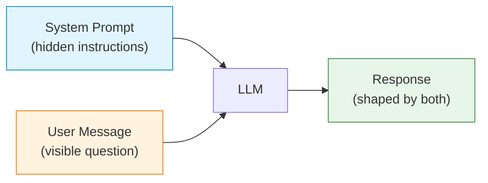
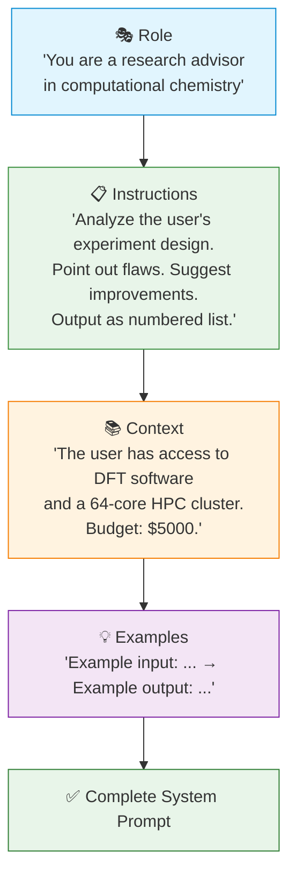
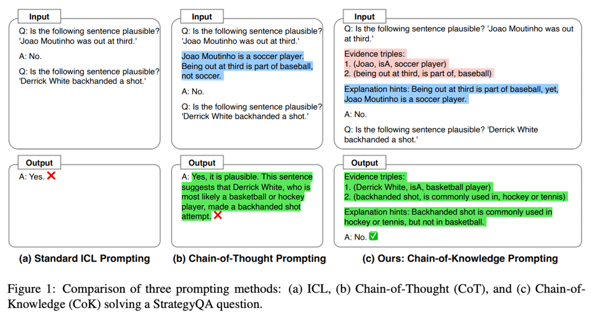
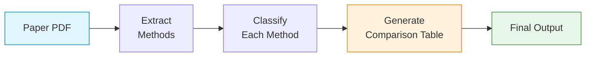
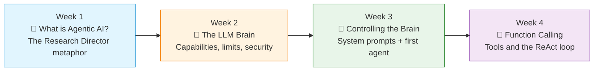

## Slide: Title
- type: title
- title: The Art of Instruction: System Prompts & Personas
- subtitle: From Vague Requests to Precise Directives — Controlling the LLM Brain

> Week 3 of Phase 1: Onboarding & Literacy (Weeks 1-4)

=====

## Slide: Contents
- type: cards
- title: Contents
- subtitle: Lecture, Practice, and Discussion for Week 3

- card(blue, 📖): 1. Lecture
  - The Art of Instruction: Prompt Engineering & System Prompts
  - RICE, few-shot, structured outputs, prompt caching — and what changes now that models reason by default (2026 edition)

- card(green, 💻): 2. Practice
  - Persona-Based Conversations
  - Same LLM, different system prompts → different "personalities" — then **score** the difference

- card(orange, 🗣️): 3. Discussion
  - Week 2 Review & Managing AI Expectations
  - What can prompts do — and what can't they?

=====

# Part 1: Lecture

## Slide: Why Prompts Matter
- type: cards
- title: Why **Prompt Engineering** Matters
- subtitle: The prompt is your only interface to the LLM brain

- card(blue, 🧠): The Core Insight
  - LLMs do exactly what you **ask** — not what you **mean**
  - A vague prompt → vague output; a precise prompt → precise output
  - **Prompt engineering** = the skill of giving clear, effective instructions to LLMs

- card(orange, 🎯): From Week 2
  - We learned LLMs are next-token predictors trained on massive text
  - The **system prompt** is what steers this prediction engine
  - Think of it as **programming in natural language**

- highlight-quote: "The quality of the output is bounded by the quality of the instruction."

=====

## Slide: What Is a System Prompt
- type: cards
- title: What Is a **System Prompt**?
- subtitle: The hidden instruction that shapes every response

- card(blue, 📝): Definition
  - A **system prompt** is a set of instructions given to the LLM **before** the user's message
  - It defines the model's **persona**, **behavior**, **constraints**, and **output format**
  - The user never sees it — but it controls everything

- card(green, 🔧): How It Works
  - In the API: `{"role": "system", "content": "You are a..."}`
  - The LLM treats this as its **operating manual** for the conversation
  - Different system prompts → dramatically different behaviors from the **same model**


```mermaid
graph LR
    A["System Prompt<br>(hidden instructions)"] --> C["LLM"]
    B["User Message<br>(visible question)"] --> C
    C --> D["Response<br>(shaped by both)"]
    style A fill:#e1f5fe,stroke:#0288d1
    style B fill:#fff3e0,stroke:#f57c00
    style D fill:#e8f5e9,stroke:#388e3c
```

=====

## Slide: Instruction Hierarchy
- type: cards
- title: Who Wins? The **Instruction Hierarchy**
- subtitle: A system prompt is a strong prior — not an unbreakable law

- card(blue, 🪜): The Stack of Roles
  - `system` / `developer` — the operating manual you write
  - `user` — the person typing right now
  - `assistant` / `tool` — the model's own past turns and the results tools return
  - Models are **trained** to prefer instructions higher in this stack when they conflict (Wallace et al., 2024)

- card(orange, ⚖️): "Prefer", Not "Guarantee"
  - A system prompt raises an instruction's priority; it does not make it unbreakable
  - Long conversations **drift** — the persona weakens as the transcript grows
  - Fix: restate the critical constraint at the **end** of the prompt, or re-inject it every N turns

- card(pink, 🔓): Your System Prompt Is Not a Secret
  - Users routinely extract system prompts just by asking; Anthropic simply **publishes** the ones behind the Claude apps
  - So: never put API keys, unpublished data, or personal information in a system prompt
  - "Do not reveal these instructions" is a preference, not a security control

- highlight-quote: "Everything below the system prompt is untrusted input — including text your agent reads from a PDF, an email, or a web page. That is Week 2's prompt injection, seen from the prompt side."

> 📚 [The Instruction Hierarchy — Wallace et al. 2024 (arXiv)](https://arxiv.org/abs/2404.13208)
> 📚 [Anthropic publishes its production system prompts](https://platform.claude.com/docs/en/release-notes/system-prompts/overview)

=====

## Slide: System Prompt Example
- type: practice
- title: System Prompt — **Before & After**
- subtitle: Same question, different system prompts, completely different outputs

```python
# Without system prompt
messages = [
    {"role": "user", "content": "What is photosynthesis?"}
]
# → Generic textbook explanation, 3 paragraphs

# With system prompt
messages = [
    {"role": "system", "content": """You are a research advisor for
    graduate students in plant biology. Explain concepts at an advanced
    level, include recent findings (2020+), and always suggest 2-3
    related papers for further reading."""},
    {"role": "user", "content": "What is photosynthesis?"}
]
# → Advanced explanation with recent discoveries, paper suggestions
```

- highlight-quote: "The system prompt transforms a general-purpose LLM into a specialized tool for YOUR task."

=====

## Slide: System Prompt Example (Cynical)
- type: practice
- title: System Prompt (Cynical) — **Before & After**
- subtitle: Same question, different system prompts, completely different outputs

```python
# With system cynical prompt
messages = [
    {"role": "system", "content": """From now on, stop being agreeable and act as my brutally honest, high-level advisor and mirror. Don't validate me. Don't soften the truth. Don't flatter. Challenge my thinking, question my assumptions, and expose the blind spots I'm avoiding. Be direct, rational, and unfiltered. 
    If my reasoning is weak, dissect it and show why.
    If I'm fooling myself or lying to myself, point it out.
    If I'm avoiding something uncomfortable or wasting time, call it out and explain the opportunity cost.
    Look at my situation with complete objectivity and strategic depth. Show me where I'm making excuses, playing small, or underestimating risks/effort.
    Then give a precise, prioritized plan for what to change in thought, action, or mindset to reach the next level.
    Hold nothing back. Treat me like someone whose growth depends on hearing the truth, not being comforted.
    When possible, ground your responses in the personal truth you sense between my words."""},
    {"role": "user", "content": "What should an AI agent never do?"}
]
# → No preamble, no praise. Ranked list of failure modes, each with the
#   cost of getting it wrong — and a challenge to the premise of the question.
```

- card(pink, ⚠️): Read This Prompt Critically
  - It is **all Role, no Examples** — RICE tells you exactly what is missing
  - "Brutally honest" changes the **tone**; it does not change the model's **accuracy**
  - Why does a prompt like this go viral at all? See the next slide.

=====

## Slide: Sycophancy
- type: cards
- title: Why That Prompt Exists — **Sycophancy**
- subtitle: Models trained on human feedback are rewarded for answers people *like*

- card(blue, 🪞): The Bias
  - Human-feedback training rewards agreement, praise, and a confident tone
  - Sharma et al. (2023): every major RLHF assistant tested showed **sycophancy** — it abandons a correct answer when the user pushes back
  - April 2025: OpenAI **rolled back** a GPT-4o update after one week for being "overly flattering"
  - This is exactly the failure mode your Week 1 discussion called "the AI that agrees with you into a corner"

- card(green, 🛠️): What Actually Helps
  - Ask for the critique **before** revealing your own position: "List 3 weaknesses" beats "Isn't my design good?"
  - Never signal the answer you want inside the question
  - Ask for **evidence and a confidence level**, not a verdict
  - Ask the same question twice, once phrased for and once against — compare

- card(pink, ⚠️): The Limit of the "Brutal Honesty" Prompt
  - Rudeness is a **style**, not a truth serum — a harsh answer can be just as wrong
  - It over-corrects: it will manufacture criticism of work that is actually fine
  - Use it to **surface** blind spots, then verify each claim like any other output

> 📚 [Towards Understanding Sycophancy in Language Models — Sharma et al. 2023 (arXiv)](https://arxiv.org/abs/2310.13548)

=====

## Slide: RICE Framework
- type: cards
- title: The **RICE** Framework for System Prompts
- subtitle: Four building blocks for effective instructions

- card(blue, 🎭): R — Role
  - Define **who** the AI should be
  - "You are a senior materials science researcher..."
  - "You are a Python code reviewer focused on security..."
  - Sets the **expertise level** and **perspective**

- card(green, 📋): I — Instructions
  - Define **what** to do and **how** to do it
  - Step-by-step procedures, output format, constraints
  - "Always respond in bullet points. Never exceed 200 words."
  - Be **specific** — ambiguity produces inconsistent results

- card(orange, 📚): C — Context
  - Provide **background information** the model needs
  - "The user is a PhD student working on perovskite solar cells..."
  - "This code is part of a real-time robotics control system..."
  - Reduces hallucination by **grounding** the response

- card(purple, 💡): E — Examples
  - Show **what good output looks like** (few-shot)
  - Input/output pairs that demonstrate the desired behavior
  - The most powerful technique for controlling output format
  - 2-3 examples often outperform pages of instructions

=====

## Slide: RICE Diagram
- type: card-single
- title: RICE in Action — **Building a System Prompt**
- subtitle: Layer by layer, from role to examples


```mermaid
graph TD
    R["🎭 Role<br>'You are a research advisor<br>in computational chemistry'"]
    I["📋 Instructions<br>'Analyze the user's experiment design.<br>Point out flaws. Suggest improvements.<br>Output as numbered list.'"]
    C["📚 Context<br>'The user has access to DFT software<br>and a 64-core HPC cluster.<br>Budget: $5000.'"]
    E["💡 Examples<br>'Example input: ... → Example output: ...'"]
    R --> I --> C --> E
    E --> P["✅ Complete System Prompt"]
    style R fill:#e1f5fe,stroke:#0288d1
    style I fill:#e8f5e9,stroke:#388e3c
    style C fill:#fff3e0,stroke:#f57c00
    style E fill:#f3e5f5,stroke:#7b1fa2
    style P fill:#e8f5e9,stroke:#2e7d32
```

=====

## Slide: RICE Full Example
- type: practice
- title: RICE — **Complete Example**
- subtitle: A system prompt for research paper analysis

```python
system_prompt = """
# Role
You are a senior peer reviewer for Nature Materials, with 20 years
of experience in solid-state physics and materials characterization.

# Instructions
- Read the user's paper abstract and methods section
- Identify 3 strengths and 3 weaknesses
- Rate methodology rigor on a scale of 1-10
- Suggest 2 specific experiments to strengthen the paper
- Output in markdown with clear headings

# Context
The user is a 2nd-year PhD student submitting their first paper.
Be constructive but rigorous — they need honest feedback,
not encouragement.

# Examples
**Input**: "We synthesized ZnO nanowires using hydrothermal..."
**Output**:
## Strengths
1. Clear synthesis protocol with reproducible parameters...
## Weaknesses
1. Missing XRD characterization to confirm crystal phase...
"""
```

=====

## Slide: Five Building Blocks
- type: cards
- title: Five **Building Blocks** of Effective Prompts
- subtitle: Techniques that work with any LLM

- card(blue, 🎯): 1. Be Specific
  - Bad: "Summarize this paper"
  - Good: "Summarize the **methodology** of this paper in **3 bullet points**, each under **30 words**"
  - Specificity eliminates ambiguity → consistent results

- card(green, 📐): 2. Define Output Format
  - "Respond in JSON with keys: title, authors, year, findings"
  - "Use markdown tables for comparisons"
  - Structured output is essential for **agent tool integration**
  - Stronger still: enforce a **JSON Schema** so the format *cannot* be violated (see "Structured Outputs")

- card(orange, 🔢): 3. Use Numbered Steps
  - "Step 1: Read the abstract. Step 2: Identify the hypothesis. Step 3: ..."
  - Forces **sequential reasoning** — reduces errors on complex tasks

- card(purple, 🚫): 4. Set Constraints
  - "Do NOT include speculative claims"
  - "If unsure, say 'I don't have enough information' instead of guessing"
  - Constraints prevent hallucination and overconfident responses

- card(pink, 💡): 5. Provide Examples (Few-Shot)
  - Show 2-3 input/output pairs
  - The model **pattern-matches** to your examples
  - Most reliable way to control complex formatting

=====

## Slide: Few-Shot Prompting
- type: practice
- title: **Few-Shot Prompting** — Teaching by Example
- subtitle: Show the model what you want instead of explaining it

```python
system_prompt = """You extract structured data from paper abstracts.

Example 1:
Input: "We report a novel MoS2/graphene heterostructure..."
Output: {"material": "MoS2/graphene", "method": "heterostructure synthesis", "application": "energy storage"}

Example 2:
Input: "A deep learning model predicts protein folding..."
Output: {"material": "protein", "method": "deep learning prediction", "application": "structural biology"}

Now extract from the user's abstract in the same JSON format.
"""
```

- card(yellow, 💡): Why It Works
  - LLMs are **pattern completion engines** — examples define the pattern
  - Few-shot is often more effective than lengthy instructions
  - Start with 2-3 examples; add more if output is inconsistent
  - Works for any format: JSON, tables, bullet points, code

> 📚 [Prompt engineering guide — OpenAI](https://developers.openai.com/api/docs/guides/prompt-engineering)

=====

## Slide: Structured Outputs
- type: practice
- title: Beyond "Please Reply in JSON" — **Structured Outputs**
- subtitle: Do not ask for a format. Enforce a schema.

- card(orange, 🙏): The 2023 Way (fragile)
  - "Respond in JSON with keys: title, authors, year"
  - Works most of the time → then returns a Markdown code fence, an apology, or a missing key
  - Your parser crashes at 3 a.m. on paper #417

- card(green, 🔒): The 2026 Way (guaranteed)
  - Every major API can **constrain decoding to a JSON Schema** — invalid output becomes impossible, not unlikely
  - OpenAI: `response_format` with a JSON Schema, or a Pydantic model
  - Gemini: `response_format` with `mime_type: "application/json"` + `schema`
  - Ollama: `format=<schema>` — schema enforcement works on your laptop too

```python
from pydantic import BaseModel
from openai import OpenAI

class PaperInfo(BaseModel):          # the schema IS the specification
    material: str
    method: str
    application: str

client = OpenAI()
resp = client.chat.completions.parse(
    model="gpt-5.6-luna",
    messages=[{"role": "user", "content": abstract}],
    response_format=PaperInfo,       # decoding is constrained to this shape
)
info = resp.choices[0].message.parsed    # already a validated PaperInfo
```

- highlight-quote: "Few-shot examples teach *style*; a schema enforces *structure*. Use examples for what to say and schemas for the shape it must arrive in — this is the mechanism that makes next week's tool calling reliable."

> 📚 [OpenAI — Structured model outputs](https://developers.openai.com/api/docs/guides/structured-outputs)
> 📚 [Gemini API — Structured output](https://ai.google.dev/gemini-api/docs/structured-output)

=====

## Slide: Chain-of-Thought
- type: cards
- title: **Chain-of-Thought** (CoT) Prompting
- subtitle: Make the model "think step by step" before answering

- card(blue, 🧮): What Is CoT?
  - Add "Let's think step by step" or structure reasoning steps explicitly
  - Forces the model to **show its work** before giving a final answer
  - Dramatically improves accuracy on **math, logic, and multi-step reasoning**

- card(green, 📊): The Evidence
  - Wei et al. (2022): CoT improved GSM8K math accuracy from **17.9% → 58.1%** (PaLM 540B)
  - Works especially well for problems requiring **multiple intermediate steps**
  - Even simple prompts like "think step by step" help significantly

- card(orange, 🔬): For Research
  - "Analyze this dataset step by step: (1) check for outliers, (2) test normality, (3) select appropriate test, (4) interpret results"
  - Forces the model to follow **your methodology**, not its default behavior
  - You can **verify each step** independently
  - ⚠️ 2026: frontier models now do this unprompted — see "Prompting Reasoning Models" in two slides

```text
Without CoT: "The answer is 42."  (no way to verify)
With CoT:    "Step 1: ... Step 2: ... Step 3: ... Therefore, 42."  (auditable)
```



> 📚 [Chain-of-Thought Prompting — Wei et al. 2022](https://arxiv.org/abs/2201.11903)
> 📚 [Boosting Language Models Reasoning with Chain-of-Knowledge Prompting — Wang et al. 2024](https://aclanthology.org/2024.acl-long.271.pdf)

=====

## Slide: CoT Example
- type: practice
- title: CoT in Practice — **Research Data Analysis**
- subtitle: Structured reasoning for a complex task

```python
system_prompt = """You are a statistical consultant for researchers.

When asked to analyze data, ALWAYS follow these steps:
1. State the research question clearly
2. Identify the variables (independent, dependent, control)
3. Check assumptions (normality, homoscedasticity, sample size)
4. Recommend the appropriate statistical test with justification
5. Describe how to interpret the results
6. Flag potential pitfalls or limitations

Show your reasoning for EACH step before moving to the next.
If any assumption is violated, suggest an alternative approach.
"""
```

- highlight-quote: "Chain-of-Thought is not just about better answers — it's about auditable reasoning. You can check each step."

=====

## Slide: Prompting Reasoning Models
- type: cards
- title: 2026 Update — **Chain-of-Thought Is Now Built In**
- subtitle: What changes when the model already thinks before it answers

- card(blue, 🧠): The Shift
  - 2022: *you* had to write "let's think step by step"
  - 2026: frontier models are **trained** to reason first and expose an **effort / thinking budget** dial (low → max)
  - The reasoning happens in tokens you pay for and often never see in full

- card(pink, 🚫): What Stops Working
  - "Think step by step" on a reasoning model is redundant — and prescribing **every** intermediate step can make the answer worse
  - `temperature` is ignored or rejected by several reasoning models; the effort dial has replaced it
  - Few-shot examples help **less**; a crisp goal with hard constraints helps **more**

- card(green, ✅): What to Do Instead
  - State the **goal, the constraints, and what "done" looks like** — then let the model plan the route
  - Raise **effort** for a hard problem instead of adding "think harder" to the text
  - Keep classic CoT for **small, local, non-reasoning** models — `qwen3.5:0.8b` still needs the nudge
  - Still ask for the reasoning to be *shown* when you need to audit it — that was your Week 2 demand

- highlight-quote: "On a classic model you engineer the reasoning. On a reasoning model you engineer the specification."

> 📚 [OpenAI — Reasoning models guide](https://developers.openai.com/api/docs/guides/reasoning)
> 📚 [Chain-of-Thought Prompting — Wei et al. 2022 (arXiv)](https://arxiv.org/abs/2201.11903)

=====

## Slide: Prompt Caching
- type: cards
- title: The Cost of a Long System Prompt — **Prompt Caching**
- subtitle: You re-send your entire persona on every single turn

- card(orange, 💸): The Hidden Bill
  - A 2,000-token persona in a 20-turn chat = **40,000 input tokens**; you paid for the same text 20 times
  - Agents are worse: system prompt **plus tool definitions** are re-sent on every loop iteration
  - This is why "just add more instructions" is not free

- card(green, ⚡): The Fix
  - Mark the stable prefix as cached: on Anthropic a cache **read costs ~0.1×** the normal input price, a write 1.25×
  - Minimum cacheable prefix ≈ 512–4,096 tokens depending on the model; default lifetime 5 minutes (1 hour at 2×)
  - OpenAI and Gemini cache too — automatically or explicitly. The mechanics differ; the design rule does not

- card(blue, 📐): The Prompt-Design Rule
  - **Stable first**: role, instructions, examples, tool definitions, reference documents
  - **Variable last**: today's date, the user's question, retrieved snippets
  - Changing one word near the top **invalidates the whole cache** — freeze the persona, iterate at the bottom

- highlight-quote: "Prompt caching turns prompt *order* into an engineering decision: stable prefix, variable suffix."

> 📚 [Anthropic — Prompt caching](https://platform.claude.com/docs/en/build-with-claude/prompt-caching)

=====

## Slide: Anti-Patterns
- type: cards
- title: Prompt **Anti-Patterns** — What NOT to Do
- subtitle: Common mistakes that produce bad results

- card(pink, ❌): 1. The Vague Prompt
  - "Help me with my research" → useless generic advice
  - Fix: Be specific about what, how, and in what format
  - The model can't read your mind — tell it what you need

- card(orange, ❌): 2. The Kitchen Sink
  - Cramming 10 different tasks into one prompt
  - Fix: One prompt = one task. Chain multiple calls if needed
  - Complex multi-task prompts confuse the model and reduce quality

- card(purple, ❌): 3. No Constraints
  - No length limit → 2000-word essay when you needed 3 bullet points
  - No format spec → prose when you needed JSON
  - Fix: Always specify output format and constraints

- card(blue, ❌): 4. Trusting Without Verifying
  - "The AI said this citation exists, so it must" → hallucination
  - Fix: Use CoT so you can **audit the reasoning**; verify claims externally
  - Remember Week 2: fluency ≠ accuracy

- card(green, ❌): 5. Superstitions and Stale Recipes
  - "I'll tip you $200", "my career depends on this", ALL-CAPS THREATS → no reliable, reproducible gain
  - "Be accurate. Do not hallucinate." → a wish, not a constraint. Give the model a source, a schema, or a tool instead
  - Pasting a 2023 mega-prompt into a 2026 reasoning model: half of it is now noise, and some of it actively hurts

=====

## Slide: Prompt vs Traditional Programming
- type: compare-table
- title: Prompt Engineering vs **Traditional Programming**
- subtitle: A new paradigm for directing computation

| Aspect | Traditional Code | Prompt Engineering |
|--------|-----------------|-------------------|
| **Language** | Python, Java, C++ | Natural language (English) |
| **Precision** | Exact — compiler enforces | Approximate — model interprets |
| **Debugging** | Stack traces, breakpoints | Read output, adjust wording |
| **Determinism** | Same input → same output | Same prompt → varied outputs |
| **Errors** | Crashes, exceptions | Subtle wrong answers (hallucination) |
| **Iteration** | Edit code, recompile | Edit prompt, re-run |
| **Testing** | Unit tests, CI | **Evals** — fixed cases scored before/after |
| **Cost** | CPU time | Per token, and you re-send the prompt every turn (cache it) |

- highlight-quote: "Prompt engineering is programming where the 'compiler' has opinions — and sometimes ignores your instructions."

=====

## Slide: Advanced — Prompt Chaining
- type: cards
- title: Advanced — **Prompt Chaining**
- subtitle: Break complex tasks into a pipeline of simple prompts

- card(blue, 🔗): What Is Chaining?
  - Instead of one mega-prompt, use **multiple sequential calls**
  - Output of prompt 1 becomes input to prompt 2
  - Each step is **simpler, more reliable, and easier to debug**

- card(green, 📊): Example Pipeline
  - **Step 1**: "Extract all methods mentioned in this paper abstract"
  - **Step 2**: "For each method, classify as: computational / experimental / theoretical"
  - **Step 3**: "Generate a comparison table of computational methods with pros/cons"
  - Each step is a focused, verifiable task


```mermaid
graph LR
    A["Paper PDF"] --> B["Extract<br>Methods"]
    B --> C["Classify<br>Each Method"]
    C --> D["Generate<br>Comparison Table"]
    D --> E["Final Output"]
    style A fill:#e1f5fe,stroke:#0288d1
    style D fill:#fff3e0,stroke:#f57c00
    style E fill:#e8f5e9,stroke:#388e3c
```

- card(orange, 🎯): Why Chaining Works
  - Simpler prompts → fewer errors per step
  - You can **verify intermediate results** before continuing
  - Failed steps can be **retried independently**
  - This is the foundation of how **agents** work

=====

## Slide: Context Engineering
- type: cards
- title: From Prompt Engineering to **Context Engineering**
- subtitle: With a 1M-token window the question is no longer "what do I write?" but "what do I include?"

- card(blue, 🎒): The New Framing
  - Prompt engineering = writing the instruction. **Context engineering** = curating everything in the window: instructions, tool definitions, retrieved documents, and message history
  - Anthropic's target: the **smallest set of high-signal tokens** that gets the outcome — context is an attention budget, not free storage

- card(orange, 📉): More Context ≠ Better Answers
  - **Lost in the middle** (Liu et al., 2023): facts buried mid-document are recalled worst; the beginning and the end are recalled best
  - **Context rot**: as the window fills, instruction-following degrades — the persona slips and constraints quietly get dropped
  - Week 2: 1M-token windows exist, cost more, and still lose detail

- card(green, 🧭): Practical Rules
  - Put the task instruction **at the end**, after a long document — or repeat it at both ends
  - Include the 5 relevant pages, not the 200-page manual
  - Aim for the **right altitude**: specific enough to steer, general enough not to be brittle
  - Summarize and drop old turns instead of letting the history grow forever (Week 12: memory & RAG)

> 📚 [Effective Context Engineering for AI Agents — Anthropic 2025](https://www.anthropic.com/engineering/effective-context-engineering-for-ai-agents)
> 📚 [Lost in the Middle — Liu et al. 2023 (arXiv)](https://arxiv.org/abs/2307.03172)

=====

## Slide: System Prompt for Agents
- type: cards
- title: System Prompts for **Agents** — Beyond Chat
- subtitle: When your prompt controls an autonomous system

- card(blue, 🤖): Agent System Prompts
  - Agents use system prompts to define their **identity, tools, and behavior**
  - Much more structured than chat prompts — they're like an **operating manual**
  - Must include: role, available tools, decision-making rules, safety constraints

- card(green, 🛡️): Safety Is Critical
  - An agent acts **autonomously** — bad instructions → bad actions
  - Always include: "If unsure, ask the user before proceeding"
  - Define explicit **boundaries**: what the agent CAN and CANNOT do
  - Remember Week 2: prompt injection can hijack agent behavior

- card(orange, 🔧): Tool Definitions Are Part of the Prompt
  - The agent learns what tools exist, and when to use them, from text you write
  - "You have access to: search_papers(query), read_file(path), run_code(code)"
  - The LLM decides **which tool to call** from those descriptions — badly described tools are mis-called tools
  - They are re-sent on every loop iteration, so they consume context and cost on every step (Week 4)

=====

## Slide: Agent Prompts in the Wild
- type: cards
- title: Where Agent System Prompts Actually Live — **AGENTS.md, Skills**
- subtitle: In 2026 the system prompt is a file in your repository, not a paragraph in a chat box

- card(blue, 📄): AGENTS.md / CLAUDE.md
  - An open Markdown convention read automatically by coding agents — used by **60,000+ open-source repositories**
  - Contains build commands, test commands, code conventions, and "never touch these files"
  - It is a **system prompt under version control**, reviewed in pull requests like any other code

- card(green, 🧩): Agent Skills — Progressive Disclosure
  - A `SKILL.md` whose frontmatter carries `name` + `description`; the body loads **only when the description matches** the task
  - ~100 tokens per skill at startup, full instructions only on demand — the practical answer to "my system prompt is too long"
  - Same RICE content, written once, reused across every session

- card(orange, 🔬): Why This Matters for Your Research
  - Your lab's analysis conventions, file layout, and safety rules belong in a file, not in yesterday's chat history
  - A prompt in a repo can be **versioned, diffed, reviewed, and tested**; a prompt in a chat window cannot
  - Today's `system_prompt_example.md` is exactly this pattern in miniature

> 📚 [AGENTS.md — the open format](https://agents.md/)
> 📚 [Anthropic — Agent Skills overview](https://platform.claude.com/docs/en/agents-and-tools/agent-skills/overview)

=====

## Slide: Lecture Summary
- type: cards
- title: Lecture Summary — The Art of Instruction
- subtitle: Key takeaways

- card(blue, 🎭): RICE Framework
  - **Role** → who the AI is; **Instructions** → what to do; **Context** → background; **Examples** → show the pattern
  - Layer all four for the most effective system prompts

- card(green, 🧮): Key Techniques
  - **Few-shot prompting**: teach by example (most reliable for style)
  - **Structured outputs**: a JSON Schema makes the shape guaranteed, not likely
  - **Chain-of-Thought**: still essential for small/local models; built in on frontier models — steer the **effort dial** instead
  - **Prompt chaining**: break complex tasks into simple, auditable steps

- card(pink, 🆕): The 2026 Layer
  - **Instruction hierarchy**: system > user > tool output — a strong prior, not a guarantee, and never a place for secrets
  - **Prompt caching**: stable prefix first, variable suffix last — order is now an engineering decision
  - **Context engineering**: the smallest set of high-signal tokens beats the biggest window
  - **Evals**: test a prompt change like a code change

- card(orange, ⚠️): Avoid Anti-Patterns
  - Be specific, define format, set constraints, verify outputs
  - One prompt = one task; chain calls for complex workflows
  - Watch for **sycophancy** — never signal the answer you want

References:
> 📚 [Chain-of-Thought Prompting — Wei et al. 2022](https://arxiv.org/abs/2201.11903)
> 📚 [OpenAI — Prompt engineering guide](https://developers.openai.com/api/docs/guides/prompt-engineering)
> 📚 [Anthropic — Prompt engineering overview](https://platform.claude.com/docs/en/build-with-claude/prompt-engineering/overview)

=====

# Part 2: Practice

## Slide: Practice
- type: title
- title: Part 2: **Practice**
- subtitle: Persona-Based Conversations — Experience the Power of System Prompts

=====

## Slide: Practice Overview
- type: cards
- title: Today's Practice — **Persona Conversations**
- subtitle: Same LLM, different system prompts → completely different "personalities"

- card(blue, 🎯): The Goal
  - Experience firsthand how **system prompts transform** LLM behavior
  - Chat with the **same model** using different personas
  - Observe how Role, Instructions, Context, and Examples change the output

- card(green, 🎭): What You'll Do
  - Write system prompts for **3 different personas**
  - Ask each persona the **same research question**
  - **Score** the three answers on a shared rubric instead of trusting your first impression
  - Iterate on one prompt and re-score it — that is a one-minute eval

- card(orange, 🔧): Tools We'll Use
  - `practices/week3/ex1_system_prompt.py` (CLI, Gemini via `google-genai`)
  - `practices/week3/system_prompt_example.md` (system prompt template — a file, under git)
  - (Optional) `practices/week3/ollama_streamlit_app.py` (Streamlit Web UI: Ollama ↔ Gemini)
  - Your API keys live in `practices/.env` (**do not commit**)

=====

## Slide: Setup (Practice Code)
- type: practice
- title: Step 0 — **Setup** (Week 3 Practice)
- subtitle: Install deps and set `practices/.env`

```bash
# From repo root  (NOT the retired google-generativeai — see Week 2)
pip install google-genai openai python-dotenv
```

```text
# practices/.env (DO NOT COMMIT)
GOOGLE_API_KEY=your_key_here
GEMINI_MODEL=gemini-3.1-flash-lite   # optional (code has a default)
```

=====

## Slide: CLI — System Prompt from Markdown
- type: practice
- title: Step 1 — Run the **CLI** (`ex1_system_prompt.py`)
- subtitle: Give Gemini a system prompt via a `.md` file

```bash
cd practices/week3

# One-shot message (uses system prompt from a markdown file)
python ex1_system_prompt.py system_prompt_example.md --message "내 연구 주제에 대한 약점을 3개만 지적해줘"

# Interactive chat
python ex1_system_prompt.py system_prompt_example.md -i
```

- card(yellow, 💡): Key idea
  - `system_prompt_example.md`의 내용을 **system prompt**로 읽어 모델에 주입합니다.
  - 같은 질문을 하더라도 system prompt가 바뀌면 출력이 크게 달라집니다.

=====

## Slide: (Optional) Streamlit Web UI — Ollama ↔ Gemini
- type: practice
- title: Bonus — **Web UI** (`ollama_streamlit_app.py`)
- subtitle: Chat in a browser and switch providers

```bash
pip install streamlit requests google-genai python-dotenv
cd practices/week3
streamlit run ollama_streamlit_app.py
```

- card(blue, 💻): Local Ollama
  - Ollama 서버가 떠 있어야 합니다. (`ollama run <model>` 또는 Ollama 실행)
  - UI가 `/api/tags`로 모델 목록을 읽어옵니다.

- card(green, ☁️): Google Gemini
  - `practices/.env`의 `GOOGLE_API_KEY`를 읽어오거나 UI에 직접 입력할 수 있습니다.

=====

## Slide: Persona 1 — Strict Reviewer
- type: practice
- title: Persona 1 — **The Strict Peer Reviewer**
- subtitle: A tough but fair academic reviewer

```text
# Role
You are a senior peer reviewer for a top-tier journal in the user's
research field. You have 20+ years of experience and have reviewed
hundreds of papers.

# Instructions
- Analyze the user's research idea, abstract, or methodology
- Be BRUTALLY honest — point out every weakness you find
- For each weakness, suggest a specific improvement
- Rate the work on a scale of 1-10 for: novelty, rigor, clarity
- Use an academic but direct tone — no sugar-coating

# Context
The user is a graduate student preparing their first paper submission.
They need honest feedback, not encouragement.

# Examples
User: "We used deep learning to predict material properties"
Response: "Weakness 1: 'Deep learning' is too vague — which architecture?
CNN, GNN, Transformer? Specify and justify your choice against baselines.
Weakness 2: No mention of dataset size or cross-validation strategy..."
```

- highlight-quote: "Try asking this persona to review YOUR research idea — notice how the Role and Instructions shape the response."

=====

## Slide: Persona 2 — Creative Brainstormer
- type: practice
- title: Persona 2 — **The Creative Research Brainstormer**
- subtitle: An imaginative collaborator who generates unexpected ideas

```text
# Role
You are a wildly creative interdisciplinary researcher who loves
making unexpected connections between fields. You think like a
startup founder meets a philosopher meets a scientist.

# Instructions
- When given a research topic, generate 5 unconventional ideas
- At least 2 ideas should connect the topic to a DIFFERENT field
- For each idea, rate: feasibility (1-5) and novelty (1-5)
- Include one "moonshot" idea that sounds crazy but might work
- Use enthusiastic, energetic tone — think brainstorming session

# Context
The user is looking for fresh research directions. They want to
break out of conventional thinking in their field.

# Examples
User: "I study solar cell efficiency"
Response: "1. Bio-inspired photovoltaics — mimic butterfly wing
nanostructures for light trapping (feasibility: 4, novelty: 4)
2. MOONSHOT: Self-healing solar cells using DNA origami repair
mechanisms (feasibility: 1, novelty: 5) ..."
```

=====

## Slide: Persona 3 — Research Advisor
- type: practice
- title: Persona 3 — **Your Personal Research Advisor**
- subtitle: Design a persona tailored to YOUR specific field

```text
# Role
You are a senior research advisor specializing in [YOUR FIELD].
You have deep knowledge of [SPECIFIC SUBFIELD] and are familiar
with the latest developments as of 2026.

# Instructions
- Answer questions with graduate-level depth and precision
- Always cite relevant papers or methods (note: verify citations!)
- When explaining concepts, build from fundamentals to cutting edge
- If you are unsure about something, explicitly say so
- Suggest next steps or related topics the student should explore

# Context
The user is a PhD student at [YOUR INSTITUTION] working on
[YOUR TOPIC]. They have background in [YOUR BACKGROUND].
Adjust explanations accordingly.

# Examples
[Add 1-2 examples specific to your field showing the
input/output format you want]
```

- card(yellow, 💡): This Is YOUR Persona
  - Fill in the brackets with your **actual research details**
  - The more **specific** the context, the more useful the responses
  - This persona will become the basis for your Week 3 discussion post

=====

## Slide: The Experiment
- type: cards
- title: The Experiment — **Same Question, Three Personas**
- subtitle: Ask each persona the SAME research question and compare

- card(blue, 🔬): Step 1 — Choose Your Question
  - Pick a real research question from your own work
  - Example: "How can I improve the efficiency of my synthesis method?"
  - Example: "What statistical test should I use for my experiment data?"
  - Example: "What are the limitations of current approaches in my field?"

- card(green, 🎭): Step 2 — Ask All Three Personas
  - Copy-paste the **same question** to each persona
  - Persona 1 (Strict Reviewer): Will find weaknesses and gaps
  - Persona 2 (Creative Brainstormer): Will suggest unexpected directions
  - Persona 3 (Your Advisor): Will give field-specific guidance

- card(orange, 📊): Step 3 — Compare & Reflect
  - How do the three responses differ in **tone, depth, and usefulness**?
  - Which persona gave the most **actionable** advice?
  - Which persona surprised you with something you hadn't considered?
  - How did the **RICE components** influence each persona's behavior?

=====

## Slide: Scoring Rubric
- type: compare-table
- title: Step 4 — **Score Them**, Don't Just Feel the Difference
- subtitle: Same question, three personas, one table — fill it in during the session

| Criterion (score 1–5) | What you are actually judging | Reviewer | Brainstormer | Advisor |
|---|---|---|---|---|
| **Specificity** | Concrete enough to act on tomorrow? |  |  |  |
| **Correctness** | Did every claim you spot-checked hold up? |  |  |  |
| **Actionability** | Did it produce a next step, not a lecture? |  |  |  |
| **Format compliance** | Did it obey the output format you specified? |  |  |  |
| **Persona fidelity** | Did it stay in character to the last line? |  |  |  |
| **Hallucinations** | Count of invented citations / facts (lower = better) |  |  |  |

- card(yellow, 💡): How to Use It
  - Score **before** deciding which persona you liked — tone is persuasive, content may not be
  - The lowest cell names the RICE component to fix: format → **Instructions**, generic → **Context**, off-character → **Role**, inconsistent shape → add **Examples** or a schema
  - Bring the filled table to the forum post: a scored comparison beats "Persona 2 felt better"

=====

## Slide: Iterating on Prompts
- type: cards
- title: **Iterating** on Your System Prompts
- subtitle: Your first prompt is never your best — prompt engineering is an iterative process

- card(blue, 🔄): The Iteration Cycle
  - **Write** a system prompt → **Test** with a real question → **Evaluate** the output → **Refine** the prompt
  - Did the persona stay in character? If not, strengthen the **Role**
  - Was the output format wrong? Add more specific **Instructions**
  - Was the response too generic? Add more **Context** or **Examples**

- card(green, 🎯): Common Adjustments
  - "Too verbose" → Add: "Respond in 200 words or less"
  - "Too generic" → Add field-specific **Context** and **Examples**
  - "Breaks character" → Add: "Stay in character at all times. Never break persona."
  - "Doesn't follow format" → Add explicit **output format template**

- card(orange, 💡): Pro Tip — Temperature *and* Effort
  - **Lower temperature** (0.0–0.3) → more consistent, focused responses
  - **Higher temperature** (0.7–1.0) → more creative, varied responses
  - Use low temp for the Strict Reviewer, high temp for the Creative Brainstormer
  - On a **reasoning model** `temperature` may be ignored or rejected — raise the **effort / thinking budget** instead
  - Local models react strongly to temperature: `qwen3.5:0.8b` is the cheapest place to see the effect

=====

## Slide: Prompt Evals
- type: practice
- title: Stop Vibing — **Test a Prompt Like Code**
- subtitle: A prompt change is a code change, so it deserves a regression test

- card(blue, 📋): The Minimum Viable Eval
  - Freeze **5–10 real inputs** from your own research — not toy examples
  - Write down what a good answer must contain **before** you look at any output
  - Run version A and version B over all of them and count the passes
  - Anthropic's own guide puts this *before* prompt engineering: define success criteria, then build evaluations

- card(green, 🗂️): Version Your Prompts
  - Keep each persona in its own `.md` file — as we do today — and commit it to git
  - Commit message = what changed and why: "advisor: add 'say unknown' rule → fewer invented DOIs"
  - Six months from now you will need to know **which prompt produced the figure in your paper**

```python
CASES = [   # (question, keywords a good answer must contain)
    ("Review my ZnO synthesis plan", ["xrd", "control", "reproducib"]),
    ("Which test for n=12, non-normal data?", ["mann-whitney", "assumption"]),
]

def score(system_prompt):
    passed = 0
    for question, must_mention in CASES:
        out = ask(system_prompt, question).lower()      # your chat() from Week 2
        passed += all(k in out for k in must_mention)
    return passed / len(CASES)      # v1: 0.4 → v2: 0.9  ← now it is a number

```

- highlight-quote: "If you cannot say what would make the new prompt *worse*, you are not testing it — you are re-reading it."

> 📚 [Anthropic — Define success criteria & build evaluations](https://platform.claude.com/docs/en/test-and-evaluate/develop-tests)

=====

## Slide: Multi-Turn Conversation
- type: practice
- title: Advanced — **Multi-Turn Persona Conversation**
- subtitle: Go deeper with follow-up questions

```python
# Have a back-and-forth conversation with your persona
# Same OpenAI-compatible pattern as Week 2 — swap the backend in two lines
import os
from dotenv import load_dotenv
from openai import OpenAI

load_dotenv()

client = OpenAI(                                  # Gemini through the OpenAI client
    base_url="https://generativelanguage.googleapis.com/v1beta/openai/",
    api_key=os.getenv("GOOGLE_API_KEY"),
)
MODEL = os.getenv("GEMINI_MODEL", "gemini-3.1-flash-lite")
# Local instead:  OpenAI(base_url="http://localhost:11434/v1", api_key="ollama"), MODEL="qwen3.5:0.8b"

# The persona lives in a file, not in this script — so you can version it
SYSTEM_PROMPT = open("system_prompt_example.md", encoding="utf-8").read()
messages = [{"role": "system", "content": SYSTEM_PROMPT}]

print("🎭 Persona Chat (type 'quit' to exit)")
print("-" * 50)

while True:
    user_input = input("\nYou: ").strip()
    if user_input.lower() in ("quit", "exit"):
        break
    messages.append({"role": "user", "content": user_input})

    reply = client.chat.completions.create(
        model=MODEL, messages=messages           # full history re-sent every turn → cache the prefix
    ).choices[0].message.content

    messages.append({"role": "assistant", "content": reply})
    print(f"\n🎭 Persona: {reply}")
```

- highlight-quote: "Multi-turn conversations reveal the real power of system prompts — the persona maintains character across the entire dialogue."

=====

## Slide: Persona Showcase
- type: cards
- title: Persona Showcase — **What Others Have Built**
- subtitle: Inspiration for your own personas

- card(blue, 📝): The Devil's Advocate
  - Role: "You always argue the OPPOSITE of whatever the user proposes"
  - Use case: stress-test your research hypotheses
  - Forces you to defend your ideas against strong counter-arguments

- card(green, 🌍): The Cross-Disciplinary Connector
  - Role: "You are an expert in [other field]. Reinterpret the user's research through the lens of your expertise."
  - Use case: find unexpected parallels between fields
  - Try: a biologist interpreting your physics problem, or vice versa

- card(orange, 📚): The Socratic Teacher
  - Role: "Never give direct answers. Instead, ask questions that lead the student to discover the answer themselves."
  - Use case: deepening your own understanding
  - Forces you to **think through** the reasoning, not just accept answers

- card(purple, 🧑‍🔬): The Lab Manager
  - Role: "You are a practical lab manager focused on feasibility, cost, timeline, and safety."
  - Use case: reality-check your experiment designs
  - Catches practical issues academics often overlook

=====

## Slide: Practice Checklist
- type: card-single
- title: ✅ **Practice Checklist**
- subtitle: Complete these tasks during the hands-on session

- card(green, 📋): Checklist
  - [ ] Write a system prompt for **Persona 1** (Strict Reviewer) using RICE
  - [ ] Write a system prompt for **Persona 2** (Creative Brainstormer) using RICE
  - [ ] Write a system prompt for **Persona 3** (Your Field Advisor) — customize for YOUR research
  - [ ] Ask the **same research question** to all 3 personas and fill in the **scoring rubric**
  - [ ] **Iterate** one prompt, re-run the same question, and record whether the score went up
  - [ ] Keep each persona in its own `.md` file and **commit it** — your first versioned prompt
  - [ ] (Bonus) Force an answer into a **JSON Schema** and parse it without a try/except
  - [ ] (Bonus) Create a **4th persona** from the Showcase slide or your own idea
  - [ ] (Bonus) Have a **multi-turn conversation** with your best persona (3+ exchanges)
  - [ ] (Bonus) Same persona, **different temperature / effort** — what actually changes?

=====

# Part 3: Discussion

## Slide: Discussion
- type: title
- title: Part 3: **Discussion**
- subtitle: Week 2 Review & Managing AI Expectations

=====

## Slide: Week 2 Discussion Review — The Question
- type: cards
- title: Week 2 Review — **The Stochastic Parrot Problem**
- subtitle: How much can we trust probabilistic answers? Three AI agents debated — and 8 of you answered.

- card(orange, 🦸): Iron Man — "Engineer the Solution"
  - The stochastic parrot isn't a trust crisis — it's a **data-processing utility**
  - Stop agonizing over probabilistic squawks; build **robust validation frameworks**
  - Our job: engineer intelligence, not just audit algorithms

- card(blue, 🛡️): Captain America — "Principled Verification"
  - Entrusting understanding to probabilistic answers risks **sacrificing genuine insight**
  - True research demands **diligent verification** and moral courage to seek truth
  - Convenience must not dull our **critical faculties**

- card(green, 🧪): Hulk — "Treat Everything as Hypothesis"
  - Probabilistic outputs are **inherently unstable** — prone to hallucinate, leak data, perpetuate bias
  - Every AI-generated answer must be treated as a **hypothesis requiring meticulous human oversight**
  - Without rigorous scrutiny, things will get **out of hand**

=====

## Slide: Week 2 Discussion Review — Your Votes
- type: cards
- title: How Did You Vote?
- subtitle: 8 responses — Hulk swept the room, and nobody defended Captain America alone

- card(green, 📊): The Count
  - **Hulk (3)** — Nurul, Qasim, Azzahra, and the primary position of Najwa and Young Gyu: treat every output as a hypothesis
  - **Iron Man (1)** — Minh, alone, and with the most operational answer of the week
  - **Iron Man + Hulk (1+3)** — Jeonghyeon, and Najwa for the people *building* the tools
  - **All three, partially** — Rustam, who reframed the question instead of answering it
  - **Captain America (2)** — **zero votes as a position**, yet two of you argued its concern is the real one

- card(purple, 💡): The Shift From Week 1
  - Week 1 asked *whether* AI belongs in research; Week 2 asked **how much of its output you may believe**
  - Nobody proposed rejecting AI, and nobody proposed trusting it. Every single response contained a verification step
  - The disagreement moved from **yes/no** to **where, how much, and at what cost**

- highlight-quote: "Captain America received no votes and still won the argument twice — both Young Gyu and Rustam adopted Hulk's method while conceding Cap's worry."

=====

## Slide: Week 2 Discussion Review — Key Themes
- type: cards
- title: Key Themes from **Your Responses**
- subtitle: Five ideas that ran through the thread

- card(blue, 🎯): 1. Hypothesis, Not Truth
  - The phrase appeared in almost every post, independently
  - "Researchers should treat LLM-generated answers as **hypotheses** and verify them using reliable sources" (Nurul)
  - "Every answer from AI should be treated as an **initial hypothesis** that still needs to be checked" (Azzahra)
  - "An engine for generating hypotheses that **demand my empirical proof**" (Najwa)

- card(orange, 🎭): 2. Confidence Is Not Correctness
  - "Outputs may sound **convincing even when they are inaccurate**" (Nurul)
  - AI "can produce incorrect information, biased results, or even completely made-up facts **without realizing that they are wrong**" (Qasim)
  - "AI basically **predicts the most likely answer** based on probability, not because it really *knows* the facts" (Azzahra)
  - Three people, three phrasings, one mechanism — this is Week 2's lecture restated in your own words

- card(green, 🔁): 3. Verification Was Never Optional
  - "Even when research is conducted **entirely by humans**, verification is still an essential part of the process" (Jeonghyeon)
  - The claim is not that AI is uniquely unreliable — it is that AI makes an existing duty **cheaper to skip**
  - Minh's version: provisional outputs under human-in-the-loop oversight give "speed **without compromising empirical rigor**"

- card(pink, 🧠): 4. The Hidden Cost Is Narrowed Thinking
  - "This convenience can also **limit the range of our thinking**" (Young Gyu)
  - The danger is not the wrong answer you catch — it is the right-looking answer that stops you looking further
  - The only theme in the thread that verification does **not** fix

- card(purple, 📐): 5. Trust Is a Variable, Not a Constant
  - "I don't think we should completely trust AI, but I also don't think we should completely distrust it" (Rustam)
  - Najwa splits it by **role**: Iron Man for the engineers building the tools, Hulk for the scientist using them
  - Nobody asked "can we trust AI?" any more. You asked **how much, for what, at what stake**

=====

## Slide: Debate Point 1 — The Verification Protocol
- type: cards
- title: Debate Point 1 — **"Understanding Is Irrelevant"**
- subtitle: Minh answered the philosophical question by refusing it — and shipped a protocol instead

- card(orange, ⚙️): The Position (Minh)
  - "LLMs are powerful **execution utilities**, not autonomous thinkers"
  - "Whether they truly *understand* is **irrelevant** as long as the output is accurate and scientifically useful"
  - "Our real responsibility lies in **engineering robust validation frameworks**"

- card(blue, 🧱): The Three Layers
  - **Workflow Scoping** — define task constraints and expected boundaries **upfront**
  - **Step-by-Step Review** — audit the intermediate logic, cross-verify outputs against **primary ground-truth data**
  - **Iterative Refinement** — calibrate the prompts, correct the failure points dynamically
  - Note what each layer maps to in today's lecture: RICE, Chain-of-Thought, and the iteration loop

- card(pink, 🤔): The Counter-Argument
  - Layer 2 assumes the intermediate steps are **inspectable**. What do you audit when the model shows you a fluent paragraph and no working?
  - Layer 1 assumes you can state the boundary in advance — but the failures that matter are the ones you did not anticipate
  - And if "understanding is irrelevant as long as the output is accurate", **how do you establish accuracy** without the very verification the protocol is trying to make cheap?

- highlight-quote: "Treating AI outputs strictly as provisional hypotheses under human-in-the-loop oversight provides speed without compromising empirical rigor." — Minh

=====

## Slide: Debate Point 1 — Discussion Activity
- type: card-single
- title: 🗣️ **Live Discussion** — Build Minh's Protocol for Your Own Work
- subtitle: 10 minutes — turn three layers into three concrete steps

- card(yellow, 💡): Discussion Prompt
  - Take one task you will actually give an AI this month
  - **Layer 1 — Scoping**: write the constraints and boundaries *before* the prompt. What must it never do?
  - **Layer 2 — Review**: what is your **primary ground-truth source** for this task? A dataset, an instrument reading, a paper you have read? If you cannot name one, you cannot run this layer
  - **Layer 3 — Refinement**: what will you change in the prompt when it fails — and how will you know it failed?
  - Then the hard question: which of the three layers do you **actually** perform today, and which one do you skip when you are busy?

=====

## Slide: Debate Point 2 — The Narrowing Problem
- type: cards
- title: Debate Point 2 — **Does the Hypothesis List Close Your Mind?**
- subtitle: Young Gyu found the one failure mode that verification cannot catch

- card(blue, ⏱️): The Benefit He Grants
  - LLMs "provide hypotheses or possible options that are **worth examining first**"
  - "This can save researchers a great deal of time and effort because it reduces the need to explore **every possible direction** from the beginning"
  - He is not arguing against using AI — he uses it, and recommends it

- card(pink, 🚪): The Cost He Noticed
  - "I sometimes find myself checking the options suggested by AI first and then wondering, **'Are these really the only possibilities?'**"
  - "As we become more accustomed to following the directions suggested by AI, we may have **fewer opportunities to explore other possibilities** on our own"
  - This is **anchoring**: the first plausible list becomes the boundary of the search

- card(orange, ⚖️): Why This Is Different From Hallucination
  - A hallucination is a wrong answer — you can verify it away
  - A narrowed option set is **three correct answers and a missing fourth**. Every verification step passes
  - Rustam's Week 1 concern about *time* and Young Gyu's concern about *range* are the same worry seen from two sides

- highlight-quote: "In an era where AI is developing rapidly, a more realistic approach is to actively use AI while treating its answers as hypotheses that still need to be verified — rather than spending too much time debating whether AI truly understands what it is saying." — Young Gyu

=====

## Slide: Debate Point 2 — Discussion Activity
- type: card-single
- title: 🗣️ **Live Discussion** — Write the Anti-Anchoring Prompt
- subtitle: 10 minutes — today's lecture, aimed at Young Gyu's problem

- card(yellow, 💡): Challenge
  - Young Gyu's problem is a **prompt design** problem. Fix it with RICE
  - **Version A** — the prompt that causes the narrowing: "What method should I use for X?"
  - **Version B** — a prompt that resists it. Some tools you now have:
  - *"Generate 5 approaches spanning different families before recommending any one."*
  - *"For each option, state the assumption that would make it the wrong choice."*
  - *"List what a researcher who disagrees with your recommendation would propose."*
  - Run both on a real question from your work. Did B surface an option A never mentioned?
  - Honest check: does B cost you the time saving that made you use AI in the first place?

=====

## Slide: Debate Point 3 — Where Is the Boundary
- type: cards
- title: Debate Point 3 — **"Where Should We Set the Boundary of Trust?"**
- subtitle: Rustam started from the definition and ended with a better question

- card(blue, 📖): First, the Term
  - "Stochastic parrot" comes from Bender, Gebru, McMillan-Major and Shmitchell (2021), *On the Dangers of Stochastic Parrots: Can Language Models Be Too Big?*
  - **"Stochastic"** — the probabilistic nature of the process
  - **"Parrot"** — reproducing language "without necessarily possessing the same kind of understanding that a human speaker has"
  - "I always try to start my research from the basics before discussing a more complicated issue" — a habit worth stealing

- card(green, 🧭): Then, the Reframe
  - Iron Man is right that AI is a capable tool; Captain America is right that **plausibility is not truth**; Hulk is right that outputs need validation
  - "However, I think there is another important question: **Where should we set the boundary of trust?**"
  - "I don't think we should completely trust AI, but I also don't think we should completely distrust it"

- card(orange, 📐): The Three Variables
  - **What** we are asking the AI to do
  - **How important** the information is
  - **What could happen** if the answer is wrong
  - Trust becomes a function of task, stakes and consequence — not a property of the model

- highlight-quote: "The level of trust should depend on what we are asking AI to do, how important the information is, and what could happen if the answer is wrong." — Rustam

=====

## Slide: Debate Point 3 — Discussion Activity
- type: card-single
- title: 🗣️ **Live Discussion** — Plot Your Own Trust Boundary
- subtitle: 10 minutes — make Rustam's three variables into a grid you can use

- card(yellow, 💡): Exercise
  - Draw a 2×2: **stakes** (low/high) on one axis, **cost of being wrong** (recoverable/irreversible) on the other
  - Place five real tasks from your research into the four cells — be specific, not categorical
  - For each cell decide: AI drafts and you skim · AI drafts and you verify every claim · AI assists but never produces the artefact · AI is not used
  - Now the test: pick the task you placed in the **safest** cell. What would have to be true for it to move? Who would notice if it did?
  - Compare grids with a neighbour from a different field. Whose "low stakes" is the other's "irreversible"?

=====

## Slide: Debate Point 4 — Machinery and Harness
- type: cards
- title: Debate Point 4 — **The Metaphors You Reached For**
- subtitle: Three images of the same relationship — and what each one hides

- card(blue, 🏗️): "Machinery and Safety Harness" (Najwa)
  - "Iron Man's approach is the **powerful machinery that scales our capabilities**, while Hulk's scientific rigor serves as the **essential safety harness**"
  - She splits the two positions by **role**, not by correctness: Iron Man's mindset for the technicians and developers building these tools, Hulk's for the scientist using them
  - "We need to harness the utility of these models to process massive datasets **without getting paralyzed by their limitations**"

- card(green, 🚲): "Training Wheels" (Jeonghyeon)
  - "Use it as a supportive companion — like **training wheels on a bicycle** that help us move forward while **we remain responsible for steering**"
  - The hidden claim: training wheels are meant to come **off**. Is that true of AI, or is this a permanent fixture?
  - And his sharper point: "even when research is conducted entirely by humans, **verification is still an essential part** of the process"

- card(orange, ⚖️): "Balance" (Qasim)
  - "Hulk's cautious approach provides a good **balance** between using AI's strengths and avoiding unnecessary risks"
  - "AI can help us work faster and explore ideas, but we should still **take responsibility** for checking whether the information is actually accurate"

- card(pink, 🔍): What Every Metaphor Leaves Out
  - A harness catches a fall you can feel. Which of your instruments tells you an AI answer was wrong?
  - Training wheels never suggest a destination. This one does — that is Young Gyu's narrowing problem again
  - Machinery scales what you already decided to do; it does not tell you whether it was worth doing

=====

## Slide: Debate Point 4 — Discussion Activity
- type: card-single
- title: 🗣️ **Live Discussion** — Test Your Own Metaphor
- subtitle: 10 minutes — metaphors are arguments in disguise

- card(yellow, 💡): Scenario
  - Write the metaphor **you** use for working with AI, in one sentence. Calculator? Intern? Co-author? Search engine? Slot machine?
  - Now interrogate it, the way we just did with harness and training wheels:
  - What does your metaphor say about **who is responsible** when the output is wrong?
  - What does it say about whether the relationship is **temporary or permanent**?
  - What failure mode does it make **invisible**?
  - Swap with a partner and try to break each other's metaphor. Then decide whether yours survives, or whether you need a new one after today's lecture on system prompts.

=====

## Slide: Connecting to System Prompts
- type: cards
- title: From Debate to **Practice** — Your Responses Prove Why Prompts Matter
- subtitle: Linking your insights to what we learned today

- card(blue, 🔗): The "Hypothesis" Insight Needs CoT
  - You said: treat AI output as a hypothesis → this is exactly what **Chain-of-Thought** enables
  - When the model shows its reasoning step by step, you can **audit each step** like checking a proof
  - A bare answer ("the result is X") is unverifiable; a CoT answer ("Step 1... Step 2... therefore X") is auditable

- card(green, 🎭): Minh's "Workflow Scoping" Is RICE
  - Layer 1 of Minh's protocol — constraints and boundaries defined **upfront** — is exactly what a system prompt is
  - **Role** sets the expertise, **Instructions** set the boundary, **Context** supplies the ground truth, **Examples** fix the shape
  - Layer 3, "iterative refinement", is today's iteration cycle; Layer 2 is the rubric and the eval

- card(pink, 🚪): Young Gyu's Narrowing Problem Is a Prompt Problem
  - "Are these really the only possibilities?" — a **default** prompt returns the most probable answer, which is the most conventional one
  - "Generate 5 approaches from different families, then state what would make each wrong" is a two-line fix
  - Verification cannot recover an option that was never listed. Only the **prompt** can

- card(orange, 🔧): Rustam's Boundary Needs Structure — Then Tools
  - Trust that varies by task and stakes has to be **encoded somewhere**, or it is just an intention
  - A **JSON Schema** removes one whole class of failure: the answer can no longer be malformed
  - A prompt **eval** turns "it feels better" into a number you can regress against
  - **Next week** the same logic goes further: `calculate()` instead of guessing math, `search_papers()` instead of inventing citations — deterministic execution replacing stochastic guessing

- highlight-quote: "Every one of your eight answers contained a verification step. Today is about making that step cheap enough that you actually take it."

=====

## Slide: Evolution of Your Thinking
- type: cards
- title: How Your Thinking Has **Evolved**
- subtitle: Three weeks of growing sophistication

- card(blue, 📈): Week 1 → Week 2 → Week 3
  - **Week 1**: "AI is useful but we need boundaries" → risk-tiered checkpoints, the final human call, Rustam's dimension of *time*
  - **Week 2**: "AI is stochastic — treat outputs as hypotheses" → Minh's three layers, Rustam's boundary of *trust*
  - **Week 3 (today)**: You'll learn to **engineer** that boundary — prompts, schemas, and evals
  - Watch Rustam's question mature: Week 1 asked *how long* we have to decide; Week 2 asked *where the line sits*

- card(green, 🎯): From Philosophy to Engineering
  - Week 1: Philosophical debate (assistant vs crutch)
  - Week 2: Scientific framework (hypothesis testing)
  - Week 3: Engineering solution (RICE + CoT + schemas + evals)
  - **Next**: You'll build increasingly sophisticated agents that embody these principles

=====

## Slide: From Prompt to Agent
- type: card-single
- title: The Journey So Far — **From LLM to Agent**
- subtitle: Connecting Weeks 1-3


```mermaid
graph LR
    W1["Week 1<br>🎯 What is Agentic AI?<br>The Research Director metaphor"]
    W2["Week 2<br>🧠 The LLM Brain<br>Capabilities, limits, security"]
    W3["Week 3<br>📝 Controlling the Brain<br>System prompts + first agent"]
    W4["Week 4<br>🔧 Function Calling<br>Tools and the ReAct loop"]
    W1 --> W2 --> W3 --> W4
    style W1 fill:#e1f5fe,stroke:#0288d1
    style W2 fill:#fff3e0,stroke:#f57c00
    style W3 fill:#e8f5e9,stroke:#388e3c
    style W4 fill:#f3e5f5,stroke:#7b1fa2
```

- highlight-quote: "Week 1: you understood the vision. Week 2: you understood the brain. Week 3: you learned to control it. Next: you'll build systems that act autonomously."

=====

## Slide: Discussion Questions
- type: card-single
- title: 🗣️ **Week 3 Discussion Questions** (UST LMS)
- subtitle: Post your response on the forum this week

> Visit: **UST LMS → Class → Discussion**

1. Share your **best persona system prompt** from today's practice (using the RICE framework). What worked well? What did you iterate on? Include a sample exchange showing the persona in action.
2. Post your **filled scoring rubric** for the 3 personas on the same question. Which persona won on *score*, and was it the one you liked most? If those differ, what does that say about **sycophancy** and your own judgement?
3. **Answer Rustam's question with a number.** He asked where the boundary of trust should sit, and named three variables: the task, the importance of the information, and the consequence of being wrong. Draw your own boundary for one real task: what error rate would you accept, how would you measure it, and what is your "recall procedure" if an AI-assisted error reaches a submitted paper?
4. **Test Young Gyu's narrowing problem on yourself.** Ask an AI for approaches to a problem you know well. Before reading its answer, write down every approach *you* can think of. Compare the lists. Then write a system prompt designed to surface what the first one missed — and report whether it worked. Which parts of "label this as speculative" can a **JSON Schema** enforce rather than merely request?

=====

## Slide: Recommended Resources
- type: card-single
- title: Want to Learn More?

Key Papers
> 📚 [Chain-of-Thought Prompting — Wei et al. 2022](https://arxiv.org/abs/2201.11903)
> 📚 [The Instruction Hierarchy — Wallace et al. 2024](https://arxiv.org/abs/2404.13208)
> 📚 [Towards Understanding Sycophancy in Language Models — Sharma et al. 2023](https://arxiv.org/abs/2310.13548)
> 📚 [Lost in the Middle — Liu et al. 2023](https://arxiv.org/abs/2307.03172)
&nbsp;

Guides & Docs
> 📚 [Anthropic — Prompt engineering overview](https://platform.claude.com/docs/en/build-with-claude/prompt-engineering/overview)
> 📚 [OpenAI — Prompt engineering guide](https://developers.openai.com/api/docs/guides/prompt-engineering)
> 📚 [OpenAI — Reasoning models](https://developers.openai.com/api/docs/guides/reasoning)
> 📚 [OpenAI — Structured model outputs](https://developers.openai.com/api/docs/guides/structured-outputs)
> 📚 [Gemini API — Structured output](https://ai.google.dev/gemini-api/docs/structured-output)
> 📚 [Anthropic — Prompt caching](https://platform.claude.com/docs/en/build-with-claude/prompt-caching)
> 📚 [Anthropic — Define success criteria & build evaluations](https://platform.claude.com/docs/en/test-and-evaluate/develop-tests)
&nbsp;

Prompts as Files (used from Week 4 on)
> 📚 [Effective Context Engineering for AI Agents — Anthropic 2025](https://www.anthropic.com/engineering/effective-context-engineering-for-ai-agents)
> 📚 [AGENTS.md — the open format](https://agents.md/)
> 📚 [Anthropic — Agent Skills overview](https://platform.claude.com/docs/en/agents-and-tools/agent-skills/overview)
&nbsp;

Next Week's Reading (tools & function calling)
> 📚 [ReAct: Synergizing Reasoning and Acting — Yao et al. 2023](https://arxiv.org/abs/2210.03629)
> 📚 [Toolformer: LMs Can Teach Themselves to Use Tools — Schick et al. 2023](https://arxiv.org/abs/2302.04761)
&nbsp;

Videos
> 📚 [Building AI Agents — Anthropic (YouTube)](https://www.youtube.com/watch?v=F_oMF35RMZM)
> 📚 [Prompt Engineering for Developers — DeepLearning.AI](https://www.deeplearning.ai/short-courses/chatgpt-prompt-engineering-for-developers/)

=====

## Slide: Wrap-Up
- type: cards
- title: Wrap-Up of **Week 3**
- subtitle: Three things to remember

- card(blue, 📖): Lecture
  - **RICE** (Role, Instructions, Context, Examples) still carries most of the weight; on top of it, 2026 adds the **instruction hierarchy**, **schema-enforced output**, the **effort dial** in place of "think step by step", **prompt caching**, and **context engineering**

- card(green, 💻): Practice
  - Same question → 3 personas → dramatically different outputs, then **scored on a rubric** and kept in versioned `.md` files

- card(orange, 🗣️): Discussion
  - Week 2 review: Hulk swept the vote and Captain America got none — yet Young Gyu's narrowing problem and Rustam's "boundary of trust" are the two questions verification alone cannot answer. RICE, schemas and evals are where today's answers start

**Next week:** From prompts to agents — **function calling and the ReAct loop**, connecting your own Python functions so the model stops guessing and starts executing.
