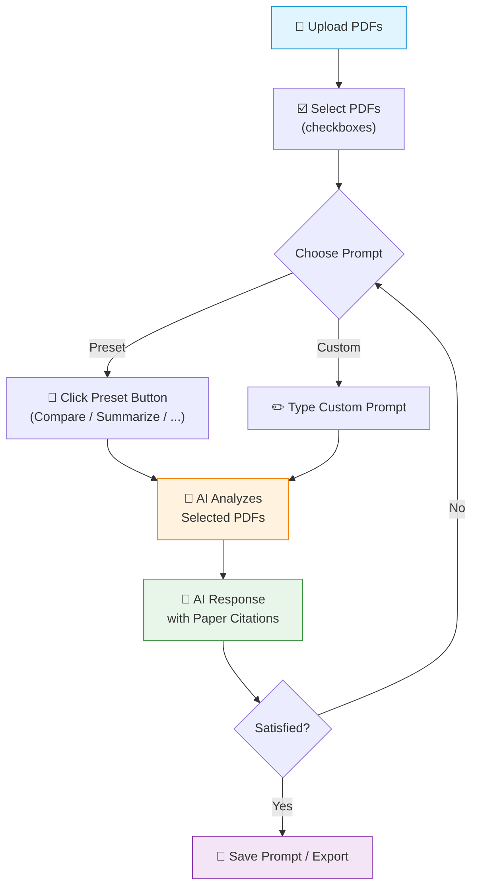
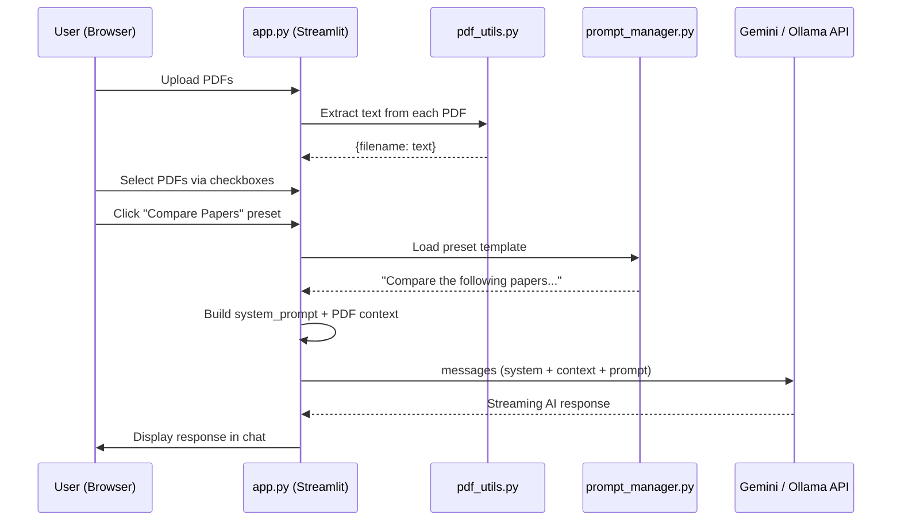

## Slide: Title
- type: title
- title: Designing AI Agent Applications
- subtitle: From Idea to Specification — Building What Your Research Actually Needs

> Week 5 of Phase 2: Building Real Systems (Weeks 5-8)

=====

## Slide: Contents
- type: cards
- title: Contents
- subtitle: Lecture, Practice, and Discussion for Week 5

- card(blue, 📖): 1. Lecture
  - Specifying AI Applications — What to define before you code
  - The 5 questions every AI app must answer

- card(green, 💻): 2. Practice
  - Build a Multi-PDF Research Assistant (Streamlit)
  - PDF upload, selective context, preset prompts, custom prompt save/load

- card(orange, 🗣️): 3. Discussion
  - Week 4 Review & Midterm Project Briefing
  - Design YOUR app — specification due by midterm

=====

# Part 1: Lecture

## Slide: The Phase 2 Shift
- type: cards
- title: Phase 2 — From **Literacy** to **Building**
- subtitle: You understand AI. Now what will you BUILD with it?

- card(blue, 📚): Phase 1 Recap (Weeks 1-4)
  - Week 1: What is Agentic AI? (the Research Director metaphor)
  - Week 2: How LLMs work (capabilities, limits, hallucination)
  - Week 3: System prompts (RICE, personas, Chain-of-Thought)
  - Week 4: Function calling (tools, ReAct loop, agent architecture)

- card(green, 🏗️): Phase 2 Goal (Weeks 5-8)
  - **Design and build** a working AI agent application
  - Not a demo — a tool you can **actually use** in your research
  - Midterm deliverable: **specification document + working prototype + 5-min demo**

- card(orange, 🎯): Today's Key Insight
  - The first building skill is NOT coding — it's **specification**
  - What problem? For whom? What features? How does the human interact?
  - A clear spec makes coding 10x easier; a vague spec makes it impossible

- highlight-quote: "An unspecified AI app is just a chatbot with a custom system prompt. Specification is what turns it into a product."

=====

## Slide: 5 Questions
- type: cards
- title: 5 Questions Every AI App **Must Answer**
- subtitle: Before you write a single line of code

- card(blue, 🎯): 1. Problem / Purpose
  - What problem does this app solve?
  - Who suffers without it? What is painful about the current workflow?
  - Be specific: "I spend 3 hours comparing papers manually" not "research is hard"

- card(green, 👤): 2. Target Users
  - Who will actually use this? (you? your lab? external researchers?)
  - What is their technical skill level?
  - What context do they work in? (lab, office, field, mobile?)

- card(orange, 🔧): 3. Core Features
  - What does the app **actually do**? List 3-5 concrete functions
  - Each feature = a verb: "upload", "compare", "generate", "search", "summarize"
  - Prioritize: what is the **MVP** (minimum viable product)?

- card(purple, 🤝): 4. Human-AI Interaction Flow
  - When does the **human** act? When does the **AI** act?
  - What **triggers** the AI? (button click, text input, automatic?)
  - What requires **human approval** before the AI proceeds?
  - This is where Week 4's "Director's Role" discussion becomes concrete

- card(pink, 📊): 5. Expected Outcomes
  - What does **success** look like? How do you measure it?
  - "Reduces paper comparison time from 3 hours to 15 minutes"
  - "Generates 5 novel research ideas per session, with 2+ being feasible"

=====

## Slide: Spec Template
- type: practice
- title: The Specification Document **Template**
- subtitle: This is exactly what you'll submit for midterm

```markdown
# App Name: [Your App Name]

## 1. Problem Statement
What problem does this solve? Why does it matter?
Who currently suffers from this problem, and how?

## 2. Target Users
Who will use this? What is their skill level?
What is their context (research field, tools they already use)?

## 3. Core Features
| Feature | Description | Priority |
|---------|-------------|----------|
| Feature 1 | What it does | Must-have |
| Feature 2 | What it does | Must-have |
| Feature 3 | What it does | Nice-to-have |

## 4. Human-AI Interaction Flow
[Diagram or step-by-step description]
- Step 1: Human does X → Step 2: AI does Y → Step 3: Human reviews → ...

## 5. Technical Approach
- LLM: Gemini / Ollama / OpenAI
- Framework: Streamlit / Gradio
- Key libraries: [list]
- Data: [what data does the app need?]

## 6. Success Criteria
How do you know the app works? What does "good" look like?
```

- card(yellow, 💡): This Template = Your Midterm Proposal
  - Fill it in for YOUR research project
  - Draft due Week 7, prototype due Week 8
  - Start thinking about it **today** during the discussion exercise

=====

## Slide: Example Spec Overview
- type: cards
- title: Example Spec — **Multi-PDF Research Assistant**
- subtitle: Let's walk through the 5 questions for a concrete example

- card(blue, 🎯): 1. Problem
  - Researchers need to analyze and cross-reference **multiple papers simultaneously**
  - Current tools handle one PDF at a time — switching between 5 papers is painful
  - Manual comparison takes hours; AI can help if given the right context

- card(green, 👤): 2. Users
  - Graduate students and researchers doing **literature review**
  - Moderate tech literacy — comfortable with web apps, not command-line
  - Working with 2-20 PDF papers at a time

- card(orange, 🔧): 3. Features
  - **Upload PDFs** to the app (drag & drop)
  - **Select** which PDFs to include in AI context (checkboxes)
  - **Chat** with AI about the selected papers
  - **Preset prompt buttons** (Compare, Summarize, Find Contradictions, etc.)
  - **Save/delete custom prompts** for reuse

- card(purple, 🤝): 4. Interaction Flow
  - Human uploads PDFs → human selects which to include → human picks preset or types custom prompt → AI analyzes selected PDFs → human reviews response → iterate

- card(pink, 📊): 5. Success Criteria
  - Reduces paper comparison time from **3 hours to 30 minutes**
  - AI responses cite **specific papers** in its answers
  - Saved presets eliminate repetitive typing

=====

## Slide: Interaction Flow
- type: card-single
- title: Example — **Interaction Flow Diagram**
- subtitle: How the human and AI collaborate



- highlight-quote: "The diagram IS the spec. If you can draw the flow, you can build the app."

=====

## Slide: What Makes This Agent-Like
- type: cards
- title: What Makes This **More Than a Chatbot**?
- subtitle: Connecting to everything you learned in Weeks 1-4

- card(blue, 📝): System Prompt (Week 3)
  - The app has a built-in system prompt for research paper analysis
  - It instructs the AI to cite papers, use academic language, admit uncertainty
  - This is RICE in action: Role (research assistant), Instructions (structured analysis), Context (paper content), Examples (implicit via presets)

- card(green, 🔧): Tool Use (Week 4)
  - PDF text extraction is essentially a **tool** — the AI doesn't read PDFs, our code does
  - The code extracts text → sends it as context → AI reasons about it
  - This is the same pattern as `calculate()` or `search_papers()` from Week 4

- card(orange, 🤝): Human-in-the-Loop (Week 4 Discussion)
  - **Human controls context**: which PDFs are included (checkboxes)
  - **Human controls intent**: which prompt to use (preset or custom)
  - **AI executes within scope**: analyzes only what the human selected
  - This directly implements the boundary YOU defined in Week 4

- card(purple, 📋): Preset Prompts = Reusable Tools
  - Each preset is a **mini system prompt** for a specific task
  - Save/load/delete means the user can **customize their own toolbox**
  - This is prompt engineering (Week 3) packaged into a UI

=====

## Slide: Design Principles
- type: cards
- title: Design Principles for **AI-Powered Apps**
- subtitle: Practical guidelines — not UX theory

- card(blue, 🎚️): Progressive Disclosure
  - Start simple: upload PDFs → chat
  - Advanced features (presets, custom saves) available but **not required**
  - Don't overwhelm users with every option at once

- card(green, 🛡️): Transparency
  - Show which PDFs are in context — **the user must know what the AI "sees"**
  - Display the prompt being sent — no hidden behavior
  - If the AI doesn't know something, it should say so (system prompt enforces this)

- card(orange, 🔄): Iteration Over Perfection
  - Users will refine their questions — make it easy to **re-ask and adjust**
  - Preset prompts reduce friction for **repeated tasks**
  - Save/delete cycle means prompts **evolve** with the user's needs

- card(purple, ⚡): AI Does Computation, Human Does Judgment
  - AI: extracts, compares, summarizes, generates ideas
  - Human: selects context, chooses what to ask, evaluates quality, makes decisions
  - This is the "Director" principle from Week 1 — now in a real app

=====

## Slide: Lecture Summary
- type: cards
- title: Lecture Summary — Specification Before Code
- subtitle: Key takeaways

- card(blue, 📋): The 5 Questions
  - **Problem** → why; **Users** → who; **Features** → what; **Interaction Flow** → how; **Outcomes** → success criteria
  - Answer these BEFORE writing code — the spec IS the design

- card(green, 🏗️): The Example
  - Multi-PDF Research Assistant: upload → select → prompt → analyze → iterate
  - Maps directly to Weeks 3-4 concepts (system prompts, tools, human-in-the-loop)

- card(orange, 🎯): Your Turn
  - Today's practice builds this example; your midterm builds YOUR version
  - Start thinking about what **YOUR research** needs

=====

# Part 2: Practice

## Slide: Practice
- type: title
- title: Part 2: **Practice**
- subtitle: Build a Multi-PDF Research Assistant — Streamlit Web App

=====

## Slide: Practice Overview
- type: cards
- title: What We'll **Build** Today
- subtitle: A real web app that implements the example specification

- card(blue, 🎯): The Goal
  - A **web app** that lets you upload PDFs, select which to include, and chat with AI about them
  - Preset prompt buttons for common research tasks
  - Save and delete custom prompts for reuse

- card(green, 🛠️): Tech Stack
  - **Streamlit** — web framework (familiar from Week 3)
  - **PyPDF2** — PDF text extraction
  - **OpenAI client** — LLM calls (Gemini / Ollama / OpenAI — your choice, same as Week 4)

- card(orange, 📁): Project Structure
  - `app.py` — Main Streamlit app (UI + chat logic)
  - `pdf_utils.py` — PDF loading and text extraction
  - `llm_client.py` — LLM client (reuses Week 4 pattern)
  - `prompt_manager.py` — Preset and custom prompt management
  - `presets.json` — Default preset prompts

- flow: Upload PDFs → Select Context → Chat / Use Presets → Save Custom Prompts

=====

## Slide: Setup
- type: practice
- title: Step 0 — **Setup**
- subtitle: Install dependencies and reuse your Week 4 API keys

```bash
# Navigate to practice folder
cd practices/week5

# Install dependencies
pip install streamlit PyPDF2 openai python-dotenv
```

```text
# .env file — reuse from Week 4 (same API keys!)

# Option A: Google Gemini
GOOGLE_API_KEY=your_gemini_key_here
GEMINI_MODEL=gemini-2.0-flash

# Option B: Ollama (local)
OLLAMA_MODEL=qwen3:1.7b

# Option C: OpenAI
OPENAI_API_KEY=your_openai_key_here
OPENAI_MODEL=gpt-4o-mini
```

- card(yellow, 💡): Reuse Your Week 4 Setup
  - If you completed Week 4, you already have a `.env` file with API keys
  - Copy it to `practices/week5/` or create a symlink
  - The LLM client code is the same pattern — just a new wrapper

=====

## Slide: PDF Utils
- type: practice
- title: Step 1 — **PDF Text Extraction** (`pdf_utils.py`)
- subtitle: Extract text from uploaded PDFs and combine selected ones

```python
# pdf_utils.py
from PyPDF2 import PdfReader

MAX_CHARS_PER_PDF = 15000  # Truncate to fit context limits

def extract_text_from_pdf(uploaded_file) -> str:
    """Extract text from a Streamlit UploadedFile (PDF)."""
    reader = PdfReader(uploaded_file)
    pages = []
    for page in reader.pages:
        text = page.extract_text()
        if text:
            pages.append(text)
    full_text = "\n".join(pages)
    if len(full_text) > MAX_CHARS_PER_PDF:
        full_text = full_text[:MAX_CHARS_PER_PDF] + "\n\n[... truncated ...]"
    return full_text

def get_combined_context(pdf_texts: dict, selected: list) -> str:
    """Combine text from selected PDFs into a single context string."""
    parts = []
    for name in selected:
        if name in pdf_texts:
            parts.append(f"### {name}\n{pdf_texts[name]}")
    return "\n\n---\n\n".join(parts)
```

- card(yellow, 💡): Why Truncation?
  - LLMs have **context limits** (Ollama: ~4K-8K tokens, Gemini: ~1M tokens)
  - 15,000 chars per PDF ≈ 4,000 tokens — fits 3-4 papers in most models
  - This is a **design decision** from your spec → real-world constraint

=====

## Slide: LLM Client
- type: practice
- title: Step 2 — **LLM Client** (`llm_client.py`)
- subtitle: Same multi-provider pattern from Week 4 + PDF context injection

```python
# llm_client.py
import os
from dotenv import load_dotenv
from openai import OpenAI

load_dotenv()

SYSTEM_PROMPT = """You are a research paper analysis assistant.
You help researchers understand, compare, and synthesize academic papers.
When answering, always reference which paper(s) your answer is based on.
If the provided papers do not contain enough information, say so clearly.
Be precise, use academic language, and structure your responses with headings."""

def get_client(provider: str):
    if provider == "Gemini":
        return OpenAI(
            api_key=os.getenv("GOOGLE_API_KEY"),
            base_url="https://generativelanguage.googleapis.com/v1beta/openai/"
        ), os.getenv("GEMINI_MODEL", "gemini-2.0-flash")
    elif provider == "Ollama":
        return OpenAI(base_url="http://localhost:11434/v1",
                      api_key="ollama"), os.getenv("OLLAMA_MODEL", "qwen3:1.7b")
    else:
        return OpenAI(api_key=os.getenv("OPENAI_API_KEY")
                      ), os.getenv("OPENAI_MODEL", "gpt-4o-mini")

def chat_with_pdfs(client, model, pdf_context, user_message, history):
    """Send a message with PDF context injected into the system prompt."""
    system_msg = SYSTEM_PROMPT
    if pdf_context:
        system_msg += f"\n\n# Selected Papers Content\n\n{pdf_context}"
    messages = [{"role": "system", "content": system_msg}]
    messages.extend(history)
    messages.append({"role": "user", "content": user_message})
    return client.chat.completions.create(model=model, messages=messages, stream=True)
```

- card(yellow, 💡): Spec → Code Mapping
  - **System prompt** = the "Role" from your spec (research assistant)
  - **PDF context injection** = the "selective context" feature from your spec
  - **Streaming** = better UX — the user sees tokens appear in real-time

=====

## Slide: Prompt Manager
- type: practice
- title: Step 3 — **Prompt Manager** (`prompt_manager.py`)
- subtitle: Load presets, save/delete custom prompts

```python
# prompt_manager.py
import json, os

PRESETS_PATH = os.path.join(os.path.dirname(__file__), "presets.json")
SAVED_PATH = os.path.join(os.path.dirname(__file__), "saved_prompts.json")

def load_presets(path=PRESETS_PATH):
    with open(path, "r", encoding="utf-8") as f:
        return json.load(f)

def load_saved(path=SAVED_PATH):
    if not os.path.exists(path):
        with open(path, "w", encoding="utf-8") as f:
            json.dump([], f)
        return []
    with open(path, "r", encoding="utf-8") as f:
        return json.load(f)

def save_prompt(name, template, path=SAVED_PATH):
    prompts = load_saved(path)
    prompts.append({"name": name, "template": template})
    with open(path, "w", encoding="utf-8") as f:
        json.dump(prompts, f, indent=2, ensure_ascii=False)

def delete_prompt(name, path=SAVED_PATH):
    prompts = load_saved(path)
    prompts = [p for p in prompts if p["name"] != name]
    with open(path, "w", encoding="utf-8") as f:
        json.dump(prompts, f, indent=2, ensure_ascii=False)
```

```json
// presets.json — 5 default presets
[
  {"name": "Compare Papers", "template": "Compare the following papers..."},
  {"name": "Find Contradictions", "template": "Identify contradicting claims..."},
  {"name": "Generate Fusion Ideas", "template": "Propose 3-5 novel ideas..."},
  {"name": "Summarize Each", "template": "Structured summary of each paper..."},
  {"name": "Extract Methods", "template": "List research methods used..."}
]
```

=====

## Slide: App Layout
- type: practice
- title: Step 4 — **App Layout** (`app.py` — Sidebar)
- subtitle: Provider selection, PDF upload, and PDF selection checkboxes

```python
# app.py (sidebar section)
import streamlit as st
from pdf_utils import extract_text_from_pdf, get_combined_context
from llm_client import get_client, chat_with_pdfs
from prompt_manager import load_presets, load_saved, save_prompt, delete_prompt

st.set_page_config(page_title="Multi-PDF Research Assistant", page_icon="📚", layout="wide")

# Session state
if "messages" not in st.session_state:
    st.session_state.messages = []
if "pdf_texts" not in st.session_state:
    st.session_state.pdf_texts = {}
if "selected_pdfs" not in st.session_state:
    st.session_state.selected_pdfs = []

# --- Sidebar ---
st.sidebar.title("⚙️ Settings")
provider = st.sidebar.radio("LLM Provider", ["Gemini", "Ollama", "OpenAI"])
client, model = get_client(provider)

st.sidebar.subheader("📄 Upload PDFs")
uploaded = st.sidebar.file_uploader("PDFs", type="pdf", accept_multiple_files=True)
if uploaded:
    for f in uploaded:
        if f.name not in st.session_state.pdf_texts:
            st.session_state.pdf_texts[f.name] = extract_text_from_pdf(f)

# Per-PDF checkboxes
if st.session_state.pdf_texts:
    st.sidebar.subheader("☑️ Select PDFs for Context")
    selected = [n for n in st.session_state.pdf_texts
                if st.sidebar.checkbox(n, value=True, key=f"pdf_{n}")]
    st.session_state.selected_pdfs = selected
```

=====

## Slide: Preset Buttons
- type: practice
- title: Step 5 — **Preset Buttons + Save/Delete** (`app.py` — Main Area)
- subtitle: Click a preset → prompt auto-fills → AI runs immediately

```python
# app.py (main area — preset buttons)
st.title("📚 Multi-PDF Research Assistant")

presets = load_presets()
saved = load_saved()

if st.session_state.pdf_texts:
    st.subheader("⚡ Quick Prompts")

    # Built-in presets
    cols = st.columns(min(len(presets), 5))
    for i, preset in enumerate(presets):
        with cols[i % len(cols)]:
            if st.button(f"📌 {preset['name']}", key=f"preset_{i}",
                         use_container_width=True):
                st.session_state.pending_prompt = preset["template"]
                st.rerun()

    # Saved custom prompts with delete button
    if saved:
        st.caption("Your saved prompts:")
        for i, sp in enumerate(saved):
            c1, c2 = st.columns([5, 1])
            with c1:
                if st.button(f"💾 {sp['name']}", key=f"saved_{i}"):
                    st.session_state.pending_prompt = sp["template"]
                    st.rerun()
            with c2:
                if st.button("✕", key=f"del_{i}"):
                    delete_prompt(sp["name"])
                    st.rerun()

    # Save new custom prompt
    with st.expander("➕ Save a New Custom Prompt"):
        new_name = st.text_input("Prompt name")
        new_template = st.text_area("Prompt template")
        if st.button("💾 Save") and new_name and new_template:
            save_prompt(new_name, new_template)
            st.rerun()
```

=====

## Slide: Chat Interface
- type: practice
- title: Step 6 — **Chat Interface** (`app.py` — Chat)
- subtitle: Message history + streaming LLM response with PDF context

```python
# app.py (chat section)

# Display chat history
for msg in st.session_state.messages:
    with st.chat_message(msg["role"]):
        st.markdown(msg["content"])

# Get prompt (from preset click or chat input)
prompt = st.session_state.get("pending_prompt")
st.session_state.pending_prompt = None
if prompt is None:
    prompt = st.chat_input("Ask about your PDFs...")

if prompt and client:
    st.session_state.messages.append({"role": "user", "content": prompt})
    with st.chat_message("user"):
        st.markdown(prompt)

    # Build PDF context from selected PDFs
    pdf_context = get_combined_context(
        st.session_state.pdf_texts, st.session_state.selected_pdfs)

    # Build history for LLM
    history = [{"role": m["role"], "content": m["content"]}
               for m in st.session_state.messages[:-1]]

    # Stream response
    with st.chat_message("assistant"):
        placeholder = st.empty()
        full_response = ""
        stream = chat_with_pdfs(client, model, pdf_context, prompt, history)
        for chunk in stream:
            if chunk.choices[0].delta.content:
                full_response += chunk.choices[0].delta.content
                placeholder.markdown(full_response + "▌")
        placeholder.markdown(full_response)
        st.session_state.messages.append(
            {"role": "assistant", "content": full_response})
```

=====

## Slide: Architecture Diagram
- type: card-single
- title: How It All Fits Together — **Architecture**
- subtitle: From PDF upload to AI-powered analysis



=====

## Slide: Running the App
- type: practice
- title: Step 7 — **Run and Test**
- subtitle: Launch the app and verify each feature

```bash
# From the practices/week5 directory
cd practices/week5
streamlit run app.py
```

```bash
# If the above command fails, try this:
python -m streamlit run app.py
```

```text
  You can now view your Streamlit app in your browser.
  Local URL: http://localhost:8501

Expected UI:
┌─────────────────────────────────────────────────────┐
│ ⚙️ Settings (Sidebar)  │  📚 Multi-PDF Research    │
│                         │     Assistant             │
│ Provider: [Gemini ▼]    │                           │
│                         │  ⚡ Quick Prompts          │
│ 📄 Upload PDFs          │  [Compare] [Summarize]    │
│ [Drop files here]       │  [Contradict] [Fuse]      │
│                         │  [Methods]                │
│ ☑️ Select PDFs          │                           │
│ ☑ paper1.pdf            │  💬 Chat                   │
│ ☑ paper2.pdf            │  You: Compare these papers │
│ ☐ paper3.pdf            │  AI: Based on paper1 and  │
│                         │      paper2, the key...   │
│ [🗑️ Clear Chat]         │                           │
│                         │  [Ask about your PDFs...] │
└─────────────────────────────────────────────────────┘
```

=====

## Slide: Practice Checklist
- type: card-single
- title: ✅ **Practice Checklist**
- subtitle: Complete these tasks during the hands-on session

- card(green, 📋): Checklist
  - [ ] Set up `.env` (reuse from Week 4 or create new)
  - [ ] Create all 5 files: `app.py`, `pdf_utils.py`, `llm_client.py`, `prompt_manager.py`, `presets.json`
  - [ ] Run `streamlit run app.py` and verify the UI loads
  - [ ] Upload **2+ PDF papers** and verify text extraction works
  - [ ] **Select/deselect** PDFs and observe context changes in the caption
  - [ ] Test at least **2 preset prompts** (e.g., Compare, Summarize)
  - [ ] Type a **custom prompt** and test it
  - [ ] **Save** a custom prompt, reload the page, verify it persists
  - [ ] **Delete** a saved prompt
  - [ ] (Bonus) Try with **both Gemini and Ollama** — compare response quality
  - [ ] (Bonus) Add a **new preset** to `presets.json` relevant to your research

=====

# Part 3: Discussion

## Slide: Discussion
- type: title
- title: Part 3: **Discussion**
- subtitle: Week 4 Review & Midterm Project Briefing

=====

## Slide: Week 4 Discussion Review — The Question
- type: cards
- title: Week 4 Review — **The Director's Role**
- subtitle: If AI uses the tools, what is the human's unique contribution?

- card(orange, 🦸): Iron Man — "Visionary Architect"
  - The human is no longer turning wrenches — we're **drafting the master blueprint**
  - Let AI handle the "algorithmic grunt work" and tedious execution
  - "Stop crying over the loss of manual data entry and start figuring out what **magnificent empire** to build"

- card(blue, 🛡️): Captain America — "Moral Compass"
  - The human's irreplaceable contribution is **moral compass and strict accountability**
  - Surrendering tools to AI risks letting analytical skills and ethical vigilance **atrophy**
  - "True integrity simply cannot be automated" — take the slower, harder path

- card(green, 🧪): Hulk — "Ethical Fail-Safe"
  - The human must be the **critical fail-safe** against unchecked AI power
  - Let algorithms do heavy lifting, but **rigorously double-check every single output**
  - "If we just step back and let the system direct itself... the fallout could be devastating"

=====

## Slide: Week 4 Voting Results
- type: cards
- title: How Did You Vote?
- subtitle: The most nuanced responses yet — almost everyone combined multiple perspectives

- card(green, 📊): Voting Results
  - **Hulk dominated** again: Waad, Rupam, Lin, Seher, Hyunwoo, Ly, Han, Manuella — human as fail-safe
  - **Iron Man + Hulk synthesis** was the new trend: Tran, Irfan, Gyeongsu, Minh — automate execution, verify rigorously
  - **Iron Man + Captain America** appeared: DongYun, Tan, Nazhiefah — shift to director, but keep integrity
  - **Margareth's unique view**: "We are basically still the programmers, handling AI that handles the tools"

- card(purple, 💡): Week 4 vs Previous Weeks
  - The class has moved from "should we trust AI?" to **"how do we architect human-AI systems?"**
  - Nearly every student now **combines multiple perspectives** — no one picks just one
  - The debate has matured from philosophical to **operational and design-oriented**
  - Perfect timing: today's lecture is about translating these principles into **app specifications**

=====

## Slide: Key Theme 1 — Architect + Fail-Safe
- type: cards
- title: Key Theme 1 — **The Human as Architect AND Fail-Safe**
- subtitle: The strongest consensus — combining Iron Man's vision with Hulk's caution

- card(blue, 🏗️): The Architect Role
  - "Our primary role is shifting toward acting as the **visionary architect**" (Tran)
  - "Researchers must define the right problems, set constraints, and make **final calls**" (DongYun)
  - Define the "**Right Problems**" and provide the final validation (Minh)
  - "Only we know the exact thing we want AI to do, how we want it done, and whether the outcome is **meaningful**" (Margareth)

- card(green, 🛡️): The Fail-Safe Role
  - "Our unique contribution is to **hold the leash** and make the final decisions based on scrutiny" (Hyunwoo)
  - "If a human does not understand their specific area fully, AI can be guided into **misleading steps**" (Tran)
  - "Keeping AI in a boundary and keeping a **logbook** of its working" (Rupam)
  - Design a controlled workflow: AI handles exploration, humans define objectives and **validate key stages** (Irfan)

- card(orange, 🎯): The Design Principle
  - Your midterm app should encode BOTH roles:
  - **Architect**: the human defines what problem to solve, what data to use, what questions to ask
  - **Fail-safe**: the human reviews AI outputs before they're used, with clear verification points

- highlight-quote: "The true human role becomes not doing the work, but deciding what work is worth doing in the first place." — Margareth

=====

## Slide: Debate Point 1 — Discussion Activity
- type: card-single
- title: 🗣️ **Live Discussion** — Architect vs Fail-Safe in YOUR App
- subtitle: 10 minutes — Apply this to your midterm project

- card(yellow, 💡): Discussion Prompt
  - Think about the AI app you want to build for midterm
  - **As Architect**: What are the 3 most important decisions the human makes in your app? (problem framing, data selection, evaluation criteria)
  - **As Fail-Safe**: What are the 3 most dangerous things the AI could get wrong? How does your UI let the human catch these errors?
  - **Design question**: Can you design your interaction flow so the human plays BOTH roles naturally — without the verification feeling like extra work?
  - Connect to today's practice: in the Multi-PDF app, checkboxes = architect (choosing context), reading the response = fail-safe (verifying accuracy)

=====

## Slide: Key Theme 2 — AI Is Hard to Predict
- type: cards
- title: Key Theme 2 — **"AI Is Harder to Debug Than Code"**
- subtitle: Margareth's insight from hands-on tool-building experience

- card(pink, 🔧): The Unpredictability Problem (Margareth)
  - "As someone who has been trying to design and give tools to AI, I would say they are **hard to predict**"
  - "Sometimes it surprises you with how well they choose the right tool; sometimes they **keep failing** a task you think is very clear"
  - Normal programming: "program does exactly what you intend" (given correct syntax)
  - AI: "doing things with AI sometimes feels like you just want them to **read your mind**"

- card(blue, 🧪): The Implications for App Design
  - Traditional software: input → deterministic output → predictable UI
  - AI software: input → **probabilistic** output → UI must handle **variability**
  - Your midterm app needs to handle: what happens when the AI gives a **bad** answer?
  - Do you retry? Show alternatives? Let the user edit? Ask for clarification?

- card(green, 💡): Han's Industry Perspective
  - Han connected the 3 agents to **real companies**: Iron Man = OpenAI, Captain America = Google (privacy concerns), Hulk = Anthropic/Claude (ethics first)
  - "Utilization of AI must be considered carefully" — even companies with the best AI struggle with boundaries
  - Economic pressures push toward less safety — another reason **human oversight** matters

=====

## Slide: Debate Point 2 — Discussion Activity
- type: card-single
- title: 🗣️ **Live Discussion** — Designing for AI Unpredictability
- subtitle: 5 minutes — How does your app handle bad AI output?

- card(yellow, 💡): Quick Exercise
  - Your AI app gives a **wrong answer**. The user can tell it's wrong.
  - **Design 3 recovery options** your app could offer:
  - Option A: "Retry" button → same prompt, hope for different output?
  - Option B: "Adjust" → let the user edit the prompt and try again?
  - Option C: "Show reasoning" → Chain-of-Thought so the user can see WHERE it went wrong?
  - Option D: Something else? (Switch model? Change context? Fall back to manual?)
  - Which option(s) will your midterm app include? Why?

=====

## Slide: Key Theme 3 — Work-Life Balance
- type: cards
- title: Unexpected Insight — **AI Should Free Us, Not Add More Work**
- subtitle: Nazhiefah's human-centered perspective

- card(pink, ❤️): The Human Cost (Nazhiefah)
  - "Back then... we used to collect data by ourselves, search papers one by one... it sometimes leads to **unbalance work and life, stress, and unwell condition**"
  - "If AI can ease some work, it will be good for doing such thing rather than doing a core thing"
  - **BUT**: "not because AI helps some work, we can add more work, no. **Healthy and balance life are the important one**"

- card(blue, 🎯): The Design Implication
  - Many AI tools are designed to increase **productivity** — do more, faster
  - But Nazhiefah's insight: AI should also increase **quality of life** — do the same, with less stress
  - Your midterm spec: is your app designed to make the human do MORE? Or do the **same with less burden**?
  - Success criteria should include not just efficiency but **researcher wellbeing**

- highlight-quote: "We will be the architect itself, not just user. However, not because AI helps some work, we can add more work. Healthy and balance life are the important one." — Nazhiefah

=====

## Slide: From 5 Weeks of Discussion to Your Design
- type: cards
- title: From 5 Weeks of Discussion → **Your Project Spec**
- subtitle: Your insights become design requirements

- card(blue, 🔗): Lecture → Practice → Your Turn
  - **Lecture**: The 5 questions every AI app must answer
  - **Practice**: Saw specification become a working Multi-PDF app
  - **Your turn**: Apply the same process to YOUR research problem

- card(green, 📐): Your Discussions → Your Design Requirements
  - Week 1: "AI is an assistant" → your app should have **clear human control points**
  - Week 2: "Treat AI output as hypothesis" → your app should make **verification easy**
  - Week 3: "Define what AI should never do" → your spec should have a **Red Zone**
  - Week 4: "Human = architect + fail-safe" → your interaction flow should **encode both roles**
  - Week 4 bonus: "AI is hard to predict" → your app needs **recovery options** for bad outputs
  - Week 4 bonus: "Don't just add more work" → your success criteria should include **reduced burden**

- card(orange, 🎯): The Midterm Challenge
  - Design an AI agent app that embodies **your own principles** from 5 weeks of discussion
  - Not just "what does it do" but "**where does the human stay in control?**"

=====

## Slide: Midterm Project Overview
- type: cards
- title: Midterm Project — **Overview**
- subtitle: Your Phase 2 goal — design, build, and present an AI agent application

- card(blue, 📄): What
  - Design and build an **AI agent application** relevant to your research domain
  - Must solve a **real problem** you actually face in your work
  - Must include meaningful **human-AI interaction** (not just a chatbot)

- card(green, 📦): Deliverables
  - **Specification Document** — the 5-question template, filled in for YOUR app
  - **Working Prototype** — Streamlit or Gradio app, runnable code
  - **5-Minute Demo** — live demonstration + explanation of design decisions

- card(orange, 📅): Timeline
  - **Week 7**: Specification document draft due (submit on LMS)
  - **Week 8**: Working prototype + 5-minute live demo
  - **Submit by April 17 (Fri) 24:00** → email to hogeony@ust.ac.kr
  - Start brainstorming **today** — the live exercise will help

- card(purple, 📊): Evaluation Criteria
  - **Clarity of specification** — are the 5 questions well-answered?
  - **Working prototype** — does the app run and do what the spec says?
  - **Design quality** — is the human-AI interaction well-designed?
  - **Relevance** — does the app solve a real problem in your research?

=====

## Slide: Project Inspiration
- type: cards
- title: Project Inspiration — **What Could You Build?**
- subtitle: Examples from different research domains

- card(blue, 📊): Lab Data Analyzer
  - Upload CSV experiment data → AI identifies trends, anomalies, correlations
  - Preset: "Compare control vs treatment groups", "Suggest next experiment"
  - Human: selects datasets, validates AI findings against domain knowledge

- card(green, 📚): Literature Review Assistant
  - Like today's Multi-PDF app but with **tagging, annotation, and comparison matrix**
  - Preset: "Find methodological gaps", "Generate related work paragraph"
  - Human: curates the paper collection, decides what to include in the review

- card(orange, 💻): Code Review Agent
  - Upload Python scripts → AI reviews for bugs, style, efficiency
  - Preset: "Check for security vulnerabilities", "Suggest optimizations"
  - Human: decides which suggestions to accept, maintains code ownership

- card(purple, 📝): Research Proposal Drafter
  - Input topic, field, target grant → AI generates structured proposal sections
  - Preset: "Write significance section", "Generate timeline", "Draft budget justification"
  - Human: provides core ideas, edits AI drafts, takes ownership of final proposal

=====

## Slide: Live Exercise
- type: card-single
- title: 🗣️ **Live Exercise** — Sketch Your Project Specification
- subtitle: 15 minutes — Draft a 1-page spec for YOUR midterm project

- card(yellow, 💡): Instructions
  - Open a blank document (or paper) and answer the **5 questions**:
  - **1. Problem**: What problem in YOUR research does this app solve?
  - **2. Users**: Who will use it? (Just you? Your lab? Others?)
  - **3. Features**: List 3-5 concrete features (verbs: upload, analyze, compare, generate, etc.)
  - **4. Interaction Flow**: Draw a simple flow: Human does X → AI does Y → Human reviews → ...
  - **5. Success Criteria**: How do you know the app works? What improves?
  - **Share** with a partner and give each other feedback
  - This draft is the **starting point** for your midterm spec document

=====

## Slide: Discussion Questions
- type: card-single
- title: 🗣️ **Week 5 Discussion Questions** (UST LMS)
- subtitle: Post your response on the forum this week

> Visit: **UST LMS → Class → Discussion**

1. Write a **complete specification** for your midterm project using the 5-question template from today's lecture. What problem does your app solve? Who uses it? What are the 3-5 core features? What is the human-AI interaction flow (include a diagram)? What does success look like?
2. Reflect on today's **Multi-PDF Research Assistant** practice. What design decisions did you notice (e.g., why checkboxes for PDF selection? why preset prompts? why save/delete?)? How would you **modify the design** for YOUR research domain?
3. Looking back at **all 4 weeks of discussion** (AI boundaries → stochastic parrot → what AI should never do → human's role), how do your accumulated insights inform the **interaction flow** of your midterm project? Where does your app let AI act autonomously, and where does it require human judgment?

=====

## Slide: Recommended Resources
- type: card-single
- title: Want to Learn More?

Streamlit & Web UI
> 📚 [Streamlit Documentation](https://docs.streamlit.io/)
> 📚 [Streamlit Chat Elements](https://docs.streamlit.io/develop/api-reference/chat)
> 📚 [Gradio — Alternative to Streamlit](https://www.gradio.app/docs)
&nbsp;

AI Application Design
> 📚 [Google PAIR — People + AI Guidebook](https://pair.withgoogle.com/guidebook)
> 📚 [Microsoft HAX Toolkit — Human-AI Interaction](https://www.microsoft.com/en-us/haxtoolkit/)
> 📚 [Nielsen Norman Group — AI UX Guidelines](https://www.nngroup.com/topic/artificial-intelligence/)
&nbsp;

PDF Processing
> 📚 [PyPDF2 Documentation](https://pypdf2.readthedocs.io/)
> 📚 [LangChain Document Loaders](https://python.langchain.com/docs/integrations/document_loaders/)

=====

## Slide: Wrap-Up
- type: cards
- title: Wrap-Up of **Week 5**
- subtitle: Three things to remember

- card(blue, 📖): Lecture
  - **5 questions** every AI app must answer: Problem, Users, Features, Interaction Flow, Outcomes; specification before code; the spec IS the design document

- card(green, 💻): Practice
  - Built a **Multi-PDF Research Assistant** with Streamlit: PDF upload, selective context, preset prompts, custom prompt save/load/delete; same app demonstrates specification → implementation flow

- card(orange, 🗣️): Discussion
  - Week 4 review: class converged on "AI computes, human judges" + Margareth's anchoring bias insight; **midterm announced**: spec draft due Week 7, prototype + demo Week 8; start designing YOUR app NOW

**Next week:** Advanced context management — **RAG (Retrieval-Augmented Generation)**, vector databases, and making your agent smarter with external knowledge.
