## Slide: Title
- type: title
- title: Automated Data Extraction from Research Papers
- subtitle: PDF → Markdown → Metadata → Charts → Insight

> Week 6 of Phase 2: Building Real Systems (Weeks 5-8)

=====

## Slide: Contents
- type: cards
- title: Contents
- subtitle: Lecture, Practice, and Discussion for Week 6

- card(blue, 📖): 1. Lecture
  - From PDF to Structured Data — Why and How
  - Metadata extraction, PDF vs Markdown, and analysis strategies

- card(green, 💻): 2. Practice
  - Build a PDF Data Extraction Pipeline (Streamlit)
  - PDF → MD conversion, metadata charts, ontology, Q&A

- card(orange, 🗣️): 3. Discussion
  - Week 5 Review & Midterm Progress Check
  - From raw data to actionable research insights

=====

# Part 1: Lecture

## Slide: The Data Problem
- type: cards
- title: The **Data Problem** in Research
- subtitle: You have PDFs. You need insights. The gap is enormous.

- card(blue, 📄): The Reality
  - Researchers accumulate **hundreds of PDFs** over a project
  - Each PDF contains valuable data: authors, methods, findings, keywords
  - But that data is **trapped** inside unstructured PDF format
  - Manually extracting and organizing this data takes **weeks**

- card(orange, 🤔): The Gap
  - **PDF**: designed for humans to read on screen/paper — visual layout, fonts, columns
  - **Database**: designed for machines to query — structured, searchable, computable
  - Getting from PDF to database requires **extraction + structuring + validation**
  - This is exactly what LLMs are good at — understanding unstructured text

- card(green, 🎯): Today's Goal
  - Build a pipeline: PDF → **Markdown** (with metadata) → **Charts** → **Q&A**
  - Week 5: you built a PDF viewer that chats about papers
  - Week 6: you build a pipeline that **extracts structured data** from papers
  - The difference: chat is ephemeral; extracted data is **persistent and computable**

- highlight-quote: "The value of a paper collection is not in the PDFs — it's in the structured data you can extract from them."

=====

## Slide: PDF vs Markdown
- type: compare-table
- title: **PDF vs Markdown** — Why Convert?
- subtitle: Understanding the fundamental format difference

| Aspect | PDF | Markdown |
|--------|-----|----------|
| **Purpose** | Visual presentation (print/screen) | Structured text (read/process) |
| **Structure** | Layout-based (coordinates, fonts) | Semantic (headings, lists, links) |
| **AI-ready** | Difficult (text extraction is lossy) | Easy (plain text with markup) |
| **Searchable** | Limited (no semantic structure) | Full text search + metadata |
| **Editable** | Requires special tools | Any text editor |
| **Metadata** | Embedded in binary format | YAML frontmatter (key-value) |
| **Version control** | Binary diff (useless) | Text diff (meaningful) |
| **LLM-friendly** | Must extract text first | Directly usable as context |

- highlight-quote: "PDF is for humans to read. Markdown is AI-ready — both humans AND agents can read it. That's why we convert."

=====

## Slide: What Is Metadata
- type: cards
- title: What Is **Metadata**?
- subtitle: Data about data — the key to unlocking your paper collection

- card(blue, 📋): Definition
  - **Metadata** = structured information *about* a document (not the content itself)
  - Title, authors, year, journal, keywords, DOI, methodology, findings
  - Think of it as the **index card** for each paper in your collection

- card(green, 🔑): Why It Matters
  - With metadata from 100 papers, you can instantly answer:
  - "How many papers use deep learning?" → keyword count
  - "What's the publication trend over 5 years?" → year distribution
  - "Who are the top authors in this field?" → author frequency
  - "Which methods are most common?" → methodology count
  - Without metadata, these questions require **reading all 100 papers**

=====

## Slide: YAML Frontmatter
- type: card-single
- title: Metadata in Markdown — **YAML Frontmatter**
- subtitle: Everything between `---` markers is structured metadata, everything below is the document body

```text
---
title: "Deep Learning for Material Property Prediction"
authors: ["Kim, J.", "Lee, S.", "Park, H."]
year: 2024
journal: "Nature Materials"
keywords: ["deep learning", "materials science", "property prediction"]
methodology: "Graph Neural Network"
key_findings: "GNN outperforms CNN by 15% on crystal property prediction"
---

## Abstract
This paper presents a novel approach to...
```

- highlight-quote: "YAML frontmatter turns a Markdown file into a mini-database record — AI-ready and human-readable at the same time."

=====

## Slide: LLM-Based Extraction
- type: cards
- title: **LLM-Based** Metadata Extraction
- subtitle: Using AI to read papers and extract structured data

- card(blue, 🧠): The Approach
  - Feed raw PDF text to an LLM with a **structured extraction prompt**
  - The LLM reads the paper and outputs **JSON metadata** + **cleaned Markdown body**
  - This is a form of **information extraction** — one of AI's strongest capabilities

- card(green, 📋): The Extraction Schema
  - You define **what** to extract — the LLM handles the **how**
  - Default fields: title, authors, year, journal, keywords, abstract, methodology, findings
  - Custom fields: you can add anything! ("sample_size", "equipment_used", "funding_source")
  - The schema is your **specification** — same principle from Week 5

- card(orange, ⚠️): Limitations
  - LLM extraction is **approximate** — always verify critical metadata
  - PDF text extraction is **lossy** — tables, figures, equations may be garbled
  - Multi-column layouts and scanned PDFs are problematic
  - Treat LLM-extracted metadata as **draft** requiring human validation (Week 2: hypothesis!)

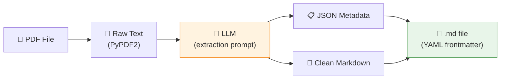

=====

## Slide: The Extraction Pipeline
- type: card-single
- title: The Full **Extraction Pipeline**
- subtitle: From folder of PDFs to structured database

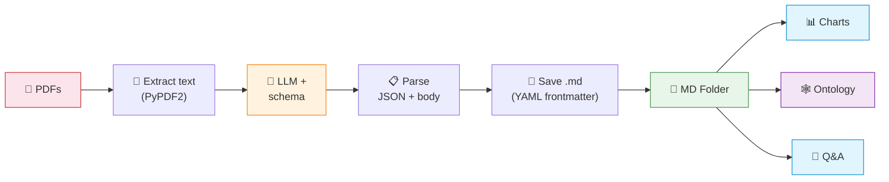

- highlight-quote: "The pipeline transforms a folder of unstructured PDFs into a queryable, visualizable research database."

=====

## Slide: What You Can Generate
- type: cards
- title: What You Can **Generate** from Metadata
- subtitle: The real power — turning data into research intelligence

- card(blue, 📅): Temporal Analysis
  - **Publication frequency by year** → is the field growing or declining?
  - **Method evolution over time** → which approaches are gaining traction?
  - **Trend prediction** → based on current trajectory, what's next?

- card(green, 👤): Author & Source Analysis
  - **Author frequency** → who are the key researchers?
  - **Journal distribution** → where is the field being published?
  - **Collaboration networks** → who works with whom?
  - **Citation patterns** → which papers are most referenced?

- card(orange, 🔑): Keyword & Topic Analysis
  - **Keyword frequency** → what are the dominant topics?
  - **Keyword co-occurrence** → which topics appear together?
  - **Topic correlation** → how do subfields relate?
  - **Emerging keywords** → new terms appearing in recent papers

- card(purple, 🕸️): Knowledge Ontology
  - **Field → Method → Finding** hierarchy
  - **Research gap identification** → what's NOT being studied?
  - **Cross-disciplinary connections** → unexpected overlaps between fields
  - **Future direction synthesis** → combining trends to predict opportunities

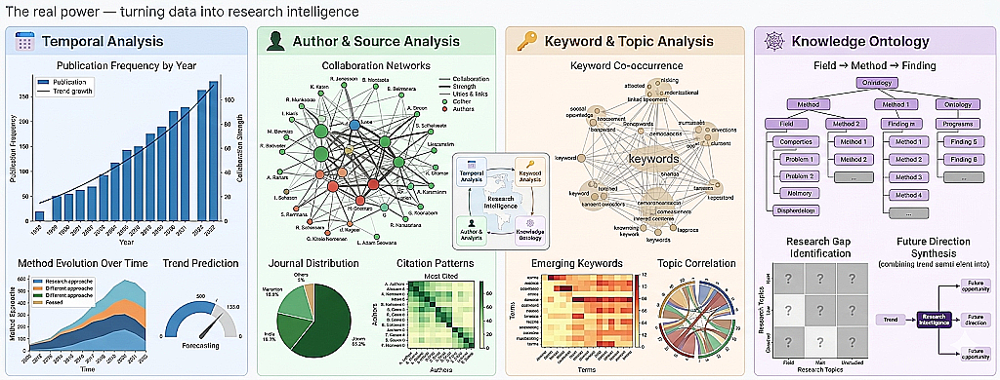

=====

## Slide: Example Visualizations
- type: card-single
- title: Example — **What the Output Looks Like**
- subtitle: These are generated automatically from extracted metadata

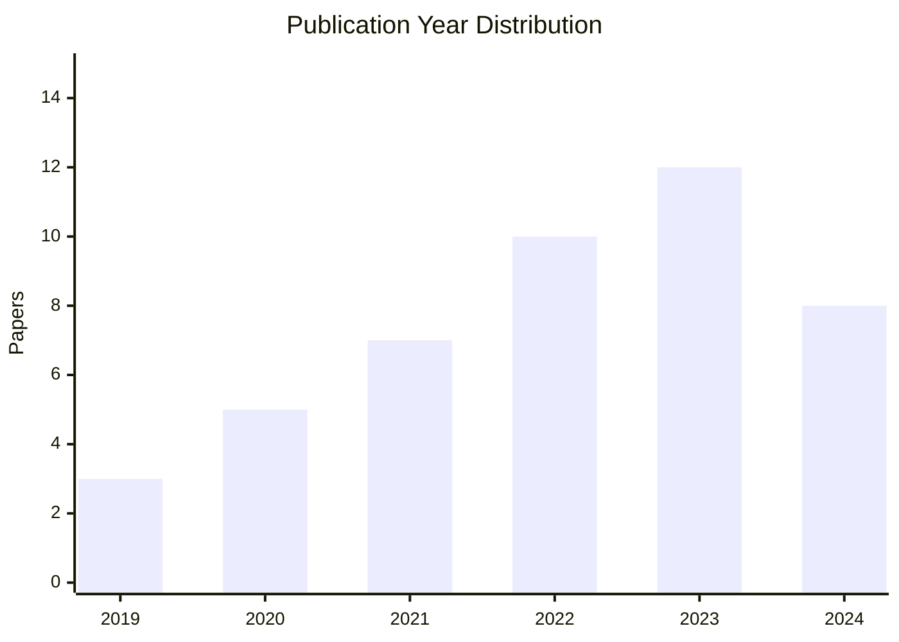

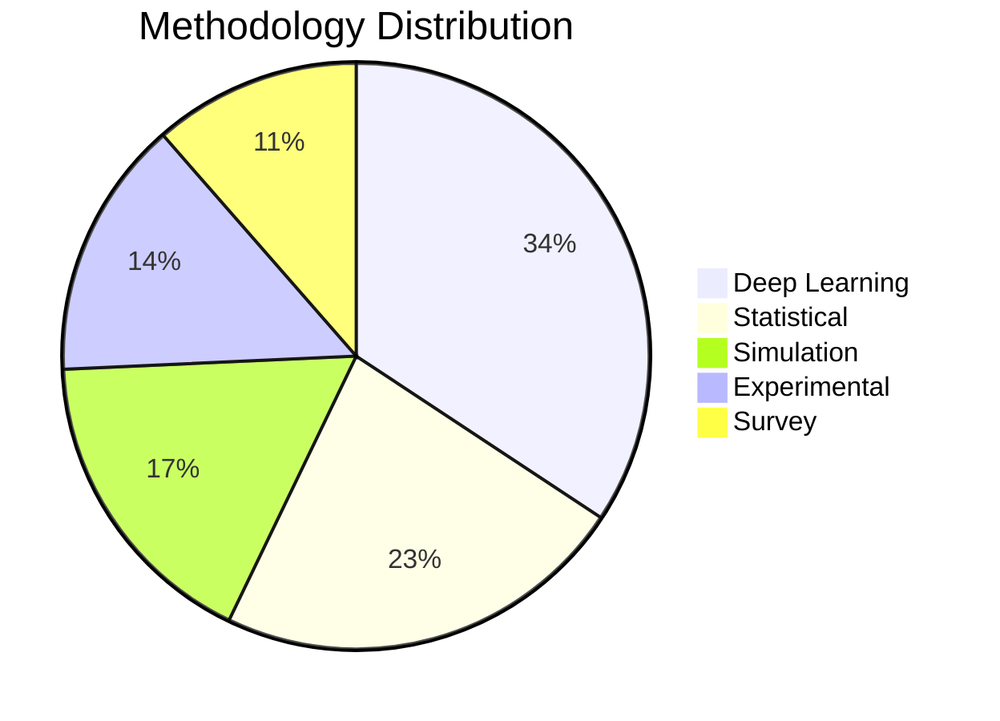

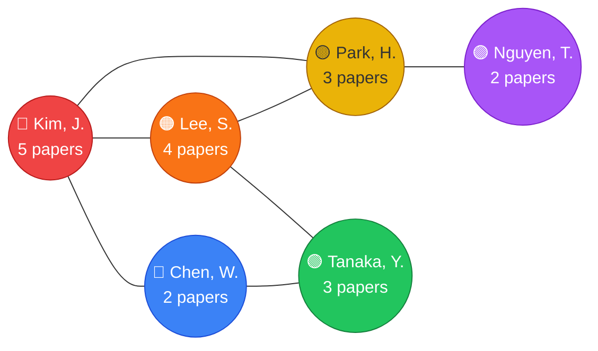

=====

## Slide: Analysis Strategy
- type: cards
- title: From Data to **Insight** — Analysis Strategy
- subtitle: A 4-level framework for metadata-driven research intelligence

- card(blue, 📊): Level 1 — Descriptive (What?)
  - Count, frequency, distribution of basic metadata fields
  - "How many papers per year?", "What are the top 10 keywords?"
  - Charts: bar charts, histograms, word clouds
  - **Tool**: simple counting and grouping

- card(green, 🔍): Level 2 — Comparative (How different?)
  - Cross-field comparisons, methodology vs outcome analysis
  - "Do DL papers cite more than traditional ML papers?"
  - "How do methods differ between journals?"
  - **Tool**: pivot tables, grouped bar charts

- card(orange, 🔗): Level 3 — Relational (How connected?)
  - Co-occurrence networks, citation graphs, topic correlation
  - "Which keywords always appear together?"
  - "Which authors bridge two research communities?"
  - **Tool**: network graphs, ontology diagrams

- card(purple, 🔮): Level 4 — Predictive (What's next?)
  - Trend extrapolation, gap identification, opportunity mapping
  - "Based on 5 years of data, what will the hot topics be in 2027?"
  - "Where are the unexplored intersections between fields?"
  - **Tool**: LLM-powered analysis + human judgment

- highlight-quote: "Levels 1-3 are computation (let AI do it). Level 4 is judgment (the human's role). This is Week 4's principle in action."

=====

## Slide: Data Normalization
- type: cards
- title: The Hidden Challenge — **Data Normalization**
- subtitle: LLMs extract text, but the same entity can appear in many forms

- card(red, ⚠️): The Problem — Author Names
  - "Kim, J." / "J. Kim" / "Joon Kim" / "KIM, JOON" → same person!
  - "Lee, S." — is it Sungmin Lee or Soyoung Lee?
  - Without normalization, your author network has **duplicate nodes**
  - Same issue for: journal names, keywords, institutions

- card(green, ✅): The Solution — Normalize After Extraction
  - **Case normalization**: "KIM, SOYEON" → "Soyeon Kim"
  - **Name order**: "Kim, Soyeon" → "Soyeon Kim" (unify to First Last)
  - **Punctuation cleanup**: remove dots, hyphens→space, trim brackets
  - **Keyword unification**: "deep learning" / "Deep Learning" / "DL" → "deep learning"

- card(blue, 💻): In Code — `normalize_author()`
  - Input: any author name format from the LLM
  - Output: consistent **full name** in Title Case
  - Applied **before** counting, charting, and network building
  - Same pattern works for keywords, journals, etc.

- highlight-quote: "Garbage in, garbage out — even if your LLM extraction is perfect, inconsistent names will ruin your analysis."

=====

## Slide: Customizing the Schema
- type: practice
- title: Customizing the **Extraction Schema**
- subtitle: The schema defines what data you get — tailor it to YOUR research

```text
# Default schema (works for most papers)
- title: Paper title
- authors: List of author names
- year: Publication year
- journal: Journal or conference name
- keywords: Key phrases
- abstract: The abstract
- methodology: Primary research method
- key_findings: 1-2 sentence summary

# Example: Materials Science custom fields
- material_system: Primary material studied
- synthesis_method: How the material was made
- characterization_tools: Equipment used (XRD, SEM, TEM, etc.)
- performance_metric: Key performance number and unit

# Example: Machine Learning custom fields
- dataset: Dataset used for training/evaluation
- model_architecture: Neural network architecture
- baseline_comparison: What was compared against
- accuracy_metric: Best reported accuracy/F1/BLEU score
```

- card(yellow, 💡): Design Your Own Schema
  - Think: what metadata would make YOUR literature review easier?
  - Add fields specific to your field — the LLM will try to extract them
  - More specific schema → more useful metadata → better analysis
  - This is **prompt engineering** (Week 3) applied to data extraction

=====

## Slide: Lecture Summary
- type: cards
- title: Lecture Summary — From PDF to Insight
- subtitle: Key takeaways

- card(blue, 📄): PDF → Markdown
  - PDFs trap data in visual format; Markdown makes it **AI-ready**
  - YAML frontmatter stores **structured metadata** alongside the content
  - LLM extracts metadata from raw text — approximate but powerful

- card(green, 📊): Metadata → Analysis
  - With structured metadata, you can count, compare, connect, and predict
  - 4 levels: Descriptive → Comparative → Relational → Predictive
  - Levels 1-3 are computation; Level 4 is human judgment

- card(orange, 🎯): The Big Picture
  - Week 5: you built a PDF viewer (read and chat)
  - Week 6: you build a PDF pipeline (extract, structure, analyze)
  - The difference: **persistent, queryable, computable data**

=====

# Part 2: Practice

## Slide: Practice
- type: title
- title: Part 2: **Practice**
- subtitle: Build a PDF Data Extraction Pipeline — Streamlit Web App

=====

## Slide: Practice Overview
- type: cards
- title: What We'll **Build** Today
- subtitle: A 4-tab Streamlit app for end-to-end paper analysis

- card(blue, 🎯): The Goal
  - **Tab 1 — Extract**: Upload PDFs → LLM extracts metadata → saves as `.md` files
  - **Tab 2 — Metadata Table**: View all extracted metadata as a table + download CSV
  - **Tab 3 — Charts & Ontology**: Year/field/method distributions + keyword network
  - **Tab 4 — Q&A**: Chat about your paper collection using extracted data

- card(green, 🛠️): Tech Stack
  - **Streamlit** — web framework (same as Week 5)
  - **PyPDF2** — PDF text extraction
  - **Pandas** — data tables and CSV export
  - **OpenAI client** — LLM calls (Gemini / Ollama)

- card(orange, 📁): Project Structure
  - `app.py` — Main Streamlit app (4 tabs)
  - `pdf_to_md.py` — PDF → Markdown converter with LLM extraction
  - `llm_client.py` — LLM client (extraction + chat)
  - `chart_generator.py` — Charts and ontology from metadata
  - `pdfs/` — input folder (put your PDFs here)
  - `md_output/` — output folder (generated .md files)

- flow: Upload PDFs → LLM Extracts → Save .md → Charts & Ontology → Q&A

=====

## Slide: Setup
- type: practice
- title: Step 0 — **Setup**
- subtitle: Install dependencies and prepare folders

```bash
cd practices/week_06
pip install streamlit PyPDF2 openai python-dotenv pandas
```

```text
practices/week_06/
  app.py                # Main Streamlit app
  pdf_to_md.py          # PDF → MD conversion
  llm_client.py         # LLM client
  chart_generator.py    # Visualization generators
  pdfs/                 # Put your PDF files here
  md_output/            # Generated .md files (auto-created)
```

- card(yellow, 💡): Reuse Your API Keys
  - Copy `.env` from Week 5 (or `practices/.env`)
  - Same Gemini / Ollama setup — no new configuration needed
  - Prepare **3-5 PDF papers** from your research for testing

=====

## Slide: PDF to Markdown
- type: practice
- title: Step 1 — **PDF → Markdown Converter** (`pdf_to_md.py`)
- subtitle: Extract text, send to LLM, parse response, save as .md

```python
# pdf_to_md.py (key functions)
from PyPDF2 import PdfReader
import json, os

def extract_pdf_text(pdf_path):
    reader = PdfReader(pdf_path)
    return "\n".join(p.extract_text() or "" for p in reader.pages)

def build_extraction_prompt(raw_text, user_schema):
    return f"""Extract metadata as JSON + body as Markdown.
## Schema: {user_schema}
## Output: ```json {{ ... }} ``` ---BODY--- (markdown body)
## Paper Text: {raw_text[:30000]}"""

def parse_llm_response(response_text):
    metadata = {}
    if "```json" in response_text:
        json_str = response_text.split("```json")[1].split("```")[0]
        metadata = json.loads(json_str)
    body = response_text.split("---BODY---")[1] if "---BODY---" in response_text else ""
    return metadata, body.strip()

def save_markdown(output_dir, filename, metadata, body):
    """Save as .md with YAML frontmatter (lists as indented items)."""
    lines = ["---"]
    for k, v in metadata.items():
        if isinstance(v, list):
            lines.append(f"{k}:")
            for item in v: lines.append(f'  - "{item}"')
        else:
            lines.append(f'{k}: "{v}"')
    lines.extend(["---", "", body])
    md_path = os.path.join(output_dir, filename.replace(".pdf", ".md"))
    with open(md_path, "w", encoding="utf-8") as f:
        f.write("\n".join(lines))
    return md_path

def load_all_metadata(md_dir):
    """Load YAML frontmatter from all .md files (supports list fields)."""
    all_meta = []
    for fname in sorted(os.listdir(md_dir)):
        if not fname.endswith(".md"): continue
        with open(os.path.join(md_dir, fname), encoding="utf-8") as f:
            content = f.read()
        if not content.startswith("---"): continue
        parts = content.split("---", 2)
        meta, current_key, current_list = {"_filename": fname}, None, []
        for line in parts[1].strip().split("\n"):
            if line.startswith("  - "):          # list item
                current_list.append(line.strip()[2:].strip('"'))
            else:
                if current_key and current_list:  # save previous list
                    meta[current_key] = json.dumps(current_list)
                    current_list = []
                if ": " in line:
                    k, v = line.split(": ", 1)
                    v = v.strip().strip('"')
                    if v in ("", "|"): current_key = k
                    else: meta[k] = v; current_key = None
                elif line.endswith(":"):          # key with list below
                    current_key = line[:-1].strip()
                else: current_key = None
        if current_key and current_list:
            meta[current_key] = json.dumps(current_list)
        all_meta.append(meta)
    return all_meta
```

=====

## Slide: LLM Client
- type: practice
- title: Step 2 — **LLM Client** (`llm_client.py`)
- subtitle: Two functions — one for extraction, one for Q&A chat

```python
# llm_client.py
from openai import OpenAI
import os
from dotenv import load_dotenv
load_dotenv()

def get_client(provider="Gemini"):
    # Same as Week 5 — Gemini / Ollama / OpenAI
    ...

def extract_metadata(client, model, raw_text, prompt):
    """One-shot extraction — no streaming needed."""
    response = client.chat.completions.create(
        model=model,
        messages=[
            {"role": "system", "content": "You are a precise metadata extractor."},
            {"role": "user", "content": prompt}
        ],
        max_tokens=4096,
    )
    return response.choices[0].message.content

def chat_with_data(client, model, context, user_message, history):
    """Chat about extracted data — streaming."""
    system_msg = f"""You are a research data analyst.
    Use the paper metadata below to answer questions.
    # Paper Data\n{context}"""
    messages = [{"role": "system", "content": system_msg}]
    messages.extend(history)
    messages.append({"role": "user", "content": user_message})
    return client.chat.completions.create(
        model=model, messages=messages, stream=True)
```

- card(yellow, 💡): Two LLM Modes
  - **Extraction** (Tab 1): single call, no streaming, structured output → `extract_metadata()`
  - **Q&A** (Tab 4): multi-turn chat, streaming, conversational → `chat_with_data()`
  - Same LLM, different system prompts → different behavior (Week 3 principle!)

=====

## Slide: Chart Generator
- type: practice
- title: Step 3 — **Chart Generator** (`chart_generator.py`)
- subtitle: Turn metadata into visualizations

```python
# chart_generator.py
from collections import Counter
import json, re

def normalize_author(name):
    """Normalize author name — keep full name, clean formatting."""
    name = name.strip().strip('"').replace(".", "").replace("-", " ")
    name = re.sub(r"[\d()\[\]{}*]", "", name)
    name = " ".join(name.split())
    if "," in name:  # "Last, First" → "First Last"
        parts = [p.strip() for p in name.split(",", 1)]
        name = f"{parts[1]} {parts[0]}".strip()
    return name.title()

def normalize_authors_list(authors_raw):
    """Parse and normalize author list from metadata."""
    if isinstance(authors_raw, list): names = authors_raw
    elif isinstance(authors_raw, str):
        try: names = json.loads(authors_raw.replace("'", '"'))
        except: names = [n.strip() for n in authors_raw.split(",")]
    else: return []
    return [normalize_author(n) for n in names if n.strip()]

def author_cooccurrence(metadata_list):
    """Build co-authorship edges + author counts."""
    edges, author_count = Counter(), Counter()
    for meta in metadata_list:
        authors = normalize_authors_list(meta.get("authors", "[]"))
        for a in authors: author_count[a] += 1
        for i, a1 in enumerate(authors):
            for a2 in authors[i+1:]:
                edges[tuple(sorted([a1, a2]))] += 1
    return {"edges": [{"source": s, "target": t, "weight": w}
            for (s, t), w in edges.most_common(30)],
            "counts": dict(author_count.most_common(20))}

def count_by_field(metadata_list, field):
    """Count occurrences of a metadata field."""
    counter = Counter()
    for meta in metadata_list:
        counter[meta.get(field, "Unknown")] += 1
    return dict(counter.most_common(20))

def year_distribution(metadata_list):
    """Count papers per year."""
    counter = Counter()
    for meta in metadata_list:
        try: counter[int(meta.get("year", 0))] += 1
        except: pass
    return dict(sorted(counter.items()))

def build_keyword_cooccurrence(metadata_list):
    """Build keyword co-occurrence pairs."""
    # ... (same pattern as author_cooccurrence)

def generate_mermaid_ontology(metadata_list, center_topic="Research"):
    """Generate Mermaid graph from fields, methods, keywords."""
    # ... graph TD with CENTER → top fields/methods/keywords

def generate_mermaid_author_network(metadata_list):
    """Generate Mermaid graph showing author collaboration network."""
    data = author_cooccurrence(metadata_list)
    lines = ["graph LR"]
    for i, (author, cnt) in enumerate(data["counts"].items()):
        lines.append(f'    A{i}(("{author}<br>{cnt} papers"))')
    for edge in data["edges"]:
        # Connect co-authors with --- edges
        ...
    return "\n".join(lines)
```

=====

## Slide: App Tab 1 — Extract
- type: practice
- title: Step 4 — **Tab 1: Extract** (`app.py`)
- subtitle: Upload PDFs → LLM extracts metadata → saves as .md files

```python
# app.py — Tab 1 (Extract)
with tab1:
    st.header("PDF → Markdown Extraction")

    pdf_files = os.listdir(PDF_DIR)  # List PDFs in folder
    md_files = os.listdir(MD_DIR)    # List already-extracted MDs

    # Show status per PDF
    for pdf_name in pdf_files:
        md_name = pdf_name.replace(".pdf", ".md")
        status = "✅" if md_name in md_files else "⏳"
        st.markdown(f"- `{pdf_name}` — {status}")

    if st.button("🚀 Extract All Pending"):
        progress = st.progress(0)
        for i, pdf_name in enumerate(pending_pdfs):
            progress.progress(i / len(pending_pdfs), f"Extracting: {pdf_name}")

            raw_text = extract_pdf_text(os.path.join(PDF_DIR, pdf_name))
            prompt = build_extraction_prompt(raw_text, user_schema)
            response = extract_metadata(client, model, raw_text, prompt)
            metadata, body = parse_llm_response(response)
            save_markdown(MD_DIR, pdf_name, metadata, body)

        st.rerun()
```

- card(yellow, 💡): Batch Processing
  - Unlike Week 5 (one PDF at a time in chat), Week 6 processes **all PDFs in a pipeline**
  - Progress bar shows extraction status for each file
  - Results persist in `md_output/` — no re-extraction needed on reload

=====

## Slide: App Tab 2 and 3
- type: practice
- title: Step 5 — **Tab 2: Table** & **Tab 3: Charts**
- subtitle: View, export, and visualize extracted metadata

```python
# app.py — Tab 2 (Metadata Table)
with tab2:
    all_meta = load_all_metadata(MD_DIR)
    df = pd.DataFrame(all_meta)
    st.dataframe(df, use_container_width=True)
    st.download_button("📥 Download CSV", df.to_csv(), "metadata.csv")

# app.py — Tab 3 (Charts & Ontology)  — uses altair for horizontal bar charts
import altair as alt
with tab3:
    # Year distribution (horizontal bar chart)
    year_data = year_distribution(all_meta)
    df = pd.DataFrame(year_data.items(), columns=["Year", "Count"])
    df["Year"] = df["Year"].astype(str)
    chart = alt.Chart(df).mark_bar().encode(
        y=alt.Y("Year:N", sort="-x"), x="Count:Q")
    st.altair_chart(chart, use_container_width=True)

    # Author collaboration network (normalized full names)
    author_mermaid = generate_mermaid_author_network(all_meta)
    st.code(author_mermaid, language="mermaid")
    author_data = author_cooccurrence(all_meta)
    st.dataframe(pd.DataFrame(author_data["counts"].items(),
                               columns=["Author", "Papers"]))

    # Field / Methodology distribution (horizontal bar charts)
    for field, label in [("research_field", "Field"), ("methodology", "Method")]:
        data = count_by_field(all_meta, field)
        df = pd.DataFrame(data.items(), columns=[label, "Count"])
        chart = alt.Chart(df).mark_bar().encode(
            y=alt.Y(f"{label}:N", sort="-x"), x="Count:Q")
        st.altair_chart(chart, use_container_width=True)

    # Knowledge ontology + Keyword co-occurrence (same as before)
    st.code(generate_mermaid_ontology(all_meta), language="mermaid")
    st.dataframe(pd.DataFrame(build_keyword_cooccurrence(all_meta)))
```

=====

## Slide: App Tab 4 — Q&A
- type: practice
- title: Step 6 — **Tab 4: Q&A** on Your Paper Collection
- subtitle: Chat with AI about all your extracted papers

```python
# app.py — Tab 4 (Q&A)
with tab4:
    # Build context from all metadata
    context = "\n\n".join(
        f"### {m.get('title')}\n" +
        "\n".join(f"- **{k}**: {v}" for k, v in m.items())
        for m in all_meta
    )

    # Quick analysis buttons
    quick_prompts = {
        "📊 Trend Analysis": "Analyze temporal trends...",
        "🔍 Common Themes": "What common themes...",
        "⚡ Research Gaps": "Identify 3-5 gaps...",
        "🔀 Cross-Pollination": "Find unexpected connections...",
    }
    for label, template in quick_prompts.items():
        if st.button(label):
            # Send template as prompt → stream response
            ...

    # Chat input (same streaming pattern as Week 5)
    if prompt := st.chat_input("Ask about your papers..."):
        stream = chat_with_data(client, model, context, prompt, history)
        for chunk in stream:
            ...  # stream to placeholder
```

- card(yellow, 💡): Metadata as Context
  - Week 5: injected **full PDF text** into system prompt (huge, limited to 2-3 papers)
  - Week 6: injects **extracted metadata** (compact, scales to 50+ papers)
  - Structured metadata = **more papers in less tokens** = better analysis

=====

## Slide: Architecture Diagram
- type: card-single
- title: Full Pipeline — **Architecture**
- subtitle: From raw PDFs to interactive research intelligence

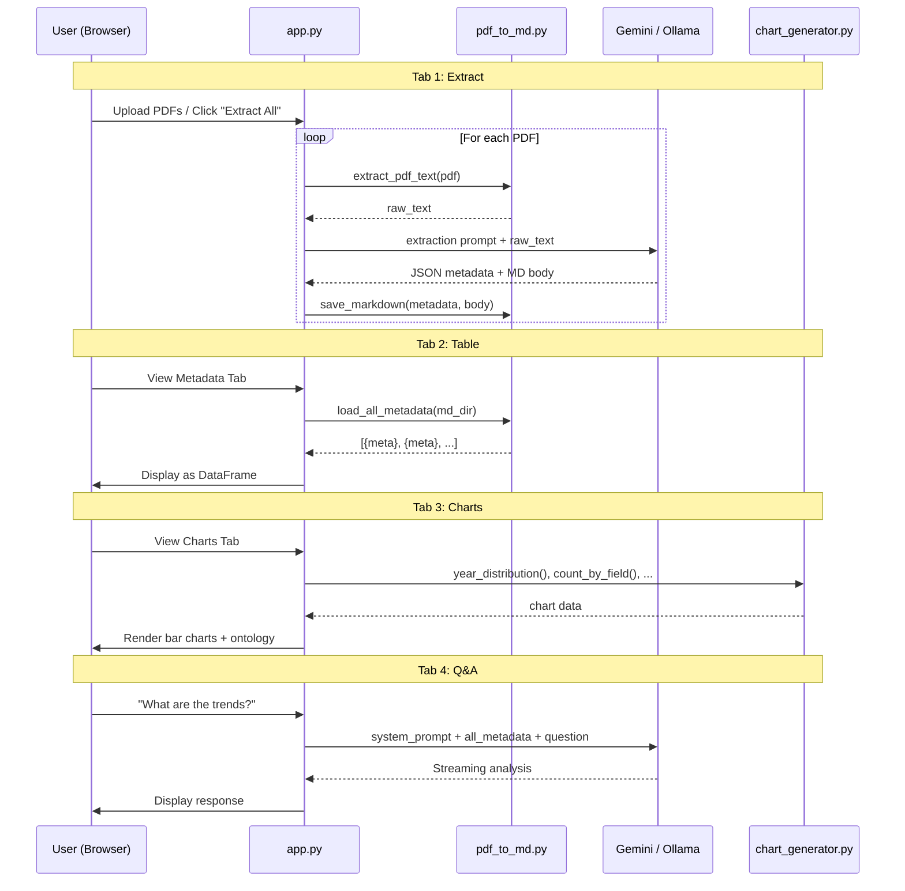

=====

## Slide: Running the App
- type: practice
- title: Step 7 — **Run and Test**
- subtitle: Launch the app and process your papers

```bash
cd practices/week_06
streamlit run app.py
```

```text
Expected UI (4 tabs):
┌──────────────────────────────────────────────────────┐
│ [1️⃣ Extract] [2️⃣ Metadata Table] [3️⃣ Charts] [4️⃣ Q&A] │
│                                                      │
│  Tab 1 — PDF → Markdown Extraction                   │
│                                                      │
│  📁 PDF Files:                                       │
│  - paper1.pdf — ✅ Extracted                         │
│  - paper2.pdf — ✅ Extracted                         │
│  - paper3.pdf — ⏳ Pending                           │
│                                                      │
│  [🚀 Extract All Pending (1)]  [🔄 Re-extract All]   │
│                                                      │
│  Processing Log:                                     │
│  ✅ paper1.pdf → paper1.md                           │
│  ✅ paper2.pdf → paper2.md                           │
└──────────────────────────────────────────────────────┘
```

- card(yellow, 💡): Testing Tips
  - Start with **3-5 short papers** (< 10 pages each) for faster extraction
  - Check `md_output/` folder to verify YAML frontmatter is correct
  - If metadata looks wrong, try **editing the schema** in the sidebar for clearer instructions
  - Gemini works best for extraction (large context window)

=====

## Slide: Screen Shots
- type: cards
- title: Screen Shots of the App
- subtitle: Views of the app and process your papers

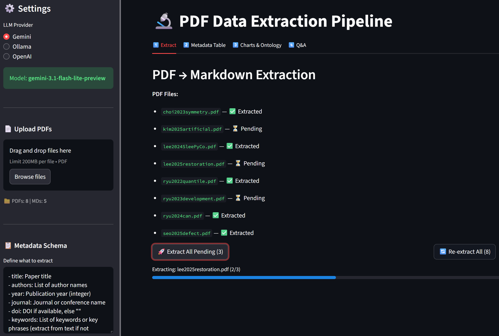

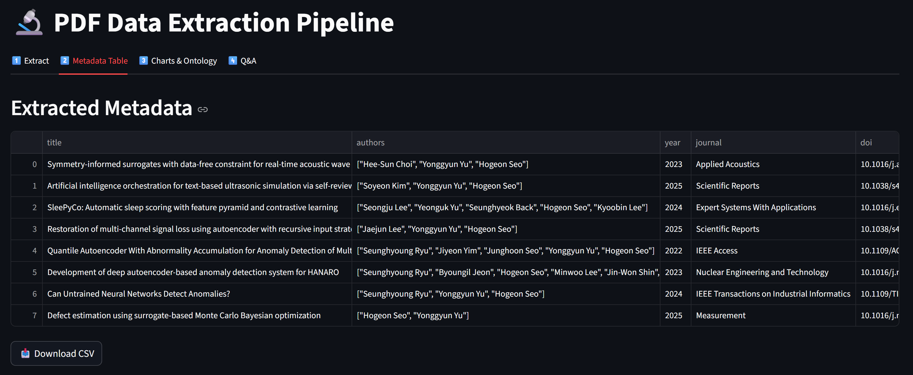

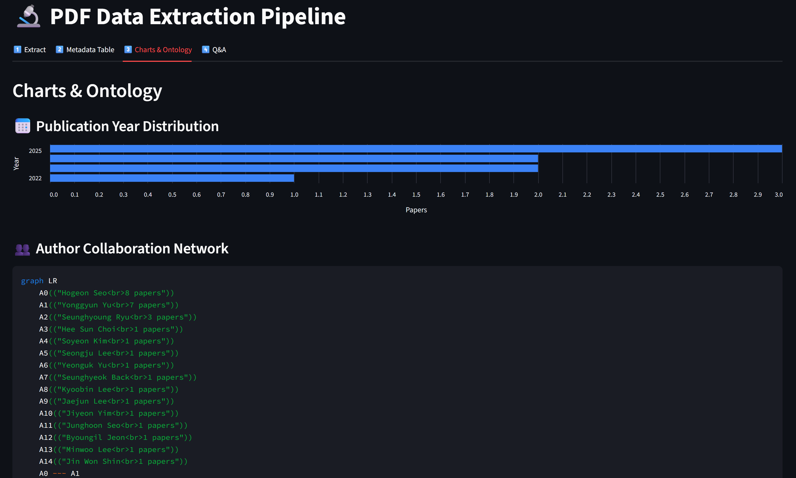

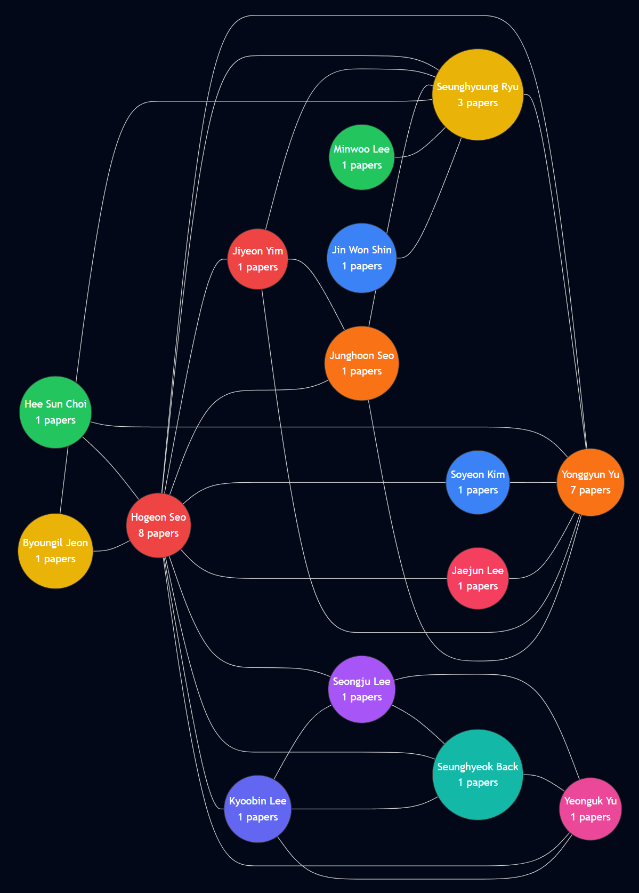

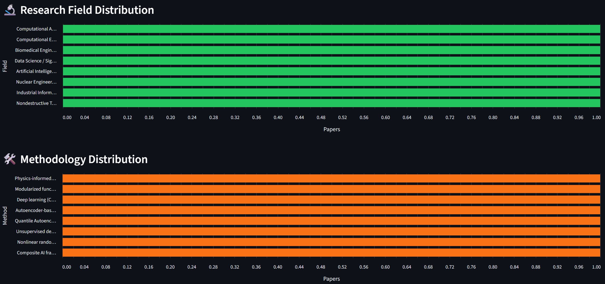

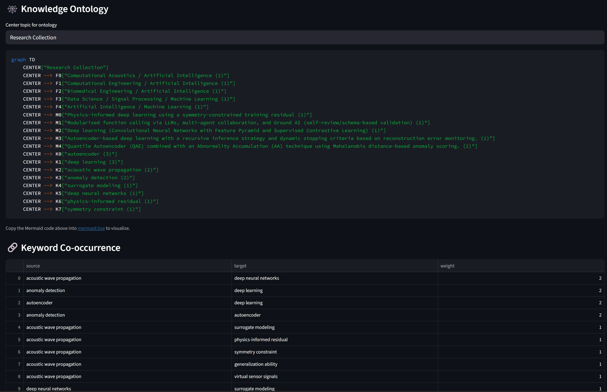

=====

## Slide: Practice Checklist
- type: card-single
- title: ✅ **Practice Checklist**
- subtitle: Complete these tasks during the hands-on session

- card(green, 📋): Checklist
  - [ ] Set up `.env` and prepare **3-5 PDF papers** in `pdfs/` folder
  - [ ] Create all 4 files: `app.py`, `pdf_to_md.py`, `llm_client.py`, `chart_generator.py`
  - [ ] Run `streamlit run app.py` and verify the 4-tab UI loads
  - [ ] **Tab 1**: Extract all PDFs → verify `.md` files appear in `md_output/`
  - [ ] Open a `.md` file and verify YAML frontmatter has correct metadata
  - [ ] **Tab 2**: View metadata table → download CSV
  - [ ] **Tab 3**: Check year/field/method charts → view ontology Mermaid code
  - [ ] **Tab 4**: Ask a question about your paper collection → verify AI references specific papers
  - [ ] (Bonus) **Customize the schema** for your research field and re-extract
  - [ ] (Bonus) Use a **quick analysis** button (Trend Analysis, Research Gaps)
  - [ ] (Bonus) Compare results between Gemini and Ollama

=====

# Part 3: Discussion

## Slide: Discussion
- type: title
- title: Part 3: **Discussion**
- subtitle: Core Competency & Midterm Progress

=====

## Slide: Discussion Topic
- type: cards
- title: Core Competency — **The "Irreplaceable" Researcher**
- subtitle: "In an era where AI conducts experiments and writes papers, what is the irreplaceable skill of a researcher?"

- card(red, 🦾): Iron Man — Visionary Architect
  - "The irreplaceable core competency is acting as the **visionary architect** of the blueprint"
  - "Let the algorithms grind through the data swamps; human genius is strictly reserved for asking the **universe-breaking questions**"
  - Key idea: **problem selection** > problem solving

- card(blue, 🛡️): Captain America — Moral Integrity
  - "The irreplaceable core competency is the **unwavering moral integrity** and personal accountability required to seek the objective truth"
  - "Relying on AI as a crutch threatens to erode the **fundamental critical thinking** and honest hard work"
  - Key idea: **ethical responsibility** > speed

- card(green, 🧪): Hulk — Skeptical Validator
  - "The irreplaceable core competency is **rigorous, skeptical validation** — acting as the ultimate fail-safe against unchecked automated systems"
  - "We *must* mandate exhaustive **human oversight** at every procedural juncture"
  - Key idea: **verification** > trust

=====

## Slide: Discussion Framing
- type: cards
- title: Three Views, One Question — **Where Do You Stand?**
- subtitle: Each AI agent reflects a real debate in the research community

- card(orange, 🔥): The Tension
  - Iron Man says: **aim the blast** — your value is in choosing what to research
  - Captain America says: **hold the line** — your value is in doing it honestly
  - Hulk says: **check the output** — your value is in catching AI's mistakes
  - Are these complementary or contradictory?

- card(purple, 🔬): Connect to Your Experience
  - Which view best matches your **daily research reality**?
  - Has AI already changed what skills matter in YOUR field?
  - What skill do you use that you believe AI **cannot** learn?

- highlight-quote: "Now let's see what YOU said — and where the class converged and diverged."

=====

## Slide: Your Responses Overview
- type: cards
- title: Your Responses — **The Class Map**
- subtitle: 17 responses — most of you agreed with all three, but the interesting part is WHERE you disagreed

- card(green, 📊): The Numbers
  - **All three (1+2+3)**: Huy, Yadanar, Irfan, Waad, Tan, DongYun, Nazhiefah — "all three are complementary"
  - **Iron Man + Hulk (1+3)**: Seher, Gyeongsu, Minh — "vision + validation, skip the lecture on virtue"
  - **Captain America + Hulk (2+3)**: Manuella, Ly — "judgment + ethics, not just big ideas"
  - **Hulk only (3)**: Namcheol, Rupam, Hyunwoo — "validation is THE core skill"
  - **Captain America (2)**: Margareth — "ethics is hardest to replace"

- card(red, 🔥): The Provocateur
  - **Han**: "All three are partially right and **collectively miss the point**"
  - Introduced a new concept: **"cultivated epistemic taste"**
  - "That taste only develops through doing the work AI is now replacing"
  - This challenges the entire premise — are we losing the very skill we claim is irreplaceable?

=====

## Slide: Theme 1
- type: cards
- title: Theme 1 — **Hulk Wins the Vote**
- subtitle: Skeptical validation emerged as the class's top priority

- card(green, 🧪): The Consensus
  - Every single response included validation as essential — Hulk's view was universally endorsed
  - **Jaewhoon**: "Computer is deterministic, AI is **probabilistic** — that's why we must check"
  - **Namcheol**: "The researcher must know when to pull the **emergency stop button**"
  - **Hyunwoo**: "In robotics, we must cross-reference AI outputs against **physical reality**"

- card(blue, 🧠): Why This Matters
  - **Rupam**: "Skepticism is **intrinsic** — it's not something that can be easily taught or programmed"
  - **Minh**: "Strategic Synthesis — bridging 'what can be simulated' and 'what should be built'"
  - **Huy**: "We do not need to **compete** with AI but rather **judge** it"
  - The class is saying: validation isn't just checking boxes — it requires deep domain knowledge

=====

## Slide: Theme 2
- type: cards
- title: Theme 2 — **The Captain America Debate**
- subtitle: The most divisive AI agent — is "doing things the hard way" valuable or outdated?

- card(red, ❌): The Critics
  - **Gyeongsu**: "Efficiency isn't a **moral flaw**. Sticking to manual labor just for tradition is a speed bump"
  - **Rupam**: "We cannot dismiss AI because it is fast — that argument feels **illogical**"
  - Both argue: integrity matters, but Captain America wrongly equates slowness with virtue

- card(blue, ✅): The Defenders
  - **Margareth**: "Ethics and moral integrity are the aspects **hardest to replace** with AI"
  - **Nazhiefah**: "Rather than speed everything, the **process of research itself** is the important thing"
  - **Ly**: "The researcher must act as an **ethical anchor** and guardian of scientific validity"

- card(orange, 🔑): The Synthesis
  - **Han** resolved the tension: "epistemic taste only develops through doing the work AI is replacing — **struggling through calculations, debugging by hand, reading papers slowly**"
  - This reframes Captain America: it's not about virtue — it's about **building the judgment you need**
  - If you skip the hard work, you lose the ability to validate (connecting Theme 1 and 2)

=====

## Slide: Theme 3
- type: cards
- title: Theme 3 — **Han's Challenge**
- subtitle: "If you outsource the friction, you become someone who can't read the blueprints"

- card(purple, 💎): Cultivated Epistemic Taste
  - Han's concept: the judgment to know which questions are worth asking, which results matter
  - "It's built from years of **wrestling** directly with a domain's hardest problems"
  - "AI can optimize within a search space; it cannot reliably **define** the right search space"

- card(red, ⚠️): The Paradox
  - The skill we need most (judgment) is built through the work we're outsourcing to AI
  - **Nazhiefah** echoed this: "we sometimes want quick results but are lazy to do boring stuff"
  - **Jaewhoon**: like a grad assistant that hallucinates — if the PI doesn't check, the PI takes the blame
  - Question: how do we develop epistemic taste if AI does all the "boring" foundational work?

- highlight-quote: "If you outsource that friction entirely to stay 'high level,' you don't become a visionary architect. You become someone who can't actually read the blueprints they're supposedly designing." — Han

=====

## Slide: Discussion Activity
- type: cards
- title: 🗣️ **Reflect** — Apply Han's Paradox to Your Midterm
- subtitle: 5 minutes — Think about this tension in YOUR app

- card(blue, 🔬): The Question for You
  - Your midterm app automates some research task with AI
  - Does your app **preserve** the user's ability to develop judgment?
  - Or does it outsource the "friction" that builds expertise?
  - Is there a way to design for **both** efficiency AND skill development?

- card(orange, 💡): Design Principle
  - Consider adding a "learning mode" vs "production mode" to your app
  - Learning mode: shows the AI's reasoning, asks user to verify steps
  - Production mode: runs autonomously for experienced users
  - This resolves Han's paradox — the tool helps you learn AND speeds you up

=====

## Slide: Midterm Progress
- type: cards
- title: Midterm Progress Check
- subtitle: Where should you be right now?

- card(blue, ✅): Done by Now
  - Decided on your project topic and problem statement
  - Drafted the 5-question specification document
  - Identified which LLM provider and framework you'll use

- card(orange, 📝): This Week's Tasks
  - **Refine your spec** based on feedback
  - Start building your **prototype** — even a skeleton UI is progress
  - Consider: can you use today's **extraction pipeline** pattern?

- card(purple, 📅): Upcoming Deadlines
  - **Week 7**: Specification document due (submit on LMS)
  - **Week 8**: Working prototype + 5-minute live demo
  - **Submit by April 17 (Fri) 24:00** → email to hogeony@ust.ac.kr
  - Two weeks left — start coding NOW if you haven't already

=====

## Slide: Discussion Questions
- type: card-single
- title: 🗣️ **Week 6 Discussion Questions** (UST LMS)
- subtitle: Post your response on the forum this week

> Visit: **UST LMS → Class → Discussion**

1. **Core Competency**: Read the three AI agent opinions above. Which perspective do you most agree with, and why? What would you **add** that none of the three agents mentioned? Think about your own research field — what specific skill makes you irreplaceable?
2. Today you learned to extract **structured metadata** from PDFs using LLM. **Design a custom extraction schema** for your specific research field: what 5-8 metadata fields would be most valuable for analyzing papers in YOUR domain? Why these fields?
3. **Midterm progress update**: Share your current specification status. What's your app's name, core problem, and 3 main features? What's your biggest design challenge so far?

=====

## Slide: Recommended Resources
- type: card-single
- title: Want to Learn More?

Data Extraction & Processing
> 📚 [PyPDF2 Documentation](https://pypdf2.readthedocs.io/)
> 📚 [Marker — Best PDF to Markdown Converter](https://github.com/VikParuchuri/marker)
> 📚 [LangChain Document Loaders](https://python.langchain.com/docs/integrations/document_loaders/)
&nbsp;

Metadata & Knowledge Graphs
> 📚 [Semantic Scholar API](https://www.semanticscholar.org/product/api)
> 📚 [OpenAlex — Open Research Knowledge Graph](https://openalex.org/)
> 📚 [YAML Frontmatter Specification](https://jekyllrb.com/docs/front-matter/)
&nbsp;

Visualization
> 📚 [Mermaid.js Documentation](https://mermaid.js.org/)
> 📚 [Streamlit Charts API](https://docs.streamlit.io/develop/api-reference/charts)
> 📚 [Plotly for Python](https://plotly.com/python/)
&nbsp;

Anthropic Free Online Courses (Recommended)
> 🎓 [Building with the Claude API](https://anthropic.skilljar.com/claude-with-the-anthropic-api) — API 활용 실습
> 🎓 [Introduction to Model Context Protocol](https://anthropic.skilljar.com/introduction-to-model-context-protocol) — MCP 서버/클라이언트 구축
> 🎓 [Introduction to Agent Skills](https://anthropic.skilljar.com/introduction-to-agent-skills) — 재사용 가능한 에이전트 스킬 생성
> 🎓 [Claude Code in Action](https://anthropic.skilljar.com/claude-code-in-action) — Claude Code 개발 워크플로 통합
> 🎓 [AI Fluency: Framework & Foundations](https://anthropic.skilljar.com/ai-fluency-framework-foundations) — AI 리터러시 기초

=====

## Slide: Wrap-Up
- type: cards
- title: Wrap-Up of **Week 6**
- subtitle: Three things to remember

- card(blue, 📖): Lecture
  - PDF traps data in visual format; **Markdown + YAML frontmatter** makes it AI-ready; LLM extracts metadata from raw text; 4-level analysis framework (describe → compare → connect → predict)

- card(green, 💻): Practice
  - Built a **4-tab extraction pipeline**: PDF→MD extraction, metadata table, charts/ontology, and Q&A; metadata scales to 50+ papers where full-text chat cannot

- card(orange, 🗣️): Discussion
  - Core Competency: Hulk (validation) won the vote; Captain America was most divisive; Han's "epistemic taste" paradox — outsourcing friction destroys judgment; midterm due **April 17 24:00** via email

**Next week:** Specification document due — finalize your project design and prepare for prototyping in Week 8.
