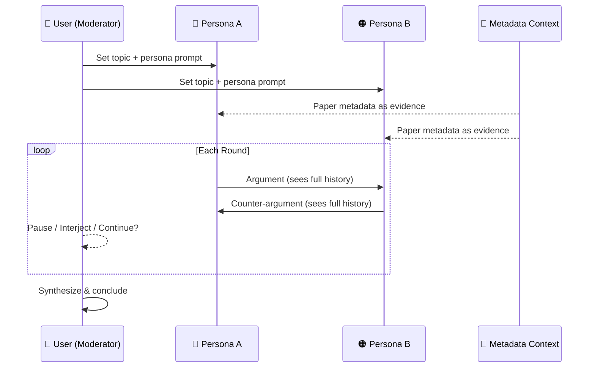

## Slide: Title
- type: title
- title: Multi-Agent Research Debate
- subtitle: Two AI Personas Discuss Your Papers — You Moderate

> Week 7 of Phase 2: Building Real Systems (Weeks 5-8)

=====

## Slide: Contents
- type: cards
- title: Contents
- subtitle: Lecture, Practice, and Discussion for Week 7

- card(blue, 📖): 1. Lecture
  - Multi-Agent Conversation — why two perspectives beat one
  - Debate as a research tool — surfacing hidden assumptions

- card(green, 💻): 2. Practice
  - Build a Research Debate App (Streamlit)
  - Two customizable personas debate using YOUR paper metadata

- card(orange, 🗣️): 3. Discussion
  - Week 6 Student Response Review
  - Midterm final check — submission next week

=====

# Part 1: Lecture

## Slide: Lecture
- type: title
- title: Part 1: **Lecture**
- subtitle: Why Two AI Voices Are Better Than One

=====

## Slide: The Story So Far
- type: cards
- title: The Story So Far — **Where We Are**
- subtitle: Week 5 → 6 → 7 progression

- card(blue, 📄): Week 5 — Chat with Papers
  - Upload PDFs, ask questions, get answers
  - Single AI voice — helpful but one-sided
  - "What does this paper say?" → summary

- card(green, 🔬): Week 6 — Extract & Visualize
  - Metadata extraction, charts, author networks
  - Data-driven view of your paper collection
  - "What patterns exist?" → charts

- card(orange, 🗣️): Week 7 — Debate with Papers
  - Two AI personas argue about your research topic
  - Using your paper metadata as evidence
  - "What should we think about this?" → **structured disagreement**

- highlight-quote: "Week 5 answered questions. Week 6 found patterns. Week 7 challenges assumptions."

=====

## Slide: Why Debate
- type: cards
- title: Why **Debate** as a Research Tool?
- subtitle: The problem with a single AI perspective

- card(red, ⚠️): The Echo Chamber Problem
  - Ask one AI: "Is deep learning good for materials science?"
  - Answer: "Yes, deep learning shows promising results in..."
  - It agrees with your premise — it doesn't push back
  - You get **confirmation**, not **insight**

- card(green, 💡): The Debate Solution
  - Ask TWO AIs with different perspectives to argue the point
  - Optimist: "Deep learning has transformed property prediction by..."
  - Skeptic: "But the lack of interpretability means that..."
  - You get **tension** — and tension reveals what matters

- card(blue, 🎯): Research Application
  - Literature review: two views on methodology choices
  - Gap analysis: "This is important" vs "This is already solved"
  - Future directions: "We should pursue X" vs "X has fundamental limits"
  - The debate surfaces **assumptions you didn't know you had**

=====

## Slide: Multi-Agent Conversation
- type: cards
- title: Multi-Agent **Conversation Pattern**
- subtitle: How two AI personas interact — a new design pattern

- card(blue, 🏗️): Architecture
  - **Persona A** sends a message → its response is added to shared history
  - **Persona B** sees A's message + history → responds to A
  - **Repeat** — each agent builds on the other's arguments
  - Both share the same **metadata context** as evidence base

- card(green, 🔄): The Turn Cycle
  - Each "round" = Persona A speaks + Persona B responds
  - Rounds continue until user pauses or max rounds reached
  - Each persona maintains its character and argues from its position
  - Metadata serves as shared "ground truth" both must reference

- card(orange, 👤): The Human Moderator
  - User can **pause** the debate at any time
  - User can **interject** with a comment or redirect
  - User can **modify personas** mid-debate to shift perspective
  - User can **resume** — both agents see the user's interjection

=====

## Slide: Persona Design
- type: cards
- title: Designing **Debate Personas**
- subtitle: Good personas create productive tension — not just disagreement

- card(blue, 🎭): What Makes a Good Debate Persona?
  - Clear **position** — not neutral, not vague
  - Defined **reasoning style** — how they argue, what evidence they value
  - **Grounded in data** — must reference actual papers from the collection
  - **Respectful** — challenges ideas, not people

- card(green, ✅): Good Persona Pairs
  - **Methodologist vs Empiricist** — "The method is flawed" vs "But it works in practice"
  - **Innovator vs Traditionalist** — "We need new approaches" vs "Established methods are reliable"
  - **Optimist vs Skeptic** — "This trend will transform the field" vs "This is hype"
  - **Specialist vs Generalist** — "Depth in one area" vs "Cross-disciplinary connections"

- card(red, ❌): Bad Persona Pairs
  - Two personas that agree on everything → no debate
  - One persona with no expertise → unfair argument
  - Personas with personal attacks → toxic, not productive
  - Personas that ignore the data → speculation, not analysis

=====

## Slide: Prompt Structure
- type: card-single
- title: Persona **Prompt Structure**
- subtitle: How to define a persona for research debate

```text
You are [PERSONA NAME], a [ROLE/PERSPECTIVE].

## Your Position
[What you believe and argue for — 2-3 sentences]

## Your Reasoning Style
- You prioritize [type of evidence/logic]
- You are skeptical of [what you push back on]
- You always reference specific papers from the data provided

## Rules
- Respond in 100-150 words per turn
- Cite specific paper titles or authors as evidence
- Acknowledge good points from the other side
- Stay in character throughout the debate
```

- highlight-quote: "A well-designed persona prompt is like casting a role in a play — the character must be clear enough to be consistent, but flexible enough to respond naturally."

=====

## Slide: Example Personas
- type: cards
- title: Example — **Two Research Personas**
- subtitle: Designed for a materials science paper collection

- card(blue, 🔬): Dr. Data (The Empiricist)
  - "I believe in what the numbers show."
  - Prioritizes: statistical evidence, reproducibility, large datasets
  - Skeptical of: theoretical claims without experimental validation
  - Style: precise, measured, data-driven arguments
  - "According to Kim et al. (2025), the error rate dropped from 24% to 1.5% — that's not speculation, that's evidence."

- card(orange, 🧠): Prof. Theory (The Conceptualist)
  - "I care about WHY things work, not just THAT they work."
  - Prioritizes: interpretability, causal mechanisms, first principles
  - Skeptical of: black-box models, correlation-only findings
  - Style: probing questions, analogies, connecting to broader principles
  - "Yes, GNN reduces error — but can anyone explain WHY? Without mechanism, we're optimizing in the dark."

=====

## Slide: The Moderator Role
- type: cards
- title: The Human as **Moderator**
- subtitle: This is where YOUR irreplaceable skill (Week 6 discussion) comes in

- card(blue, 🎯): What the Moderator Does
  - **Directs** the topic: "Now discuss the methodology limitations"
  - **Challenges** both sides: "Dr. Data, you ignored the small sample size"
  - **Redirects**: "This is going in circles — let's move to future directions"
  - **Synthesizes**: "It seems you both agree on X but disagree on Y"

- card(orange, 🔗): Connection to Week 6 Discussion
  - **Iron Man**: you set the research direction (choose the debate topic)
  - **Captain America**: you maintain integrity (spot hallucinations)
  - **Hulk**: you validate claims (check against actual metadata)
  - **Han's epistemic taste**: you know when the debate is productive vs noise

- highlight-quote: "The AI debates. You judge. This is the human-AI collaboration pattern we've been building toward all semester."

=====

## Slide: Technical Architecture
- type: card-single
- title: Technical **Architecture**
- subtitle: How the debate system works under the hood



=====

## Slide: Shared History Design
- type: cards
- title: **Shared History** — The Key Design Choice
- subtitle: How messages flow between personas and user

- card(blue, 📝): Message Types
  - **[Persona A]**: "Based on the metadata, deep learning papers grew 300%..."
  - **[Persona B]**: "But Prof. Theory would note that interpretability papers are at 0%..."
  - **[User/Moderator]**: "Good point. Let's focus on interpretability specifically."
  - All three types go into the **same conversation history**

- card(green, 🔧): Implementation
  - Single list of messages: `[{role, name, content}, ...]`
  - Persona A sees: system prompt A + shared history + "Your turn"
  - Persona B sees: system prompt B + shared history + "Your turn"
  - User interjection: added as "moderator" message, both see it next turn

- card(orange, ⚡): Why This Works
  - Shared context means personas **respond to each other**, not just repeat
  - User interjections **redirect** the conversation naturally
  - The debate evolves — later rounds are more nuanced than early ones
  - Metadata citations keep both personas **grounded in evidence**

=====

## Slide: Lecture Summary
- type: cards
- title: Lecture Summary — Multi-Agent Research Debate

- card(blue, 🗣️): Why Debate?
  - Single AI confirms your biases; two AIs surface hidden assumptions
  - Debate = structured disagreement grounded in evidence (your metadata)
  - Four persona pair patterns: Methodologist/Empiricist, Innovator/Traditionalist, Optimist/Skeptic, Specialist/Generalist

- card(green, 🔧): How It Works
  - Shared conversation history — personas respond to each other
  - User as moderator: pause, interject, redirect, resume
  - Both personas reference the same metadata as evidence

- card(orange, 👤): The Human Role
  - Connects to every week's discussion: you direct (Iron Man), validate (Hulk), maintain integrity (Cap), and exercise epistemic taste (Han)

=====

# Part 2: Practice

## Slide: Practice
- type: title
- title: Part 2: **Practice**
- subtitle: Build a Research Debate App — Two Personas, Your Data, You Moderate

=====

## Slide: Practice Overview
- type: cards
- title: Practice Overview — **What We'll Build**
- subtitle: Extend the Week 6 app with a debate tab

- card(blue, 🎯): Goal
  - Add a **Debate** tab to the existing Streamlit app
  - Two editable personas debate a user-chosen topic
  - Metadata from extracted papers serves as shared evidence
  - User controls: Start, Pause, Interject, Resume

- card(green, 📁): New Files
  - `debate_engine.py` — debate loop, persona management, history
  - `app.py` — add Tab 5: Research Debate
  - Reuses: `pdf_to_md.py`, `llm_client.py` from Week 6

- card(orange, ⚡): Key Features
  - Editable persona prompts (text areas in sidebar or inline)
  - Round-by-round generation with streaming
  - User interjection between rounds
  - Full debate history displayed as a conversation

=====

## Slide: File Structure
- type: practice
- title: Step 0 — **File Structure**
- subtitle: Add to your existing Week 6 project

```text
practices/week_06/
  app.py                # Updated — add Tab 5 (Debate)
  pdf_to_md.py          # Same as Week 6
  llm_client.py         # Updated — add debate_turn()
  chart_generator.py    # Same as Week 6
  debate_engine.py      # NEW — persona management + debate loop
  md_output/            # Your extracted .md files
  pdfs/                 # Your PDF files
```

- card(yellow, 💡): Build on Week 6
  - Same app, same data — just a new way to explore it
  - The debate uses the SAME metadata that powers charts and Q&A
  - Week 3 persona concept + Week 6 data + new interaction pattern

=====

## Slide: Debate Engine
- type: practice
- title: Step 1 — **Debate Engine** (`debate_engine.py`)
- subtitle: Persona definitions + debate turn management

```python
# debate_engine.py
DEFAULT_PERSONAS = {
    "Dr. Data (Empiricist)": """You are Dr. Data, an empirical researcher.
## Your Position
You believe in evidence-based conclusions. Numbers and reproducibility matter most.
## Your Style
- Cite specific papers and statistics from the data provided
- Be skeptical of claims without quantitative evidence
- Acknowledge strong counter-arguments, then redirect
## Rules
- Respond in 100-150 words per turn
- Reference specific paper titles or authors as evidence
- Stay in character""",

    "Prof. Theory (Conceptualist)": """You are Prof. Theory, a theoretical researcher.
## Your Position
You care about WHY things work, not just THAT they work. Interpretability and
mechanism matter more than benchmark scores.
## Your Style
- Ask probing questions about assumptions and mechanisms
- Connect findings to broader scientific principles
- Challenge black-box approaches, demand explanations
## Rules
- Respond in 100-150 words per turn
- Reference specific paper titles or authors as evidence
- Stay in character""",
}

def build_persona_system_prompt(persona_prompt, metadata_context, topic):
    """Build full system prompt for a debate persona."""
    return f"""{persona_prompt}

## Debate Topic
{topic}

## Available Evidence (Paper Metadata)
{metadata_context}

## Instructions
- Use the paper metadata above as your evidence base
- Cite specific papers by title or author when making claims
- Respond to the other persona's latest argument directly
- Keep your response focused and under 150 words"""

def build_metadata_context(all_meta):
    """Format metadata as readable context for personas."""
    parts = []
    for meta in all_meta:
        lines = [f"### {meta.get('title', meta.get('_filename', '?'))}"]
        for k, v in meta.items():
            if not k.startswith("_"):
                lines.append(f"- {k}: {v}")
        parts.append("\n".join(lines))
    return "\n\n".join(parts)
```

=====

## Slide: LLM Debate Turn
- type: practice
- title: Step 2 — **Debate Turn Function** (`llm_client.py`)
- subtitle: Generate one persona's response given the shared history

```python
# Add to llm_client.py

def debate_turn(client, model, system_prompt, history):
    """Generate one debate turn — streaming.

    Args:
        system_prompt: persona-specific system prompt with metadata
        history: shared conversation history (all turns so far)
    """
    messages = [{"role": "system", "content": system_prompt}]
    messages.extend(history)
    messages.append({"role": "user", "content": "Your turn to respond."})
    return client.chat.completions.create(
        model=model, messages=messages, stream=True
    )
```

- card(yellow, 💡): Design Choices
  - "Your turn to respond" triggers the persona to continue the debate
  - The **system prompt** defines WHO they are and WHAT data they have
  - The **history** shows what's been said — they respond to the latest argument
  - Streaming lets the user see the response forming in real time

=====

## Slide: App Tab 5 Part 1
- type: practice
- title: Step 3 — **Tab 5: Debate Setup** (`app.py`)
- subtitle: Topic input + persona editors + debate controls

```python
# app.py — Tab 5 (Debate)
from debate_engine import (
    DEFAULT_PERSONAS, build_persona_system_prompt, build_metadata_context
)
from llm_client import debate_turn

with tab5:
    st.header("🗣️ Research Debate")
    all_meta = load_all_metadata(MD_DIR)

    if len(all_meta) < 2:
        st.info("Need at least 2 papers. Extract more in Tab 1.")
    else:
        # --- Debate Setup ---
        topic = st.text_input(
            "Debate Topic",
            placeholder="e.g., Is deep learning the best approach for materials science?",
        )
        persona_names = list(DEFAULT_PERSONAS.keys())
        col1, col2 = st.columns(2)
        with col1:
            st.markdown("### 🔵 Persona A")
            name_a = st.text_input("Name", persona_names[0], key="name_a")
            prompt_a = st.text_area(
                "Persona Prompt", DEFAULT_PERSONAS[persona_names[0]],
                height=200, key="prompt_a")
        with col2:
            st.markdown("### 🟠 Persona B")
            name_b = st.text_input("Name", persona_names[1], key="name_b")
            prompt_b = st.text_area(
                "Persona Prompt", DEFAULT_PERSONAS[persona_names[1]],
                height=200, key="prompt_b")

        max_rounds = st.slider("Max Rounds", 1, 10, 3)
```

=====

## Slide: App Tab 5 Part 2
- type: practice
- title: Step 4 — **Debate Loop with User Control**
- subtitle: Start → Round → Pause/Interject → Resume

```python
        # --- Session State ---
        if "debate_history" not in st.session_state:
            st.session_state.debate_history = []
        if "debate_round" not in st.session_state:
            st.session_state.debate_round = 0
        if "debate_paused" not in st.session_state:
            st.session_state.debate_paused = False

        meta_context = build_metadata_context(all_meta)
        sys_a = build_persona_system_prompt(prompt_a, meta_context, topic)
        sys_b = build_persona_system_prompt(prompt_b, meta_context, topic)

        # --- Display History ---
        for msg in st.session_state.debate_history:
            role_icon = "🔵" if msg["name"] == name_a else (
                "🟠" if msg["name"] == name_b else "👤")
            st.markdown(f"**{role_icon} {msg['name']}**: {msg['content']}")

        # --- Controls ---
        ctrl_cols = st.columns(4)
        start = ctrl_cols[0].button("▶️ Start / Next Round",
            disabled=not topic or client is None)
        pause = ctrl_cols[1].button("⏸️ Pause")
        clear = ctrl_cols[2].button("🗑️ Reset Debate")

        # User interjection
        interjection = st.chat_input("💬 Interject as moderator...")
```

=====

## Slide: App Tab 5 Part 3
- type: practice
- title: Step 5 — **Generating Debate Turns**
- subtitle: Persona A speaks, then Persona B responds — one round at a time

```python
        if clear:
            st.session_state.debate_history = []
            st.session_state.debate_round = 0
            st.session_state.debate_paused = False
            st.rerun()

        if pause:
            st.session_state.debate_paused = True

        if interjection:
            st.session_state.debate_history.append(
                {"role": "user", "name": "Moderator", "content": interjection})
            st.session_state.debate_paused = False
            st.rerun()

        if start and not st.session_state.debate_paused:
            history_msgs = [
                {"role": "assistant", "content": f"[{m['name']}]: {m['content']}"}
                for m in st.session_state.debate_history
            ]
            # Persona A turn
            st.markdown(f"**🔵 {name_a}**:")
            ph_a = st.empty()
            text_a = ""
            for chunk in debate_turn(client, model, sys_a, history_msgs):
                if chunk.choices[0].delta.content:
                    text_a += chunk.choices[0].delta.content
                    ph_a.markdown(text_a + "▌")
            ph_a.markdown(text_a)
            st.session_state.debate_history.append(
                {"role": "assistant", "name": name_a, "content": text_a})

            # Persona B turn
            history_msgs.append(
                {"role": "assistant", "content": f"[{name_a}]: {text_a}"})
            st.markdown(f"**🟠 {name_b}**:")
            ph_b = st.empty()
            text_b = ""
            for chunk in debate_turn(client, model, sys_b, history_msgs):
                if chunk.choices[0].delta.content:
                    text_b += chunk.choices[0].delta.content
                    ph_b.markdown(text_b + "▌")
            ph_b.markdown(text_b)
            st.session_state.debate_history.append(
                {"role": "assistant", "name": name_b, "content": text_b})

            st.session_state.debate_round += 1
            st.rerun()
```

=====

## Slide: Running the App
- type: practice
- title: Step 6 — **Run and Test**
- subtitle: Same app as Week 6, now with debate functionality

```bash
cd practices/week_06
streamlit run app.py
```

```text
Expected UI (Tab 5 — Debate):
┌──────────────────────────────────────────────────────────────────┐
│  🗣️ Research Debate                                              │
│                                                                  │
│  Topic: [Is multi-agent AI better than single-agent?          ]  │
│                                                                  │
│  🔵 Persona A              🟠 Persona B                          │
│  [Dr. Data (Empiricist)]   [Prof. Theory (Conceptualist)]        │
│  [editable prompt...]      [editable prompt...]                  │
│                                                                  │
│  Rounds: [===3===]  [▶️ Start] [⏸️ Pause] [🗑️ Reset]             │
│                                                                  │
│  🔵 Dr. Data: According to Kim et al. (2025), multi-agent...    │
│  🟠 Prof. Theory: But can we explain WHY agents collaborate...   │
│  👤 Moderator: Focus on the error rate reduction specifically.   │
│  🔵 Dr. Data: The error rate dropped from 24% to 1.5%...        │
│  🟠 Prof. Theory: Impressive, but correlation isn't causation... │
│                                                                  │
│  💬 [Interject as moderator...                                ]  │
└──────────────────────────────────────────────────────────────────┘
```

=====

## Slide: Practice Checklist
- type: card-single
- title: ✅ **Week 7 Practice Checklist**

> Complete these steps during the practice session:

1. - [ ] Create `debate_engine.py` with default personas and helper functions
2. - [ ] Add `debate_turn()` to `llm_client.py`
3. - [ ] Add Tab 5 (Debate) to `app.py` with persona editors and debate controls
4. - [ ] Run `streamlit run app.py` and start a debate with default personas
5. - [ ] **Interject** as moderator mid-debate — does the conversation shift?
6. - [ ] **Edit a persona** prompt and restart — how does the debate change?
7. - [ ] **Bonus**: create your own persona pair for YOUR research field

=====

# Part 3: Discussion

## Slide: Discussion
- type: title
- title: Part 3: **Discussion**
- subtitle: Week 6 Review & Final Midterm Check

=====

## Slide: Week 6 Discussion Recap
- type: cards
- title: Week 6 — **"The Risk of Not Reading"** Responses
- subtitle: 15 responses analyzed — Hulk dominates, but the interesting ideas are elsewhere

- card(green, 📊): The Vote Count
  - **Hulk (pragmatic balance)**: Seher, Gyeongsu, Manuella, Ly, Tan, DongYun, Hyunwoo — **7 votes**
  - **Iron Man + Hulk combo**: Huy, Irfan, Waad — **3 votes**
  - **Iron Man**: Rupam, Han — **2 votes**
  - **Captain America**: Yadanar — **1 vote**
  - **Iron Man + Captain America**: Nazhiefah — **1 vote**
  - **"None" (meta-critique)**: Jaewhoon — **1 vote**

- card(blue, 🔬): The Consensus
  - Almost everyone agrees: AI handles initial filtering, humans do final synthesis
  - The "balance" position is now the **default** — nobody argues for full automation OR full manual
  - But **how** you balance is where the real disagreement lives

- card(red, 🔥): The Surprise
  - **Rupam** switched from his usual Hulk to **Iron Man** — "published papers are already verified, risk is minimal"
  - **Jaewhoon** rejected ALL three personas — "the question itself is wrong"
  - These outliers reveal more than the consensus

=====

## Slide: Theme 1
- type: cards
- title: Theme 1 — **The "Research Director" Paradigm**
- subtitle: Upgrading the human role from reader to investigator

- card(blue, 🎯): The Core Idea
  - **Huy**: coined "Research Director model of Agentic Scrutiny"
  - Not outsourcing your mind — **upgrading your role** from laborer to investigator
  - Active tracking: require AI to provide "clickable links to specific sentences"
  - Spot-check protocol: deep-read 10% to calibrate the AI's lens on the other 90%

- card(green, 💡): Conditional Delegation
  - **Waad**: "save 90% of time wasted on tedious research... dive deep into the top 5 key papers"
  - **Irfan**: "the real irreplaceable skill is knowing what to trust, what to question, and what is worth deeply reading"
  - **Han**: "AI can be trusted for indexing... but this is precisely where human work should begin"

- card(orange, 🔗): Why This Matters for Today
  - The debate tool is exactly this pattern — AI argues, you **direct and verify**
  - You don't read every paper — you read the AI's debate and judge its quality
  - The "Research Director" decides what's worth investigating further

- highlight-quote: "We aren't 'outsourcing' our minds; we are upgrading our role from laborer to investigator." — Huy

=====

## Slide: Theme 2
- type: cards
- title: Theme 2 — **Jaewhoon's Meta-Critique**
- subtitle: "The question itself is wrong" — the deepest challenge yet

- card(purple, 💎): The Argument
  - The crisis of "not reading" existed **before AI** — low-quality journals, citation inflation, copyright issues
  - Experienced researchers already tell students: "read a paper in 30 minutes or less"
  - That's "basically not that much different from using AI for summarizing papers"
  - AI didn't create the problem — it **accelerated** an existing crisis

- card(red, ⚠️): The Real Question
  - "The point should be moved to **'what is the essential ability in research'**, not 'does AI threaten reading abilities'"
  - China's new professional doctorate: doctoral-level degree **without papers**, earned by solving industrial problems
  - "As papers written by AI begin to pass peer review, we need to discuss **what is the real value of human in doing research**"

- card(blue, 🤔): Class Reflection
  - Jaewhoon is the only student who chose **"None"** — rejecting all three personas
  - This is a meta-level challenge: the debate about AI-and-reading assumes reading is central
  - What if the **entire frame** of paper-based research is shifting?

- highlight-quote: "The value of reading comes from well-written papers that solve difficult problems with deep thinking. But in reality, most of us just extract the main idea." — Jaewhoon

=====

## Slide: Theme 3
- type: cards
- title: Theme 3 — **Context Shifts Everything**
- subtitle: Your position changes depending on the situation you're in

- card(orange, 🔄): The Position Shifters
  - **Rupam**: "Today my answer is different from usual — I usually relate to Hulk, but today I align with Iron Man"
  - Published papers are already verified → lower risk → AI can handle it
  - **Nazhiefah**: "It depends on what we are looking for" — Iron Man when pressured to produce, Captain America when there's time

- card(blue, 📖): The Deep Readers
  - **Yadanar**: "I don't fully trust AI with papers that are very important for my research field"
  - **Manuella**: "If you cannot clearly explain your findings, true insight has not been achieved"
  - **Hyunwoo**: "A small error in understanding a mathematical model can cause actual hardware damage"

- card(green, 🧠): The Retention Problem
  - **Gyeongsu**: "AI helps us process tons of info, but will I actually **remember** any of it?"
  - **DongYun**: "Mistakes made by AI can cause a series of errors that get worse over time"
  - Reading isn't just about extraction — it's about **building internal models**

- highlight-quote: "Today my answer is different from usual. AI is a tool meant to make difficult tasks easier, not a replacement for the human mind." — Rupam

=====

## Slide: Connection to Today
- type: cards
- title: How This Connects to **Today's Practice**
- subtitle: The debate app is a direct test of the "Research Director" model

- card(blue, 🎯): You Are the Research Director
  - Today you built an app where two AIs debate using your paper data
  - YOU set the topic and personas (Huy's "architectural design of the intake pipeline")
  - YOU verify citations against real metadata (Waad's "conditional delegation")
  - YOU decide when to interject and redirect (Irfan's "knowing what to question")

- card(orange, 🔗): Testing Jaewhoon's Challenge
  - The debate format doesn't require you to read every paper — it requires you to **judge arguments about papers**
  - Is that "the essential ability in research"? Or is something lost?
  - Use today's practice to test this on yourself

- card(green, ✅): The Moderation Test
  - If you can't spot when a persona misrepresents a paper → you need more domain knowledge
  - If you can redirect the debate productively → you have "epistemic taste" (Han, Week 5)
  - The tool makes your judgment **visible** — to yourself and others

=====

## Slide: Midterm Final Check
- type: cards
- title: Midterm — **Final Check**
- subtitle: Submission is NEXT WEEK

- card(red, 📅): Deadline
  - **Week 8 (April 17, Friday) 24:00**
  - Email to **hogeony@ust.ac.kr**
  - Working prototype + 5-minute live demo

- card(blue, 📦): Deliverables
  - **Specification document** — 5 Questions answered
  - **Working prototype** — Streamlit/Gradio app, runnable code
  - **5-minute demo plan** — what will you show and explain?

- card(green, ✅): Self-Check
  - Does your app **run**? (test it right now!)
  - Can you explain your **design decisions** in the demo?
  - Does your app demonstrate the **human-AI interaction** you specified?
  - Have you tested with **real data** from your research domain?

- card(orange, ⚠️): Common Mistakes
  - App that doesn't start (missing dependencies, wrong paths)
  - No real data — only dummy/test inputs
  - Can't explain WHY you made certain design choices
  - Spec document doesn't match what the prototype actually does

=====

## Slide: Discussion Questions
- type: card-single
- title: 🗣️ **Week 7 Discussion Questions** (UST LMS)
- subtitle: Post your response on the forum this week

> Visit: **UST LMS → Class → Discussion**

1. You just used a **debate tool** where two AI personas argued about your research topic. Did the debate surface any insight you wouldn't have found with a single AI? Was there a moment where you felt the need to **interject as moderator** — what triggered it? Does this experience support or challenge **Han's "epistemic taste" argument**?
2. **Midterm final update**: Your prototype is due next week. Describe your app in one sentence. What's the single most impressive thing it does? What's the one thing you're most worried about for the demo?

=====

## Slide: Recommended Resources
- type: card-single
- title: Want to Learn More?

Multi-Agent Systems
> 📚 [AutoGen — Multi-Agent Conversation Framework](https://microsoft.github.io/autogen/)
> 📚 [CrewAI — AI Agent Collaboration](https://www.crewai.com/)
> 📚 [LangGraph — Multi-Actor Orchestration](https://langchain-ai.github.io/langgraph/)
&nbsp;

Debate & Argumentation in AI
> 📚 [AI Debate as Alignment Strategy (OpenAI)](https://openai.com/index/debate/)
> 📚 [Socratic Method with LLMs](https://arxiv.org/abs/2303.08769)
&nbsp;

Anthropic Free Online Courses (Recommended)
> 🎓 [Building with the Claude API](https://anthropic.skilljar.com/claude-with-the-anthropic-api) — API 활용 실습
> 🎓 [Introduction to Model Context Protocol](https://anthropic.skilljar.com/introduction-to-model-context-protocol) — MCP 서버/클라이언트 구축
> 🎓 [Introduction to Agent Skills](https://anthropic.skilljar.com/introduction-to-agent-skills) — 재사용 가능한 에이전트 스킬 생성

=====

## Slide: Wrap-Up
- type: cards
- title: Wrap-Up of **Week 7**
- subtitle: Three things to remember

- card(blue, 📖): Lecture
  - Two AI perspectives beat one — debate surfaces hidden assumptions; persona design creates productive tension; shared history + metadata grounding = evidence-based disagreement

- card(green, 💻): Practice
  - Built a **Research Debate** tab: two editable personas + user moderation (pause, interject, resume); same metadata from Week 6, new interaction pattern

- card(orange, 🗣️): Discussion
  - Week 6 review: Hulk won again, but Huy's "Research Director" model and Jaewhoon's meta-critique challenge the frame; **Midterm due next week April 17 24:00**

**Next week:** Working prototype + 5-minute live demo. Good luck!
