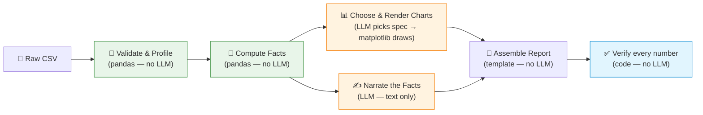

## Slide: Title
- type: title
- title: Automation of Data Output & Discovery
- subtitle: From Raw CSV to a Drafted Report — Figures, Numbers, and Words You Can Defend

> Week 7 of Phase 2: Workflow Automation & Design (Weeks 5-8)

=====

## Slide: Contents
- type: cards
- title: Contents
- subtitle: Lecture, Practice, and Discussion for Week 7

- card(blue, 📖): 1. Lecture
  - Drafting reports and visualizing results
  - Why the numbers must come from code and only the sentences from the LLM

- card(green, 💻): 2. Practice
  - Auto-Drafting: raw CSV → figures → a report draft you can defend
  - Every number in the draft is traced back to a row

- card(orange, 🗣️): 3. Discussion
  - Week 6 Review & Authorship and Ethics
  - Who is responsible if the AI-generated hypothesis is flawed?

=====

# Part 1: Lecture

## Slide: Lecture
- type: title
- title: Part 1: **Lecture**
- subtitle: Drafting Reports and Visualizing Results

=====

## Slide: The Story So Far
- type: cards
- title: The Story So Far — **Input Is Solved, Output Is Not**
- subtitle: Week 6 filled the funnel; today we empty it

- card(blue, 📥): Week 6 — Data In
  - PDFs → Markdown → structured metadata → a table you can export as CSV
  - You automated the part of research that is *reading and recording*
  - The output was **data**: rows, fields, a chart or two

- card(green, 📤): Week 7 — Data Out (Today)
  - The other half: turning a table into **figures, findings, and prose**
  - Weekly progress reports, experiment summaries, figure captions, methods paragraphs
  - The part of research that is *explaining what the data says*

- card(orange, ⚠️): Why This Half Is More Dangerous
  - A wrong metadata field is visible in a table; a wrong number inside a fluent paragraph is not
  - Week 2's lesson arrives with full force: **fluency ≠ accuracy**
  - Today's entire design goal: make it **structurally impossible** for the model to invent a number

- flow: PDFs (W6) → Metadata CSV (W6) → Facts computed in code → Figures → Drafted report (W7)

=====

## Slide: What Auto-Drafting Is
- type: cards
- title: What "Auto-Drafting" **Is and Is Not**
- subtitle: Setting the expectation before we build

- card(green, ✅): What It Is
  - A pipeline that turns a **table** into a **first draft**: figures, captions, a results paragraph, a limitations note
  - The boring 70%: "N samples were measured across 4 conditions; mean yield was 81.9% (SD 3.2)"
  - A **starting point** you edit, not a submission you sign

- card(pink, ❌): What It Is Not
  - Not "write my paper" — the argument, the interpretation, and the claim stay yours
  - Not a statistician — it does not choose your test or defend your assumptions
  - Not a discovery engine — it proposes patterns; **you** decide which are real

- card(blue, 🎯): The Useful Frame
  - Think of it as a **very fast research assistant who cannot do arithmetic**
  - So you never let it do arithmetic — you hand it the answers and ask for sentences
  - Everything today follows from that one rule

- highlight-quote: "The draft is the cheapest part of the paper. The reason it is cheap is that it is also the least valuable part — so automate exactly that."

=====

## Slide: The Drafting Pipeline
- type: card-single
- title: The **Drafting Pipeline** — Five Stages
- subtitle: Notice where the LLM appears, and where it does not


```mermaid
graph LR
    A["📄 Raw CSV"] --> B["🧹 Validate & Profile<br>(pandas — no LLM)"]
    B --> C["🔢 Compute Facts<br>(pandas — no LLM)"]
    C --> D["📊 Choose & Render Charts<br>(LLM picks spec → matplotlib draws)"]
    C --> E["✍️ Narrate the Facts<br>(LLM — text only)"]
    D --> F["📝 Assemble Report<br>(template — no LLM)"]
    E --> F
    F --> G["✅ Verify every number<br>(code — no LLM)"]
    style B fill:#e8f5e9,stroke:#388e3c
    style C fill:#e8f5e9,stroke:#388e3c
    style D fill:#fff3e0,stroke:#f57c00
    style E fill:#fff3e0,stroke:#f57c00
    style G fill:#e1f5fe,stroke:#0288d1
```

- card(yellow, 💡): Read the Colors
  - **Green** = deterministic Python. Same input, same output, forever
  - **Orange** = the LLM. It chooses *how to present* and *how to phrase* — never *what the number is*
  - **Blue** = the guard that catches the LLM when it slips
  - This split is the whole lecture. Everything else is detail

=====

## Slide: Deterministic First
- type: practice
- title: Stage 1–2 — **Compute the Facts in Code**
- subtitle: The LLM receives answers, never raw data to add up

```python
# facts.py — no LLM anywhere in this file
import pandas as pd

def compute_facts(df: pd.DataFrame, value_col: str, group_col: str) -> dict:
    g = df.groupby(group_col)[value_col]
    return {
        "n_rows": int(len(df)),
        "n_groups": int(df[group_col].nunique()),
        "missing": int(df[value_col].isna().sum()),
        "overall_mean": round(float(df[value_col].mean()), 3),
        "overall_sd": round(float(df[value_col].std(ddof=1)), 3),
        "group_means": {k: round(float(v), 3) for k, v in g.mean().items()},
        "best_group": str(g.mean().idxmax()),
        "worst_group": str(g.mean().idxmin()),
        "spread": round(float(g.mean().max() - g.mean().min()), 3),
    }
```

- card(green, 🔒): Why This Matters
  - Every number the report will ever contain now exists in **one dictionary**
  - The LLM's job shrinks from "analyze this data" to "write sentences using these values"
  - This is Week 4's lesson without the ceremony: a **tool** computed it, so it is deterministic

- card(orange, 🧮): What Goes In the Facts Dict
  - Counts, means, SDs, min/max, group comparisons, missing-value counts, date ranges, units
  - **Include the ugly numbers**: how many rows you dropped, how many groups have n < 3
  - If a fact is not in the dict, it must not appear in the draft

=====

## Slide: Choosing the Chart
- type: compare-table
- title: Which Chart? — A **Decision Table** the LLM Can Follow
- subtitle: Put this table in the system prompt and chart choice stops being random

| What you are showing | Chart | Never use |
|---|---|---|
| One value per category | Horizontal bar, sorted | Pie (beyond ~4 slices) |
| Distribution of one variable | Histogram, or box/violin by group | Bar of means alone |
| Relationship of two numeric variables | Scatter (+ fit line if justified) | Dual y-axis |
| Change over time | Line, time on x | Bar with many time points |
| Group means with uncertainty | Bar/dot **with error bars**, n labelled | Mean without spread |
| Many pairwise comparisons | Small multiples or heatmap | One chart with 12 colors |

- card(pink, 🚫): The Two Sins of Auto-Generated Figures
  - **Mean without spread** — a bar chart of four means hides that one group has n = 2
  - **Truncated y-axis** — the model loves a dramatic-looking difference; force `ylim` from 0 unless you have a reason
  - Both are easy for an agent to produce and hard for a reader to notice

=====

## Slide: Chart Spec Pattern
- type: practice
- title: Stage 3 — Let the LLM Pick the **Spec**, Not Write the Code
- subtitle: Structured output (Week 3) is what makes this safe

```python
# The model returns a chart SPECIFICATION constrained by a schema.
# It never returns Python, so nothing generated is ever executed.
CHART_SPEC = {
    "type": "object",
    "properties": {
        "chart":  {"type": "string", "enum": ["bar", "line", "scatter", "hist", "box"]},
        "x":      {"type": "string"},
        "y":      {"type": "string"},
        "error_bars": {"type": "boolean"},
        "title":  {"type": "string"},
        "caption": {"type": "string"},
        "reason": {"type": "string"},          # why this chart — you read this
    },
    "required": ["chart", "x", "y", "error_bars", "title", "caption", "reason"],
    "additionalProperties": False,
}

def render(df, spec):                           # a small, boring, auditable renderer
    fig, ax = plt.subplots(figsize=(6, 4))
    if spec["chart"] == "bar":
        g = df.groupby(spec["x"])[spec["y"]]
        g.mean().plot.bar(ax=ax, yerr=g.std() if spec["error_bars"] else None)
        ax.set_ylim(bottom=0)                   # no truncated axes, ever
    elif spec["chart"] == "scatter":
        df.plot.scatter(x=spec["x"], y=spec["y"], ax=ax)
    ...
    ax.set_title(spec["title"])
    return fig
```

- card(blue, 🛡️): Why Not Just Let It Write matplotlib Code?
  - Because then you are back to `exec()` on model output — exactly the hole we closed in Week 4
  - A spec has a **fixed vocabulary**: five chart types you implemented and tested
  - When the spec is wrong you see it instantly in the `reason` field; when generated code is wrong it may still run

=====

## Slide: Grounding the Narrative
- type: practice
- title: Stage 4 — **Narrate the Facts**, Nothing Else
- subtitle: The prompt that keeps the numbers honest

```python
SYSTEM = """You write the Results section of a research report.

You will receive a JSON object of COMPUTED FACTS and nothing else.

Rules:
1. Use ONLY numbers that appear in the FACTS object. Never compute a new
   number, never round differently, never estimate.
2. If a claim needs a number that is not in FACTS, write
   [NUMBER NOT AVAILABLE] instead of guessing.
3. Report the spread and the sample size whenever you report a mean.
4. Describe what the data shows. Do NOT explain WHY, do not speculate
   about mechanisms, and do not claim significance without a test result.
5. 150 words maximum. Past tense, third person, no adjectives of praise.
"""

user = json.dumps(facts, indent=2, ensure_ascii=False)
```

- card(green, ✅): Why Each Rule Exists
  - **Rule 1–2** turn hallucination into a visible `[NUMBER NOT AVAILABLE]` marker instead of a plausible lie
  - **Rule 3** blocks the most common auto-draft error: a bare mean
  - **Rule 4** keeps the *interpretation* — the part that is actually yours — out of the model's hands
  - **Rule 5** keeps it a draft, not a document you are tempted to paste unread

=====

## Slide: Verify the Draft
- type: practice
- title: Stage 5 — **Verify**: Catch the Number It Made Up Anyway
- subtitle: Twenty lines that make the whole pipeline trustworthy

```python
import re

def flatten(facts):                      # every allowed number, in every rounding
    out = set()
    def walk(v):
        if isinstance(v, (int, float)):
            out.update({f"{v:g}", f"{v:.1f}", f"{v:.2f}", str(round(v))})
        elif isinstance(v, dict):
            for x in v.values(): walk(x)
    walk(facts)
    return out

def unsupported_numbers(draft: str, facts: dict) -> list:
    allowed = flatten(facts)
    found = re.findall(r"\d+(?:\.\d+)?", draft)
    return sorted({n for n in found if n not in allowed})

bad = unsupported_numbers(draft, facts)
if bad:
    print(f"⚠️  Numbers not traceable to the data: {bad}")   # never auto-publish
```

- card(orange, 🔍): What This Catches in Practice
  - "approximately 85%" when the computed mean was 81.9 — the model smoothed it
  - A percentage it derived itself instead of reading from the facts
  - A year, an n, or a p-value that simply never existed
  - It is a blunt instrument — it over-reports (dates, figure numbers) — and it is still worth every line

- highlight-quote: "An agent you cannot audit is an agent you cannot cite. The verifier is not a nicety; it is what lets you put your name on the output."

=====

## Slide: From Description to Discovery
- type: cards
- title: The "**Discovery**" Half — And Its Trap
- subtitle: Finding candidate patterns without fooling yourself

- card(blue, 🔎): What Automated Discovery Can Do
  - Flag **outliers** (IQR or z-score) and tell you which rows to re-check in the lab notebook
  - Rank **correlations** between measured variables and hand you the top few
  - Spot **missing cells** in your design: condition C was never run at 50 °C
  - Cluster similar runs and ask whether the grouping matches your intended conditions

- card(pink, ⚠️): The Trap — Automated p-Hacking
  - An agent that tests 20 variable pairs will find one "significant" at p < 0.05 **by construction**
  - Scanning is cheap now, so the multiple-comparison problem is no longer theoretical — it is the default
  - Correct the threshold (Bonferroni / FDR), **or** report the number of comparisons made, every time

- card(green, 🏷️): The Labelling Rule
  - Anything the pipeline finds is a **hypothesis**, and the report must say so in those words
  - Discovery output goes in a section headed "Candidate patterns — not tested", never in Results
  - Week 2's framing, now enforced by your template rather than by your memory

=====

## Slide: Failure Modes
- type: cards
- title: Auto-Drafting **Failure Modes**
- subtitle: What goes wrong, and the line of code that prevents it

- card(pink, 🔢): Invented Numbers
  - Symptom: a fluent sentence with a figure that is not in your data
  - Prevention: facts-only prompt + `unsupported_numbers()` on every draft

- card(orange, 📈): Flattering Figures
  - Symptom: truncated y-axis, no error bars, n hidden, cherry-picked subset
  - Prevention: a fixed renderer with `ylim(bottom=0)`, mandatory n in the caption

- card(purple, 🗣️): Over-Claiming
  - Symptom: "significantly improved", "demonstrates that", "proves" — with no test behind them
  - Prevention: ban the vocabulary in the system prompt; require a test result before any claim of significance

- card(blue, 🪞): Template Blindness
  - Symptom: every weekly report reads the same, so nobody — including you — reads them
  - Prevention: the draft is an input to your thinking, not a replacement for it. If you would not have written it, do not send it

=====

## Slide: Lecture Summary
- type: cards
- title: Lecture Summary — Output and Discovery
- subtitle: Key takeaways

- card(blue, 🧮): Numbers in Code, Words in the Model
  - Compute every statistic with pandas; hand the LLM a facts dictionary and ask only for sentences
  - Charts come from a **schema-constrained spec** rendered by your own code — never from generated code

- card(green, 🔍): Verify Mechanically
  - Every number in the draft must be traceable to the facts dict; a 20-line checker enforces it
  - Report spread and n with every mean; no truncated axes

- card(orange, 🏷️): Discovery Is Hypothesis Generation
  - Automated scanning produces candidate patterns, not findings — label them and count your comparisons
  - The interpretation, and the accountability for it, stays with you — which is exactly this week's discussion

References:
> 📚 [Anthropic — Structured outputs and tools](https://platform.claude.com/docs/en/build-with-claude/prompt-engineering/overview)
> 📚 [OpenAI — Structured model outputs](https://developers.openai.com/api/docs/guides/structured-outputs)
> 📚 [matplotlib — Error bars](https://matplotlib.org/stable/gallery/statistics/errorbar_features.html)

=====

# Part 2: Practice

## Slide: Practice
- type: title
- title: Part 2: **Practice**
- subtitle: Auto-Drafting — Converting Raw CSV Data into a Report You Can Defend

=====

## Slide: Practice Overview
- type: cards
- title: What We'll **Build** Today
- subtitle: A 3-tab Streamlit app: CSV in, figures and a verified draft out

- card(blue, 🎯): The Goal
  - **Tab 1 — Data**: upload a CSV (Week 6's metadata export, or your own experiment data) → profile and validate it
  - **Tab 2 — Figures**: the LLM proposes a chart spec → your renderer draws it → you accept or override
  - **Tab 3 — Draft**: facts → narrative → **number verification** → download `report.md` with figures

- card(green, 🛠️): Tech Stack
  - **Streamlit** (Weeks 5–6), **pandas**, **matplotlib**
  - **OpenAI client** against Gemini or Ollama — the same `llm_client.py` pattern as Week 6

- card(orange, 📁): Project Structure
  - `app.py` — 3-tab Streamlit app
  - `facts.py` — all statistics (no LLM)
  - `charts.py` — chart spec schema + renderer
  - `drafter.py` — facts → narrative + `unsupported_numbers()`
  - `out/` — generated `report.md` and `.png` figures

- flow: Upload CSV → Compute Facts → Chart Spec → Render → Draft → Verify → Export

=====

## Slide: Setup
- type: practice
- title: Step 0 — **Setup**
- subtitle: Same environment as Week 6, two extra packages

```bash
cd practices/week7
pip install streamlit pandas matplotlib openai python-dotenv
streamlit run app.py
```

```text
# practices/.env  (DO NOT COMMIT)
GOOGLE_API_KEY=your_key_here
GEMINI_MODEL=gemini-3.1-flash-lite
# or run locally:  OLLAMA_MODEL=qwen3.5:0.8b
```

- card(yellow, 💡): Bring Real Data
  - Best: a CSV from **your own** experiments — one numeric column and one grouping column is enough
  - Second best: the metadata CSV you exported in Week 6 (year, field, method, …)
  - Fallback: `sample_data.csv` in the practice folder — but you will learn much less from it

=====

## Slide: Profile the Data
- type: practice
- title: Step 1 — **Load and Profile** (`facts.py`)
- subtitle: Before any AI touches it, know what you actually have

```python
def profile(df: pd.DataFrame) -> dict:
    return {
        "rows": int(len(df)),
        "columns": {c: str(df[c].dtype) for c in df.columns},
        "missing": {c: int(df[c].isna().sum()) for c in df.columns if df[c].isna().any()},
        "numeric": [c for c in df.columns if pd.api.types.is_numeric_dtype(df[c])],
        "categorical": [c for c in df.columns
                        if not pd.api.types.is_numeric_dtype(df[c]) and df[c].nunique() <= 20],
        "small_groups": {},   # filled below — groups too small to average honestly
    }

def small_groups(df, group_col, min_n=3):
    counts = df[group_col].value_counts()
    return {str(k): int(v) for k, v in counts[counts < min_n].items()}
```

- card(orange, ⚠️): The `small_groups` Field Is the Point
  - A mean over n = 2 is not a mean, it is an anecdote with a decimal point
  - Passing this into the facts dict forces the draft to disclose it
  - This is the kind of caveat a human reviewer asks for and an unguarded LLM never volunteers

=====

## Slide: Figures Tab
- type: practice
- title: Step 2 — **Chart Spec → Figure** (`charts.py`)
- subtitle: The model proposes; your code disposes

```python
def propose_chart(client, model, profile_dict, question: str) -> dict:
    resp = client.chat.completions.create(
        model=model,
        messages=[
            {"role": "system", "content": CHART_RULES},     # the decision table from the lecture
            {"role": "user", "content": json.dumps(
                {"profile": profile_dict, "question": question}, ensure_ascii=False)},
        ],
        response_format={"type": "json_schema",
                         "json_schema": {"name": "chart_spec", "strict": True,
                                         "schema": CHART_SPEC}},
    )
    return json.loads(resp.choices[0].message.content)

# In app.py — always show the model's reasoning and let the user override
spec = propose_chart(client, model, prof, st.session_state.question)
st.info(f"Chart: **{spec['chart']}** — {spec['reason']}")
spec["chart"] = st.selectbox("Override chart type", CHART_TYPES,
                             index=CHART_TYPES.index(spec["chart"]))
st.pyplot(render(df, spec))
```

- card(green, 👤): The Override Box Is Not Decoration
  - It is the Week 4 approval gate, applied to a figure instead of a file write
  - Students consistently find the model's second choice better about a third of the time
  - Log which ones you overrode — that log is your eval set

=====

## Slide: Draft Tab
- type: practice
- title: Step 3 — **Draft and Verify** (`drafter.py`)
- subtitle: The narrative, then the checker, then the export

```python
def draft(client, model, facts: dict) -> str:
    resp = client.chat.completions.create(
        model=model, temperature=0.2,
        messages=[{"role": "system", "content": SYSTEM_FACTS_ONLY},
                  {"role": "user", "content": json.dumps(facts, indent=2, ensure_ascii=False)}],
    )
    return resp.choices[0].message.content

# app.py — Tab 3
text = draft(client, model, facts)
bad = unsupported_numbers(text, facts)

if bad:
    st.error(f"❌ {len(bad)} number(s) not traceable to your data: {', '.join(bad)}")
    st.caption("Fix the facts dict or reject the draft. Do not export it.")
else:
    st.success("✅ Every number in this draft comes from your data.")

st.download_button("Download report.md", build_report(text, figures, facts),
                   file_name="report.md", disabled=bool(bad))
```

- card(pink, 🔒): Note the `disabled=bool(bad)`
  - The export button is **switched off** while an unverifiable number is present
  - Policy encoded in the interface instead of in a paragraph nobody reads
  - This is Week 5's interaction design and Week 4's guardrails meeting in four characters

=====

## Slide: Assemble the Report
- type: practice
- title: Step 4 — **Assemble** `report.md`
- subtitle: A template, not a generated document

```python
REPORT = """# {title}

*Generated {date} from `{source}` — {rows} rows. Draft: verify before use.*

## Results

{narrative}

{figures}

## Data quality notes

- Rows analysed: {rows} (missing values dropped: {missing})
- Groups with n < 3: {small_groups}
- Comparisons performed: {n_comparisons}

## Candidate patterns — NOT TESTED

{discoveries}
"""
```

- card(blue, 🧱): Why a Template Beats "Write Me a Report"
  - The structure is fixed by you, so the model cannot quietly drop the caveats section
  - "Data quality notes" and "Candidate patterns — NOT TESTED" appear **even when the model would rather not mention them**
  - The template is where your scientific standards live; the LLM only fills the slots you allow

=====

## Slide: Running It
- type: practice
- title: Step 5 — **Run and Inspect**
- subtitle: What a good session looks like

```text
$ streamlit run app.py

Tab 1  ▸ uploaded yield_2026.csv — 48 rows, 4 groups
        ⚠️ groups with n < 3: {'C-high': 2}
Tab 2  ▸ Chart: bar — "One numeric value across four categories;
          error bars included because SD is available."
        [override → box]  ✓ kept as bar
Tab 3  ▸ Draft:
        "Yield was measured for 48 samples across four conditions.
         Mean yield was 81.9% (SD 3.2). Condition B showed the highest
         mean (85.4%) and condition C-high the lowest (77.1%); note that
         C-high contains only 2 samples."
        ✅ Every number in this draft comes from your data.
        [Download report.md]
```

- card(yellow, 💡): Try to Break It
  - Delete a column from the facts dict and re-draft — does `[NUMBER NOT AVAILABLE]` appear, or does the model invent?
  - Ask for a claim the data cannot support: "does B significantly outperform C?"
  - Run the same facts on Gemini and on `qwen3.5:0.8b` and compare how often the verifier fires

=====

## Slide: Practice Checklist
- type: card-single
- title: ✅ **Practice Checklist**
- subtitle: Complete these tasks during the hands-on session

- card(green, 📋): Checklist
  - [ ] Load a CSV — ideally **your own data** — and read the profile output before doing anything else
  - [ ] Confirm `small_groups` correctly flags any group with n < 3
  - [ ] Generate a chart spec, read the `reason` field, and **override it at least once**
  - [ ] Produce a draft and confirm the verifier reports zero unsupported numbers
  - [ ] Deliberately break it: remove a fact and check that the model marks it rather than inventing it
  - [ ] Export `report.md` and read it as a reviewer — what would you reject?
  - [ ] (Bonus) Add an outlier detector and route its output to the "Candidate patterns" section only
  - [ ] (Bonus) Count and report the number of comparisons your discovery step performed
  - [ ] (Bonus) Swap the backend to Ollama and note where the small model's draft degrades first

=====

# Part 3: Discussion

## Slide: Discussion
- type: title
- title: Part 3: **Discussion**
- subtitle: Week 6 Review · Authorship & Ethics · Final Midterm Check

=====

## Slide: Week 6 Discussion Recap
- type: cards
- title: Week 6 — **"The Risk of Not Reading"** Responses
- subtitle: 15 responses analyzed — Hulk dominates, but the interesting ideas are elsewhere

- card(green, 📊): The Vote Count
  - **Hulk (pragmatic balance)**: Seher, Gyeongsu, Manuella, Ly, Tan, DongYun, Hyunwoo — **7 votes**
  - **Iron Man + Hulk combo**: Huy, Irfan, Waad — **3 votes**
  - **Iron Man**: Rupam, Han — **2 votes**
  - **Captain America**: Yadanar — **1 vote**
  - **Iron Man + Captain America**: Nazhiefah — **1 vote**
  - **"None" (meta-critique)**: Jaewhoon — **1 vote**

- card(blue, 🔬): The Consensus
  - Almost everyone agrees: AI handles initial filtering, humans do final synthesis
  - The "balance" position is now the **default** — nobody argues for full automation OR full manual
  - But **how** you balance is where the real disagreement lives

- card(red, 🔥): The Surprise
  - **Rupam** switched from his usual Hulk to **Iron Man** — "published papers are already verified, risk is minimal"
  - **Jaewhoon** rejected ALL three personas — "the question itself is wrong"
  - These outliers reveal more than the consensus

=====

## Slide: Theme 1
- type: cards
- title: Theme 1 — **The "Research Director" Paradigm**
- subtitle: Upgrading the human role from reader to investigator

- card(blue, 🎯): The Core Idea
  - **Huy**: coined "Research Director model of Agentic Scrutiny"
  - Not outsourcing your mind — **upgrading your role** from laborer to investigator
  - Active tracking: require AI to provide "clickable links to specific sentences"
  - Spot-check protocol: deep-read 10% to calibrate the AI's lens on the other 90%

- card(green, 💡): Conditional Delegation
  - **Waad**: "save 90% of time wasted on tedious research... dive deep into the top 5 key papers"
  - **Irfan**: "the real irreplaceable skill is knowing what to trust, what to question, and what is worth deeply reading"
  - **Han**: "AI can be trusted for indexing... but this is precisely where human work should begin"

- card(orange, 🔗): Why This Matters for Today
  - Today's drafter is exactly this pattern — the AI writes, you **direct and verify**
  - You don't recompute every statistic — you decide which facts enter the dictionary and audit what comes out
  - Huy's "clickable links to specific sentences" is literally today's number verifier: every figure traceable to a row

- highlight-quote: "We aren't 'outsourcing' our minds; we are upgrading our role from laborer to investigator." — Huy

=====

## Slide: Theme 2
- type: cards
- title: Theme 2 — **Jaewhoon's Meta-Critique**
- subtitle: "The question itself is wrong" — the deepest challenge yet

- card(purple, 💎): The Argument
  - The crisis of "not reading" existed **before AI** — low-quality journals, citation inflation, copyright issues
  - Experienced researchers already tell students: "read a paper in 30 minutes or less"
  - That's "basically not that much different from using AI for summarizing papers"
  - AI didn't create the problem — it **accelerated** an existing crisis

- card(red, ⚠️): The Real Question
  - "The point should be moved to **'what is the essential ability in research'**, not 'does AI threaten reading abilities'"
  - China's new professional doctorate: doctoral-level degree **without papers**, earned by solving industrial problems
  - "As papers written by AI begin to pass peer review, we need to discuss **what is the real value of human in doing research**"

- card(blue, 🤔): Class Reflection
  - Jaewhoon is the only student who chose **"None"** — rejecting all three personas
  - This is a meta-level challenge: the debate about AI-and-reading assumes reading is central
  - What if the **entire frame** of paper-based research is shifting?

- highlight-quote: "The value of reading comes from well-written papers that solve difficult problems with deep thinking. But in reality, most of us just extract the main idea." — Jaewhoon

=====

## Slide: Theme 3
- type: cards
- title: Theme 3 — **Context Shifts Everything**
- subtitle: Your position changes depending on the situation you're in

- card(orange, 🔄): The Position Shifters
  - **Rupam**: "Today my answer is different from usual — I usually relate to Hulk, but today I align with Iron Man"
  - Published papers are already verified → lower risk → AI can handle it
  - **Nazhiefah**: "It depends on what we are looking for" — Iron Man when pressured to produce, Captain America when there's time

- card(blue, 📖): The Deep Readers
  - **Yadanar**: "I don't fully trust AI with papers that are very important for my research field"
  - **Manuella**: "If you cannot clearly explain your findings, true insight has not been achieved"
  - **Hyunwoo**: "A small error in understanding a mathematical model can cause actual hardware damage"

- card(green, 🧠): The Retention Problem
  - **Gyeongsu**: "AI helps us process tons of info, but will I actually **remember** any of it?"
  - **DongYun**: "Mistakes made by AI can cause a series of errors that get worse over time"
  - Reading isn't just about extraction — it's about **building internal models**

- highlight-quote: "Today my answer is different from usual. AI is a tool meant to make difficult tasks easier, not a replacement for the human mind." — Rupam

=====

## Slide: Connection to Today
- type: cards
- title: How This Connects to **Today's Practice**
- subtitle: Auto-drafting is where "not reading" becomes "not checking"

- card(blue, 🎯): You Are the Research Director
  - Today you built a pipeline that writes sentences about your data
  - YOU decide which facts go into the dictionary — that choice is the analysis (Huy's "architectural design")
  - YOU read the chart's `reason` field and override it — Waad's "conditional delegation", made clickable
  - YOU are the one who presses export, with your name on the file

- card(orange, 🔗): Testing Jaewhoon's Challenge
  - Week 6 asked whether skipping the reading costs you something. Week 7 asks the sharper version: **does skipping the writing cost you the understanding?**
  - Writing a Results paragraph is where most researchers first notice their data is odd
  - If the draft arrives finished, when exactly do you notice?

- card(green, ✅): The Verification Test
  - If the verifier fires and you cannot tell **which** number is wrong → you did not know your data well enough
  - If the draft reads plausibly and you accept it without checking `small_groups` → the tool made you faster and worse
  - The pipeline makes your judgment **visible** — to yourself first

=====

## Slide: Midterm Final Check
- type: cards
- title: Midterm — **Final Check**
- subtitle: Submission is THIS FRIDAY — 23 October, 24:00

- card(red, 📅): Deadline
  - **This Friday — 23 October 2026, 24:00**
  - Email to **hogeony@ust.ac.kr**
  - Spec document + working prototype + a 3–5 minute recorded video pitch
  - The pitches are compiled into next week's session, so a late file is a missing slot

- card(blue, 📦): Deliverables
  - **Specification document** — 5 Questions answered
  - **Working prototype** — Streamlit/Gradio app, runnable code
  - **The recorded pitch itself** — 3–5 minutes: the problem, the app running on screen, your design decisions

- card(green, ✅): Self-Check
  - Does your app **run**? (test it right now!)
  - Can you explain your **design decisions** in the demo?
  - Does your app demonstrate the **human-AI interaction** you specified?
  - Have you tested with **real data** from your research domain?

- card(orange, ⚠️): Common Mistakes
  - App that doesn't start (missing dependencies, wrong paths)
  - No real data — only dummy/test inputs
  - Can't explain WHY you made certain design choices
  - Spec document doesn't match what the prototype actually does

=====

## Slide: Discussion Questions
- type: card-single
- title: 🗣️ **Week 7 Discussion Questions** (UST LMS)
- subtitle: Post your response on the forum this week

> Visit: **UST LMS → Class → Discussion**

1. **Authorship & Ethics — who is responsible if the AI-generated hypothesis is flawed?** Today your pipeline produced a Results paragraph and a "candidate patterns" section. Suppose one of those candidate patterns turns out to be an artefact and it reaches a published paper. Who is accountable — you, your supervisor, the model provider, whoever wrote the prompt? Does the fact that every number was **machine-verifiable** change your answer? And would you disclose that the draft was AI-generated — in the methods, in an acknowledgement, or not at all?
2. **Midterm final update**: Your prototype and recorded pitch are due **this Friday**. Describe your app in one sentence. What's the single most impressive thing it does? What is the one moment of the recording you are least sure about — and do you have time to re-record it?

=====

## Slide: Recommended Resources
- type: card-single
- title: Want to Learn More?

Drafting & Structured Output
> 📚 [OpenAI — Structured model outputs](https://developers.openai.com/api/docs/guides/structured-outputs)
> 📚 [Gemini API — Structured output](https://ai.google.dev/gemini-api/docs/structured-output)
&nbsp;

Figures & Honest Statistics
> 📚 [matplotlib — Error bars](https://matplotlib.org/stable/gallery/statistics/errorbar_features.html)
> 📚 [The Extent and Consequences of P-Hacking in Science — Head et al., PLOS Biology 2015](https://journals.plos.org/plosbiology/article?id=10.1371/journal.pbio.1002106)
> 📚 [Why Most Published Research Findings Are False — Ioannidis 2005](https://journals.plos.org/plosmedicine/article?id=10.1371/journal.pmed.0020124)
&nbsp;

Authorship Policy
> 📚 [COPE — Authorship and AI tools](https://publicationethics.org/guidance/cope-position/authorship-and-ai-tools)
> 📚 [ICMJE Recommendations — use of AI in manuscripts](https://www.icmje.org/recommendations/)
&nbsp;

Anthropic Free Online Courses (Recommended)
> 🎓 [Building with the Claude API](https://anthropic.skilljar.com/claude-with-the-anthropic-api) — API 활용 실습
> 🎓 [Introduction to Model Context Protocol](https://anthropic.skilljar.com/introduction-to-model-context-protocol) — MCP 서버/클라이언트 구축
> 🎓 [Introduction to Agent Skills](https://anthropic.skilljar.com/introduction-to-agent-skills) — 재사용 가능한 에이전트 스킬 생성

=====

## Slide: Wrap-Up
- type: cards
- title: Wrap-Up of **Week 7**
- subtitle: Three things to remember

- card(blue, 📖): Lecture
  - Numbers are computed in **code**, sentences come from the **model**: a facts dictionary, a schema-constrained chart spec, a facts-only prompt, and a verifier that traces every digit back to a row

- card(green, 💻): Practice
  - Built a 3-tab **auto-drafting** app: CSV → profile → figure (with override) → narrative → number verification → `report.md`; export stays disabled while any number is unverifiable

- card(orange, 🗣️): Discussion
  - Week 6 review: Hulk won again, but Huy's "Research Director" model and Jaewhoon's meta-critique challenge the frame; this week's forum turns to **authorship and accountability**; **Midterm due this Friday, 23 Oct 24:00** — screened in Week 8

**This Friday, 23 October, 24:00:** spec + working prototype + your 3–5 minute recorded video pitch, by email. **Next week** we watch them together and review each other's feasibility. Record early — you can always re-record. Good luck!
