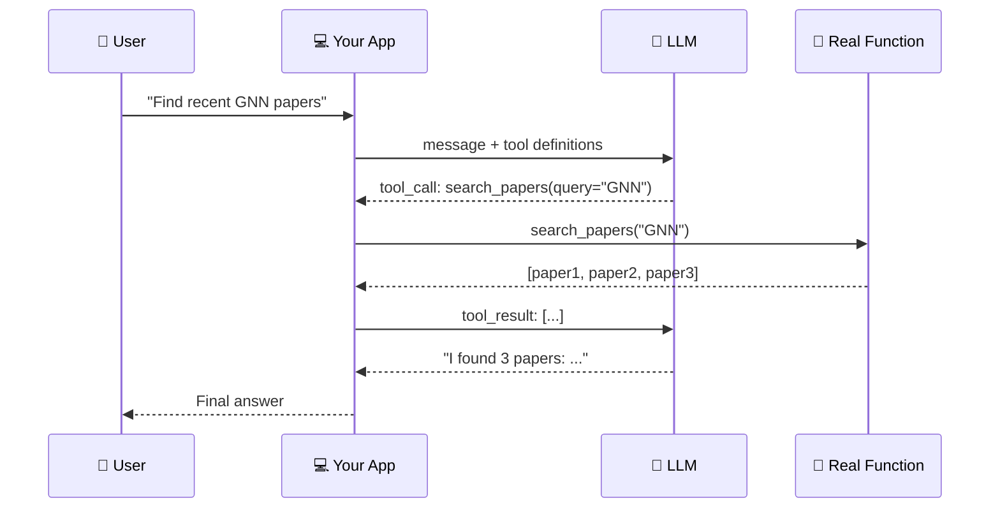

## Slide: Title
- type: title
- title: Function Calling
- subtitle: How AI Agents Take Action — Not Just Talk

> Week 9 of Phase 3: Advanced Patterns (Weeks 9-12)

=====

## Slide: Contents
- type: cards
- title: Contents
- subtitle: Lecture, Practice, and Discussion for Week 9

- card(blue, 📖): 1. Lecture
  - The limit of "text in, text out" LLMs
  - Function calling — letting AI invoke real code
  - The agentic loop: call → observe → decide → repeat

- card(green, 💻): 2. Practice
  - Build a research agent with **3 tools**: search, fetch, summarize
  - The agent decides which tool to call based on user question

- card(orange, 🗣️): 3. Discussion
  - Designing tool definitions clearly
  - Midterm reflection: vague specs → flaky agents

=====

# Part 1: Lecture

## Slide: Lecture
- type: title
- title: Part 1: **Lecture**
- subtitle: Function Calling — Giving AI the Power to Act

=====

## Slide: The Story So Far
- type: cards
- title: The Story So Far — **From Talking to Acting**

- card(blue, 📄): What We've Built So Far
  - Week 5: AI **answers** questions about papers
  - Week 6: AI **extracts** metadata into structured form
  - Week 7: AI **debates** topics with personas
  - All of these = AI produces **text** as output

- card(red, ⚠️): The Limitation
  - The LLM only outputs **text** — it can't actually DO anything
  - It can't search a database, call an API, read a file, run code
  - You had to write all the surrounding logic yourself

- card(green, 🚀): Today's Shift
  - Give the LLM access to **real functions**
  - Let it decide which function to call, with what arguments
  - Now the LLM can **act**, not just describe actions

=====

## Slide: The Core Problem
- type: cards
- title: The Core Problem — **LLMs Can't Do Anything**

- card(red, ❌): What an LLM Can't Do
  - It can't check today's weather
  - It can't search your local files
  - It can't run a calculation reliably (`23847 × 9281` = ?)
  - It can't query a database
  - It only generates text based on training data

- card(blue, 💡): What If We Gave It Tools?
  - "Here's a `get_weather(city)` function"
  - "Here's a `search_papers(query)` function"
  - "Here's a `calculate(expr)` function"
  - The LLM still outputs text — but the text says **"call this function with these arguments"**

- card(green, ✅): The Result
  - The LLM becomes an **orchestrator** — it picks the right tool
  - The actual work happens in your real code
  - Reliable, verifiable, and the LLM stays in its lane

=====

## Slide: What is Function Calling
- type: card-single
- title: What is **Function Calling**?
- subtitle: A simple but powerful API pattern

```text
1. You define functions in JSON:
   { name: "search_papers", description: "...", parameters: {...} }

2. You send the user message + function definitions to the LLM

3. The LLM responds with EITHER:
   (a) A normal text answer, OR
   (b) "I want to call search_papers with query='deep learning'"

4. If (b), YOUR code runs the real function and gets the result

5. You send the result back to the LLM → it forms the final answer
```

- highlight-quote: "The LLM never actually runs code. It just tells YOU which function to run, and YOU run it."

=====

## Slide: The Flow
- type: card-single
- title: The Flow — **Visualized**



=====

## Slide: A Tool Definition
- type: card-single
- title: A **Tool Definition** — JSON Schema
- subtitle: This is what you send to the LLM

```python
tool = {
    "type": "function",
    "function": {
        "name": "search_papers",
        "description": "Search the local paper collection by keyword.",
        "parameters": {
            "type": "object",
            "properties": {
                "query": {
                    "type": "string",
                    "description": "Keyword or topic to search for"
                },
                "max_results": {
                    "type": "integer",
                    "description": "How many papers to return (default 5)"
                }
            },
            "required": ["query"]
        }
    }
}
```

- card(yellow, 💡): Three Things the LLM Sees
  - **name** — identifier the LLM uses to "call" the function
  - **description** — when should the LLM use this? (CRITICAL)
  - **parameters** — what arguments are needed (JSON schema)

=====

## Slide: Description Matters Most
- type: cards
- title: The **Description** is Where Specifying Lives
- subtitle: This is the new prompt engineering

- card(red, ❌): Vague Description
  - `"description": "search papers"`
  - LLM has no idea **when** to call this vs other tools
  - It might call it for "what is deep learning?" (wrong — that's general knowledge)

- card(green, ✅): Clear Description
  - `"description": "Search the user's local paper collection (extracted via Week 6 metadata). Use this when the user asks about specific papers or trends in THEIR collection. Do NOT use for general knowledge questions."`
  - LLM now knows **exactly** when to call it
  - The description is your **contract** with the LLM

- highlight-quote: "Tool description = clearer specification. The skill from Week 8's midterm reflection — directly applied here."

=====

## Slide: The Agentic Loop
- type: cards
- title: The **Agentic Loop** — Multiple Tool Calls
- subtitle: One question may need several tools

- card(blue, 🔄): The Pattern
  - User asks a question
  - LLM thinks → calls Tool A
  - Sees Tool A's result → decides to call Tool B
  - Sees Tool B's result → maybe calls Tool C
  - Eventually: enough info → produces final answer

- card(green, 📝): Concrete Example
  - **User**: "Summarize the top 3 GNN papers in my collection"
  - **LLM call 1**: `search_papers(query="GNN", max_results=3)` → gets 3 papers
  - **LLM call 2**: `get_paper_details(id=1)` → gets full text of paper 1
  - **LLM call 3**: `get_paper_details(id=2)` → gets full text of paper 2
  - **LLM call 4**: `get_paper_details(id=3)` → gets full text of paper 3
  - **LLM final**: synthesizes summary across all 3

- card(orange, ⚠️): Important
  - You loop in your code: while LLM keeps calling tools, run them
  - Set a max iteration count to prevent infinite loops
  - Each step is observable — you see exactly what was called

=====

## Slide: Code Skeleton
- type: card-single
- title: The **Agentic Loop** in Code
- subtitle: This is the heart of every agent system

```python
messages = [{"role": "user", "content": user_question}]

for step in range(MAX_STEPS):
    resp = client.chat.completions.create(
        model=model,
        messages=messages,
        tools=tool_definitions,
    )
    msg = resp.choices[0].message
    messages.append(msg)

    if not msg.tool_calls:
        # LLM gave a final answer — done
        return msg.content

    # LLM wants to call tools — run them
    for tc in msg.tool_calls:
        result = run_tool(tc.function.name, tc.function.arguments)
        messages.append({
            "role": "tool",
            "tool_call_id": tc.id,
            "content": str(result),
        })
```

- card(yellow, 💡): Read This Loop Carefully
  - It alternates: LLM call → run tools → LLM call → run tools → ...
  - Exits when LLM stops requesting tools (gives final answer)
  - `MAX_STEPS` prevents runaway loops

=====

## Slide: When to Use
- type: cards
- title: When to Use **Function Calling**

- card(green, ✅): Good Fit
  - The task needs **real-world data** (DB, API, files, calculations)
  - The task involves **multiple specialized steps** (search → fetch → summarize)
  - You need **deterministic** parts mixed with LLM reasoning
  - You want the LLM's actions to be **inspectable**

- card(red, ❌): Not a Good Fit
  - Pure text transformation (translate, summarize, rewrite) → just prompt
  - Single-shot Q&A from training data → just prompt
  - Tasks where you don't trust the LLM to choose tools wisely → fixed pipeline

- card(orange, 🤔): Function Calling vs Fixed Pipeline
  - **Fixed pipeline (Week 7-style)**: you write the order, LLM fills in
  - **Function calling**: LLM decides the order itself
  - Function calling = more flexible, but harder to predict

=====

## Slide: Common Pitfalls
- type: cards
- title: Common Pitfalls — **What Goes Wrong**

- card(red, 1️⃣): Vague Tool Descriptions
  - LLM picks the wrong tool, or no tool when one was needed
  - **Fix**: be explicit about WHEN to use each tool, with examples

- card(red, 2️⃣): Too Many Tools
  - 20 tools → LLM gets confused, picks randomly
  - **Fix**: keep it under ~7 tools, group related ones

- card(red, 3️⃣): Infinite Loops
  - LLM keeps calling tools forever
  - **Fix**: set `MAX_STEPS = 10` and bail out gracefully

- card(red, 4️⃣): No Validation
  - LLM passes garbage arguments — your function crashes
  - **Fix**: validate arguments inside each tool function, return error messages the LLM can read

=====

## Slide: Lecture Summary
- type: cards
- title: Lecture Summary — **Function Calling**

- card(blue, 🎯): The Core Idea
  - LLM outputs structured JSON saying "call this function with these arguments"
  - YOUR code runs the function and returns the result
  - LLM sees the result and decides what to do next

- card(green, 🔄): The Agentic Loop
  - Loop until LLM stops requesting tools
  - Each tool call is observable — full transparency
  - Set MAX_STEPS to prevent runaway behavior

- card(orange, 📝): The Skill That Matters
  - Tool **descriptions** = where you specify WHEN to use each tool
  - Vague descriptions → LLM picks the wrong tool
  - Clear descriptions → LLM behaves predictably
  - **This is specifying skill, applied to tool design**

=====

# Part 2: Practice

## Slide: Practice
- type: title
- title: Part 2: **Practice**
- subtitle: Build a Research Agent with 3 Tools

=====

## Slide: Practice Overview
- type: cards
- title: Practice Overview — **What We'll Build**

- card(blue, 🎯): The Goal
  - A chat interface where the user asks research questions
  - The agent has **3 tools** for accessing the paper collection
  - The agent **decides** which tools to call, in what order
  - The chat shows every tool call so users can see what's happening

- card(green, 🔧): The Three Tools
  - `search_papers(query, max_results)` — keyword search in metadata
  - `get_paper_details(paper_id)` — full info for one paper
  - `count_papers_by_year(year)` — simple stats query

- card(orange, 📁): Files
  - `tools.py` — the 3 tool functions + their JSON schemas
  - `agent.py` — the agentic loop
  - `app.py` — add Tab 7 (Agent Chat)

=====

## Slide: Define the Tools
- type: practice
- title: Step 1 — **Tool Functions** (`tools.py`)
- subtitle: Three real Python functions the agent can call

```python
# tools.py
import json
from pdf_to_md import load_all_metadata
MD_DIR = "md_output"

def search_papers(query: str, max_results: int = 5) -> str:
    """Keyword search in titles and abstracts."""
    papers = load_all_metadata(MD_DIR)
    q = query.lower()
    hits = []
    for i, p in enumerate(papers):
        text = (p.get("title", "") + " " + p.get("abstract", "")).lower()
        if q in text:
            hits.append({"id": i, "title": p.get("title", "?")})
        if len(hits) >= max_results:
            break
    return json.dumps(hits)

def get_paper_details(paper_id: int) -> str:
    """Full metadata for a single paper by id."""
    papers = load_all_metadata(MD_DIR)
    if 0 <= paper_id < len(papers):
        return json.dumps(papers[paper_id])
    return json.dumps({"error": f"paper_id {paper_id} not found"})

def count_papers_by_year(year: int) -> str:
    """Count papers published in a given year."""
    papers = load_all_metadata(MD_DIR)
    count = sum(1 for p in papers if str(p.get("year", "")) == str(year))
    return json.dumps({"year": year, "count": count})
```

=====

## Slide: Tool Schemas
- type: practice
- title: Step 2 — **Tool Schemas** (`tools.py`)
- subtitle: How the LLM sees each tool

```python
TOOL_SCHEMAS = [
    {
        "type": "function",
        "function": {
            "name": "search_papers",
            "description": (
                "Search the user's local paper collection by keyword. "
                "Use when the user asks about a specific topic in THEIR papers."
            ),
            "parameters": {
                "type": "object",
                "properties": {
                    "query": {"type": "string", "description": "Search keyword"},
                    "max_results": {"type": "integer", "description": "Default 5"}
                },
                "required": ["query"]
            }
        }
    },
    {
        "type": "function",
        "function": {
            "name": "get_paper_details",
            "description": "Get full metadata for one paper by its id (from search).",
            "parameters": {
                "type": "object",
                "properties": {"paper_id": {"type": "integer"}},
                "required": ["paper_id"]
            }
        }
    },
    {
        "type": "function",
        "function": {
            "name": "count_papers_by_year",
            "description": "Count how many papers in the collection were published in a given year.",
            "parameters": {
                "type": "object",
                "properties": {"year": {"type": "integer"}},
                "required": ["year"]
            }
        }
    }
]

TOOL_FUNCS = {
    "search_papers": search_papers,
    "get_paper_details": get_paper_details,
    "count_papers_by_year": count_papers_by_year,
}
```

=====

## Slide: The Agent Loop
- type: practice
- title: Step 3 — **Agent Loop** (`agent.py`)
- subtitle: The heart of any function-calling agent

```python
# agent.py
import json
from tools import TOOL_SCHEMAS, TOOL_FUNCS

MAX_STEPS = 8

def run_agent(client, model, user_question, on_step=None):
    """Run the agentic loop. on_step(event) is called for each tool call."""
    messages = [
        {"role": "system", "content":
         "You are a research assistant with access to the user's paper collection. "
         "Use tools to answer questions about their papers. "
         "When unsure which paper, use search_papers first."},
        {"role": "user", "content": user_question},
    ]

    for step in range(MAX_STEPS):
        resp = client.chat.completions.create(
            model=model, messages=messages, tools=TOOL_SCHEMAS,
        )
        msg = resp.choices[0].message
        messages.append(msg)

        if not msg.tool_calls:
            return msg.content  # final answer

        for tc in msg.tool_calls:
            name = tc.function.name
            args = json.loads(tc.function.arguments)
            if on_step:
                on_step({"type": "call", "name": name, "args": args})
            try:
                result = TOOL_FUNCS[name](**args)
            except Exception as e:
                result = json.dumps({"error": str(e)})
            if on_step:
                on_step({"type": "result", "name": name, "result": result})
            messages.append({
                "role": "tool",
                "tool_call_id": tc.id,
                "content": result,
            })

    return "Stopped — too many steps."
```

=====

## Slide: Streamlit UI
- type: practice
- title: Step 4 — **Streamlit UI** (`app.py` Tab 7)
- subtitle: Show every tool call in real time

```python
# app.py — Tab 7 (Agent Chat)
from agent import run_agent

with tab7:
    st.header("🔧 Research Agent (Function Calling)")
    question = st.text_input(
        "Ask about your papers",
        placeholder="e.g., How many GNN papers do I have from 2024?"
    )

    if st.button("▶️ Run Agent", disabled=not question):
        events = []

        def on_step(event):
            events.append(event)

        with st.spinner("Agent thinking..."):
            answer = run_agent(client, model, question, on_step=on_step)

        # Show every tool call (transparency)
        st.subheader("🔍 Tool Calls")
        for e in events:
            if e["type"] == "call":
                st.markdown(f"📞 **{e['name']}**(`{e['args']}`)")
            else:
                st.markdown(f"📦 result: `{e['result'][:200]}...`")

        st.subheader("💬 Final Answer")
        st.markdown(answer)
```

=====

## Slide: Try It
- type: practice
- title: Step 5 — **Try These Questions**
- subtitle: See the agent pick different tools

```text
Question 1: "How many papers from 2024 do I have?"
   → Agent calls count_papers_by_year(2024) → answers

Question 2: "Find papers about graph neural networks"
   → Agent calls search_papers("graph neural networks") → lists them

Question 3: "Tell me about the first GNN paper in detail"
   → Agent calls search_papers("GNN") → then get_paper_details(id=X)
   → synthesizes a summary

Question 4: "Compare 2023 vs 2024 paper counts"
   → Agent calls count_papers_by_year(2023)
   → then count_papers_by_year(2024)
   → presents both numbers
```

- card(yellow, 💡): What to Watch For
  - Does the agent pick the **right tool**?
  - Does it call **multiple tools** when needed?
  - Does it sometimes **fail to use a tool** when it should?

=====

## Slide: Practice Checklist
- type: card-single
- title: ✅ **Week 9 Practice Checklist**

> Complete these steps during the practice session:

1. - [ ] Create `tools.py` with the 3 functions and their schemas
2. - [ ] Create `agent.py` with the `run_agent()` loop
3. - [ ] Add Tab 7 to `app.py` showing tool calls in real time
4. - [ ] Test with the 4 example questions — does the agent pick the right tools?
5. - [ ] Try a question the agent **should NOT** use a tool for (e.g., "What is deep learning?") — does it answer directly?
6. - [ ] **Bonus**: edit one tool's description to be vague, see how behavior changes
7. - [ ] **Bonus**: add a 4th tool of your choice (e.g., `list_authors()`)

=====

# Part 3: Discussion

## Slide: Discussion
- type: title
- title: Part 3: **Discussion**
- subtitle: Authorship & Accountability — Who Owns the AI's Output?

=====

## Slide: Week 7 Discussion Recap
- type: cards
- title: Week 7 — **"Who is Responsible for a Flawed AI Hypothesis?"**
- subtitle: 14 responses analyzed — a near-universal consensus, with one twist

- card(green, 📊): The Vote Count
  - **All three (1+2+3 combined)**: Huy, Waad, Nazhiefah, DongYun, Minh — **5 votes**
  - **Hulk only (3)**: Namcheol, Gyeongsu, Han, Hyunwoo — **4 votes**
  - **Captain America only (2)**: Yadanar, Ly, Seher — **3 votes**
  - **Captain + Hulk (2,3)**: Irfan — **1 vote**
  - **Iron Man only (1)**: Tan — **1 vote**

- card(blue, 🤝): The Universal Consensus
  - Almost everyone says: **the human is fully accountable, period**
  - "AI cannot bear moral or scientific accountability" appears in nearly every response
  - Even Iron Man supporters don't excuse the human — they just emphasize speed

- card(red, 🔥): The Real Disagreement
  - The split is NOT about *who* is responsible
  - The split is about *how* to manage AI to fulfill that responsibility
  - This is a much more productive disagreement

=====

## Slide: Theme 1
- type: cards
- title: Theme 1 — **The Real Disagreement is HOW, Not WHO**
- subtitle: Three management philosophies emerge

- card(blue, 🚀): The Velocity Camp (Iron Man side)
  - **Tan**: "Define problem, select data, choose model — the researcher is in control at every step"
  - **Huy**: "AI provides the velocity, but the human provides the vector"
  - Position: embrace speed, but never abdicate decisions

- card(orange, 🛡️): The Integrity Camp (Captain America side)
  - **Yadanar**: "Relying on AI without careful judgment weakens scientific integrity"
  - **Ly**: "If results are wrong, we don't blame the software — we check our model"
  - **Seher**: "Use multiple AI systems to cross-check, but final judgment must be human"
  - Position: keep deep engagement to maintain accountability

- card(red, 🔬): The Verification Camp (Hulk side)
  - **Hyunwoo**: "A flawed hypothesis can result in severe hardware damage"
  - **Gyeongsu**: "AI hallucinated fake research papers in my coding work"
  - **Han**: "Researchers must never blindly trust AI; must personally verify every result"
  - Position: build active verification systems around the AI

- highlight-quote: "The real question isn't 'is the AI responsible?' (no), but 'what does taking responsibility actually look like in practice?'"

=====

## Slide: Theme 2
- type: cards
- title: Theme 2 — **The Tool Metaphors**
- subtitle: How students framed the AI's role

- card(blue, 🔨): "AI is a Tool" — Most Common Frame
  - **DongYun**: "AI is merely a tool, like a hammer"
  - **Tan**: "AI is fundamentally a tool without intent or accountability"
  - **Minh**: "We do not credit the power drill for the architecture"
  - The hammer/drill metaphor is intuitive but limited — tools don't *suggest* what to build

- card(orange, ⚛️): "AI is a High-Power Instrument" — Namcheol's Reframe
  - "A nuclear engineer doesn't blame the reactor if a control rod is miscalibrated"
  - But the engineer DOES need active containment, monitoring, documentation
  - This metaphor better captures the *operational risk* dimension

- card(green, 🧭): "Velocity vs Vector" — Huy's New Frame
  - AI provides the **velocity** (speed of generating ideas)
  - Human provides the **vector** (direction and validation)
  - Captures both the productivity gain AND the irreplaceable human role

=====

## Slide: Theme 3
- type: cards
- title: Theme 3 — **Real Engineering Stakes**
- subtitle: Why this isn't an abstract debate

- card(red, ⚠️): Concrete Failures Students Have Seen or Worry About
  - **Gyeongsu**: AI fabricated fake paper citations — would have been "deeply embarrassing" if used in a presentation
  - **Hyunwoo**: "A flawed hypothesis regarding system dynamics can result in severe hardware damage"
  - **Minh**: Motor winding design — "AI-generated hypothesis is merely a high-probability suggestion that must undergo empirical validation"
  - **Waad**: "Dangerous trend where the ease of a single button press erodes critical thinking in younger generations"

- card(blue, 🔍): The Pattern
  - These aren't theoretical concerns — students are encountering them in their own work
  - The verification step isn't a luxury; it's how you avoid catastrophic failure
  - Engineering domains (robotics, motors, hardware) have **physical consequences** for AI errors

- highlight-quote: "AI changes how ideas are generated. It does not change who is responsible for them." — Huy

=====

## Slide: Connection to Today
- type: cards
- title: How This Connects to **Today's Practice**
- subtitle: Function calling makes accountability MECHANICAL, not just philosophical

- card(blue, 🔧): Tool Calls = Accountability Made Visible
  - Today's agent shows EVERY tool call in the UI
  - You see what the agent searched for, what it retrieved, what it computed
  - This is **operational** accountability — not just claimed, but observable

- card(orange, 🎯): Tool Descriptions = Where You Specify Limits
  - Want to constrain the AI? Write narrow tool descriptions
  - "Use ONLY when..." in the description prevents misuse
  - This is the verification camp's discipline, baked into the system design

- card(green, 🔁): The Velocity-Vector Pattern in Code
  - Tools provide the **velocity** (search 1000 papers in seconds)
  - Tool definitions and the loop's exit conditions provide the **vector**
  - You designed the rails the agent runs on — that's where your accountability lives

=====

## Slide: Activity
- type: cards
- title: Activity — **Design a Tool with Built-In Accountability**
- subtitle: Apply the lessons in pairs (10 min)

- card(blue, 📋): The Task
  - Pick any tool from your own research workflow you'd want to automate
  - Write its `description` field with **explicit limits** built in
  - Show your description to a partner — can they tell when the LLM should/shouldn't use it?

- card(orange, ✏️): Required Elements in Your Description
  - **What** the tool does (1 sentence)
  - **When** to use it (specific scenarios)
  - **When NOT** to use it (boundaries)
  - **What outputs to verify** (the human-in-the-loop checkpoint)

- card(green, ✅): Example
  - "Generate a hypothesis from input data. Use ONLY for preliminary brainstorming on small datasets (<1000 rows). Do NOT use for high-stakes claims. **OUTPUT MUST BE VALIDATED** against at least one independent baseline before being included in any report."

=====

## Slide: Discussion Questions
- type: card-single
- title: 🗣️ **Week 9 Discussion Questions** (UST LMS)

> Visit: **UST LMS → Class → Discussion**

1. Several classmates (Huy, Namcheol, Minh) reframed the AI accountability debate using metaphors — "velocity vs vector", "high-power instrument", "power drill". **Which metaphor best captures how YOU work with AI in your research?** Or propose a better one.
2. In today's practice, you saw every tool call the agent made (transparency). **Does this kind of visibility change your sense of responsibility for the AI's output?** Would you trust an AI more or less if you couldn't see its tool calls?

=====

## Slide: Recommended Resources
- type: card-single
- title: Want to Learn More?

Function Calling Documentation
> 📚 [OpenAI: Function Calling Guide](https://platform.openai.com/docs/guides/function-calling)
> 📚 [Anthropic: Tool Use Overview](https://docs.anthropic.com/en/docs/build-with-claude/tool-use)
> 📚 [Anthropic: Building Effective Agents](https://www.anthropic.com/research/building-effective-agents)
&nbsp;

Agent Frameworks (built on function calling)
> 📚 [LangGraph — Stateful Agent Workflows](https://langchain-ai.github.io/langgraph/)
> 📚 [OpenAI Agents SDK](https://github.com/openai/openai-agents-python)
&nbsp;

Anthropic Free Online Courses
> 🎓 [Building with the Claude API](https://anthropic.skilljar.com/claude-with-the-anthropic-api)
> 🎓 [Introduction to Model Context Protocol](https://anthropic.skilljar.com/introduction-to-model-context-protocol)
> 🎓 [Introduction to Agent Skills](https://anthropic.skilljar.com/introduction-to-agent-skills)

=====

## Slide: Wrap-Up
- type: cards
- title: Wrap-Up of **Week 9**

- card(blue, 📖): Lecture
  - Function calling = LLM outputs JSON describing which function to call; YOUR code runs it; result fed back; loop until done

- card(green, 💻): Practice
  - Built a research agent with **3 tools** (search, fetch, count); the agent picks tools based on the question; every call is visible to the user

- card(orange, 🗣️): Discussion
  - Week 7 review: universal consensus that humans are accountable; the real disagreement is HOW (velocity / integrity / verification camps); Huy's "velocity vs vector" frame connects accountability to today's tool design

**Next week:** What happens when tool calls fail — error handling and recovery in agent loops.
