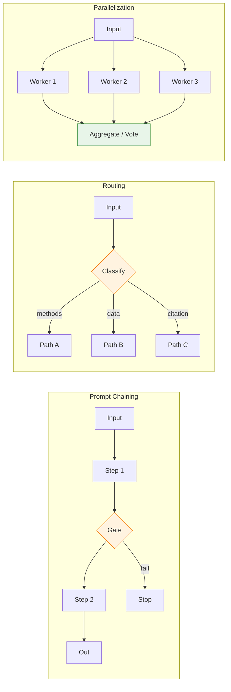

## Slide: Title
- type: title
- title: Design of Task and Workflow
- subtitle: Algorithmic Thinking — Turning a Vague Request into a Flow That Survives Contact With Reality

> Week 9 of Phase 3: Management & Reliability (Weeks 9-12)

=====

## Slide: Contents
- type: cards
- title: Contents
- subtitle: Lecture, Practice, and Discussion for Week 9

- card(blue, 📖): 1. Lecture
  - Algorithmic thinking: decomposing a task into a workflow
  - Five workflow patterns, explicit state, and the guards that make a flow robust

- card(green, 💻): 2. Practice
  - Flow Architecture: a multi-step research flow in plain Python, then in **LangGraph**
  - Nodes, state, conditional routing, retries, and an explicit give-up path

- card(orange, 🗣️): 3. Discussion
  - Week 7 Review: Authorship & Accountability
  - Ambiguity vs. Clarity — why agents fail when human instructions are vague

=====

# Part 1: Lecture

## Slide: Lecture
- type: title
- title: Part 1: **Lecture**
- subtitle: Algorithmic Thinking — Designing Robust Workflows

=====

## Slide: The Story So Far
- type: cards
- title: Phase 3 Begins — **From "It Worked Once" to "It Works Every Time"**
- subtitle: Your midterm prototype demoed fine. Now run it fifty times.

- card(blue, ✅): What Phase 2 Gave You
  - An interface (Week 5), an input pipeline (Week 6), an output pipeline (Week 7), and a working prototype (Week 8)
  - Each piece was a **single call** or a **short script** you drove by hand

- card(pink, 💥): What Breaks at Run #7
  - The model picks a different tool than last time, and the next step receives the wrong shape
  - One API call times out, and the whole run dies with nothing saved
  - A vague instruction sends it down a path you never imagined, for eleven expensive steps
  - You cannot tell **where** it went wrong, only that the answer is bad

- card(green, 🧭): What This Week Adds
  - Stop writing one long prompt and one long script. Write a **flow**: named steps, explicit state, defined transitions
  - Once the steps are named, each one can be tested, retried, resumed, and replaced

- highlight-quote: "A demo needs to work once. A workflow needs to fail in a way you can diagnose."

=====

## Slide: Workflow vs Agent
- type: cards
- title: **Workflow** or **Agent**? The Distinction That Decides Everything
- subtitle: Anthropic's definition, and why it is a design choice rather than a ranking

- card(blue, 🛤️): Workflow
  - "Systems where LLMs and tools are orchestrated through **predefined code paths**"
  - *You* decide the order; the model fills in the content of each step
  - Predictable cost, predictable latency, testable step by step

- card(orange, 🤖): Agent
  - "Systems where LLMs **dynamically direct their own processes** and tool usage, maintaining control over how they accomplish tasks"
  - Week 4's ReAct loop is the minimal agent: the model chooses the next action each turn
  - Flexible on open-ended problems; unpredictable in cost, path, and failure mode

- card(green, 🎯): How to Choose
  - If you can draw the steps on a whiteboard → build a **workflow**. Most research tasks are like this
  - If the path genuinely depends on what is discovered mid-task → use an **agent**, inside a budget
  - The best systems are usually a workflow with **one agentic node**, not an agent all the way down

- highlight-quote: "Find the simplest solution possible, and only increase complexity when needed. — Anthropic, Building Effective Agents"

> 📚 [Building Effective Agents — Anthropic](https://www.anthropic.com/engineering/building-effective-agents)

=====

## Slide: Five Workflow Patterns
- type: cards
- title: The Five **Workflow Patterns**
- subtitle: Almost every research pipeline is one of these, or two of them stacked

- card(blue, ⛓️): 1. Prompt Chaining
  - Decompose into sequential steps; each call processes the previous output
  - Use when the task has a natural order: extract → normalize → summarize
  - Add a **gate** between steps: if step 1's output fails validation, stop instead of poisoning step 2

- card(green, 🔀): 2. Routing
  - Classify the input, then send it to a specialized path
  - "Is this a methods question, a data question, or a citation question?" → three different prompts and tool sets
  - Cheaper and more accurate than one prompt that tries to cover every case

- card(orange, 🍴): 3. Parallelization
  - **Sectioning**: split the work (20 PDFs → 20 concurrent extractions) · **Voting**: run the same task 3× and compare
  - Voting is the cheapest hallucination detector you will ever implement: if three runs disagree on a number, flag it
  - Watch the rate limits, and watch the bill

- card(purple, 🧑‍🏭): 4. Orchestrator–Workers
  - A central LLM breaks the task into subtasks **at run time** and delegates each to a worker
  - Use when you cannot know the subtasks in advance ("review this codebase", "survey this field")
  - This is where a workflow becomes genuinely agentic — budget it accordingly

- card(pink, 🔁): 5. Evaluator–Optimizer
  - One model drafts, a second critiques against explicit criteria, the first revises. Loop until the criteria pass or the budget runs out
  - Works only when you can **state the criteria** — which is the whole lesson of this week
  - Week 11 builds this pattern properly as self-reflection

=====

## Slide: Pattern Diagrams
- type: card-single
- title: The Patterns, **Drawn**
- subtitle: Chaining, routing, parallelization


```mermaid
graph LR
    subgraph "Prompt Chaining"
        A1["Input"] --> A2["Step 1"] --> AG{"Gate"} --> A3["Step 2"] --> A4["Out"]
        AG -->|fail| AX["Stop"]
    end
    subgraph "Routing"
        B1["Input"] --> BR{"Classify"}
        BR -->|methods| B2["Path A"]
        BR -->|data| B3["Path B"]
        BR -->|citation| B4["Path C"]
    end
    subgraph "Parallelization"
        C1["Input"] --> C2["Worker 1"]
        C1 --> C3["Worker 2"]
        C1 --> C4["Worker 3"]
        C2 --> C5["Aggregate / Vote"]
        C3 --> C5
        C4 --> C5
    end
    style AG fill:#fff3e0,stroke:#f57c00
    style BR fill:#fff3e0,stroke:#f57c00
    style C5 fill:#e8f5e9,stroke:#388e3c
```

- card(yellow, 💡): Note What the Diamonds Are
  - Every diamond is a **decision made by code**, using a criterion you wrote down
  - If you cannot write the criterion, you do not yet have a workflow — you have a wish
  - That sentence is this week's discussion question in disguise

=====

## Slide: Decomposing a Vague Task
- type: compare-table
- title: Algorithmic Thinking — **Vague In, Flow Out**
- subtitle: The same request, before and after decomposition

| Vague request | What the agent has to guess | Decomposed step | Acceptance criterion |
|---|---|---|---|
| "Review the literature on perovskite stability" | Which years? How many papers? Review for what? | 1. Propose 3–5 search queries | Queries are distinct, each ≤ 8 words |
| | | 2. Search each query | ≥ 5 hits per query, or retry once |
| | | 3. Screen by year and venue | Keep ≤ 20, all ≥ 2023 |
| | | 4. Extract method + stability metric | Both fields non-empty for ≥ 80% |
| | | 5. Synthesize by method family | Every claim cites a kept paper |
| | | 6. Verify citations resolve | 100% of DOIs resolve, else flag |

- card(green, 🔑): The Technique
  - For each step ask: **what comes in, what goes out, and how do I know it worked?**
  - The third question is the one everybody skips — and it is the one that makes the flow robust
  - Write the acceptance criterion *before* the prompt. The criterion often makes the prompt obvious

- highlight-quote: "Agents do not fail because instructions are long. They fail because nobody wrote down what 'done' means."

=====

## Slide: State
- type: practice
- title: **State** — What Actually Flows Between Steps
- subtitle: A flow is nodes plus the thing they pass around

```python
# Make the state explicit and typed. This single declaration is your contract.
from typing import Annotated, TypedDict
from operator import add

class Flow(TypedDict):
    question: str                        # set once at the start
    queries:  list[str]                  # produced by the planner
    cursor:   int                        # which query we are on
    hits:     Annotated[list, add]       # reducer: nodes APPEND, never overwrite
    kept:     list | None                # None = screening has not run yet
    draft:    str                        # the final artefact
    errors:   Annotated[list, add]       # everything that went wrong, kept for the log
```

- card(blue, 📐): Rules That Save You Later
  - **One writer per field.** If two nodes write `kept`, you will spend an evening finding out which
  - **`None` means "not computed yet"**, which is different from `[]` meaning "computed, found nothing" — routing depends on that difference
  - **Never overwrite history.** Append hits and errors so a failed run is still diagnosable
  - **Keep it small.** State is re-serialized at every step; a 200-page document belongs on disk with a path in the state

- card(orange, 🔗): Week 3 Called This Context Engineering
  - The state *is* the context you assemble for the next node
  - Passing the whole accumulated history into every node is how flows get slow, expensive, and forgetful

=====

## Slide: Robustness
- type: cards
- title: Making a Flow **Robust** — Five Guards
- subtitle: Each of these is three lines of code and saves an hour of debugging

- card(blue, 🚧): 1. Validation Gates
  - After every LLM node, check the output against the acceptance criterion before moving on
  - Schema-valid (Week 3) is not the same as **acceptable**: `{"year": 1823}` parses fine and is still wrong
  - A gate turns a silent wrong answer into a loud, located failure

- card(green, 🔄): 2. Bounded Retries
  - Retry a failed node with the error message appended — models fix their own output surprisingly often
  - Bound it: `max_retries=2`, then take the give-up path. Unbounded retry is how you wake up to a $400 bill
  - Exponential backoff for rate limits, immediate retry for validation failures

- card(orange, ⏱️): 3. Budgets
  - Every flow gets a **step budget**, a **token budget**, and a **wall-clock timeout**
  - Track them in the state and check them in the router — the flow should stop itself
  - Log cost per node once; the expensive node is never the one you guessed

- card(purple, 💾): 4. Checkpoints
  - Persist the state after every node. A crash at step 9 should resume at step 9, not step 1
  - This is the single feature that justifies using a graph framework instead of a `for` loop

- card(pink, 🚪): 5. An Explicit Give-Up Path
  - Every flow needs a node that says "I could not do this, here is how far I got, here is why"
  - Without it, a failing flow either loops or returns a confident, empty answer
  - The give-up path is what makes the system honest

=====

## Slide: Humans in the Flow
- type: cards
- title: Where the **Human** Enters the Flow
- subtitle: An approval step is a node, not an afterthought

- card(blue, 🧑‍⚖️): Three Placements
  - **Before an irreversible action** — the Week 4 confirmation gate, now a node with its own state
  - **At a low-confidence branch** — when the router cannot decide, it asks instead of guessing
  - **At the end, always** — nothing leaves the flow with your name on it unread

- card(green, 🧊): Interrupt and Resume
  - With checkpointing, a flow can **pause** at an approval node, persist, and wait — minutes or days
  - Resuming continues from the saved state, so the human review does not cost you the run
  - LangGraph provides this directly; in plain Python you save the state to JSON and reload it

- card(orange, 📉): Do Not Over-Gate
  - Approving 40 steps trains the human to click yes without reading — worse than no gate at all
  - Gate the **irreversible** and the **uncertain**; automate the rest
  - Week 14 is the full session on this: audit interfaces and stop buttons

=====

## Slide: When to Use What
- type: compare-table
- title: Choosing the Right Amount of **Structure**
- subtitle: More autonomy is not more advanced — it is more expensive

| If your task… | Build | Why |
|---|---|---|
| Has the same steps every time | A **script** with LLM calls | No orchestration needed; the least machinery wins |
| Has the same steps but branches on content | **Routing workflow** | Branch in code on a classified value |
| Splits into independent chunks | **Parallel workflow** | Latency drops, and you can vote for reliability |
| Has quality criteria you can state | **Evaluator–optimizer** | The loop terminates on a criterion, not on vibes |
| Has subtasks unknown until run time | **Orchestrator–workers** | Only here do you need run-time decomposition |
| Is genuinely open-ended | **Agent, inside a budget** | Accept the unpredictability, cap the damage |

- highlight-quote: "Every step you hand to the model is a step you can no longer predict. Spend that budget where it buys you something."

=====

## Slide: Why Agents Fail
- type: cards
- title: Why Agents Fail on **Vague** Tasks — A Taxonomy
- subtitle: Today's discussion question, answered from the engineering side

- card(pink, 🎯): No Termination Criterion
  - "Research this topic thoroughly" has no defined end, so the agent stops when it runs out of budget — anywhere
  - Fix: define **done** as a checkable condition, not an adjective

- card(orange, 🌫️): Underspecified Output
  - You wanted a table; it wrote an essay; the next node expected JSON. One vague word, three failures downstream
  - Fix: schema on every hand-off (Week 3)

- card(blue, 🧭): Missing Decision Criteria
  - "Keep the relevant papers" — relevant by what test? The model invents one, differently each run
  - Fix: write the predicate in code, or state it explicitly in the prompt

- card(purple, 📚): Missing Context, Not Missing Intelligence
  - The agent does not know your lab uses "yield" to mean something specific, or that 2019 data is unusable
  - Fix: that knowledge belongs in the state or the system prompt, not in your head

- card(green, 🔍): The Diagnostic Question
  - Before blaming the model, ask: **could a competent new student do this task from my instructions alone?**
  - If not, the instruction is the bug. Vagueness is not tolerated by the flow — it is *revealed* by it

=====

## Slide: Lecture Summary
- type: cards
- title: Lecture Summary — Task and Workflow Design
- subtitle: Key takeaways

- card(blue, 🛤️): Workflow First
  - Workflows run predefined code paths; agents choose their own. Prefer the workflow, add agency where it earns its cost
  - Five patterns cover nearly everything: chaining, routing, parallelization, orchestrator–workers, evaluator–optimizer

- card(green, 📐): Make It Explicit
  - Named nodes, typed state with one writer per field, and an **acceptance criterion** for every step
  - Writing the criterion is the actual design work; the prompt follows from it

- card(orange, 🛡️): Make It Survive
  - Gates, bounded retries, budgets, checkpoints, and an explicit give-up path
  - Plus a human node where the action is irreversible or the decision is uncertain

References:
> 📚 [Building Effective Agents — Anthropic](https://www.anthropic.com/engineering/building-effective-agents)
> 📚 [LangGraph — Graph API](https://docs.langchain.com/oss/python/langgraph/graph-api)
> 📚 [Effective Context Engineering for AI Agents — Anthropic](https://www.anthropic.com/engineering/effective-context-engineering-for-ai-agents)

=====

# Part 2: Practice

## Slide: Practice
- type: title
- title: Part 2: **Practice**
- subtitle: Flow Architecture — Multi-Step Research Logic, by Hand and with LangGraph

=====

## Slide: Practice Overview
- type: cards
- title: What We'll **Build** Today
- subtitle: The same literature-triage flow twice — once in plain Python, once in LangGraph

- card(blue, 🎯): The Flow
  - **plan** → propose 3–5 search queries from the research question
  - **search** → run one query at a time against a paper source (Week 6's tools)
  - **screen** → keep recent, relevant hits; stop if nothing survives
  - **synthesize** → write a grounded summary of what was kept
  - **give_up** → an explicit, honest failure path

- card(green, 🛠️): Two Implementations
  - `flow_plain.py` — nodes, a router, a state dict, a step budget. **No framework**
  - `flow_graph.py` — the identical logic as a `StateGraph`, with checkpointing for free
  - Building both is the point: you will see exactly what the framework buys you

- card(orange, 📁): Files
  - `nodes.py` — the four node functions (LLM calls + tools from Week 4/6)
  - `flow_plain.py` · `flow_graph.py` · `run.py`
  - `trace.jsonl` — every transition, appended as it happens

- flow: plan → search ↺ → screen → synthesize → verify → report

=====

## Slide: Setup
- type: practice
- title: Step 0 — **Setup**
- subtitle: One new dependency

```bash
cd practices/week9
pip install langgraph openai python-dotenv        # plus pandas if you reuse Week 6/7 code
python run.py --engine plain    # start here
python run.py --engine graph    # then compare
```

- card(yellow, 💡): Why Plain Python First
  - LangGraph is small, but it is still a framework, and frameworks hide the thing you are trying to learn
  - After you have written the router yourself, `add_conditional_edges` reads like a label rather than magic
  - If your midterm project has a simple flow, plain Python may remain the right answer

=====

## Slide: State and Nodes
- type: practice
- title: Step 1 — **State and Nodes** (`nodes.py`)
- subtitle: Each node does one thing and declares what it changed

```python
from typing import Annotated, TypedDict
from operator import add

class Flow(TypedDict):
    question: str
    queries: list[str]
    cursor: int
    hits: Annotated[list, add]      # append-only
    kept: list | None               # None = not screened yet
    draft: str
    errors: Annotated[list, add]

def node_plan(s: Flow) -> dict:                     # returns ONLY what changed
    queries = propose_queries(s["question"])        # LLM + JSON schema (Week 3)
    return {"queries": queries[:5], "cursor": 0}

def node_search(s: Flow) -> dict:
    q = s["queries"][s["cursor"]]
    return {"hits": search_papers(q), "cursor": s["cursor"] + 1}   # tool, deterministic

def node_screen(s: Flow) -> dict:
    kept = [h for h in s["hits"] if h["year"] >= 2023][:20]
    return {"kept": kept}

def node_synthesize(s: Flow) -> dict:
    return {"draft": write_summary(s["kept"])}      # facts-only prompt (Week 7)

def node_give_up(s: Flow) -> dict:
    return {"draft": f"No usable evidence for {s['question']!r}. "
                     f"Tried {len(s['queries'])} queries, {len(s['hits'])} hits, 0 kept."}
```

=====

## Slide: The Router
- type: practice
- title: Step 2 — **The Router** — Where the Design Lives
- subtitle: Every branch is a criterion you wrote down

```python
def route(s: Flow) -> str:
    if not s["queries"]:                     return "plan"
    if s["cursor"] < len(s["queries"]):      return "search"
    if s["kept"] is None:                    return "screen"
    if not s["kept"]:                        return "give_up"      # explicit failure
    if not s["draft"]:                       return "synthesize"
    return "done"
```

- card(green, 🔍): Read It Top to Bottom
  - Each line is one acceptance criterion from the decomposition table, in code
  - `kept is None` vs `not kept` — the distinction from the State slide, doing real work
  - There is no branch that depends on how the model *feels* about progress

- card(orange, ⚠️): The Bug This Prevents
  - Without the `kept is None` case, an empty screen result sends the flow back to `screen` forever
  - A router with no give-up branch is the most common cause of runaway agent bills
  - Test the router on its own — it is a pure function of the state, so it needs no API key

=====

## Slide: Plain Python Flow
- type: practice
- title: Step 3 — **Run It Without a Framework** (`flow_plain.py`)
- subtitle: Twenty lines. This is the whole idea.

```python
import json, time

NODES = {"plan": node_plan, "search": node_search, "screen": node_screen,
         "synthesize": node_synthesize, "give_up": node_give_up}

def run(question: str, max_steps: int = 12, deadline_s: int = 120) -> Flow:
    s: Flow = {"question": question, "queries": [], "cursor": 0,
               "hits": [], "kept": None, "draft": "", "errors": []}
    started = time.time()

    for step in range(max_steps):
        if time.time() - started > deadline_s:
            s["errors"].append("deadline exceeded"); break
        nxt = route(s)
        if nxt == "done":
            break
        try:
            s.update(NODES[nxt](s))                      # merge the node's changes
        except Exception as e:
            s["errors"].append(f"{nxt}: {e}")
            s.update(node_give_up(s)); break
        with open("trace.jsonl", "a", encoding="utf-8") as f:   # every transition, logged
            f.write(json.dumps({"step": step, "node": nxt,
                                "kept": None if s["kept"] is None else len(s["kept"]),
                                "hits": len(s["hits"])}, ensure_ascii=False) + "\n")
    else:
        s["errors"].append(f"step budget {max_steps} exhausted")
    return s
```

- card(blue, 🧾): What You Just Built
  - A step budget, a wall-clock deadline, an error path, and a trace file — the five guards from the lecture, minus checkpointing
  - Checkpointing is the one that is genuinely annoying to write yourself. That is the next slide

=====

## Slide: The Same Flow in LangGraph
- type: practice
- title: Step 4 — **The Same Flow as a Graph** (`flow_graph.py`)
- subtitle: Identical nodes, identical router — the framework supplies the loop

```python
from langgraph.graph import StateGraph, START, END
from langgraph.checkpoint.memory import InMemorySaver

builder = StateGraph(Flow)
builder.add_node("plan", node_plan)
builder.add_node("search", node_search)
builder.add_node("screen", node_screen)
builder.add_node("synthesize", node_synthesize)
builder.add_node("give_up", node_give_up)

builder.add_edge(START, "plan")
builder.add_conditional_edges("plan",   route, {"search": "search"})
builder.add_conditional_edges("search", route, {"search": "search", "screen": "screen"})
builder.add_conditional_edges("screen", route, {"synthesize": "synthesize",
                                                "give_up": "give_up"})
builder.add_edge("synthesize", END)
builder.add_edge("give_up", END)

graph = builder.compile(checkpointer=InMemorySaver())

cfg = {"configurable": {"thread_id": "run-1"}}
result = graph.invoke({"question": "perovskite stability under humidity",
                       "queries": [], "cursor": 0, "hits": [],
                       "kept": None, "draft": "", "errors": []}, config=cfg)
print(result["draft"])
print(graph.get_graph().draw_ascii())        # the flow, drawn from the code
```

- card(green, 🎁): What the Framework Added
  - **Checkpointing** — swap `InMemorySaver` for a SQLite saver and a crashed run resumes from its last node
  - **Streaming** — `graph.stream(...)` yields each node's update as it happens, which is your progress bar
  - **A drawing of your own flow**, generated from the code, so the diagram can never drift from reality
  - **Interrupts** — pause at an approval node and resume later, which is Week 14's audit interface

- card(orange, ⚖️): What It Cost
  - A dependency, a new vocabulary, and state updates that merge instead of mutate — a real source of confusion at first
  - Nodes must return **partial updates**, not the whole state. Returning `s` itself will fight the reducers

=====

## Slide: Break It On Purpose
- type: practice
- title: Step 5 — **Break Your Own Flow**
- subtitle: The part of the session you will actually learn from

- card(pink, 💣): Five Failures to Induce
  - Make `search_papers` raise on the second call — does the flow give up cleanly, with the partial state intact?
  - Return zero hits for every query — does it reach `give_up`, or loop?
  - Have the planner return **eight** queries — does your step budget stop it at the right place?
  - Feed a deliberately vague question ("tell me about materials") — where does it go wrong, and which node would have caught it?
  - Kill the process mid-run, then re-invoke with the same `thread_id` — does the graph resume?

- card(blue, 📊): What to Record
  - For each failure: which node, which guard caught it, and what the trace file showed
  - Which failures did the **plain** version handle worse than the graph version? Which ones better?
  - Bring one trace excerpt to the discussion — it is the evidence for this week's forum question

- highlight-quote: "You do not understand a flow until you have watched it fail in a way you predicted."

=====

## Slide: Practice Checklist
- type: card-single
- title: ✅ **Practice Checklist**
- subtitle: Complete these tasks during the hands-on session

- card(green, 📋): Checklist
  - [ ] Write the decomposition table for **your own** research task before touching code: step, input, output, acceptance criterion
  - [ ] Implement the four nodes and run `flow_plain.py` end to end
  - [ ] Unit-test `route()` on hand-written states — no API key required
  - [ ] Confirm the step budget, the deadline, and the give-up path each actually trigger
  - [ ] Port the same flow to `flow_graph.py` and diff the behaviour
  - [ ] Print `draw_ascii()` and check the picture matches the flow you intended
  - [ ] Induce at least **three** of the five failures and record what happened
  - [ ] (Bonus) Add a validation gate after `plan`: reject duplicate or over-long queries and retry once
  - [ ] (Bonus) Add an approval node before `synthesize` and resume the run after approving
  - [ ] (Bonus) Parallelize `search` across queries and measure the latency difference

=====

# Part 3: Discussion

## Slide: Discussion
- type: title
- title: Part 3: **Discussion**
- subtitle: Week 7 Review (Authorship & Accountability) · Ambiguity vs. Clarity

=====

## Slide: Week 7 Discussion Recap
- type: cards
- title: Week 7 — **"Who is Responsible for a Flawed AI Hypothesis?"**
- subtitle: 14 responses analyzed — a near-universal consensus, with one twist

- card(green, 📊): The Vote Count
  - **All three (1+2+3 combined)**: Huy, Waad, Nazhiefah, DongYun, Minh — **5 votes**
  - **Hulk only (3)**: Namcheol, Gyeongsu, Han, Hyunwoo — **4 votes**
  - **Captain America only (2)**: Yadanar, Ly, Seher — **3 votes**
  - **Captain + Hulk (2,3)**: Irfan — **1 vote**
  - **Iron Man only (1)**: Tan — **1 vote**

- card(blue, 🤝): The Universal Consensus
  - Almost everyone says: **the human is fully accountable, period**
  - "AI cannot bear moral or scientific accountability" appears in nearly every response
  - Even Iron Man supporters don't excuse the human — they just emphasize speed

- card(red, 🔥): The Real Disagreement
  - The split is NOT about *who* is responsible
  - The split is about *how* to manage AI to fulfill that responsibility
  - This is a much more productive disagreement

=====

## Slide: Theme 1
- type: cards
- title: Theme 1 — **The Real Disagreement is HOW, Not WHO**
- subtitle: Three management philosophies emerge

- card(blue, 🚀): The Velocity Camp (Iron Man side)
  - **Tan**: "Define problem, select data, choose model — the researcher is in control at every step"
  - **Huy**: "AI provides the velocity, but the human provides the vector"
  - Position: embrace speed, but never abdicate decisions

- card(orange, 🛡️): The Integrity Camp (Captain America side)
  - **Yadanar**: "Relying on AI without careful judgment weakens scientific integrity"
  - **Ly**: "If results are wrong, we don't blame the software — we check our model"
  - **Seher**: "Use multiple AI systems to cross-check, but final judgment must be human"
  - Position: keep deep engagement to maintain accountability

- card(red, 🔬): The Verification Camp (Hulk side)
  - **Hyunwoo**: "A flawed hypothesis can result in severe hardware damage"
  - **Gyeongsu**: "AI hallucinated fake research papers in my coding work"
  - **Han**: "Researchers must never blindly trust AI; must personally verify every result"
  - Position: build active verification systems around the AI

- highlight-quote: "The real question isn't 'is the AI responsible?' (no), but 'what does taking responsibility actually look like in practice?'"

=====

## Slide: Theme 2
- type: cards
- title: Theme 2 — **The Tool Metaphors**
- subtitle: How students framed the AI's role

- card(blue, 🔨): "AI is a Tool" — Most Common Frame
  - **DongYun**: "AI is merely a tool, like a hammer"
  - **Tan**: "AI is fundamentally a tool without intent or accountability"
  - **Minh**: "We do not credit the power drill for the architecture"
  - The hammer/drill metaphor is intuitive but limited — tools don't *suggest* what to build

- card(orange, ⚛️): "AI is a High-Power Instrument" — Namcheol's Reframe
  - "A nuclear engineer doesn't blame the reactor if a control rod is miscalibrated"
  - But the engineer DOES need active containment, monitoring, documentation
  - This metaphor better captures the *operational risk* dimension

- card(green, 🧭): "Velocity vs Vector" — Huy's New Frame
  - AI provides the **velocity** (speed of generating ideas)
  - Human provides the **vector** (direction and validation)
  - Captures both the productivity gain AND the irreplaceable human role

=====

## Slide: Theme 3
- type: cards
- title: Theme 3 — **Real Engineering Stakes**
- subtitle: Why this isn't an abstract debate

- card(red, ⚠️): Concrete Failures Students Have Seen or Worry About
  - **Gyeongsu**: AI fabricated fake paper citations — would have been "deeply embarrassing" if used in a presentation
  - **Hyunwoo**: "A flawed hypothesis regarding system dynamics can result in severe hardware damage"
  - **Minh**: Motor winding design — "AI-generated hypothesis is merely a high-probability suggestion that must undergo empirical validation"
  - **Waad**: "Dangerous trend where the ease of a single button press erodes critical thinking in younger generations"

- card(blue, 🔍): The Pattern
  - These aren't theoretical concerns — students are encountering them in their own work
  - The verification step isn't a luxury; it's how you avoid catastrophic failure
  - Engineering domains (robotics, motors, hardware) have **physical consequences** for AI errors

- highlight-quote: "AI changes how ideas are generated. It does not change who is responsible for them." — Huy

=====

## Slide: Connection to Today
- type: cards
- title: How This Connects to **Today's Practice**
- subtitle: A flow makes accountability MECHANICAL, not just philosophical

- card(blue, 🧭): The Router Is Where Your Accountability Lives
  - Every branch in `route()` is a decision **you** made and wrote down
  - Huy's "velocity vs vector": the nodes are the velocity, the router is the vector
  - When the flow produces something wrong, `trace.jsonl` says exactly which of your criteria let it through

- card(orange, 📏): Acceptance Criteria Are Accountability, Written Early
  - The verification camp's discipline (Han, Hyunwoo, Gyeongsu) is just "define done before you run"
  - A criterion you can check is a promise you can keep; an adjective is not
  - Namcheol's reactor analogy lands here: containment is designed **in advance**, not diagnosed afterwards

- card(green, 🚪): The Give-Up Path Is an Ethical Feature
  - A flow that reports "0 papers survived screening" is more honest than one that writes a fluent summary of nothing
  - Tan's "AI has no intent or accountability" is exactly why the system must be able to say *I could not do this*
  - You built that node today

=====

## Slide: Activity
- type: cards
- title: Activity — **The Vagueness Audit** (in pairs, 10 min)
- subtitle: Find out whose instruction is actually the bug

- card(blue, 📋): The Task
  - Write down, in one sentence, a task you would hand to an agent in your research
  - Give that sentence — **only** that sentence — to your partner
  - Your partner decomposes it into steps with acceptance criteria, guessing wherever you were vague
  - Compare their decomposition with what you actually meant

- card(orange, ✏️): Record Three Things
  - **How many guesses** did your partner have to make?
  - Which guess would have been **most expensive** if an agent had made it instead?
  - Rewrite the sentence so that guess is no longer possible — how much longer did it get?

- card(green, ✅): Worked Example
  - Vague: "Summarize the recent literature on solid-state electrolytes."
  - Guesses required: recent = ? · how many papers = ? · summarize for whom = ? · include preprints = ? · when is it finished = ?
  - Specified: "From arXiv + Scopus, 2023 onward, take the 15 most-cited papers on sulfide solid-state electrolytes; for each extract conductivity, synthesis route, and stability window; group by synthesis route; stop when every group has at least 2 papers or you have screened 60 candidates."

=====

## Slide: Discussion Questions
- type: card-single
- title: 🗣️ **Week 9 Discussion Questions** (UST LMS)

> Visit: **UST LMS → Class → Discussion**

1. **Ambiguity vs. Clarity — why do agents fail when human instructions are vague?** Bring the sentence from today's Vagueness Audit and the decomposition your partner produced. How many guesses did one sentence require? Was the failure a limit of the *model*, or a gap in your *specification*? Where is the line?
2. Today you wrote acceptance criteria before prompts, and a router that branches only on conditions you can check. **Which step of your own research could you NOT write an acceptance criterion for?** Is that because the criterion is hard to express, or because you have not yet decided what "good" means — and what does that imply about delegating it to an agent?
3. Several classmates (Huy, Namcheol, Minh) reframed the accountability debate using metaphors — "velocity vs vector", "high-power instrument", "power drill". After building a flow with an explicit give-up path, **which metaphor best captures how YOU work with AI?** Or propose a better one.

=====

## Slide: Recommended Resources
- type: card-single
- title: Want to Learn More?

Workflow Design
> 📚 [Building Effective Agents — Anthropic](https://www.anthropic.com/engineering/building-effective-agents)
> 📚 [Effective Context Engineering for AI Agents — Anthropic](https://www.anthropic.com/engineering/effective-context-engineering-for-ai-agents)
&nbsp;

Frameworks
> 📚 [LangGraph — Graph API](https://docs.langchain.com/oss/python/langgraph/graph-api)
> 📚 [LangGraph — Persistence and checkpointing](https://docs.langchain.com/oss/python/langgraph/persistence)
> 📚 [OpenAI Agents SDK](https://github.com/openai/openai-agents-python)
&nbsp;

Anthropic Free Online Courses
> 🎓 [Building with the Claude API](https://anthropic.skilljar.com/claude-with-the-anthropic-api)
> 🎓 [Introduction to Model Context Protocol](https://anthropic.skilljar.com/introduction-to-model-context-protocol)
> 🎓 [Introduction to Agent Skills](https://anthropic.skilljar.com/introduction-to-agent-skills)

=====

## Slide: Wrap-Up
- type: cards
- title: Wrap-Up of **Week 9**

- card(blue, 📖): Lecture
  - Workflows run **predefined code paths**; agents choose their own — prefer the workflow and buy agency only where it pays. Five patterns, typed state, an acceptance criterion per step, and five guards: gates, bounded retries, budgets, checkpoints, and an explicit give-up path

- card(green, 💻): Practice
  - Built the same literature-triage flow twice — plain Python and **LangGraph** — then broke it on purpose and watched each guard fire

- card(orange, 🗣️): Discussion
  - Week 7 review: universal consensus that humans are accountable; the disagreement is HOW (velocity / integrity / verification camps). Today reframes it: vagueness is not tolerated by a flow, it is **revealed** by it

**Next week:** How do you know the output is any good? **Evaluation of agent output** — metrics, rubrics, and who gets to judge.
