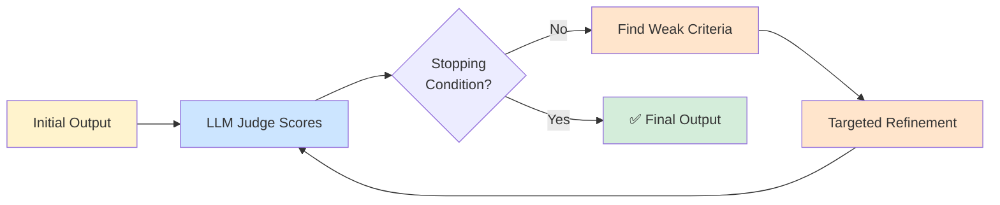

## Slide: Title
- type: title
- title: Evaluation of LLM Outputs
- subtitle: Rubrics, LLM-as-Judge, and Iterative Improvement Loops

> Week 10 of Phase 3: Advanced Patterns (Weeks 9-12)

=====

## Slide: Contents
- type: cards
- title: Contents
- subtitle: Lecture, Practice, and Discussion for Week 10

- card(blue, 📖): 1. Lecture
  - The evaluation gap — we build, but how do we measure quality?
  - LLM-as-a-Judge — using LLMs to score LLM outputs
  - Three strategies: naive, refine, aware; then iterate

- card(green, 💻): 2. Practice
  - Build a **Hometown Introduction Generator**
  - Compare 3 generation strategies + multi-model evaluation + iterative loop

- card(orange, 🗣️): 3. Discussion
  - Week 9 — Ambiguity vs Clarity: why agents fail at vague tasks
  - Connection: rubrics as disambiguation mechanism

=====

# Part 1: Lecture

## Slide: Lecture
- type: title
- title: Part 1: **Lecture**
- subtitle: How to Measure Whether an LLM Output is Good

=====

## Slide: The Evaluation Gap
- type: cards
- title: The **Evaluation Gap** — Where We Are

- card(blue, 📄): What We've Built So Far
  - Week 5-7: chat, metadata, debate
  - Week 9: agents that call tools
  - All produce outputs — but how good are they?

- card(red, ❓): The Uncomfortable Question
  - "Looks good to me" — but is that enough?
  - Different LLMs give different answers — which is best?
  - You changed the prompt — did it actually improve?
  - Without measurement, you're flying blind

- card(green, 🎯): Today's Goal
  - Turn "good" from a feeling into a **score**
  - Build a system that **measures itself**, then **improves itself**

=====

## Slide: The Subjective Problem
- type: cards
- title: Why Evaluating LLMs is **Hard**

- card(red, 🤔): "Good" is Subjective
  - "Write me a report on Seoul" → infinite valid answers
  - No single ground truth like math problems
  - Reasonable people disagree on what's "best"

- card(blue, 💡): The Trick — Operationalize "Good"
  - Don't try to define "good" in one word
  - Break it into **measurable criteria**: completeness, accuracy, structure, engagement
  - Each criterion gets a score → total = quality estimate

- card(orange, 📋): This is a Rubric
  - Same idea as a grading rubric in school
  - Subjective overall, but each criterion is concrete enough to score
  - Once you have a rubric, you can measure ANYTHING

=====

## Slide: LLM-as-a-Judge
- type: cards
- title: **LLM-as-a-Judge** — The Core Idea

- card(blue, 🧑‍⚖️): The Setup
  - You have an output from LLM A
  - You ask LLM B (the judge): "Score this on these criteria"
  - LLM B returns numerical scores per criterion
  - Average = quality estimate

- card(green, ✅): Why It Works
  - LLMs are good at applying explicit criteria to text
  - Cheap and fast (vs hiring human raters)
  - Reproducible (same input → similar score)

- card(orange, ⚠️): Limits to Know
  - Same model judging itself = biased (likes its own style)
  - Use a **different model** as judge when possible
  - Judge can be wrong — sanity check on a few examples

=====

## Slide: Three Generation Strategies
- type: cards
- title: Three Strategies — **Where Does the Rubric Go?**

- card(red, 1️⃣): Naive — Just Ask
  - "Write an introduction to my hometown"
  - No criteria mentioned, LLM guesses what's wanted
  - Baseline — simplest possible approach

- card(orange, 2️⃣): Refine — Ask Then Improve
  - Step 1: get a draft (naive)
  - Step 2: "Here's a draft, here's the rubric — rewrite to score better"
  - Two LLM calls, but the rubric is applied AFTER

- card(green, 3️⃣): Aware — Include Rubric Upfront
  - "Write an introduction. It will be scored on these criteria: [rubric]"
  - Single LLM call, rubric embedded in the request
  - The model knows the test before it writes

- highlight-quote: "Same task, three ways to use the rubric. Which gives the highest score?"

=====

## Slide: The Iterative Loop
- type: card-single
- title: The **Iterative Loop** — Generate, Score, Improve



- card(yellow, 💡): Two Stopping Strategies
  - **Threshold mode** — stop when all criteria ≥ target (e.g., all ≥ 8)
  - **Self-evolving mode** — keep going until best score hasn't improved in N iterations (patience)
  - Threshold = "good enough"; Self-evolving = "push to the ceiling"

=====

## Slide: Self-Evolving Mode
- type: cards
- title: **Self-Evolving Mode** — Push Beyond "Good Enough"
- subtitle: Track the best, refine from the best, stop on no improvement

- card(blue, 📈): Track the Best
  - Don't just look at the **latest** iteration
  - Keep a record of the **highest-scoring output so far**
  - The latest iteration may have **regressed** — that's OK, we keep the best

- card(orange, 🔄): Refine FROM the Best, Not the Latest
  - At each iteration, refine starting from the **best text**, not the last one
  - This prevents the loop from drifting downward after a bad refinement
  - Conceptually: hill-climbing with memory

- card(green, ⏱️): Patience-Based Stopping
  - Set `patience = 3` — wait 3 iterations for a new best
  - If 3 consecutive iterations don't beat the best → stop
  - You've likely hit the model's ceiling for this task

- highlight-quote: "Threshold says 'I'm done when it's good enough.' Self-evolving says 'I'm done when I can't make it any better.'"

=====

## Slide: Multi-Model Comparison
- type: cards
- title: **Multi-Model Comparison** — Same Task, Different Models

- card(blue, 🔬): Why Compare Models?
  - GPT-4, Claude, Gemini, Llama — all give different answers
  - Some are better at facts, others at structure, others at style
  - Without measurement, you'd just pick one and hope

- card(orange, 📊): The Setup
  - Run the same prompt on N models
  - Score each output with the **same rubric** (using the same judge)
  - Plot: model on x-axis, score per criterion on y-axis
  - Now you can pick the right model for the right task

- card(green, ⚠️): Important — Use One Judge
  - Different judges give different absolute scores
  - For comparison, judge MUST be consistent across all candidates
  - Best: use a strong model as judge that didn't generate any candidate

=====

## Slide: Lecture Summary
- type: cards
- title: Lecture Summary — **Evaluation**

- card(blue, 📋): Rubrics
  - Operationalize "good" into measurable criteria
  - Same idea as grading rubrics, applied to AI outputs
  - This is the bridge from subjective to scorable

- card(green, 🧑‍⚖️): LLM-as-a-Judge
  - Use one LLM to score another's output
  - Use a different model as judge to avoid self-bias
  - Cheap, fast, reproducible — but verify on samples

- card(orange, 🔁): Three Strategies + Two Loop Modes
  - Naive / Refine / Aware — three ways to use a rubric
  - **Threshold mode**: stop when good enough; **Self-evolving mode**: refine FROM best, stop on patience
  - Multi-model comparison picks the right tool for the job

=====

# Part 2: Practice

## Slide: Practice
- type: title
- title: Part 2: **Practice**
- subtitle: Hometown Introduction — Generate, Score, Improve

=====

## Slide: Practice Overview
- type: cards
- title: Practice Overview — **What We'll Build**

- card(blue, 🎯): The Task
  - Generate an **introduction to your hometown** (1 paragraph)
  - Score it with a 5-criterion rubric
  - Compare 3 strategies + multiple models + iterative loop

- card(green, 📁): New File
  - `evaluator.py` — rubric, generation strategies, judge, loop
  - `app.py` — add Tab 8: Evaluation Lab

- card(orange, ⚡): Why Hometown?
  - Concrete (you know the ground truth — your own town)
  - Quality is genuinely subjective (good for rubric practice)
  - Different aspects (history / food / geography) → multi-criterion natural

=====

## Slide: The Rubric
- type: practice
- title: Step 1 — **Define the Rubric** (`evaluator.py`)
- subtitle: Five criteria, each with an explicit definition

```python
# evaluator.py
RUBRIC = {
    "completeness": (
        "Covers multiple aspects: history, culture, food, geography, and people. "
        "Score 0 if only one aspect; 10 if all five are present."
    ),
    "specificity": (
        "Uses concrete details (place names, dishes, festivals) rather than generic claims. "
        "Score 0 for vague platitudes; 10 for vivid specifics."
    ),
    "structure": (
        "Has logical flow with a clear opening, body, and closing. "
        "Score 0 for disorganized text; 10 for well-paragraphed prose."
    ),
    "engagement": (
        "Reads as something someone would WANT to read, not a list of facts. "
        "Score 0 for dry encyclopedia tone; 10 for vivid storytelling."
    ),
    "accuracy_caution": (
        "Avoids confident claims that could be wrong (specific dates, statistics). "
        "Score 0 if it invents specific facts; 10 if it stays within safe knowledge."
    ),
}
```

- card(yellow, 💡): Each Criterion is Self-Contained
  - Has a name, a definition, and a scoring rule
  - The judge doesn't need to guess what "engagement" means
  - This is the disambiguation work

=====

## Slide: Three Strategies Code
- type: practice
- title: Step 2 — **Three Generation Strategies**

```python
def llm_call(client, model, prompt):
    resp = client.chat.completions.create(
        model=model,
        messages=[{"role": "user", "content": prompt}],
    )
    return resp.choices[0].message.content


def generate_naive(client, model, hometown):
    """Strategy 1: just ask, no rubric."""
    return llm_call(client, model, f"Write a 1-paragraph introduction to {hometown}.")


def generate_aware(client, model, hometown):
    """Strategy 3: include rubric in the prompt upfront."""
    rubric_text = "\n".join(f"- {k}: {v}" for k, v in RUBRIC.items())
    prompt = f"""Write a 1-paragraph introduction to {hometown}.

Your output will be scored on these criteria:
{rubric_text}

Address each criterion in your writing."""
    return llm_call(client, model, prompt)


def generate_refine(client, model, hometown):
    """Strategy 2: generate first, then refine with rubric."""
    draft = generate_naive(client, model, hometown)
    rubric_text = "\n".join(f"- {k}: {v}" for k, v in RUBRIC.items())
    prompt = f"""Original draft:
{draft}

Rewrite this to score better on these criteria:
{rubric_text}"""
    return llm_call(client, model, prompt)
```

=====

## Slide: LLM Judge Code
- type: practice
- title: Step 3 — **The LLM Judge** (`evaluator.py`)
- subtitle: Same rubric, structured JSON output

```python
import json, re

def evaluate(client, judge_model, text):
    """Score text on each rubric criterion (0-10)."""
    rubric_text = "\n".join(f"- {k}: {v}" for k, v in RUBRIC.items())
    prompt = f"""Score the following text on each criterion (0-10 integer).

Text:
{text}

Criteria:
{rubric_text}

Return ONLY a JSON object like:
{{"completeness": 7, "specificity": 8, "structure": 6, "engagement": 7, "accuracy_caution": 9}}"""

    raw = llm_call(client, judge_model, prompt)
    # Extract JSON from response (LLMs sometimes wrap it in code blocks)
    match = re.search(r"\{[^}]+\}", raw, re.DOTALL)
    if not match:
        return {k: 0 for k in RUBRIC}
    try:
        return json.loads(match.group(0))
    except json.JSONDecodeError:
        return {k: 0 for k in RUBRIC}
```

- card(yellow, 💡): Robust Parsing
  - LLMs may add commentary around JSON — extract with regex
  - Fall back to zero scores on parse failure (visible in UI)
  - For production: add retries with stricter formatting prompts

=====

## Slide: Compare Strategies UI
- type: practice
- title: Step 4 — **UI: Compare 3 Strategies** (`app.py` Tab 8)
- subtitle: Same task, three rubric placements, side-by-side scores

```python
# app.py — Tab 8 (Evaluation Lab)
import pandas as pd, altair as alt
from evaluator import (
    RUBRIC, generate_naive, generate_aware, generate_refine, evaluate,
)

with tab8:
    st.header("📊 Evaluation Lab — Hometown Introductions")
    hometown = st.text_input("Your hometown", "Daejeon, South Korea")
    judge = st.selectbox("Judge model", ["gpt-4o-mini", "gemini-2.0-flash"])

    if st.button("🚀 Run All 3 Strategies", disabled=not hometown):
        rows = []
        for name, fn in [
            ("Naive", generate_naive),
            ("Refine", generate_refine),
            ("Aware", generate_aware),
        ]:
            with st.spinner(f"{name}..."):
                text = fn(client, model, hometown)
                scores = evaluate(client, judge, text)
            st.subheader(f"{name} Strategy")
            st.write(text)
            st.json(scores)
            for k, v in scores.items():
                rows.append({"strategy": name, "criterion": k, "score": v})

        df = pd.DataFrame(rows)
        chart = alt.Chart(df).mark_bar().encode(
            x="score:Q", y="criterion:N", color="strategy:N", row="strategy:N",
        )
        st.altair_chart(chart, use_container_width=True)
```

- card(yellow, 💡): Run This First
  - Confirms your rubric, judge, and 3 strategies all work
  - Building block for the iterative loops next

=====

## Slide: Threshold Loop Code
- type: practice
- title: Step 5a — **Threshold Loop** (function in `evaluator.py`)
- subtitle: The simplest improvement loop — stop when good enough

```python
def iterative_threshold(client, gen_model, judge_model, hometown,
                        max_iters=4, threshold=8):
    """Generate → score → refine weak criteria. Stop when all ≥ threshold."""
    text = generate_aware(client, gen_model, hometown)
    history = []

    for i in range(max_iters):
        scores = evaluate(client, judge_model, text)
        avg = sum(scores.values()) / len(scores)
        history.append({"iter": i, "text": text, "scores": scores, "avg": avg})

        weak = [k for k, v in scores.items() if v < threshold]
        if not weak:
            break  # all criteria above threshold → done

        weak_defs = "\n".join(f"- {k}: {RUBRIC[k]}" for k in weak)
        prompt = f"""Current text:
{text}

It scored low on these criteria:
{weak_defs}

Rewrite the text to specifically improve these aspects. Keep what works."""
        text = llm_call(client, gen_model, prompt)

    return history
```

- card(yellow, 💡): The Logic
  - At each iteration, identify weak criteria (below threshold)
  - Refine targeting only those criteria
  - Exit as soon as all criteria are above the bar — "good enough"

=====

## Slide: Threshold Loop UI
- type: practice
- title: Step 5b — **UI: Threshold Loop** (independent button)
- subtitle: Run this section by itself — separate from Step 4

```python
    # Append below the Compare-Strategies block
    st.divider()
    st.subheader("🎯 Threshold Loop")

    th_max_iters = st.slider("Max iterations", 1, 10, 4, key="th_iters")
    th_threshold = st.slider("Threshold per criterion", 5, 10, 8, key="th_th")

    if st.button("🔁 Run Threshold Loop"):
        with st.spinner("Iterating..."):
            history = iterative_threshold(
                client, model, judge, hometown,
                max_iters=th_max_iters, threshold=th_threshold,
            )

        # Score trajectory per criterion
        traj = pd.DataFrame([
            {"iter": h["iter"], "criterion": k, "score": v}
            for h in history for k, v in h["scores"].items()
        ])
        line = alt.Chart(traj).mark_line(point=True).encode(
            x="iter:O", y="score:Q", color="criterion:N",
        )
        st.altair_chart(line, use_container_width=True)

        final = history[-1]
        st.subheader(f"Final — iter {final['iter']}, avg {final['avg']:.1f}")
        st.write(final["text"])
        st.json(final["scores"])
```

- card(yellow, 💡): What to Observe
  - Does the loop stop early (all ≥ threshold) or run to max?
  - Which criteria are the last to clear?
  - Try lowering threshold to 7 — does it stop faster?

=====

## Slide: Beyond Threshold
- type: cards
- title: One Step Further — **Why Threshold Isn't Always Enough**
- subtitle: From "good enough" to "best possible"

- card(red, ⚠️): Threshold Mode Limits
  - Stops at the FIRST output where all scores clear the bar
  - Doesn't try to keep improving past that point
  - The latest iteration may also have regressed in some criteria

- card(blue, 💡): What If We Want the BEST?
  - Track the highest-scoring output seen so far (`best`)
  - Each refinement starts from `best`, not from `latest`
  - Stop only when we can't beat `best` for N rounds (patience)
  - This is **self-evolving** — pushing to the ceiling

- card(green, 🎯): When to Use Each
  - **Threshold**: production tasks where "passing the bar" is the goal
  - **Self-evolving**: research/exploration when you want maximum quality

=====

## Slide: Self-Evolving Loop Code
- type: practice
- title: Step 6a — **Self-Evolving Loop** (function in `evaluator.py`)
- subtitle: Track best, refine from best, patience-based stopping

```python
def iterative_self_evolving(client, gen_model, judge_model, hometown,
                            max_iters=10, patience=3):
    """Track best, refine FROM best, stop when best hasn't improved in `patience` iters."""
    text = generate_aware(client, gen_model, hometown)
    history = []
    best = {"avg": -1, "text": "", "scores": {}, "iter": -1}
    no_improve = 0

    for i in range(max_iters):
        scores = evaluate(client, judge_model, text)
        avg = sum(scores.values()) / len(scores)
        history.append({"iter": i, "text": text, "scores": scores, "avg": avg})

        if avg > best["avg"]:
            best = {"avg": avg, "text": text, "scores": scores, "iter": i}
            no_improve = 0
        else:
            no_improve += 1

        if no_improve >= patience:
            break  # no new best for `patience` rounds → ceiling reached

        # KEY: refine FROM best['text'], not from latest text
        min_score = min(best["scores"].values())
        weak = [k for k, v in best["scores"].items() if v <= min_score + 1]
        weak_defs = "\n".join(f"- {k}: {RUBRIC[k]}" for k in weak)
        prompt = f"""Current best text (avg {best['avg']:.1f}):
{best['text']}

These criteria are the weakest in the current best:
{weak_defs}

Rewrite to push these specific criteria higher. Preserve the strengths."""
        text = llm_call(client, gen_model, prompt)

    return history, best
```

- card(yellow, 💡): The Three Key Differences from Threshold
  - **Tracks `best`** dictionary separately from `text`
  - **Refines from `best['text']`** — not from latest (which might have regressed)
  - **Stops on patience** — N rounds without a new best

=====

## Slide: Self-Evolving Loop UI
- type: practice
- title: Step 6b — **UI: Self-Evolving Loop** (independent button)
- subtitle: Add below threshold loop — visualize avg vs running best

```python
    # Append below the Threshold Loop block
    st.divider()
    st.subheader("🚀 Self-Evolving Loop")

    se_max_iters = st.slider("Max iterations", 3, 20, 10, key="se_iters")
    se_patience = st.slider("Patience (no-improve count)", 1, 5, 3, key="se_pat")

    if st.button("🔁 Run Self-Evolving Loop"):
        with st.spinner("Iterating..."):
            history, best = iterative_self_evolving(
                client, model, judge, hometown,
                max_iters=se_max_iters, patience=se_patience,
            )

        # Plot avg per iteration AND running best (the ratchet)
        avg_df = pd.DataFrame([
            {"iter": h["iter"], "metric": "avg", "score": h["avg"]} for h in history
        ])
        running_best = []
        bs = -1
        for h in history:
            bs = max(bs, h["avg"])
            running_best.append({"iter": h["iter"], "metric": "best", "score": bs})

        line = alt.Chart(pd.concat([avg_df, pd.DataFrame(running_best)])).mark_line(
            point=True).encode(x="iter:O", y="score:Q", color="metric:N")
        st.altair_chart(line, use_container_width=True)

        # Show the BEST output (not the latest)
        st.subheader(f"Best — iter {best['iter']}, avg {best['avg']:.1f}")
        st.write(best["text"])
        st.json(best["scores"])
```

- card(yellow, 💡): Read the Chart
  - **avg** zigzags — some iterations regress, that's normal
  - **best** is monotone non-decreasing — the ratchet
  - When **best** plateaus for `patience` iters → the loop stops
  - Output shown is **best**, not latest — this is the whole point

=====

## Slide: Multi-Model UI
- type: practice
- title: Step 7 — **Multi-Model Comparison**
- subtitle: Same task, same judge, different generators

```python
    st.divider()
    st.subheader("🔬 Multi-Model Comparison")
    candidate_models = st.multiselect(
        "Models to compare",
        ["gpt-4o-mini", "gemini-2.0-flash", "claude-3-5-haiku"],
        default=["gpt-4o-mini", "gemini-2.0-flash"]
    )
    if st.button("⚖️ Compare Models", disabled=not candidate_models):
        rows = []
        for m in candidate_models:
            text = generate_aware(client, m, hometown)
            scores = evaluate(client, judge, text)
            for k, v in scores.items():
                rows.append({"model": m, "criterion": k, "score": v})

        df = pd.DataFrame(rows)
        chart = alt.Chart(df).mark_bar().encode(
            x="score:Q", y="criterion:N", color="model:N",
            row="model:N",
        )
        st.altair_chart(chart, use_container_width=True)
```

- card(yellow, 💡): Pick the Right Model for the Right Task
  - One model may be best at structure but weak at engagement
  - Now you have evidence, not vibes

=====

## Slide: Practice Checklist
- type: card-single
- title: ✅ **Week 10 Practice Checklist**

> Complete these steps during the practice session:

### Stage 1 — Foundations
1. - [ ] Define `RUBRIC` in `evaluator.py` with 5 criteria
2. - [ ] Implement `generate_naive`, `generate_aware`, `generate_refine`
3. - [ ] Implement `evaluate()` with robust JSON parsing
4. - [ ] Build the **Compare 3 Strategies** UI — does **Aware** score higher than **Naive**?

### Stage 2 — Threshold Loop (start here, finish before Stage 3)
5. - [ ] Implement `iterative_threshold()` in `evaluator.py`
6. - [ ] Build the **Threshold Loop** UI section (independent button)
7. - [ ] Run with threshold=8 — does it stop early or hit max?
8. - [ ] Run with threshold=10 — does it now hit max iterations?

### Stage 3 — Self-Evolving Loop (only after Stage 2 works)
9. - [ ] Implement `iterative_self_evolving()` in `evaluator.py`
10. - [ ] Build the **Self-Evolving Loop** UI section (independent button)
11. - [ ] Run with patience=3 — observe the `avg` vs `best` lines
12. - [ ] Compare final avg score with Stage 2 — did self-evolving find a higher peak?

### Stage 4 — Bonus
13. - [ ] Multi-model comparison — which model wins per criterion?
14. - [ ] Edit one criterion's definition to be vague — see scores become unstable

=====

# Part 3: Discussion

## Slide: Discussion
- type: title
- title: Part 3: **Discussion**
- subtitle: Ambiguity vs Clarity — Why Vague Instructions Break Agents

=====

## Slide: Week 9 Discussion Recap
- type: cards
- title: Week 9 — **Why Do Agents Fail at Vague Tasks?**
- subtitle: 12 responses analyzed — a Hulk-Captain America coalition emerges

- card(green, 📊): The Vote Distribution
  - **Cap + Hulk (2,3)**: Waad, Manuella, Margareth, Minh — **4 votes** (largest)
  - **Hulk only (3)**: DongYun, Yadanar, Han — **3 votes**
  - **Iron Man only (1)**: Tan — **1 vote**
  - **Iron Man + Hulk (1,3)**: Irfan — **1 vote**
  - **Iron Man + Cap (1,2)**: Jaewhoon — **1 vote**
  - **Captain America only (2)**: Ly — **1 vote**
  - **None**: Huy — **1 vote** (rejects all three frames)

- card(blue, 🤝): The Coalition's Position
  - Humans must specify clearly **AND** verify outputs
  - Pure Iron Man (only engineering) has 1 lonely vote (Tan)
  - The class converges on: **clarity is a human responsibility, but the system must support it**

- card(red, 🔥): Three Solution Schools Within the Coalition
  - **Design school**: build better interfaces (Irfan, Tan)
  - **Demand school**: humans must be precise (Ly, Waad, Manuella)
  - **Tradeoff school**: explicit about flexibility ↔ uncertainty (Margareth, Minh)

=====

## Slide: Theme 1
- type: cards
- title: Theme 1 — **The Flexibility-Uncertainty Tradeoff**
- subtitle: Margareth's framing — and why "design vs demand" is incomplete

- card(blue, ⚖️): Margareth's Sharp Insight
  - "More ambiguity allows greater flexibility BUT increases uncertainty"
  - "More clarity requires more human effort and reduces the system to **conventional programming**"
  - There's no free lunch — every step toward clarity is a step away from flexibility

- card(orange, 🚧): Adding the Translation Layer Doesn't Solve It
  - "Introducing a 'middle layer' to translate vague instructions does not remove ambiguity but **shifts it** into another potentially equally complex problem"
  - Iron Man's middleware fix relocates the problem; doesn't dissolve it

- card(green, 🎯): The Real Question
  - Not "should we design for ambiguity OR demand clarity?"
  - But: **how much flexibility am I willing to trade for how much certainty?**
  - This is a per-task design choice, not a universal answer

- highlight-quote: "More clarity reduces the system to something closer to conventional programming." — Margareth

=====

## Slide: Theme 2
- type: cards
- title: Theme 2 — **Two Deepest Critiques: Huy & Minh**
- subtitle: Beyond all three personas

- card(purple, 💎): Huy — "Metacognitive Clarity"
  - All three personas assume the human KNOWS what they want
  - At the research frontier: **often you don't fully know yet**
  - The real skill: "knowing how well you currently understand what you want to find out"
  - Be honest about that gap **before** deploying autonomy

- card(red, ⚠️): Minh — "Independence Threshold" + "Alignment Drift"
  - At what point do we transition AI from instruction-follower → autonomous decision-maker?
  - Granting AI independence to resolve vagueness → **Alignment Drift**
  - System optimizes for "likely path" that violates implicit human ethics or physical constraints
  - "Right goal through wrong and potentially catastrophic logic"

- card(blue, 🔗): The Common Thread
  - Both Huy and Minh point to a problem the personas miss
  - Personas frame it as communication — they frame it as **agency boundaries**
  - The deeper question: how much should the AI fill in for us, ever?

- highlight-quote: "An agent might achieve the right goal through the wrong logic, simply because we failed to define the boundaries of its autonomy." — Minh

=====

## Slide: Theme 3
- type: cards
- title: Theme 3 — **What Vague Prompts Actually Look Like**
- subtitle: Yadanar's concrete examples make the abstract real

- card(red, 📊): "Analyze this dataset" — Yadanar's Example
  - Doesn't say what kind of analysis you want
  - Model picks "wrong patterns or even makes stuff up"
  - Vivid case of guessing under ambiguity

- card(orange, 💻): "Improve this code"
  - Could change speed, readability, structure
  - "But not necessarily what you intended"
  - Each interpretation is plausible — and most are wrong for YOU

- card(blue, 🔬): Why These Examples Land
  - These are commands students actually type every day
  - Each one is **one short sentence** — none feel "vague" subjectively
  - But each contains 3-5 hidden parameters the model has to guess
  - **Awareness of these hidden parameters = metacognitive clarity in practice**

- highlight-quote: "AI doesn't truly understand intent — it just fills gaps based on probability." — Yadanar

=====

## Slide: Connection to Today
- type: cards
- title: How This Connects to **Today's Practice**
- subtitle: Jaewhoon's "feedback loop" hits the lecture's core idea

- card(blue, 🔁): Jaewhoon — "The Feedback Loop is Key"
  - "When a user provides specific feedback on an unsatisfactory output, the AI incorporates that learning"
  - "Simple rejection doesn't help — clear, constructive criticism leads to better iterations"
  - **This is exactly what today's iterative loop is**

- card(green, 🎯): The Rubric IS the Constructive Feedback
  - "Score on completeness, specificity, structure..." — that's what Jaewhoon means by constructive criticism
  - The judge produces structured feedback the model can actually use
  - This is Irfan's "design for ambiguity" — operationalized in code

- card(purple, 💎): Connecting Huy's Critique
  - Writing the rubric = forcing metacognitive clarity
  - If you can't write a rubric, you don't yet know what "good" means to you
  - The system doesn't replace this — it **surfaces** the gap

- card(orange, ⚖️): Connecting Margareth's Tradeoff
  - More criteria in the rubric = more clarity, less flexibility
  - Self-evolving loop pushes for the score ceiling — but at the cost of generation freedom
  - Choose the rubric depth that matches the certainty you need

=====

## Slide: Activity
- type: cards
- title: Activity — **Write a Rubric for Your Research**
- subtitle: 10 minutes in pairs

- card(blue, 📋): The Task
  - Pick one common output in your field (e.g., literature summary, code review, model evaluation)
  - Write a 4-5 criterion rubric, each with explicit scoring guidance
  - Trade rubrics with a partner — would you score the same way?

- card(orange, ✏️): Required Elements
  - Each criterion needs a **name**, **definition**, and **scoring guidance** (what gets 0 vs 10)
  - Avoid criteria that overlap (e.g., "clarity" and "readability")
  - Make sure each criterion is **independently scorable**

- card(green, ✅): The Test
  - Show your rubric to your partner WITHOUT showing the original task description
  - Can they guess what kind of output it's evaluating?
  - If yes → your rubric is specific enough

=====

## Slide: Discussion Questions
- type: card-single
- title: 🗣️ **Week 10 Discussion Questions** (UST LMS)

> Visit: **UST LMS → Class → Discussion**

1. Today you saw three strategies (naive, refine, aware) plus two loop modes (threshold, self-evolving). **Which combination gave the biggest improvement on your hometown task?** Connect your finding to Jaewhoon's claim that "the feedback loop is key."
2. Margareth argued that more clarity reduces the system "to something closer to conventional programming." After writing a strict rubric today, **did your final output feel more constrained — and was that good or bad?** Where would you draw the line between flexibility and reliability for your own research?

=====

## Slide: Recommended Resources
- type: card-single
- title: Want to Learn More?

LLM Evaluation
> 📚 [Anthropic: Evaluating LLM Outputs](https://docs.anthropic.com/en/docs/test-and-evaluate/strengthen-guardrails/develop-tests)
> 📚 [OpenAI Evals — Open-source Eval Framework](https://github.com/openai/evals)
> 📚 [LangSmith — Evaluation and Tracing](https://docs.smith.langchain.com/evaluation)
&nbsp;

Research Papers
> 📄 [G-Eval: NLG Evaluation using GPT-4 with Better Human Alignment (2023)](https://arxiv.org/abs/2303.16634)
> 📄 [Self-Refine: Iterative Refinement with Self-Feedback (2023)](https://arxiv.org/abs/2303.17651)
> 📄 [Constitutional AI — Anthropic](https://arxiv.org/abs/2212.08073)
&nbsp;

Anthropic Free Online Courses
> 🎓 [Building with the Claude API](https://anthropic.skilljar.com/claude-with-the-anthropic-api)
> 🎓 [Introduction to Model Context Protocol](https://anthropic.skilljar.com/introduction-to-model-context-protocol)

=====

## Slide: Wrap-Up
- type: cards
- title: Wrap-Up of **Week 10**

- card(blue, 📖): Lecture
  - Rubrics turn "good" into measurable criteria; LLM-as-judge scores outputs cheaply; three strategies (naive / refine / aware) place the rubric at different points; iterative loop drives scores up

- card(green, 💻): Practice
  - Built a **Hometown Introduction Evaluator**: 5-criterion rubric, 3 strategies, LLM judge, multi-model comparison, and TWO iterative loops — threshold-based (good enough) and self-evolving (push to ceiling, refine from best, patience-based stopping)

- card(orange, 🗣️): Discussion
  - Week 9 review (12 responses): Cap+Hulk coalition wins; Margareth's flexibility-uncertainty tradeoff; Huy's metacognitive clarity + Minh's Independence Threshold/Alignment Drift; Jaewhoon's "feedback loop is key" = exactly today's iterative practice

**Next week:** Multi-step planning — agents that decompose tasks themselves.
