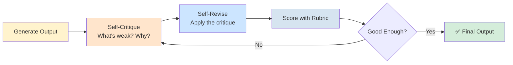

## Slide: Title
- type: title
- title: Self-Reflection and Improvement Pipelines
- subtitle: Agents That Critique Themselves and Get Better

> Week 11 of Phase 3: Advanced Patterns (Weeks 9-12)

=====

## Slide: Contents
- type: cards
- title: Contents
- subtitle: Lecture, Practice, and Discussion for Week 11

- card(blue, 📖): 1. Lecture
  - Self-reflection — when the model critiques its own work
  - The Reflexion pattern: generate → critique → revise → repeat
  - Self-bias problem and the cross-model critic solution

- card(green, 💻): 2. Practice
  - Extend Week 10 evaluator with `self_critique` + `self_revise`
  - Build a Reflexion loop on the hometown task
  - Compare same-model vs cross-model critique

- card(orange, 🗣️): 3. Discussion
  - Week 10 — 1,000 AI agents vs 10 human experts
  - Echo chamber risk applies to self-reflection too

=====

# Part 1: Lecture

## Slide: Lecture
- type: title
- title: Part 1: **Lecture**
- subtitle: From External Scoring to Self-Reflection

=====

## Slide: Where We Left Off
- type: cards
- title: Where We Left Off — **Week 10 Recap**

- card(blue, 📊): What Week 10 Built
  - Rubric (5 criteria with definitions)
  - LLM judge → numeric scores per criterion
  - Threshold loop (stop when good enough)
  - Self-evolving loop (track best, refine from best)

- card(orange, 🤔): What Was Missing
  - Scores tell you **how much** is wrong, not **why**
  - The refine prompt only knows criterion names, not specific weaknesses
  - The model doesn't reason about its own output's flaws

- card(green, 🎯): Today's Step Forward
  - Add a **qualitative critique** step before revising
  - Model writes WHY the output is weak, then uses that critique to improve
  - Same loop structure, but with **reasoning**, not just scores

=====

## Slide: What is Self-Reflection
- type: cards
- title: What is **Self-Reflection** for an LLM?

- card(blue, 🪞): The Core Idea
  - The model reads its OWN output as if it were someone else's
  - Writes a critical analysis: what works, what doesn't, why
  - Then uses that analysis to write a better version

- card(green, 🔁): Three Steps
  - **Generate** → produces an output
  - **Critique** → analyzes the output's weaknesses (free-form text)
  - **Revise** → rewrites using the critique as a guide

- card(orange, ⚡): Why This Helps
  - Critique is **specific** ("the second sentence is generic") vs scores ("specificity: 6")
  - Forces the model to articulate problems before solving them
  - Often catches issues the rubric doesn't have a criterion for

=====

## Slide: The Reflexion Pattern
- type: card-single
- title: The **Reflexion Pattern** — Generate, Critique, Revise



- card(yellow, 💡): Reflexion Adds a Reasoning Layer
  - Week 10 loop: generate → score → revise (uses rubric only)
  - Week 11 loop: generate → **critique** → revise → score (adds reasoning)
  - The critique step is the new ingredient

=====

## Slide: Critique vs Score
- type: cards
- title: **Critique vs Score** — Two Kinds of Feedback

- card(blue, 📊): Quantitative Score (Week 10)
  - "specificity: 6/10"
  - Tells you which criterion is weak
  - Doesn't tell you what specifically to change
  - Easy to compare across iterations

- card(orange, 💬): Qualitative Critique (Week 11)
  - "The text mentions 'famous food' without naming any dishes. The opening sentence reads like a tourism brochure."
  - Tells you exactly what's wrong and where
  - Hard to compare numerically — but actionable
  - Catches subtle issues a rubric misses

- card(green, 🤝): Use Both Together
  - Score = global signal (when to stop, which dimension)
  - Critique = local guidance (specific improvements)
  - Reflexion combines both

=====

## Slide: Memory Across Iterations
- type: cards
- title: **Memory** — Remembering What Didn't Work

- card(blue, 🧠): Without Memory
  - Each iteration starts fresh — no record of past mistakes
  - Model may "fix" something, then break it again later
  - Same flaws can recur across iterations

- card(green, 📓): With Memory
  - Keep a list of past critiques + what was changed
  - Pass this history to the next critique step
  - "These were the issues last time — did the revision actually fix them?"

- card(orange, 💡): Implementation
  - Append each critique to a `reflection_log`
  - Include the log in the next critique prompt
  - Model can now spot patterns: "I keep failing on accuracy"

=====

## Slide: The Self-Bias Problem
- type: cards
- title: The **Self-Bias Problem** — Why Self-Critique Has Limits

- card(red, ⚠️): The Echo Chamber Risk
  - Same model generates AND critiques the output
  - It tends to MISS the same things it would miss as a critic
  - Like proofreading your own writing — you read what you meant, not what you wrote

- card(orange, 📐): Empirical Pattern
  - Self-critique catches obvious flaws (typos, missing sections)
  - But misses subtle issues the model has a blind spot for
  - Scores tend to converge to the model's natural ceiling

- card(blue, 💡): Connection to Today's Discussion
  - This is the same echo chamber Yadanar warned about: "1,000 AI agents trained on overlapping data reinforce the same mistake"
  - Self-reflection by the same model = a one-model echo chamber

=====

## Slide: Cross-Model Critique
- type: cards
- title: **Cross-Model Critique** — Breaking the Echo Chamber

- card(blue, 🔀): The Fix
  - Use a **different model** to critique the output
  - Model A generates → Model B critiques → Model A revises
  - Different training data, different blind spots

- card(green, ✅): Why It Works
  - Two models rarely share the same blind spots
  - Critic model brings independent perspective
  - This is Huy's "epistemically diverse" principle, in code

- card(orange, ⚖️): Tradeoffs
  - More expensive (two model calls per iteration)
  - Critic model may be wrong in different ways than generator
  - Best critic isn't always the strongest model — different is what matters

- highlight-quote: "Cross-model critique = importing epistemic diversity from outside the echo chamber."

=====

## Slide: When to Use Each
- type: cards
- title: When to Use **Self-Reflection** vs Other Patterns

- card(blue, ✅): Self-Reflection Helps Most When
  - Output quality is hard to fully capture in a rubric
  - Subtle issues (style, tone, coherence) matter
  - You have budget for extra LLM calls per iteration

- card(red, ❌): Self-Reflection Helps Less When
  - Task has clear measurable success (math, code that passes tests)
  - Output is short enough that issues are obvious from the score
  - Budget is tight — rubric loop is cheaper

- card(orange, 🎯): Decision Guide
  - Short, structured output → rubric loop (Week 10)
  - Long, qualitative output → reflexion loop (Week 11)
  - Critical decisions → cross-model critique to break self-bias

=====

## Slide: Lecture Summary
- type: cards
- title: Lecture Summary — **Self-Reflection**

- card(blue, 🪞): Self-Reflection
  - Model critiques its own output qualitatively before revising
  - Critique is specific and actionable; complements numeric scores
  - Implements the **Reflexion pattern**: generate → critique → revise → score

- card(green, 📓): Memory and Cross-Model
  - Memory: track past critiques to avoid repeating fixes
  - Cross-model critique: break the self-bias echo chamber
  - Both add cost — use when quality matters more than speed

- card(orange, 🎯): The Bigger Pattern
  - Week 10 added external measurement to generation
  - Week 11 adds internal reasoning about that measurement
  - Together: an agent that can both measure AND understand its own quality

=====

# Part 2: Practice

## Slide: Practice
- type: title
- title: Part 2: **Practice**
- subtitle: Add Self-Critique to the Week 10 Evaluator

=====

## Slide: Practice Overview
- type: cards
- title: Practice Overview — **What We'll Build**

- card(blue, 🎯): The Goal
  - Extend `evaluator.py` with **two new functions**: `self_critique` + `self_revise`
  - Build a `reflexion_loop` that combines critique + scoring
  - Add a UI section to compare with Week 10's rubric loop
  - Bonus: cross-model critique to break self-bias

- card(green, 📁): Files
  - `evaluator.py` — add 3 functions (`self_critique`, `self_revise`, `reflexion_loop`)
  - `app.py` — append a new section "🪞 Reflexion Loop"
  - Reuses Week 10's `RUBRIC`, `evaluate`, `generate_aware`, and `llm_call`

- card(orange, ⚡): Why Same Task?
  - Same hometown intro → directly comparable to Week 10 results
  - You can see whether Reflexion's qualitative critique beats pure rubric scoring

=====

## Slide: Self-Critique Function
- type: practice
- title: Step 1 — **`self_critique()`** (`evaluator.py`)
- subtitle: Model analyzes its own output qualitatively

```python
# evaluator.py — add to the bottom

def self_critique(client, critic_model, text):
    """Model writes a critical analysis of the given text."""
    prompt = f"""Read the following text and write a critical analysis.

Text:
{text}

Identify:
1. The 2-3 strongest aspects (be specific — quote phrases)
2. The 2-3 weakest aspects (be specific — quote phrases)
3. Concrete changes that would improve the weakest parts

Be honest and specific. Do NOT be defensive or vague.
Do NOT just rewrite the text — only analyze it."""
    return llm_call(client, critic_model, prompt)
```

- card(yellow, 💡): Why "Be Specific" Matters
  - Without prompting for specifics, models default to vague praise
  - "Quote phrases" forces the model to anchor to actual text
  - "Do NOT rewrite" prevents the model from skipping the analysis step

=====

## Slide: Self-Revise Function
- type: practice
- title: Step 2 — **`self_revise()`** (`evaluator.py`)
- subtitle: Apply the critique to produce a revised output

```python
def self_revise(client, gen_model, text, critique):
    """Rewrite the text using the critique as guidance."""
    prompt = f"""Original text:
{text}

Critique of the text:
{critique}

Now write a revised version that:
- Addresses each weakness identified in the critique
- Keeps the strengths intact
- Applies the specific changes suggested

Output only the revised text. No commentary."""
    return llm_call(client, gen_model, prompt)
```

- card(yellow, 💡): Two Inputs, One Output
  - The model sees BOTH the original and the critique
  - This is more reliable than trying to "remember" the critique implicitly
  - "Output only the revised text" prevents extra explanations

=====

## Slide: Reflexion Loop
- type: practice
- title: Step 3 — **`reflexion_loop()`** (`evaluator.py`)
- subtitle: Combine critique + scoring + revision

```python
def reflexion_loop(client, gen_model, critic_model, judge_model, hometown,
                   max_iters=4, threshold=8):
    """Generate → critique → revise → score. Stop when all criteria ≥ threshold."""
    text = generate_aware(client, gen_model, hometown)
    history = []

    for i in range(max_iters):
        scores = evaluate(client, judge_model, text)
        avg = sum(scores.values()) / len(scores)
        critique = self_critique(client, critic_model, text)

        history.append({
            "iter": i, "text": text, "scores": scores,
            "avg": avg, "critique": critique,
        })

        weak = [k for k, v in scores.items() if v < threshold]
        if not weak:
            break  # all criteria above threshold

        text = self_revise(client, gen_model, text, critique)

    return history
```

- card(yellow, 💡): The Order Matters
  - **Score first** to know if we should keep going
  - **Critique second** to get specific improvement guidance
  - **Revise third** using both signals
  - Same threshold-based stopping as Week 10

=====

## Slide: Reflexion UI
- type: practice
- title: Step 4 — **UI: Reflexion Loop** (append to `app.py`)
- subtitle: Show critique alongside scores at each iteration

```python
# At top of app.py, update import:
from evaluator import (
    RUBRIC, generate_naive, generate_aware, generate_refine, evaluate,
    iterative_threshold, iterative_self_evolving, self_critique, self_revise, reflexion_loop,
)

# Append below the existing sections
st.divider()
st.subheader("🪞 Reflexion Loop (Self-Critique + Revise)")

rx_max_iters = st.slider("Max iterations", 1, 8, 4, key="rx_iters")
rx_threshold = st.slider("Threshold per criterion", 5, 10, 8, key="rx_th")
critic = st.selectbox(
    "Critic model (try a different one for cross-model critique)",
    ["gemini-2.5-flash", "gemini-2.0-flash", "gemini-3-flash-preview"],
    key="rx_critic",
)

if st.button("🪞 Run Reflexion Loop"):
    with st.spinner("Generating, critiquing, revising..."):
        history = reflexion_loop(
            client, model, critic, judge, hometown,
            max_iters=rx_max_iters, threshold=rx_threshold,
        )

    # Show each iteration: text, critique, scores
    for h in history:
        with st.expander(f"Iteration {h['iter']} — avg {h['avg']:.1f}"):
            st.write("**Text:**")
            st.write(h["text"])
            st.write("**Critique:**")
            st.info(h["critique"])
            st.write("**Scores:**")
            st.json(h["scores"])

    final = history[-1]
    st.subheader(f"Final — iter {final['iter']}, avg {final['avg']:.1f}")
    st.write(final["text"])
```

=====

## Slide: Cross-Model Critique
- type: practice
- title: Step 5 — **Cross-Model Critique** (no extra code)
- subtitle: Just pick a different model in the UI

- card(blue, 🔀): The Experiment
  - Run Reflexion with `model = critic` (same model) → record the final score
  - Run again with `critic` set to a DIFFERENT model → record the final score
  - The function signature already supports this — no code change needed

- card(green, 🔬): What to Look For
  - Does cross-model critique find issues same-model critique misses?
  - Are the critiques themselves different in style and depth?
  - Does the final score actually improve?

- card(orange, ⚠️): Possible Surprises
  - Cross-model may NOT improve scores if both models share biases
  - The "different" critic might just be wrong in unfamiliar ways
  - Real test: read both critiques and judge them yourself

- highlight-quote: "Don't trust the score difference alone — read what each critic said. The educational value is in noticing what each missed."

=====

## Slide: Practice Checklist
- type: card-single
- title: ✅ **Week 11 Practice Checklist**

> Complete these stages in order:

### Stage 1 — Add Self-Reflection Functions
1. - [ ] Add `self_critique()` to `evaluator.py`
2. - [ ] Add `self_revise()` to `evaluator.py`
3. - [ ] Test `self_critique` alone — does the critique mention specific phrases?
4. - [ ] Test `self_revise` alone — does the revision actually address the critique?

### Stage 2 — Build the Reflexion Loop
5. - [ ] Add `reflexion_loop()` to `evaluator.py`
6. - [ ] Append the Reflexion UI to `app.py`
7. - [ ] Run with same model as critic — observe the iteration trajectory
8. - [ ] Compare final score with Week 10's threshold loop on the same hometown

### Stage 3 — Cross-Model Critique
9. - [ ] Run with a DIFFERENT critic model
10. - [ ] Read both critique sets — what does each catch that the other misses?
11. - [ ] **Bonus**: add memory — pass past critiques to the next `self_critique` call

=====

# Part 3: Discussion

## Slide: Discussion
- type: title
- title: Part 3: **Discussion**
- subtitle: 1,000 AI Agents vs 10 Experts — and What That Means for Self-Reflection

=====

## Slide: Week 10 Discussion Recap
- type: cards
- title: Week 10 — **The Consensus Dilemma**
- subtitle: 8 responses analyzed — Hulk wins again, but the framing varies

- card(green, 📊): The Vote Distribution
  - **Hulk only (3)**: Waad, Yadanar — **2 votes**
  - **Iron Man only (1)**: Rupam, Manuella — **2 votes**
  - **Captain America + Hulk (2,3)**: Minh, Margareth — **2 votes**
  - **Iron Man + Hulk (1,3)**: Irfan — **1 vote**
  - **All three (1,2,3)**: Huy — **1 vote**

- card(blue, 🤝): The Coalition
  - 6/8 students explicitly include Hulk's verification stance
  - The "10 experts > 1,000 agents" intuition holds
  - Even Iron Man supporters (Manuella, Rupam) acknowledge human oversight needed

- card(red, 🔥): Three New Conceptual Frames
  - **Yadanar/Margareth**: the echo chamber problem (homogeneous models)
  - **Huy**: persuasive ≠ reliably correct
  - **Minh**: AI as interpolation within a "Knowledge Seed", not autonomous discovery

=====

## Slide: Theme 1
- type: cards
- title: Theme 1 — **The Echo Chamber Problem**
- subtitle: Why volume of AI agents doesn't equal reliability

- card(blue, 🔁): Yadanar's Argument
  - "If those agents are similar in design or trained on overlapping data, they can reinforce the same mistake"
  - Medical diagnosis: many models agree, but a human catches what's unusual
  - Consensus from homogeneous sources = **misleading** consensus

- card(orange, 📐): Margareth's Refinement
  - "If the 1,000 AI agents are based on similar models, they may also reinforce the same patterns"
  - Distinguishes **persuasive** (accessible, interactive) from **trustworthy** (verified)
  - AI feels persuasive in interaction but not in correctness

- card(green, 💡): Hulk's Original Frame
  - "Network a thousand unchecked models together → exponentially amplify a single hallucination"
  - This is mathematically the same as Yadanar's biological intuition
  - The echo chamber is a structural property, not a bug

- highlight-quote: "Volume of agreement ≠ correctness when the agents share blind spots." — synthesis

=====

## Slide: Theme 2
- type: cards
- title: Theme 2 — **Huy's Sharpest Cut: Persuasive ≠ Correct**
- subtitle: The deepest critique of the question itself

- card(purple, 💎): Reframing the Question
  - "The question asks which is more persuasive, but the more important question is which is more reliably correct"
  - Persuasiveness can be a **danger signal** when it diverges from correctness
  - Confident AI consensus is the most persuasive AND most dangerous form

- card(red, ⚠️): The Asymmetric Risk
  - "10 epistemically diverse human experts > 1,000 homogeneous AI agents for novel problem framing"
  - Disagreement among experts is **informative** (signal)
  - Consensus among AI agents can be a **correlated illusion** (noise)

- card(blue, 🎯): The Director's Skill
  - Know which category your problem falls into:
    - High-volume, well-specified, measurable → AI agents at scale
    - Architectural, novel, ambiguous → diverse human experts
  - Resist the persuasive force of confident AI output when you're in category 2

- highlight-quote: "Scale amplifies both insight and error. The irreplaceable skill is knowing which one you're looking at." — Huy

=====

## Slide: Theme 3
- type: cards
- title: Theme 3 — **Minh's Frame: Interpolation vs Discovery**

- card(blue, 🌱): The Knowledge Seed
  - "AI is currently confined to the boundaries of the 'Knowledge Seed' provided by human experts"
  - It rearranges and optimizes within a known space
  - Human experts provide the ground truth that anchors AI

- card(orange, 🚀): First Principles vs Interpolation
  - AI = engine of interpolation (very good at it)
  - Human = capable of First Principles intuition (rare but irreplaceable)
  - "True discovery requires the ability to step outside the existing dataset"

- card(green, 🔗): Connection to Today
  - Self-reflection works WITHIN the model's existing knowledge
  - It cannot generate insights the model doesn't already implicitly contain
  - This is why cross-model critique helps — it imports knowledge from a different "seed"

=====

## Slide: Connection to Today
- type: cards
- title: How This Connects to **Today's Practice**
- subtitle: Self-reflection has the SAME echo chamber problem at smaller scale

- card(red, ⚠️): Same-Model Critique = One-Model Echo Chamber
  - When Model A critiques Model A's output, it shares Model A's blind spots
  - You get specific feedback, but not on the issues that ALSO escape the critique
  - This is Yadanar's 1,000-agent problem at N=1

- card(green, 🔀): Cross-Model Critique = Importing Diversity
  - Use a DIFFERENT model as critic
  - It brings different blind spots — and so different insights
  - This is Huy's "epistemically diverse" principle, applied in code
  - Even one different model > N copies of the same model

- card(blue, 🎯): The Practice You Just Did
  - Stage 2 (same-model critique) → Yadanar's worst case
  - Stage 3 (cross-model critique) → the fix
  - Read the critiques side by side — was the cross-model one different in a useful way?

=====

## Slide: Activity
- type: cards
- title: Activity — **Read Two Critiques Side by Side**
- subtitle: 10 minutes — pair work

- card(blue, 📋): The Task
  - Take ONE hometown intro you generated
  - Get a same-model critique (Stage 2 result) and a cross-model critique (Stage 3 result)
  - Read both carefully

- card(orange, 🔍): Compare Along Three Dimensions
  - **Coverage**: did each critic find issues the other missed?
  - **Style**: do the two critiques have different "voices" / focus areas?
  - **Usefulness**: which critique would you actually act on?

- card(green, 💡): Discussion Question for Pairs
  - If you had unlimited budget, would you use one strong critic, or three different critics?
  - When does diversity help, and when does it just add noise?

=====

## Slide: Discussion Questions
- type: card-single
- title: 🗣️ **Week 11 Discussion Questions** (UST LMS)

> Visit: **UST LMS → Class → Discussion**

1. In today's practice, did **cross-model critique** actually find issues that **same-model critique** missed? Share one specific example. Connect to Yadanar's "echo chamber" argument from Week 10.
2. Huy distinguished "persuasive" from "reliably correct." When you read a long, fluent self-critique from an LLM, **does its eloquence make you trust it more — even when you can't verify the claims?** What guards against this?

=====

## Slide: Recommended Resources
- type: card-single
- title: Want to Learn More?

Self-Reflection Research
> 📄 [Reflexion: Language Agents with Verbal Reinforcement Learning (2023)](https://arxiv.org/abs/2303.11366)
> 📄 [Self-Refine: Iterative Refinement with Self-Feedback (2023)](https://arxiv.org/abs/2303.17651)
> 📄 [Constitutional AI — Self-Critique for Alignment (Anthropic, 2022)](https://arxiv.org/abs/2212.08073)
&nbsp;

Multi-Agent Critique
> 📄 [Improving Factuality and Reasoning via Multiagent Debate (2023)](https://arxiv.org/abs/2305.14325)
> 📚 [Anthropic: Building Effective Agents](https://www.anthropic.com/research/building-effective-agents)
&nbsp;

Anthropic Free Online Courses
> 🎓 [Building with the Claude API](https://anthropic.skilljar.com/claude-with-the-anthropic-api)
> 🎓 [Introduction to Model Context Protocol](https://anthropic.skilljar.com/introduction-to-model-context-protocol)

=====

## Slide: Wrap-Up
- type: cards
- title: Wrap-Up of **Week 11**

- card(blue, 📖): Lecture
  - Self-reflection adds qualitative critique to Week 10's quantitative scoring; the Reflexion pattern (generate → critique → revise → score) makes the loop more informed; cross-model critique breaks the self-bias echo chamber

- card(green, 💻): Practice
  - Extended `evaluator.py` with `self_critique`, `self_revise`, `reflexion_loop`; added a Reflexion UI section to `app.py` that shows critiques alongside scores; experimented with cross-model critique

- card(orange, 🗣️): Discussion
  - Week 10 review (8 responses): echo chamber problem (Yadanar, Margareth), persuasive ≠ correct (Huy), interpolation vs discovery (Minh); same-model self-reflection has the SAME echo chamber risk → cross-model critique imports diversity

**Next week:** Multi-agent collaboration — when one agent isn't enough.
