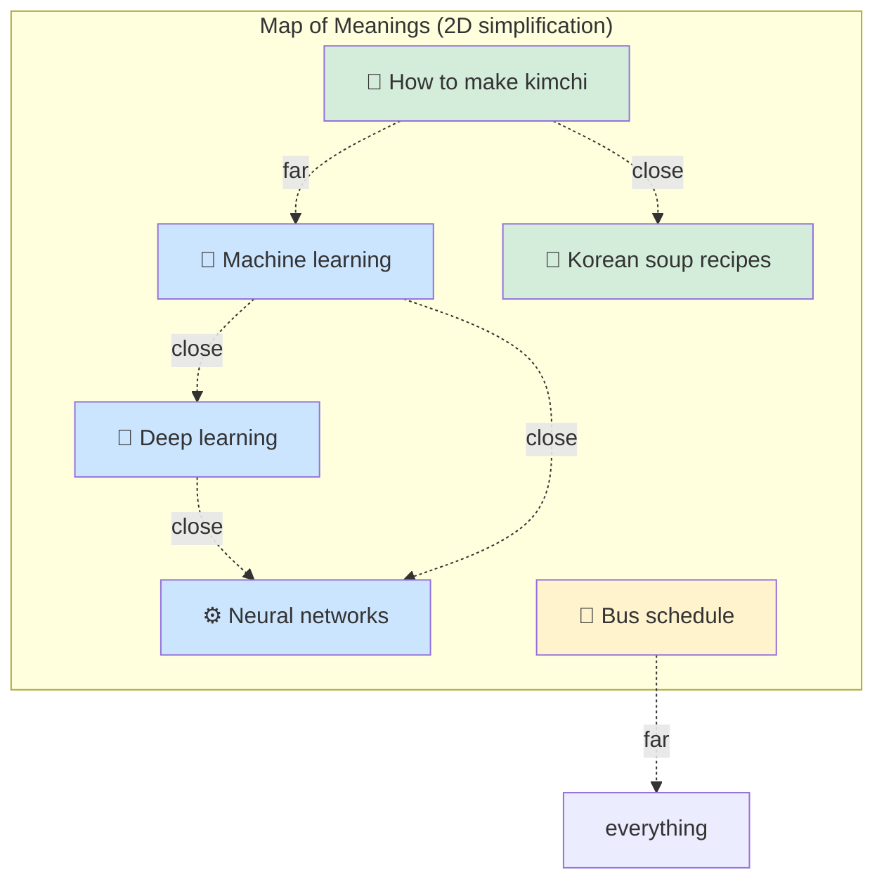

## Slide: Title
- type: title
- title: Memory and Retrieval-Augmented Generation
- subtitle: Vector Databases — How AI Remembers Across Sessions

> Week 12 of Phase 3: Advanced Patterns (Weeks 9-12)

=====

## Slide: Contents
- type: cards
- title: Contents
- subtitle: Lecture, Practice, and Discussion for Week 12

- card(blue, 📖): 1. Lecture
  - The memory problem — LLMs forget after every call
  - Embeddings, vector databases, and similarity search — explained simply
  - The RAG pattern: retrieve → augment → generate

- card(green, 💻): 2. Practice
  - Build a vector memory from your paper PDFs (extends Week 6 pipeline)
  - Ask a question → see the top N most relevant chunks with similarity scores

- card(orange, 🗣️): 3. Discussion
  - Week 11 — Is "teaching" AI a new form of mentorship?
  - The class largely rejects the metaphor — what's the better frame?

=====

# Part 1: Lecture

## Slide: Lecture
- type: title
- title: Part 1: **Lecture**
- subtitle: Long-Term Context with Vector Databases

=====

## Slide: The Memory Problem
- type: cards
- title: The **Memory Problem** — LLMs Forget Everything

- card(red, 🧠): What Today's LLM Knows
  - Only what was in its training data (months/years old)
  - Only what you put in the current prompt
  - **Nothing about your previous conversations**
  - **Nothing about YOUR documents** unless you paste them in

- card(orange, 📝): What This Means in Practice
  - You build an agent → it works in this session
  - Tomorrow you ask "what did we figure out yesterday?" → it has no idea
  - You upload 100 papers → it can read 1-2 at a time
  - There's no built-in "remember this for next time"

- card(green, 🎯): Today's Goal
  - Give the LLM a **searchable memory** of your documents
  - It can pull in the relevant parts when needed
  - Without you having to paste everything every time

=====

## Slide: The Naive Fix Fails
- type: cards
- title: The Naive Fix — **Just Paste Everything**

- card(blue, 🤔): Why Not Just Include All Papers?
  - "Just paste all 100 papers into the prompt every time"
  - Simple — model gets full context

- card(red, ❌): Why It Doesn't Work
  - **Cost**: pasting 100 papers per call costs 100x more tokens
  - **Latency**: 200,000-token prompts are slow
  - **Context limit**: even the biggest models cap around 1-2 million tokens
  - **Signal vs noise**: model gets lost in 100 papers; needs the RIGHT 2-3

- card(green, 💡): The Better Idea
  - Find the **relevant 2-3 papers** for the current question
  - Paste only those into the prompt
  - But how do we know what's relevant without reading everything?

=====

## Slide: What is an Embedding
- type: cards
- title: What is an **Embedding**?
- subtitle: The single most important concept this week

- card(blue, 🔢): The Idea
  - An embedding turns text into a **list of numbers** (typically 768 or 1024 numbers)
  - Each number represents some hidden aspect of the text's meaning
  - You don't read these numbers — but the computer can compare them

- card(green, 🪞): Why It Helps
  - Two texts with **similar meaning** get **similar number lists**
  - Two unrelated texts get **very different** number lists
  - So "compare meanings" becomes "compare lists of numbers" — fast and easy

- card(orange, 📝): Concrete Example
  - "What is a transformer in AI?" → `[0.12, -0.85, 0.34, ...]`
  - "Explain the attention mechanism" → `[0.15, -0.81, 0.31, ...]` (close!)
  - "How do I make kimchi?" → `[-0.67, 0.42, -0.91, ...]` (far away)
  - The math: just numerical distance between these lists

=====

## Slide: Map of Meanings
- type: card-single
- title: A **Map of Meanings** — The Mental Picture
- subtitle: Imagine every sentence has a location



- card(yellow, 💡): The Intuition
  - Real embeddings live in 1000+ dimensional space, not 2D — but the idea is the same
  - "Find similar meaning" = "find points near each other on this map"
  - **You don't have to understand the dimensions — just trust the distance**

=====

## Slide: What is a Vector DB
- type: cards
- title: What is a **Vector Database**?

- card(blue, 🗄️): The Definition
  - A storage system designed to find **nearest neighbors** in vector space
  - Input: a query vector
  - Output: the top N stored vectors closest to it, with similarity scores

- card(green, 📚): What It Stores
  - For each piece of text: `(text, embedding_vector, optional_metadata)`
  - Example: `("Transformers use attention...", [0.12, -0.85, ...], {"source": "paper1.pdf"})`
  - You can store millions of these and search in milliseconds

- card(orange, 🛠️): Common Choices
  - **In-memory (numpy)**: simplest, good for thousands of chunks
  - **FAISS, Chroma**: open source, fast, easy to start
  - **Pinecone, Weaviate**: hosted, production-scale
  - For today: pure numpy — you'll see exactly what's happening, no magic

=====

## Slide: Similarity Search
- type: cards
- title: **Similarity Search** — Cosine Similarity in One Slide

- card(blue, 📐): The Math (One Formula)
  - Cosine similarity = `dot(a, b) / (norm(a) * norm(b))`
  - Output is between -1 and 1
  - **1.0 = identical direction**, 0 = unrelated, -1 = opposite
  - Most text embeddings stay in 0.0–1.0 range

- card(green, 🎯): How We Use It
  - Embed user's question → query vector `q`
  - For each chunk in store: compute `cosine_sim(q, chunk_vector)`
  - Sort by similarity (highest first)
  - Return top N

- card(orange, ⚡): Interpreting the Score
  - 0.85+ → very strong match (probably what user wants)
  - 0.65–0.85 → relevant, worth showing
  - Below 0.5 → weak — probably not useful
  - Threshold values depend on your embedding model

=====

## Slide: The RAG Pattern
- type: card-single
- title: The **RAG Pattern** — Retrieval-Augmented Generation
- subtitle: Search before you generate


- card(yellow, 💡): Why "Augmented"?
  - The LLM's prompt is **augmented** with retrieved context
  - It answers based on what was just retrieved, not just training data
  - This is how ChatGPT handles file uploads, Notion AI, Perplexity, etc.

=====

## Slide: Memory of Past Tasks
- type: cards
- title: **Memory of Past Tasks** — Beyond Documents
- subtitle: The bigger picture for agentic AI

- card(blue, 📓): What to Remember
  - Past user questions + the agent's answers
  - Past tool calls + their results
  - Past failures + what fixed them
  - Reflexion critiques from Week 11

- card(green, 🔍): How Memory Helps
  - When a similar task comes up → retrieve past examples
  - "Last time I asked about X, the agent used tool Y and got result Z"
  - Avoids repeating same exploration; reuses lessons learned

- card(orange, ⚠️): Selective Memory Matters
  - Remember what worked → reinforce good patterns
  - Remember what failed → avoid same mistakes
  - But also: when should the agent **forget** outdated info?
  - This is the Week 12 discussion topic

=====

## Slide: When RAG Helps and Hurts
- type: cards
- title: When RAG **Helps** vs **Hurts**

- card(green, ✅): RAG Helps Most When
  - The answer lives in YOUR documents, not the LLM's training data
  - Documents are too many to paste in full
  - Users ask questions that map to specific passages
  - You need citations to actual sources

- card(red, ❌): RAG Hurts When
  - The retrieved chunks are not actually relevant (poor chunking, weak embeddings)
  - The question requires synthesizing across MANY chunks (top-N isn't enough)
  - The LLM gets confused by irrelevant retrieved context
  - Latency budget is tight (embedding + search adds overhead)

- card(orange, 🎯): Practical Tips
  - **Chunk size matters**: too small = lose context, too big = too much noise
  - **Always show similarity scores** to the user — transparency catches bad retrieval
  - **Hybrid search** (keyword + vector) often beats pure vector for technical domains

=====

## Slide: Lecture Summary
- type: cards
- title: Lecture Summary — **Memory and RAG**

- card(blue, 🔢): Embeddings
  - Turn text into number lists where similar meaning = similar numbers
  - This makes "find related text" a math problem (cosine similarity)

- card(green, 🗄️): Vector Database + Search
  - Stores `(text, embedding)` pairs
  - Given a query embedding, returns nearest neighbors with scores
  - You can build one in pure numpy for thousands of chunks

- card(orange, 🔁): The RAG Pattern
  - Embed query → search → retrieve top N → put in LLM prompt → generate
  - This is how AI assistants gain access to YOUR documents
  - For agentic AI: extends to remembering past tasks, failures, decisions

=====

# Part 2: Practice

## Slide: Practice
- type: title
- title: Part 2: **Practice**
- subtitle: Build a Paper Memory with Vector Search

=====

## Slide: Practice Overview
- type: cards
- title: Practice Overview — **What We'll Build**

- card(blue, 🎯): The Goal
  - Take the **MD files extracted in Week 6** (paper PDFs → Markdown)
  - Chunk them, embed each chunk, store in an in-memory vector DB
  - User asks a question → app shows **top N chunks** with similarity scores
  - Optional: pass top chunks to LLM for a synthesized answer

- card(green, 📁): New File
  - `memory.py` — chunking, embedding, vector store, search
  - `app.py` — append a new section "🧠 Paper Memory"
  - Reuses MD files in `md_output/` from Week 6

- card(orange, ⚡): Why Show Similarity Scores?
  - Transparency — user sees WHY this chunk was retrieved
  - If scores are all low (e.g., 0.3) → no good answer in the docs
  - Connects to Week 11: visible feedback enables judgment

=====

## Slide: Chunking
- type: practice
- title: Step 1 — **Chunking** (`memory.py`)
- subtitle: Split long Markdown files into searchable pieces

```python
# memory.py
from pathlib import Path

CHUNK_SIZE = 800       # characters per chunk
CHUNK_OVERLAP = 100    # overlap to preserve context across boundaries


def strip_frontmatter(text):
    """Remove YAML frontmatter (between --- markers) from a Markdown file."""
    if text.startswith("---"):
        parts = text.split("---", 2)
        if len(parts) >= 3:
            return parts[2].strip()
    return text


def chunk_text(text, size=CHUNK_SIZE, overlap=CHUNK_OVERLAP):
    """Split a long text into overlapping chunks."""
    chunks = []
    i = 0
    while i < len(text):
        chunks.append(text[i:i + size])
        i += size - overlap
    return chunks
```

- card(yellow, 💡): Why Strip Frontmatter?
  - Week 6 MD files start with YAML metadata between `---` markers
  - If we don't strip it, **chunk 0 of every paper is metadata** — pollutes search
  - We chunk only the BODY for semantic search

- card(yellow, 💡): Why Overlap?
  - A sentence might be split across two chunks
  - Overlap ensures key phrases appear in at least one chunk fully
  - Typical: 10-15% overlap (here: 100/800 ≈ 12.5%)

=====

## Slide: Embedding
- type: practice
- title: Step 2 — **Embedding Function** (`memory.py`)
- subtitle: Convert text to a vector using Gemini embeddings

```python
import numpy as np

EMBEDDING_MODEL = "gemini-embedding-001"

def embed_text(client, text, model=EMBEDDING_MODEL):
    """Get an embedding vector for a single piece of text."""
    result = client.models.embed_content(model=model, contents=text)
    return np.array(result.embeddings[0].values)


def embed_batch(client, texts, model=EMBEDDING_MODEL):
    """Embed many texts in one API call (much faster + avoids rate limits)."""
    result = client.models.embed_content(model=model, contents=texts)
    return [np.array(e.values) for e in result.embeddings]
```

- card(yellow, 💡): Single vs Batch
  - `embed_text()` — for the user's QUERY (one text)
  - `embed_batch()` — for building the store (many texts in one call)
  - Batching is dramatically faster AND helps avoid 429 rate-limit errors

=====

## Slide: Build the Store
- type: practice
- title: Step 3 — **Build the Vector Store** (`memory.py`)
- subtitle: Process all MD files into searchable chunks

```python
import time

def build_vector_store(client, md_dir="md_output",
                       batch_size=20, on_progress=None):
    """Read all MD files, chunk them, embed in batches.

    Args:
        on_progress: optional callback(fraction_done, status_text)
    """
    # 1) Collect all chunks first (strip YAML frontmatter from each file)
    chunks_meta = []
    for md_file in sorted(Path(md_dir).glob("*.md")):
        text = strip_frontmatter(md_file.read_text(encoding="utf-8"))
        for i, ch in enumerate(chunk_text(text)):
            chunks_meta.append({
                "text": ch, "source": md_file.name, "chunk_idx": i,
            })

    # 2) Embed in batches — much faster + dodges per-minute rate limits
    store = []
    total = len(chunks_meta)
    for start in range(0, total, batch_size):
        batch = chunks_meta[start:start + batch_size]
        try:
            vectors = embed_batch(client, [c["text"] for c in batch])
        except Exception as e:
            # Rate-limit hit? back off and retry once
            time.sleep(5)
            vectors = embed_batch(client, [c["text"] for c in batch])
        for c, v in zip(batch, vectors):
            store.append({**c, "embedding": v})
        if on_progress:
            on_progress((start + len(batch)) / total,
                        f"Embedded {start + len(batch)}/{total} chunks")
    return store
```

- card(yellow, 💡): Three Improvements over a Naive Loop
  - **Strip frontmatter** — chunk only body text, not YAML metadata
  - **Batch embedding** — typically 10-20x faster than per-chunk calls
  - **Progress callback + retry** — UI can show a progress bar, recovers from transient errors

=====

## Slide: Search Function
- type: practice
- title: Step 4 — **Similarity Search** (`memory.py`)
- subtitle: Cosine similarity, top-N results

```python
def cosine_sim(a, b):
    """Cosine similarity between two vectors."""
    return float(np.dot(a, b) / (np.linalg.norm(a) * np.linalg.norm(b)))


def search(client, query, store, top_k=5):
    """Return top_k chunks most similar to query, sorted by similarity."""
    query_vec = embed_text(client, query)
    scored = []
    for item in store:
        sim = cosine_sim(query_vec, item["embedding"])
        scored.append({**item, "similarity": sim})
    scored.sort(key=lambda x: -x["similarity"])
    return scored[:top_k]
```

- card(yellow, 💡): The Whole "Vector DB" in 6 Lines
  - This IS what a vector database does, just slower at scale
  - Real vector DBs use clever indexing (HNSW, IVF) for millions of vectors
  - For learning + thousands of chunks → numpy is perfect

=====

## Slide: Streamlit UI
- type: practice
- title: Step 5 — **Streamlit UI** (append to `app.py`)
- subtitle: Build store once, query many times

```python
# === Top of app.py (same setup as Week 10) ===
import os
from dotenv import load_dotenv
from google import genai

load_dotenv()
client = genai.Client(api_key=os.environ.get("GOOGLE_API_KEY"))
model = os.environ.get("LLM_MODEL", "gemini-3.1-flash-lite")

import streamlit as st
from memory import build_vector_store, search   # NEW for Week 12

# === Append at the bottom of app.py ===
st.divider()
st.header("🧠 Paper Memory (Vector Search)")

if "vector_store" not in st.session_state:
    st.session_state.vector_store = None

if st.button("🔨 Build / Rebuild Vector Store"):
    bar = st.progress(0.0)
    status = st.empty()
    def cb(frac, msg):
        bar.progress(frac)
        status.text(msg)
    st.session_state.vector_store = build_vector_store(client, on_progress=cb)
    status.text(f"✅ Built store with {len(st.session_state.vector_store)} chunks")

query = st.text_input(
    "Ask about your papers",
    placeholder="e.g., How does deep learning predict material properties?",
)
top_k = st.slider("How many results", 1, 10, 5)

if st.button("🔍 Search", disabled=not (query and st.session_state.vector_store)):
    with st.spinner("Searching..."):
        results = search(client, query, st.session_state.vector_store, top_k=top_k)

    for i, r in enumerate(results, 1):
        with st.expander(
            f"#{i} — similarity {r['similarity']:.2%} — "
            f"{r['source']} (chunk {r['chunk_idx']})"
        ):
            st.write(r["text"])
```

- card(yellow, 💡): Two Important Details
  - **`client` setup** — same `genai.Client(...)` as Week 10; reuse the same `.env`
  - **Progress callback** — wires `build_vector_store(on_progress=cb)` to `st.progress()` so the user sees embedding progress (not a frozen screen)

=====

## Slide: Bonus — RAG Answer
- type: practice
- title: Step 6 (Bonus) — **Generate an Answer with Retrieved Context**
- subtitle: Full RAG — search results feed into LLM

```python
# Bonus: append to memory.py
# Reuse Week 10's helper instead of redefining it
from evaluator import llm_call


def rag_answer(client, gen_model, query, store, top_k=5):
    """Retrieve top chunks, then ask LLM to answer with them as context."""
    results = search(client, query, store, top_k=top_k)
    context = "\n\n---\n\n".join(
        f"[Source: {r['source']}, similarity {r['similarity']:.2f}]\n{r['text']}"
        for r in results
    )
    prompt = f"""Answer the question using ONLY the context below.
If the context doesn't contain the answer, say so.

Context:
{context}

Question: {query}

Answer with citations to the source filenames."""
    return llm_call(client, gen_model, prompt), results
```

- card(yellow, 💡): Reusing `llm_call` from Week 10
  - We defined `llm_call(client, model, prompt)` in `evaluator.py` (Week 10)
  - Just import it — don't redefine the same wrapper twice
  - If you skipped Week 10, define it here:
    `def llm_call(client, model, prompt): return client.models.generate_content(model=model, contents=prompt).text`

- card(yellow, 💡): Always Return BOTH
  - Return the answer AND the retrieved chunks
  - User can verify the answer against the actual sources
  - This is the practical version of "show your work"

=====

## Slide: Practice Checklist
- type: card-single
- title: ✅ **Week 12 Practice Checklist**

> Complete these stages in order:

### Stage 1 — Build the Memory
1. - [ ] Create `memory.py` with `strip_frontmatter()`, `chunk_text()`, `embed_text()`, `embed_batch()`
2. - [ ] Test `embed_text("hello")` — confirm you get a numpy array back
3. - [ ] Test `strip_frontmatter()` on one of your MD files — does it remove the YAML block?
4. - [ ] Add `build_vector_store()` with `on_progress` callback support

### Stage 2 — Search
5. - [ ] Add `cosine_sim()` and `search()`
6. - [ ] Append the Streamlit section to `app.py` (with `st.progress` callback wired)
7. - [ ] Build the store — watch the progress bar advance
8. - [ ] Ask a question from one of your papers — does the top result come from that paper?
9. - [ ] **Verify**: open the top chunk's text — is it body content (good) or YAML metadata (bug)?

### Stage 3 — Explore
10. - [ ] Ask a question NOT covered by any paper — what similarity scores do you see?
11. - [ ] Try chunk sizes 300, 800, 1500 — does retrieval quality change?
12. - [ ] Look at chunks that "felt wrong" — was the retrieval bad, or was the question ambiguous?

### Stage 4 — Bonus
13. - [ ] Add `rag_answer()` (import `llm_call` from `evaluator.py`) and a button that uses the top chunks for an LLM answer
14. - [ ] **Persistence**: save the store to a `.npz` file so you don't re-embed each session

=====

# Part 3: Discussion

## Slide: Discussion
- type: title
- title: Part 3: **Discussion**
- subtitle: Is Teaching AI a New Form of Mentorship?

=====

## Slide: Week 11 Discussion Recap
- type: cards
- title: Week 11 — **"Is Teaching AI a New Form of Mentorship?"**
- subtitle: 9 responses analyzed — the class largely rejects the framing

- card(green, 📊): The Vote Distribution
  - **None / rejected the framing**: DongYun, Huy, Waad, Irfan — **4 votes**
  - **Hulk only (3)**: Yadanar — **1 vote**
  - **Captain America + Hulk (2,3)**: Ly, Manuella — **2 votes**
  - **New paradigm proposed**: Seher — **1 vote**
  - **Synthesis of all three (1,2,3)**: Rupam — **1 vote**

- card(blue, 🤝): The Surprise
  - Only **3 out of 9** picked a specific persona
  - **5 explicitly rejected** the question's framing
  - The class is moving from "pick a stance" → "reframe the question"
  - This is intellectual maturity, not avoidance

- card(red, 🔥): The Emerging Position
  - "Mentorship" is the wrong word — but architecture / authorship / containment IS the right frame
  - The interesting question isn't "can AI be a student?" but **"what role should humans take?"**

=====

## Slide: Theme 1
- type: cards
- title: Theme 1 — **The "Mentorship" Word is Suspect**
- subtitle: Three students attack the metaphor itself

- card(red, 🚫): Yadanar — Language Shapes Behavior
  - "If we keep calling this mentoring, are we blurring the line between genuine guidance and simple automation?"
  - The word makes us **feel safer** than the actual situation warrants
  - "It also risks letting us off the hook" — we ask "is the AI learning?" instead of "are we designing well?"

- card(orange, 🧠): Huy — It's Alignment Engineering
  - Not mentorship in the classical sense
  - It's "authoring at a higher level of abstraction"
  - "We are writing the values, constraints, and correction criteria that govern what 'better' means to the system"

- card(blue, 🔄): DongYun — But the Pattern IS Similar
  - "Mentorship: giving help and advice over a period of time"
  - Iterative prompting + refinement looks like exactly that
  - The metaphor isn't wrong — but it's incomplete

- highlight-quote: "Mentoring suggests dialogue, care, and growth of character. Self-correction is really just a technical loop." — Yadanar

=====

## Slide: Theme 2
- type: cards
- title: Theme 2 — **From Supervision to Architecture**
- subtitle: The shift in human role

- card(blue, 🏗️): Huy — Architectural Authorship
  - "Architect the value space within which autonomous action is permitted"
  - Not supervising every action — designing the rules of the game
  - "Carries just as much weight" as classical authorship

- card(orange, 🛡️): Waad — Strategic Authorship
  - "Manual supervision is simply unfeasible at scale"
  - "Define, manage, control, and verify the safe operating space"
  - Same idea, different vocabulary

- card(green, 🎓): Seher — Apprentice Paradigm
  - "AI is treated like an apprentice system"
  - Attempts → tests → receives critique → improves
  - "Humans design the boundaries, AI performs and improves, evaluation mechanisms decide when human judgment is truly needed"

- highlight-quote: "We aren't supervisors — we're architects of the value space the system operates inside." — synthesis

=====

## Slide: Theme 3
- type: cards
- title: Theme 3 — **The Boundary Problem**
- subtitle: Where humans MUST step in

- card(blue, 🔍): Concrete Examples Students Gave
  - **Ly**: AI generates simulation code → human verifies math/assumptions
  - **Manuella**: AI revises citation → may sound stronger but cite wrong source
  - **Yadanar**: AI flags errors → human decides if proposed fix is correct
  - All three describe: **AI generates, human validates final correctness**

- card(green, 🎯): The Common Pattern
  - AI handles **iteration** (cheap, repeatable, low-stakes)
  - Humans handle **judgment** (rare, expensive, high-stakes)
  - The boundary is set by the human (Seher's "design the boundaries")

- card(orange, ⚠️): The Hard Question
  - WHERE you set the boundary determines everything
  - Set it too narrow → AI can't help much
  - Set it too wide → catastrophic failures slip through
  - "Knowing where to set the boundary" = the new senior skill

=====

## Slide: Connection to Today
- type: cards
- title: How This Connects to **Today's Practice**
- subtitle: Memory is NOT mentorship — but it changes what's possible

- card(blue, 🧠): What Memory Adds
  - Vector memory = the system "remembers" past documents and (optionally) past tasks
  - This isn't learning in the human sense — it's structured retrieval
  - Yadanar's point applies: don't anthropomorphize what is "just better tuned"

- card(green, 🏗️): The Architectural Question
  - You decide what goes INTO the memory (chunks, sources, metadata)
  - You decide what queries CAN be answered (the search interface)
  - You decide what should be FORGOTTEN (stale data, failed attempts)
  - This is exactly Huy's "architecting the value space"

- card(orange, 🤔): The Selective Memory Problem
  - Should the agent remember its failed attempts?
  - If yes → it avoids repeating mistakes
  - If no → it stays unbiased, won't carry over wrong lessons
  - Today's discussion: **what should AI remember?** (this leads into next week)

=====

## Slide: Activity
- type: cards
- title: Activity — **Design the Memory Boundary**
- subtitle: 10 minutes — pair work

- card(blue, 📋): The Task
  - Imagine your midterm app, running for a year
  - Decide: what should it **remember**, what should it **forget**?
  - Make 3 lists: KEEP, FORGET, ASK USER

- card(orange, 💭): Categories to Consider
  - Past user questions + answers
  - Failed tool calls (what arguments crashed)
  - User corrections ("that's wrong, the answer is X")
  - Personal preferences ("I always want results in 2 paragraphs")
  - Old/outdated facts that have since changed

- card(green, ✅): The Test
  - Share with your partner — would their boundary settings match yours?
  - Where you disagree = where the architectural decision matters most

=====

## Slide: Discussion Questions
- type: card-single
- title: 🗣️ **Week 12 Discussion Questions** (UST LMS)

> Visit: **UST LMS → Class → Discussion**

1. Today you saw similarity scores for each retrieved chunk. **Did the scores match your intuition** of which papers were relevant? Share one example where the top score was the right answer, and one where it wasn't — what does that tell you about embedding limits?
2. Yadanar argued that calling AI self-correction "mentorship" makes people feel **safer than they should**. After building a vector memory today, **does giving an AI "memory" carry similar risks of overclaiming**? When would you call this "remembering" vs just "indexed retrieval"?

=====

## Slide: Recommended Resources
- type: card-single
- title: Want to Learn More?

Vector Databases & Embeddings
> 📚 [Google: Embeddings Guide](https://ai.google.dev/gemini-api/docs/embeddings)
> 📚 [Pinecone Learning Center — Vector Embeddings 101](https://www.pinecone.io/learn/vector-embeddings/)
> 📚 [Chroma — Open-source Vector DB](https://docs.trychroma.com/)
&nbsp;

RAG Patterns
> 📚 [Anthropic: Retrieval Augmented Generation Guide](https://docs.anthropic.com/en/docs/build-with-claude/use-cases)
> 📄 [Retrieval-Augmented Generation for NLP Tasks (Lewis et al., 2020)](https://arxiv.org/abs/2005.11401)
> 📄 [Lost in the Middle: How Language Models Use Long Contexts (2023)](https://arxiv.org/abs/2307.03172)
&nbsp;

Anthropic Free Online Courses
> 🎓 [Building with the Claude API](https://anthropic.skilljar.com/claude-with-the-anthropic-api)
> 🎓 [Introduction to Model Context Protocol](https://anthropic.skilljar.com/introduction-to-model-context-protocol)

=====

## Slide: Wrap-Up
- type: cards
- title: Wrap-Up of **Week 12**

- card(blue, 📖): Lecture
  - Embeddings turn text into number lists where similar meaning = similar numbers; vector DB = fast nearest-neighbor search over embeddings; RAG = retrieve before generate, with citations to actual sources

- card(green, 💻): Practice
  - Built a paper memory: chunk MD files → embed each chunk → store in numpy → search by cosine similarity; UI shows top N chunks with similarity scores for transparency

- card(orange, 🗣️): Discussion
  - Week 11 (9 responses): class rejects the "mentorship" metaphor; emerging consensus = humans architect the value space, not supervise every action; memory architecture = today's concrete example of that authorship

**Next week:** Reflection on the journey — what worked, what didn't, what comes next.
