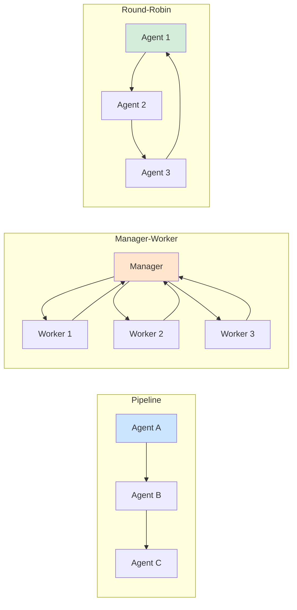
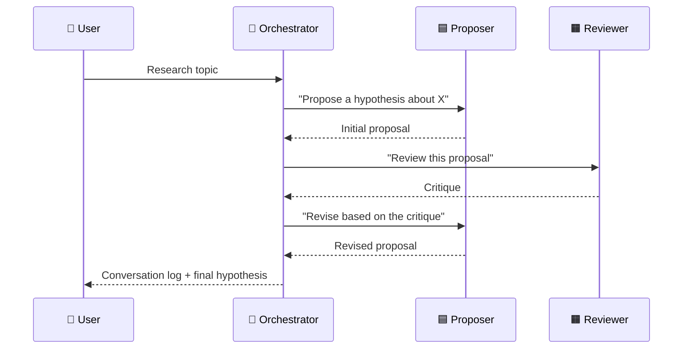

## Slide: Title
- type: title
- title: Multi-Agent Systems
- subtitle: Team Dynamics — Orchestrating Multiple Roles

> Week 13 of Phase 4: Composition and Leadership (Weeks 13-14)

=====

## Slide: Contents
- type: cards
- title: Contents
- subtitle: Lecture, Practice, and Discussion for Week 13

- card(blue, 📖): 1. Lecture
  - Roles vs personas — what changes when agents specialize
  - Three orchestration patterns: pipeline, manager-worker, round-robin
  - Information asymmetry and shared memory

- card(green, 💻): 2. Practice
  - Build a **2-agent role-play**: Hypothesis Proposer + Methodologist Reviewer
  - 3-round orchestrated flow (proposal → critique → revision)

- card(orange, 🗣️): 3. Discussion
  - Week 12 — Selective Memory: should AI remember failed experiments?
  - Leadership: when YOU manage a team of agents

=====

# Part 1: Lecture

## Slide: Lecture
- type: title
- title: Part 1: **Lecture**
- subtitle: Team Dynamics — Orchestrating Multiple Roles

=====

## Slide: The Story So Far
- type: cards
- title: The Story So Far — **Where Multi-Agent Fits**

- card(blue, 🧩): What We've Already Built
  - Week 7: Two **personas** debating (user moderates)
  - Week 9: Single agent using **tools**
  - Week 10: Single output, scored by a **judge** model
  - Week 11: **Reflexion** — same model critiques itself

- card(orange, 🤔): What's Still Missing
  - A real research team has **specialized members** (not just two opinions)
  - Each member sees **different information** and does a **different job**
  - The team runs by **structured workflow**, not free chat

- card(green, 🎯): Today's Step Forward
  - Define agents by **role (function)**, not persona (opinion)
  - Use an **orchestrator** to coordinate them programmatically
  - Practice with 2 agents → the pattern extends to N agents

=====

## Slide: Role vs Persona
- type: cards
- title: **Role vs Persona** — A Key Distinction

- card(blue, 🎭): Persona (Week 7)
  - A **viewpoint** or character: "Dr. Data, the empiricist"
  - Two personas debate the SAME question from different angles
  - Output: arguments for comparison; user judges

- card(orange, 🔧): Role (Week 13)
  - A **function** with responsibilities: "Hypothesis Proposer", "Methodologist Reviewer"
  - Each role does a **different job** in a shared workflow
  - Output: a final artifact produced collaboratively

- card(green, 💡): Practical Difference
  - Personas → adversarial, parallel ("vs")
  - Roles → cooperative, sequential ("then")
  - Both are useful — but for different goals

=====

## Slide: Three Orchestration Patterns
- type: cards
- title: Three **Orchestration Patterns** — How Teams Coordinate

- card(blue, ➡️): 1. Pipeline (Sequential Handoff)
  - Agent A finishes → passes result to Agent B → passes to Agent C
  - Example: Researcher → Writer → Editor
  - Strength: clear flow; Weakness: errors compound downstream

- card(orange, 👔): 2. Manager-Worker (Delegation)
  - A "manager" agent assigns subtasks to "worker" agents
  - Workers return results; manager decides what's next
  - Example: Project lead delegating to specialists
  - Strength: dynamic, can handle ambiguity; Weakness: manager is bottleneck

- card(green, 🔄): 3. Round-Robin (Turn-Taking)
  - Agents take turns commenting/improving the same artifact
  - Example: peer review with 3 reviewers, all see all comments
  - Strength: diverse perspectives; Weakness: can stall on disagreement

=====

## Slide: Pattern Diagram
- type: card-single
- title: Visualizing the **Three Patterns**



- card(yellow, 💡): Today's Practice Uses Pipeline + Iteration
  - Proposer → Reviewer → Proposer (3 turns)
  - Simplest pattern that shows real role specialization

=====

## Slide: Information Asymmetry
- type: cards
- title: **Information Asymmetry** — Each Agent Sees Different Things

- card(blue, 👁️): What This Means
  - Different agents have **different system prompts** (different identities and tasks)
  - They may see **different context** (e.g., the Reviewer sees the proposal, but not the Proposer's private notes)
  - This is FEATURE, not bug — diversity of view drives quality

- card(green, 🎯): Why It Matters
  - If every agent sees the same thing → they think alike → no real collaboration
  - Asymmetric context forces each role to **contribute something distinct**
  - Connects to Week 11: cross-model critique = importing different blind spots

- card(orange, ⚠️): But Be Careful
  - Too much asymmetry → agents can't communicate (no common ground)
  - The orchestrator decides what each agent sees — this is the design lever

=====

## Slide: Shared vs Private Memory
- type: cards
- title: **Shared vs Private** Memory — The Architecture Decision

- card(blue, 📓): Shared Memory
  - All agents read/write the same conversation log
  - Pro: easy alignment, everyone on the same page
  - Con: agents can be biased by what others said before them

- card(orange, 🔒): Private Memory
  - Each agent has its own context buffer
  - Pro: independent perspectives, no anchoring bias
  - Con: harder to coordinate, may duplicate work

- card(green, ⚖️): Hybrid (Most Real Systems)
  - **Shared**: the artifact being built (e.g., current draft)
  - **Private**: each agent's reasoning trace, notes
  - Orchestrator decides what gets promoted from private → shared

=====

## Slide: Today's Practice Pattern
- type: card-single
- title: Today's Practice — **2-Agent Role-Play**



- card(yellow, 💡): What Makes This Multi-Agent (vs Reflexion)
  - **Different roles**: Proposer is creative, Reviewer is rigorous — distinct prompts
  - **Different jobs**: propose vs critique vs revise — not just "improve yourself"
  - **Orchestrator-driven**: code decides the flow, not the agents

=====

## Slide: When to Use Multi-Agent
- type: cards
- title: When Multi-Agent **Helps** vs **Hurts**

- card(green, ✅): Multi-Agent Helps When
  - Task has clearly distinct sub-roles (write, review, format, fact-check)
  - You need diverse perspectives (Week 12: avoid echo chamber)
  - Workflow has natural stages with handoffs

- card(red, ❌): Multi-Agent Hurts When
  - Task is small enough for one agent to handle well
  - Roles are vague — agents end up doing the same thing
  - Budget is tight: each role costs more LLM calls
  - You're using it to "feel sophisticated" rather than solve a real coordination problem

- card(orange, 💸): The Coordination Tax
  - 2 agents ≠ 2× the cost; closer to 3–4× (system prompts, history, retries)
  - Coordination overhead grows quickly with team size
  - Start with 2, expand only when the seams between agents become clear

=====

## Slide: Lecture Summary
- type: cards
- title: Lecture Summary — **Multi-Agent Systems**

- card(blue, 🎭): Role-Based Agents
  - Agents are defined by **function** (role) — Proposer, Reviewer, Editor
  - Each role gets a distinct system prompt and a distinct job
  - Different from personas (which differ by viewpoint, not function)

- card(green, 🧭): Orchestration Patterns
  - **Pipeline**: A → B → C handoff
  - **Manager-Worker**: delegation and aggregation
  - **Round-Robin**: turn-taking peer review
  - Today: pipeline + iteration for 2-agent role-play

- card(orange, 🧩): Architecture Choices
  - Shared vs private memory, information asymmetry — these are YOUR design decisions
  - "Coordination tax" is real — multi-agent is only worth it for tasks with real role distinction
  - Next week's discussion: leadership of a digital workforce

=====

# Part 2: Practice

## Slide: Practice
- type: title
- title: Part 2: **Practice**
- subtitle: Build a 2-Agent Hypothesis Refinement Team

=====

## Slide: Practice Overview
- type: cards
- title: Practice Overview — **What We'll Build**

- card(blue, 🎯): The Goal
  - User enters a research topic
  - **Proposer** drafts a hypothesis (creative, ambitious)
  - **Reviewer** critiques it (testability, confounders, design)
  - **Proposer** revises addressing the critique
  - UI shows all 3 turns + final hypothesis

- card(green, 📁): Files
  - `team.py` — role definitions + orchestrator
  - `app.py` — append "👥 Research Team" section
  - Reuses `llm_call` from `evaluator.py` (Week 10)

- card(orange, ⚡): Why This Setup?
  - Concrete role distinction (creative vs rigorous)
  - Same conversational context but different roles → see asymmetry in action
  - 3-round pipeline is small enough to debug, big enough to feel like a team

=====

## Slide: Define Roles
- type: practice
- title: Step 1 — **Define the Roles** (`team.py`)
- subtitle: Two distinct system prompts — that's what makes them different

```python
# team.py
from evaluator import llm_call   # reuse from Week 10

ROLES = {
    "proposer": {
        "name": "Hypothesis Proposer",
        "system": """You are a creative researcher who proposes bold, testable hypotheses.
You favor ambitious but specific claims. You stay open to revision after critique.

Your task: given a research topic (and optionally prior critique), propose ONE hypothesis.
Output ONLY the hypothesis itself — 2 to 3 sentences. No preamble, no caveats.""",
    },
    "reviewer": {
        "name": "Methodologist Reviewer",
        "system": """You are a rigorous methodologist reviewing research hypotheses.

For the hypothesis given, identify:
1. Testability concerns (can it actually be measured?)
2. Confounding variables (what else could explain the predicted result?)
3. ONE concrete improvement (specific, actionable)

Be direct but constructive. Output 3-5 bullet points only. No preamble.""",
    },
}
```

- card(yellow, 💡): The Two Roles in One Glance
  - Proposer: **creative, specific, brief**
  - Reviewer: **rigorous, structured, concrete**
  - Same model, totally different behavior — purely from system prompts

=====

## Slide: Run a Role
- type: practice
- title: Step 2 — **Run a Single Role** (`team.py`)
- subtitle: Wrapping a role around `llm_call`

```python
def run_role(client, model, role_key, task, history=""):
    """Execute one agent turn with the role's system prompt + history."""
    role = ROLES[role_key]
    history_block = f"Conversation so far:\n{history}\n\n" if history else ""
    prompt = f"""{role['system']}

{history_block}Your task: {task}"""
    return llm_call(client, model, prompt)
```

- card(yellow, 💡): Why a Plain Prompt (Not Multi-Turn Messages)?
  - We're using Gemini's simple `generate_content` — single prompt per call
  - History is **inlined as text** — gives full control over what each role sees
  - For multi-turn chat threads, you'd switch to `chats.send_message()`, but this is clearer for learning

=====

## Slide: Orchestrator
- type: practice
- title: Step 3 — **The Orchestrator** (`team.py`)
- subtitle: 3 turns: propose → critique → revise

```python
def role_play_simulation(client, model, topic):
    """Run a 3-round Proposer-Reviewer-Proposer collaboration."""
    log = []

    # Round 1: initial proposal
    proposal = run_role(client, model, "proposer",
                        task=f"Propose a hypothesis about: {topic}")
    log.append({"round": 1, "role": "proposer", "text": proposal})

    # Round 2: reviewer critiques the proposal
    history = f"[Proposer]: {proposal}"
    critique = run_role(client, model, "reviewer",
                        task="Review the hypothesis above.",
                        history=history)
    log.append({"round": 2, "role": "reviewer", "text": critique})

    # Round 3: proposer revises based on critique
    history = f"[Proposer]: {proposal}\n[Reviewer]: {critique}"
    revision = run_role(client, model, "proposer",
                        task="Revise your hypothesis addressing the critique. Keep it 2-3 sentences.",
                        history=history)
    log.append({"round": 3, "role": "proposer", "text": revision})

    return log
```

- card(yellow, 💡): Notice the Information Asymmetry
  - Round 1 (Proposer): sees only the topic — must be creative
  - Round 2 (Reviewer): sees only the proposal — focuses on critique
  - Round 3 (Proposer): sees BOTH — must integrate
  - The orchestrator controls what each role sees at each step

=====

## Slide: Streamlit UI
- type: practice
- title: Step 4 — **Streamlit UI** (append to `app.py`)
- subtitle: Run the team, show all 3 rounds

```python
# === Top of app.py — same client setup as Week 10/12 ===
# (load_dotenv, genai.Client, model = os.environ.get("LLM_MODEL", "gemini-3.1-flash-lite"))
from team import ROLES, role_play_simulation

# === Append at the bottom ===
st.divider()
st.header("👥 Research Team — Proposer + Reviewer")

topic = st.text_input(
    "Research topic",
    placeholder="e.g., How does sleep affect memory consolidation in young adults?",
)

if st.button("▶️ Run Team", disabled=not topic):
    with st.spinner("Team is working..."):
        log = role_play_simulation(client, model, topic)

    for entry in log:
        role = ROLES[entry["role"]]["name"]
        icon = "🟦" if entry["role"] == "proposer" else "🟧"
        st.subheader(f"Round {entry['round']} — {icon} {role}")
        st.write(entry["text"])

    st.success("Final hypothesis is the Proposer's revision (Round 3).")
```

- card(yellow, 💡): What to Watch For
  - Round 1 hypothesis vs Round 3 hypothesis — did the critique actually improve it?
  - Are Reviewer's bullets specific or generic?
  - If Reviewer is too soft, sharpen its system prompt and re-run

=====

## Slide: Practice Checklist
- type: card-single
- title: ✅ **Week 13 Practice Checklist**

> Complete these stages in order:

### Stage 1 — Build the Team
1. - [ ] Create `team.py` with the `ROLES` dictionary (2 roles)
2. - [ ] Add `run_role()` and test it alone — does the Reviewer produce 3-5 bullets?
3. - [ ] Add `role_play_simulation()` — verify all 3 turns appear in the log

### Stage 2 — UI
4. - [ ] Append the Research Team section to `app.py`
5. - [ ] Run with a topic from your own research field
6. - [ ] Compare Round 1 vs Round 3 — did the revision actually improve?

### Stage 3 — Experiment
7. - [ ] Change the Reviewer's system prompt to be MORE harsh — does Round 3 change?
8. - [ ] Add a third turn (Reviewer's final approval) — extend `role_play_simulation()`
9. - [ ] **Bonus**: add a third role (e.g., "Final Editor") to make a Pipeline of 3

### Stage 4 — Bonus
10. - [ ] Show ONLY the final hypothesis (collapse intermediate turns) — does the user trust it less without seeing the process?
11. - [ ] Pair this with Week 10 evaluator — score the final hypothesis with the rubric

=====

# Part 3: Discussion

## Slide: Discussion
- type: title
- title: Part 3: **Discussion**
- subtitle: Selective Memory + Leadership of a Digital Workforce

=====

## Slide: Week 12 Discussion Recap
- type: cards
- title: Week 12 — **Should AI Remember Failed Experiments?**
- subtitle: 14 responses — near-universal "yes", but the consensus starts to crack

- card(green, 📊): The Vote Pattern
  - **All three (1,2,3)**: Huy, Manuella, Nazhiefah — **3**
  - **Hulk only (3)**: Irfan, Hyunwoo, Ly — **3**
  - **None / reframe**: Margareth, Yadanar, Seher — **3**
  - **Iron Man + Hulk (1,3)**: DongYun — **1**
  - **Cap + Hulk (2,3)**: Waad — **1**
  - **Iron Man + Cap (1,2, anti-Hulk)**: Gyeongsu — **1**
  - **Iron Man only (1)**: Tan — **1**
  - **"It depends" (definition)**: Jaewhoon — **1**

- card(blue, 🤝): The (Almost) Universal Yes
  - 13/14 agree failed experiments should be retained in some form
  - Backed by **real industry practice**: Waad (nuclear OEF), Hyunwoo (robotics safety)
  - The disagreement is about **how to manage** — and now, **what even counts** as a failure

- card(red, 🔥): The Cracks Appear
  - **Gyeongsu** rejects Hulk: "babysitting the system defeats automation"
  - **Jaewhoon**: "it depends what we define as 'failed experiment'" — and sometimes delete + reset is right
  - Class moves from "should we?" → "how?" → "what counts, and who decides?"

=====

## Slide: Theme 1
- type: cards
- title: Theme 1 — **The Reframers**
- subtitle: Beyond "remember or forget"

- card(blue, 🗂️): Margareth — Structured Storage
  - "Instead of storing everything in the AI's memory or context, maintain a structured history (DB, log) that can be queried"
  - Example: Bayesian optimization — past data builds a model, not just recall
  - **Selective storage AND structured use** of negative data

- card(orange, 🔥): Yadanar — Lessons, Not Logs
  - "AI should not just store failed experiments or erase them. It should learn from them."
  - "You do not remember every time you got burned, but you learn not to touch fire"
  - Transform raw failures into **abstracted principles**

- card(purple, 💎): Seher — Living Records
  - The hidden flaw in "type failures before filing": classification at storage time freezes interpretation
  - Chatbot example: frustrating conversations were filed as failures — actually the most valuable signal
  - **Proposal**: store raw data + versioned interpretation layer that updates over time

- highlight-quote: "Don't archive failures. Version them." — Seher

=====

## Slide: Theme 2
- type: cards
- title: Theme 2 — **Huy's Infrastructure + Industry Grounding**
- subtitle: The "yes" is backed by how high-stakes fields already work

- card(blue, 🏗️): Huy — Three Conditions for Useful Negative Data
  - **Contextual metadata** — a failure log without parameters/conditions is noise, not signal
  - **Temporal tagging** — a failed approach in one tech generation may be viable in the next
  - **Shared infrastructure** — most negative data is locked in proprietary lab notebooks

- card(green, ☢️): Waad — Nuclear Safety Already Does This
  - "Every model, calculation, assumption, result — successful or not — is documented"
  - **Operating Experience Feedback (OEF)**: a formal culture of preserving incidents, errors, near-misses
  - "The goal is not to hide mistakes, but to understand them" — real-world proof of the "always retain" view

- card(orange, 🤖): Hyunwoo — Robotics Safety
  - "If a system forgets the parameters that caused a collision, it may suggest the same trajectory again"
  - Negative data prevents **physical hardware damage** — concrete, not abstract
  - But "human oversight is required to understand WHY the failure occurred"

- highlight-quote: "Negative data is the boundary system that defines the safety, integrity, and efficiency of agentic exploration." — Huy

=====

## Slide: Theme 3
- type: cards
- title: Theme 3 — **The Cracks in the Consensus**
- subtitle: Two students push back on the easy "always retain + always oversee" answer

- card(red, ⚙️): Gyeongsu — Anti-Over-Oversight
  - Agrees with Iron Man (shortcut) and Captain America (integrity)
  - But **rejects Hulk**: "micromanaging the AI out of fear defeats the purpose"
  - "If we have to babysit the system at every single step, we lose all the benefits of automation"
  - A direct challenge to the dominant "human-in-every-loop" stance

- card(purple, 🔍): Jaewhoon — The Definition Problem
  - "It depends on what we define as a 'failed experiment'"
  - Engineering reality: humans must **analyze the failure first**, THEN feed it to AI — "AI cannot find the missing point unless I type every fine detail"
  - And the lone deletion case: if AI absorbed **wrong data into its weights**, "it may be better to delete all memories, reset, and re-learn"

- card(blue, 💎): Seher — Why Freezing Labels Fails (recap)
  - Classifying a failure at storage time freezes interpretation "at the worst possible moment — when you understand the least"
  - Chatbot example: suppressed "frustrating" conversations were later the most valuable signal
  - **"Don't archive failures. Version them."**

- highlight-quote: "Babysitting the system at every step loses all the benefits of automation." — Gyeongsu, vs the Hulk majority

=====

## Slide: Connection to Today
- type: cards
- title: How This Connects to **Today's Practice**
- subtitle: Multi-agent systems make Week 12's questions concrete

- card(blue, 👥): Today's Team Already Has This Problem
  - Round 2 Reviewer critiques the hypothesis — is the critique a "failure log" or a "lesson"?
  - If you saved every critique → store grows unbounded
  - If you only kept Round 3 → you lose the reasoning
  - Same selective memory question, scaled to 1 team

- card(orange, 🧭): Now Imagine 10 Agents
  - 10 specialists running in parallel for a week
  - Many proposals fail, many critiques get rejected
  - WHO decides what's "failure" worth keeping? WHO decides when to revisit old labels?
  - That role is **you** — the human leader of the digital workforce

- card(green, 🎯): Leadership Has Concrete Decisions
  - Memory policy (Margareth's structured storage)
  - Distillation policy (Yadanar's lessons-not-logs)
  - Revisit cadence (Seher's living records)
  - **Checkpoint placement** (Gyeongsu vs Hulk: oversee every step, or only key ones?)
  - These ARE leadership decisions — not "soft" management

=====

## Slide: Activity
- type: cards
- title: Activity — **Design Your Team's Memory Policy**
- subtitle: 10 minutes — pair work

- card(blue, 📋): The Task
  - Imagine your midterm app, but now running with 5 specialized agents instead of 1
  - In one year, you've accumulated:
    - 50,000 proposed hypotheses (5,000 became outputs, 45,000 were dropped)
    - 200,000 critique comments
    - 1,000 user corrections
  - What do you keep raw? What do you distill? When do you revisit?

- card(orange, 💭): Make 4 Lists
  - **KEEP RAW** (everything, unprocessed)
  - **DISTILL** (turn into abstracted lessons)
  - **DISCARD** (not worth storing)
  - **SCHEDULE TO REVISIT** (labels that may change)

- card(green, ✅): The Test
  - Share with your partner — would they make the same calls?
  - Where you disagree = where leadership judgment actually matters

=====

## Slide: Discussion Questions
- type: card-single
- title: 🗣️ **Week 13 Discussion Questions** (UST LMS)

> Visit: **UST LMS → Class → Discussion**

1. In today's 2-agent practice, the Reviewer's critique often shaped Round 3 more than the original topic. Now imagine **scaling to 10 agents** — what would you do differently when one agent's output strongly biases all the others? Connect to Week 12's echo chamber concerns.
2. Gyeongsu argued that "babysitting the system at every step loses all the benefits of automation," while the Hulk majority insists on human oversight at each step. After running your 2-agent team today, **where exactly would YOU put the human checkpoint** — every turn, only the final output, or only on disagreement? Defend your choice.

=====

## Slide: Recommended Resources
- type: card-single
- title: Want to Learn More?

Multi-Agent Frameworks
> 📚 [Microsoft AutoGen — Conversational Multi-Agent](https://microsoft.github.io/autogen/)
> 📚 [CrewAI — Role-Based Agent Teams](https://www.crewai.com/)
> 📚 [LangGraph — Stateful Multi-Actor Workflows](https://langchain-ai.github.io/langgraph/)
&nbsp;

Research Papers
> 📄 [Generative Agents: Interactive Simulacra of Human Behavior (Park et al., 2023)](https://arxiv.org/abs/2304.03442)
> 📄 [MetaGPT: Meta Programming for Multi-Agent Collaborative Framework (2023)](https://arxiv.org/abs/2308.00352)
> 📄 [Improving Factuality via Multiagent Debate (Du et al., 2023)](https://arxiv.org/abs/2305.14325)
&nbsp;

Anthropic Free Online Courses
> 🎓 [Building with the Claude API](https://anthropic.skilljar.com/claude-with-the-anthropic-api)
> 🎓 [Introduction to Model Context Protocol](https://anthropic.skilljar.com/introduction-to-model-context-protocol)

=====

## Slide: Wrap-Up
- type: cards
- title: Wrap-Up of **Week 13**

- card(blue, 📖): Lecture
  - Roles (function) differ from personas (viewpoint); three orchestration patterns — pipeline, manager-worker, round-robin; information asymmetry + shared/private memory are design choices that drive behavior

- card(green, 💻): Practice
  - Built a **2-agent Proposer-Reviewer team** with `team.py`; 3-round pipeline (propose → critique → revise); same model, different system prompts → different roles in practice

- card(orange, 🗣️): Discussion
  - Week 12 review (14 responses): near-universal yes (backed by nuclear OEF + robotics); reframers shift to HOW; first cracks appear (Gyeongsu anti-oversight, Jaewhoon's definition + deletion case); today's team makes the leadership question — where to put the human checkpoint — concrete

**Next week:** Final project showcase + course wrap-up.
