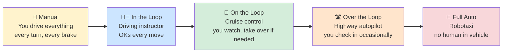

## Slide: Title
- type: title
- title: Human in the Loop (HITL)
- subtitle: Safety, Audit, and the "Stop" Button

> Week 14 of Phase 4: Composition and Leadership (Weeks 13-14)

=====

## Slide: Contents
- type: cards
- title: Contents
- subtitle: Lecture, Practice, and Discussion for Week 14

- card(blue, 📖): 1. Lecture
  - The autonomy spectrum — when humans must be in the loop
  - Three checkpoint patterns: approval, review, intervention
  - Designing "Stop" buttons, audit logs, and approval UX

- card(green, 💻): 2. Practice
  - Add a **human approval gate** to the Week 13 team workflow
  - Audit log + stop button + resume from checkpoint

- card(orange, 🗣️): 3. Discussion
  - Week 13 — Leadership of conflicting agents (12 responses)
  - Course reflection + path forward

=====

# Part 1: Lecture

## Slide: Lecture
- type: title
- title: Part 1: **Lecture**
- subtitle: Safety & Audit — Designing the "Stop" Button

=====

## Slide: Why HITL
- type: cards
- title: Why **Human in the Loop** Now?

- card(blue, 🚗): An Everyday Story First
  - Imagine self-driving cars with NO brake pedal — would you ride in one?
  - Probably not. Even if the AI is 99% safe, the **1% needs a human override**
  - Your AI agents are the same: at some point, **somebody needs a brake pedal**

- card(orange, 📚): The Story So Far in This Course
  - Week 9: agent acts via tools
  - Week 11: agent reflects on itself
  - Week 12-13: agents remember and form teams
  - Each addition gave more autonomy — at some point YOU stop being supervisor and start being a passenger

- card(red, ⚠️): The Week 13 Class Consensus
  - 12 out of 12 responses agreed: humans MUST be in the loop somewhere
  - The real disagreement was about **WHERE** (Gyeongsu vs Hulk)
  - This week: actually build the checkpoints you argued about

- card(green, 🎯): The Practical Question
  - Make every step require approval → cost + speed explode
  - Remove all approval → irreversible mistakes become invisible
  - **HITL design = picking the RIGHT checkpoints, not adding all or none**

=====

## Slide: The Autonomy Spectrum
- type: card-single
- title: The **Autonomy Spectrum** — Think of Driving a Car



- card(yellow, 💡): The Driving Analogy in One Line Each
  - **In the loop** = student driver with instructor (slowest, safest)
  - **On the loop** = cruise control (you're watching, ready to brake)
  - **Over the loop** = you set the destination, autopilot drives (you check periodically)
  - **Full auto** = robotaxi (you're a passenger, no controls)

- card(green, 🎯): The Key Insight — Mix Modes Per Action
  - Same trip can be: cruise control on highway + manual in parking lot
  - Your AI app: **strict approval for "send email" / autopilot for "search papers"**
  - HITL isn't ONE setting for the whole app — it's a choice **per action type**

=====

## Slide: Concrete Examples
- type: cards
- title: Where You've Already Lived on This Spectrum

- card(blue, 💳): "In the Loop" — Bank Transfer Over $1,000
  - Bank app asks: "Confirm: send $5,000 to John Doe?"
  - Nothing happens until you click YES
  - High stakes + irreversible → approve every single one

- card(green, 📺): "On the Loop" — Netflix Autoplay
  - Next episode starts automatically (10-sec countdown)
  - You can hit "Cancel" — but if you do nothing, it plays
  - Low stakes + reversible → default to action, give you override

- card(orange, 🌡️): "Over the Loop" — Home Thermostat
  - You set "keep room at 22°C"
  - System runs heating/cooling automatically all day
  - You only check the temperature occasionally; intervene only on weird readings

- card(red, 🤖): "Full Auto" — Spam Filter
  - You never see spam emails to approve their deletion
  - Mistakes happen (real mail in spam folder), but cost is low
  - Reviewing each one would defeat the entire purpose

=====

## Slide: Three Checkpoint Types
- type: cards
- title: Three Kinds of Human Checkpoint — **The Restaurant Analogy**

- card(blue, ✋): 1. Approval Gate — **Before the chef cooks**
  - Waiter reads your order back: "Steak, medium-rare, no garlic — correct?"
  - Kitchen doesn't start until you confirm
  - For AI: "Agent wants to send this email — Send / Cancel / Edit?"
  - **Use when**: action is irreversible OR expensive (sending money, deleting files)

- card(orange, 👁️): 2. Review — **After the meal arrives**
  - You eat → you check the bill → "wait, I didn't order this dessert"
  - The action already happened, but you can complain / correct / refund
  - For AI: agent runs, you read logs later, flag mistakes for next run
  - **Use when**: action is cheap and reversible (search a paper, draft a summary)

- card(red, ⛔): 3. Intervention — **Mid-cooking, you smell burning**
  - Chef is in the middle of preparing → you run in and yell "STOP!"
  - Whatever was being made gets halted; you decide if it's salvageable
  - For AI: long task is running → user clicks "Stop" → it pauses cleanly
  - **Use when**: tasks take a long time and conditions might change mid-way

- highlight-quote: "Before / After / During — every real system uses all three at different points. The skill is matching the right one to the right action."

=====

## Slide: Designing Stop Buttons
- type: cards
- title: Designing Stop Buttons — **The Elevator vs The Plug**

- card(red, ❌): Bad Stop Button — **Pulling the Plug**
  - Imagine yanking your laptop's power cord mid-write
  - You lose your document; the file is corrupted; restart from scratch
  - In AI: kills the call mid-stream, leaves half-written outputs, no record
  - Worse: next run has no idea what happened

- card(green, ✅): Good Stop Button — **The Elevator Emergency Stop**
  - Elevator finishes reaching the next floor, THEN stops safely
  - Doors open, you can step out, system knows exactly where it is
  - Anyone can press "Resume" and the elevator continues normally
  - In AI: **stop at the next safe boundary** (end of current step, not mid-step)

- card(orange, 🔑): Four Properties of a Good Stop Button
  - **Safe boundary**: finishes the current step, then halts (no orphaned state)
  - **State-saved**: remembers what was done — like a video game save point
  - **Resumable**: a "Resume" button picks up where you stopped
  - **Logged**: the stop itself is recorded (when + who + why)

- highlight-quote: "Pulling the plug is fast. Pressing the elevator stop button is safe. Build the second one."

=====

## Slide: The Audit Log
- type: cards
- title: The Audit Log — **The Airplane Black Box**

- card(blue, ✈️): The Analogy
  - Every commercial flight has a "black box" that records EVERYTHING
  - Pilot inputs, sensor readings, every alarm, every decision
  - **When something goes wrong**, investigators replay it
  - Same for AI agents: log what happened so you can replay it later

- card(green, 📓): What to Record (the 5 W's)
  - **What** did the agent do or propose?
  - **When** did it happen? (timestamp)
  - **Who** decided? (agent X, or human Y who approved)
  - **Why**: what inputs led to this action? (prompt, retrieved context)
  - **Outcome**: what was produced or what did the human decide?

- card(orange, 🎯): What the Log Buys You
  - **"Why did it do that last Tuesday?"** → you can actually answer
  - **Pattern spotting**: "I rejected this kind of suggestion 5 times" → fix the prompt
  - **Trust**: users believe the system because they can SEE the history
  - **Compliance**: collaborators / regulators can verify the process

- card(red, ⚠️): What NOT to Log
  - Passwords, API keys, personal info — sanitize before writing
  - Avoid logging gigabytes of redundant context — store references instead
  - The log itself needs a retention policy (delete after N days)

=====

## Slide: Approval UX
- type: cards
- title: How to Ask the Human — **Three Familiar UI Patterns**

- card(blue, ⏸️): Inline (blocking) — **Like a Pop-up Confirmation**
  - "Are you sure you want to delete this file?"
  - You can't continue until you click Yes or No
  - Best for: **rare, important decisions** (1-2 per session)
  - Bad for: every search query (you'd quit the app in frustration)

- card(green, 📬): Async (queue) — **Like Your Email Inbox**
  - Requests pile up in a list; you review when convenient
  - Maybe a notification: "5 items waiting for your approval"
  - Best for: **flows that take hours/days**, multi-person teams
  - Example: code reviewers approving pull requests overnight

- card(orange, 📊): Batch (dashboard) — **Like Grading Assignments**
  - "Here are 50 things to approve. Approve all / reject 3 / edit 2"
  - You see them side-by-side, spot patterns quickly
  - Best for: **routine high-volume** (50+ similar decisions at once)
  - Example: moderating social media posts

- card(red, 💸): The Hidden Cost of Asking
  - Every approval click = ~30 seconds of human attention
  - 100 approvals/day = ~50 minutes of focused work
  - **Pick the cheapest UI for the decision** — but don't skip the decision

=====

## Slide: The Checkpoint Tradeoff
- type: cards
- title: The Tradeoff — **More Safety Costs More Speed**

- card(red, ⚖️): Gyeongsu's Critique (from Week 12)
  - "If we have to babysit the system at every step, we lose all the benefits of automation"
  - Too many checkpoints → app becomes useless (you'd just do it yourself)

- card(orange, 🪧): "Approval Theater" — The Trap to Avoid
  - This is when users **click "approve" without reading**
  - Like quickly clicking "Accept Cookies" on every website without thinking
  - The checkpoint exists on paper, but nobody actually checks anything
  - **Result**: you pay the speed cost AND get no safety benefit

- card(green, 🎯): Four Questions to Decide Where Checkpoints Go
  - **Can you undo it?** No → approval needed (sending email, deleting data)
  - **What's the cost if wrong?** High → approval; low → maybe auto
  - **Is the AI confident?** Routine task it's seen 1,000 times → auto; novel → human
  - **Will you check the log later?** If yes, you can let it run and review

- card(blue, 👍): A Reasonable Default Rule
  - Routine, reversible actions → **on the loop** (review samples)
  - Irreversible or novel actions → **in the loop** (approval before)
  - Physical or financial real-world consequences → **never fully auto**

=====

## Slide: Real-World Patterns
- type: cards
- title: HITL **in the Wild** — Patterns You've Already Used

- card(blue, 💳): Online Shopping Checkout
  - Browse + add to cart → automatic (no approval needed)
  - Final payment step → **always asks you to confirm**
  - Irreversible (charging the card) gets the approval gate

- card(orange, 🏥): Medical AI for Tumor Screening
  - AI scans 1,000 X-rays overnight, flags 20 as suspicious (auto)
  - Radiologist reviews ONLY the 20 flagged ones the next morning (in the loop)
  - Final diagnosis decision = always human
  - Yadanar's Week 13 example, applied at hospital scale

- card(green, 🔬): Lab Experiments (Your Field!)
  - AI suggests an experimental setup → you double-check before running
  - Experiment runs autonomously → you review the data afterward
  - If results look weird → you intervene (re-run, adjust, debug)
  - **All three checkpoint types in ONE workflow**

- card(red, ⚛️): Nuclear Plant Operations (Waad's example)
  - Monitors run automatically, dashboards show health
  - Routine adjustments → automated
  - Anything affecting reactor → requires multiple human signoffs
  - **Same plant uses ALL FOUR levels** of the autonomy spectrum

=====

## Slide: Lecture Summary
- type: cards
- title: Lecture Summary — **HITL**

- card(blue, 🎚️): The Spectrum
  - Full manual ↔ in-the-loop ↔ on-the-loop ↔ over-the-loop ↔ full auto
  - Pick a different point per action, not per system

- card(green, ✋): Three Checkpoint Types
  - **Approval gate** (before), **Review** (after), **Intervention** (during)
  - Designed correctly, each adds safety without killing speed

- card(orange, 📓): The Plumbing
  - Stop button = checkpoint-aware + state-preserving + resumable + auditable
  - Audit log = action / inputs / output / decision / actor / time
  - These are the **engineering** that makes "humans in the loop" actually work

=====

# Part 2: Practice

## Slide: Practice
- type: title
- title: Part 2: **Practice**
- subtitle: Add a Human Approval Gate to the Week 13 Team

=====

## Slide: Practice Overview
- type: cards
- title: Practice Overview — **What We'll Build**

- card(blue, 🎯): The Goal — Adding a "Confirm Order" Step
  - Remember the restaurant analogy? We'll add the waiter's confirmation
  - Take Week 13's Proposer-Reviewer pipeline
  - After the Reviewer critiques → **pause and ask the human**
  - "Should we revise based on this critique, or is the critique wrong?"

- card(green, 📁): Files
  - `hitl.py` — audit log + state machine (the "kitchen status board")
  - `app.py` — add a new HITL section with 3 buttons (Approve / Reject / Stop)
  - Reuses `team.py` from Week 13

- card(orange, ⚡): Why THIS Specific Spot?
  - The critique → revise boundary is **short** but **high-value**
  - User reads ONE critique → makes ONE decision → big effect on the final answer
  - **Best ratio of approval cost vs decision impact** in the whole stack
  - You don't want to approve every word — but this one is worth it

=====

## Slide: Audit Log
- type: practice
- title: Step 1 — **Audit Log Module** (`hitl.py`)
- subtitle: Append-only record of every action + decision

```python
# hitl.py
import json, time
from pathlib import Path

LOG_PATH = Path("hitl_audit.jsonl")


def log_event(event_type, **fields):
    """Append one event to the audit log (JSON Lines format)."""
    record = {"ts": time.time(), "type": event_type, **fields}
    with LOG_PATH.open("a", encoding="utf-8") as f:
        f.write(json.dumps(record, ensure_ascii=False) + "\n")
    return record


def load_log(limit=50):
    """Read the most recent N events (newest first)."""
    if not LOG_PATH.exists():
        return []
    lines = LOG_PATH.read_text(encoding="utf-8").splitlines()
    return [json.loads(line) for line in lines[-limit:][::-1]]
```

- card(yellow, 💡): Why JSON Lines (`.jsonl`)?
  - Append-only — safe to write while reading
  - One event per line — easy to grep, tail, parse
  - Industry standard for audit trails / structured logs

=====

## Slide: Approval State Machine
- type: practice
- title: Step 2 — **Approval States** (`hitl.py`)
- subtitle: Track where the flow is + what the user decided

```python
# Add to hitl.py
from enum import Enum

class FlowState(str, Enum):
    IDLE = "idle"
    PROPOSED = "proposed"           # Round 1 done, waiting for nothing
    CRITIQUED = "critiqued"         # Round 2 done, waiting for human decision
    APPROVED_REVISION = "approved"  # Human said "go ahead and revise"
    REJECTED = "rejected"           # Human said "stop, this critique is wrong"
    REVISED = "revised"             # Round 3 done
    STOPPED = "stopped"             # User clicked Stop


def init_state():
    """Initialize a fresh flow state dict."""
    return {
        "state": FlowState.IDLE,
        "topic": "",
        "proposal": "",
        "critique": "",
        "revision": "",
        "human_note": "",
    }
```

- card(yellow, 💡): Why an Explicit State Machine?
  - Streamlit reruns the whole script on every click — you need persistent state
  - The states give the UI a clear "what should I show / which buttons are enabled"
  - This is the core pattern for ANY interactive multi-step agent UI

=====

## Slide: The Gated Workflow
- type: practice
- title: Step 3 — **UI: Gated Workflow** (append to `app.py`)
- subtitle: Run Round 1+2 automatically; pause; resume after human decision

```python
from team import run_role
from hitl import log_event, load_log, init_state, FlowState

if "hitl" not in st.session_state:
    st.session_state.hitl = init_state()
flow = st.session_state.hitl

st.divider()
st.header("🛂 HITL Team — Human Approval Gate")

topic = st.text_input("Research topic", value=flow["topic"], key="hitl_topic")

# === Stage A: Start (Round 1 + Round 2 auto-run) ===
if flow["state"] == FlowState.IDLE:
    if st.button("▶️ Start (Propose + Critique)", disabled=not topic):
        flow["topic"] = topic
        flow["proposal"] = run_role(client, model, "proposer",
                                    task=f"Propose a hypothesis about: {topic}")
        log_event("propose", text=flow["proposal"])

        flow["critique"] = run_role(client, model, "reviewer",
                                    task="Review the hypothesis above.",
                                    history=f"[Proposer]: {flow['proposal']}")
        log_event("critique", text=flow["critique"])

        flow["state"] = FlowState.CRITIQUED
        st.rerun()
```

=====

## Slide: Approval Gate UI
- type: practice
- title: Step 4 — **Approval Gate UI** (continue in `app.py`)
- subtitle: Show proposal + critique, wait for human decision

```python
# === Stage B: Show critique, wait for human decision ===
if flow["state"] == FlowState.CRITIQUED:
    st.subheader("🟦 Proposal")
    st.write(flow["proposal"])
    st.subheader("🟧 Critique")
    st.info(flow["critique"])

    flow["human_note"] = st.text_area(
        "Optional note to the Proposer (will be passed to Round 3)",
        value=flow["human_note"],
    )

    col1, col2, col3 = st.columns(3)
    if col1.button("✅ Approve — proceed to revise"):
        log_event("decision", choice="approve", note=flow["human_note"])
        flow["state"] = FlowState.APPROVED_REVISION
        st.rerun()
    if col2.button("❌ Reject — discard critique"):
        log_event("decision", choice="reject", note=flow["human_note"])
        flow["state"] = FlowState.REJECTED
        st.rerun()
    if col3.button("⛔ Stop"):
        log_event("decision", choice="stop")
        flow["state"] = FlowState.STOPPED
        st.rerun()
```

- card(yellow, 💡): Three Buttons = Three Decisions
  - **Approve**: critique is useful, run Round 3 with it
  - **Reject**: critique is wrong, stop here (or restart)
  - **Stop**: I'm done, save the audit trail and exit cleanly

=====

## Slide: Resume + Final + Log View
- type: practice
- title: Step 5 — **Resume, Show Final, View Audit Log**

```python
# === Stage C: Apply human decision ===
if flow["state"] == FlowState.APPROVED_REVISION:
    history = (f"[Proposer]: {flow['proposal']}\n"
               f"[Reviewer]: {flow['critique']}\n"
               f"[Human note]: {flow['human_note']}")
    flow["revision"] = run_role(client, model, "proposer",
        task="Revise your hypothesis using the critique + human note. 2-3 sentences.",
        history=history)
    log_event("revise", text=flow["revision"])
    flow["state"] = FlowState.REVISED
    st.rerun()

if flow["state"] in (FlowState.REVISED, FlowState.REJECTED, FlowState.STOPPED):
    st.subheader(f"Final state: {flow['state'].value}")
    if flow["revision"]:
        st.success(flow["revision"])
    if st.button("🔄 New Run"):
        st.session_state.hitl = init_state()
        st.rerun()

# === Audit log viewer (always visible) ===
with st.expander("📓 Audit Log (recent 50 events)"):
    for ev in load_log():
        st.markdown(
            f"`{time.strftime('%H:%M:%S', time.localtime(ev['ts']))}` "
            f"**{ev['type']}** — {ev.get('choice', ev.get('text', ''))[:120]}"
        )
```

- card(yellow, 💡): The Resume Pattern
  - State is stored in `session_state` → Streamlit reruns don't lose progress
  - Each button click changes state + calls `st.rerun()`
  - For multi-session resume, swap `session_state` for a database — same pattern

=====

## Slide: Practice Checklist
- type: card-single
- title: ✅ **Week 14 Practice Checklist**

### Stage 1 — Build the HITL Module
1. - [ ] Create `hitl.py` with `log_event()`, `load_log()`, `FlowState`, `init_state()`
2. - [ ] Test logging by calling `log_event("test", x=1)` → check `hitl_audit.jsonl` was created
3. - [ ] Make sure the file appends (run twice — should have 2 lines)

### Stage 2 — Wire the Gated UI
4. - [ ] Append the HITL section to `app.py` (Steps 3, 4, 5 above)
5. - [ ] Run end-to-end: enter topic → see proposal + critique → click Approve → see revision
6. - [ ] Open the audit log expander — are all events recorded?

### Stage 3 — Test Each Decision Path
7. - [ ] Run the flow, click **Approve** → does the human note actually appear in the revision?
8. - [ ] Run again, click **Reject** → does the flow stop cleanly without running Round 3?
9. - [ ] Run again, click **Stop** mid-flow → does the audit log capture the stop event?

### Stage 4 — Reflect
10. - [ ] Look at your audit log after 3-4 runs. Could you reconstruct what happened without your memory?
11. - [ ] Where else in your capstone (Week 12 + 13) would an approval gate matter most? Why?

=====

# Part 3: Discussion

## Slide: Discussion
- type: title
- title: Part 3: **Discussion**
- subtitle: Leadership Frameworks + Course Reflection

=====

## Slide: Week 13 Discussion Recap
- type: cards
- title: Week 13 — **Leadership of Conflicting Agents**
- subtitle: 12 responses — the class is now responding to each other, not just to the personas

- card(green, 📊): The Vote Pattern
  - **None / new framework**: Huy, Seher — **2** (the architects)
  - **Hulk only (3)**: Yadanar, Hyunwoo — **2**
  - **Cap + Hulk (2,3)**: Manuella, Waad — **2**
  - **Iron Man + Hulk (1,3)**: DongYun, Irfan — **2**
  - **All three (1,2,3)**: Minh — **1**
  - **Mostly Iron Man, pushes back on hierarchy**: Margareth — **1**
  - **Hulk-leaning, moderate**: Ly, Rupam — **2**

- card(blue, 🆕): What's New This Week
  - **Students respond to each other** — Seher critiques Huy's framework; Waad critiques both
  - The discussion has become a multi-round dialogue
  - The class is evolving into a real intellectual community

- card(red, 🔥): The Real Debate Now
  - It's not Iron Man vs Cap vs Hulk anymore
  - It's **Huy's Tripartite** vs **Seher's Evolutionary** vs **Waad's Reversibility Constraint**
  - Three serious architectural proposals from your classmates

=====

## Slide: Theme 1
- type: cards
- title: Theme 1 — **The Two Architectures: Huy vs Seher**
- subtitle: The most sophisticated proposals — and where they disagree

- card(blue, 🏛️): Huy — Tripartite Orchestration
  - **Layer 1**: pre-specified objective hierarchy (cost vs security vs ... decided upfront)
  - **Layer 2**: tiered escalation (severity + irreversibility → auto / orchestrator / human)
  - **Layer 3**: hard split — **coordination conflicts** (algorithmic) vs **epistemic conflicts** (must go to humans)
  - Director's job: design the constitution, not arbitrate every dispute

- card(orange, 🌱): Seher — Evolutionary Conflict Governance
  - Huy's framework "assumes it is correctly designed from the start"
  - But "the most dangerous conflicts are precisely the ones nobody predicted"
  - **Proposal**: every conflict logged; recurring conflicts auto-flag for governance update
  - Humans are **architects of evolving rules**, not arbitrators of daily conflicts

- card(green, 🤝): The Real Disagreement
  - Huy: get the framework right upfront → operations run smoothly
  - Seher: no framework is right upfront → build one that **rewrites itself**
  - Same goal (scalable + safe), opposite epistemology (designed vs evolved)

- highlight-quote: "This approach builds a constitution that rewrites itself when reality proves it incomplete." — Seher

=====

## Slide: Theme 2
- type: cards
- title: Theme 2 — **Waad's Reversibility Constraint**
- subtitle: The nuclear-safety counter to both architectures

- card(blue, ☢️): The Field Argument
  - Both Huy and Seher "assume governance failures are recoverable"
  - In nuclear: "some autonomous errors may lead to irreversible consequences"
  - Therefore: defense-in-depth, conservative decision-making, strong human authority on high-consequence calls

- card(red, ⏸️): The Added Constraint
  - "Not every conflict should be optimized for speed or efficiency"
  - **Some decisions must intentionally remain slow, conservative, human-centered**
  - Safety, accountability, public trust > operational velocity in high-stakes domains

- card(orange, 🌐): Why This Matters Beyond Nuclear
  - Medical (Yadanar's tumor diagnosis example)
  - Robotics (Hyunwoo's collision parameters)
  - Any domain where rollback isn't possible
  - **Architectures should encode irreversibility as a first-class concept**

- highlight-quote: "The goal is not to eliminate human involvement, but to ensure that automation enhances human judgment rather than replaces it." — Waad

=====

## Slide: Connection to Today
- type: cards
- title: How This Connects to **Today's Practice**
- subtitle: The approval gate IS where the architectures meet code

- card(blue, 🛂): Huy's Tripartite, In Three Buttons
  - **Approve**: this is a coordination call → automatic (orchestrator-mediated)
  - **Reject**: this is an epistemic disagreement → human judgment overrides
  - **Stop**: this is irreversibility kicking in → halt cleanly
  - Your 3 buttons are a tiny instance of Huy's tiered escalation

- card(orange, 🌱): Seher's Evolution, In the Audit Log
  - Every approval / rejection / stop is logged with context
  - When you see "I rejected the same kind of critique 5 times this week" → that's a signal to UPDATE the Reviewer's prompt
  - The audit log enables Seher's "rewrites itself" pattern

- card(red, ⏸️): Waad's Reversibility, In the Stop Button
  - The stop button is a checkpoint that preserves state — you can't lose work
  - For irreversible actions (e.g., publishing, sending), you'd put approval BEFORE the action, not after
  - Apply per-action — exactly Waad's "conservative for high-consequence"

=====

## Slide: Course Reflection
- type: cards
- title: Looking Back — **What Changed?**

- card(blue, 📅): Where You Started (Week 1)
  - "What is agentic AI? How is it different from ChatGPT?"
  - Mostly conceptual; you'd never built one

- card(green, 🛠️): Where You Are Now (Week 14)
  - You can build: RAG systems, multi-agent teams, self-evaluating pipelines, HITL gates
  - You can DEBATE: architectures, evaluation, leadership, oversight tradeoffs
  - You have working code you wrote yourself across 14 weeks

- card(orange, 🧭): The Real Skill You Acquired
  - Not the specific code patterns (those will be obsolete in 18 months)
  - But the **disposition**: decompose tasks, measure quality, design tradeoffs, place humans where they matter
  - And the **vocabulary** to discuss these systems with rigor

- highlight-quote: "The patterns will change. The way of thinking won't."

=====

## Slide: Path Forward
- type: cards
- title: **Path Forward** — Where to Go Next

- card(blue, 🎓): If You Want to Go Deeper
  - **Anthropic's Building Effective Agents** — the most practical overview in the field
  - **MCP (Model Context Protocol)** — connect agents to external tools cleanly
  - **Agent Skills** — reusable, shareable agent capabilities

- card(green, 🔬): For Your Research
  - Take ONE pattern from the course → apply to ONE recurring task in your lab
  - Add an approval gate at the riskiest step
  - Measure: did it actually save time AND maintain quality?

- card(orange, 👥): Keep the Discussion Going
  - The level of dialogue you reached in Weeks 11-13 is the goal — keep it up
  - Find or build a small community to debate architectural decisions
  - The patterns you've learned are starting points, not destinations

- card(red, ⚠️): The Trap to Avoid
  - "I'll wait until the perfect framework / model / tool exists"
  - The framework you build for YOUR problem will always beat the generic one
  - Start small. Ship something. Iterate.

=====

## Slide: Discussion Questions
- type: card-single
- title: 🗣️ **Week 14 Discussion Questions** (UST LMS)

> Visit: **UST LMS → Class → Discussion**

1. After building today's approval gate, **where in your own midterm/capstone project** would you add an approval step — and where would adding one be approval theater? Be specific about the boundary.
2. Looking back at the **whole semester**, which week's pattern do you think you'll actually USE in your research, and which one was interesting but you won't reach for? Honest reflection — no wrong answers.

=====

## Slide: Recommended Resources
- type: card-single
- title: Where to Go Next

HITL & Audit
> 📚 [Anthropic: Building Effective Agents](https://www.anthropic.com/research/building-effective-agents)
> 📚 [LangGraph — Human-in-the-Loop Workflows](https://langchain-ai.github.io/langgraph/concepts/human_in_the_loop/)
> 📄 [Constitutional AI — Self-Critique with Human-Defined Rules (2022)](https://arxiv.org/abs/2212.08073)
&nbsp;

Production Patterns
> 📚 [Temporal — Durable Workflow Orchestration](https://temporal.io/)
> 📚 [Model Context Protocol (MCP)](https://modelcontextprotocol.io/)
&nbsp;

Anthropic Free Online Courses
> 🎓 [Building with the Claude API](https://anthropic.skilljar.com/claude-with-the-anthropic-api)
> 🎓 [Introduction to Model Context Protocol](https://anthropic.skilljar.com/introduction-to-model-context-protocol)
> 🎓 [Introduction to Agent Skills](https://anthropic.skilljar.com/introduction-to-agent-skills)

=====

## Slide: Wrap-Up
- type: cards
- title: Wrap-Up of **Week 14** — and the Course

- card(blue, 📖): Lecture
  - Autonomy spectrum (manual ↔ auto); three checkpoint types (approval / review / intervention); stop buttons need checkpoint-aware + state-preserving + auditable design; audit log captures what / when / by whom / decision

- card(green, 💻): Practice
  - Added a **human approval gate** to the Week 13 team: after critique, user clicks Approve / Reject / Stop, with a note channel; audit log records every event in JSONL

- card(orange, 🗣️): Discussion
  - Week 13 (12 responses): Huy's Tripartite vs Seher's Evolutionary vs Waad's Reversibility — the class debating at the level of architectures; today's three-button gate is a tiny instance of these frameworks

**Thank you for a great semester. Now go build something — and put the humans where they matter.**
