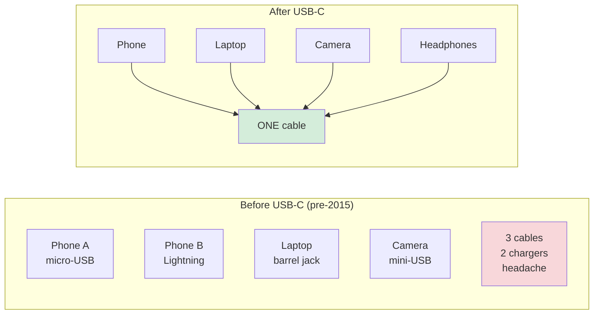

## Slide: Title
- type: title
- title: Standardization & Expansion
- subtitle: Connectivity through Model Context Protocol (MCP)

> Week 15 of Phase 5: Ecosystem (Weeks 15-16)

=====

## Slide: Contents
- type: cards
- title: Contents
- subtitle: Lecture, Practice, and Discussion for Week 15

- card(blue, 📖): 1. Lecture
  - Why standards matter — the USB-C analogy
  - What MCP is and how it differs from Week 9's function calling
  - The ecosystem effect of standardization

- card(green, 💻): 2. Practice
  - Build a **tiny MCP server** with 2 tools
  - Connect to it from a client — see interoperability in action

- card(orange, 🗣️): 3. Discussion
  - Sustainability — should research depend on a single AI vendor?
  - Open standards vs proprietary platforms

=====

# Part 1: Lecture

## Slide: Lecture
- type: title
- title: Part 1: **Lecture**
- subtitle: Connectivity — Standardizing How Agents Plug In

=====

## Slide: The Story So Far
- type: cards
- title: The Story So Far — **Why Standards Now?**

- card(blue, 🔧): What We've Built
  - Week 9: agents call tools (function calling)
  - Week 12: agents query memory (RAG)
  - Week 13: agents work in teams
  - Week 14: humans approve at checkpoints

- card(orange, ⚠️): The Problem We Haven't Faced
  - Every tool you wrote was **custom** for your app
  - If your friend wrote a great tool, you'd need to **rewrite it** for your code
  - Every model vendor has a slightly different API for tools
  - **There's no shared "language" for AI ↔ tool connections**

- card(green, 🎯): What Today Solves
  - A **standard protocol** so any AI can talk to any tool
  - Write the tool once → any compatible AI can use it
  - This is **MCP — Model Context Protocol**

=====

## Slide: USB-C Analogy
- type: card-single
- title: The **USB-C Analogy** — Why Standards Matter
- subtitle: You've already lived this story with physical devices



- card(yellow, 💡): The Lesson
  - **Before USB-C**: every device had its own cable; travel required a bag of chargers
  - **After USB-C**: one cable works for everything; ecosystems flourish
  - **MCP is doing the same for AI tools**: one protocol, many tools, any AI

=====

## Slide: What is MCP
- type: cards
- title: What is **MCP**? — In One Slide

- card(blue, 🔌): The Definition
  - **MCP = Model Context Protocol** (announced by Anthropic, 2024)
  - An **open standard** for how AI agents connect to external tools and data
  - Think of it as **the AI's USB port** — a universal jack for plugging in capabilities

- card(green, 📦): The Pattern
  - **MCP server** = a small program that exposes tools/data (the "device")
  - **MCP client** = the AI app that consumes them (the "laptop with USB ports")
  - Both follow the same protocol → they can talk regardless of who built them

- card(orange, 🌐): Why "Open"?
  - The spec is public — anyone can implement either side
  - No vendor approval needed to publish a server
  - Compare: closed AI plugin marketplaces (need vendor permission, locked to one platform)

=====

## Slide: Three Things MCP Servers Expose
- type: cards
- title: An MCP Server Offers **Three Kinds of Things**

- card(blue, 🛠️): 1. Tools — "Things the AI Can Do"
  - Functions the AI can call (e.g., `search_papers`, `send_email`, `get_weather`)
  - Just like Week 9 function calling, but defined in the **standard format**
  - Example: a Notion MCP server exposes `create_page`, `search_pages`, `update_block`

- card(green, 📄): 2. Resources — "Things the AI Can Read"
  - Read-only data the AI can fetch (e.g., your files, a database table, a web page)
  - The AI loads them into context when needed — like opening a document
  - Example: a filesystem MCP server exposes `read_file`, `list_directory`

- card(orange, 💬): 3. Prompts — "Pre-built Conversation Starters"
  - Reusable prompt templates the user can invoke
  - Like having a library of "saved searches" or "saved instructions"
  - Example: a GitHub MCP server might offer "summarize this PR" as a one-click prompt

- highlight-quote: "Tools = actions. Resources = data. Prompts = templates. Three slots, one connector."

=====

## Slide: MCP vs Function Calling
- type: cards
- title: **MCP vs Week 9's Function Calling** — What's Different?

- card(blue, 🔧): Week 9 — Function Calling (Per-App)
  - You wrote tools inside YOUR Python code
  - The tool definitions only existed in YOUR app
  - To share a tool, your friend had to **copy your code**

- card(green, 🌐): Week 15 — MCP (Across Apps)
  - Tools live in a **separate process/server**
  - Any MCP-compatible client (Claude Desktop, your Streamlit app, ...) can use it
  - Your friend installs your server → they get your tools instantly, no code copying

- card(orange, 💡): The Real Shift
  - Function calling = **per-app capability**
  - MCP = **portable capability** that travels between apps
  - Think: writing a Word document vs a PDF — one is editable in one program, one opens everywhere

=====

## Slide: The Ecosystem Effect
- type: cards
- title: The **Ecosystem Effect** — Why Standards Win

- card(blue, 📈): What Happens with a Standard
  - Anyone can publish servers — they don't need vendor permission
  - Users mix and match — "I want this filesystem server + that GitHub server"
  - Vendors compete on **quality**, not on **lock-in**

- card(green, 🏪): Real Examples (2025)
  - **Anthropic's reference servers**: filesystem, GitHub, Slack, Google Drive
  - **Community servers**: Notion, Postgres, Spotify, Maps, ... hundreds available
  - **Your custom server**: 30 lines of Python can become a public capability

- card(orange, 🎯): For YOUR Research
  - You write an MCP server that does ONE thing for your field (e.g., "search PubChem", "query NIST data")
  - Anyone in your community can use it tomorrow
  - **Your code becomes shared infrastructure** — Week 12's "shared databases" argument (Huy) made real

=====

## Slide: Real-World Examples
- type: cards
- title: Where You'll See MCP Today

- card(blue, 💻): Claude Desktop
  - Configure MCP servers in a JSON file
  - Suddenly Claude can read your files, search GitHub, query your databases
  - No app changes — just a config update

- card(green, 🛠️): Cursor / VS Code / IDEs
  - AI coding assistants connect to MCP servers for docs, project context, terminal
  - Same protocol → switch IDE and your tools come with you

- card(orange, 🔬): Research Tools (emerging)
  - Reference managers (Zotero, Mendeley) exposing libraries via MCP
  - Lab equipment exposing data via MCP
  - Your collaborators can connect their own AI to YOUR research tools

- card(red, ⚠️): But...
  - The standard is young (1 year old as of 2026)
  - Discovery is still ad-hoc (no official "app store" yet)
  - Security model is evolving — be careful what you connect to

=====

## Slide: When to Use MCP
- type: cards
- title: When MCP **Fits** and When It **Doesn't**

- card(green, ✅): Use MCP When
  - Your tool is genuinely **reusable** across apps or users
  - You want others (or your future self) to use it without copying code
  - You need **multiple AI clients** (Claude Desktop + your app + a CLI) to share the same capability

- card(red, ❌): Don't Use MCP When
  - The tool is one-off, used only inside ONE app
  - You haven't validated the tool works as a plain function yet
  - You're prototyping — Week 9 function calling is faster for early experimentation

- card(orange, 🎯): The Progression
  - Stage 1: build the tool inline (Week 9)
  - Stage 2: it works and is useful → extract into a function
  - Stage 3: others want it → wrap as an MCP server
  - Stage 4: maintain it as shared infrastructure

=====

## Slide: Lecture Summary
- type: cards
- title: Lecture Summary — **MCP**

- card(blue, 🔌): The Idea
  - MCP is the USB-C of AI tools — a single open standard for connecting agents to capabilities
  - Tools / Resources / Prompts are the three socket types
  - Write once, plug in anywhere compatible

- card(green, 🌐): The Ecosystem Effect
  - Servers can be reused across apps, users, and AI vendors
  - Your custom tool can become shared community infrastructure
  - Closes the gap between "one researcher's clever script" and "field-wide tool"

- card(orange, ⏳): The Maturity Caveat
  - It's new (announced late 2024) — fast-evolving, expect rough edges
  - Use MCP when reuse matters; keep using simple function calling otherwise
  - Today's practice: build your own minimal server + client

=====

# Part 2: Practice

## Slide: Practice
- type: title
- title: Part 2: **Practice**
- subtitle: Build a Tiny MCP Server and Client

=====

## Slide: Practice Overview
- type: cards
- title: Practice Overview — **What We'll Build**

- card(blue, 🎯): The Goal
  - Write a **20-line MCP server** that exposes 2 tools from your research domain
  - Write a **15-line client** that connects to it and calls the tools
  - Verify: the SAME server works from Claude Desktop too (bonus)

- card(green, 📁): Files (in a new folder `mcp_demo/`)
  - `server.py` — the MCP server (uses `FastMCP`)
  - `client.py` — minimal client that lists tools and calls one
  - `requirements.txt` — just `mcp`

- card(orange, ⚡): Why a Tiny Custom Server?
  - You see the **entire protocol** in 35 lines total
  - No magic — you'll know exactly what's happening
  - It's the simplest path from "what's MCP?" to "I built one"

=====

## Slide: Install
- type: practice
- title: Step 1 — **Install the MCP Python SDK**

```bash
# Make a new folder
mkdir mcp_demo && cd mcp_demo

# Create a virtual environment (optional but recommended)
python -m venv .venv
.venv\Scripts\activate   # Windows
# source .venv/bin/activate   # macOS/Linux

# Install the SDK
pip install "mcp[cli]"
```

- card(yellow, 💡): Why `[cli]`?
  - The `cli` extra includes a local inspector tool for testing
  - You can run `mcp dev server.py` to interactively poke your server in a browser
  - Helpful for debugging without writing a full client first

=====

## Slide: Tiny Server
- type: practice
- title: Step 2 — **The Server** (`server.py`)
- subtitle: 20 lines, 2 tools, fully functional MCP server

```python
# mcp_demo/server.py
from mcp.server.fastmcp import FastMCP
from datetime import datetime

mcp = FastMCP("ResearchHelper")


@mcp.tool()
def current_time() -> str:
    """Get the current local date and time (ISO format)."""
    return datetime.now().isoformat()


@mcp.tool()
def word_count(text: str) -> dict:
    """Count words and characters in a piece of text.

    Args:
        text: any string to analyze
    """
    return {
        "words": len(text.split()),
        "chars": len(text),
        "lines": text.count("\n") + 1,
    }


if __name__ == "__main__":
    mcp.run()   # runs over stdio by default
```

- card(yellow, 💡): How `@mcp.tool()` Works
  - The decorator reads your function's name, docstring, and type hints
  - It builds the MCP tool schema automatically — no JSON writing
  - Any MCP-compatible client can now discover and call these tools

=====

## Slide: Test with Inspector
- type: practice
- title: Step 3 — **Test Server with MCP Inspector**
- subtitle: Easiest way to verify before writing a client

```bash
# Run the inspector on your server
mcp dev server.py
```

- card(blue, 🔍): What Happens
  - A local web UI opens in your browser
  - You can see both tools listed (`current_time`, `word_count`)
  - Click a tool → enter arguments → see the actual response
  - No code needed yet — this is the "Postman" of MCP

- card(yellow, 💡): What to Check
  - Both tools appear in the tool list
  - `current_time()` returns a timestamp
  - `word_count(text="hello world")` returns `{"words": 2, "chars": 11, ...}`
  - If yes → your server is correct, move to the client

=====

## Slide: Tiny Client
- type: practice
- title: Step 4 — **The Client** (`client.py`)
- subtitle: 15 lines, connects to your server, lists & calls tools

```python
# mcp_demo/client.py
import asyncio
from mcp.client.stdio import stdio_client, StdioServerParameters
from mcp import ClientSession


async def main():
    params = StdioServerParameters(command="python", args=["server.py"])
    async with stdio_client(params) as (read, write):
        async with ClientSession(read, write) as session:
            await session.initialize()

            tools = await session.list_tools()
            print("Available tools:", [t.name for t in tools.tools])

            time_result = await session.call_tool("current_time", {})
            print("Time:", time_result.content[0].text)

            wc_result = await session.call_tool("word_count", {"text": "Hello MCP world"})
            print("Word count:", wc_result.content[0].text)


asyncio.run(main())
```

- card(yellow, 💡): What the Client Does
  - Spawns your server as a subprocess (`stdio_client`)
  - Opens a session and handshakes (`initialize`)
  - Lists available tools dynamically (you didn't hardcode them!)
  - Calls each tool and prints the result

=====

## Slide: Run Together
- type: practice
- title: Step 5 — **Run Client → Server Together**

```bash
# In the mcp_demo/ folder
python client.py
```

- card(blue, 📺): Expected Output
  - `Available tools: ['current_time', 'word_count']`
  - `Time: 2026-05-22T15:30:42.123456`
  - `Word count: {"words": 3, "chars": 15, "lines": 1}`

- card(green, 🎯): What You Just Demonstrated
  - The client **never imported** your server's code
  - It discovered the tools **at runtime via the protocol**
  - Replace `server.py` with a different MCP server (e.g., filesystem) → client still works
  - **This is interoperability** — the whole point of standards

=====

## Slide: Bonus — Claude Desktop
- type: practice
- title: Step 6 (Bonus) — **Use the Server from Claude Desktop**

```json
// Edit Claude Desktop's MCP config file
// Windows: %APPDATA%\Claude\claude_desktop_config.json
// macOS: ~/Library/Application Support/Claude/claude_desktop_config.json
{
  "mcpServers": {
    "research-helper": {
      "command": "python",
      "args": ["C:/path/to/mcp_demo/server.py"]
    }
  }
}
```

- card(blue, 🚀): After Restarting Claude Desktop
  - Your custom tools appear in Claude's tool list
  - Ask Claude: "What's the current time?" → it calls YOUR `current_time` tool
  - Same server, two different clients (your Python script + Claude Desktop)

- card(yellow, 💡): The Power Moment
  - You didn't write any code specific to Claude Desktop
  - Anyone with Claude Desktop can now use your server by editing one JSON file
  - This is the **ecosystem effect** in your own hands

=====

## Slide: Practice Checklist
- type: card-single
- title: ✅ **Week 15 Practice Checklist**

### Stage 1 — Build the Server
1. - [ ] Create folder `mcp_demo/`, install `mcp[cli]`
2. - [ ] Write `server.py` with the 2 example tools
3. - [ ] Run `mcp dev server.py` and verify both tools work in the inspector

### Stage 2 — Connect with a Client
4. - [ ] Write `client.py`
5. - [ ] Run `python client.py` — see tools listed and called via the protocol
6. - [ ] **Modify**: add a third tool of your choice (related to your research) and re-run

### Stage 3 — Real Interoperability
7. - [ ] Bonus: configure Claude Desktop with your server
8. - [ ] Ask Claude a question that triggers your tool — verify the call shows up

### Stage 4 — Reflect
9. - [ ] What's one tool in your own midterm/capstone you'd publish as MCP, and why?
10. - [ ] What's one community MCP server (filesystem, github, etc.) you'd add to your workflow?

=====

# Part 3: Discussion

## Slide: Discussion
- type: title
- title: Part 3: **Discussion**
- subtitle: Week 14 Recap + Sustainability of the Research Ecosystem

=====

## Slide: Week 14 Discussion Recap
- type: cards
- title: Week 14 — **The Gatekeeper: Filtering Villain or Biased Agents**
- subtitle: 10 responses — students keep responding to EACH OTHER, not just the personas

- card(green, 📊): The Vote Pattern
  - **None / new framework**: Huy (Tiered Defensive Sandbox), Seher (Recursive Integrity) — **2**
  - **Hulk only (3)**: Yadanar, Ly, Hyunwoo — **3**
  - **Cap + Hulk (2,3)**: Waad, Minh — **2**
  - **Iron Man + Hulk (1,3)**: Irfan — **1**
  - **Cap only (2)**: DongYun — **1**
  - **Cap-primary, blends all three**: Rupam — **1**

- card(blue, 🤝): Two Continuing Trends
  - **No vote for Iron Man alone** — full automation has zero supporters now
  - **Multi-week dialogue**: Waad explicitly endorses Huy's Tiered Sandbox; Seher writes a direct critique of Huy
  - The class is debating at **framework level**, not opinion level

- card(red, 🔥): The Three Frames Worth Studying
  - **Huy**: gatekeeping is a SECURITY ARCHITECTURE problem (zero-trust networking)
  - **Seher**: "Who watches the watchmen?" — every gatekeeper is itself untrusted
  - **Yadanar**: detection through PRESSURE — stress agents until they reveal bias

=====

## Slide: Theme 1
- type: cards
- title: Theme 1 — **Huy's Tiered Defensive Sandbox**
- subtitle: Gatekeeping as security architecture, not ethics committee

- card(blue, 🏛️): The Core Reframe
  - "Not an ethics problem, not a QA problem — a **security architecture problem**"
  - Apply the same rigor as defending core network infrastructure
  - Borrow directly from zero-trust security principles

- card(green, 🛡️): The Architecture
  - **No agent trusted by default** (zero-trust)
  - **Behavioral anomaly detection** (not signature matching — catches novel attacks)
  - **Canary inputs** embedded in production workloads to detect drift
  - **Formal verification** of high-stakes outputs
  - **Adversarial red-teaming of the gatekeeper itself**

- card(orange, ⚠️): The Sharp Insight
  - "The components you trust most must be the least autonomous and most formally verified"
  - Iron Man's "self-evolving oversight AI" is the WORST possible gatekeeper
  - The gatekeeper hunts **statistical ghosts** — drift just subtle enough to matter

- highlight-quote: "The most dangerous compromises look normal until they don't." — Huy

=====

## Slide: Theme 2
- type: cards
- title: Theme 2 — **Seher: "Who Watches the Watchmen?"**
- subtitle: A direct critique of every other proposal in the thread

- card(purple, 💎): The Meta-Question (Juvenal, ~AD 100)
  - Every proposal builds a better catching system
  - **Nobody asks whether the catching system itself could be wrong**
  - "Hiring a security guard to catch thieves — but never checking whether the guard is corrupt"

- card(blue, 🔁): The Recursive Integrity Framework
  - **Explainability**: every flagging decision must be in plain language a human can verify
  - **Rule rotation**: detection rules change periodically so agents can't memorize and game them
  - **Self-testing**: the gatekeeper is periodically tested with known cases — does it still catch what it was built for?

- card(green, 🎯): Direct Response to Huy
  - Huy's Tiered Sandbox assumes the framework's RULES are trustworthy
  - But rules built on biased data → biased gatekeeper
  - Static security architectures = "false confidence instead of real protection"

- highlight-quote: "The real gatekeeper is not the one that catches bias in others. It is the one that never stops questioning its own judgment." — Seher

=====

## Slide: Theme 3
- type: cards
- title: Theme 3 — **Yadanar: Detection Through Pressure** + Domain Examples
- subtitle: Don't just check — stress-test until they break

- card(blue, 🔥): Yadanar's Reframe
  - Most proposals focus on **checking** agents passively
  - Better: **stress them** with unusual inputs and watch how they behave
  - "Good agents stay stable under strange or unfair inputs. Bad ones reveal bias when pushed."

- card(green, 🩻): Concrete Examples
  - **Medical imaging**: feed unusual cases, low-quality scans, rare conditions → biased model breaks
  - **Chatbots**: normal questions look fine; tricky/sensitive questions expose bias
  - Same idea as software security fuzzing — applied to agent behavior

- card(orange, 🌐): Domain Grounding Continues
  - **Hyunwoo (robotics)**: biased control parameter → physical hardware damage; no automated gatekeeper has "physical intuition"
  - **Waad (nuclear)**: explicit endorsement of Huy's Tiered Sandbox + Captain America's accountability
  - **Minh**: warns of "adversarial echo chamber" when AI polices AI

- highlight-quote: "Instead of only filtering agents, expose them to hard tests and watch how they behave." — Yadanar

=====

## Slide: From Gatekeeping to Ecosystem
- type: cards
- title: Bridge — **From Week 14 to This Week**
- subtitle: Today's MCP lecture makes the gatekeeping question harder

- card(blue, 🔗): What Today's Practice Just Demonstrated
  - You built an MCP server in 20 lines
  - Anyone can connect to it via the standard protocol
  - **Anyone can also publish a server you might connect to** — and you don't write their code

- card(red, ⚠️): The Gatekeeping Problem Just Got Bigger
  - Week 14: "how do I filter biased agents I built?"
  - Week 15: "how do I filter biased agents **I downloaded from the community**?"
  - The MCP ecosystem ships gatekeeping debt with every server you install

- card(green, 🎯): Today's Discussion Adds the Sustainability Layer
  - Week 14: protect against villains AT runtime
  - Week 15: protect against ecosystem collapse OVER time
  - Same skill (architectural skepticism) applied at different timescales

=====

## Slide: Setting Up the Question
- type: cards
- title: Setting Up the Question — **Why Now?**

- card(blue, 📚): Where We've Been
  - 14 weeks of building agents on commercial AI APIs (Gemini)
  - Last week: deciding where humans should be in the loop
  - This week: agents can plug into each other via MCP

- card(red, ⚠️): The Quiet Dependency
  - Your entire research workflow now sits on top of:
    - One vendor's API (Gemini / OpenAI / Anthropic)
    - One vendor's model (which gets deprecated every ~12 months)
    - One vendor's pricing (which can change overnight)
  - If the vendor changes its policy → **your research is affected**

- card(green, 🌐): The Sustainability Question
  - What does "sustainable" research mean when the tools change so fast?
  - Should public-funded research depend on private AI vendors?
  - Does MCP — an open standard — actually fix this, or just delay the problem?

=====

## Slide: Three Voices
- type: cards
- title: This Week's Three Voices

- card(red, 🚀): 1. Iron Man — Move Fast, Pick the Best
  - "Open standards slow down innovation — proprietary is faster"
  - "The best AI wins; ecosystems follow the winner"
  - "Researchers should pick the best tool TODAY, not wait for committees"

- card(blue, 🛡️): 2. Captain America — Open or Compromised
  - "Public-funded research must use open standards"
  - "Vendor lock-in is a betrayal of academic freedom and reproducibility"
  - "Sustainability comes from open communities, not corporate APIs"

- card(orange, 🧠): 3. Hulk — Build Redundancy Before You Depend
  - "If a vendor disappears, your entire research pipeline collapses with it"
  - "We MUST have backup options before locking in"
  - "MCP is good, but only if multiple vendors actually implement it"

=====

## Slide: Reproducibility Angle
- type: cards
- title: One Specific Lens — **Reproducibility**

- card(blue, 🔬): The Old Standard
  - "Your paper's results should be reproducible from the methods section"
  - Code, data, environment → all preserved
  - This worked when "the tools" were Matlab / Python libraries

- card(red, ⚠️): The New Problem
  - Your paper says "we used Gemini 2.5 Flash"
  - 18 months later → that model is deprecated, replaced by Gemini 4
  - **Nobody can reproduce your results** even with your code intact

- card(green, 🤔): What Could Help
  - **Open weight models** (LLaMA, Mistral) — you can preserve the exact weights
  - **MCP servers** — preserve the tool layer even if the AI vendor changes
  - **Detailed evaluation harnesses** (Week 10) — at least show how good "good" was
  - But none of these solve the problem completely

=====

## Slide: Ecological Cost
- type: cards
- title: Another Angle — **The Ecological Cost**

- card(red, ⚡): The Number Most People Don't See
  - Training GPT-4-class models: ~50 GWh (= small city for a year)
  - Inference per query: small, but BILLIONS of queries per day
  - Your iterative loops from Week 10 (4 iterations × 5 agents × per request) → scales fast

- card(orange, 💧): Hidden Costs
  - Water for cooling data centers (gallons per million queries)
  - Rare earth materials for chips
  - Concentrated electricity demand on local grids

- card(green, 🎯): What Researchers Can Do
  - **Measure**: track the API calls in your workflows (Week 10 logging applies here)
  - **Be selective**: not every step needs the biggest model (Week 10: pick model per task)
  - **Cache aggressively**: don't re-embed papers every session (Week 12 persistence)
  - **Share infrastructure** (MCP): one server serves many researchers

=====

## Slide: Equity Angle
- type: cards
- title: The Third Angle — **Who Gets Left Out?**

- card(blue, 🌍): The Access Gap
  - English-language research dominates training data
  - Costs of API access vary wildly by region
  - Best models often unavailable in certain countries (legal / pricing barriers)

- card(red, ⚠️): The Compounding Problem
  - If only wealthy labs use the best AI → they publish faster → get more funding → buy more AI
  - Smaller labs / lower-income regions fall further behind
  - "Agentic AI literacy" becomes a privilege, not a baseline

- card(green, 🤔): What Could Help (Reasonable Disagreement)
  - Open-weight models that run on cheaper hardware (LLaMA, Mistral, Qwen)
  - Free academic API tiers — but who funds them long-term?
  - International collaborations sharing inference infrastructure
  - **This is genuinely unsolved** — your generation will navigate it

=====

## Slide: Discussion Questions
- type: card-single
- title: 🗣️ **Week 15 Discussion Questions** (UST LMS)

> Visit: **UST LMS → Class → Discussion**

1. After 14 weeks of building on commercial APIs, **which dependency worries you the most** for your research — and what concrete step would you take to reduce that risk? (Open weights? MCP? Local inference? Documentation?)
2. Iron Man, Captain America, and Hulk represent **speed**, **principles**, and **caution**. For the question "should publicly funded research use open standards exclusively", which voice resonates most with YOUR field's reality? Be specific about your field's constraints.

=====

## Slide: Recommended Resources
- type: card-single
- title: Want to Learn More?

MCP Foundations
> 📚 [Model Context Protocol Spec](https://modelcontextprotocol.io/)
> 📚 [Anthropic: Introduction to MCP](https://docs.anthropic.com/en/docs/build-with-claude/mcp)
> 🎓 [Anthropic: Introduction to MCP (free course)](https://anthropic.skilljar.com/introduction-to-model-context-protocol)
&nbsp;

Open-Weight Models (Reducing Vendor Lock-in)
> 📚 [Hugging Face — Open Model Hub](https://huggingface.co/models)
> 📚 [Ollama — Run LLMs Locally](https://ollama.com/)
> 📄 [On the Dangers of Stochastic Parrots (Bender et al., 2021)](https://dl.acm.org/doi/10.1145/3442188.3445922)
&nbsp;

Sustainability & Equity
> 📄 [Green AI (Schwartz et al., 2020)](https://arxiv.org/abs/1907.10597)
> 📄 [Sustainable AI: Environmental Implications, Challenges and Opportunities (Wu et al., 2022)](https://arxiv.org/abs/2111.00364)

=====

## Slide: Wrap-Up
- type: cards
- title: Wrap-Up of **Week 15**

- card(blue, 📖): Lecture
  - MCP = USB-C for AI tools; tools / resources / prompts are the three "socket types"; standardization unlocks the ecosystem effect — write once, plug in anywhere

- card(green, 💻): Practice
  - Built a **20-line MCP server** with 2 tools + a **15-line client**; verified interoperability — same server works from your client AND Claude Desktop

- card(orange, 🗣️): Discussion
  - Week 14 review (10 responses): Huy's Tiered Defensive Sandbox (security architecture), Seher's Recursive Integrity ("who watches the watchmen?"), Yadanar's pressure testing; **today's sustainability question** has three angles — reproducibility, ecological cost, equity; MCP and open weights help but don't fully solve vendor dependency

**Next week:** Course finale — final showcase + the road ahead.
